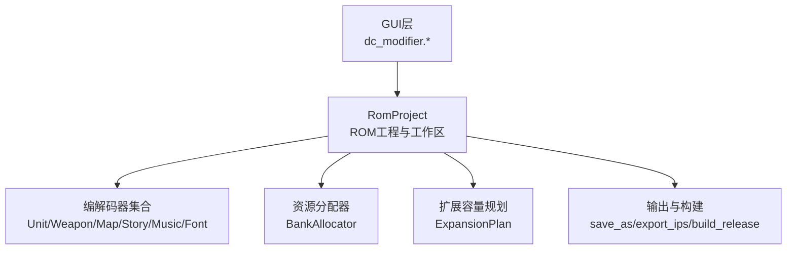
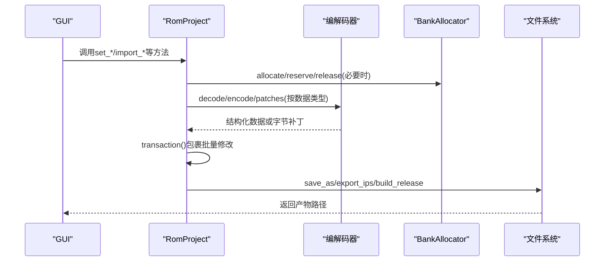
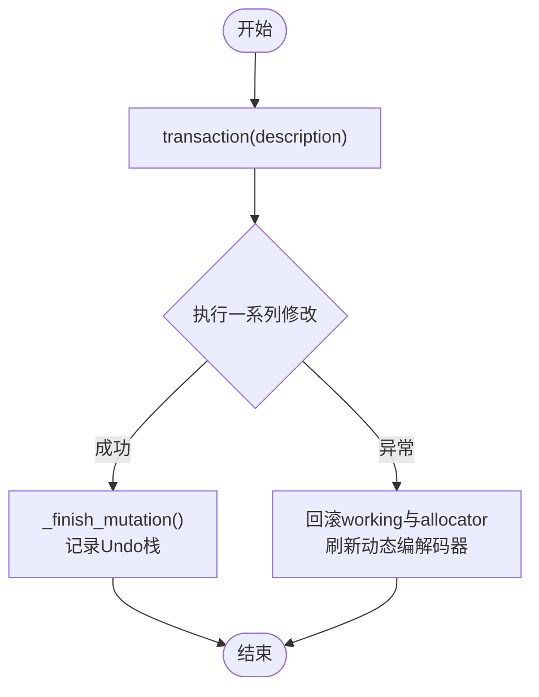
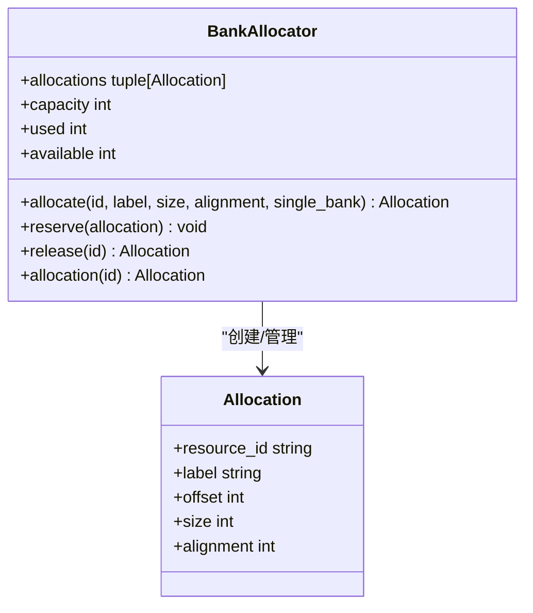
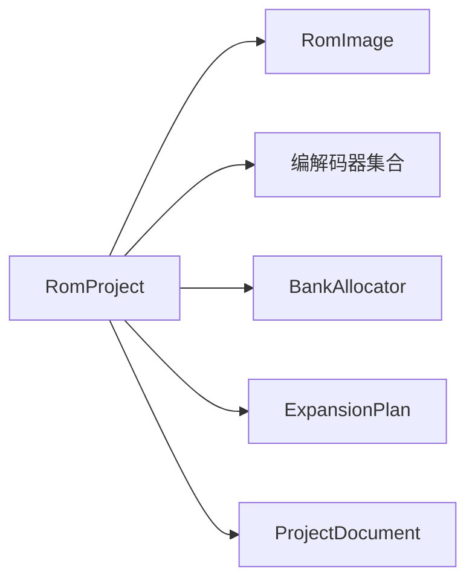

# API参考文档

<cite>
**本文引用的文件**
- [fc_rom_editor_core.py](file://src/fc_rom_editor_core.py)
- [resources.py](file://src/fc_editor/resources.py)
</cite>

## 目录
1. [简介](#简介)
2. [项目结构](#项目结构)
3. [核心组件](#核心组件)
4. [架构总览](#架构总览)
5. [详细组件分析](#详细组件分析)
6. [依赖关系分析](#依赖关系分析)
7. [性能注意事项](#性能注意事项)
8. [故障排查指南](#故障排查指南)
9. [结论](#结论)
10. [附录](#附录)

## 简介
本API参考文档面向二次开发者，系统化梳理DC修改器的公共接口与编程接口。重点覆盖：
- RomProject类的完整方法清单、参数说明、返回值类型与异常处理
- 编解码器API（Codec基类接口、各数据格式编解码方法、自定义扩展指南）
- 资源管理API（BankAllocator内存分配、资源导入/删除/查询）
- GUI API（页面开发、对话框、工具函数）
- 扩展API（插件接口、钩子机制、配置接口）

为保证准确性，本文所有接口行为均以源码为依据，并在相应章节提供“章节来源”定位到具体行号。

## 项目结构
本项目以ROM编辑为核心，围绕RomProject组织各类编解码器与资源管理器，并通过GUI模块暴露用户界面能力。关键入口与职责：
- RomProject：统一封装ROM镜像、工作区、扩展容量规划、编解码器绑定、事务与撤销重做、导出构建等
- 编解码器：按数据类型划分（机体、武器、地图、剧情文本、音乐、字模等），通过RomProject动态绑定
- 资源管理：BankAllocator负责PRG Bank级别的分配、保留、释放与冲突检测
- GUI：dc_modifier包提供页面、窗口、工具函数等UI能力

图表来源
- [fc_rom_editor_core.py:463-618](file://src/fc_rom_editor_core.py#L463-L618)
- [fc_rom_editor_core.py:1191-1273](file://src/fc_rom_editor_core.py#L1191-L1273)
- [fc_rom_editor_core.py:2786-2960](file://src/fc_rom_editor_core.py#L2786-L2960)

章节来源
- [fc_rom_editor_core.py:463-618](file://src/fc_rom_editor_core.py#L463-L618)
- [fc_rom_editor_core.py:1191-1273](file://src/fc_rom_editor_core.py#L1191-L1273)
- [fc_rom_editor_core.py:2786-2960](file://src/fc_rom_editor_core.py#L2786-L2960)

## 核心组件
本节聚焦RomProject的核心方法与能力边界，包括加载、事务、撤销重做、字段读写、地图/剧情/音乐/字体操作、构建输出等。

- 工程加载与初始化
  - load(path): 从路径加载ROM并构造工程
  - load_project(project_path, base_rom_path): 加载工程并应用增量修改，进行完整性校验
  - profile/source_sha256/expansion_plan: 只读属性，返回ROM画像、哈希、扩展计划

- 事务与历史
  - transaction(description): 上下文管理器，失败时回滚工作区与分配器状态
  - undo()/redo(): 基于EditHistoryEntry的字节级差异与Allocation快照恢复
  - can_undo/can_redo/undo_description/redo_description: 历史状态查询

- 字段与记录读写
  - get_value/set_value/reset_record(unit_id, field_key, value/text)
  - set_record_hex(unit_id, text): 高级记录十六进制写入
  - record_file_offset/record_bytes: 底层偏移与原始记录访问

- 武器与名称引用
  - weapon_*系列：读取/设置武器字段、名称指针与引用、还原
  - character_name_*系列：人物名称读取、替换、引用选项

- 地图与场景
  - map_*系列：地形、部署、事件与商店的读取/替换/还原
  - expansion_resource_data/import_expansion_resource/remove_expansion_resource: 扩展资源导入与管理

- 剧情文本与战斗音乐
  - story_text_*系列：读取/替换/还原，支持自动扩容组
  - battle_music_*系列：绑定/还原

- 字体与图块
  - set_font_glyphs/glyphs: 原子替换固定字模槽
  - chr_tile_pixels/set_chr_tile_pixels/set_chr_range/reset_chr_range: CHR图块像素读写

- 构建与导出
  - save_as/export_ips/build_release: 安全输出ROM、生成IPS补丁、一键构建产物与报告

章节来源
- [fc_rom_editor_core.py:638-674](file://src/fc_rom_editor_core.py#L638-L674)
- [fc_rom_editor_core.py:714-785](file://src/fc_rom_editor_core.py#L714-L785)
- [fc_rom_editor_core.py:1628-1673](file://src/fc_rom_editor_core.py#L1628-L1673)
- [fc_rom_editor_core.py:1675-1714](file://src/fc_rom_editor_core.py#L1675-L1714)
- [fc_rom_editor_core.py:1716-1965](file://src/fc_rom_editor_core.py#L1716-L1965)
- [fc_rom_editor_core.py:2144-2351](file://src/fc_rom_editor_core.py#L2144-L2351)
- [fc_rom_editor_core.py:2429-2548](file://src/fc_rom_editor_core.py#L2429-L2548)
- [fc_rom_editor_core.py:2550-2590](file://src/fc_rom_editor_core.py#L2550-L2590)
- [fc_rom_editor_core.py:1515-1564](file://src/fc_rom_editor_core.py#L1515-L1564)
- [fc_rom_editor_core.py:2786-2960](file://src/fc_rom_editor_core.py#L2786-L2960)

## 架构总览
RomProject作为编排中心，根据ROM画像与扩展计划动态绑定对应编解码器，并通过BankAllocator在PRG Bank层面进行资源分配与保护。GUI层通过调用RomProject暴露的高层API完成编辑任务。

图表来源
- [fc_rom_editor_core.py:714-785](file://src/fc_rom_editor_core.py#L714-L785)
- [fc_rom_editor_core.py:1440-1484](file://src/fc_rom_editor_core.py#L1440-L1484)
- [fc_rom_editor_core.py:2786-2960](file://src/fc_rom_editor_core.py#L2786-L2960)

## 详细组件分析

### RomProject类API详解
- 加载与生命周期
  - load/load_project: 构造RomImage与初始扩展计划，建立基础编解码器
  - reset_all: 恢复到original与初始分配状态，重新刷新动态编解码器

- 事务与撤销重做
  - transaction: 最外层捕获异常时回滚working与resource_allocator
  - undo/redo: 基于EditHistoryEntry的字节差异与Allocation快照恢复

- 字段与记录
  - get_value/set_value/reset_record: 按FieldSpec编码/解码，范围校验
  - set_record_hex: 直接写入原始记录，长度与合法性校验

- 名称与引用
  - unit/weapon/character名称读取、替换、引用选项与还原
  - 名称容量检查与终止符校验，避免越界

- 地图与场景
  - 地形/部署/事件与商店的读取、替换、还原；支持扩展池自动链接
  - map_resource_replacement_usage: 干运行容量反馈

- 剧情文本
  - 支持自动扩容组；descriptor一致性校验；失败回滚

- 构建与导出
  - save_as/export_ips/build_release: 安全输出、备份、完整性校验、报告生成

图表来源
- [fc_rom_editor_core.py:714-785](file://src/fc_rom_editor_core.py#L714-L785)
- [fc_rom_editor_core.py:692-713](file://src/fc_rom_editor_core.py#L692-L713)

章节来源
- [fc_rom_editor_core.py:638-674](file://src/fc_rom_editor_core.py#L638-L674)
- [fc_rom_editor_core.py:714-785](file://src/fc_rom_editor_core.py#L714-L785)
- [fc_rom_editor_core.py:1628-1673](file://src/fc_rom_editor_core.py#L1628-L1673)
- [fc_rom_editor_core.py:1716-1965](file://src/fc_rom_editor_core.py#L1716-L1965)
- [fc_rom_editor_core.py:2144-2351](file://src/fc_rom_editor_core.py#L2144-L2351)
- [fc_rom_editor_core.py:2429-2548](file://src/fc_rom_editor_core.py#L2429-L2548)
- [fc_rom_editor_core.py:2786-2960](file://src/fc_rom_editor_core.py#L2786-L2960)

### 编解码器API（Codec基类与实现）
- 基类接口（概念性）
  - decode(source, key/index): 将ROM字节序列解析为结构化对象
  - encode(obj): 将结构化对象编码为ROM字节序列
  - replacement_patch/patches: 计算最小字节补丁，用于原子更新
  - semantic_digest: 语义哈希，用于变更检测与报告

- 已实现的数据格式
  - Unit/UnitNameReference/UnitWeapon: 机体记录、名称引用、武器槽配置
  - Weapon/WeaponNameReference: 武器记录与名称引用
  - Map/ScenarioLayout/MapTrigger: 地图地形、部署布局、事件与商店
  - StoryText: 剧情文本组与记录
  - BattleMusic/CustomMusic: 战斗音乐绑定与可替换曲槽
  - ChrCodec: CHR图块像素编解码
  - LegacyGlobalDataCodec: 全局参数表（双击公式、伤害公式、命中阈值、道具效果/价格/名称、初始阵容、经验累计、距离命中修正）
  - MapTileAttributeCodec: 图块属性表

- 自定义编解码器开发指南
  - 遵循decode/encode/patches三件套，确保与原ROM结构一致
  - 使用replacement_patch/patches进行最小化更新，便于事务与撤销
  - 提供semantic_digest以便构建报告与变更追踪
  - 在RomProject中按需注册与动态绑定（如通过profile开关）

章节来源
- [fc_rom_editor_core.py:463-618](file://src/fc_rom_editor_core.py#L463-L618)
- [fc_rom_editor_core.py:963-1086](file://src/fc_rom_editor_core.py#L963-L1086)
- [fc_rom_editor_core.py:1097-1116](file://src/fc_rom_editor_core.py#L1097-L1116)
- [fc_rom_editor_core.py:1515-1564](file://src/fc_rom_editor_core.py#L1515-L1564)
- [fc_rom_editor_core.py:2429-2548](file://src/fc_rom_editor_core.py#L2429-L2548)
- [fc_rom_editor_core.py:2550-2590](file://src/fc_rom_editor_core.py#L2550-L2590)

### 资源管理API（BankAllocator）
- 分配与保留
  - allocate(resource_id, label, size, alignment, single_bank): 分配PRG Bank区域，写入payload
  - reserve(...): 保留分区（如自动扩展配额、未登记区保护）
  - release(resource_id): 释放已分配区域，恢复为original

- 查询与访问
  - allocation(resource_id): 获取分配元信息
  - expansion_allocations: 当前所有分配列表
  - expansion_capacity/used/available: 容量统计

- 典型流程
  - import_expansion_resource: 校验ID/标签/数据，分配并写入
  - remove_expansion_resource: 校验不可删分区，恢复original并释放

图表来源
- [fc_rom_editor_core.py:1440-1484](file://src/fc_rom_editor_core.py#L1440-L1484)
- [fc_rom_editor_core.py:1191-1273](file://src/fc_rom_editor_core.py#L1191-L1273)
- [resources.py:1-200](file://src/fc_editor/resources.py#L1-L200)

章节来源
- [fc_rom_editor_core.py:1191-1273](file://src/fc_rom_editor_core.py#L1191-L1273)
- [fc_rom_editor_core.py:1440-1484](file://src/fc_rom_editor_core.py#L1440-L1484)
- [resources.py:1-200](file://src/fc_editor/resources.py#L1-L200)

### GUI API（页面、对话框、工具函数）
- 页面开发接口
  - dc_modifier/pages.py: 页面基类与导航
  - dc_modifier/event_page.py/map_page/persuasion_page等: 具体业务页面
- 对话框API
  - 标准Qt对话框封装，用于确认、选择、输入等交互
- 工具函数库
  - 通用UI辅助：消息提示、进度条、表格渲染、资源预览等

注：本节为概念性概述，具体实现细节请参考dc_modifier包内文件。

章节来源
- [dc_modifier/pages.py](file://src/dc_modifier/pages.py)
- [dc_modifier/event_page.py](file://src/dc_modifier/event_page.py)
- [dc_modifier/map_page.py](file://src/dc_modifier/map_page.py)
- [dc_modifier/persuasion_page.py](file://src/dc_modifier/persuasion_page.py)

### 扩展API（插件、钩子、配置）
- 插件接口
  - 通过RomProject的动态编解码器绑定机制，允许外部模块注入新的Codec实现
- 钩子机制
  - transaction/_finish_mutation提供插入点，便于审计日志、增量同步等
- 配置接口
  - profile.key/profile.label/profile.*: ROM画像与能力开关
  - ExpansionPlan: 扩展容量规划与标志位

章节来源
- [fc_rom_editor_core.py:463-618](file://src/fc_rom_editor_core.py#L463-L618)
- [fc_rom_editor_core.py:714-785](file://src/fc_rom_editor_core.py#L714-L785)
- [fc_rom_editor_core.py:1191-1273](file://src/fc_rom_editor_core.py#L1191-L1273)

## 依赖关系分析
RomProject依赖以下核心模块：
- RomImage: ROM镜像与画像
- 编解码器集合: 按数据类型解耦
- BankAllocator: PRG Bank资源管理
- ExpansionPlan: 扩展容量规划
- ProjectDocument: 工程持久化

图表来源
- [fc_rom_editor_core.py:463-618](file://src/fc_rom_editor_core.py#L463-L618)
- [fc_rom_editor_core.py:1191-1273](file://src/fc_rom_editor_core.py#L1191-L1273)
- [fc_rom_editor_core.py:2962-3199](file://src/fc_rom_editor_core.py#L2962-L3199)

章节来源
- [fc_rom_editor_core.py:463-618](file://src/fc_rom_editor_core.py#L463-L618)
- [fc_rom_editor_core.py:2962-3199](file://src/fc_rom_editor_core.py#L2962-L3199)

## 性能注意事项
- 事务与撤销：尽量将相关修改放入同一transaction，减少多次快照与差异计算开销
- 最小补丁：优先使用replacement_patch/patches，避免整块写入
- 批量操作：对大量字段修改采用循环+事务包裹，提升效率
- 容量规划：使用configure_expansion与自动链接器，避免手动分配导致的碎片与冲突
- 构建报告：change_rows/change_ranges仅扫描必要区间，避免全量比对

## 故障排查指南
- 常见异常与处理
  - RomFormatError: ROM结构不匹配或验证失败（如缺少$FF终止符、容量不足）
  - ValueError: 参数非法（如资源ID格式、空数据、超出范围）
  - ProjectFormatError: 工程完整性检查失败（加载工程时报错）
- 排查步骤
  - 使用validate()获取问题清单，定位错误级别与模块
  - 检查transaction是否被正确包裹，异常是否触发回滚
  - 核对ExpansionPlan与BankAllocator状态，确认分区未被误删
  - 对于名称/文本替换，确认容量与终止符，避免越界
- 日志与调试
  - change_description(offset)可识别修改位置所属语义区域
  - build_release生成的报告包含changedRanges与managedAllocations，便于定位

章节来源
- [fc_rom_editor_core.py:638-674](file://src/fc_rom_editor_core.py#L638-L674)
- [fc_rom_editor_core.py:2645-2658](file://src/fc_rom_editor_core.py#L2645-L2658)
- [fc_rom_editor_core.py:2660-2784](file://src/fc_rom_editor_core.py#L2660-L2784)

## 结论
RomProject提供了稳定、可追溯、可扩展的ROM编辑API体系。通过事务与撤销、最小补丁、容量规划与构建报告，保障了修改的安全性与可维护性。结合GUI与扩展机制，可满足多样化二次开发需求。

## 附录
- 示例用法（以路径引用代替代码片段）
  - 加载工程并设置字段值：参见[load_project:644-674](file://src/fc_rom_editor_core.py#L644-L674)、[set_value:1639-1652](file://src/fc_rom_editor_core.py#L1639-L1652)
  - 导入扩展资源：参见[import_expansion_resource:1440-1472](file://src/fc_rom_editor_core.py#L1440-L1472)
  - 替换剧情文本并自动扩容：参见[set_story_text_raw:2463-2527](file://src/fc_rom_editor_core.py#L2463-L2527)
  - 一键构建产物：参见[build_release:2815-2960](file://src/fc_rom_editor_core.py#L2815-L2960)