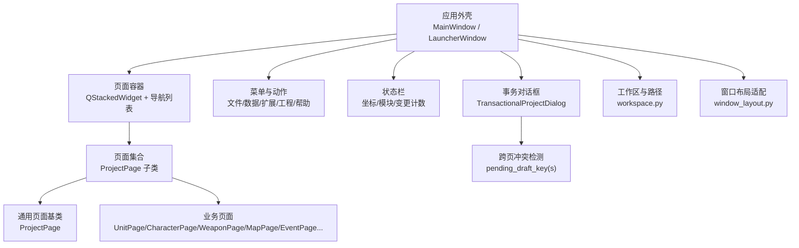
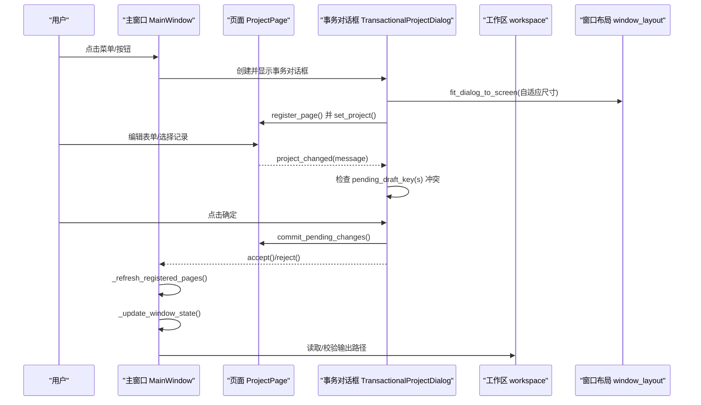
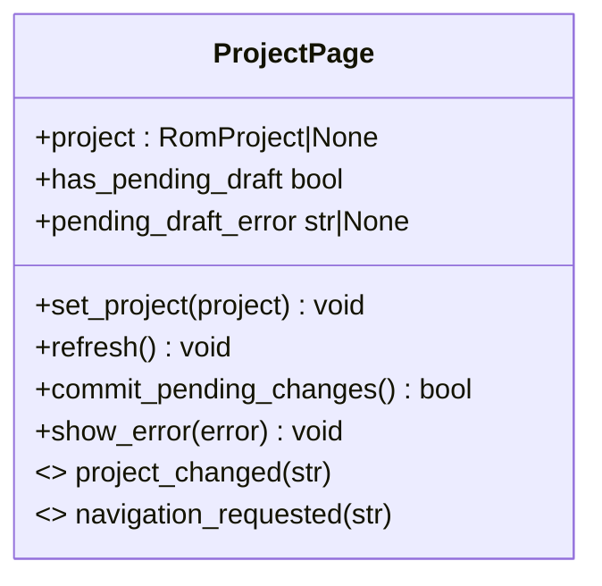
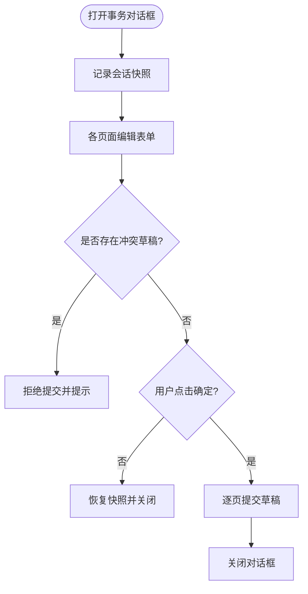
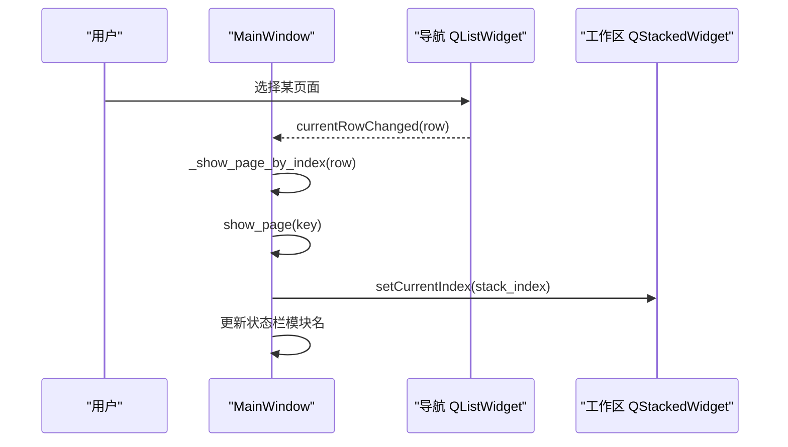
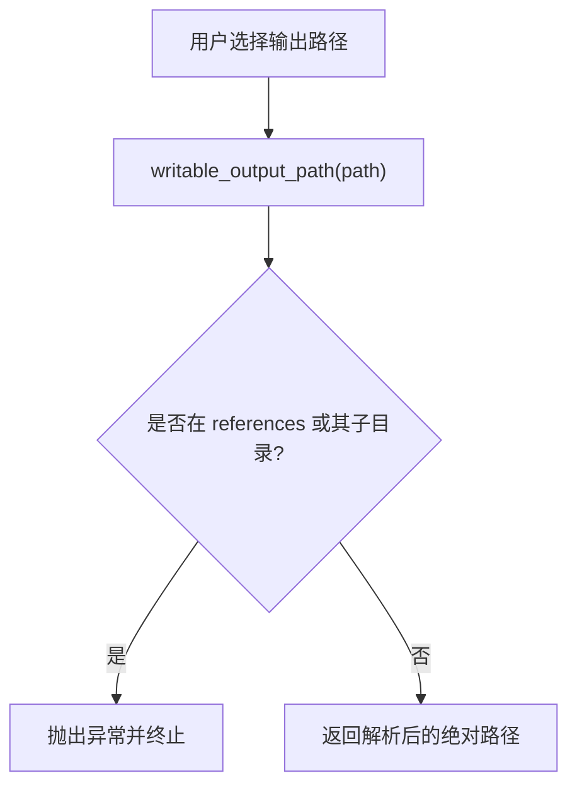
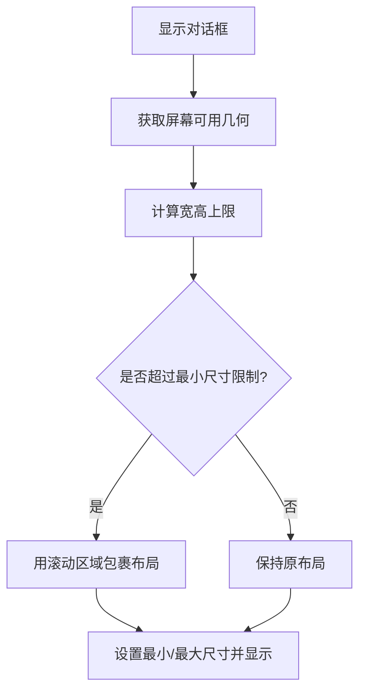
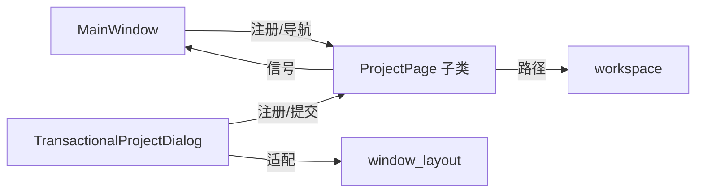

# GUI界面API

<cite>
**本文引用的文件**
- [app.py](file://src/dc_modifier/app.py)
- [pages.py](file://src/dc_modifier/pages.py)
- [workspace.py](file://src/dc_modifier/workspace.py)
- [window_layout.py](file://src/dc_modifier/window_layout.py)
- [legacy_windows.py](file://src/dc_modifier/legacy_windows.py)
- [map_page.py](file://src/dc_modifier/map_page.py)
- [database_records.py](file://src/dc_modifier/database_records.py)
- [event_page.py](file://src/dc_modifier/event_page.py)
</cite>

## 目录
1. [简介](#简介)
2. [项目结构](#项目结构)
3. [核心组件](#核心组件)
4. [架构总览](#架构总览)
5. [详细组件分析](#详细组件分析)
6. [依赖关系分析](#依赖关系分析)
7. [性能与响应式设计](#性能与响应式设计)
8. [故障排查指南](#故障排查指南)
9. [结论](#结论)
10. [附录：扩展开发指南与最佳实践](#附录：扩展开发指南与最佳实践)

## 简介
本文件面向PySide6图形界面的开发与扩展，系统化记录本项目GUI的API与组件库。重点包括：
- 页面基类 PageBase（实际实现为 ProjectPage）的继承与使用方式
- 对话框开发模式（事务型窗口、会话快照、撤销/重做保护）
- 用户交互事件处理（信号/槽、状态同步、草稿暂存）
- 工作区管理接口（Workspace）、窗口布局系统、UI状态同步机制
- 样式定制API、主题切换能力、响应式界面设计
- GUI扩展开发指南：自定义页面、插件集成、用户体验优化建议
- 具体UI组件使用示例与最佳实践（以路径引用形式提供）

## 项目结构
本项目采用“应用外壳 + 页面模块 + 工具对话框”的分层组织：
- 应用外壳：主窗口、菜单、动作、全局样式、启动器
- 页面模块：按功能划分的可复用页面（机体、人物、武器、地图、事件、剧情等）
- 工具对话框：数据库、字体库、动画编辑器、文本转换器等独立工具
- 工作区与布局：默认ROM路径、输出路径校验、小屏适配与滚动包裹

图表来源
- [app.py:276-488](file://src/dc_modifier/app.py#L276-L488)
- [pages.py:103-152](file://src/dc_modifier/pages.py#L103-L152)
- [legacy_windows.py:71-259](file://src/dc_modifier/legacy_windows.py#L71-L259)
- [workspace.py:7-42](file://src/dc_modifier/workspace.py#L7-L42)
- [window_layout.py:5-24](file://src/dc_modifier/window_layout.py#L5-L24)

章节来源
- [app.py:236-488](file://src/dc_modifier/app.py#L236-L488)
- [workspace.py:7-42](file://src/dc_modifier/workspace.py#L7-L42)
- [window_layout.py:1-24](file://src/dc_modifier/window_layout.py#L1-L24)

## 核心组件
- 页面基类 ProjectPage
  - 统一生命周期：set_project、refresh、has_pending_draft、commit_pending_changes、show_error
  - 信号：project_changed、navigation_requested
  - 用于承载业务页面的表单草稿与提交逻辑
- 事务型对话框 TransactionalProjectDialog
  - 会话级快照：working字节、资源分配、撤销/重做栈
  - 接受/取消时批量提交或回滚
  - 跨页冲突检测：基于 pending_draft_key(s) 与 transaction_sync_group
- 主窗口 MainWindow
  - 页面注册与导航、菜单/动作绑定、状态栏更新
  - 打开/保存工程、导出、构建、验证等入口
  - 通过 QStackedWidget 管理多页面显示
- 工作区 workspace
  - 默认ROM路径、输出路径校验（禁止写入 references）
- 窗口布局 window_layout
  - 小屏/高DPI下自动包裹滚动区域，保证控件可见

章节来源
- [pages.py:103-152](file://src/dc_modifier/pages.py#L103-L152)
- [legacy_windows.py:71-259](file://src/dc_modifier/legacy_windows.py#L71-L259)
- [app.py:276-488](file://src/dc_modifier/app.py#L276-L488)
- [workspace.py:7-42](file://src/dc_modifier/workspace.py#L7-L42)
- [window_layout.py:5-24](file://src/dc_modifier/window_layout.py#L5-L24)

## 架构总览
下图展示从用户操作到页面刷新、再到事务提交的完整流程。

图表来源
- [app.py:494-505](file://src/dc_modifier/app.py#L494-L505)
- [legacy_windows.py:177-259](file://src/dc_modifier/legacy_windows.py#L177-L259)
- [window_layout.py:5-24](file://src/dc_modifier/window_layout.py#L5-L24)
- [workspace.py:29-42](file://src/dc_modifier/workspace.py#L29-L42)

## 详细组件分析

### 页面基类 ProjectPage（PageBase）
- 职责
  - 统一管理页面与 RomProject 的关系
  - 提供草稿机制：has_pending_draft、pending_draft_error、commit_pending_changes
  - 提供错误提示：show_error
  - 暴露信号：project_changed、navigation_requested
- 典型用法
  - 继承 ProjectPage 实现具体页面
  - 在表单字段值变化时调用 _update_pending_state 等方法设置 apply_button 可用性与状态文案
  - 在提交时修改 project.working 并触发 refresh 刷新UI

图表来源
- [pages.py:103-152](file://src/dc_modifier/pages.py#L103-L152)

章节来源
- [pages.py:103-152](file://src/dc_modifier/pages.py#L103-L152)

### 事务型对话框与跨页冲突检测
- 会话快照
  - 打开时记录 working、allocations、undo_stack、redo_stack
  - 取消时恢复这些状态，确保未确认的修改不污染工程
- 跨页冲突
  - 通过 pending_draft_key(s) 与 transaction_sync_group 识别同一资源的并发草稿
  - 阻止同时存在多个编辑页对同一指令/记录的未提交草稿

图表来源
- [legacy_windows.py:71-259](file://src/dc_modifier/legacy_windows.py#L71-L259)
- [legacy_windows.py:262-317](file://src/dc_modifier/legacy_windows.py#L262-L317)

章节来源
- [legacy_windows.py:71-259](file://src/dc_modifier/legacy_windows.py#L71-L259)
- [legacy_windows.py:262-317](file://src/dc_modifier/legacy_windows.py#L262-L317)

### 主窗口与页面导航
- 页面注册
  - 通过 _add_page 将页面加入导航列表与工作区堆叠
  - 绑定 project_changed 与 navigation_requested 信号
- 页面切换
  - show_page 负责激活页面、刷新待失效页面、更新状态栏模块名
- 菜单与动作
  - 文件/数据/扩展/工程/帮助菜单统一由 _create_menus 装配
  - 常用快捷键绑定于 _create_actions

图表来源
- [app.py:342-385](file://src/dc_modifier/app.py#L342-L385)
- [app.py:387-488](file://src/dc_modifier/app.py#L387-L488)

章节来源
- [app.py:342-488](file://src/dc_modifier/app.py#L342-L488)

### 工作区管理与路径安全
- 默认ROM与工作目录
  - 根据运行环境（打包/开发）定位 ROOT，并选择默认ROM
- 输出路径保护
  - default_export_path 生成默认导出目录
  - writable_output_path 禁止写入 references 目录，避免误覆盖参考数据

图表来源
- [workspace.py:29-42](file://src/dc_modifier/workspace.py#L29-L42)

章节来源
- [workspace.py:7-42](file://src/dc_modifier/workspace.py#L7-L42)

### 窗口布局与响应式适配
- 小屏/高DPI适配
  - fit_dialog_to_screen 检测最小尺寸是否超出屏幕可用区域
  - 若固定尺寸过大，则用 QScrollArea 包裹原布局，确保所有控件可见
- 尺寸限制
  - 动态设置最小/最大尺寸，启用尺寸手柄便于手动调整

图表来源
- [window_layout.py:5-24](file://src/dc_modifier/window_layout.py#L5-L24)

章节来源
- [window_layout.py:1-24](file://src/dc_modifier/window_layout.py#L1-L24)

### UI状态同步机制
- 页面草稿状态
  - has_pending_draft 基于 apply_button 可用性判断
  - pending_draft_error 允许页面提供无法提交的说明
- 跨页同步
  - TransactionalProjectDialog 在某一页变更后，刷新同组其他页面（transaction_sync_group）
- 主窗口状态
  - 监听 map_page 坐标变化更新状态栏
  - 监听页面变更消息更新窗口标题/状态栏

章节来源
- [pages.py:118-152](file://src/dc_modifier/pages.py#L118-L152)
- [legacy_windows.py:116-129](file://src/dc_modifier/legacy_windows.py#L116-L129)
- [app.py:490-509](file://src/dc_modifier/app.py#L490-L509)

### 样式定制与主题切换
- 全局样式表
  - 定义 QMainWindow/QDialog/QWidget 背景、颜色、边框、悬停态、禁用态等
  - 针对标签、分组框、按钮、输入框、表格头等进行精细化样式
- 主题切换
  - 可通过替换 STYLE_SHEET 或在运行时调用 QApplication.setStyleSheet 切换主题
  - 建议使用对象名（如 #pageTitle、#sectionTitle）进行语义化样式控制

章节来源
- [app.py:128-233](file://src/dc_modifier/app.py#L128-L233)

### 具体页面与组件示例（路径引用）
- 机体编辑页面 UnitPage
  - 搜索、分页、复制/粘贴/还原记录、导出 .dcunit
  - 名称引用、武器槽、能力参数、原始记录写入
  - 参考路径：[pages.py:514-800](file://src/dc_modifier/pages.py#L514-L800)
- 人物/武器可读页面 ReadableCharacterPage / ReadableWeaponPage
  - 折叠技术详情、头像导出、能力状态提示
  - 参考路径：[database_records.py:105-200](file://src/dc_modifier/database_records.py#L105-L200)
- 战场事件页面 EventPage
  - 章节/阶段/类型过滤、模板参数编辑、原始字节编辑
  - 参考路径：[event_page.py:66-200](file://src/dc_modifier/event_page.py#L66-L200)
- 地图相关渲染与图标
  - 单位图标渲染、地形按钮、调色板常量
  - 参考路径：[map_page.py:88-156](file://src/dc_modifier/map_page.py#L88-L156)

章节来源
- [pages.py:514-800](file://src/dc_modifier/pages.py#L514-L800)
- [database_records.py:105-200](file://src/dc_modifier/database_records.py#L105-L200)
- [event_page.py:66-200](file://src/dc_modifier/event_page.py#L66-L200)
- [map_page.py:88-156](file://src/dc_modifier/map_page.py#L88-L156)

## 依赖关系分析
- 页面与主窗口的耦合
  - 主窗口负责页面注册、导航、菜单绑定；页面通过信号与主窗口通信
- 事务对话框与页面
  - 通过 register_page 注入页面，集中管理提交/回滚与冲突检测
- 工作区与路径
  - 页面与导出功能依赖 workspace 提供的路径校验与默认路径
- 布局适配
  - 对话框统一通过 window_layout 适配不同屏幕

图表来源
- [app.py:342-488](file://src/dc_modifier/app.py#L342-L488)
- [legacy_windows.py:102-129](file://src/dc_modifier/legacy_windows.py#L102-L129)
- [workspace.py:29-42](file://src/dc_modifier/workspace.py#L29-L42)
- [window_layout.py:5-24](file://src/dc_modifier/window_layout.py#L5-L24)

章节来源
- [app.py:342-488](file://src/dc_modifier/app.py#L342-L488)
- [legacy_windows.py:102-129](file://src/dc_modifier/legacy_windows.py#L102-L129)
- [workspace.py:29-42](file://src/dc_modifier/workspace.py#L29-L42)
- [window_layout.py:5-24](file://src/dc_modifier/window_layout.py#L5-L24)

## 性能与响应式设计
- 列表与表格
  - 使用 QListWidget/QTableWidget 并开启交替行色、均匀项大小以提升渲染效率
  - 批量更新前 blockSignals 与 updatesEnabled(False)，减少重绘
- 滚动与自适应
  - 大表单通过 QScrollArea 包裹，避免在小屏上不可见
- 状态同步
  - 仅在必要时刷新页面，避免频繁全量重建
- 样式
  - 使用简洁的QSS，避免过度复杂渐变与阴影影响性能

章节来源
- [pages.py:243-450](file://src/dc_modifier/pages.py#L243-L450)
- [window_layout.py:5-24](file://src/dc_modifier/window_layout.py#L5-L24)
- [app.py:128-233](file://src/dc_modifier/app.py#L128-L233)

## 故障排查指南
- 无法提交草稿
  - 检查页面 pending_draft_error 是否返回错误信息
  - 确认 apply_button 已启用且表单值有效
  - 参考路径：[pages.py:118-152](file://src/dc_modifier/pages.py#L118-L152)
- 跨页冲突
  - 检查 pending_draft_key(s) 与 transaction_sync_group 是否指向同一资源
  - 参考路径：[legacy_windows.py:131-160](file://src/dc_modifier/legacy_windows.py#L131-L160)
- 输出路径被拒绝
  - 确保目标不在 references 目录下
  - 参考路径：[workspace.py:37-42](file://src/dc_modifier/workspace.py#L37-L42)
- 对话框控件不可见
  - 使用 fit_dialog_to_screen 包裹布局，启用滚动
  - 参考路径：[window_layout.py:5-24](file://src/dc_modifier/window_layout.py#L5-L24)

章节来源
- [pages.py:118-152](file://src/dc_modifier/pages.py#L118-L152)
- [legacy_windows.py:131-160](file://src/dc_modifier/legacy_windows.py#L131-L160)
- [workspace.py:37-42](file://src/dc_modifier/workspace.py#L37-L42)
- [window_layout.py:5-24](file://src/dc_modifier/window_layout.py#L5-L24)

## 结论
本项目GUI以 ProjectPage 为核心抽象，结合事务型对话框与主窗口导航，实现了模块化、可测试、可扩展的界面体系。通过工作区路径保护与窗口布局适配，保证了安全性与可用性。样式表提供了统一的视觉风格，支持主题切换。遵循本文档的扩展指南，可快速添加新页面与工具，提升用户体验与开发效率。

## 附录：扩展开发指南与最佳实践
- 自定义页面开发
  - 继承 ProjectPage，实现 set_project、refresh、load_record、_update_pending_state、apply_record 等方法
  - 使用 page_title 生成语义化标题与副标题
  - 通过 project_changed 通知主窗口刷新，通过 navigation_requested 请求跳转
  - 参考路径：[pages.py:103-152](file://src/dc_modifier/pages.py#L103-L152)
- 插件集成
  - 在主窗口中通过 _add_page 注册新页面，并在菜单中提供入口
  - 如需事务性编辑，使用 TransactionalProjectDialog.register_page 包装页面
  - 参考路径：[app.py:342-365](file://src/dc_modifier/app.py#L342-L365)、[legacy_windows.py:102-114](file://src/dc_modifier/legacy_windows.py#L102-L114)
- 用户体验优化
  - 使用 SearchableRecordPage 提供的搜索、翻页、上下文菜单能力
  - 合理使用 QSplitter 分割列表与详情区域，提升信息密度
  - 使用 QScrollArea 包裹复杂表单，避免溢出
  - 使用样式对象名（如 #pendingBanner、#sectionTitle）统一视觉反馈
  - 参考路径：[pages.py:243-450](file://src/dc_modifier/pages.py#L243-L450)、[app.py:128-233](file://src/dc_modifier/app.py#L128-L233)
- 常见最佳实践
  - 表单改动后立即更新 pending 状态与按钮可用性
  - 提交前校验输入，失败时通过 show_error 提示
  - 避免在 refresh 中进行昂贵计算，必要时延迟或缓存
  - 使用 writable_output_path 保护参考数据不被覆盖
  - 对小屏设备使用 fit_dialog_to_screen 确保控件可见

章节来源
- [pages.py:243-450](file://src/dc_modifier/pages.py#L243-L450)
- [app.py:128-233](file://src/dc_modifier/app.py#L128-L233)
- [workspace.py:29-42](file://src/dc_modifier/workspace.py#L29-L42)
- [window_layout.py:5-24](file://src/dc_modifier/window_layout.py#L5-L24)