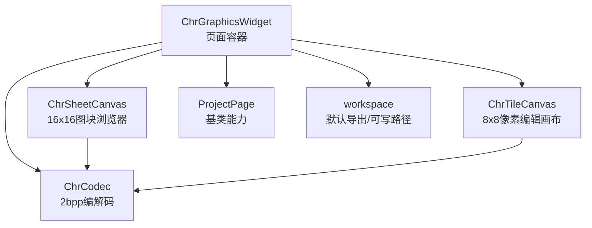
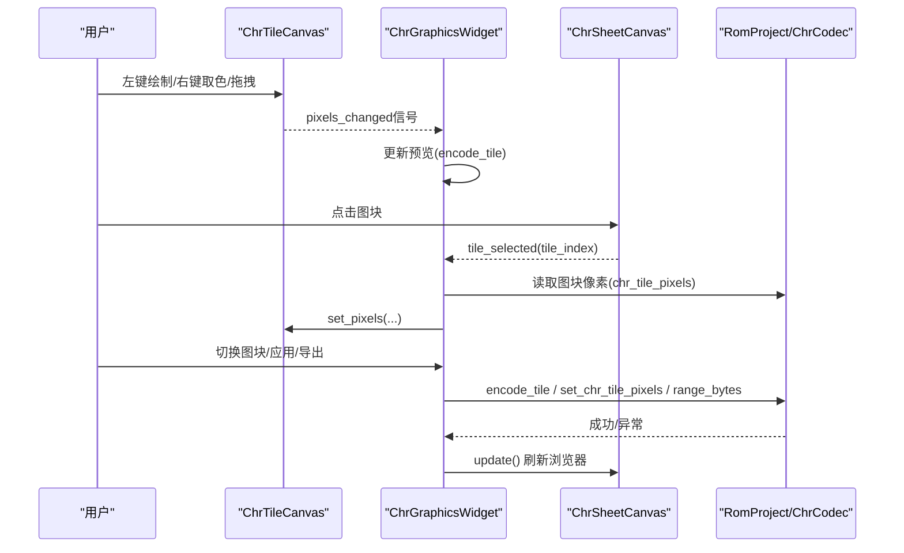
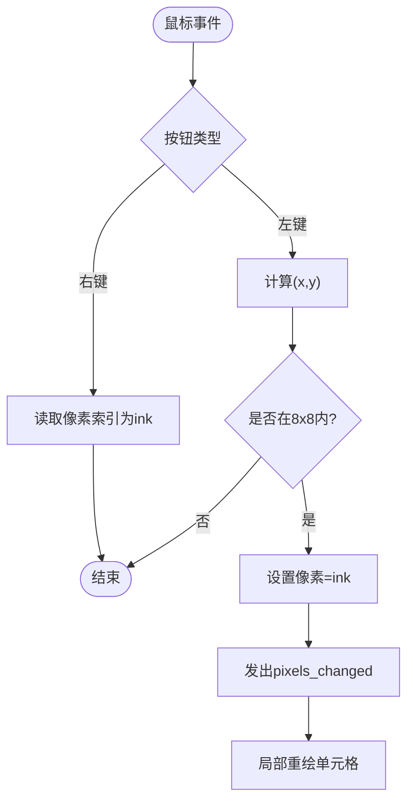
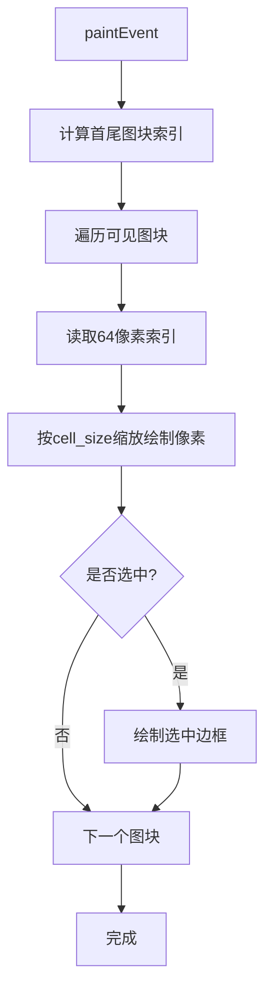
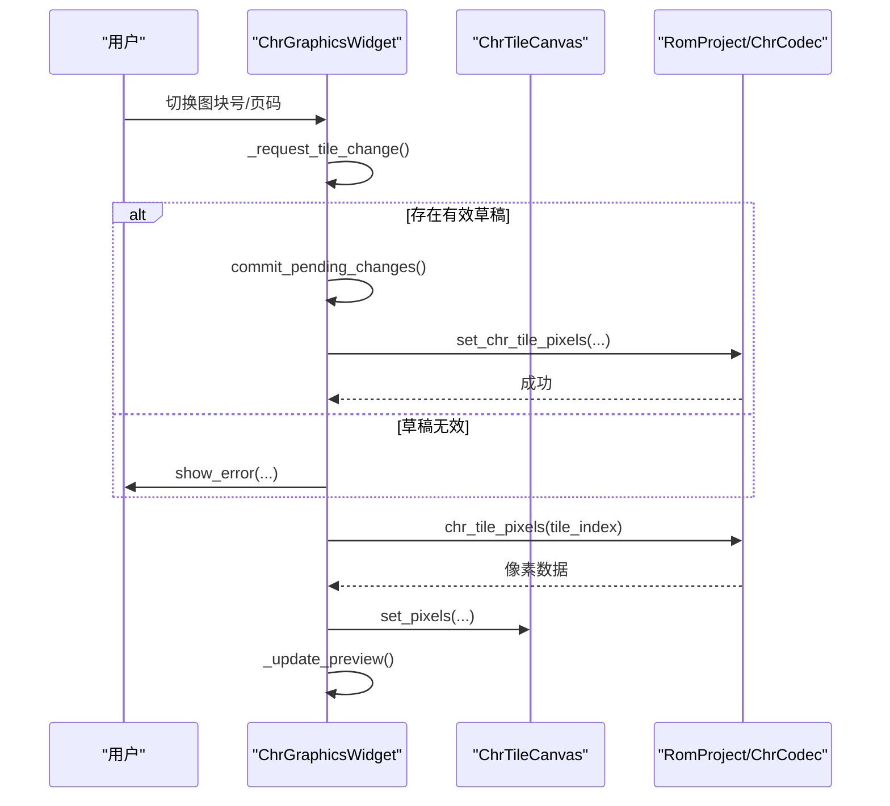
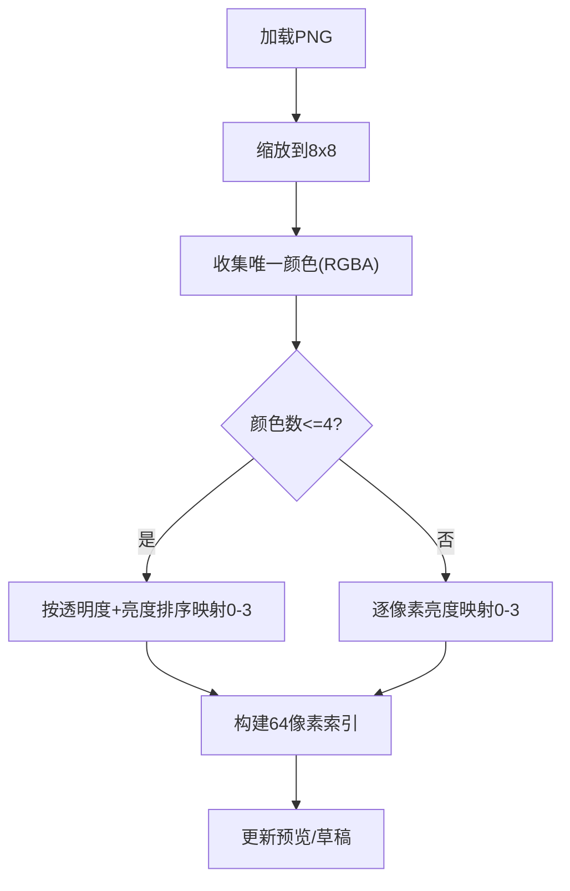
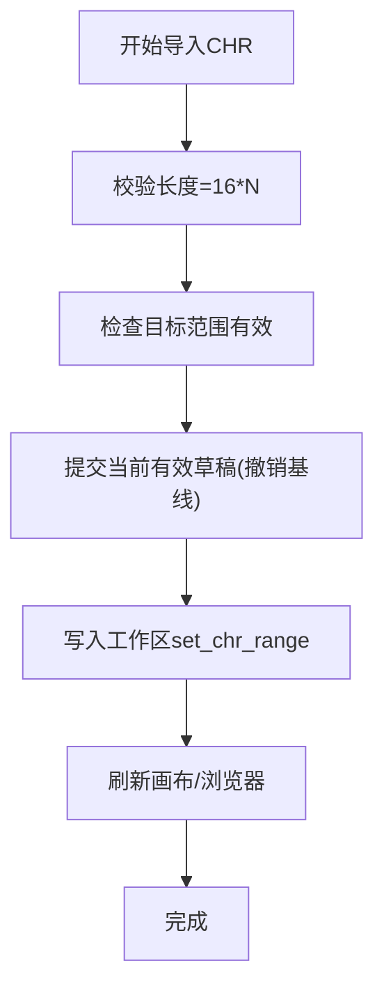
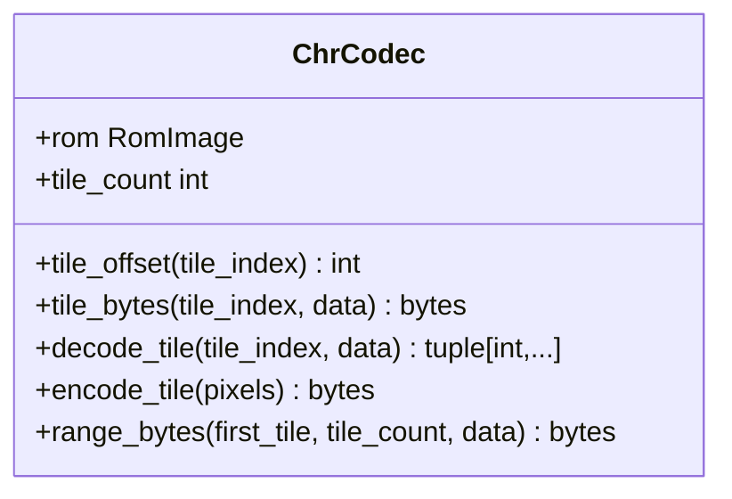
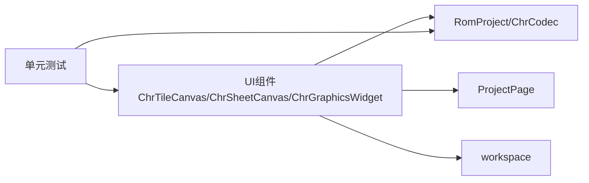

# CHR图块编辑器

<cite>
**本文引用的文件**
- [chr_widget.py](file://src/dc_modifier/chr_widget.py)
- [chr.py](file://src/fc_editor/codecs/chr.py)
- [pages.py](file://src/dc_modifier/pages.py)
- [workspace.py](file://src/dc_modifier/workspace.py)
- [test_chr_widget_drafts.py](file://tests/test_chr_widget_drafts.py)
</cite>

## 目录
1. [简介](#简介)
2. [项目结构](#项目结构)
3. [核心组件](#核心组件)
4. [架构总览](#架构总览)
5. [详细组件分析](#详细组件分析)
6. [依赖关系分析](#依赖关系分析)
7. [性能考量](#性能考量)
8. [故障排查指南](#故障排查指南)
9. [结论](#结论)
10. [附录：集成示例与最佳实践](#附录：集成示例与最佳实践)

## 简介
本文件面向FC（红白机）CHR图块编辑器的实现，重点说明以下两个UI组件的工作原理与使用方法：
- ChrTileCanvas：用于在8×8像素网格上直接绘制和编辑单个NES 2bpp图块的画布。
- ChrSheetCanvas：用于浏览整个CHR图块表（每页256个图块），支持分页显示、图块选择与高亮。

文档将深入解释：
- 8×8像素网格的绘制机制与颜色索引映射算法（0—3的2bpp索引）。
- 鼠标交互处理（左键绘制、右键取色、拖拽绘制）。
- 图块浏览器的分页显示逻辑与选择机制。
- PNG导入/导出的图像处理流程、颜色量化策略与透明度处理。
- 批量CHR导入/导出与“草稿”机制（未提交更改的安全保护）。
- 与项目工作区、ROM编解码器（ChrCodec）的集成方式。
- 事件处理、数据绑定、错误处理的完整集成示例与最佳实践。

## 项目结构
与CHR编辑器相关的代码主要分布在以下模块：
- UI层：ChrTileCanvas、ChrSheetCanvas、ChrGraphicsWidget（页面容器）位于 dc_modifier.chr_widget。
- 数据编解码：ChrCodec 负责CHR-ROM中2bpp图块的编码/解码与范围读写，位于 fc_editor.codecs.chr。
- 页面基类与通用能力：ProjectPage 提供项目注入、刷新、待提交草稿等通用接口，位于 dc_modifier.pages。
- 工作区与输出路径：默认导出路径、可写输出校验，位于 dc_modifier.workspace。
- 行为验证：单元测试覆盖草稿提交、导入导出、撤销栈等行为，位于 tests.test_chr_widget_drafts。

图表来源
- [chr_widget.py:33-160](file://src/dc_modifier/chr_widget.py#L33-L160)
- [chr_widget.py:162-447](file://src/dc_modifier/chr_widget.py#L162-L447)
- [chr.py:11-94](file://src/fc_editor/codecs/chr.py#L11-L94)
- [pages.py:103-152](file://src/dc_modifier/pages.py#L103-L152)
- [workspace.py:29-42](file://src/dc_modifier/workspace.py#L29-L42)

章节来源
- [chr_widget.py:33-160](file://src/dc_modifier/chr_widget.py#L33-L160)
- [chr_widget.py:162-447](file://src/dc_modifier/chr_widget.py#L162-L447)
- [chr.py:11-94](file://src/fc_editor/codecs/chr.py#L11-L94)
- [pages.py:103-152](file://src/dc_modifier/pages.py#L103-L152)
- [workspace.py:29-42](file://src/dc_modifier/workspace.py#L29-L42)

## 核心组件
- ChrTileCanvas：8×8像素编辑画布，维护像素索引数组（长度64）、当前画笔索引（0—3）、单元格尺寸；支持鼠标左键绘制、右键取色、拖拽绘制；通过信号通知像素变更并局部重绘。
- ChrSheetCanvas：16×16缩略图浏览器，按页（每页256图块）渲染，计算每个图块的像素位置并缩放绘制；点击图块发射选中信号；高亮当前选中图块。
- ChrGraphicsWidget：页面容器，组合浏览器与画布，提供图块号输入、颜色选择、导入PNG/CHR、导出PNG/CHR、批量操作、预览十六进制字节等功能；管理“草稿”状态与提交逻辑。
- ChrCodec：读取/写入ROM中的CHR区域，解码为64个像素索引或编码为16字节2bpp数据；支持范围读取与偏移计算。
- ProjectPage：提供项目注入、刷新、待提交草稿检测、错误提示等通用能力。
- workspace：提供默认导出路径与可写输出路径校验，避免误写到只读参考目录。

章节来源
- [chr_widget.py:33-160](file://src/dc_modifier/chr_widget.py#L33-L160)
- [chr_widget.py:162-447](file://src/dc_modifier/chr_widget.py#L162-L447)
- [chr.py:11-94](file://src/fc_editor/codecs/chr.py#L11-L94)
- [pages.py:103-152](file://src/dc_modifier/pages.py#L103-L152)
- [workspace.py:29-42](file://src/dc_modifier/workspace.py#L29-L42)

## 架构总览
下图展示从用户交互到数据持久化的整体流程：用户在ChrTileCanvas绘制像素，触发信号更新预览与草稿；切换图块或提交时，将草稿编码并通过ChrCodec写入工作区；浏览器同步更新以反映最新状态。

图表来源
- [chr_widget.py:33-160](file://src/dc_modifier/chr_widget.py#L33-L160)
- [chr_widget.py:162-447](file://src/dc_modifier/chr_widget.py#L162-L447)
- [chr.py:11-94](file://src/fc_editor/codecs/chr.py#L11-L94)

## 详细组件分析

### ChrTileCanvas：8×8像素网格绘制与鼠标交互
- 网格绘制：paintEvent遍历8×8行列，根据像素索引从预定义调色板获取颜色填充矩形，并绘制半透明边框以区分单元格。
- 鼠标交互：
  - 左键按下/移动：计算坐标对应的(x,y)，若有效则设置对应像素为当前ink值，并发出pixels_changed信号，局部重绘该单元格。
  - 右键按下：在当前单元格执行“取色”，将该像素索引设为当前ink。
- 性能优化：仅重绘被修改的单元格区域，避免整屏重绘。

图表来源
- [chr_widget.py:51-90](file://src/dc_modifier/chr_widget.py#L51-L90)

章节来源
- [chr_widget.py:33-90](file://src/dc_modifier/chr_widget.py#L33-L90)

### ChrSheetCanvas：图块浏览器与分页显示
- 分页逻辑：每页固定256个图块，first_tile = page * 256，last_tile = min(first_tile + 256, chr_tile_count)。
- 渲染：对每个可见图块，读取其64个像素索引，按cell_size缩放后逐像素绘制；选中图块用蓝色边框高亮。
- 交互：计算点击行列，转换为全局图块索引，若有效则发射tile_selected信号。

图表来源
- [chr_widget.py:121-160](file://src/dc_modifier/chr_widget.py#L121-L160)

章节来源
- [chr_widget.py:92-160](file://src/dc_modifier/chr_widget.py#L92-L160)

### ChrGraphicsWidget：页面容器、数据绑定与草稿机制
- 界面组成：左侧为图块浏览器（含页码控件），右侧为8×8放大编辑画布与十六进制预览；下方为工具组（应用、还原、导入PNG/CHR、导出PNG/CHR、批量数量）。
- 数据绑定：
  - 图块号输入框与浏览器页码联动，确保两者一致。
  - 选择图块时加载对应像素到画布，并更新位置信息（Bank、偏移）。
- 草稿机制：
  - has_pending_draft：比较画布像素与项目当前图块像素，判断是否存在未提交的更改。
  - pending_draft_error：尝试编码画布像素，捕获无效数据（如像素索引不在0—3）。
  - commit_pending_changes：在切换图块或关闭对话框前，自动提交有效草稿；若失败则阻止操作并提示错误。
- 预览：实时调用编码器生成十六进制字符串，便于调试。

图表来源
- [chr_widget.py:373-447](file://src/dc_modifier/chr_widget.py#L373-L447)

章节来源
- [chr_widget.py:162-447](file://src/dc_modifier/chr_widget.py#L162-L447)
- [pages.py:103-152](file://src/dc_modifier/pages.py#L103-L152)

### 颜色索引映射算法与PNG处理
- 导入PNG：
  - 将图像缩放到8×8，收集所有不重复的颜色（RGBA）。
  - 若颜色数≤4：按透明度（alpha≥128视为不透明）与亮度排序，建立颜色到索引（0—3）的映射，再逐像素映射。
  - 若颜色数>4：逐像素计算亮度（加权公式），并根据亮度映射到0—3；透明像素（alpha<128）映射为索引0。
- 导出PNG：
  - 根据画布像素索引，从调色板选取颜色构建ARGB图像，保存为PNG。
- 注意事项：
  - 颜色量化采用简单亮度阈值，适合NES 2bpp限制；复杂图像可能丢失细节。
  - 透明度处理将半透明及以下视为背景（索引0）。

图表来源
- [chr_widget.py:459-509](file://src/dc_modifier/chr_widget.py#L459-L509)

章节来源
- [chr_widget.py:459-509](file://src/dc_modifier/chr_widget.py#L459-L509)

### 批量CHR导入/导出与范围处理
- 导入CHR：
  - 校验文件大小为16的整数倍；计算图块数量；检查目标范围不超出CHR-ROM边界。
  - 在批量导入前，先提交当前有效草稿作为撤销基线，然后写入工作区。
- 导出CHR：
  - 根据起始图块与数量，使用range_bytes_with_pending_draft合并内存中的有效草稿，得到最终字节流并保存。
- 安全规则：
  - 拒绝写入references目录；默认导出路径指向output/exports。

图表来源
- [chr_widget.py:549-595](file://src/dc_modifier/chr_widget.py#L549-L595)
- [workspace.py:29-42](file://src/dc_modifier/workspace.py#L29-L42)

章节来源
- [chr_widget.py:549-595](file://src/dc_modifier/chr_widget.py#L549-L595)
- [workspace.py:29-42](file://src/dc_modifier/workspace.py#L29-L42)

### 编解码与数据模型
- 2bpp格式：每行两字节（低字节low、高字节high），每个像素由两位决定索引（0—3）。
- 解码：逐行读取low/high，按位掩码提取像素索引，顺序为从左到右。
- 编码：将64个像素索引按行写入low/high，位运算生成字节。
- 范围读取：根据起始图块与数量计算偏移，返回连续字节。

图表来源
- [chr.py:11-94](file://src/fc_editor/codecs/chr.py#L11-L94)

章节来源
- [chr.py:11-94](file://src/fc_editor/codecs/chr.py#L11-L94)

## 依赖关系分析
- UI层依赖：
  - ChrTileCanvas/ChrSheetCanvas/ChrGraphicsWidget 依赖 PySide6 进行绘图与事件处理。
  - ChrGraphicsWidget 依赖 ProjectPage 提供项目注入与草稿能力。
- 数据层依赖：
  - ChrGraphicsWidget 通过 RomProject 暴露的方法访问 ChrCodec，进行图块像素读写。
  - 批量导入/导出依赖 workspace 提供的默认导出路径与可写路径校验。
- 测试依赖：
  - 单元测试模拟文件对话框、消息框，验证草稿提交、导入导出、撤销栈等行为。

图表来源
- [chr_widget.py:162-447](file://src/dc_modifier/chr_widget.py#L162-L447)
- [pages.py:103-152](file://src/dc_modifier/pages.py#L103-L152)
- [workspace.py:29-42](file://src/dc_modifier/workspace.py#L29-L42)
- [test_chr_widget_drafts.py:24-391](file://tests/test_chr_widget_drafts.py#L24-L391)

章节来源
- [chr_widget.py:162-447](file://src/dc_modifier/chr_widget.py#L162-L447)
- [pages.py:103-152](file://src/dc_modifier/pages.py#L103-L152)
- [workspace.py:29-42](file://src/dc_modifier/workspace.py#L29-L42)
- [test_chr_widget_drafts.py:24-391](file://tests/test_chr_widget_drafts.py#L24-L391)

## 性能考量
- 局部重绘：ChrTileCanvas在像素变更时仅重绘受影响单元格，减少GPU/CPU开销。
- 缩略图渲染：ChrSheetCanvas使用最小像素尺寸（max(1, cell_size//8)）快速绘制大量图块，避免高分辨率渲染。
- 颜色量化：导入PNG时优先使用集合去重与排序映射，仅在颜色过多时回退到逐像素亮度映射，降低复杂度。
- 范围操作：批量导入/导出基于ChrCodec.range_bytes一次性读取/写入，减少多次I/O。
- 建议：
  - 对于超大CHR表，可考虑懒加载或虚拟滚动，但当前256图块/页已足够高效。
  - 颜色量化可根据需求引入更精确的聚类算法（如K-means），但需权衡性能与质量。

[本节为一般性指导，不直接分析具体文件]

## 故障排查指南
- 常见错误与处理：
  - 非法像素索引：当画布像素包含非0—3的值时，pending_draft_error会返回错误信息；切换图块或提交时会阻止操作并提示。
  - 文件长度错误：导入CHR时要求长度为16的整数倍，否则抛出错误。
  - 范围越界：导入/导出时若目标范围超出CHR-ROM边界，会抛出错误。
  - 输出路径保护：写入references目录会被拒绝，需使用output/exports或其他可写路径。
- 调试技巧：
  - 查看十六进制预览，确认编码结果是否符合预期。
  - 使用单元测试模拟场景，验证草稿提交与撤销栈行为。
  - 在批量导入前，确保当前有效草稿已提交，避免覆盖未保存的更改。

章节来源
- [chr_widget.py:306-327](file://src/dc_modifier/chr_widget.py#L306-L327)
- [chr_widget.py:549-595](file://src/dc_modifier/chr_widget.py#L549-L595)
- [workspace.py:37-42](file://src/dc_modifier/workspace.py#L37-L42)
- [test_chr_widget_drafts.py:62-80](file://tests/test_chr_widget_drafts.py#L62-L80)

## 结论
CHR图块编辑器通过ChrTileCanvas与ChrSheetCanvas实现了直观的8×8像素编辑与图块浏览功能，结合ProjectPage的草稿机制与ChrCodec的2bpp编解码，提供了安全、高效的CHR资源编辑体验。PNG导入/导出支持颜色量化与透明度处理，批量操作保证数据完整性。通过合理的局部重绘与范围I/O，系统在性能与易用性之间取得平衡。

[本节为总结性内容，不直接分析具体文件]

## 附录：集成示例与最佳实践
- 集成步骤：
  1. 创建RomProject并加载ROM。
  2. 实例化ChrGraphicsWidget并设置project。
  3. 将页面加入对话框或主窗口，监听project_changed信号以更新状态。
  4. 使用QFileDialog进行PNG/CHR导入/导出，遵循workspace的可写路径规则。
- 事件处理：
  - 连接canvas.pixels_changed到_update_preview以实时更新十六进制预览。
  - 连接sheet.tile_selected到_select_tile以响应图块选择。
  - 连接ink.currentIndexChanged到_ink_changed以更新画笔颜色。
- 数据绑定：
  - 使用blockSignals避免循环更新（如_sync_selection_controls）。
  - 在切换图块前，确保提交有效草稿，防止数据丢失。
- 错误处理：
  - 捕获导入/导出过程中的异常，使用show_error提示用户。
  - 在批量操作前进行范围校验，避免越界写入。
- 最佳实践：
  - 始终通过ChrCodec进行编解码，确保数据格式正确。
  - 使用pending_draft机制保护未提交的更改，提升用户体验。
  - 导出时使用default_export_path与writable_output_path，避免误写。

章节来源
- [chr_widget.py:162-447](file://src/dc_modifier/chr_widget.py#L162-L447)
- [workspace.py:29-42](file://src/dc_modifier/workspace.py#L29-L42)
- [test_chr_widget_drafts.py:24-391](file://tests/test_chr_widget_drafts.py#L24-L391)