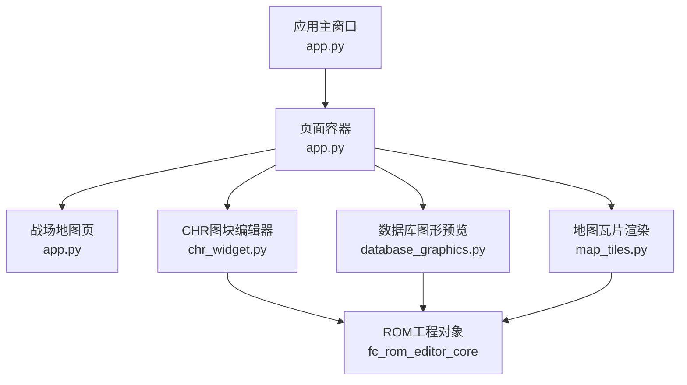
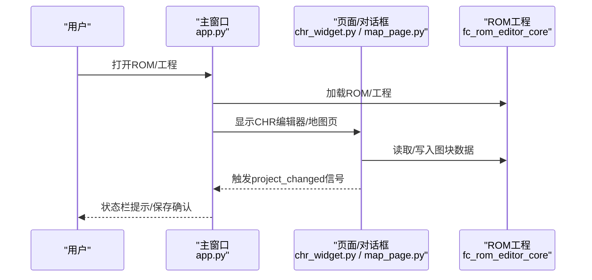
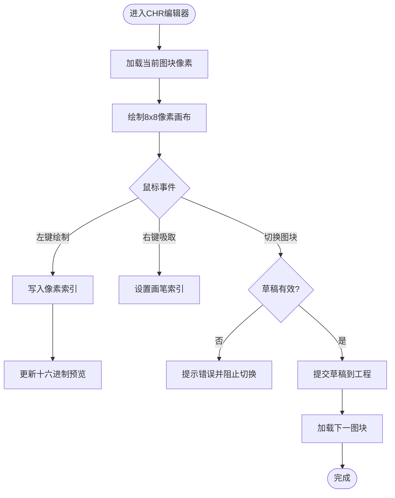
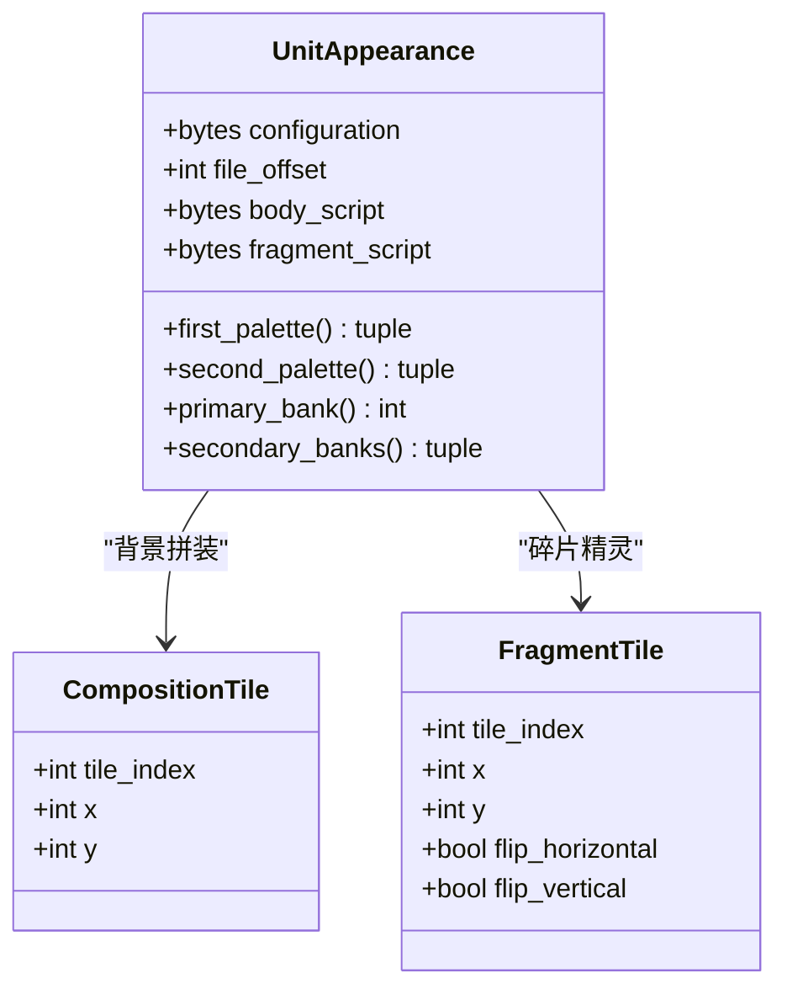
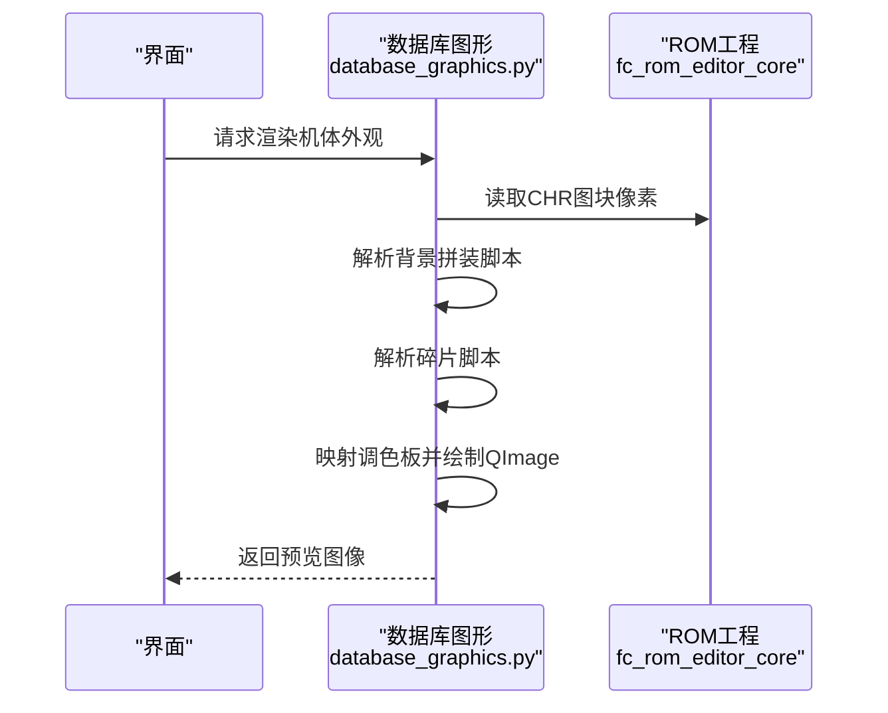
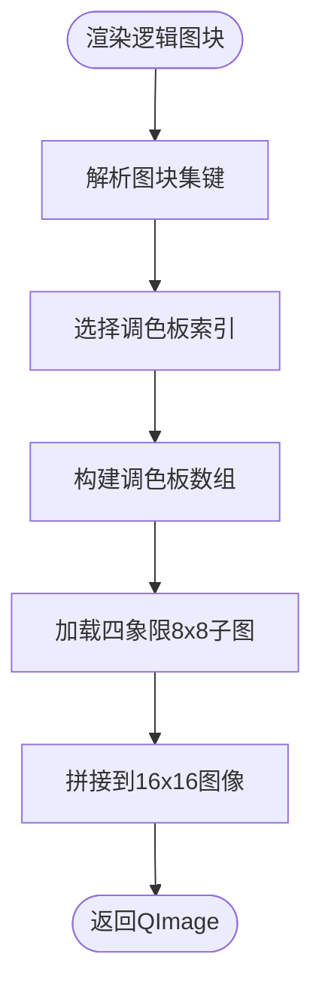
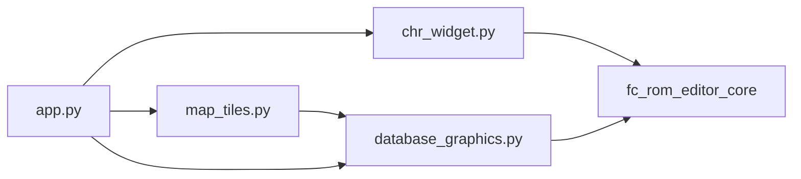

# UI组件库

<cite>
**本文引用的文件**
- [src/dc_modifier/chr_widget.py](file://src/dc_modifier/chr_widget.py)
- [src/dc_modifier/database_graphics.py](file://src/dc_modifier/database_graphics.py)
- [src/dc_modifier/map_tiles.py](file://src/dc_modifier/map_tiles.py)
- [src/dc_modifier/app.py](file://src/dc_modifier/app.py)
- [AGENTS.md](file://AGENTS.md)
</cite>

## 目录
1. [简介](#简介)
2. [项目结构](#项目结构)
3. [核心组件](#核心组件)
4. [架构总览](#架构总览)
5. [详细组件分析](#详细组件分析)
6. [依赖关系分析](#依赖关系分析)
7. [性能考虑](#性能考虑)
8. [故障排查指南](#故障排查指南)
9. [结论](#结论)
10. [附录：复用与扩展建议](#附录：复用与扩展建议)

## 简介
本文件面向“新DC篇完整修改器”的UI组件库，聚焦以下目标：
- 记录并说明CHR图块编辑器组件的功能、使用方法与性能优化策略。
- 记录数据库图形组件的数据可视化能力，包括图表绘制、交互操作与样式定制。
- 说明地图瓦片编辑器的特殊功能与集成方式。
- 提供组件复用指南与扩展开发建议，帮助在现有Qt架构上快速构建新的数据编辑器或预览视图。

该项目的GUI位于 src/dc_modifier/，可复用ROM代码位于 src/fc_editor/，工程入口与页面组织由 app.py 管理，并通过统一的样式表与控件风格提升一致性。

**章节来源**
- [AGENTS.md:9-18](file://AGENTS.md#L9-L18)

## 项目结构
- GUI主程序与页面容器：app.py
- CHR图块编辑器：chr_widget.py（包含像素画布、缩略图浏览器、批量导入导出）
- 数据库图形渲染：database_graphics.py（机体外观、碎片脚本解析与渲染、调色板映射）
- 地图瓦片渲染：map_tiles.py（关卡图块、调色板路由、逻辑图块到四象限拼接）
- 统一样式与窗口框架：app.py（QMainWindow、菜单、状态栏、对话框编排）

**图示来源**
- [src/dc_modifier/app.py:276-365](file://src/dc_modifier/app.py#L276-L365)
- [src/dc_modifier/chr_widget.py:162-274](file://src/dc_modifier/chr_widget.py#L162-L274)
- [src/dc_modifier/database_graphics.py:249-438](file://src/dc_modifier/database_graphics.py#L249-L438)
- [src/dc_modifier/map_tiles.py:108-153](file://src/dc_modifier/map_tiles.py#L108-L153)

**章节来源**
- [src/dc_modifier/app.py:276-365](file://src/dc_modifier/app.py#L276-L365)
- [AGENTS.md:9-18](file://AGENTS.md#L9-L18)

## 核心组件
- CHR图块编辑器：提供8×8像素级绘制、16×16缩略图浏览、PNG/CHR批量导入导出、草稿校验与提交机制。
- 数据库图形组件：解析并渲染机体背景拼装脚本与碎片精灵脚本，支持多色调色板映射与翻转绘制。
- 地图瓦片编辑器：将逻辑地图图块映射到四象限8×8子图，按关卡图块集选择调色板并渲染预览。

这些组件通过统一的ProjectPage基类与信号机制与主窗口协作，确保编辑状态、撤销/重做与变更提示的一致性。

**章节来源**
- [src/dc_modifier/chr_widget.py:33-160](file://src/dc_modifier/chr_widget.py#L33-L160)
- [src/dc_modifier/database_graphics.py:78-247](file://src/dc_modifier/database_graphics.py#L78-L247)
- [src/dc_modifier/map_tiles.py:8-153](file://src/dc_modifier/map_tiles.py#L8-L153)

## 架构总览
应用以MainWindow为中心，集中管理ROM工程、页面导航、菜单与工具对话框。各编辑器作为独立对话框或页面被注册和调用，保证事务边界清晰。

**图示来源**
- [src/dc_modifier/app.py:276-365](file://src/dc_modifier/app.py#L276-L365)
- [src/dc_modifier/chr_widget.py:162-274](file://src/dc_modifier/chr_widget.py#L162-L274)

## 详细组件分析

### CHR图块编辑器组件
- 图像显示
  - 像素画布：8×8网格，每个单元格使用固定显示颜色映射像素索引，绘制时关闭抗锯齿以提升性能。
  - 缩略图浏览器：16×16网格展示当前页256个图块，点击选中后同步放大编辑区。
- 编辑操作
  - 左键绘制、右键吸取像素；支持切换画笔索引（0—3）。
  - 单个图块应用/还原、范围导入/导出（.png/.chr），导入前进行长度与范围校验。
  - 草稿机制：在内存中维护可见草稿，切换图块或提交前进行编码校验，失败则阻止切换。
- 性能优化
  - 局部更新：仅重绘被修改的单元格矩形区域。
  - 缩放与转换：导入PNG时使用快速缩放模式，减少计算开销。
  - 批量导出：基于工作ROM快照与草稿叠加生成字节流，避免多次I/O。

**图示来源**
- [src/dc_modifier/chr_widget.py:33-160](file://src/dc_modifier/chr_widget.py#L33-L160)
- [src/dc_modifier/chr_widget.py:373-421](file://src/dc_modifier/chr_widget.py#L373-L421)

**章节来源**
- [src/dc_modifier/chr_widget.py:33-160](file://src/dc_modifier/chr_widget.py#L33-L160)
- [src/dc_modifier/chr_widget.py:162-274](file://src/dc_modifier/chr_widget.py#L162-L274)
- [src/dc_modifier/chr_widget.py:373-421](file://src/dc_modifier/chr_widget.py#L373-L421)
- [src/dc_modifier/chr_widget.py:459-509](file://src/dc_modifier/chr_widget.py#L459-L509)
- [src/dc_modifier/chr_widget.py:549-629](file://src/dc_modifier/chr_widget.py#L549-L629)

### 数据库图形组件
- 数据可视化能力
  - 机体外观读取：从配置表与脚本中提取调色板、主/次图库页号、背景拼装脚本与碎片脚本。
  - 拼图脚本解析：支持移动光标、设置行宽、连续图块展开与结束码校验，输出8×8网格放置列表。
  - 碎片脚本解析：支持多种命令族、水平/垂直翻转、相对坐标增量与图块替换，输出精灵放置列表。
  - 渲染函数：将CHR图块按调色板映射到QImage，支持列数控制、网格辅助线、战斗视口合成。
- 交互操作
  - 通过主窗口对话框或页面调用渲染函数，返回QImage供界面显示。
  - 支持根据阵营标志调整背景原点与精灵X偏移，模拟游戏层叠效果。
- 样式定制
  - 使用FCEUX调色板常量将NES调色板索引映射为RGB，确保预览一致性与确定性。
  - 提供网格覆盖函数，便于在组合检查时标注8像素单位。

**图示来源**
- [src/dc_modifier/database_graphics.py:29-73](file://src/dc_modifier/database_graphics.py#L29-L73)

**图示来源**
- [src/dc_modifier/database_graphics.py:249-438](file://src/dc_modifier/database_graphics.py#L249-L438)

**章节来源**
- [src/dc_modifier/database_graphics.py:78-247](file://src/dc_modifier/database_graphics.py#L78-L247)
- [src/dc_modifier/database_graphics.py:249-438](file://src/dc_modifier/database_graphics.py#L249-L438)

### 地图瓦片编辑器组件
- 特殊功能
  - 关卡图块集映射：将逻辑地图ID映射到图块集键（A—H），再映射到具体CHR Bank。
  - 调色板路由：根据逻辑图块索引选择调色板索引，支持属性表动态注入（若启用）。
  - 四象限拼接：每个逻辑图块由四个8×8子图组成，分别放置在16×16图像的四个象限。
- 集成方式
  - 通过render_map_tile与render_tileset生成预览图像，供地图页或其他UI组件显示。
  - 与ProjectPage协作，当工程或属性变化时刷新预览。

**图示来源**
- [src/dc_modifier/map_tiles.py:8-153](file://src/dc_modifier/map_tiles.py#L8-L153)

**章节来源**
- [src/dc_modifier/map_tiles.py:8-153](file://src/dc_modifier/map_tiles.py#L8-L153)

## 依赖关系分析
- 组件耦合
  - chr_widget.py 依赖 fc_rom_editor_core 的工程对象以读写CHR数据，并通过ProjectPage与主窗口通信。
  - database_graphics.py 依赖 fc_editor.expansion_* 模块解析扩展布局与脚本，同时依赖工程对象访问CHR。
  - map_tiles.py 依赖 database_graphics.palette_color 实现调色板映射，并依赖工程对象访问CHR。
- 外部依赖
  - PySide6用于UI与绘图。
  - ROM工程对象提供工作内存、资源分配与编解码接口。
- 潜在循环依赖
  - 当前模块间依赖方向清晰，未见循环引用；页面与对话框通过主窗口协调。

**图示来源**
- [src/dc_modifier/chr_widget.py:1-23](file://src/dc_modifier/chr_widget.py#L1-L23)
- [src/dc_modifier/database_graphics.py:1-14](file://src/dc_modifier/database_graphics.py#L1-L14)
- [src/dc_modifier/map_tiles.py:1-6](file://src/dc_modifier/map_tiles.py#L1-L6)
- [src/dc_modifier/app.py:33-58](file://src/dc_modifier/app.py#L33-L58)

**章节来源**
- [src/dc_modifier/chr_widget.py:1-23](file://src/dc_modifier/chr_widget.py#L1-L23)
- [src/dc_modifier/database_graphics.py:1-14](file://src/dc_modifier/database_graphics.py#L1-L14)
- [src/dc_modifier/map_tiles.py:1-6](file://src/dc_modifier/map_tiles.py#L1-L6)
- [src/dc_modifier/app.py:33-58](file://src/dc_modifier/app.py#L33-L58)

## 性能考虑
- 渲染优化
  - 关闭抗锯齿以减少像素填充开销。
  - 局部更新：仅重绘受影响区域，避免整屏重绘。
  - 快速缩放：导入PNG时使用FastTransformation降低CPU占用。
- I/O优化
  - 批量导出：一次性构造字节流并写入文件，减少多次磁盘操作。
  - 草稿叠加：在内存中合并草稿与工作ROM快照，避免重复读取。
- 交互优化
  - 信号驱动：通过pixels_changed等信号触发最小化重绘。
  - 预计算调色板：将调色板索引映射为QColor缓存，减少重复计算。

[本节提供通用指导，不直接分析具体文件]

## 故障排查指南
- CHR编辑器常见问题
  - 导入PNG无效：检查图像是否为空或尺寸异常；确保颜色数量不超过4种或亮度映射正确。
  - 切换图块失败：草稿编码校验失败会阻止切换；查看十六进制预览的错误提示并修正。
  - 批量导入越界：确保导入范围未超出活动CHR-ROM；必要时先提交草稿再执行批量操作。
- 数据库图形渲染问题
  - 外观资源未验证：非兼容ROM布局会停止资源预览；需确认ROM版本与扩展计划。
  - 脚本不完整或缺少结束码：解析时会抛出异常；检查背景拼装与碎片脚本是否以FF结尾且参数完整。
  - 图块引用越界：确保引用的图块索引在当前CHR容量范围内。
- 地图瓦片渲染问题
  - 未知图块集：传入的图块集键不在支持列表中；检查关卡ID与图块集映射。
  - 调色板路由错误：确保逻辑图块索引在$0—$F之间；属性表注入时需满足颜色值范围。

**章节来源**
- [src/dc_modifier/chr_widget.py:459-509](file://src/dc_modifier/chr_widget.py#L459-L509)
- [src/dc_modifier/chr_widget.py:549-629](file://src/dc_modifier/chr_widget.py#L549-L629)
- [src/dc_modifier/database_graphics.py:249-281](file://src/dc_modifier/database_graphics.py#L249-L281)
- [src/dc_modifier/database_graphics.py:78-157](file://src/dc_modifier/database_graphics.py#L78-L157)
- [src/dc_modifier/database_graphics.py:159-247](file://src/dc_modifier/database_graphics.py#L159-L247)
- [src/dc_modifier/map_tiles.py:108-153](file://src/dc_modifier/map_tiles.py#L108-L153)

## 结论
本UI组件库围绕CHR图块编辑、数据库图形预览与地图瓦片渲染三大核心场景，提供了高内聚、低耦合的可复用组件。通过统一的工程对象与信号机制，实现了良好的编辑体验与性能表现。建议在新增组件时遵循现有模式：明确输入输出、采用草稿与校验、利用信号驱动局部更新，并通过主窗口统一管理生命周期与状态。

[本节总结性内容，不直接分析具体文件]

## 附录：复用与扩展建议
- 复用指南
  - 继承ProjectPage：确保与主窗口的工程生命周期、撤销/重做与变更提示保持一致。
  - 使用QImage与调色板映射：参考database_graphics.palette_color与render_*系列函数，确保预览一致。
  - 批量I/O：参考chr_widget的range_bytes_with_pending_draft与export_chr流程，减少磁盘访问。
- 扩展开发
  - 新增页面：在app.py中注册页面并加入导航与菜单，保持与现有风格一致。
  - 自定义控件：参考ChrTileCanvas与ChrSheetCanvas，实现局部更新与高效绘制。
  - 脚本解析：参考decode_unit_body_script与decode_unit_fragment_script，严格校验指令与参数，提供清晰的错误信息。
- 最佳实践
  - 类型提示与命名规范：遵循仓库约定，提高可读性与可维护性。
  - 测试覆盖：为新组件添加单元测试，覆盖边界条件与异常路径。
  - 文档同步：任何用户可见行为变更需同步更新使用说明与交接文档。

[本节提供通用指导，不直接分析具体文件]