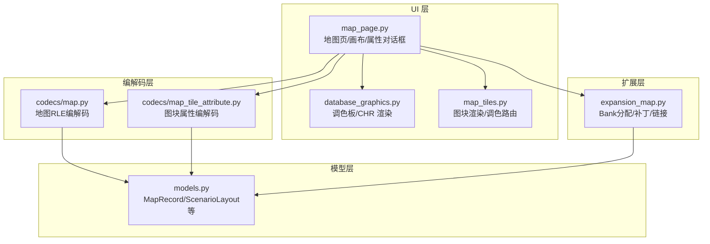
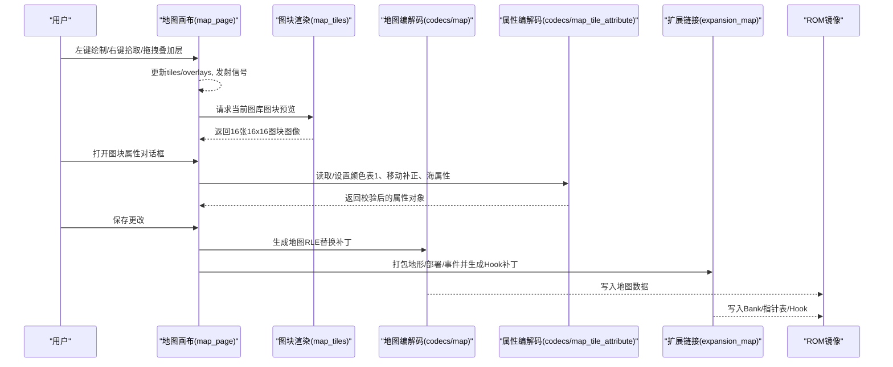
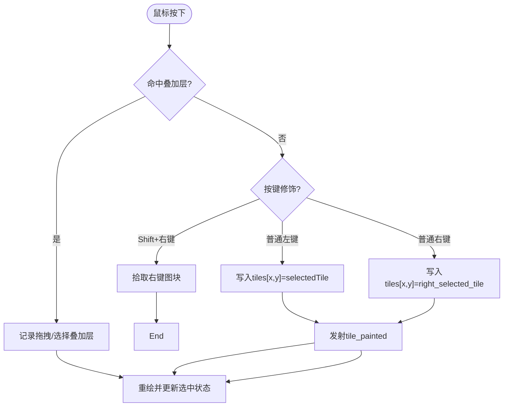
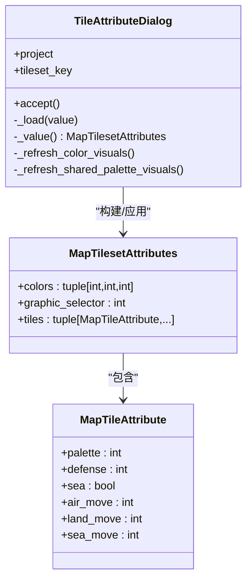
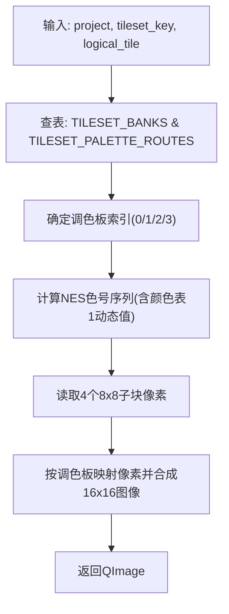
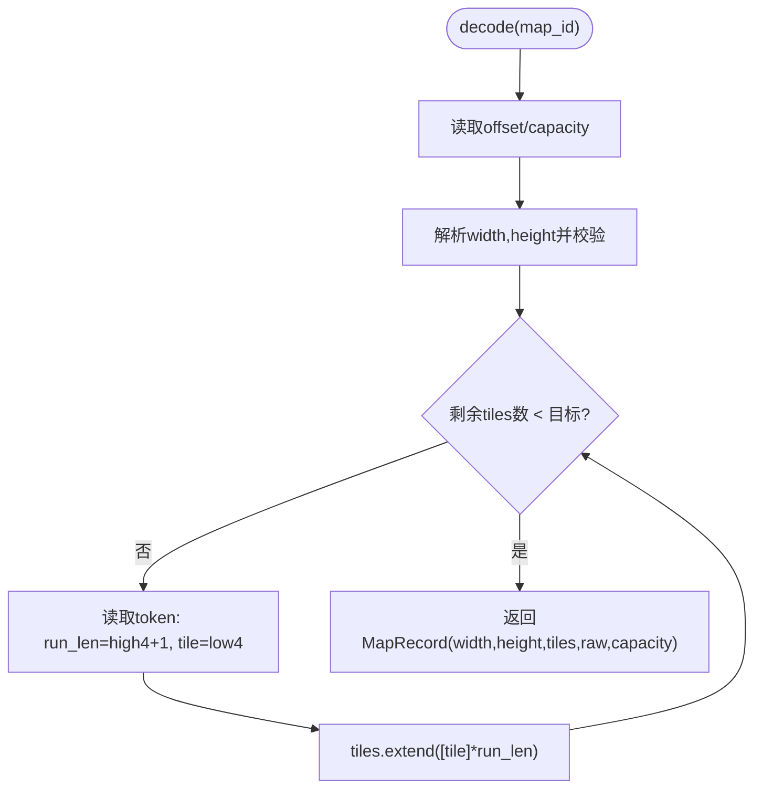
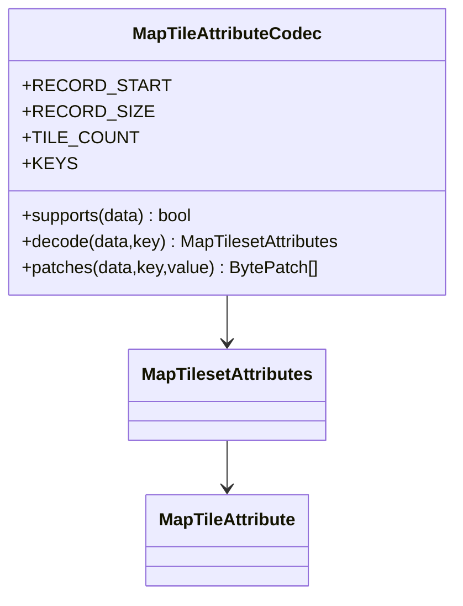
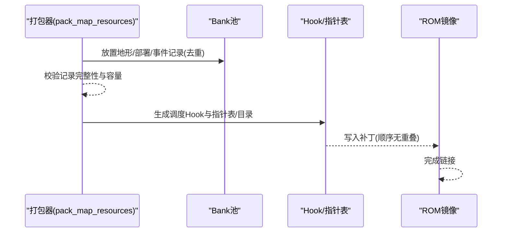
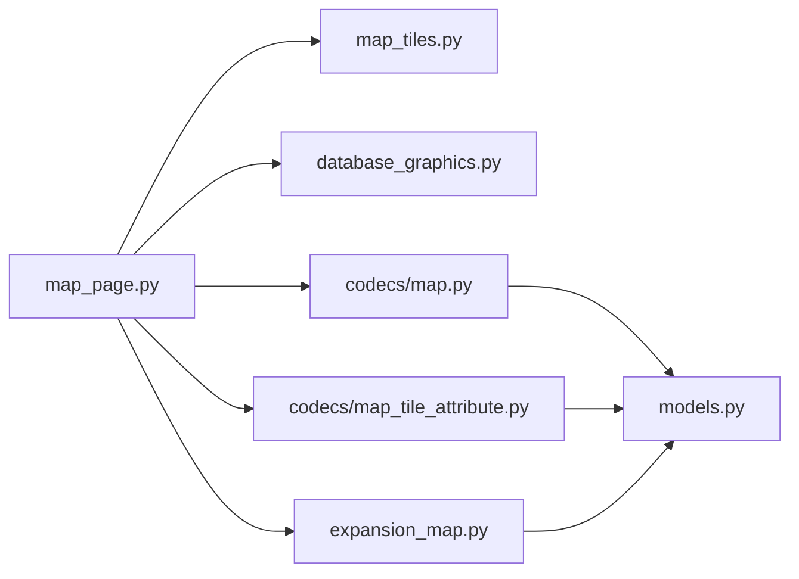

# 地图瓦片编辑器

<cite>
**本文引用的文件**
- [src/dc_modifier/map_page.py](file://src/dc_modifier/map_page.py)
- [src/dc_modifier/map_tiles.py](file://src/dc_modifier/map_tiles.py)
- [src/fc_editor/codecs/map.py](file://src/fc_editor/codecs/map.py)
- [src/fc_editor/codecs/map_tile_attribute.py](file://src/fc_editor/codecs/map_tile_attribute.py)
- [src/fc_editor/expansion_map.py](file://src/fc_editor/expansion_map.py)
- [src/fc_editor/models.py](file://src/fc_editor/models.py)
- [src/dc_modifier/database_graphics.py](file://src/dc_modifier/database_graphics.py)
</cite>

## 目录
1. [简介](#简介)
2. [项目结构](#项目结构)
3. [核心组件](#核心组件)
4. [架构总览](#架构总览)
5. [详细组件分析](#详细组件分析)
6. [依赖关系分析](#依赖关系分析)
7. [性能考虑](#性能考虑)
8. [故障排查指南](#故障排查指南)
9. [结论](#结论)
10. [附录](#附录)

## 简介
本文件面向 FC（NES）游戏“地图瓦片编辑器”的实现与使用，聚焦于该项目的 FC 地图系统特殊需求与实现方案。文档覆盖：
- 瓦片数据结构、地形属性定义、碰撞/移动检测机制
- 瓦片选择工具、批量编辑功能、图层管理
- 与 ROM 数据的同步机制、内存映射优化、大地图处理能力
- 瓦片素材管理、调色板配置、动画效果支持
- 地图验证工具、性能监控、调试集成
- 扩展新瓦片类型与编辑工具的方法

## 项目结构
本项目将“编辑器 UI”和“ROM 编解码/扩展”分层组织：
- UI 层（PySide6）：地图画布、图块属性编辑对话框、调色板选择器、单位图标渲染等
- 数据编解码层：地图 RLE 编码/解码、图块属性记录编解码、场景部署与事件触发器打包
- 扩展层：为地图资源分配 Bank、生成补丁、链接指针表与调度 Hook
- 图形与调色板：基于 FCEUX 调色板的像素级渲染，保证预览与运行时一致

**图表来源**
- [src/dc_modifier/map_page.py:595-800](file://src/dc_modifier/map_page.py#L595-L800)
- [src/dc_modifier/map_tiles.py:108-153](file://src/dc_modifier/map_tiles.py#L108-L153)
- [src/fc_editor/codecs/map.py:16-228](file://src/fc_editor/codecs/map.py#L16-L228)
- [src/fc_editor/codecs/map_tile_attribute.py:28-143](file://src/fc_editor/codecs/map_tile_attribute.py#L28-L143)
- [src/fc_editor/expansion_map.py:174-419](file://src/fc_editor/expansion_map.py#L174-L419)
- [src/fc_editor/models.py:309-400](file://src/fc_editor/models.py#L309-L400)

**章节来源**
- [src/dc_modifier/map_page.py:595-800](file://src/dc_modifier/map_page.py#L595-L800)
- [src/dc_modifier/map_tiles.py:108-153](file://src/dc_modifier/map_tiles.py#L108-L153)
- [src/fc_editor/codecs/map.py:16-228](file://src/fc_editor/codecs/map.py#L16-L228)
- [src/fc_editor/codecs/map_tile_attribute.py:28-143](file://src/fc_editor/codecs/map_tile_attribute.py#L28-L143)
- [src/fc_editor/expansion_map.py:174-419](file://src/fc_editor/expansion_map.py#L174-L419)
- [src/fc_editor/models.py:309-400](file://src/fc_editor/models.py#L309-L400)

## 核心组件
- 地图画布与交互：提供点击绘制、右键拾取、叠加层（部署/事件/商店）拖拽与选择、坐标提示、图块 ID 显示等
- 图块属性编辑器：按图库 A-G 维护颜色表1、防御补正、海属性、空/陆/海移动补正；颜色表2/3为公用只读
- 图块渲染与调色板：依据逻辑图块索引与调色路由，从 CHR 流中读取四象限像素并着色
- 地图 RLE 编解码：支持宽度×高度校验、游程长度限制、容量检查与替换补丁生成
- 图块属性编解码：严格校验颜色表原码、移动补正范围、图形选择器一致性，输出字节级差分补丁
- 地图资源扩展：打包地形/部署/事件到共享 Bank 池，生成指针表与 Bank 目录，注入调度 Hook，确保运行时可切换 Bank

**章节来源**
- [src/dc_modifier/map_page.py:310-593](file://src/dc_modifier/map_page.py#L310-L593)
- [src/dc_modifier/map_tiles.py:108-153](file://src/dc_modifier/map_tiles.py#L108-L153)
- [src/fc_editor/codecs/map.py:16-228](file://src/fc_editor/codecs/map.py#L16-L228)
- [src/fc_editor/codecs/map_tile_attribute.py:28-143](file://src/fc_editor/codecs/map_tile_attribute.py#L28-L143)
- [src/fc_editor/expansion_map.py:174-419](file://src/fc_editor/expansion_map.py#L174-L419)

## 架构总览
下图展示从用户操作到 ROM 写入的完整链路：用户在画布上绘制/拾取图块，修改属性后通过编码器生成补丁，再由扩展模块打包并应用至 ROM。

**图表来源**
- [src/dc_modifier/map_page.py:595-800](file://src/dc_modifier/map_page.py#L595-L800)
- [src/dc_modifier/map_tiles.py:108-153](file://src/dc_modifier/map_tiles.py#L108-L153)
- [src/fc_editor/codecs/map.py:136-228](file://src/fc_editor/codecs/map.py#L136-L228)
- [src/fc_editor/codecs/map_tile_attribute.py:58-143](file://src/fc_editor/codecs/map_tile_attribute.py#L58-L143)
- [src/fc_editor/expansion_map.py:272-419](file://src/fc_editor/expansion_map.py#L272-L419)

## 详细组件分析

### 地图画布与交互（MapCanvas）
- 功能要点
  - 绘制：左键在当前选中图块下绘制，支持批量连续绘制
  - 拾取：Shift+右键或右键直接拾取目标格图块，支持左右手双选
  - 叠加层：部署/事件/商店标记可拖拽、选择、激活，带阵营色边框与高亮
  - 可视化：可选显示图块ID网格；单元格尺寸可调
- 关键流程
  - 鼠标事件定位到网格坐标，判断是否命中叠加层或空白格
  - 命中叠加层则进入拖拽/选择模式；否则执行绘制或拾取
  - 每次变更发射 tile_painted/tile_picked/right_tile_picked 等信号供上层处理

**图表来源**
- [src/dc_modifier/map_page.py:731-800](file://src/dc_modifier/map_page.py#L731-L800)

**章节来源**
- [src/dc_modifier/map_page.py:595-800](file://src/dc_modifier/map_page.py#L595-L800)

### 图块属性编辑器（TileAttributeDialog）
- 功能要点
  - 颜色表1：三个 NES 色号输入框与实时色块按钮联动，支持十六进制输入
  - 颜色表2/3：只读预览，显示真实 NES 色号及引用图块
  - 每图块属性：颜色表选择、防御补正%、海属性开关、空/陆/海移动补正下拉
  - 应用/还原：仅对已验证的 A-G 图库生效，图形选择器不可改
- 数据流
  - 加载时调用 project.get_map_tileset_attributes(tileset_key) 获取当前值
  - 保存时构造 MapTilesetAttributes，调用 project.set_map_tileset_attributes 写回

**图表来源**
- [src/dc_modifier/map_page.py:310-593](file://src/dc_modifier/map_page.py#L310-L593)
- [src/fc_editor/codecs/map_tile_attribute.py:11-26](file://src/fc_editor/codecs/map_tile_attribute.py#L11-L26)

**章节来源**
- [src/dc_modifier/map_page.py:310-593](file://src/dc_modifier/map_page.py#L310-L593)
- [src/fc_editor/codecs/map_tile_attribute.py:28-143](file://src/fc_editor/codecs/map_tile_attribute.py#L28-L143)

### 图块渲染与调色板（render_map_tile / render_tileset）
- 逻辑图块到 16x16 图像的转换
  - 根据图库 key 查表得到 Bank 偏移与调色路由
  - 调色路由决定使用哪个调色板（0/1/2/3），其中调色板1的颜色由属性记录动态决定
  - 读取四个 8x8 子块的像素，按调色板映射到 RGB 并拼成 16x16
- 关键点
  - 旧版“00/55/AA/FF”字段并非整图块调色选择器，所有视觉表面均走游戏内地形路由
  - 调色板2/3为公用固定值，来自已验证的战场模板

**图表来源**
- [src/dc_modifier/map_tiles.py:108-153](file://src/dc_modifier/map_tiles.py#L108-L153)
- [src/dc_modifier/map_tiles.py:84-105](file://src/dc_modifier/map_tiles.py#L84-L105)

**章节来源**
- [src/dc_modifier/map_tiles.py:8-153](file://src/dc_modifier/map_tiles.py#L8-L153)
- [src/dc_modifier/database_graphics.py:284-321](file://src/dc_modifier/database_graphics.py#L284-L321)

### 地图 RLE 编解码（MapCodec）
- 解码流程
  - 读取指针表与 Bank 目录，计算每条记录的起始偏移与容量
  - 解析首两字节宽高，校验范围 1–32
  - 逐条解析 RLE 令牌：高4位为游程长度-1，低4位为逻辑地形编号
  - 组装 tiles 元组，返回 MapRecord
- 编码流程
  - 校验宽高与 tiles 数量一致性
  - 游程压缩：相同地形连续最多16格
  - 生成替换补丁：若超出容量抛出异常
- 语义哈希
  - 基于 width、height、tiles 计算 SHA256，用于差异比对

**图表来源**
- [src/fc_editor/codecs/map.py:136-173](file://src/fc_editor/codecs/map.py#L136-L173)
- [src/fc_editor/codecs/map.py:175-228](file://src/fc_editor/codecs/map.py#L175-L228)

**章节来源**
- [src/fc_editor/codecs/map.py:16-228](file://src/fc_editor/codecs/map.py#L16-L228)
- [src/fc_editor/models.py:309-342](file://src/fc_editor/models.py#L309-L342)

### 图块属性编解码（MapTileAttributeCodec）
- 解码
  - 校验记录长度、图形选择器、颜色表原码、移动补正范围
  - 提取每个图块的 palette、defense、sea、air_move、land_move、sea_move
- 规范化与补丁
  - 颜色表1必须为3个 $00–$3F 的 NES 色号
  - 图形选择器不允许修改
  - 输出字节级差分补丁，仅写入变化的字节

**图表来源**
- [src/fc_editor/codecs/map_tile_attribute.py:28-143](file://src/fc_editor/codecs/map_tile_attribute.py#L28-L143)

**章节来源**
- [src/fc_editor/codecs/map_tile_attribute.py:28-143](file://src/fc_editor/codecs/map_tile_attribute.py#L28-L143)

### 地图资源扩展与内存映射（Expansion Map）
- 资源打包
  - 地形记录保持独立；部署与事件记录在各自类型内去重共享
  - 每个记录不得跨越 8 KiB Bank 边界
- 补丁生成
  - 校验原版/扩展版代码片段，注入地形/部署/事件调度 Hook
  - 写入指针表与 Bank 目录，清理指定 Bank
- 链接与读取
  - 原子化打包并生成补丁集，应用后返回新的 ROM 镜像
  - 读取扩展布局：解析三类资源的指针/Bank目录，推导容量

**图表来源**
- [src/fc_editor/expansion_map.py:174-253](file://src/fc_editor/expansion_map.py#L174-L253)
- [src/fc_editor/expansion_map.py:272-419](file://src/fc_editor/expansion_map.py#L272-L419)

**章节来源**
- [src/fc_editor/expansion_map.py:174-419](file://src/fc_editor/expansion_map.py#L174-L419)

### 瓦片数据结构与地形属性
- 逻辑地形编号：0–15，对应每个图库的 16 个逻辑图块
- 图块属性（每图块）
  - 颜色表选择：0–3（0背景色，1颜色表1，2/3公用）
  - 防御补正：0–127%
  - 海属性：布尔
  - 移动补正：空/陆/海各 0–16
- 调色板
  - 调色板0/2/3为固定值；调色板1的颜色表1由属性记录动态决定
  - 调色路由将逻辑图块映射到具体调色板索引

**章节来源**
- [src/fc_editor/codecs/map_tile_attribute.py:11-41](file://src/fc_editor/codecs/map_tile_attribute.py#L11-L41)
- [src/dc_modifier/map_tiles.py:25-82](file://src/dc_modifier/map_tiles.py#L25-L82)

### 碰撞检测与移动规则
- 移动规则来源于图块属性的空/陆/海移动补正，编辑器通过下拉菜单直观配置
- 海属性标志影响海上移动判定
- 防御补正影响战斗中的防御结算（非碰撞几何）
- 运行时实际碰撞/移动由游戏代码结合上述属性计算，编辑器仅负责数据正确性

**章节来源**
- [src/dc_modifier/map_page.py:380-430](file://src/dc_modifier/map_page.py#L380-L430)
- [src/fc_editor/codecs/map_tile_attribute.py:74-93](file://src/fc_editor/codecs/map_tile_attribute.py#L74-L93)

### 瓦片选择工具与批量编辑
- 选择工具
  - 左键绘制：持续绘制选中图块
  - 右键拾取：拾取目标格图块作为画笔
  - Shift+右键：快速拾取为右画笔
- 批量编辑
  - 通过画布连续绘制实现区域填充
  - 叠加层批量拖拽：部署/事件/商店标记可整体移动
  - 属性批量：同一图库的属性对话框可对全部 16 个图块统一调整

**章节来源**
- [src/dc_modifier/map_page.py:731-800](file://src/dc_modifier/map_page.py#L731-L800)
- [src/dc_modifier/map_page.py:310-593](file://src/dc_modifier/map_page.py#L310-L593)

### 图层管理系统
- 叠加层类型：敌/客/我/事/店，分别以不同颜色标识
- 叠加层数据结构：(side, x, y, label, row)，支持图片与文本两种呈现
- 交互：点击选中、拖拽移动、右键上下文菜单（部署/事件）

**章节来源**
- [src/dc_modifier/map_page.py:616-730](file://src/dc_modifier/map_page.py#L616-L730)

### 与 ROM 数据的同步机制
- 地图数据：通过 MapCodec 解码/编码，生成替换补丁写入 ROM
- 图块属性：通过 MapTileAttributeCodec 生成字节级差分补丁
- 扩展资源：通过 expansion_map 打包并注入 Hook，使运行时可按地图切换 Bank

**章节来源**
- [src/fc_editor/codecs/map.py:136-228](file://src/fc_editor/codecs/map.py#L136-L228)
- [src/fc_editor/codecs/map_tile_attribute.py:119-143](file://src/fc_editor/codecs/map_tile_attribute.py#L119-L143)
- [src/fc_editor/expansion_map.py:272-419](file://src/fc_editor/expansion_map.py#L272-L419)

### 内存映射优化与大地图处理
- 内存映射
  - 地形/部署/事件分别映射到 0xA000/0x8000/0xA000 窗口基址
  - 通过 Hook 在运行时按地图选择对应 Bank，避免全局切换开销
- 大地图能力
  - 地图宽高上限 32×32，RLE 压缩减少存储占用
  - 资源打包确保单记录不跨 Bank，提升加载效率

**章节来源**
- [src/fc_editor/expansion_map.py:20-68](file://src/fc_editor/expansion_map.py#L20-L68)
- [src/fc_editor/expansion_map.py:206-253](file://src/fc_editor/expansion_map.py#L206-L253)
- [src/fc_editor/codecs/map.py:147-173](file://src/fc_editor/codecs/map.py#L147-L173)

### 瓦片素材管理与调色板配置
- 素材来源：CHR 库，按 Bank 组织，每 Bank 64 个 8x8 图块
- 调色板配置
  - 使用 FCEUX.pal 作为显示基准，保证预览与运行一致
  - 颜色表1由属性记录动态决定，2/3为公用固定值
- 预览
  - 图块预览：按调色路由渲染 16x16 逻辑图块
  - 单位图标：按阵营调色板渲染 16x16 图标

**章节来源**
- [src/dc_modifier/database_graphics.py:16-26](file://src/dc_modifier/database_graphics.py#L16-L26)
- [src/dc_modifier/map_tiles.py:84-105](file://src/dc_modifier/map_tiles.py#L84-L105)
- [src/dc_modifier/map_page.py:106-157](file://src/dc_modifier/map_page.py#L106-L157)

### 动画效果的实现方法
- 当前地图编辑器聚焦静态图块与属性；动画相关逻辑未在本仓库中直接实现
- 如需添加动画，可在图块渲染层引入帧序列与时间驱动，复用现有 CHR 读取与调色板映射

[本节为概念性说明，不涉及具体文件分析]

### 地图验证工具、性能监控与调试集成
- 验证
  - 地图宽高、RLE 游程、容量、指针合法性校验
  - 图块属性颜色表原码、移动补正范围、图形选择器一致性校验
  - 扩展资源 Hook 与指针表完整性校验
- 性能
  - RLE 压缩降低带宽与存储
  - 资源去重共享减少冗余
  - 按需 Bank 切换避免全局重映射
- 调试
  - 画布支持显示图块ID网格
  - 属性对话框提供颜色表预览与只读对照
  - 错误信息明确指向越界、不完整、重复指针等问题

**章节来源**
- [src/fc_editor/codecs/map.py:147-173](file://src/fc_editor/codecs/map.py#L147-L173)
- [src/fc_editor/codecs/map_tile_attribute.py:58-93](file://src/fc_editor/codecs/map_tile_attribute.py#L58-L93)
- [src/fc_editor/expansion_map.py:425-525](file://src/fc_editor/expansion_map.py#L425-L525)
- [src/dc_modifier/map_page.py:674-679](file://src/dc_modifier/map_page.py#L674-L679)

### 扩展新瓦片类型与编辑工具
- 新增瓦片类型
  - 在图库路由中添加新 key 与调色路由
  - 如需要，新增属性记录位置与校验规则
- 新增编辑工具
  - 在 map_page 中扩展画布交互与叠加层类型
  - 在 codecs 层增加对应的编解码与校验逻辑
  - 在 expansion_map 中为新资源分配 Bank 并注入必要 Hook

**章节来源**
- [src/dc_modifier/map_tiles.py:14-23](file://src/dc_modifier/map_tiles.py#L14-L23)
- [src/dc_modifier/map_tiles.py:57-82](file://src/dc_modifier/map_tiles.py#L57-L82)
- [src/fc_editor/codecs/map_tile_attribute.py:31-41](file://src/fc_editor/codecs/map_tile_attribute.py#L31-L41)
- [src/fc_editor/expansion_map.py:174-253](file://src/fc_editor/expansion_map.py#L174-L253)

## 依赖关系分析
- UI 依赖
  - map_page 依赖 map_tiles 进行图块渲染，依赖 database_graphics 进行调色板与 CHR 渲染
  - map_page 依赖 codecs 层进行地图与属性数据的读写
- 编解码依赖
  - map.py 依赖 models.MapRecord 表示地图记录
  - map_tile_attribute.py 依赖 models 中的基础约束（间接通过上层）
- 扩展依赖
  - expansion_map.py 依赖常量与错误类型，生成并应用补丁

**图表来源**
- [src/dc_modifier/map_page.py:38-52](file://src/dc_modifier/map_page.py#L38-L52)
- [src/dc_modifier/map_tiles.py:1-6](file://src/dc_modifier/map_tiles.py#L1-L6)
- [src/fc_editor/codecs/map.py:7-13](file://src/fc_editor/codecs/map.py#L7-L13)
- [src/fc_editor/codecs/map_tile_attribute.py:1-6](file://src/fc_editor/codecs/map_tile_attribute.py#L1-L6)
- [src/fc_editor/expansion_map.py:1-9](file://src/fc_editor/expansion_map.py#L1-L9)

**章节来源**
- [src/dc_modifier/map_page.py:38-52](file://src/dc_modifier/map_page.py#L38-L52)
- [src/fc_editor/codecs/map.py:7-13](file://src/fc_editor/codecs/map.py#L7-L13)
- [src/fc_editor/codecs/map_tile_attribute.py:1-6](file://src/fc_editor/codecs/map_tile_attribute.py#L1-L6)
- [src/fc_editor/expansion_map.py:1-9](file://src/fc_editor/expansion_map.py#L1-L9)

## 性能考虑
- 使用 RLE 压缩地图数据，显著减少存储与传输开销
- 资源去重共享：部署与事件记录在各自类型内去重，避免重复存储
- 按需 Bank 切换：运行时按地图选择 Bank，减少全局重映射成本
- 渲染优化：仅对变更区域重绘，关闭抗锯齿以提升速度

[本节提供通用指导，不直接分析具体文件]

## 故障排查指南
- 地图数据问题
  - 尺寸越界、RLE 游程越过末尾、数据块不完整：检查宽高与游程长度
  - 指针无效或重复：确认指针表与 Bank 目录一致性
- 图块属性问题
  - 颜色表原码非法、移动补超出范围、图形选择器不一致：修正属性值
- 扩展资源问题
  - Hook 空洞被占用、指针越界、Bank 不在可用池：重新打包并校验

**章节来源**
- [src/fc_editor/codecs/map.py:147-173](file://src/fc_editor/codecs/map.py#L147-L173)
- [src/fc_editor/codecs/map_tile_attribute.py:58-93](file://src/fc_editor/codecs/map_tile_attribute.py#L58-L93)
- [src/fc_editor/expansion_map.py:425-525](file://src/fc_editor/expansion_map.py#L425-L525)

## 结论
该地图瓦片编辑器围绕 FC 地图系统的特殊需求，提供了从 UI 到 ROM 写入的完整闭环：
- 精确的图块渲染与调色板映射，确保预览与运行一致
- 严格的地图与属性编解码校验，保障数据完整性
- 高效的资源打包与内存映射优化，支持大地图与多场景
- 完善的验证与调试能力，便于问题定位与修复
在此基础上，可便捷扩展新瓦片类型与编辑工具，满足多样化内容创作需求。

[本节为总结性内容，不涉及具体文件分析]

## 附录
- 术语
  - 逻辑图块：编辑器可见的 16x16 图块，由四个 8x8 子块组成
  - 调色路由：将逻辑图块映射到具体调色板索引的规则
  - Bank：8 KiB 程序存储单元，用于存放地图资源
- 最佳实践
  - 编辑前备份 ROM，避免不可逆修改
  - 使用属性对话框的只读对照，确保颜色表2/3不被误改
  - 批量编辑后执行验证，确保 RLE 与容量合规

[本节为补充说明，不涉及具体文件分析]