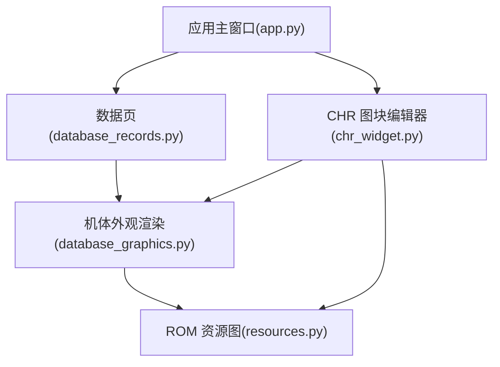
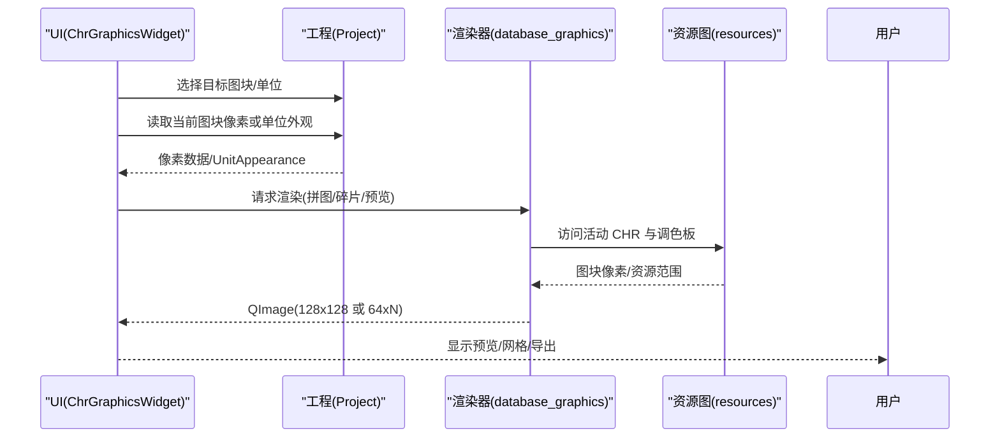
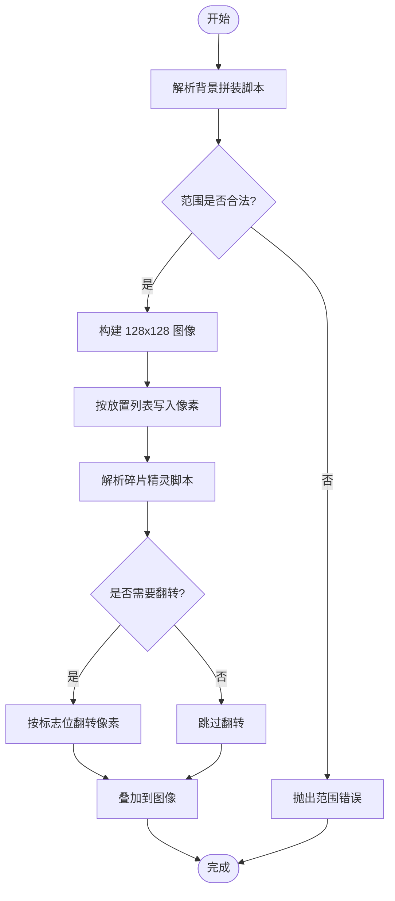
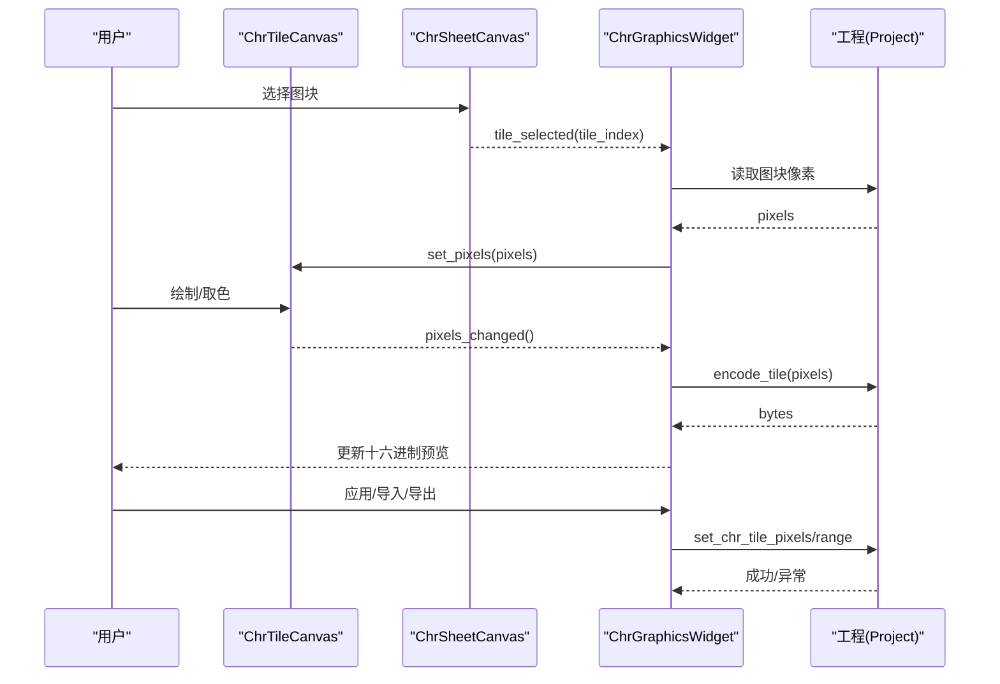
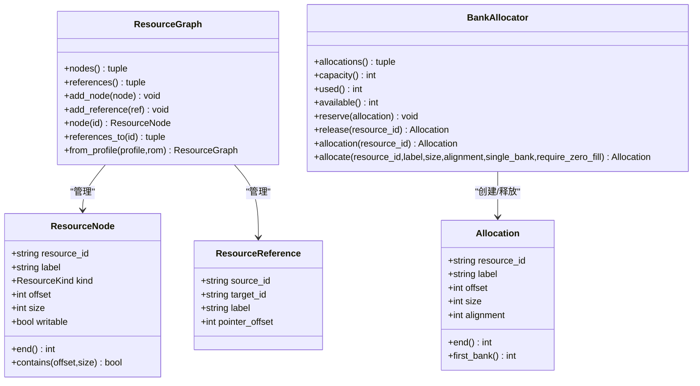
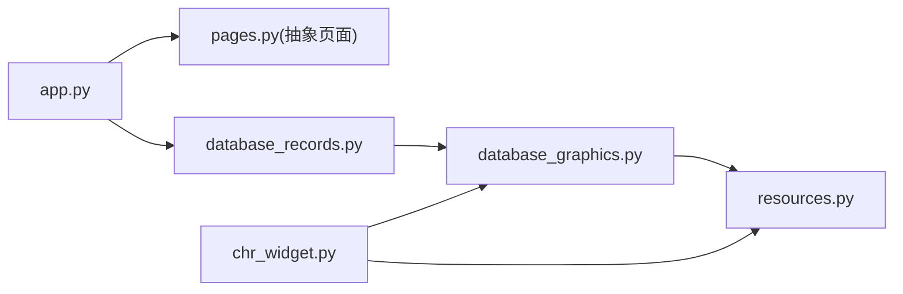

# 数据库图形组件

<cite>
**本文引用的文件**
- [database_graphics.py](file://src/dc_modifier/database_graphics.py)
- [chr_widget.py](file://src/dc_modifier/chr_widget.py)
- [resources.py](file://src/fc_editor/resources.py)
- [app.py](file://src/dc_modifier/app.py)
- [database_records.py](file://src/dc_modifier/database_records.py)
</cite>

## 目录
1. [简介](#简介)
2. [项目结构](#项目结构)
3. [核心组件](#核心组件)
4. [架构总览](#架构总览)
5. [详细组件分析](#详细组件分析)
6. [依赖关系分析](#依赖关系分析)
7. [性能与内存优化](#性能与内存优化)
8. [样式、主题与响应式](#样式主题与响应式)
9. [自定义图表类型开发指南](#自定义图表类型开发指南)
10. [常见问题与排错](#常见问题与排错)
11. [结论](#结论)

## 简介
本仓库中的“数据库图形组件”并非传统意义上的统计图表（柱状图、折线图、饼图等），而是面向 FC/NES 游戏 ROM 的“数据可视化与资源编辑”子系统。它提供：
- 机体外观与碎片精灵的解析与渲染，用于在编辑器中直观查看战斗画面布局
- CHR 图块的浏览、编辑、导入导出，支持像素级绘制与批量操作
- 资源图与分配器，统一管理 ROM 中各类资源的命名、范围与引用关系
- 可阅读的数据页（人物、武器等）与预览能力，辅助定位与校验资源

该子系统以 Qt 为 UI 框架，结合 PySide6 绘图能力，将底层 ROM 数据映射为可视化的图像与交互界面，确保修改过程可预览、可回滚、可审计。

## 项目结构
围绕图形与可视化能力的核心文件组织如下：
- 图形解码与渲染：database_graphics.py
- 图块浏览器与编辑器：chr_widget.py
- 资源图与分配：resources.py
- 应用入口与全局样式：app.py
- 可阅读数据页（含预览联动）：database_records.py

**图示来源**
- [app.py:1-200](file://src/dc_modifier/app.py#L1-L200)
- [database_records.py:105-187](file://src/dc_modifier/database_records.py#L105-L187)
- [chr_widget.py:162-447](file://src/dc_modifier/chr_widget.py#L162-L447)
- [database_graphics.py:249-438](file://src/dc_modifier/database_graphics.py#L249-L438)
- [resources.py:47-260](file://src/fc_editor/resources.py#L47-L260)

**章节来源**
- [app.py:1-200](file://src/dc_modifier/app.py#L1-L200)
- [database_graphics.py:1-438](file://src/dc_modifier/database_graphics.py#L1-L438)
- [chr_widget.py:1-630](file://src/dc_modifier/chr_widget.py#L1-L630)
- [resources.py:1-413](file://src/fc_editor/resources.py#L1-L413)
- [database_records.py:1-536](file://src/dc_modifier/database_records.py#L1-L536)

## 核心组件
- 机体外观与碎片渲染器
  - 负责解析并渲染机体背景拼装脚本与碎片精灵脚本，输出 128x128 的战斗视口图像
  - 使用内置调色板将 NES 颜色索引映射为 RGB，保证显示一致性
- CHR 图块编辑器
  - 提供 8x8 像素画布、16x16 图块缩略图浏览器、批量导入导出 .chr/.png
  - 支持鼠标绘制、右键取色、实时十六进制预览、草稿提交与撤销
- 资源图与分配器
  - 管理 ROM 中各资源节点（指针表、音频、代码、自由区、活动 CHR 等）及其引用关系
  - 提供 PRG 空闲区的确定性分配策略，避免冲突与越界
- 可阅读数据页
  - 对人物、武器等资源提供可读视图，集成属性编辑、动画参数、名称引用与原始字节展示
  - 通过事务机制统一提交变更，保障一致性

**章节来源**
- [database_graphics.py:249-438](file://src/dc_modifier/database_graphics.py#L249-L438)
- [chr_widget.py:33-630](file://src/dc_modifier/chr_widget.py#L33-L630)
- [resources.py:47-413](file://src/fc_editor/resources.py#L47-L413)
- [database_records.py:105-536](file://src/dc_modifier/database_records.py#L105-L536)

## 架构总览
系统采用“数据层 + 渲染层 + UI 层”的分层设计：
- 数据层：读取 ROM、解析资源图、提取单位外观配置与脚本
- 渲染层：将脚本与 CHR 数据转换为 QImage，按 NES 调色板着色
- UI 层：基于 Qt 的页面与控件，提供交互、预览与导出能力

**图示来源**
- [chr_widget.py:162-447](file://src/dc_modifier/chr_widget.py#L162-L447)
- [database_graphics.py:289-438](file://src/dc_modifier/database_graphics.py#L289-L438)
- [resources.py:247-260](file://src/fc_editor/resources.py#L247-L260)

## 详细组件分析

### 机体外观与碎片渲染器
- 功能要点
  - 解析“机体背景拼装脚本”，生成 8x8 图块网格，限制最大范围 128x128
  - 解析“机体碎片精灵脚本”，支持水平/垂直翻转，坐标转换到战斗视口
  - 渲染函数分别输出背景图层与前景精灵层，叠加得到最终预览
- 关键数据结构
  - UnitAppearance：包含配置字节、偏移、主体脚本、碎片脚本及双色调色索引
  - CompositionTile / FragmentTile：描述图块位置与翻转状态
- 算法流程
  - 指令集驱动：F3 移动光标、FD 设置行宽、F9 连续填充、FF 结束；碎片脚本按命令族处理位移与图块切换
  - 坐标与边界检查：防止越界与非法指令
- 错误处理
  - 对不完整参数、未验证指令、超出容量等抛出明确异常，便于 UI 提示

**图示来源**
- [database_graphics.py:78-157](file://src/dc_modifier/database_graphics.py#L78-L157)
- [database_graphics.py:159-247](file://src/dc_modifier/database_graphics.py#L159-L247)
- [database_graphics.py:340-438](file://src/dc_modifier/database_graphics.py#L340-L438)

**章节来源**
- [database_graphics.py:29-76](file://src/dc_modifier/database_graphics.py#L29-L76)
- [database_graphics.py:78-157](file://src/dc_modifier/database_graphics.py#L78-L157)
- [database_graphics.py:159-247](file://src/dc_modifier/database_graphics.py#L159-L247)
- [database_graphics.py:249-438](file://src/dc_modifier/database_graphics.py#L249-L438)

### CHR 图块编辑器
- 功能要点
  - 8x8 像素画布：左键绘制、右键取色、局部刷新
  - 16x16 图块浏览器：分页浏览、点击选中、高亮边框
  - 批量导入/导出：支持 .chr 与 .png，自动对齐与校验
  - 实时十六进制预览：编码后显示当前图块字节序列
- 交互流程
  - 选择图块 → 加载像素 → 编辑 → 预览 → 提交草稿 → 应用到工程
- 错误处理
  - 对无效 PNG、越界范围、非法像素值进行拦截并提示

**图示来源**
- [chr_widget.py:33-91](file://src/dc_modifier/chr_widget.py#L33-L91)
- [chr_widget.py:92-160](file://src/dc_modifier/chr_widget.py#L92-L160)
- [chr_widget.py:162-447](file://src/dc_modifier/chr_widget.py#L162-L447)
- [chr_widget.py:459-630](file://src/dc_modifier/chr_widget.py#L459-L630)

**章节来源**
- [chr_widget.py:33-91](file://src/dc_modifier/chr_widget.py#L33-L91)
- [chr_widget.py:92-160](file://src/dc_modifier/chr_widget.py#L92-L160)
- [chr_widget.py:162-447](file://src/dc_modifier/chr_widget.py#L162-L447)
- [chr_widget.py:459-630](file://src/dc_modifier/chr_widget.py#L459-L630)

### 资源图与分配器
- 资源图(ResourceGraph)
  - 维护资源节点(ResourceNode)与引用(ResourceReference)，支持从 ROM Profile 构建
  - 提供查询接口：获取节点、查找引用、判断包含关系
- 分配器(BankAllocator)
  - 在声明的自由 PRG 区域中进行确定性分配，支持对齐、单 Bank 约束、零填充检查
  - 提供预留、释放、查询等方法，避免重叠与越界

**图示来源**
- [resources.py:14-37](file://src/fc_editor/resources.py#L14-L37)
- [resources.py:40-79](file://src/fc_editor/resources.py#L40-L79)
- [resources.py:47-260](file://src/fc_editor/resources.py#L47-L260)
- [resources.py:264-413](file://src/fc_editor/resources.py#L264-L413)

**章节来源**
- [resources.py:14-79](file://src/fc_editor/resources.py#L14-L79)
- [resources.py:264-413](file://src/fc_editor/resources.py#L264-L413)

### 可阅读数据页（人物/武器）
- 特点
  - 将复杂 ROM 记录转化为可读表单，支持名称引用、音乐绑定、属性与头像编辑
  - 提供“技术详情”折叠面板，展示指针、共享记录与原始字节
  - 通过事务包装批量修改，确保一致性
- 与图形组件的联动
  - 人物/武器的头像与动画参数可通过图形组件预览与调整
  - 武器动画与距离补正等额外字段在数据页中集中管理

**章节来源**
- [database_records.py:105-267](file://src/dc_modifier/database_records.py#L105-L267)
- [database_records.py:270-536](file://src/dc_modifier/database_records.py#L270-L536)

## 依赖关系分析
- 模块耦合
  - database_graphics.py 依赖 fc_editor.expansion 与 expansion_unit 以解析单位扩展记录
  - chr_widget.py 依赖 pages 与 workspace，提供页面生命周期与导出路径
  - resources.py 被渲染与编辑器共同依赖，作为资源元数据与分配的基础
- 外部依赖
  - PySide6 提供 UI 与绘图能力
  - fc_editor 提供 ROM 编解码、模型与常量定义

**图示来源**
- [app.py:33-58](file://src/dc_modifier/app.py#L33-L58)
- [database_records.py:24-33](file://src/dc_modifier/database_records.py#L24-L33)
- [chr_widget.py:21-23](file://src/dc_modifier/chr_widget.py#L21-L23)
- [database_graphics.py:7-13](file://src/dc_modifier/database_graphics.py#L7-L13)
- [resources.py:7-9](file://src/fc_editor/resources.py#L7-L9)

**章节来源**
- [app.py:33-58](file://src/dc_modifier/app.py#L33-L58)
- [database_records.py:24-33](file://src/dc_modifier/database_records.py#L24-L33)
- [chr_widget.py:21-23](file://src/dc_modifier/chr_widget.py#L21-L23)
- [database_graphics.py:7-13](file://src/dc_modifier/database_graphics.py#L7-L13)
- [resources.py:7-9](file://src/fc_editor/resources.py#L7-L9)

## 性能与内存优化
- 渲染优化
  - 使用 QImage 直接像素写入，避免中间对象过多
  - 仅对变化区域局部刷新（如 ChrTileCanvas 的 update(QRect(...))）
- 内存优化
  - 图块浏览器分页加载（每页 256 图块），减少一次性渲染压力
  - 资源分配器在自由区进行紧凑分配，避免碎片化
- 数据访问
  - 通过 project.chr_tile_pixels 与 codec 方法按需读取，避免全量拷贝
- 建议
  - 大批量导入/导出时先提交草稿，避免重复编码
  - 使用只读预览模式减少不必要的写操作

[本节为通用指导，不直接分析具体文件]

## 样式、主题与响应式
- 全局样式
  - app.py 定义了统一的 QSS 样式表，控制菜单、标签、分组框、按钮等外观
  - 自定义箭头样式 VisibleArrowStyle 提升数值控件的可读性
- 主题支持
  - 通过 QSS 实现浅色主题，支持悬停、选中态差异化
  - 可在后续扩展深色主题或用户自定义主题
- 响应式设计
  - 控件尺寸基于 sizeHint 与布局管理器自适应
  - 图块浏览器根据可用空间调整单元格大小与缩放比例

**章节来源**
- [app.py:66-200](file://src/dc_modifier/app.py#L66-L200)
- [chr_widget.py:44-46](file://src/dc_modifier/chr_widget.py#L44-L46)
- [chr_widget.py:106-108](file://src/dc_modifier/chr_widget.py#L106-L108)

## 自定义图表类型开发指南
虽然本项目未提供传统统计图表，但可按以下模式扩展新的“数据可视化类型”：
- 基类继承
  - 继承 ProjectPage 或 QWidget，复用页面生命周期与工程上下文
  - 参考 ChrGraphicsWidget 的组织方式，拆分浏览器、画布与控制区
- 渲染管线扩展
  - 新增解码函数（类似 decode_unit_body_script/decode_unit_fragment_script）
  - 新增渲染函数（类似 render_unit_battle_preview/render_chr_banks），输出 QImage
  - 使用 palette_color 与 FCEUX_RGB 保持颜色一致性
- 事件处理机制
  - 使用 Qt Signal/Slot 连接用户交互与渲染更新
  - 在 paintEvent 中执行增量绘制，避免全量重绘
- 数据绑定与实时更新
  - 通过 project 提供的编解码接口读取/写入数据
  - 使用 pending draft 机制暂存修改，提交前校验合法性
- 示例步骤
  - 定义新数据类型与解析器
  - 实现渲染器，返回 QImage
  - 创建 UI 控件，绑定信号槽
  - 集成到页面，提供预览与导出

[本节为概念性指导，不直接分析具体文件]

## 常见问题与排错
- 机体拼图/碎片脚本错误
  - 症状：抛出“缺少结束码”“未验证指令”“范围超出”等异常
  - 排查：检查脚本完整性、指令集版本、图块容量与坐标范围
- CHR 图块导入失败
  - 症状：提示“长度不是 16 的倍数”“超出有效 CHR-ROM”
  - 排查：确认文件大小、起始图块与工程 CHR 容量匹配
- 资源分配冲突
  - 症状：分配器抛出“重叠”“不在可用区域”“对齐不满足”
  - 排查：检查 Alignment、Single Bank 约束与自由区声明
- 预览不一致
  - 症状：编辑器显示与游戏内不一致
  - 排查：确认使用内置调色板与正确的坐标转换逻辑

**章节来源**
- [database_graphics.py:78-157](file://src/dc_modifier/database_graphics.py#L78-L157)
- [database_graphics.py:159-247](file://src/dc_modifier/database_graphics.py#L159-L247)
- [chr_widget.py:549-630](file://src/dc_modifier/chr_widget.py#L549-L630)
- [resources.py:334-413](file://src/fc_editor/resources.py#L334-L413)

## 结论
本项目的“数据库图形组件”以严谨的数据解析与高效的渲染管线为核心，提供了对 FC/NES ROM 资源的高保真可视化与编辑能力。通过模块化设计与清晰的职责划分，开发者可以在此基础上扩展新的可视化类型与交互方式。同时，完善的错误处理与性能优化策略确保了工具的稳定性和可用性。对于希望定制图表类型的开发者，建议遵循现有基类与渲染模式，逐步扩展解码、渲染与 UI 层，以实现一致的用户体验与维护成本。