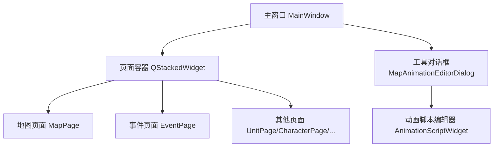
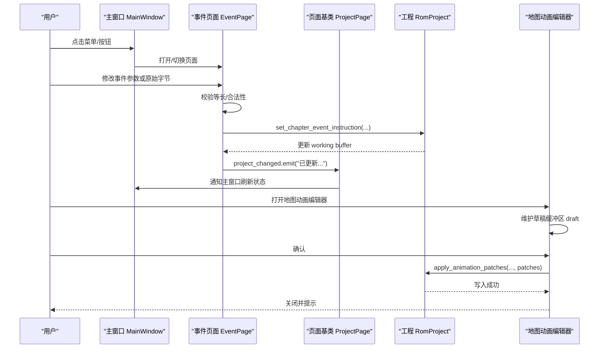
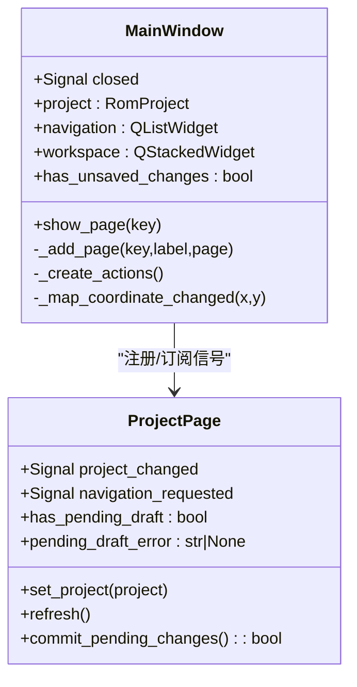
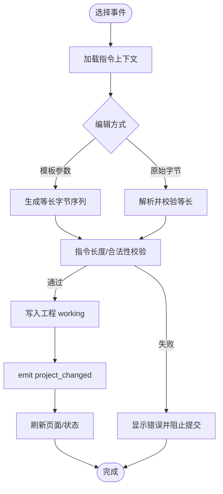
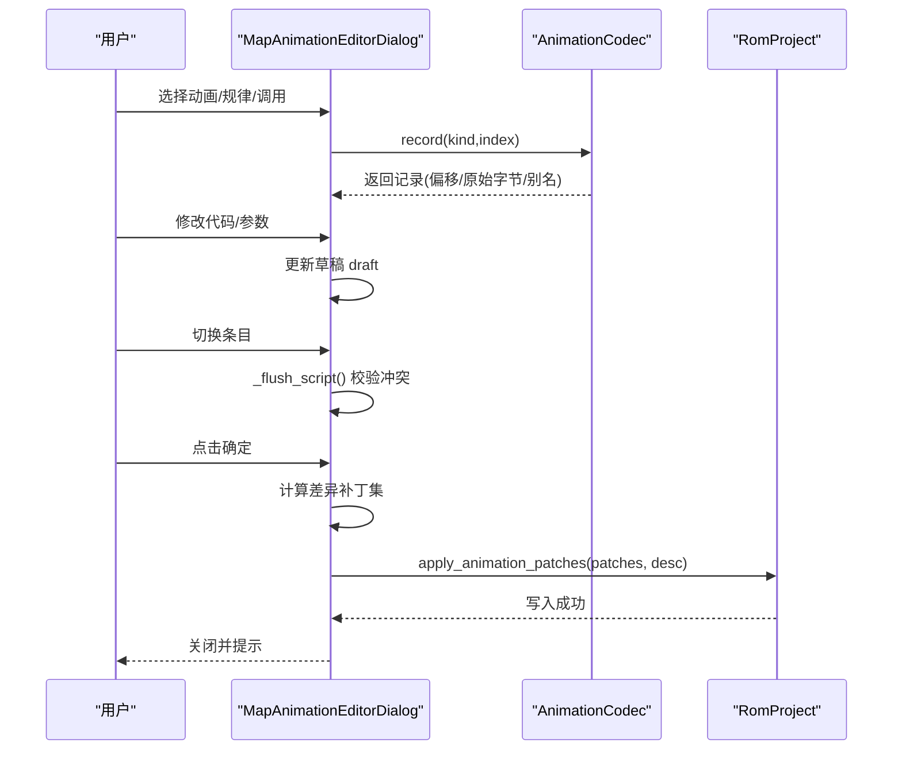
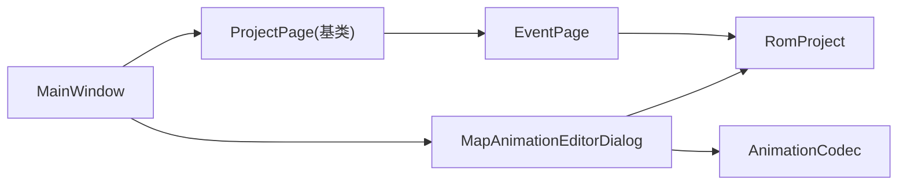

# 事件处理机制

<cite>
**本文引用的文件**
- [app.py](file://src/dc_modifier/app.py)
- [pages.py](file://src/dc_modifier/pages.py)
- [event_page.py](file://src/dc_modifier/event_page.py)
- [animation_editor.py](file://src/dc_modifier/animation_editor.py)
</cite>

## 目录
1. [简介](#简介)
2. [项目结构](#项目结构)
3. [核心组件](#核心组件)
4. [架构总览](#架构总览)
5. [详细组件分析](#详细组件分析)
6. [依赖关系分析](#依赖关系分析)
7. [性能考虑](#性能考虑)
8. [故障排查指南](#故障排查指南)
9. [结论](#结论)
10. [附录：自定义事件类型与处理示例](#附录自定义事件类型与处理示例)

## 简介
本文件系统性梳理本项目中基于 PySide6 的信号槽事件处理机制，覆盖页面级事件流程、用户交互响应、异步操作处理、数据变更传播、状态同步策略与冲突解决方式。文档同时提供调试技巧、性能优化建议，以及可复用的自定义事件类型定义与处理示例，帮助开发者在“战场事件”“地图动画”等复杂编辑场景中构建稳定、可维护的事件驱动界面。

## 项目结构
本项目采用“主窗口 + 多页面（ProjectPage）+ 工具对话框”的架构：
- 主窗口负责应用生命周期、菜单/动作、全局状态与页面导航。
- 各页面继承 ProjectPage，封装自身的数据模型、表单控件与提交逻辑。
- 工具对话框（如地图动画编辑器）以独立事务窗口工作，确认后批量写入工程。

图表来源
- [app.py:276-365](file://src/dc_modifier/app.py#L276-L365)
- [event_page.py:66-228](file://src/dc_modifier/event_page.py#L66-L228)
- [animation_editor.py:214-251](file://src/dc_modifier/animation_editor.py#L214-L251)

章节来源
- [app.py:276-365](file://src/dc_modifier/app.py#L276-L365)

## 核心组件
- 主窗口 MainWindow：集中管理信号槽连接、菜单动作、页面注册与导航、未保存变更检测、工程加载/保存流程。
- 页面基类 ProjectPage：统一暴露 project_changed、navigation_requested 信号；提供 has_pending_draft/pending_draft_error/commit_pending_changes 等通用接口。
- 事件页面 EventPage：实现章节事件筛选、模板参数编辑、原始字节编辑、等长指令校验与提交。
- 地图动画编辑器 MapAnimationEditorDialog：独立事务对话框，维护草稿缓冲区，支持动画脚本、规律、调用等多标签编辑，最终批量写入。

章节来源
- [pages.py:103-152](file://src/dc_modifier/pages.py#L103-L152)
- [event_page.py:66-228](file://src/dc_modifier/event_page.py#L66-L228)
- [animation_editor.py:214-251](file://src/dc_modifier/animation_editor.py#L214-L251)

## 架构总览
下图展示从用户交互到数据落盘的完整事件流：

图表来源
- [app.py:342-346](file://src/dc_modifier/app.py#L342-L346)
- [event_page.py:655-700](file://src/dc_modifier/event_page.py#L655-L700)
- [animation_editor.py:461-482](file://src/dc_modifier/animation_editor.py#L461-L482)

## 详细组件分析

### 主窗口 MainWindow 的事件总线
- 信号槽连接：将页面发出的 project_changed、navigation_requested 连接到主窗口的回调，用于刷新状态与导航跳转。
- 动作与菜单：通过统一的 _action 方法创建 QAction，绑定触发槽函数，支持快捷键。
- 页面注册：_add_page 将页面加入列表、栈索引，并订阅其信号。
- 未保存变更检测：has_unsaved_changes 综合 ROM 工作区快照、资源分配快照与地图草稿状态。

图表来源
- [app.py:276-365](file://src/dc_modifier/app.py#L276-L365)
- [app.py:387-441](file://src/dc_modifier/app.py#L387-L441)
- [pages.py:103-152](file://src/dc_modifier/pages.py#L103-L152)

章节来源
- [app.py:276-365](file://src/dc_modifier/app.py#L276-L365)
- [app.py:387-441](file://src/dc_modifier/app.py#L387-L441)
- [pages.py:103-152](file://src/dc_modifier/pages.py#L103-L152)

### 事件页面 EventPage 的交互与提交
- 筛选与展示：按章节、阶段、类型、关键字过滤指令表，保持当前选择与编辑器一致。
- 模板参数编辑：根据指令长度与 ACTION_FIELDS 动态生成参数控件，实时标注语义（如机体/人物名称）。
- 原始字节编辑：高级面板允许直接输入十六进制字节，强制等长校验。
- 提交与回滚：commit_pending_changes 会优先尝试应用模板或原始字节，成功后刷新视图；若存在错误则阻止切换/提交。

图表来源
- [event_page.py:238-249](file://src/dc_modifier/event_page.py#L238-L249)
- [event_page.py:561-607](file://src/dc_modifier/event_page.py#L561-L607)
- [event_page.py:638-700](file://src/dc_modifier/event_page.py#L638-L700)

章节来源
- [event_page.py:66-228](file://src/dc_modifier/event_page.py#L66-L228)
- [event_page.py:238-249](file://src/dc_modifier/event_page.py#L238-L249)
- [event_page.py:561-607](file://src/dc_modifier/event_page.py#L561-L607)
- [event_page.py:638-700](file://src/dc_modifier/event_page.py#L638-L700)

### 地图动画编辑器 MapAnimationEditorDialog 的事务与草稿
- 草稿缓冲：以 base/draft 双缓冲模式维护修改，避免频繁写盘。
- 多标签编辑：动画脚本、背景/运行/组图规律、动画调用，各自维护只读/可编辑区域。
- 冲突检查：切换动画时先 flush 当前脚本，比较 before/after 确保未被外部修改。
- 批量写入：accept 时计算差异块，调用 apply_animation_patches 一次性写入。

图表来源
- [animation_editor.py:214-251](file://src/dc_modifier/animation_editor.py#L214-L251)
- [animation_editor.py:279-302](file://src/dc_modifier/animation_editor.py#L279-L302)
- [animation_editor.py:383-411](file://src/dc_modifier/animation_editor.py#L383-L411)
- [animation_editor.py:461-482](file://src/dc_modifier/animation_editor.py#L461-L482)

章节来源
- [animation_editor.py:214-251](file://src/dc_modifier/animation_editor.py#L214-L251)
- [animation_editor.py:279-302](file://src/dc_modifier/animation_editor.py#L279-L302)
- [animation_editor.py:383-411](file://src/dc_modifier/animation_editor.py#L383-L411)
- [animation_editor.py:461-482](file://src/dc_modifier/animation_editor.py#L461-L482)

### 页面基类 ProjectPage 的统一契约
- 信号：project_changed、navigation_requested，供主窗口统一处理。
- 草稿协议：has_pending_draft、pending_draft_error、commit_pending_changes，保证页面级事务一致性。
- 错误提示：show_error 统一弹出错误对话框。

章节来源
- [pages.py:103-152](file://src/dc_modifier/pages.py#L103-L152)

## 依赖关系分析
- 主窗口依赖页面基类与具体页面，订阅其信号以实现跨页面状态同步。
- 事件页面依赖工程对象提供的章节事件编解码能力（instruction_length、set_chapter_event_instruction 等）。
- 地图动画编辑器依赖动画编解码器（AnimationCodec）与批量写入接口（apply_animation_patches）。

图表来源
- [app.py:342-346](file://src/dc_modifier/app.py#L342-L346)
- [event_page.py:655-700](file://src/dc_modifier/event_page.py#L655-L700)
- [animation_editor.py:461-482](file://src/dc_modifier/animation_editor.py#L461-L482)

章节来源
- [app.py:342-346](file://src/dc_modifier/app.py#L342-L346)
- [event_page.py:655-700](file://src/dc_modifier/event_page.py#L655-L700)
- [animation_editor.py:461-482](file://src/dc_modifier/animation_editor.py#L461-L482)

## 性能考虑
- 批量写入：地图动画编辑器使用草稿缓冲与差异补丁一次性写入，减少 I/O 次数与锁竞争。
- 视图刷新节流：事件页面在填充表格前 blockSignals 与 setUpdatesEnabled(False)，降低 UI 重绘开销。
- 局部刷新：主窗口仅在必要时刷新已注册页面，避免全量重建。
- 只读区域：对不可编辑指令/规则保持只读，减少无效事件处理。

[本节为通用性能建议，不直接分析具体文件]

## 故障排查指南
- 等长指令校验失败：事件页面要求新指令与原槽等长，否则拒绝提交。检查原始字节输入是否包含多余分隔符或非十六进制字符。
- 冲突检测：地图动画编辑器在切换条目时会比对草稿前后内容，若被外部修改将阻止提交，需重新选择条目后重试。
- 共享记录影响：部分动画/规律由多个条目共享，修改可能影响多处引用，注意提示信息中的共享数量。
- 错误提示：所有异常通过 show_error 或状态栏/提示标签反馈，定位到具体步骤（模板应用/原始字节粘贴/批量写入）。

章节来源
- [event_page.py:561-607](file://src/dc_modifier/event_page.py#L561-L607)
- [event_page.py:638-700](file://src/dc_modifier/event_page.py#L638-L700)
- [animation_editor.py:279-302](file://src/dc_modifier/animation_editor.py#L279-L302)
- [animation_editor.py:461-482](file://src/dc_modifier/animation_editor.py#L461-L482)

## 结论
本项目通过清晰的信号槽分层与页面级事务协议，实现了稳定的事件驱动架构。主窗口作为事件总线协调页面与工具对话框，页面遵循统一的草稿与提交契约，确保数据一致性与用户体验。地图动画编辑器采用草稿缓冲与批量写入，有效降低冲突风险与 I/O 成本。结合等长指令校验、共享记录提示与统一错误处理，整体具备较强的健壮性与可维护性。

[本节为总结性内容，不直接分析具体文件]

## 附录：自定义事件类型与处理示例
以下示例演示如何在项目中定义并处理自定义事件，适用于扩展新的业务信号或跨模块通信场景。

- 自定义信号定义（参考 ProjectPage 模式）
  - 在页面或组件中声明 Signal，例如 project_changed、navigation_requested。
  - 在需要广播变更的位置 emit 携带消息字符串或结构化数据。

- 信号连接与处理
  - 在主窗口或其他监听者中 connect 对应槽函数，执行刷新、导航或状态更新。
  - 对于耗时操作，可在槽中调度线程或使用 Qt 的异步机制，避免阻塞事件循环。

- 典型用法路径
  - 页面提交后 emit project_changed，主窗口接收并刷新相关页面与状态栏。
  - 页面请求导航时 emit navigation_requested，主窗口打开目标页面或工具对话框。

- 调试技巧
  - 在 emit/connect 处添加日志输出，确认信号是否发出与接收。
  - 使用 Qt 的信号追踪工具或断点，验证信号槽链路与参数传递。
  - 对批量刷新场景，临时禁用信号（blockSignals）观察渲染性能。

- 性能优化建议
  - 合并多次 emit，避免高频小信号造成 UI 抖动。
  - 对大列表刷新使用延迟更新（setUpdatesEnabled(False)/True）。
  - 将重型计算放入后台线程，仅将结果通过信号回传 UI 线程。

[本节为概念性指导，不直接分析具体文件]