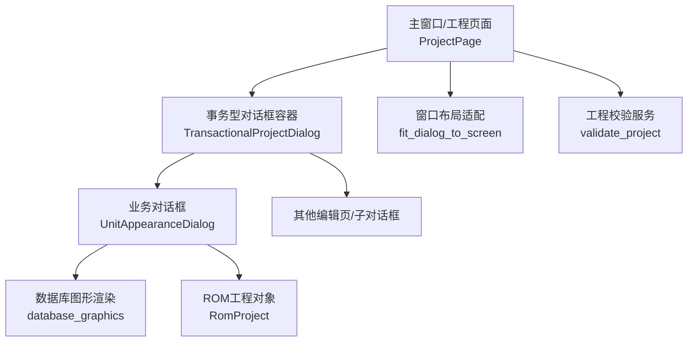
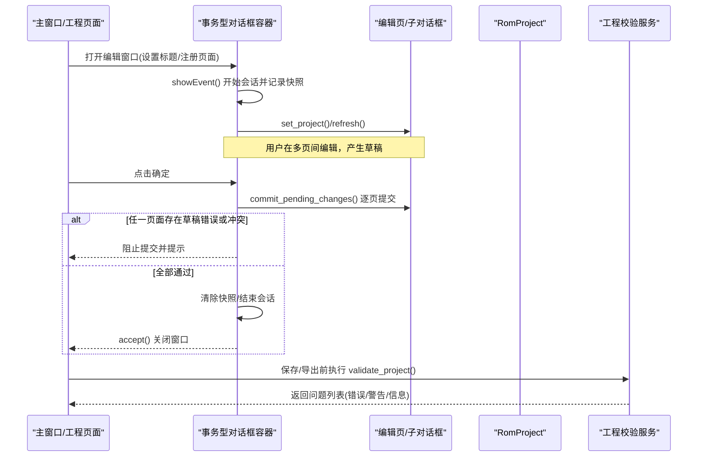
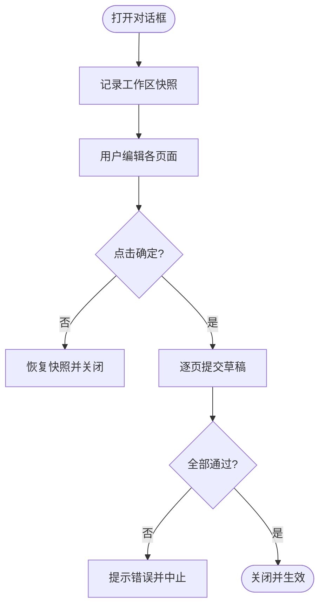
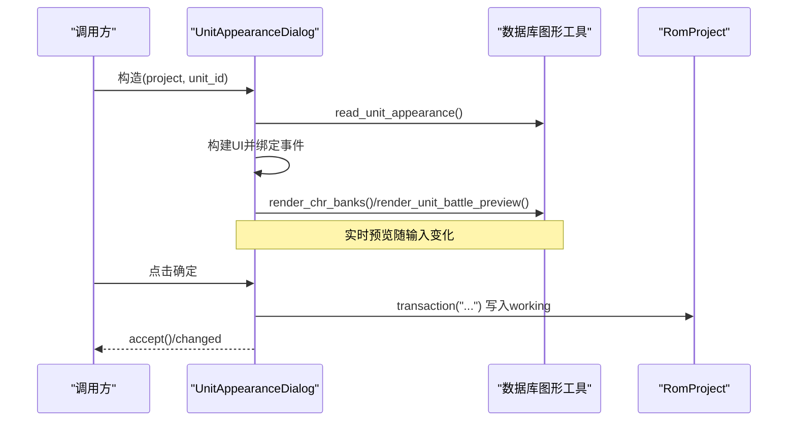
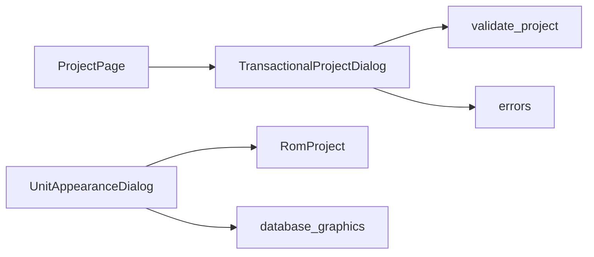

# 对话框管理系统

<cite>
**本文引用的文件**
- [unit_appearance_dialog.py](file://src/dc_modifier/unit_appearance_dialog.py)
- [legacy_windows.py](file://src/dc_modifier/legacy_windows.py)
- [window_layout.py](file://src/dc_modifier/window_layout.py)
- [pages.py](file://src/dc_modifier/pages.py)
- [validation.py](file://src/fc_editor/services/validation.py)
- [errors.py](file://src/fc_editor/errors.py)
</cite>

## 目录
1. [简介](#简介)
2. [项目结构](#项目结构)
3. [核心组件](#核心组件)
4. [架构总览](#架构总览)
5. [详细组件分析](#详细组件分析)
6. [依赖关系分析](#依赖关系分析)
7. [性能考虑](#性能考虑)
8. [故障排查指南](#故障排查指南)
9. [结论](#结论)
10. [附录：自定义对话框开发指南](#附录自定义对话框开发指南)

## 简介
本文件面向本项目中的对话框管理系统，系统性说明模态与非模态对话框的实现模式、生命周期管理、参数传递与结果返回机制，以及对话框与主窗口（工程页面）的交互和数据同步策略。文档还包含自定义对话框的开发指南，覆盖布局设计、用户输入验证、错误提示处理、样式定制与主题适配方案，帮助开发者在现有工程内快速构建一致、可维护且安全的对话框体验。

## 项目结构
对话框相关能力主要分布在以下模块：
- 通用事务型对话框容器：提供会话级快照、提交/取消回滚、跨页草稿冲突检测等能力。
- 具体业务对话框：以“机体拼图与配色”为例，展示数据校验、预览刷新、事务写入与结果返回。
- 页面基类与工程页面：定义统一的“暂存-提交”工作流和错误上报接口。
- 窗口布局适配：为老式大表单提供滚动包裹与尺寸自适应。
- 工程级校验与安全：对ROM结构、扩展分区、受保护区域等进行一致性检查，保障对话框修改的安全性。

图表来源
- [legacy_windows.py:71-259](file://src/dc_modifier/legacy_windows.py#L71-L259)
- [unit_appearance_dialog.py:47-249](file://src/dc_modifier/unit_appearance_dialog.py#L47-L249)
- [window_layout.py:5-24](file://src/dc_modifier/window_layout.py#L5-L24)
- [validation.py:142-682](file://src/fc_editor/services/validation.py#L142-L682)

章节来源
- [legacy_windows.py:71-259](file://src/dc_modifier/legacy_windows.py#L71-L259)
- [unit_appearance_dialog.py:47-249](file://src/dc_modifier/unit_appearance_dialog.py#L47-L249)
- [window_layout.py:5-24](file://src/dc_modifier/window_layout.py#L5-L24)
- [validation.py:142-682](file://src/fc_editor/services/validation.py#L142-L682)

## 核心组件
- 事务型对话框容器（TransactionalProjectDialog）
  - 作用：将多个编辑页/子对话框视为一次编辑会话；打开时记录工作区快照，关闭或取消时统一恢复，避免部分提交导致的中间状态。
  - 关键行为：注册页面、收集草稿、提交前校验、撤销/重做栈与资源分配器快照恢复、跨页草稿冲突检测。
- 业务对话框（UnitAppearanceDialog）
  - 作用：编辑机体的配色与图库，提供实时预览与只读脚本查看。
  - 关键行为：读取外观、参数校验、预览刷新、事务写入、结果标记（changed）。
- 工程页面基类（ProjectPage）
  - 作用：统一“暂存-提交”语义，暴露 pending_draft_error、commit_pending_changes、show_error 等接口。
- 窗口布局适配（fit_dialog_to_screen）
  - 作用：对小屏和高DPI场景，自动为固定尺寸的大表单添加滚动容器并限制最小/最大尺寸。
- 工程校验服务（validate_project）
  - 作用：在保存/导出前进行ROM结构、扩展分区、安全区域等一致性检查，拦截非法修改。

章节来源
- [legacy_windows.py:71-259](file://src/dc_modifier/legacy_windows.py#L71-L259)
- [unit_appearance_dialog.py:47-249](file://src/dc_modifier/unit_appearance_dialog.py#L47-L249)
- [pages.py:103-152](file://src/dc_modifier/pages.py#L103-L152)
- [window_layout.py:5-24](file://src/dc_modifier/window_layout.py#L5-L24)
- [validation.py:142-682](file://src/fc_editor/services/validation.py#L142-L682)

## 架构总览
下图展示了对话框从创建到关闭的生命周期，以及与主窗口的交互和数据同步路径。

图表来源
- [legacy_windows.py:177-259](file://src/dc_modifier/legacy_windows.py#L177-L259)
- [pages.py:103-152](file://src/dc_modifier/pages.py#L103-L152)
- [validation.py:142-682](file://src/fc_editor/services/validation.py#L142-L682)

## 详细组件分析

### 事务型对话框容器：TransactionalProjectDialog
- 生命周期
  - 显示时记录快照：包括 ROM working 缓冲区、资源分配器状态、撤销/重做栈。
  - 接受时：先提交所有页面的草稿，再结束会话并关闭窗口。
  - 拒绝/关闭时：恢复快照到原始状态，清空草稿，刷新页面。
- 草稿与冲突
  - 支持页面级 has_pending_draft/pending_draft_error。
  - 通过可选的 set_transaction_conflict_checker 实现跨页草稿冲突检测（例如同一ROM地址被多处草稿占用）。
- 信号与集成
  - project_changed 通知主窗口更新状态。
  - navigation_requested 转发导航请求给上层。

图表来源
- [legacy_windows.py:177-259](file://src/dc_modifier/legacy_windows.py#L177-L259)
- [legacy_windows.py:202-223](file://src/dc_modifier/legacy_windows.py#L202-L223)
- [legacy_windows.py:131-160](file://src/dc_modifier/legacy_windows.py#L131-L160)

章节来源
- [legacy_windows.py:71-259](file://src/dc_modifier/legacy_windows.py#L71-L259)

### 业务对话框：UnitAppearanceDialog
- 职责
  - 编辑机体外观记录的配色与图库，提供实时预览与只读脚本查看。
  - 在确认时进行严格的数据校验，并通过工程事务写入ROM工作区。
- 参数与结果
  - 入参：project、unit_id、parent。
  - 结果：accept() 后通过 changed 标志反映是否发生实际写入；内部 values() 提供待写入值元组。
- 数据流
  - 读取外观 -> 生成编辑器控件 -> 绑定双向联动 -> 监听变更刷新预览 -> 确认时校验并写入。

图表来源
- [unit_appearance_dialog.py:47-249](file://src/dc_modifier/unit_appearance_dialog.py#L47-L249)

章节来源
- [unit_appearance_dialog.py:22-39](file://src/dc_modifier/unit_appearance_dialog.py#L22-L39)
- [unit_appearance_dialog.py:47-249](file://src/dc_modifier/unit_appearance_dialog.py#L47-L249)

### 工程页面基类：ProjectPage
- 统一草稿模型
  - has_pending_draft：是否存在未提交的表单。
  - pending_draft_error：为何不能提交。
  - commit_pending_changes：触发页面自身的“应用”动作，并在成功后刷新。
  - show_error：统一错误弹窗。
- 与事务型容器的协作
  - 容器在 accept() 前调用各页的 commit_pending_changes()，确保所有草稿一次性提交。

章节来源
- [pages.py:103-152](file://src/dc_modifier/pages.py#L103-L152)

### 窗口布局适配：fit_dialog_to_screen
- 目标：保证老式大表单在小屏/高DPI下仍可操作。
- 策略：当对话框最小尺寸超过可用区域或不可调整大小时，自动用滚动区域包裹其布局，并设置合理的最小/最大尺寸与缩放。

章节来源
- [window_layout.py:5-24](file://src/dc_modifier/window_layout.py#L5-L24)

### 工程级校验：validate_project
- 范围：ROM大小、iNES头、安全签名、扩展分区对齐、地图/剧情/机体/武器/文本/音乐/事件等完整性检查。
- 输出：ValidationIssue 列表，按 severity 分类（error/warning/info），供上层决定是否允许保存/导出。

章节来源
- [validation.py:142-682](file://src/fc_editor/services/validation.py#L142-L682)

## 依赖关系分析
- 耦合与内聚
  - TransactionalProjectDialog 与 ProjectPage 通过标准接口松耦合协作，便于扩展新页面。
  - UnitAppearanceDialog 依赖 RomProject 与数据库图形工具，职责单一、内聚度高。
- 外部依赖
  - PySide6 提供UI框架。
  - fc_editor.services.validation 提供工程级一致性校验。
  - fc_editor.errors 提供异常类型用于跨层传播。
- 潜在循环依赖
  - 当前结构未见直接循环导入；页面与容器通过信号与回调解耦。

图表来源
- [legacy_windows.py:71-259](file://src/dc_modifier/legacy_windows.py#L71-L259)
- [unit_appearance_dialog.py:47-249](file://src/dc_modifier/unit_appearance_dialog.py#L47-L249)
- [validation.py:142-682](file://src/fc_editor/services/validation.py#L142-L682)
- [errors.py:1-11](file://src/fc_editor/errors.py#L1-L11)

章节来源
- [legacy_windows.py:71-259](file://src/dc_modifier/legacy_windows.py#L71-L259)
- [unit_appearance_dialog.py:47-249](file://src/dc_modifier/unit_appearance_dialog.py#L47-L249)
- [validation.py:142-682](file://src/fc_editor/services/validation.py#L142-L682)
- [errors.py:1-11](file://src/fc_editor/errors.py#L1-L11)

## 性能考虑
- 预览渲染
  - 使用 FastTransformation 与 KeepAspectRatio 降低缩放开销；仅在输入变更时刷新。
- 事务写入
  - 批量写入 ROM working 缓冲，减少多次I/O；通过事务上下文集中提交。
- 滚动适配
  - 对超大表单采用滚动容器，避免频繁重排与重绘。
- 校验时机
  - 将 validate_project 放在保存/导出前执行，避免每次输入都触发全量校验。

[本节为通用指导，不直接分析具体文件]

## 故障排查指南
- 常见错误来源
  - 参数越界：如配色索引不在 $00–$3F、图库编号超出活动 CHR。
  - 并发草稿冲突：同一ROM地址被多个编辑页同时持有未提交草稿。
  - 工程校验失败：ROM大小变化、iNES头被改、安全签名不匹配、扩展分区未对齐等。
- 定位建议
  - 查看对话框状态栏/提示标签，确认当前记录偏移与配置。
  - 检查 pending_draft_error 与 show_error 输出的详细信息。
  - 运行 validate_project，根据返回的 ValidationIssue 逐项修复。
- 恢复策略
  - 使用事务型对话框的“取消”功能，自动恢复到打开前的工作区与撤销/重做栈。
  - 若已提交但尚未保存，可利用工程撤销/重做栈回退。

章节来源
- [unit_appearance_dialog.py:22-39](file://src/dc_modifier/unit_appearance_dialog.py#L22-L39)
- [unit_appearance_dialog.py:237-249](file://src/dc_modifier/unit_appearance_dialog.py#L237-L249)
- [legacy_windows.py:131-160](file://src/dc_modifier/legacy_windows.py#L131-L160)
- [validation.py:142-682](file://src/fc_editor/services/validation.py#L142-L682)
- [errors.py:1-11](file://src/fc_editor/errors.py#L1-L11)

## 结论
本项目通过“事务型对话框容器 + 工程页面基类 + 工程级校验”的组合，实现了稳健的对话框生命周期管理与数据一致性保障。业务对话框聚焦于特定领域逻辑与预览体验，借助统一接口与校验服务，既保证了用户体验，又确保了ROM数据的正确性与安全性。

[本节为总结性内容，不直接分析具体文件]

## 附录：自定义对话框开发指南

### 模态与非模态对话框模式
- 模态对话框
  - 适用场景：需要用户完成关键操作后才能继续（如配色与图库编辑）。
  - 推荐做法：继承 QDialog，必要时嵌入到 TransactionalProjectDialog 中参与会话级快照与回滚。
- 非模态对话框
  - 适用场景：辅助面板、日志查看、独立工具窗口。
  - 推荐做法：独立 QDialog，注意与主窗口的事件循环与资源释放；必要时使用 windowLayout.fit_dialog_to_screen 提升可用性。

章节来源
- [legacy_windows.py:71-259](file://src/dc_modifier/legacy_windows.py#L71-L259)
- [window_layout.py:5-24](file://src/dc_modifier/window_layout.py#L5-L24)

### 生命周期管理
- 打开
  - 传入必要参数（如 project、id），初始化视图与预览。
  - 若纳入事务型容器，由容器负责快照与回滚。
- 交互
  - 输入变更驱动预览刷新；保持只读与可写分离。
- 关闭
  - 成功：提交数据并标记 changed。
  - 取消：恢复快照，丢弃草稿。

章节来源
- [unit_appearance_dialog.py:47-249](file://src/dc_modifier/unit_appearance_dialog.py#L47-L249)
- [legacy_windows.py:177-259](file://src/dc_modifier/legacy_windows.py#L177-L259)

### 参数传递与结果返回
- 参数传递
  - 构造函数接收 project、标识符（如 unit_id）、父窗口等。
  - 通过只读属性或方法暴露当前状态（如 appearance、values）。
- 结果返回
  - 使用 accept/reject 控制流程；通过 changed 标志或返回值向调用方反馈是否发生写入。
  - 复杂结果可通过信号或回调传递给上层。

章节来源
- [unit_appearance_dialog.py:47-249](file://src/dc_modifier/unit_appearance_dialog.py#L47-L249)

### 与主窗口的交互与数据同步
- 交互模式
  - 通过 ProjectPage 的 project_changed 与 navigation_requested 与主窗口通信。
  - 事务型容器聚合多页状态，统一提交与回滚。
- 数据同步策略
  - 局部修改：在对话框内通过 RomProject.transaction 原子写入。
  - 全局校验：保存/导出前调用 validate_project 进行一致性检查。

章节来源
- [legacy_windows.py:102-129](file://src/dc_modifier/legacy_windows.py#L102-L129)
- [validation.py:142-682](file://src/fc_editor/services/validation.py#L142-L682)

### 用户输入验证与错误提示
- 验证要点
  - 数值范围（如配色索引、图库编号）。
  - 长度/格式（如记录长度、指针有效性）。
  - 业务规则（如大型机/小型机字段数量差异）。
- 错误提示
  - 使用 show_error 或 QMessageBox 统一提示。
  - 结合状态栏/提示标签给出上下文信息（如记录偏移、机型类型）。

章节来源
- [unit_appearance_dialog.py:22-39](file://src/dc_modifier/unit_appearance_dialog.py#L22-L39)
- [unit_appearance_dialog.py:237-249](file://src/dc_modifier/unit_appearance_dialog.py#L237-L249)
- [pages.py:150-152](file://src/dc_modifier/pages.py#L150-L152)

### 布局设计与预览
- 布局原则
  - 分组清晰（颜色组、图库组、预览区）。
  - 响应式：小屏自动滚动，宽屏多列布局。
- 预览优化
  - 按需刷新，使用快速缩放；只读脚本与可视化预览分离。

章节来源
- [unit_appearance_dialog.py:58-179](file://src/dc_modifier/unit_appearance_dialog.py#L58-L179)
- [window_layout.py:5-24](file://src/dc_modifier/window_layout.py#L5-L24)

### 样式定制与主题适配
- 样式建议
  - 背景深色、边框浅色，突出预览区域。
  - 使用统一控件样式族（如 NesColorButton）保持一致性。
- 主题适配
  - 基于系统主题或工程主题切换颜色；避免硬编码对比度不足的颜色组合。
  - 在高DPI下启用缩放与滚动适配。

章节来源
- [unit_appearance_dialog.py:118-144](file://src/dc_modifier/unit_appearance_dialog.py#L118-L144)
- [window_layout.py:5-24](file://src/dc_modifier/window_layout.py#L5-L24)