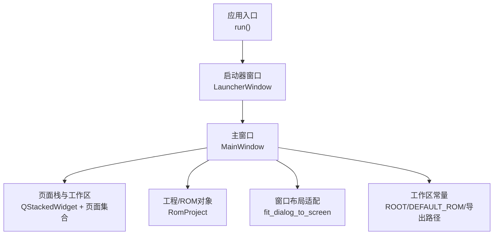
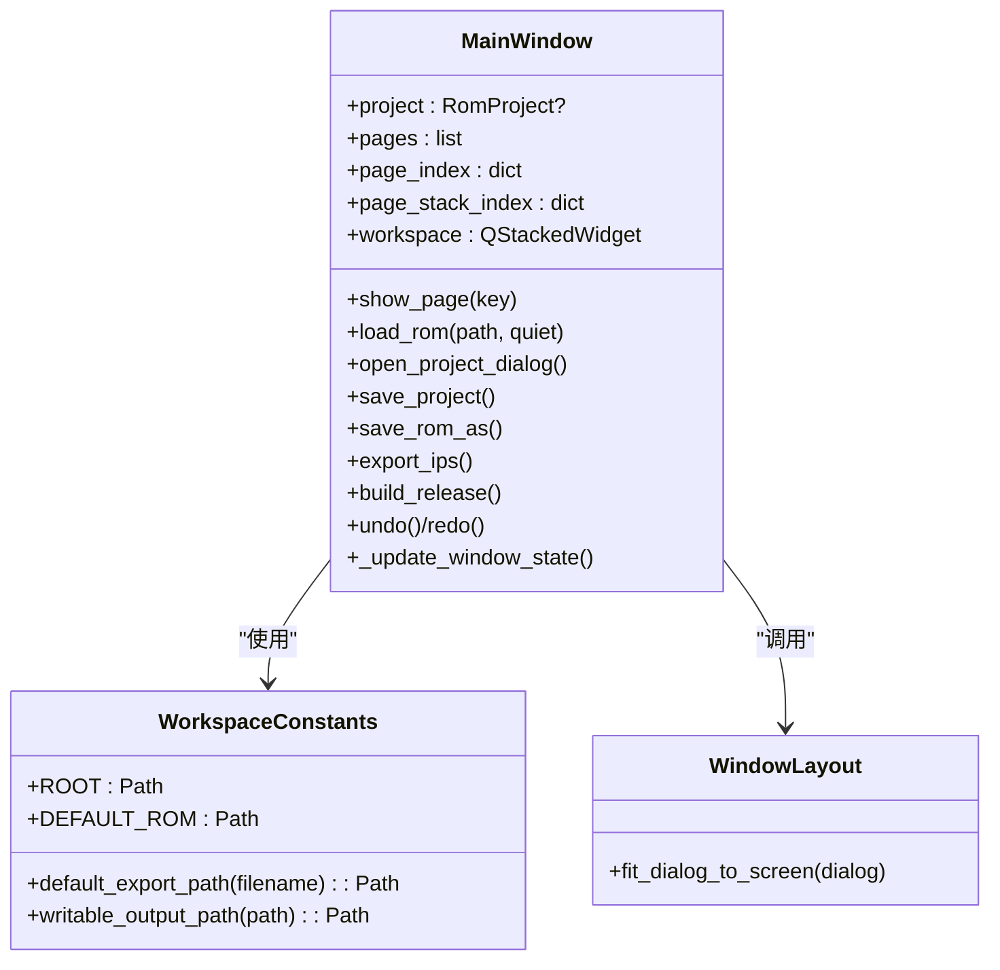
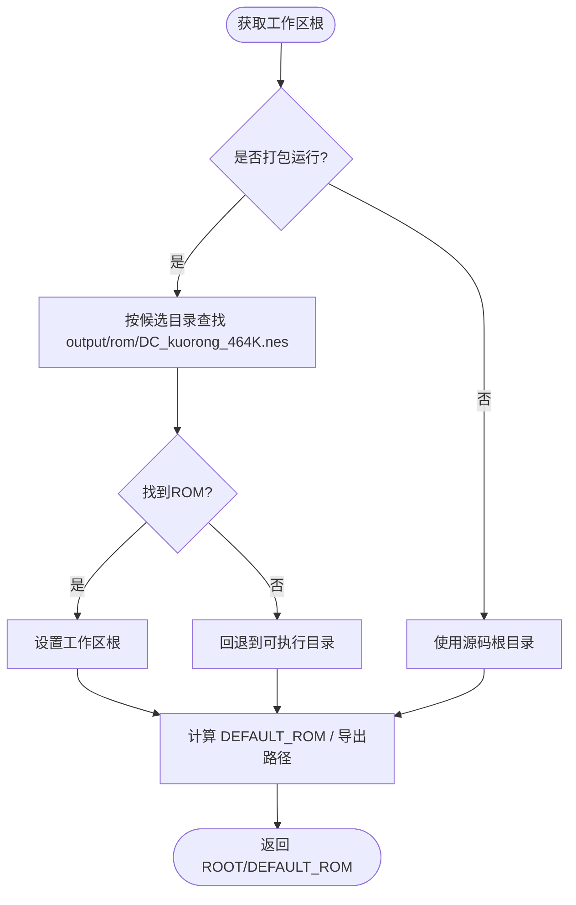
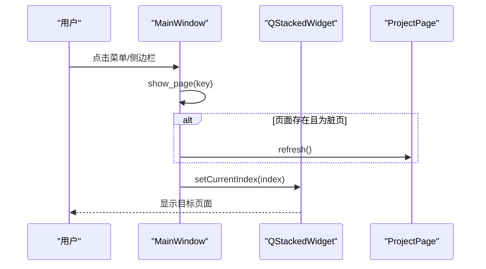
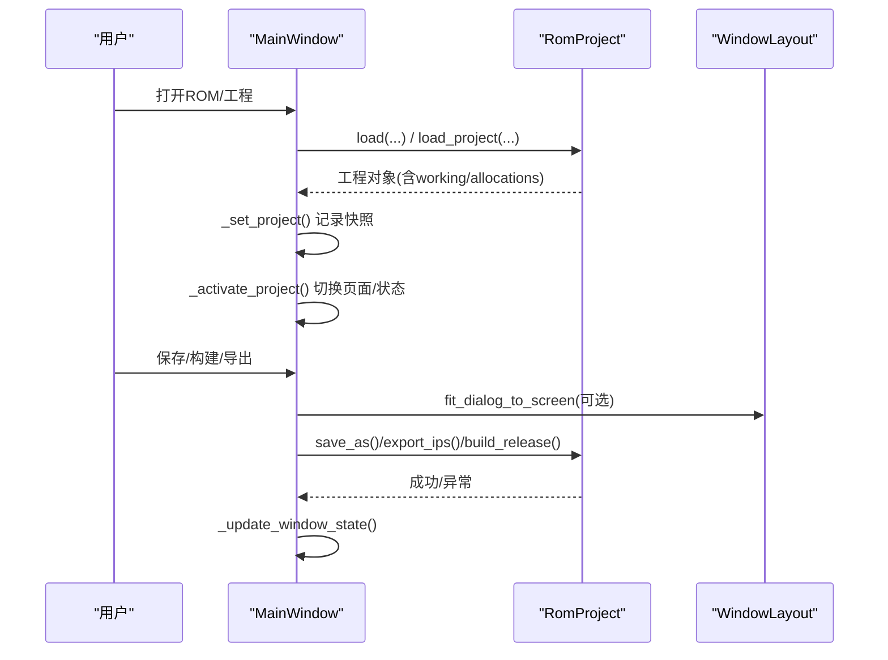
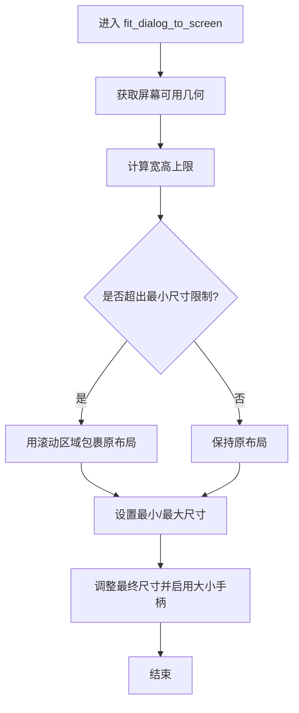
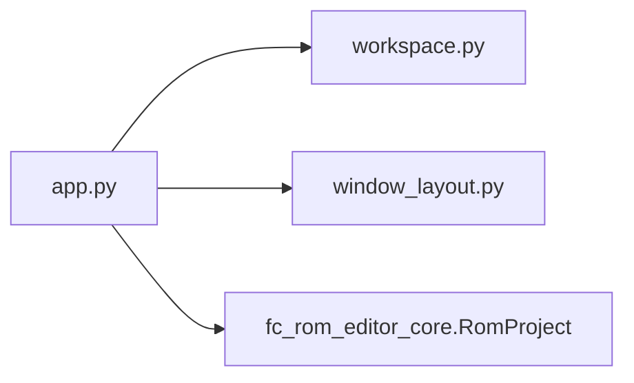

# 工作区管理

<cite>
**本文引用的文件**
- [workspace.py](file://src/dc_modifier/workspace.py)
- [app.py](file://src/dc_modifier/app.py)
- [window_layout.py](file://src/dc_modifier/window_layout.py)
</cite>

## 目录
1. [简介](#简介)
2. [项目结构](#项目结构)
3. [核心组件](#核心组件)
4. [架构总览](#架构总览)
5. [详细组件分析](#详细组件分析)
6. [依赖关系分析](#依赖关系分析)
7. [性能考虑](#性能考虑)
8. [故障排查指南](#故障排查指南)
9. [结论](#结论)
10. [附录：扩展开发指南](#附录扩展开发指南)

## 简介
本文件围绕工作区管理系统，聚焦 RomWorkspace（在本仓库中体现为应用主窗口与工程/ROM工作区管理）的核心功能与架构设计。内容涵盖：
- 工作区状态管理：工程/ROM载入、未保存变更检测、撤销/重做联动
- 项目切换机制：页面注册、导航、激活与刷新策略
- 资源加载流程：默认ROM选择、工程加载、输出路径保护
- 窗口布局系统：面板管理、尺寸适配、对话框滚动适配
- 工作区与ROM项目的绑定关系与数据同步策略
- 工作区扩展开发指南：自定义面板添加、工具栏集成、快捷键配置

## 项目结构
工作区相关代码主要位于 src/dc_modifier 目录：
- workspace.py：工作区根路径、默认ROM、导出路径等基础能力
- app.py：主窗口、页面栈、菜单/动作、工程/ROM生命周期、状态同步
- window_layout.py：对话框尺寸适配与滚动包裹，保证小屏/高DPI可用

图表来源
- [app.py:1155-1183](file://src/dc_modifier/app.py#L1155-L1183)
- [app.py:276-341](file://src/dc_modifier/app.py#L276-L341)
- [window_layout.py:5-25](file://src/dc_modifier/window_layout.py#L5-L25)
- [workspace.py:7-42](file://src/dc_modifier/workspace.py#L7-L42)

章节来源
- [app.py:276-341](file://src/dc_modifier/app.py#L276-L341)
- [workspace.py:7-42](file://src/dc_modifier/workspace.py#L7-L42)
- [window_layout.py:5-25](file://src/dc_modifier/window_layout.py#L5-L25)

## 核心组件
- 工作区常量与路径管理
  - 工作区根目录、默认ROM、导出路径、只读参考目录保护
- 主窗口与页面管理
  - 页面注册、导航、显示、刷新、草稿提交
- 工程/ROM生命周期
  - 打开ROM/工程、校验、激活、保存、构建、导出
- 窗口布局适配
  - 对话框自适应屏幕尺寸，必要时包裹滚动区域

章节来源
- [workspace.py:7-42](file://src/dc_modifier/workspace.py#L7-L42)
- [app.py:276-341](file://src/dc_modifier/app.py#L276-L341)
- [app.py:756-815](file://src/dc_modifier/app.py#L756-L815)
- [app.py:850-989](file://src/dc_modifier/app.py#L850-L989)
- [window_layout.py:5-25](file://src/dc_modifier/window_layout.py#L5-L25)

## 架构总览
工作区以“主窗口”为中心，统一管理工程/ROM对象、页面栈、状态栏与菜单动作；通过工作区常量提供路径与默认ROM；通过布局适配确保各类对话框在多种屏幕下可用。

图表来源
- [app.py:276-341](file://src/dc_modifier/app.py#L276-L341)
- [app.py:756-815](file://src/dc_modifier/app.py#L756-L815)
- [app.py:850-989](file://src/dc_modifier/app.py#L850-L989)
- [workspace.py:7-42](file://src/dc_modifier/workspace.py#L7-L42)
- [window_layout.py:5-25](file://src/dc_modifier/window_layout.py#L5-L25)

## 详细组件分析

### 工作区常量与路径管理（workspace.py）
- 工作区根目录定位：打包运行与非打包运行两种策略，优先寻找包含目标ROM的目录
- 默认ROM选择：优先使用扩容版ROM，回退到基准ROM
- 导出路径：统一输出到 output/exports，并拒绝写入 references/ 只读目录

图表来源
- [workspace.py:7-26](file://src/dc_modifier/workspace.py#L7-L26)

章节来源
- [workspace.py:7-42](file://src/dc_modifier/workspace.py#L7-L42)

### 主窗口与页面管理（app.py）
- 页面注册与导航
  - 通过 _add_page 将页面加入 pages 列表与 page_index/page_stack_index
  - show_page 负责切换到指定页面，并在需要时刷新脏页
- 工作区容器
  - 使用 QStackedWidget 作为页面容器，初始显示空白页
- 状态栏与动作
  - 根据工程/ROM状态启用/禁用菜单项，更新标题与状态信息

图表来源
- [app.py:342-385](file://src/dc_modifier/app.py#L342-L385)
- [app.py:304-308](file://src/dc_modifier/app.py#L304-L308)

章节来源
- [app.py:342-385](file://src/dc_modifier/app.py#L342-L385)
- [app.py:304-308](file://src/dc_modifier/app.py#L304-L308)

### 工程/ROM生命周期与数据同步（app.py）
- 打开ROM/工程
  - load_rom：加载工程对象，校验是否为兼容布局与基准哈希，必要时提示需先规划容量
  - open_project_dialog：加载工程文件，支持自动或手动选择基准ROM
- 激活工程
  - _activate_project：设置只读输出根、快照工作字节与分配表、切换到地图页
- 保存与构建
  - save_project/save_rom_as/export_ips/build_release：统一通过 writable_output_path 校验输出位置，避免覆盖参考目录
- 撤销/重做
  - undo/redo：委托给 RomProject，刷新已注册页面并更新状态

图表来源
- [app.py:756-815](file://src/dc_modifier/app.py#L756-L815)
- [app.py:850-989](file://src/dc_modifier/app.py#L850-L989)
- [window_layout.py:5-25](file://src/dc_modifier/window_layout.py#L5-L25)

章节来源
- [app.py:756-815](file://src/dc_modifier/app.py#L756-L815)
- [app.py:850-989](file://src/dc_modifier/app.py#L850-L989)
- [window_layout.py:5-25](file://src/dc_modifier/window_layout.py#L5-L25)

### 窗口布局系统与面板管理（window_layout.py）
- 对话框自适应：当对话框最小尺寸超过屏幕可用区域时，自动包裹滚动区域，保证控件可见
- 尺寸限制：根据屏幕几何计算最大宽高，保留大小手柄以便用户微调

图表来源
- [window_layout.py:5-25](file://src/dc_modifier/window_layout.py#L5-L25)

章节来源
- [window_layout.py:5-25](file://src/dc_modifier/window_layout.py#L5-L25)

### 工作区与ROM项目的绑定关系与数据同步策略
- 绑定方式
  - 主窗口持有 RomProject 引用，并通过 set_project 将工程注入所有已注册页面
- 数据快照与变更检测
  - 保存 ROM/工程时记录 working 字节与 allocations 快照，用于判断是否有未保存修改
  - 地图草稿状态参与未保存变更判定
- 刷新策略
  - 编辑后标记所有页面为“脏”，仅在必要时刷新当前活动页面，避免频繁重建导致的卡顿

章节来源
- [app.py:756-772](file://src/dc_modifier/app.py#L756-L772)
- [app.py:731-742](file://src/dc_modifier/app.py#L731-L742)
- [app.py:1033-1055](file://src/dc_modifier/app.py#L1033-L1055)

## 依赖关系分析
- 模块内聚与耦合
  - app.py 高度聚合了UI、业务与工程生命周期，依赖 workspace.py 的路径能力与 window_layout.py 的布局适配
  - workspace.py 无外部依赖，职责单一
  - window_layout.py 仅依赖Qt UI框架
- 外部依赖
  - fc_rom_editor_core.RomProject：工程/ROM对象、撤销/重做、构建与导出
  - PySide6：UI框架

图表来源
- [app.py:33-58](file://src/dc_modifier/app.py#L33-L58)
- [workspace.py:7-42](file://src/dc_modifier/workspace.py#L7-L42)
- [window_layout.py:5-25](file://src/dc_modifier/window_layout.py#L5-L25)

章节来源
- [app.py:33-58](file://src/dc_modifier/app.py#L33-L58)
- [workspace.py:7-42](file://src/dc_modifier/workspace.py#L7-L42)
- [window_layout.py:5-25](file://src/dc_modifier/window_layout.py#L5-L25)

## 性能考虑
- 页面刷新优化：仅在必要时刷新当前活动页面，其他页面延迟到下次访问时刷新，减少重建开销
- 变更计数缓存：通过比较 working 字节快照与 change_rows 长度，避免重复枚举整个ROM
- 对话框滚动适配：对超大表单自动包裹滚动区域，避免不可见控件导致的交互阻塞

[本节为通用指导，不直接分析具体文件]

## 故障排查指南
- 无法打开ROM/工程
  - 检查是否为兼容布局与基准哈希；若为输出ROM但缺少容量规划，需先进行容量规划
  - 查看错误消息中的前几条校验失败原因
- 无法保存/导出
  - 确认目标路径不在 references/ 只读目录；如需输出到该目录请调整路径
  - 工程/ROM保存前会尝试提交地图草稿，若草稿无效需先修正
- 撤销/重做不可用
  - 若存在地图草稿，需先应用或还原草稿再执行撤销/重做
- 界面过小或控件不可见
  - 使用内置的对话框尺寸适配逻辑，必要时手动调整窗口大小

章节来源
- [app.py:794-815](file://src/dc_modifier/app.py#L794-L815)
- [app.py:850-989](file://src/dc_modifier/app.py#L850-L989)
- [app.py:991-1026](file://src/dc_modifier/app.py#L991-L1026)
- [window_layout.py:5-25](file://src/dc_modifier/window_layout.py#L5-L25)

## 结论
本工作区管理系统以主窗口为核心，结合工作区常量与布局适配，提供了稳健的ROM/工程管理、页面导航与状态同步机制。通过严格的输出路径保护与草稿提交策略，保障了数据安全与一致性。扩展点清晰，便于新增页面与工具集成。

[本节为总结性内容，不直接分析具体文件]

## 附录：扩展开发指南

### 添加自定义面板（页面）
- 注册页面
  - 在主窗口初始化阶段，通过 _add_page 将新页面加入 pages、page_index 与 page_stack_index
  - 为新页面定义唯一 key 与显示标签
- 导航与显示
  - 通过 show_page(key) 切换至新页面；必要时实现 refresh 方法以支持脏页刷新
- 与工程绑定
  - 页面应订阅 project_changed 事件，并在 set_project 中接收工程对象

章节来源
- [app.py:342-365](file://src/dc_modifier/app.py#L342-L365)
- [app.py:366-385](file://src/dc_modifier/app.py#L366-L385)

### 集成工具栏/菜单与快捷键
- 创建动作
  - 使用 _action 创建 QAction，绑定触发槽函数，并可设置快捷键
- 添加到菜单
  - 在 _create_menus 中将动作加入对应菜单（如“扩展功能”、“工程”等）
- 快捷键约定
  - 为避免冲突，历史相关的撤销/重做使用扩展命名空间快捷键

章节来源
- [app.py:387-441](file://src/dc_modifier/app.py#L387-L441)
- [app.py:443-488](file://src/dc_modifier/app.py#L443-L488)

### 扩展对话框与页面复用
- 复用现有扩展对话框模式
  - 使用 TransactionalProjectDialog 包装页面，提供确定/取消与导航回调
- 导航跳转
  - 通过 navigation_requested 信号实现跨页面跳转或关闭对话框后继续流程

章节来源
- [app.py:583-653](file://src/dc_modifier/app.py#L583-L653)

### 路径与输出安全
- 默认导出路径
  - 使用 default_export_path 生成 output/exports 下的默认文件名
- 输出路径保护
  - 使用 writable_output_path 校验目标路径，禁止写入 references/ 及其子目录

章节来源
- [workspace.py:29-42](file://src/dc_modifier/workspace.py#L29-L42)

### 窗口布局与可用性
- 对话框自适应
  - 在打开对话框前调用 fit_dialog_to_screen，确保在小屏/高DPI环境下可用
- 尺寸与滚动
  - 对于超大表单，自动包裹滚动区域，保留大小手柄以便用户调整

章节来源
- [window_layout.py:5-25](file://src/dc_modifier/window_layout.py#L5-L25)