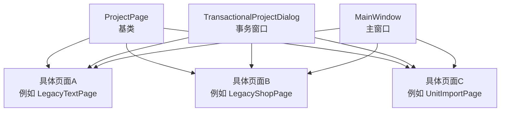
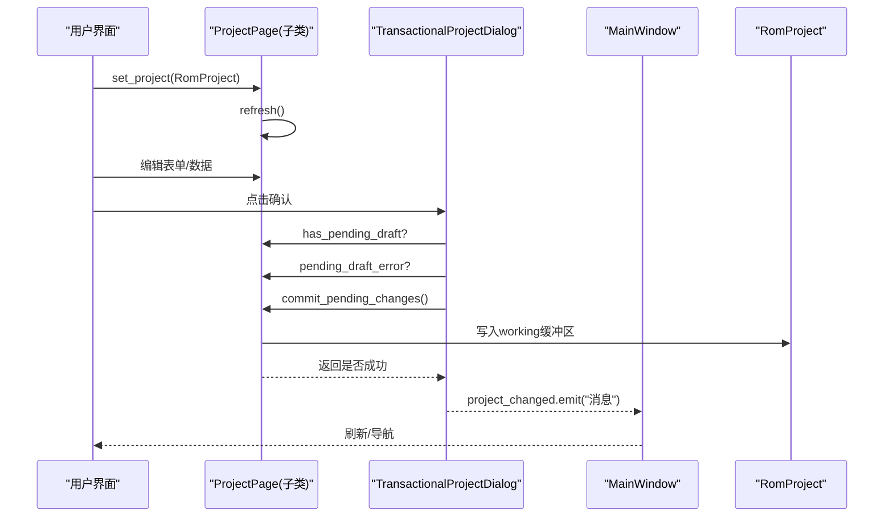
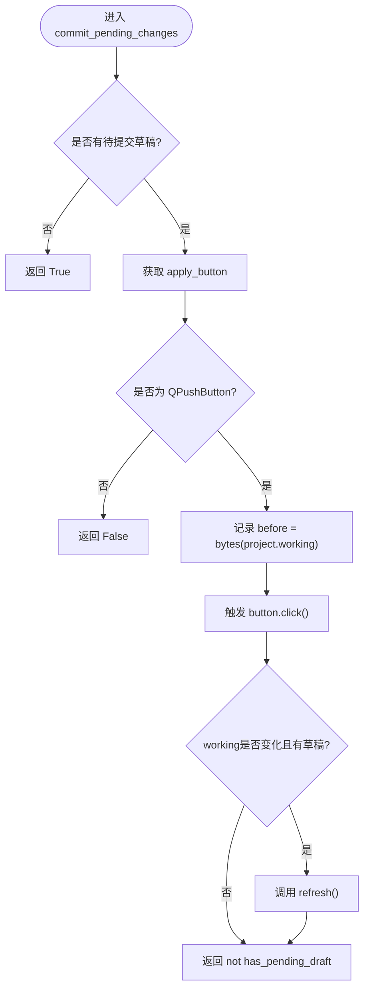
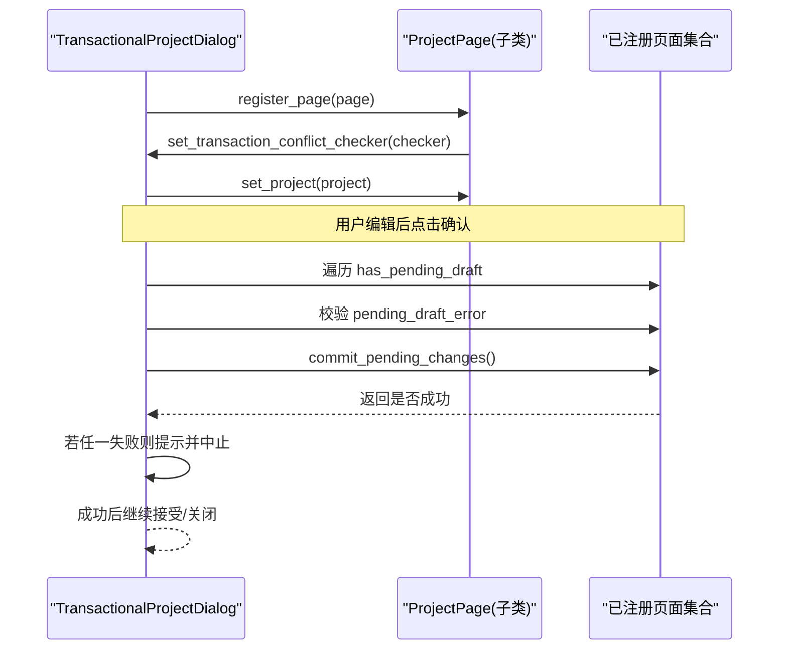
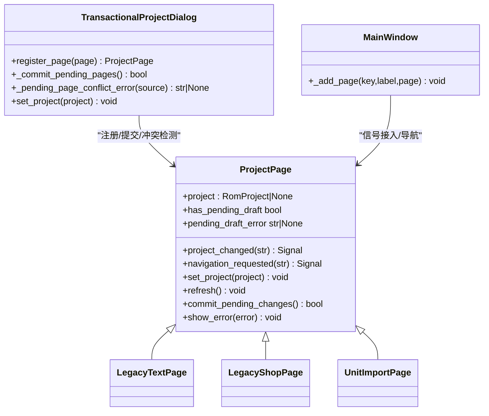

# ProjectPage基类

<cite>
**本文引用的文件**
- [pages.py](file://src/dc_modifier/pages.py)
- [legacy_windows.py](file://src/dc_modifier/legacy_windows.py)
- [app.py](file://src/dc_modifier/app.py)
- [legacy_text_pages.py](file://src/dc_modifier/legacy_text_pages.py)
- [unit_import_page.py](file://src/dc_modifier/unit_import_page.py)
</cite>

## 目录
1. [简介](#简介)
2. [项目结构](#项目结构)
3. [核心组件](#核心组件)
4. [架构总览](#架构总览)
5. [详细组件分析](#详细组件分析)
6. [依赖关系分析](#依赖关系分析)
7. [性能考虑](#性能考虑)
8. [故障排查指南](#故障排查指南)
9. [结论](#结论)
10. [附录：自定义页面最佳实践与常见陷阱](#附录：自定义页面最佳实践与常见陷阱)

## 简介
ProjectPage是所有编辑页面的统一基类，负责：
- 生命周期管理：通过set_project()注入工程对象并触发刷新。
- 信号机制：project_changed用于通知上层“数据已变更”，navigation_requested用于请求导航到指定页面。
- 状态同步：提供has_pending_draft、pending_draft_error、commit_pending_changes等接口，配合事务窗口统一管理草稿提交与冲突检测。
- 错误处理：统一的show_error弹窗。
- 扩展点：refresh()虚方法供子类在工程变化时重建UI与数据绑定。

该设计使所有页面具备一致的交互契约，便于在对话框或主窗口中集中管理多页签的提交、撤销与跨页冲突。

## 项目结构
- 基类定义位于 pages.py 中的 ProjectPage。
- 事务化对话框（TransactionalProjectDialog）在 legacy_windows.py 中注册页面、桥接信号、执行批量提交与冲突检查。
- 主窗口在 app.py 中将页面信号接入工作区与导航。
- 多个具体页面（如 LegacyTextPage、LegacyShopPage、UnitImportPage 等）继承 ProjectPage，实现各自的 refresh() 与草稿逻辑。

图表来源
- [pages.py:103-151](file://src/dc_modifier/pages.py#L103-L151)
- [legacy_windows.py:102-175](file://src/dc_modifier/legacy_windows.py#L102-L175)
- [app.py:342-350](file://src/dc_modifier/app.py#L342-L350)

章节来源
- [pages.py:103-151](file://src/dc_modifier/pages.py#L103-L151)
- [legacy_windows.py:102-175](file://src/dc_modifier/legacy_windows.py#L102-L175)
- [app.py:342-350](file://src/dc_modifier/app.py#L342-L350)

## 核心组件
- ProjectPage：定义生命周期、信号、草稿状态与提交流程。
- TransactionalProjectDialog：注册页面、代理信号、批量提交、冲突检测、会话快照与回滚。
- 具体页面：实现业务相关的 refresh()、草稿存储、apply_* 方法与可选的事务同步组。

章节来源
- [pages.py:103-151](file://src/dc_modifier/pages.py#L103-L151)
- [legacy_windows.py:102-175](file://src/dc_modifier/legacy_windows.py#L102-L175)

## 架构总览
ProjectPage作为抽象契约，将“页面如何与工程交互”标准化；事务窗口负责“何时提交、如何回滚、如何避免冲突”；主窗口负责“页面展示与导航”。

图表来源
- [pages.py:111-148](file://src/dc_modifier/pages.py#L111-L148)
- [legacy_windows.py:202-223](file://src/dc_modifier/legacy_windows.py#L202-L223)
- [app.py:342-350](file://src/dc_modifier/app.py#L342-L350)

## 详细组件分析

### ProjectPage基类
- 生命周期
  - set_project(project): 设置工程引用并调用refresh()以重建UI和数据绑定。
  - refresh(): 空实现，子类必须覆盖以响应工程变化。
- 信号
  - project_changed: 当页面数据发生变化时发出，携带描述性消息。
  - navigation_requested: 请求跳转到某个页面键（如“units”、“maps”）。
- 草稿与提交
  - has_pending_draft: 默认基于是否存在可启用的“应用”按钮；子类可重写为更精确的状态判断。
  - pending_draft_error: 默认None；子类可返回错误文本阻止提交。
  - commit_pending_changes(): 默认尝试点击apply_button并提交一次；若working缓冲被修改且仍有草稿则刷新UI；返回是否无待提交草稿。
- 错误处理
  - show_error(error): 弹出错误对话框。

图表来源
- [pages.py:131-148](file://src/dc_modifier/pages.py#L131-L148)

章节来源
- [pages.py:103-151](file://src/dc_modifier/pages.py#L103-L151)

### 事务窗口与信号集成（TransactionalProjectDialog）
- 页面注册
  - register_page(page): 将页面加入列表，注入冲突检查器，连接 project_changed 与 navigation_requested，并调用 page.set_project(self.project)。
- 信号转发
  - _registered_page_changed: 刷新当前页，若存在 transaction_sync_group，则刷新同组其他无草稿的页面，最后向上发出 project_changed。
  - _forward_navigation: 透传 navigation_requested。
- 冲突检测
  - _pending_page_conflict_error: 比较各页 pending_draft_key/pending_draft_keys，若发现同一ROM地址或特定资源被多处草稿占用，返回错误信息。
- 批量提交
  - _commit_pending_pages: 收集所有有草稿的页面，先校验 pending_draft_error，再逐一调用 commit_pending_changes。
- 会话快照与回滚
  - _begin_session / reject: 打开时快照 working、分配器与撤销栈；取消时恢复并清理草稿。

图表来源
- [legacy_windows.py:102-175](file://src/dc_modifier/legacy_windows.py#L102-L175)
- [legacy_windows.py:202-223](file://src/dc_modifier/legacy_windows.py#L202-L223)

章节来源
- [legacy_windows.py:102-175](file://src/dc_modifier/legacy_windows.py#L102-L175)
- [legacy_windows.py:202-223](file://src/dc_modifier/legacy_windows.py#L202-L223)

### 主窗口集成（MainWindow）
- _add_page(key, label, page): 将页面加入工作区，并将 page.project_changed 连接到 _after_edit，page.navigation_requested 连接到 _open_extension_page，实现全局更新与导航。

章节来源
- [app.py:342-350](file://src/dc_modifier/app.py#L342-L350)

### 典型页面实现示例

#### LegacyTextPage（文字编辑）
- 草稿模型：_drafts[(group, index, variant)] -> text。
- 事务同步组：transaction_sync_group = "rom_text"。
- 冲突键：pending_draft_keys 基于 codec.record(...).file_offset。
- 提交前校验：_patches() 会检测是否与其他页面修改了相同原始记录，若有冲突抛出异常并被 pending_draft_error 捕获。

章节来源
- [legacy_text_pages.py:20-200](file://src/dc_modifier/legacy_text_pages.py#L20-L200)

#### LegacyShopPage（商店与对话）
- 草稿模型：_drafts（商店元数据）、_text_drafts（对话文本）。
- 事务同步组：transaction_sync_group = "rom_text"。
- pending_draft_error：调用 _patches() 生成补丁，若检测到共享记录冲突或非法值则返回错误。
- commit_pending_changes：直接调用 apply_changes() 完成写入并刷新。

章节来源
- [legacy_text_pages.py:555-771](file://src/dc_modifier/legacy_text_pages.py#L555-L771)

#### UnitImportPage（机体导入）
- 委托图形控件：has_pending_draft、pending_draft_error、commit_pending_changes 均委派给内部 graphics。
- 提交流程：在事务上下文中应用导入包，必要时写入CHR图块，并发出 project_changed 消息。

章节来源
- [unit_import_page.py:30-358](file://src/dc_modifier/unit_import_page.py#L30-L358)

## 依赖关系分析
- ProjectPage 依赖 Qt 信号与对话框组件，以及 RomProject 类型（由 fc_rom_editor_core 提供）。
- 事务窗口依赖 ProjectPage 的公共接口（含可选的 set_transaction_conflict_checker、pending_draft_key(s)、transaction_sync_group）。
- 具体页面通过实现 refresh() 和草稿相关属性/方法，与基类契约保持一致。

图表来源
- [pages.py:103-151](file://src/dc_modifier/pages.py#L103-L151)
- [legacy_windows.py:102-175](file://src/dc_modifier/legacy_windows.py#L102-L175)
- [app.py:342-350](file://src/dc_modifier/app.py#L342-L350)

章节来源
- [pages.py:103-151](file://src/dc_modifier/pages.py#L103-L151)
- [legacy_windows.py:102-175](file://src/dc_modifier/legacy_windows.py#L102-L175)
- [app.py:342-350](file://src/dc_modifier/app.py#L342-L350)

## 性能考虑
- refresh() 应避免昂贵操作；仅在必要时重建控件与数据绑定。
- 大量列表/表格刷新时注意阻塞信号与禁用更新，减少重绘开销。
- 使用 pending_draft_keys 进行冲突检测时，尽量保持键计算轻量。
- 在 commit_pending_changes 中，仅当 working 确实变化时才刷新UI，避免重复渲染。

[本节为通用指导，不直接分析具体文件]

## 故障排查指南
- 无法提交草稿
  - 检查 has_pending_draft 是否正确反映“有待提交表单”的状态。
  - 检查 pending_draft_error 是否返回了错误信息（如共享记录冲突）。
  - 确认 commit_pending_changes 是否调用了正确的 apply_* 方法。
- 跨页冲突
  - 确保实现了 pending_draft_key 或 pending_draft_keys，以便事务窗口检测冲突。
  - 若使用 transaction_sync_group，请确保同组页面能正确刷新。
- 导航无效
  - 确认 navigation_requested 信号已发出，且主窗口已连接对应处理器。
- 错误未显示
  - 检查 show_error 是否被调用，或是否在事务窗口中被拦截并转换为警告框。

章节来源
- [legacy_windows.py:202-223](file://src/dc_modifier/legacy_windows.py#L202-L223)
- [legacy_text_pages.py:190-200](file://src/dc_modifier/legacy_text_pages.py#L190-L200)
- [unit_import_page.py:326-358](file://src/dc_modifier/unit_import_page.py#L326-L358)

## 结论
ProjectPage通过统一的接口定义了页面生命周期、信号、草稿与提交流程，结合事务窗口的冲突检测与会话管理，提供了稳定可扩展的多页签编辑框架。遵循其契约可实现一致的用户体验与可靠的数据一致性保障。

[本节为总结，不直接分析具体文件]

## 附录：自定义页面最佳实践与常见陷阱

### 最佳实践
- 始终在 refresh() 中根据 self.project 重建UI与数据绑定，并在加载失败时友好提示。
- 明确定义 has_pending_draft：优先基于内部草稿状态，而非仅依赖按钮可用性。
- 实现 pending_draft_error：在提交前做合法性校验与冲突预判，返回人类可读的错误信息。
- 如需参与跨页冲突检测，暴露 pending_draft_key 或 pending_draft_keys，并设置 transaction_sync_group。
- 在 commit_pending_changes 中：
  - 先校验 pending_draft_error。
  - 在 RomProject.transaction 上下文内执行写入（如适用），保证原子性与可撤销。
  - 成功后刷新UI并可选择发出 project_changed 消息。
- 使用 show_error 统一错误呈现，避免分散的 QMessageBox 调用。

### 常见陷阱
- 忘记在 set_project 中清空旧状态，导致残留数据影响新工程。
- refresh() 中未处理 project 为 None 的情况，引发空引用异常。
- 未实现 pending_draft_key(s)，导致事务窗口无法检测冲突。
- 在 commit_pending_changes 中未刷新UI，造成视图与底层数据不一致。
- 在多线程或异步场景下直接操作Qt控件，导致崩溃或不可预期行为。
- 忽略 transaction_sync_group，导致同组页面未及时刷新。

[本节为通用指导，不直接分析具体文件]