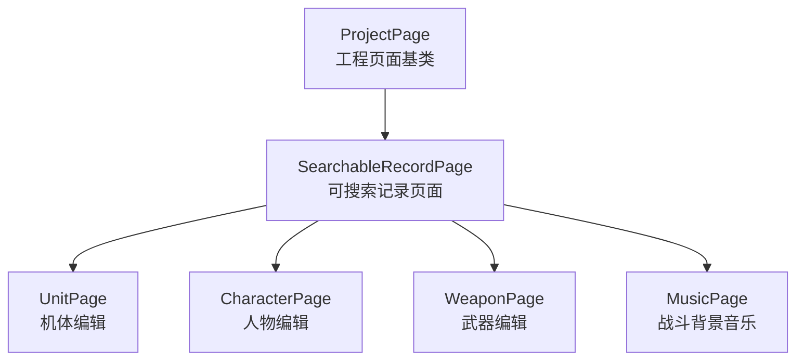
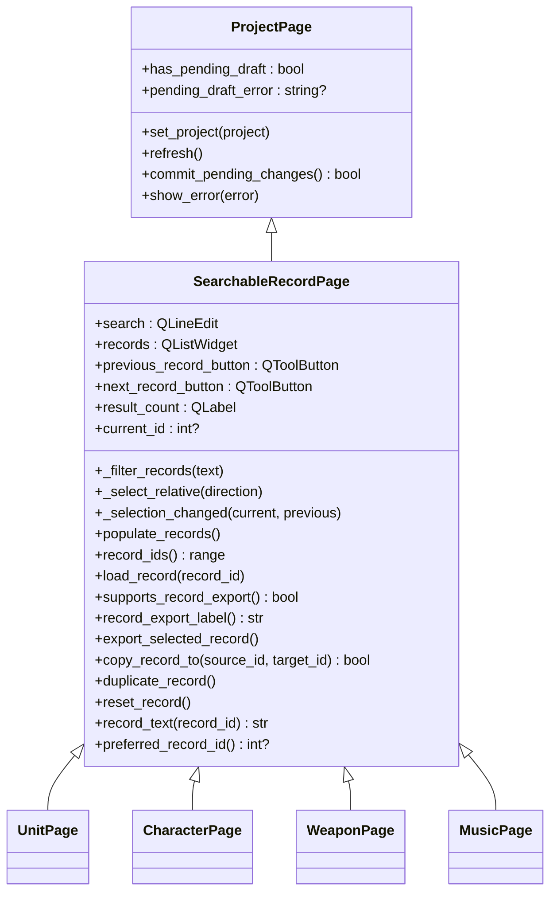
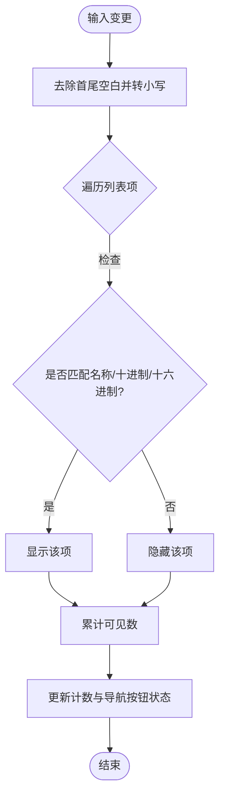
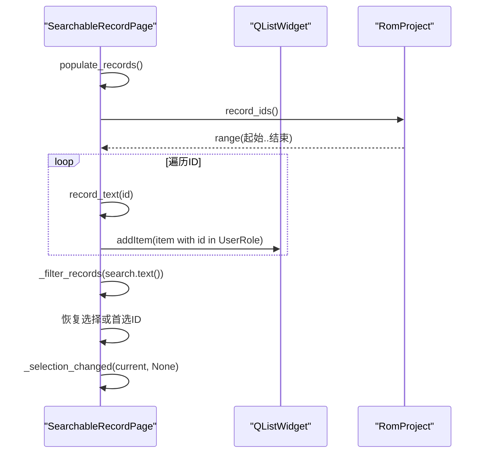
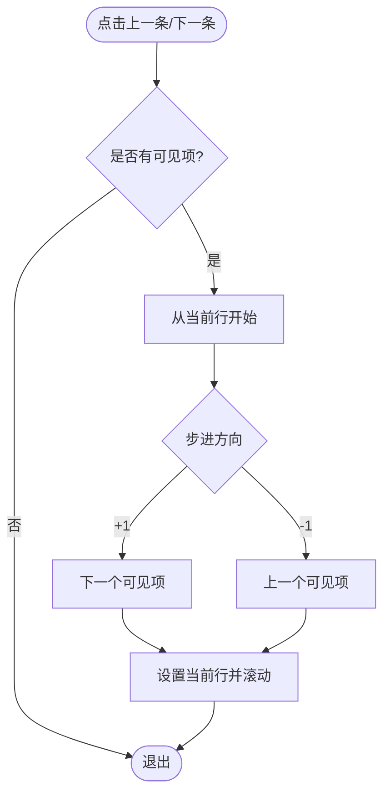
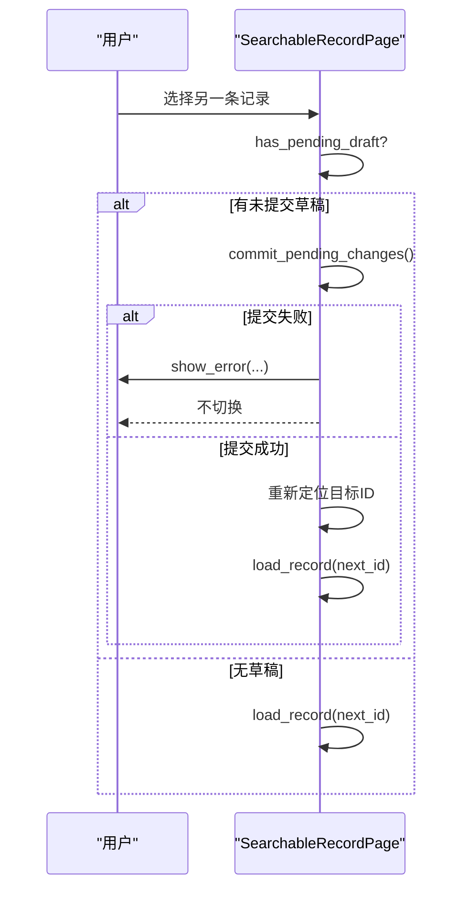
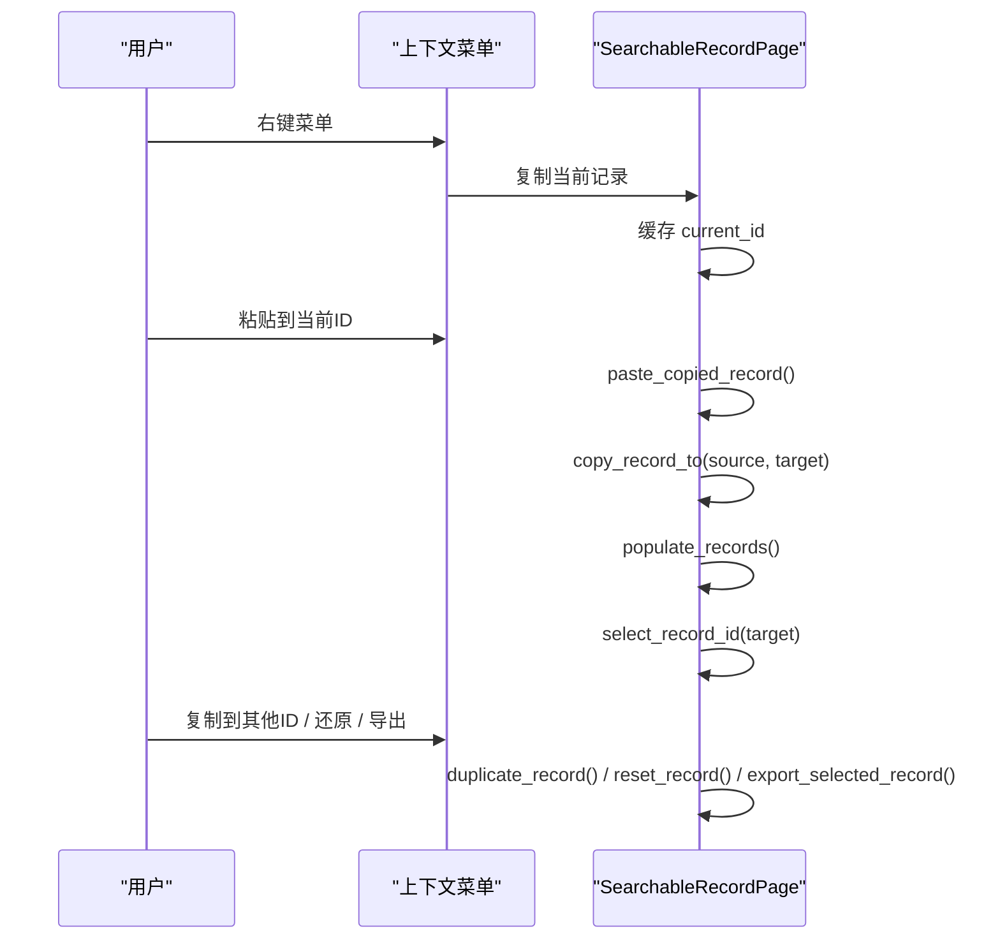
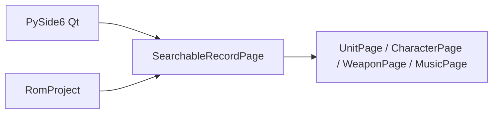

# SearchableRecordPage可搜索记录页面

<cite>
**本文引用的文件**
- [pages.py](file://src/dc_modifier/pages.py)
</cite>

## 目录
1. [简介](#简介)
2. [项目结构](#项目结构)
3. [核心组件](#核心组件)
4. [架构总览](#架构总览)
5. [详细组件分析](#详细组件分析)
6. [依赖关系分析](#依赖关系分析)
7. [性能考虑](#性能考虑)
8. [故障排查指南](#故障排查指南)
9. [结论](#结论)
10. [附录：自定义记录页面开发指南](#附录自定义记录页面开发指南)

## 简介
SearchableRecordPage 是用于“数据记录编辑”的通用页面基类，提供统一的搜索过滤、记录列表管理、选择导航与上下文菜单能力。具体业务页面（如机体、人物、武器、音乐等）通过继承该基类并实现若干抽象方法，即可快速获得一套成熟的记录编辑界面与交互流程。

## 项目结构
本页面位于修改器页面的统一模块中，作为多个具体记录编辑页的基类存在。其职责包括：
- 提供搜索框与结果计数显示
- 维护 QListWidget 记录列表
- 提供上一条/下一条可见记录的导航按钮
- 在切换记录时自动加载详情表单
- 提供复制、粘贴、重复、还原、导出等上下文菜单操作
- 定义可扩展的抽象点，供子类实现数据范围、记录加载与列表刷新

图表来源
- [pages.py:102-149](file://src/dc_modifier/pages.py#L102-L149)
- [pages.py:243-511](file://src/dc_modifier/pages.py#L243-L511)
- [pages.py:514-880](file://src/dc_modifier/pages.py#L514-L880)
- [pages.py:882-1214](file://src/dc_modifier/pages.py#L882-L1214)
- [pages.py:1216-1513](file://src/dc_modifier/pages.py#L1216-L1513)
- [pages.py:1515-1878](file://src/dc_modifier/pages.py#L1515-L1878)

章节来源
- [pages.py:102-149](file://src/dc_modifier/pages.py#L102-L149)
- [pages.py:243-511](file://src/dc_modifier/pages.py#L243-L511)

## 核心组件
- 搜索与过滤
  - 搜索框：支持名称、十进制或十六进制ID模糊匹配
  - 过滤逻辑：按文本、十进制、十六进制三种维度匹配，更新可见项数量与导航按钮状态
- 记录列表
  - 使用 QListWidget 展示所有记录条目，每个条目携带记录ID
  - 支持交替行色、固定行高、右键上下文菜单
- 选择与导航
  - 上一条/下一条按钮仅对可见记录生效
  - 切换记录前会尝试提交未应用的草稿，避免丢失改动
- 上下文菜单
  - 复制当前记录、粘贴到当前ID、复制到其他ID、还原当前记录、导出当前记录（若支持）
- 抽象接口
  - record_ids()：定义数据范围
  - load_record(record_id)：加载具体记录到表单
  - populate_records()：刷新列表并恢复选择
  - supports_record_export()/record_export_label()/export_selected_record()：可选导出能力
  - copy_record_to()/duplicate_record()/reset_record()：复制/重复/还原的具体语义由子类实现

章节来源
- [pages.py:243-511](file://src/dc_modifier/pages.py#L243-L511)

## 架构总览
SearchableRecordPage 采用“模板方法 + 策略”的组合模式：
- 模板方法：框架负责 UI 组装、事件绑定、列表渲染、过滤、导航、上下文菜单、草稿提交等通用流程
- 策略扩展：子类通过实现 record_ids()、load_record()、populate_records() 以及可选的导出/复制/还原等方法，注入具体业务逻辑

图表来源
- [pages.py:102-149](file://src/dc_modifier/pages.py#L102-L149)
- [pages.py:243-511](file://src/dc_modifier/pages.py#L243-L511)
- [pages.py:514-880](file://src/dc_modifier/pages.py#L514-L880)
- [pages.py:882-1214](file://src/dc_modifier/pages.py#L882-L1214)
- [pages.py:1216-1513](file://src/dc_modifier/pages.py#L1216-L1513)
- [pages.py:1515-1878](file://src/dc_modifier/pages.py#L1515-L1878)

## 详细组件分析

### 搜索过滤系统（search、_filter_records）
- 输入支持：名称、十进制ID、十六进制ID
- 匹配规则：忽略大小写；当查询为空时显示全部
- 输出效果：更新可见项数量、启用/禁用上一条/下一条按钮

图表来源
- [pages.py:439-453](file://src/dc_modifier/pages.py#L439-L453)

章节来源
- [pages.py:248-251](file://src/dc_modifier/pages.py#L248-L251)
- [pages.py:439-453](file://src/dc_modifier/pages.py#L439-L453)

### 记录列表管理（records QListWidget）
- 列表数据来源：调用 record_ids() 获取 ID 范围
- 列表项内容：调用 record_text(record_id) 生成显示文本
- 列表项数据：将 record_id 存入 UserRole，便于后续查找与过滤
- 批量刷新：使用 blockSignals 与 updatesEnabled 控制信号与重绘，提升性能
- 选择恢复：优先保持上次选中ID，否则使用 preferred_record_id()

图表来源
- [pages.py:396-437](file://src/dc_modifier/pages.py#L396-L437)
- [pages.py:439-453](file://src/dc_modifier/pages.py#L439-L453)

章节来源
- [pages.py:396-437](file://src/dc_modifier/pages.py#L396-L437)

### 选择导航机制（previous_record_button、next_record_button、_select_relative）
- 导航目标：仅在可见记录间移动
- 循环行为：到达末尾继续向前/向后循环
- 滚动定位：自动滚动至选中项

图表来源
- [pages.py:455-466](file://src/dc_modifier/pages.py#L455-L466)

章节来源
- [pages.py:256-263](file://src/dc_modifier/pages.py#L256-L263)
- [pages.py:455-466](file://src/dc_modifier/pages.py#L455-L466)

### 选择变更与草稿提交（_selection_changed）
- 切换记录前，若存在未提交的表单改动，会先尝试提交
- 提交失败则阻止切换并提示错误
- 成功提交后恢复目标ID的选择并加载新记录

图表来源
- [pages.py:468-508](file://src/dc_modifier/pages.py#L468-L508)
- [pages.py:131-148](file://src/dc_modifier/pages.py#L131-L148)

章节来源
- [pages.py:468-508](file://src/dc_modifier/pages.py#L468-L508)

### 上下文菜单功能（复制、粘贴、重复、还原、导出）
- 复制当前记录：缓存当前ID，用于后续粘贴
- 粘贴到当前ID：将已复制记录复制到当前ID，成功后刷新列表并选中目标
- 复制到其他ID：弹出目标ID选择对话框，执行复制
- 还原当前记录：回滚到基准ROM状态
- 导出当前记录：若子类支持导出，则显示对应菜单项并触发导出

图表来源
- [pages.py:285-315](file://src/dc_modifier/pages.py#L285-L315)
- [pages.py:317-341](file://src/dc_modifier/pages.py#L317-L341)

章节来源
- [pages.py:285-315](file://src/dc_modifier/pages.py#L285-L315)
- [pages.py:317-341](file://src/dc_modifier/pages.py#L317-L341)

### 抽象方法与子类实现要点
- 数据范围：record_ids() 返回 ID 范围（例如单位、武器、人物、音乐选择器的有效区间）
- 列表文本：record_text(record_id) 决定列表项显示内容（通常包含ID与显示名）
- 详情加载：load_record(record_id) 将记录字段填充到表单控件，并更新原始值对比
- 刷新列表：populate_records() 由基类实现，子类一般无需重写
- 导出能力：supports_record_export() 为真时，菜单显示导出项；record_export_label() 定制标签；export_selected_record() 实现导出逻辑
- 复制/重复/还原：copy_record_to()/duplicate_record()/reset_record() 由子类实现具体业务语义

章节来源
- [pages.py:385-394](file://src/dc_modifier/pages.py#L385-L394)
- [pages.py:396-437](file://src/dc_modifier/pages.py#L396-L437)
- [pages.py:514-880](file://src/dc_modifier/pages.py#L514-L880)
- [pages.py:882-1214](file://src/dc_modifier/pages.py#L882-L1214)
- [pages.py:1216-1513](file://src/dc_modifier/pages.py#L1216-L1513)
- [pages.py:1515-1878](file://src/dc_modifier/pages.py#L1515-L1878)

## 依赖关系分析
- 外部依赖
  - PySide6 Qt 组件：QLineEdit、QListWidget、QToolButton、QLabel、QMenu、QMessageBox 等
  - 工程对象 RomProject：提供记录编码/解码、名称引用、武器/音乐绑定、事务与验证等能力
- 内部依赖
  - ProjectPage：提供工程生命周期、草稿提交、错误提示等基础能力
  - 具体页面：UnitPage、CharacterPage、WeaponPage、MusicPage 继承并扩展 SearchableRecordPage

图表来源
- [pages.py:8-46](file://src/dc_modifier/pages.py#L8-L46)
- [pages.py:243-511](file://src/dc_modifier/pages.py#L243-L511)

章节来源
- [pages.py:8-46](file://src/dc_modifier/pages.py#L8-L46)
- [pages.py:243-511](file://src/dc_modifier/pages.py#L243-L511)

## 性能考虑
- 列表刷新优化：使用 blockSignals 与 setUpdatesEnabled(False) 减少信号与重绘开销
- 过滤效率：基于内存中的 QListWidget 项进行过滤，适合中小规模数据集
- 选择恢复：避免不必要的滚动与重选，提高用户体验
- 建议：
  - 对于超大数据集，可考虑分页或虚拟列表
  - 过滤条件复杂时可引入索引或缓存

[本节为通用指导，不直接分析具体文件]

## 故障排查指南
- 切换记录失败
  - 现象：无法切换到其他记录
  - 原因：存在未提交的表单改动且提交失败
  - 处理：查看 pending_draft_error 提示信息，修正表单后再试
- 上下文菜单不可用
  - 现象：右键菜单无动作或动作禁用
  - 原因：未选择记录或没有已复制记录
  - 处理：先选择记录，再执行复制；确保目标ID与源ID不同
- 导出功能无效
  - 现象：菜单无导出项或导出失败
  - 原因：子类未实现导出能力或异常
  - 处理：确认 supports_record_export() 返回值；检查导出路径与权限

章节来源
- [pages.py:131-148](file://src/dc_modifier/pages.py#L131-L148)
- [pages.py:285-315](file://src/dc_modifier/pages.py#L285-L315)
- [pages.py:468-508](file://src/dc_modifier/pages.py#L468-L508)

## 结论
SearchableRecordPage 提供了稳定、可扩展的记录编辑框架，屏蔽了搜索、列表、导航、上下文菜单等通用细节，使具体业务页面只需关注数据范围、表单加载与业务操作。通过清晰的抽象点与一致的交互模型，开发者可以快速构建高质量的数据记录编辑界面。

[本节为总结性内容，不直接分析具体文件]

## 附录：自定义记录页面开发指南
以下为创建自定义记录页面的完整步骤与最佳实践：

- 继承基类
  - 新建类继承 SearchableRecordPage
  - 在 __init__ 中构建左侧列表与右侧详情表单布局

- 实现数据范围
  - 重写 record_ids()：返回当前工程的有效 ID 范围
  - 重写 record_text(record_id)：返回列表项显示文本（建议包含ID与显示名）

- 实现详情加载
  - 重写 load_record(record_id)：
    - 清空或重置表单控件
    - 从 RomProject 读取记录字段并填充到控件
    - 显示原始值对比（可选）
    - 更新“待应用”状态指示

- 刷新列表
  - 通常无需重写 populate_records()；如需特殊初始化可在 refresh() 中调用

- 草稿提交与验证
  - 在表单控件的事件回调中调用 _update_pending_state() 或类似方法
  - 重写 has_pending_draft 与 pending_draft_error（如需更复杂的校验）
  - 在 apply_record() 中执行事务写入，并通过 project_changed 通知上层

- 上下文菜单扩展
  - 若需导出：实现 supports_record_export()、record_export_label()、export_selected_record()
  - 若需复制/重复/还原：实现 copy_record_to()、duplicate_record()、reset_record()

- 示例参考
  - 机体页面：UnitPage 展示了属性字段、名称引用、武器槽、原始记录写入、导出 .dcunit 等
  - 人物页面：CharacterPage 展示了名称引用、名称文字、战斗音乐绑定
  - 武器页面：WeaponPage 展示了属性字段、名称引用、原始记录只读展示
  - 音乐页面：MusicPage 展示了绑定编辑、批量应用、曲槽导入/导出

章节来源
- [pages.py:514-880](file://src/dc_modifier/pages.py#L514-L880)
- [pages.py:882-1214](file://src/dc_modifier/pages.py#L882-L1214)
- [pages.py:1216-1513](file://src/dc_modifier/pages.py#L1216-L1513)
- [pages.py:1515-1878](file://src/dc_modifier/pages.py#L1515-L1878)