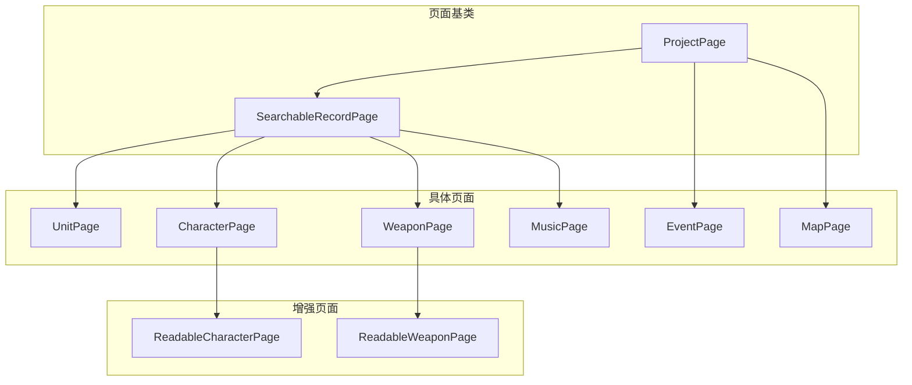
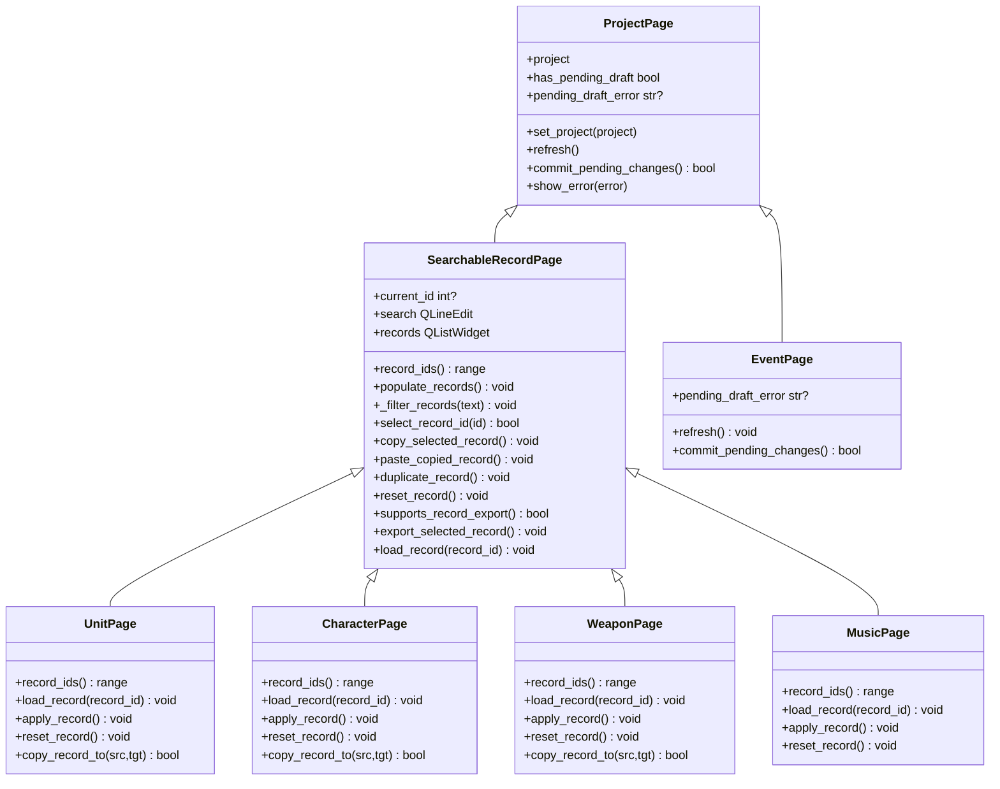
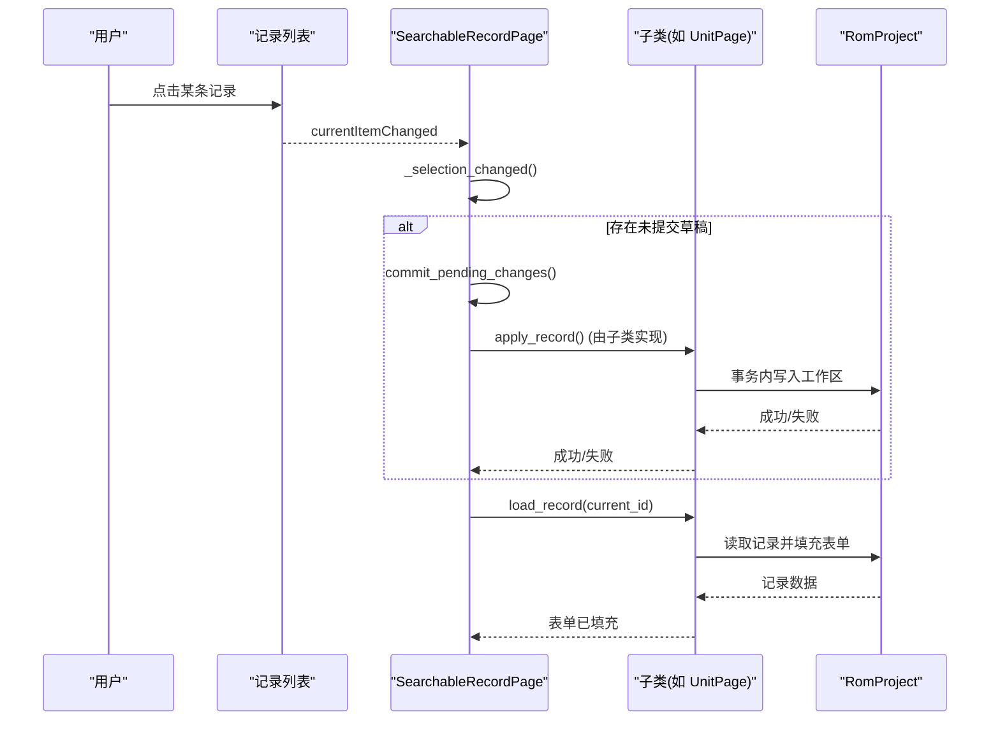
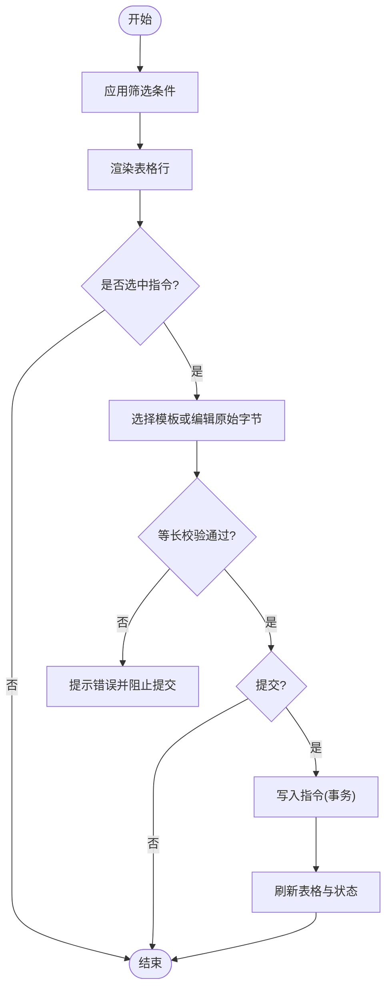
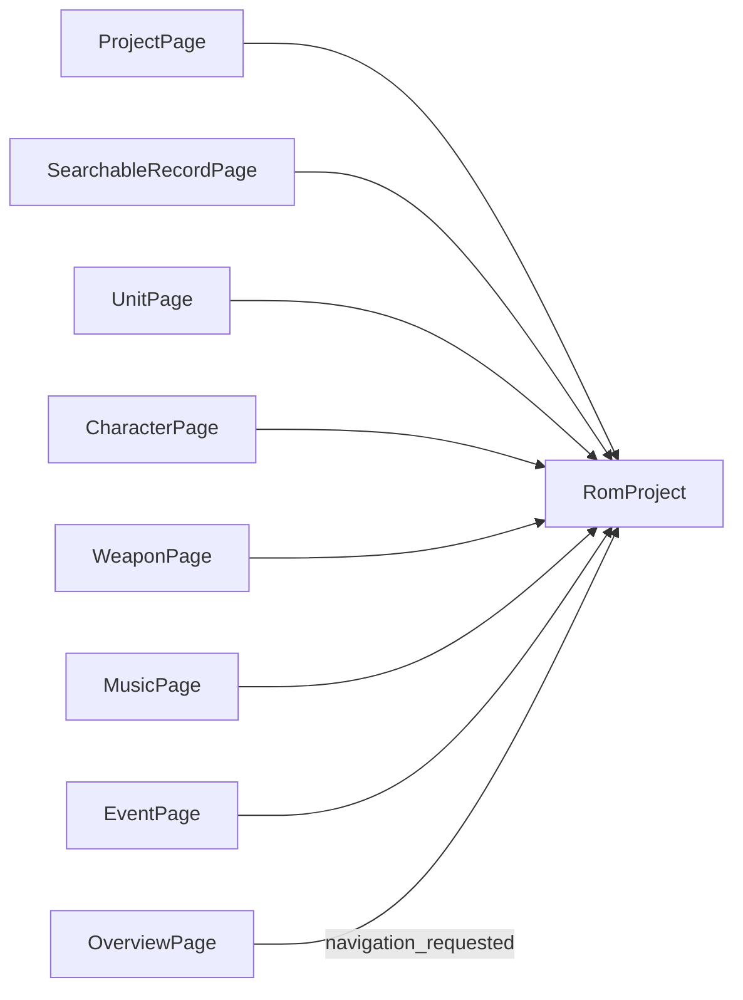

# 页面开发框架

<cite>
**本文引用的文件**
- [pages.py](file://src/dc_modifier/pages.py)
- [database_records.py](file://src/dc_modifier/database_records.py)
- [event_page.py](file://src/dc_modifier/event_page.py)
- [map_page.py](file://src/dc_modifier/map_page.py)
</cite>

## 目录
1. [简介](#简介)
2. [项目结构](#项目结构)
3. [核心组件](#核心组件)
4. [架构总览](#架构总览)
5. [详细组件分析](#详细组件分析)
6. [依赖关系分析](#依赖关系分析)
7. [性能考量](#性能考量)
8. [故障排查指南](#故障排查指南)
9. [结论](#结论)
10. [附录：自定义页面开发示例](#附录自定义页面开发示例)

## 简介
本文件面向“FC扩容MMC3”修改器中的页面开发框架，系统性说明 ProjectPage 基类的设计模式与继承体系，深入解析 SearchableRecordPage 的搜索、过滤、记录管理功能（record_ids()、load_record()、populate_records() 等），并覆盖页面生命周期管理、状态同步机制、事务处理集成。同时提供自定义页面开发的完整实践指引，包括表单设计、数据绑定、验证逻辑、页面间导航、事件处理与错误处理的最佳实践。

## 项目结构
- 页面基类与通用能力集中在 pages.py，提供 ProjectPage、SearchableRecordPage 以及若干具体页面（UnitPage、CharacterPage、WeaponPage、MusicPage 等）。
- database_records.py 在现有页面之上提供“可读增强版”页面（ReadableCharacterPage、ReadableWeaponPage），封装更友好的详情面板与导出能力。
- event_page.py 实现“战场事件”编辑页，采用表格+模板/原始字节双通道编辑，具备强约束的等长指令写入。
- map_page.py 为地图相关页面，展示与交互复杂，但同样遵循 ProjectPage 的生命周期与事务模型。

图表来源
- [pages.py:103-152](file://src/dc_modifier/pages.py#L103-L152)
- [pages.py:243-511](file://src/dc_modifier/pages.py#L243-L511)
- [pages.py:514-880](file://src/dc_modifier/pages.py#L514-L880)
- [pages.py:882-1214](file://src/dc_modifier/pages.py#L882-L1214)
- [pages.py:1216-1513](file://src/dc_modifier/pages.py#L1216-L1513)
- [pages.py:1515-1600](file://src/dc_modifier/pages.py#L1515-L1600)
- [event_page.py:66-228](file://src/dc_modifier/event_page.py#L66-L228)
- [map_page.py:1008-1015](file://src/dc_modifier/map_page.py#L1008-L1015)

章节来源
- [pages.py:103-152](file://src/dc_modifier/pages.py#L103-L152)
- [pages.py:243-511](file://src/dc_modifier/pages.py#L243-L511)
- [event_page.py:66-228](file://src/dc_modifier/event_page.py#L66-L228)
- [map_page.py:1008-1015](file://src/dc_modifier/map_page.py#L1008-L1015)

## 核心组件
- ProjectPage：所有页面的根基类，负责工程对象注入、刷新钩子、待提交草稿检测、统一错误提示、窗口级“应用”时的自动提交。
- SearchableRecordPage：在 ProjectPage 基础上增加“可搜索记录列表 + 详情加载”的通用模式，内置复制/粘贴/复制到其他ID/还原/导出等上下文菜单能力。
- UnitPage / CharacterPage / WeaponPage / MusicPage：基于 SearchableRecordPage 的具体业务页面，分别实现 record_ids()、load_record()、apply_record()、reset_record()、copy_record_to() 等。
- EventPage：非记录型页面，采用“筛选+表格+模板/原始字节”编辑模式，强调等长指令安全边界。
- ReadableCharacterPage / ReadableWeaponPage：对 CharacterPage / WeaponPage 的可读增强包装，提供更丰富的元信息、导出与辅助面板。

章节来源
- [pages.py:103-152](file://src/dc_modifier/pages.py#L103-L152)
- [pages.py:243-511](file://src/dc_modifier/pages.py#L243-L511)
- [pages.py:514-880](file://src/dc_modifier/pages.py#L514-L880)
- [pages.py:882-1214](file://src/dc_modifier/pages.py#L882-L1214)
- [pages.py:1216-1513](file://src/dc_modifier/pages.py#L1216-L1513)
- [pages.py:1515-1600](file://src/dc_modifier/pages.py#L1515-L1600)
- [event_page.py:66-228](file://src/dc_modifier/event_page.py#L66-L228)
- [database_records.py:105-267](file://src/dc_modifier/database_records.py#L105-L267)
- [database_records.py:270-536](file://src/dc_modifier/database_records.py#L270-L536)

## 架构总览
下图展示了页面基类与具体页面的继承关系，以及典型的数据流：用户操作触发界面信号 → 页面更新待提交状态 → 提交时进入项目事务 → 持久化到工作区 → 刷新UI。

图表来源
- [pages.py:103-152](file://src/dc_modifier/pages.py#L103-L152)
- [pages.py:243-511](file://src/dc_modifier/pages.py#L243-L511)
- [pages.py:514-880](file://src/dc_modifier/pages.py#L514-L880)
- [pages.py:882-1214](file://src/dc_modifier/pages.py#L882-L1214)
- [pages.py:1216-1513](file://src/dc_modifier/pages.py#L1216-L1513)
- [pages.py:1515-1600](file://src/dc_modifier/pages.py#L1515-L1600)
- [event_page.py:66-228](file://src/dc_modifier/event_page.py#L66-L228)

## 详细组件分析

### ProjectPage 基类
- 职责
  - 注入 RomProject 并触发 refresh()。
  - 通过 has_pending_draft 与 pending_draft_error 暴露“是否有未提交的表单改动”及“为何不能提交”。
  - commit_pending_changes() 在窗口级确认时尝试提交当前页面的主要表单；若仍存在草稿则再次刷新以保持一致性。
  - show_error() 统一错误弹窗。
- 关键点
  - 使用 apply_button 的存在与启用状态作为“有草稿”的约定，便于上层容器统一管理。
  - 提交后若工作区发生变化且仍有草稿，会主动刷新 UI，避免视图与数据不一致。

章节来源
- [pages.py:103-152](file://src/dc_modifier/pages.py#L103-L152)

### SearchableRecordPage：搜索、过滤与记录管理
- 列表与搜索
  - records 为 QListWidget，支持右键上下文菜单（复制当前记录、粘贴到当前ID、复制到其他ID、还原当前记录、可选导出）。
  - search 输入框实时调用 _filter_records()，按名称、十进制或十六进制ID进行模糊匹配，并显示可见数量。
  - 上一条/下一条按钮支持在可见项中循环跳转。
- 选择与加载
  - select_record_id() 用于程序化选中某ID对应的行。
  - _selection_changed() 在切换记录时，若存在未提交的草稿，会先回退到原记录并提交，再切换到目标记录，保证“切换前必须提交”的一致性。
  - load_record(record_id) 由子类实现，将 ROM 数据填充到表单控件。
- 数据源与刷新
  - record_ids() 返回当前工程的记录ID范围，子类必须实现。
  - populate_records() 负责重建列表项、保持/恢复选择、批量禁用信号与更新以提升性能，并在最后稳定状态下触发一次 _selection_changed()。
- 复制/粘贴/复制到其他ID/还原/导出
  - copy_selected_record() 缓存 _copied_record_id。
  - paste_copied_record() 调用子类实现的 copy_record_to() 完成复制，成功后重新 populate 并选中目标ID。
  - duplicate_record()、reset_record()、supports_record_export()/export_selected_record() 默认空实现，供子类扩展。

图表来源
- [pages.py:243-511](file://src/dc_modifier/pages.py#L243-L511)
- [pages.py:514-880](file://src/dc_modifier/pages.py#L514-L880)

章节来源
- [pages.py:243-511](file://src/dc_modifier/pages.py#L243-L511)

### UnitPage：机体编辑
- record_ids()：返回 1..unit_count-1 的机体ID范围。
- load_record()：解码记录、显示指针/偏移/共享ID/名称指针等信息，填充字段、名称引用、武器槽、原始记录，并计算待提交状态。
- apply_record()：在事务中批量设置属性、名称引用与文本、武器槽，完成后刷新并通知工程变更。
- reset_record()：在事务中还原属性、名称与武器。
- copy_record_to()：复制原始记录与名称引用、武器配置，必要时弹出共享记录确认对话框。

章节来源
- [pages.py:514-880](file://src/dc_modifier/pages.py#L514-L880)

### CharacterPage：人物编辑
- record_ids()：返回人物名称ID范围。
- load_record()：显示名称Token、原始名称、战斗音乐绑定等，并初始化下拉选项。
- apply_record()：校验名称引用与文本不可同时修改，必要时弹出共享名称确认；在事务中设置名称引用、文本与战斗音乐绑定。
- reset_record()：还原名称与战斗音乐绑定。
- copy_record_to()：复制名称引用与战斗音乐绑定。

章节来源
- [pages.py:882-1214](file://src/dc_modifier/pages.py#L882-L1214)

### WeaponPage：武器编辑
- record_ids()：返回武器ID范围。
- load_record()：显示武器属性、名称Token、原始6字节、名称引用等。
- apply_record()：批量设置武器属性、名称引用与文本，必要时弹出共享名称确认。
- reset_record()：还原武器属性与名称。
- copy_record_to()：复制属性与名称引用，必要时弹出共享记录确认。

章节来源
- [pages.py:1216-1513](file://src/dc_modifier/pages.py#L1216-L1513)

### MusicPage：战斗背景音乐
- 提供“主动攻击曲/被攻击曲”绑定编辑，支持应用到多个选择器、导入/导出 Bank、重置曲槽等。
- 通过 SearchableRecordPage 的列表/搜索/选择流程组织曲目选择器。

章节来源
- [pages.py:1515-1600](file://src/dc_modifier/pages.py#L1515-L1600)

### EventPage：战场事件（非记录型）
- 采用“章节/阶段/类型/搜索”多维筛选，表格展示地址、上下文、动作、参数与原始字节。
- 模板参数与原始字节双通道编辑，严格保持等长指令长度，防止破坏脚本结构。
- 提交前进行合法性检查（指令长度、操作码有效性），并通过 project.set_chapter_event_instruction() 写入。

图表来源
- [event_page.py:66-228](file://src/dc_modifier/event_page.py#L66-L228)
- [event_page.py:324-455](file://src/dc_modifier/event_page.py#L324-L455)
- [event_page.py:456-701](file://src/dc_modifier/event_page.py#L456-L701)

章节来源
- [event_page.py:66-228](file://src/dc_modifier/event_page.py#L66-L228)
- [event_page.py:324-455](file://src/dc_modifier/event_page.py#L324-L455)
- [event_page.py:456-701](file://src/dc_modifier/event_page.py#L456-L701)

### ReadableCharacterPage / ReadableWeaponPage：可读增强
- 将技术详情（指针、共享记录、原始字节）折叠到高级面板，优化布局与可读性。
- 提供头像导出、武器动画编辑、武器使用统计等增强能力。
- 在 apply_record() 中使用 project.transaction() 包裹多步写入，确保原子性与可撤销。

章节来源
- [database_records.py:105-267](file://src/dc_modifier/database_records.py#L105-L267)
- [database_records.py:270-536](file://src/dc_modifier/database_records.py#L270-L536)

## 依赖关系分析
- 页面与工程对象
  - 所有页面通过 set_project() 注入 RomProject，并在 refresh() 中根据工程状态更新UI。
  - 具体页面通过 project.* 接口访问ROM数据、编解码器、事务与资源图。
- 页面间导航
  - OverviewPage 通过 navigation_requested 信号触发页面跳转（例如跳转到 units、characters、weapons 等）。
- 外部依赖
  - fc_editor.models 提供字段定义（UNIT_FIELDS、WEAPON_FIELDS）。
  - fc_editor.codecs.* 提供编解码与补丁应用。
  - PySide6 提供UI组件与信号槽机制。

图表来源
- [pages.py:103-152](file://src/dc_modifier/pages.py#L103-L152)
- [pages.py:154-240](file://src/dc_modifier/pages.py#L154-L240)
- [pages.py:243-511](file://src/dc_modifier/pages.py#L243-L511)
- [pages.py:514-880](file://src/dc_modifier/pages.py#L514-L880)
- [pages.py:882-1214](file://src/dc_modifier/pages.py#L882-L1214)
- [pages.py:1216-1513](file://src/dc_modifier/pages.py#L1216-L1513)
- [pages.py:1515-1600](file://src/dc_modifier/pages.py#L1515-L1600)
- [event_page.py:66-228](file://src/dc_modifier/event_page.py#L66-L228)

章节来源
- [pages.py:103-152](file://src/dc_modifier/pages.py#L103-L152)
- [pages.py:154-240](file://src/dc_modifier/pages.py#L154-L240)
- [pages.py:243-511](file://src/dc_modifier/pages.py#L243-L511)
- [event_page.py:66-228](file://src/dc_modifier/event_page.py#L66-L228)

## 性能考量
- 列表刷新优化
  - populate_records() 在重建列表前 blockSignals(True) 并关闭 updatesEnabled(False)，减少信号风暴与重绘开销，结束后恢复。
- 选择与加载
  - _selection_changed() 在切换记录时，若存在草稿，会临时阻塞信号并回滚选择到原记录，避免重复加载与闪烁。
- 大型列表
  - 使用 QListWidget 的 UniformItemSizes 与 AlternatingRowColors 提升渲染效率与可读性。
- 事件页面
  - 表格渲染时先 setUpdatesEnabled(False) 与 blockSignals(True)，一次性填充后再恢复，避免中间态导致的卡顿。

章节来源
- [pages.py:396-438](file://src/dc_modifier/pages.py#L396-L438)
- [pages.py:468-509](file://src/dc_modifier/pages.py#L468-L509)
- [event_page.py:426-455](file://src/dc_modifier/event_page.py#L426-L455)

## 故障排查指南
- 无法切换记录/筛选
  - 现象：切换记录或改变筛选条件时报错“仍有无法应用的改动”。
  - 原因：当前页面存在未提交的草稿，且 pending_draft_error 不为空。
  - 处理：先应用或还原当前草稿，再执行切换/筛选。
- 名称引用与名称文字冲突
  - 现象：提交时报错“名称引用和名称文字不能同时修改”。
  - 原因：同一记录同时修改了引用与文本，需二选一。
  - 处理：仅保留其中一项修改，或分两次提交。
- 共享记录影响范围
  - 现象：复制/改名后多个ID同时变化。
  - 原因：目标记录被多个ID共享。
  - 处理：确认共享范围，必要时先拆分或谨慎操作。
- 事件指令长度不合法
  - 现象：粘贴或应用模板时报错“新指令需要X字节，必须保持原槽Y字节”。
  - 原因：等长约束被破坏。
  - 处理：调整模板参数或原始字节，确保与原指令等长。

章节来源
- [pages.py:468-509](file://src/dc_modifier/pages.py#L468-L509)
- [pages.py:821-880](file://src/dc_modifier/pages.py#L821-L880)
- [pages.py:1122-1214](file://src/dc_modifier/pages.py#L1122-L1214)
- [pages.py:1460-1513](file://src/dc_modifier/pages.py#L1460-L1513)
- [event_page.py:566-654](file://src/dc_modifier/event_page.py#L566-L654)

## 结论
本项目页面框架以 ProjectPage 为核心抽象，结合 SearchableRecordPage 的“列表+详情”模式，实现了统一的页面生命周期、状态同步与事务化写入。各业务页面（Unit/Character/Weapon/Music）在此基础上快速构建表单、绑定数据、实现提交与还原。EventPage 提供了针对脚本指令的安全编辑范式。整体设计兼顾易用性与安全性，适合持续扩展新的资源编辑页面。

## 附录：自定义页面开发示例
以下以“新增一个可搜索的记录页面”为例，给出最小实现步骤与最佳实践。

- 步骤概览
  1) 新建页面类继承自 SearchableRecordPage。
  2) 实现 record_ids() 返回ID范围。
  3) 实现 load_record(record_id) 将ROM数据填充到表单控件。
  4) 实现 apply_record() 在 project.transaction() 中提交更改。
  5) 可选：实现 reset_record()、copy_record_to()、supports_record_export()/export_selected_record()。
  6) 在 refresh() 中初始化下拉框、复选框等控件，并调用 populate_records()。
  7) 通过 project_changed.emit(...) 通知上层刷新。

- 表单设计与数据绑定
  - 使用 QFormLayout/QGridLayout 组织字段，每个字段 valueChanged 连接至 _update_pending_state()。
  - 在 _update_pending_state() 中比较当前值与 project.get_*() 基准值，决定是否启用 apply_button。
  - 对于名称引用与文本，遵循“二者不可同时修改”的规则，必要时弹出 confirm_shared_name_edit() 确认共享影响。

- 验证逻辑
  - 在 apply_record() 中进行前置校验（如范围、互斥、共享确认），抛出 ValueError 以便统一错误提示。
  - 对可能失败的I/O或编解码操作使用 try/except，并通过 show_error() 展示错误。

- 事务处理集成
  - 所有写操作应包裹在 with self.project.transaction("描述") 中，确保原子性与可撤销。
  - 提交成功后调用 project_changed.emit("描述") 通知上层。

- 页面间导航与事件处理
  - 如需从概览页跳转，可在按钮 clicked 中 emit navigation_requested.emit("page_key")。
  - 使用 Qt 信号槽连接用户交互与页面方法，避免直接耦合。

- 错误处理最佳实践
  - 统一使用 show_error() 展示异常信息。
  - 对共享记录、等长指令等关键约束，提前进行友好提示与拦截。

- 参考路径
  - 列表与搜索：[pages.py:243-511](file://src/dc_modifier/pages.py#L243-L511)
  - 机体页面示例：[pages.py:514-880](file://src/dc_modifier/pages.py#L514-L880)
  - 人物页面示例：[pages.py:882-1214](file://src/dc_modifier/pages.py#L882-L1214)
  - 武器页面示例：[pages.py:1216-1513](file://src/dc_modifier/pages.py#L1216-L1513)
  - 事件页面等长约束：[event_page.py:566-654](file://src/dc_modifier/event_page.py#L566-L654)