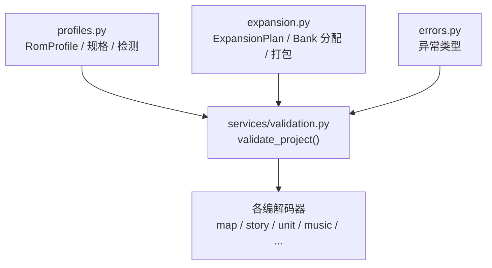
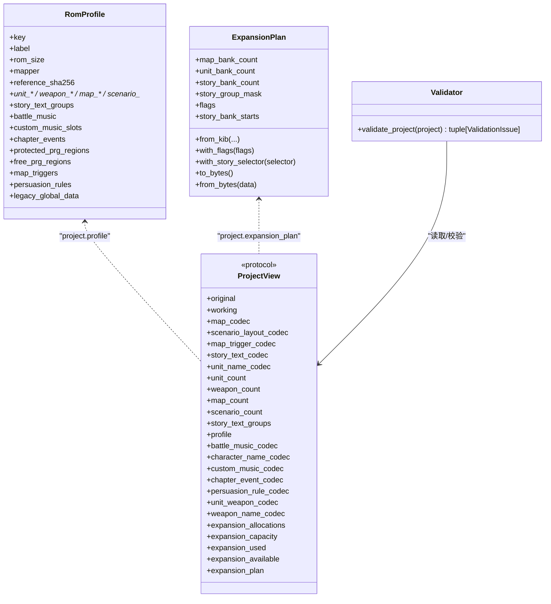
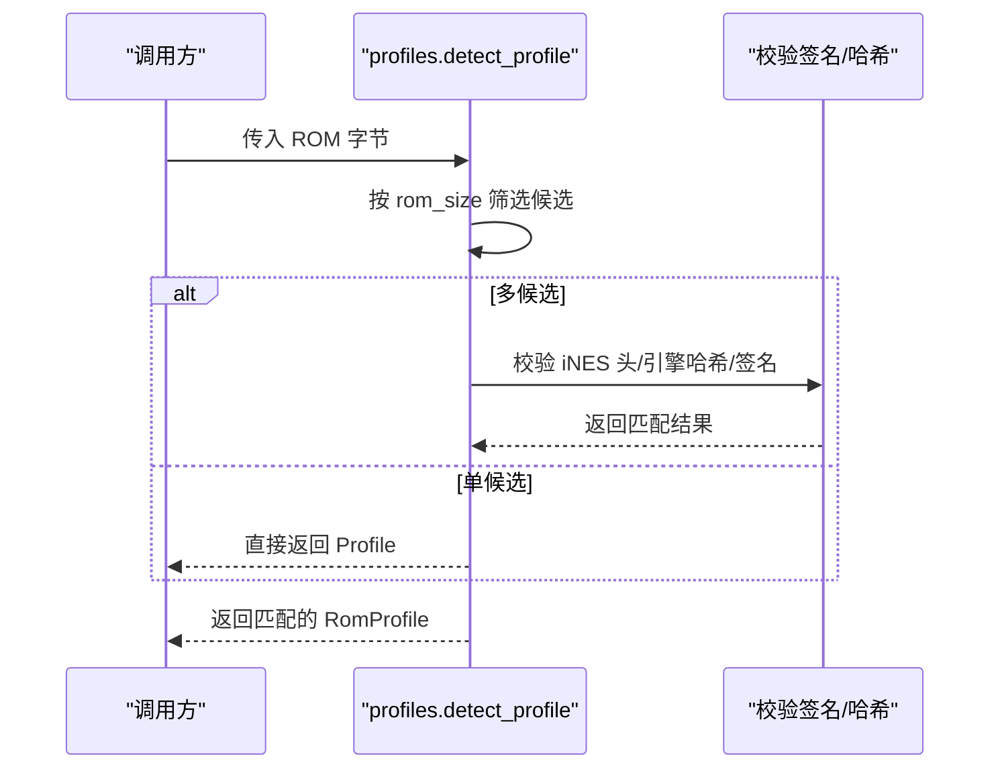
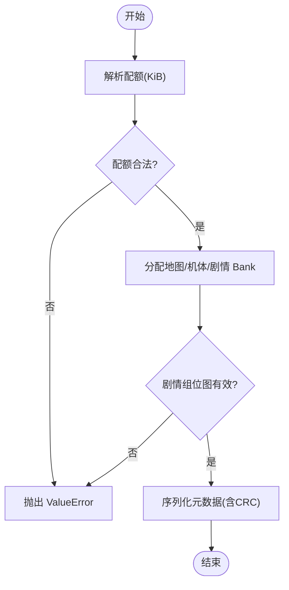
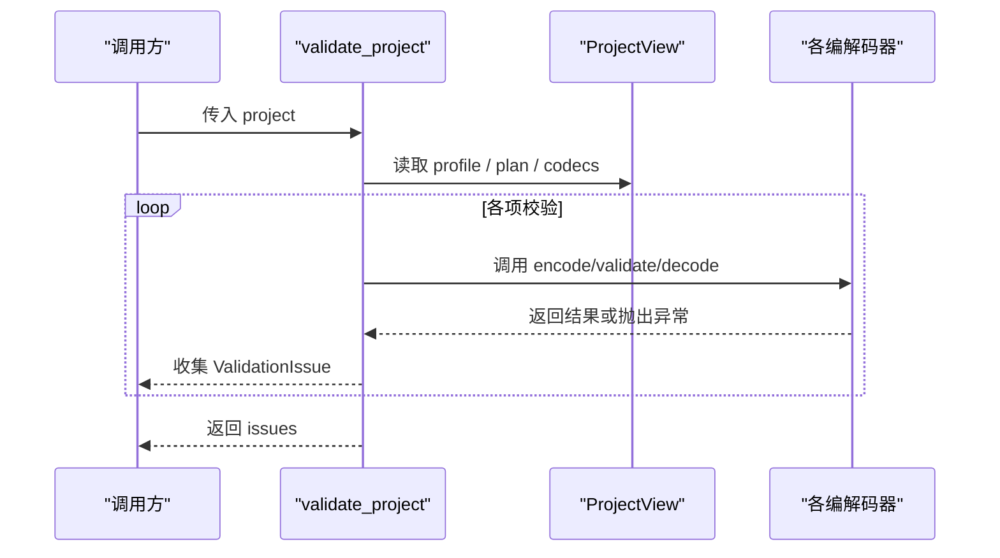
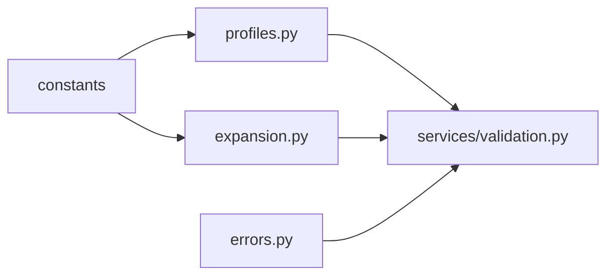

# 扩展接口API

<cite>
**本文引用的文件**
- [profiles.py](file://src/fc_editor/profiles.py)
- [expansion.py](file://src/fc_editor/expansion.py)
- [validation.py](file://src/fc_editor/services/validation.py)
- [errors.py](file://src/fc_editor/errors.py)
</cite>

## 目录
1. [简介](#简介)
2. [项目结构](#项目结构)
3. [核心组件](#核心组件)
4. [架构总览](#架构总览)
5. [详细组件分析](#详细组件分析)
6. [依赖关系分析](#依赖关系分析)
7. [性能考虑](#性能考虑)
8. [故障排查指南](#故障排查指南)
9. [结论](#结论)
10. [附录：扩展开发流程与示例](#附录：扩展开发流程与示例)

## 简介
本文件面向希望为系统添加插件化能力、自定义编解码器、验证规则与钩子函数的开发者。文档围绕以下扩展点展开：
- 配置文件接口（Profile）：以数据类描述 ROM 布局、资源指针表、受保护区域与自由区域，用于识别 ROM 版本并约束编辑边界。
- 验证规则扩展：通过统一的校验框架对地图、剧情、机体、武器、音乐、章节事件、劝降规则等进行一致性检查。
- 错误处理机制：定义结构化错误类型与校验问题报告，便于上层统一呈现与定位。
- 钩子函数与注册机制：在 Profile、ExpansionPlan、编解码器与校验管线中提供可扩展的“插拔点”，支持新增资源类型与行为。
- 第三方工具集成：通过资源选择器、Bank 分配与打包/解包接口对接外部音频、字体、地图等工具链。
- 完整扩展开发流程：从接口实现、配置注册到测试验证的最佳实践与调试技巧。

## 项目结构
本项目将扩展能力集中在 fc_editor 模块内，关键文件职责如下：
- profiles.py：定义 RomProfile 及各类规格描述，提供 ROM 检测与签名校验。
- expansion.py：定义 ExpansionPlan、资源池管理、Bank 分配策略与打包/解包工具。
- services/validation.py：实现 ProjectView 协议与 validate_project 主校验流程，串联各编解码器的验证逻辑。
- errors.py：定义 RomFormatError、ProjectFormatError、ChangeConflictError 三类异常。

**图表来源**
- [profiles.py:276-333](file://src/fc_editor/profiles.py#L276-L333)
- [expansion.py:84-175](file://src/fc_editor/expansion.py#L84-L175)
- [validation.py:92-142](file://src/fc_editor/services/validation.py#L92-L142)

**章节来源**
- [profiles.py:276-333](file://src/fc_editor/profiles.py#L276-L333)
- [expansion.py:84-175](file://src/fc_editor/expansion.py#L84-L175)
- [validation.py:92-142](file://src/fc_editor/services/validation.py#L92-L142)
- [errors.py:1-11](file://src/fc_editor/errors.py#L1-L11)

## 核心组件
- 配置文件接口（Profile）
  - RomProfile：集中描述 ROM 尺寸、Mapper、参考哈希、指针表偏移、存储区范围、受保护/自由 Bank 区间、可选特性（战斗音乐、章节事件、地图触发器、劝降规则、遗留全局数据）。
  - 辅助规格：StoryTextGroupSpec、MapStorageRange、BattleMusicSpec、CustomMusicSlotSpec、ChapterEventSpec、MapTriggerSpec、PersuasionRuleSpec、LegacyGlobalDataSpec、PrgBankRegion。
  - 检测与签名：detect_profile 根据 ROM 大小与头信息匹配 Profile；针对扩容 MMC3 进行固定代码签名校验。
- 扩展容量与资源池（Expansion）
  - ExpansionPlan：确定性地划分 464 KiB 可管理空间，分配地图、机体、剧情 Bank，维护剧情组位图与绑定关系，提供序列化/反序列化。
  - 资源打包：pack_maps、pack_pointer_records、pack_units 将记录压缩进指定 Bank，生成指针表与目录。
  - 资源选择器：resource_descriptor_offset 计算选择器地址，供运行时或编辑器写入资源映射。
- 校验框架（Validation）
  - ProjectView 协议：抽象项目视图，暴露原始/工作 ROM、各编解码器实例、计数与查询方法。
  - validate_project：统一入口，逐项检查 ROM 头、受保护区域、扩展计划、地图/部署/事件、剧情文本、音乐、章节事件、劝降规则、名称指针合法性等，输出 ValidationIssue 列表。
- 错误处理（Errors）
  - RomFormatError：ROM 布局不匹配。
  - ProjectFormatError：项目文件格式错误或目标 ROM 不一致。
  - ChangeConflictError：多个编辑模块发生冲突写入。

**章节来源**
- [profiles.py:276-333](file://src/fc_editor/profiles.py#L276-L333)
- [profiles.py:336-696](file://src/fc_editor/profiles.py#L336-L696)
- [profiles.py:699-759](file://src/fc_editor/profiles.py#L699-L759)
- [expansion.py:84-175](file://src/fc_editor/expansion.py#L84-L175)
- [expansion.py:329-432](file://src/fc_editor/expansion.py#L329-L432)
- [validation.py:92-142](file://src/fc_editor/services/validation.py#L92-L142)
- [validation.py:142-683](file://src/fc_editor/services/validation.py#L142-L683)
- [errors.py:1-11](file://src/fc_editor/errors.py#L1-L11)

## 架构总览
下图展示 Profile、ExpansionPlan、校验框架与编解码器之间的协作关系。Profile 提供 ROM 布局与约束；ExpansionPlan 管理资源池与 Bank 分配；校验框架依据 Profile 与 ExpansionPlan 调用各编解码器执行验证；错误通过 ValidationIssue 上报。

**图表来源**
- [profiles.py:276-333](file://src/fc_editor/profiles.py#L276-L333)
- [expansion.py:84-175](file://src/fc_editor/expansion.py#L84-L175)
- [validation.py:92-142](file://src/fc_editor/services/validation.py#L92-L142)

## 详细组件分析

### 配置文件接口（Profile）
- 设计要点
  - 使用不可变 dataclass 描述 ROM 布局，确保配置一致性与可追溯性。
  - 提供多种内置 Profile（原版、V5.1、MMC5、扩容 MMC3 等），并通过 detect_profile 自动识别。
  - 支持可选特性：战斗音乐、自定义曲槽、章节事件、地图触发器、劝降规则、遗留全局数据。
- 关键流程
  - detect_profile：按 ROM 大小筛选候选 Profile，再根据 iNES 头、引擎哈希、签名校验精确匹配。
  - 受保护区域：protected_prg_regions 标记不可修改区域；free_prg_regions 标记托管扩展空间。
- 扩展点
  - 新增 ROM 变体：定义新的 RomProfile 实例并加入 SUPPORTED_PROFILES。
  - 新增可选特性：在 RomProfile 中添加字段并在校验流程中增加对应检查。

**图表来源**
- [profiles.py:699-759](file://src/fc_editor/profiles.py#L699-L759)

**章节来源**
- [profiles.py:276-333](file://src/fc_editor/profiles.py#L276-L333)
- [profiles.py:699-759](file://src/fc_editor/profiles.py#L699-L759)

### 扩展容量与资源池（Expansion）
- 设计要点
  - ExpansionPlan 将 464 KiB 可管理空间划分为地图、机体、剧情三部分，保证配额合法且不重叠。
  - 剧情组按 16 KiB 配对分配，支持位图选择已搬移的文本组。
  - 提供 pack_* 系列函数将记录打包进 Bank，生成指针表与目录，确保对齐与去重。
- 关键流程
  - from_kib：按 KiB 配额构造 ExpansionPlan，自动分配剧情 Bank 对。
  - to_bytes/from_bytes：序列化/反序列化扩展元数据，含 CRC 校验。
  - resource_descriptor_offset：计算资源选择器地址，供运行时或编辑器写入。
- 扩展点
  - 新增资源类型：在 ExpansionPlan 中增加配额字段与校验逻辑，并在打包函数中支持新格式。
  - 调整 Bank 分配策略：修改 AVAILABLE_EXPANSION_BANKS 或分配顺序。

**图表来源**
- [expansion.py:84-175](file://src/fc_editor/expansion.py#L84-L175)
- [expansion.py:277-318](file://src/fc_editor/expansion.py#L277-L318)

**章节来源**
- [expansion.py:84-175](file://src/fc_editor/expansion.py#L84-L175)
- [expansion.py:329-432](file://src/fc_editor/expansion.py#L329-L432)

### 校验框架（Validation）
- 设计要点
  - ProjectView 协议抽象项目视图，使 validate_project 可独立于具体实现进行验证。
  - validate_project 逐项检查 ROM 头、受保护区域、扩展计划、地图/部署/事件、剧情文本、音乐、章节事件、劝降规则、名称指针合法性等。
  - 输出 ValidationIssue 列表，包含严重级别、模块与消息。
- 关键流程
  - 扩展计划校验：检查 flags、分区登记与容量表一致性。
  - 地图/部署/事件：校验编码后大小、布局合法性、共享池占用。
  - 剧情文本：校验长度、终止符位置。
  - 音乐/章节事件/劝降：调用对应编解码器进行验证。
  - 安全区域：检测受保护区域与预留区域的未授权修改。
- 扩展点
  - 新增编解码器：实现 decode/encode/validate 等方法，并在 validate_project 中接入。
  - 新增校验项：在 validate_project 中添加检查逻辑并输出 ValidationIssue。

**图表来源**
- [validation.py:92-142](file://src/fc_editor/services/validation.py#L92-L142)
- [validation.py:142-683](file://src/fc_editor/services/validation.py#L142-L683)

**章节来源**
- [validation.py:92-142](file://src/fc_editor/services/validation.py#L92-L142)
- [validation.py:142-683](file://src/fc_editor/services/validation.py#L142-L683)

### 错误处理机制
- 异常类型
  - RomFormatError：ROM 布局不匹配。
  - ProjectFormatError：项目文件格式错误或目标 ROM 不一致。
  - ChangeConflictError：多个编辑模块发生冲突写入。
- 使用建议
  - 在编解码器与打包函数中抛出 ValueError 或上述异常，由 validate_project 捕获并转换为 ValidationIssue。
  - 对外暴露清晰的错误消息，便于用户定位问题。

**章节来源**
- [errors.py:1-11](file://src/fc_editor/errors.py#L1-L11)
- [validation.py:142-683](file://src/fc_editor/services/validation.py#L142-L683)

## 依赖关系分析
- Profile 依赖 constants（如 INES_HEADER_SIZE、PRG_BANK_SIZE 等）与常量集合，用于检测与签名校验。
- ExpansionPlan 依赖 constants 与 struct/zlib，用于 Bank 偏移计算与元数据序列化。
- validate_project 依赖 expansion、expansion_map、expansion_unit、profiles 与各编解码器，形成松耦合的校验管线。
- 错误处理贯穿各层，确保异常向上冒泡并被统一处理。

**图表来源**
- [profiles.py:1-17](file://src/fc_editor/profiles.py#L1-L17)
- [expansion.py:1-44](file://src/fc_editor/expansion.py#L1-L44)
- [validation.py:1-41](file://src/fc_editor/services/validation.py#L1-L41)

**章节来源**
- [profiles.py:1-17](file://src/fc_editor/profiles.py#L1-L17)
- [expansion.py:1-44](file://src/fc_editor/expansion.py#L1-L44)
- [validation.py:1-41](file://src/fc_editor/services/validation.py#L1-L41)
- [errors.py:1-11](file://src/fc_editor/errors.py#L1-L11)

## 性能考虑
- Bank 分配与打包
  - 使用连续 Bank 段减少碎片，pack_maps 与 pack_pointer_records 采用紧凑布局与去重策略。
  - 限制单条记录不超过单 Bank 容量，避免跨 Bank 复杂寻址。
- 校验效率
  - validate_project 优先快速失败（如 ROM 大小、iNES 头、受保护区域），再执行耗时校验。
  - 对剧情文本、地图、部署等采用增量校验，仅在必要时深入检查。
- 内存与 I/O
  - 使用 bytearray 与切片操作减少临时对象创建。
  - 序列化元数据时仅写入必要字段，降低体积与校验开销。

[本节为通用指导，无需特定文件引用]

## 故障排查指南
- 常见错误与定位
  - ROM 大小或 iNES 头不匹配：检查 detect_profile 匹配逻辑与 Profile 配置。
  - 受保护区域被修改：查看 protected_prg_regions 与 free_prg_regions，确认未授权写入。
  - 扩展计划不一致：检查 ExpansionPlan.flags、story_group_mask 与分区登记是否一致。
  - 地图/部署/事件溢出：核对 pack_* 函数输出与容量限制。
  - 剧情文本缺少终止符：检查 story_text_codec 的 standalone_terminator_end 逻辑。
  - 音乐命令不受支持：核对 battle_music.tracks 与 custom_music_codec.slots。
- 调试技巧
  - 启用详细日志：在 validate_project 中打印 ValidationIssue 的 module 与 message。
  - 逐步缩小范围：先校验 ROM 头与 Profile，再逐项启用编解码器校验。
  - 对比原始与工作 ROM：使用 _first_difference_excluding 定位差异地址。

**章节来源**
- [validation.py:142-683](file://src/fc_editor/services/validation.py#L142-L683)
- [expansion.py:329-432](file://src/fc_editor/expansion.py#L329-L432)
- [profiles.py:699-759](file://src/fc_editor/profiles.py#L699-L759)

## 结论
本系统通过 Profile、ExpansionPlan 与 validate_project 构建了稳定的扩展接口体系。开发者可在不侵入核心逻辑的前提下，新增 ROM 变体、资源类型、编解码器与校验规则。遵循最佳实践与性能考虑，可确保扩展的可维护性、兼容性与运行稳定性。

[本节为总结，无需特定文件引用]

## 附录：扩展开发流程与示例

### 扩展开发流程
1. 接口实现
   - 新增编解码器：实现 decode/encode/validate 等方法，遵循 ProjectView 协议约定。
   - 新增资源类型：在 ExpansionPlan 中增加配额字段与校验逻辑，在 pack_* 函数中支持新格式。
2. 配置注册
   - 新增 Profile：定义 RomProfile 实例并加入 SUPPORTED_PROFILES。
   - 注册扩展计划：在 ProjectView 中设置 expansion_plan 与 expansion_allocations。
3. 测试验证
   - 单元测试：覆盖编解码器与打包函数，确保边界条件与异常路径。
   - 集成测试：运行 validate_project，检查 ValidationIssue 是否符合预期。
   - 回归测试：对比原始与工作 ROM，确保受保护区域未被修改。

### 最佳实践
- 保持不可变性：Profile 与 ExpansionPlan 使用不可变 dataclass，避免意外修改。
- 明确边界：严格校验 Bank 对齐、记录长度与容量限制。
- 渐进式扩展：优先实现最小可用功能，再逐步增强校验与优化。
- 文档与注释：为新增接口提供清晰的使用说明与示例。

### 兼容性保证
- 向后兼容：新增字段默认值应合理，避免破坏现有配置。
- 向前兼容：版本号与保留字段用于未来扩展，避免破坏旧数据。
- 签名校验：对关键区域进行哈希校验，防止未授权修改。

### 调试技巧
- 使用 ValidationIssue 的 module 与 message 定位问题。
- 逐步启用校验项，缩小问题范围。
- 对比原始与工作 ROM，使用差异工具定位修改地址。

[本节为通用指导，无需特定文件引用]