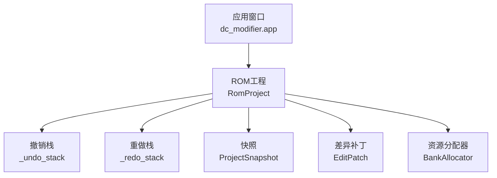
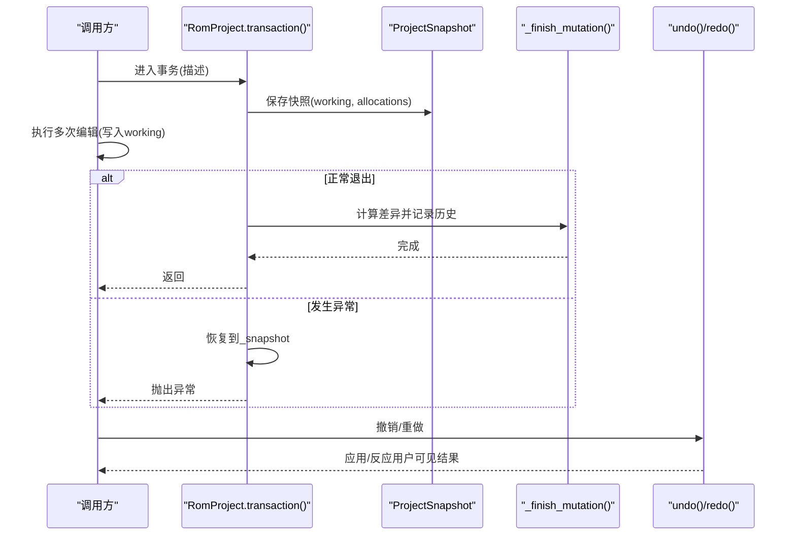
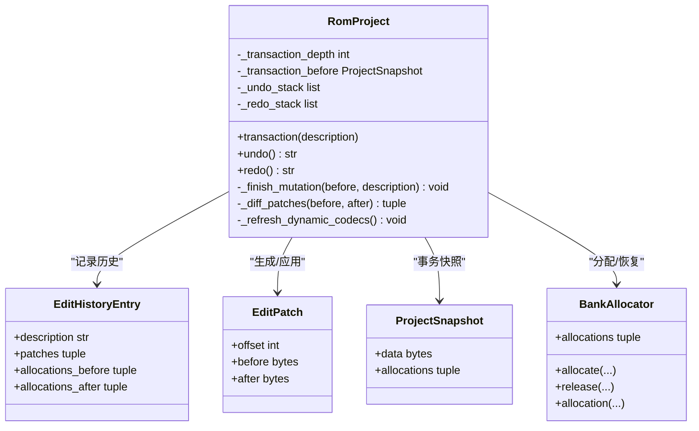

# 事务处理系统

<cite>
**本文引用的文件**
- [fc_rom_editor_core.py](file://src/fc_rom_editor_core.py)
- [app.py](file://src/dc_modifier/app.py)
- [test_font_edit_transactions.py](file://tests/test_font_edit_transactions.py)
</cite>

## 目录
1. [简介](#简介)
2. [项目结构](#项目结构)
3. [核心组件](#核心组件)
4. [架构总览](#架构总览)
5. [详细组件分析](#详细组件分析)
6. [依赖关系分析](#依赖关系分析)
7. [性能考虑](#性能考虑)
8. [故障排查指南](#故障排查指南)
9. [结论](#结论)
10. [附录：使用示例](#附录使用示例)

## 简介
本文件系统性地记录 ROM 编辑器的“事务处理”能力，重点围绕以下目标：
- 使用 transaction() 上下文管理器将多个编辑操作包装为原子事务。
- 详细说明撤销/重做机制：undo()、redo() 的实现原理与数据流。
- 解释 EditHistoryEntry、EditPatch 的数据结构与生成/应用过程。
- 说明事务状态管理：_transaction_depth、_transaction_before、_finish_mutation 等内部方法。
- 覆盖事务嵌套支持、异常回滚机制与性能优化要点。
- 提供实际使用示例，展示如何正确使用事务进行批量编辑。

## 项目结构
事务处理的核心逻辑集中在 ROM 工程类中，UI 层通过调用 undo()/redo() 暴露给用户；测试用例验证了字库批量替换的事务行为。

图表来源
- [fc_rom_editor_core.py:618-785](file://src/fc_rom_editor_core.py#L618-L785)
- [app.py:991-1026](file://src/dc_modifier/app.py#L991-L1026)

章节来源
- [fc_rom_editor_core.py:618-785](file://src/fc_rom_editor_core.py#L618-L785)
- [app.py:991-1026](file://src/dc_modifier/app.py#L991-L1026)

## 核心组件
- RomProject：ROM 工程对象，持有 working（当前可写镜像）、original（原始镜像）以及撤销/重做栈。
- EditPatch：描述某段偏移处“修改前/后”的字节片段，用于撤销/重做时精确还原或重放。
- EditHistoryEntry：一次完整操作的元数据，包含描述、补丁序列、以及资源分配的前后状态。
- ProjectSnapshot：事务边界上的工作镜像与资源分配的快照，用于异常回滚和最终提交。
- BankAllocator：ROM 扩展资源的分配/释放器，参与撤销/重做时的状态恢复。

章节来源
- [fc_rom_editor_core.py:112-131](file://src/fc_rom_editor_core.py#L112-L131)
- [fc_rom_editor_core.py:618-785](file://src/fc_rom_editor_core.py#L618-L785)

## 架构总览
事务处理采用“外层事务 + 内层合并”的设计：
- 外层事务在进入时保存 ProjectSnapshot（working 与 allocations），在退出时计算差异并生成 EditHistoryEntry。
- 内层事务仅增加深度计数，不重复保存快照，从而避免冗余开销。
- 任何异常抛出时，外层事务会恢复到 _transaction_before 的状态，确保原子性。
- 撤销/重做通过 Apply/Unapply EditPatch 与恢复 BankAllocator 实现。

图表来源
- [fc_rom_editor_core.py:692-785](file://src/fc_rom_editor_core.py#L692-L785)

## 详细组件分析

### 事务上下文管理器 transaction(description)
- 作用：将一段代码块包装为原子事务。仅在“最外层”事务保存快照，内层事务仅递增深度。
- 关键点：
  - outermost = _transaction_depth == 0 时创建 ProjectSnapshot。
  - 异常路径：若在最外层且捕获到异常，恢复到 _transaction_before，并重建 BankAllocator 与动态编解码器。
  - finally 中递减深度；当回到 0 时，调用 _finish_mutation 记录历史。
- 复杂度：
  - 时间：O(N) 差异比较（N 为 ROM 大小），但仅在事务结束时执行一次。
  - 空间：O(P) 补丁数量 P，通常远小于 N。

章节来源
- [fc_rom_editor_core.py:714-743](file://src/fc_rom_editor_core.py#L714-L743)

### 撤销/重做：undo() 与 redo()
- undo()：
  - 弹出 _undo_stack 中的 EditHistoryEntry。
  - 按补丁顺序将 before 字节写回 working。
  - 恢复 allocations_before，重建 BankAllocator，刷新动态编解码器。
  - 将条目压入 _redo_stack。
- redo()：
  - 弹出 _redo_stack 中的 EditHistoryEntry。
  - 按补丁顺序将 after 字节写回 working。
  - 恢复 allocations_after，重建 BankAllocator，刷新动态编解码器。
  - 将条目压入 _undo_stack。
- 复杂度：
  - 时间：O(P) 应用补丁，P 为补丁数。
  - 空间：O(1) 额外空间（复用现有缓冲区）。

章节来源
- [fc_rom_editor_core.py:761-785](file://src/fc_rom_editor_core.py#L761-L785)

### 数据结构：EditPatch 与 EditHistoryEntry
- EditPatch：
  - offset：起始偏移。
  - before：修改前的字节片段。
  - after：修改后的字节片段。
- EditHistoryEntry：
  - description：人类可读的操作描述。
  - patches：EditPatch 元组。
  - allocations_before / allocations_after：资源分配前后状态，用于撤销/重做时恢复。

章节来源
- [fc_rom_editor_core.py:112-124](file://src/fc_rom_editor_core.py#L112-L124)

### 差异计算与补丁生成：_diff_patches(before, after)
- 扫描 before 与 after，定位连续变化区间，生成 EditPatch。
- 若长度不一致则报错，保证一致性。
- 优化：逐字节比较，但只在事务结束或撤销/重做时触发。

章节来源
- [fc_rom_editor_core.py:676-690](file://src/fc_rom_editor_core.py#L676-L690)

### 事务状态管理：_transaction_depth、_transaction_before、_finish_mutation
- _transaction_depth：事务嵌套深度计数器。
- _transaction_before：最外层事务开始时的 ProjectSnapshot。
- _mutation_snapshot()：非事务期间（depth==0）才返回快照；事务期间返回 None，避免重复快照。
- _finish_mutation(before, description)：
  - 计算 working 与 before.data 的差异，生成补丁。
  - 若无差异且 allocations 未变，直接返回。
  - 否则构造 EditHistoryEntry 并追加到 _undo_stack，同时清空 _redo_stack。

章节来源
- [fc_rom_editor_core.py:692-712](file://src/fc_rom_editor_core.py#L692-L712)
- [fc_rom_editor_core.py:714-743](file://src/fc_rom_editor_core.py#L714-L743)

### 动态编解码器刷新：_refresh_dynamic_codecs()
- 在撤销/重做或事务回滚后，根据当前 working 重新绑定各编解码器（单位、地图、剧情文本等）。
- 保证后续读写基于最新状态。

章节来源
- [fc_rom_editor_core.py:836-934](file://src/fc_rom_editor_core.py#L836-L934)

### UI 集成：应用层的 undo()/redo()
- 主窗口封装了 undo()/redo() 调用，并在成功后刷新页面与状态栏。
- 对地图草稿有保护：存在未应用草稿时阻止 redo。

章节来源
- [app.py:991-1026](file://src/dc_modifier/app.py#L991-L1026)

### 事务嵌套与异常回滚
- 嵌套：transaction() 支持多层嵌套，仅最外层保存快照与记录历史。
- 异常回滚：最外层事务在异常时恢复到 _transaction_before，并重建 BankAllocator 与动态编解码器，确保工作区一致。

章节来源
- [fc_rom_editor_core.py:714-743](file://src/fc_rom_editor_core.py#L714-L743)

### 批量编辑 API 与事务使用
- set_font_glyphs(glyphs)：批量替换字模，内部使用 transaction() 包裹，确保原子性与单一撤销项。
- 其他如导入/删除扩展资源、CHR 图块写入等，均通过 _mutation_snapshot() + _finish_mutation() 形成独立撤销项。

章节来源
- [fc_rom_editor_core.py:1515-1530](file://src/fc_rom_editor_core.py#L1515-L1530)
- [fc_rom_editor_core.py:1440-1484](file://src/fc_rom_editor_core.py#L1440-L1484)
- [fc_rom_editor_core.py:1531-1564](file://src/fc_rom_editor_core.py#L1531-L1564)

## 依赖关系分析
- RomProject 依赖：
  - BankAllocator：管理扩展资源分配，撤销/重做时需恢复。
  - 各类 Codec：在状态变更后需刷新以绑定新的 working。
  - 单元测试：验证事务行为与 UI 交互。

图表来源
- [fc_rom_editor_core.py:112-131](file://src/fc_rom_editor_core.py#L112-L131)
- [fc_rom_editor_core.py:618-785](file://src/fc_rom_editor_core.py#L618-L785)

章节来源
- [fc_rom_editor_core.py:112-131](file://src/fc_rom_editor_core.py#L112-L131)
- [fc_rom_editor_core.py:618-785](file://src/fc_rom_editor_core.py#L618-L785)

## 性能考虑
- 差异计算仅在事务结束或撤销/重做时触发，避免频繁扫描。
- 使用 4KiB 块级快速比较跳过相同区域，减少 Python 层循环开销。
- 补丁粒度最小化：仅记录变化区间，降低撤销/重做成本。
- 资源分配状态变更也计入历史，避免部分撤销导致的不一致。

章节来源
- [fc_rom_editor_core.py:2614-2643](file://src/fc_rom_editor_core.py#L2614-L2643)
- [fc_rom_editor_core.py:676-690](file://src/fc_rom_editor_core.py#L676-L690)

## 故障排查指南
- 无法撤销：检查 _undo_stack 是否为空；确认是否在执行了新的编辑操作清除了 _redo_stack。
- 无法重做：检查 _redo_stack 是否为空；UI 层在有地图草稿时会阻止 redo。
- 事务异常：确认是否在 transaction() 块内抛出异常；最外层会自动回滚到 _transaction_before。
- 资源分配不一致：撤销/重做会恢复 allocations_before/after，确保 BankAllocator 与编解码器同步。

章节来源
- [app.py:991-1026](file://src/dc_modifier/app.py#L991-L1026)
- [fc_rom_editor_core.py:714-785](file://src/fc_rom_editor_core.py#L714-L785)

## 结论
该事务处理系统通过“外层快照 + 内层合并”的策略，在保证原子性的同时降低了内存与 CPU 开销。EditPatch 与 EditHistoryEntry 提供了细粒度的撤销/重做能力，结合 BankAllocator 的状态恢复，确保了复杂编辑场景的一致性。UI 层对撤销/重做的封装提升了用户体验，测试用例覆盖了关键路径。

## 附录：使用示例
以下为典型用法模式（以伪代码形式描述，具体实现请参考对应源码路径）：

- 批量替换字模（原子事务）
  - 入口：set_font_glyphs(glyphs)
  - 行为：内部使用 transaction("替换 N 个 ROM 字模") 包裹多段写入，确保一次性成功或全部回滚。
  - 参考路径：[fc_rom_editor_core.py:1515-1530](file://src/fc_rom_editor_core.py#L1515-L1530)

- 手动事务包装多个编辑
  - 使用 with project.transaction("描述"): 包裹多个写入操作。
  - 任意异常将自动回滚到事务开始前的状态。
  - 参考路径：[fc_rom_editor_core.py:714-743](file://src/fc_rom_editor_core.py#L714-L743)

- 撤销/重做
  - 调用 project.undo() 或 project.redo()，UI 层会在成功后刷新界面。
  - 参考路径：[app.py:991-1026](file://src/dc_modifier/app.py#L991-L1026)

- 测试验证
  - 字库导入/导出与撤销行为验证，确保事务边界正确。
  - 参考路径：[test_font_edit_transactions.py:179-197](file://tests/test_font_edit_transactions.py#L179-L197)