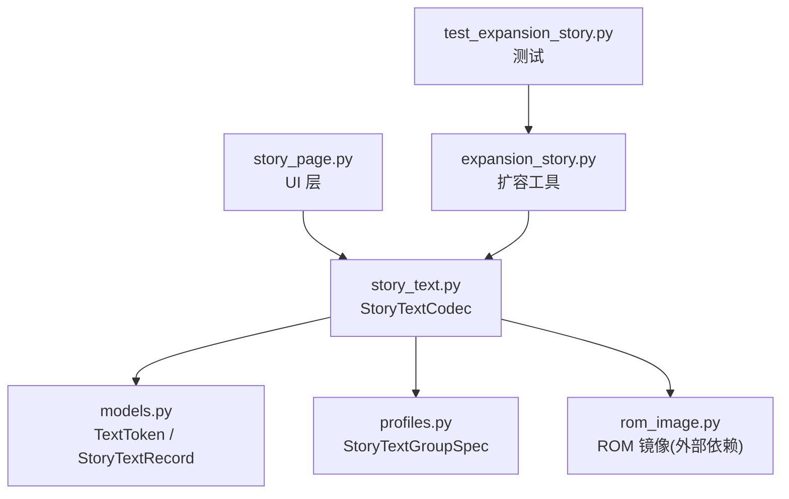
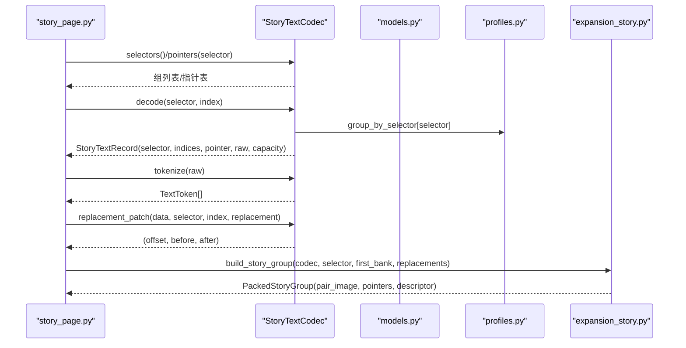
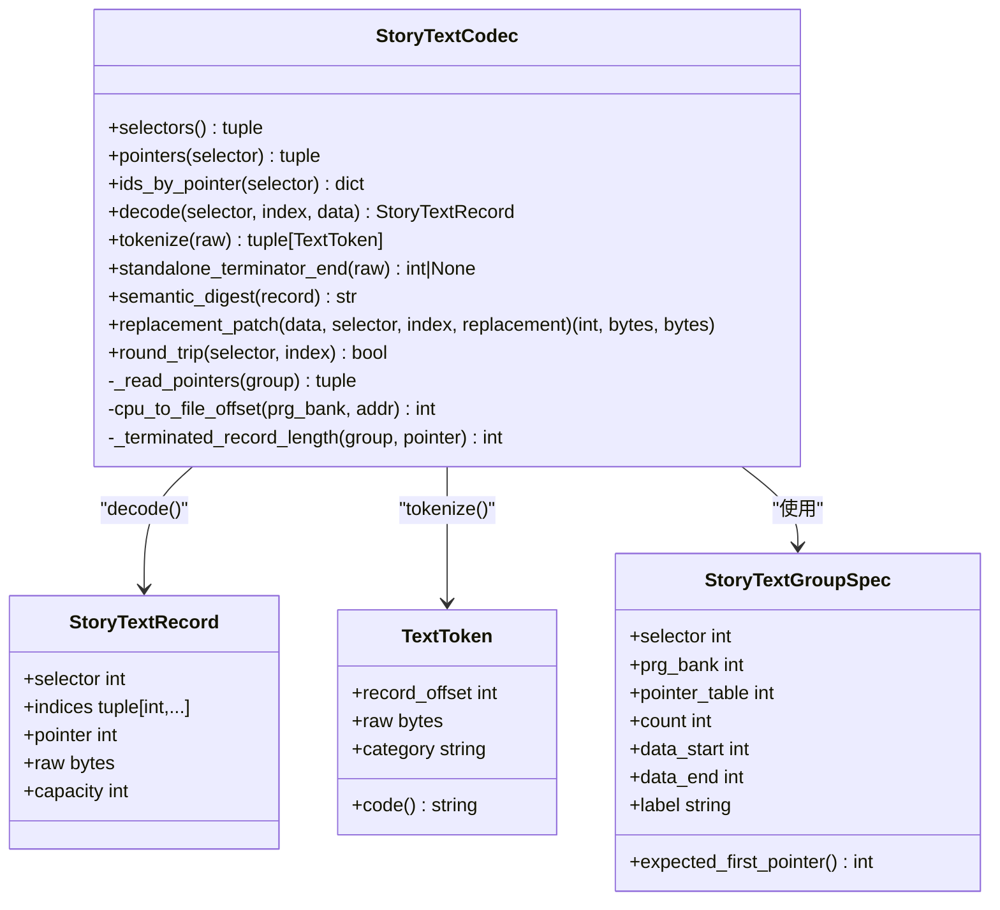
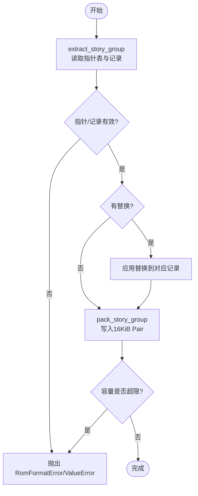
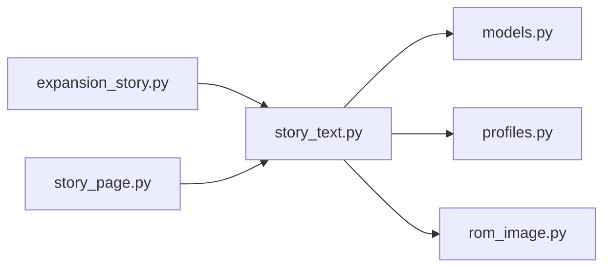

# 剧情文本编解码器 (StoryTextCodec)

<cite>
**本文引用的文件**
- [src/fc_editor/codecs/story_text.py](file://src/fc_editor/codecs/story_text.py)
- [src/fc_editor/models.py](file://src/fc_editor/models.py)
- [src/fc_editor/profiles.py](file://src/fc_editor/profiles.py)
- [src/fc_editor/expansion_story.py](file://src/fc_editor/expansion_story.py)
- [src/dc_modifier/story_page.py](file://src/dc_modifier/story_page.py)
- [tests/test_expansion_story.py](file://tests/test_expansion_story.py)
</cite>

## 目录
1. [简介](#简介)
2. [项目结构](#项目结构)
3. [核心组件](#核心组件)
4. [架构总览](#架构总览)
5. [详细组件分析](#详细组件分析)
6. [依赖关系分析](#依赖关系分析)
7. [性能与内存优化](#性能与内存优化)
8. [故障排查指南](#故障排查指南)
9. [结论](#结论)
10. [附录：API 速查与示例路径](#附录api-速查与示例路径)

## 简介
本文件为“剧情文本编解码器”的权威 API 文档，聚焦 StoryTextCodec 类及其在 FC 游戏 ROM 中的剧情文本读取、编辑、分支管理、编码格式与多语言支持。内容涵盖：
- 数据结构：对话记录、角色/选项控制码、显示格式 Token、容量与指针表等。
- 编码格式：字形码、控制码、结束符 FF、双字节中文字形前导集。
- 操作能力：按选择器（selector）与索引（index）读取/替换、Token 化、语义摘要、回环校验、扩容打包。
- 工程实践：添加新剧情、修改对话、设置分支；长度限制与内存优化策略。

## 项目结构
围绕剧情文本的核心代码分布在以下模块：
- 编解码器：story_text.py（StoryTextCodec）
- 数据模型：models.py（TextToken、StoryTextRecord）
- 组配置：profiles.py（StoryTextGroupSpec 及组元信息）
- 扩容工具：expansion_story.py（提取/打包/构建独立 PRG Pair）
- UI 集成：dc_modifier/story_page.py（编辑器页面，调用 codec 进行读写）
- 测试用例：tests/test_expansion_story.py（覆盖迁移、容量、签名等）

图表来源
- [src/dc_modifier/story_page.py:187-200](file://src/dc_modifier/story_page.py#L187-L200)
- [src/fc_editor/codecs/story_text.py:17-179](file://src/fc_editor/codecs/story_text.py#L17-L179)
- [src/fc_editor/models.py:402-426](file://src/fc_editor/models.py#L402-L426)
- [src/fc_editor/profiles.py:57-72](file://src/fc_editor/profiles.py#L57-L72)
- [src/fc_editor/expansion_story.py:175-297](file://src/fc_editor/expansion_story.py#L175-L297)
- [tests/test_expansion_story.py:23-132](file://tests/test_expansion_story.py#L23-L132)

章节来源
- [src/dc_modifier/story_page.py:187-200](file://src/dc_modifier/story_page.py#L187-L200)
- [src/fc_editor/codecs/story_text.py:17-179](file://src/fc_editor/codecs/story_text.py#L17-L179)
- [src/fc_editor/models.py:402-426](file://src/fc_editor/models.py#L402-L426)
- [src/fc_editor/profiles.py:57-72](file://src/fc_editor/profiles.py#L57-L72)
- [src/fc_editor/expansion_story.py:175-297](file://src/fc_editor/expansion_story.py#L175-L297)
- [tests/test_expansion_story.py:23-132](file://tests/test_expansion_story.py#L23-L132)

## 核心组件
- StoryTextCodec：无损视图与精确大小写入的剧情文本编解码器。负责：
  - 解析指针表、计算每条记录的容量
  - 解码为 StoryTextRecord
  - Token 化（字形/控制/结束符）
  - 生成语义摘要（SHA-256）
  - 精确替换（replacement_patch）并返回偏移与前后字节对比
  - 回环校验（round_trip）
- TextToken：单条 Token 的结构，包含记录内偏移、原始字节、类别（如“中文字形码”“控制码”“文本结束”等）。
- StoryTextRecord：一条可被多个索引共享的记录，包含 selector、indices、pointer、raw、capacity。
- StoryTextGroupSpec：描述一个剧情文本组的元信息（selector、PRG Bank、指针表位置、count、数据区范围等）。

章节来源
- [src/fc_editor/codecs/story_text.py:17-179](file://src/fc_editor/codecs/story_text.py#L17-L179)
- [src/fc_editor/models.py:402-426](file://src/fc_editor/models.py#L402-L426)
- [src/fc_editor/profiles.py:57-72](file://src/fc_editor/profiles.py#L57-L72)

## 架构总览
StoryTextCodec 以 ROM 镜像为输入，基于 StoryTextGroupSpec 定位每个组的指针表与数据区，维护：
- 指针映射：selector -> pointers[]
- 反向映射：selector -> pointer -> indices[]
- 容量映射：selector -> pointer -> capacity
并提供 decode/tokenize/replacement_patch/semantic_digest/round_trip 等接口。扩容流程通过 expansion_story.py 将一组记录打包进独立的 16 KiB PRG pair，并更新描述符。

图表来源
- [src/dc_modifier/story_page.py:232-235](file://src/dc_modifier/story_page.py#L232-L235)
- [src/dc_modifier/story_page.py:454-454](file://src/dc_modifier/story_page.py#L454-L454)
- [src/dc_modifier/story_page.py:659-659](file://src/dc_modifier/story_page.py#L659-L659)
- [src/fc_editor/codecs/story_text.py:156-179](file://src/fc_editor/codecs/story_text.py#L156-L179)
- [src/fc_editor/codecs/story_text.py:181-207](file://src/fc_editor/codecs/story_text.py#L181-L207)
- [src/fc_editor/codecs/story_text.py:228-245](file://src/fc_editor/codecs/story_text.py#L228-L245)
- [src/fc_editor/expansion_story.py:272-297](file://src/fc_editor/expansion_story.py#L272-L297)

## 详细组件分析

### StoryTextCodec 类
职责与关键方法：
- __init__(rom, data=None, group_bank_overrides=None)
  - 初始化 ROM 镜像与可选数据源
  - 根据 profile 构建组列表，支持 bank 重定向
  - 读取各组的指针表，建立 ids_by_pointer 与 capacities
- _read_pointers(group)
  - 从指定 PRG Bank 的指针表读取 count 个 16 位小端指针
  - 校验起始指针与指针范围
- cpu_to_file_offset(prg_bank, cpu_address)
  - 将 CPU 地址映射到 ROM 文件偏移（要求偶数 Bank，窗口 $8000-$BFFF）
- selectors() / pointers(selector) / ids_by_pointer(selector)
  - 暴露组选择器、指针表、指针到索引的反向映射
- decode(selector, index, data=None) -> StoryTextRecord
  - 按 selector/index 解码出记录，含 capacity（可用空间）
- tokenize(raw) -> tuple[TextToken, ...]
  - 将原始字节流切分为 Token，类别包括：
    - 中文字形码（双字节，前导字节集合见 GLYPH_LEADS）
    - 尾随字形导字节（不完整的双字节）
    - 文本结束（0xFF 独立字节）
    - 控制码（>=0xF0）
    - 扩展控制字节（>=0xEE）
    - 单字节字形/参数
- standalone_terminator_end(raw) -> int|None
  - 找到第一个独立的 0xFF 结束符的位置，避免误判双字节字形中的 FF
- semantic_digest(record) -> str
  - 对 record.raw 做 SHA-256 摘要（大写十六进制）
- replacement_patch(data, selector, index, replacement) -> (offset, before, after)
  - 校验 capacity 非空且 replacement 长度严格等于 capacity
  - 返回文件偏移、原始字节、替换字节
- round_trip(selector, index) -> bool
  - 验证 decode -> replacement_patch -> 比对是否一致

图表来源
- [src/fc_editor/codecs/story_text.py:17-259](file://src/fc_editor/codecs/story_text.py#L17-L259)
- [src/fc_editor/models.py:402-426](file://src/fc_editor/models.py#L402-L426)
- [src/fc_editor/profiles.py:57-72](file://src/fc_editor/profiles.py#L57-L72)

章节来源
- [src/fc_editor/codecs/story_text.py:17-259](file://src/fc_editor/codecs/story_text.py#L17-L259)
- [src/fc_editor/models.py:402-426](file://src/fc_editor/models.py#L402-L426)
- [src/fc_editor/profiles.py:57-72](file://src/fc_editor/profiles.py#L57-L72)

### 文本 Token 化与字符集
- 字形前导集 GLYPH_LEADS：仅特定范围的前导字节构成双字节字形，避免误将标点或控制码后的字节当作字形头。
- 控制码与扩展控制字节：>=0xF0 与 >=0xEE 的字节分别归类为控制码与扩展控制字节，保持原样不破坏。
- 结束符：独立的 0xFF 表示记录结束；standalone_terminator_end 确保不会把双字节字形中的 FF 误认为结束符。
- 多语言与特殊符号：由于未完全映射 Unicode，未知 Token 保留原字节，保证无损编辑与回环一致性。

章节来源
- [src/fc_editor/codecs/story_text.py:25-31](file://src/fc_editor/codecs/story_text.py#L25-L31)
- [src/fc_editor/codecs/story_text.py:181-207](file://src/fc_editor/codecs/story_text.py#L181-L207)
- [src/fc_editor/codecs/story_text.py:209-222](file://src/fc_editor/codecs/story_text.py#L209-L222)

### 扩容与分支管理（Expansion Story）
- extract_story_group(codec, selector, data=None)
  - 读取完整组记录，保留最高指针的真实记录（避免被当作哨兵丢弃）
  - 校验指针数量、越界、终止符完整性
- pack_story_group(records, first_bank)
  - 将一组记录打包进独立的 16 KiB PRG pair，写入指针表与数据区
  - 校验容量上限（STORY_DATA_CAPACITY），防止溢出
- build_story_group(codec, selector, first_bank, *, data=None, replacements=None)
  - 提取、可选替换、打包一条龙，支持同一共享记录的多索引替换合并
- 分支管理：通过 ids_by_pointer 与 alias_signature 维持“多索引共享同一段记录”的关系，编辑时保持等价但独立的指针分配策略。

图表来源
- [src/fc_editor/expansion_story.py:175-229](file://src/fc_editor/expansion_story.py#L175-L229)
- [src/fc_editor/expansion_story.py:232-269](file://src/fc_editor/expansion_story.py#L232-L269)
- [src/fc_editor/expansion_story.py:272-297](file://src/fc_editor/expansion_story.py#L272-L297)

章节来源
- [src/fc_editor/expansion_story.py:175-297](file://src/fc_editor/expansion_story.py#L175-L297)
- [tests/test_expansion_story.py:29-132](file://tests/test_expansion_story.py#L29-L132)

### UI 集成与编辑工作流
- story_page.py 提供剧情文本编辑界面，支持：
  - 选择器切换、搜索过滤、上一条/下一条导航
  - 文字编辑与原始 Token 编辑双面板
  - 刷新 Token 解析、文字编码到 Token、应用当前文本、还原此文本
- 内部调用 project.story_text_codec 的 pointers、group_by_selector、tokenize、ids_by_pointer 等方法，实现双向编辑与一致性保障。

章节来源
- [src/dc_modifier/story_page.py:35-170](file://src/dc_modifier/story_page.py#L35-L170)
- [src/dc_modifier/story_page.py:232-235](file://src/dc_modifier/story_page.py#L232-L235)
- [src/dc_modifier/story_page.py:454-454](file://src/dc_modifier/story_page.py#L454-L454)
- [src/dc_modifier/story_page.py:659-659](file://src/dc_modifier/story_page.py#L659-L659)
- [src/dc_modifier/story_page.py:723-727](file://src/dc_modifier/story_page.py#L723-L727)
- [src/dc_modifier/story_page.py:753-753](file://src/dc_modifier/story_page.py#L753-L753)

## 依赖关系分析
- StoryTextCodec 依赖：
  - models.py：TextToken、StoryTextRecord
  - profiles.py：StoryTextGroupSpec 及组元信息
  - rom_image.py：ROM 镜像访问（外部依赖）
- expansion_story.py 依赖 StoryTextCodec 的 GLYPH_LEADS 与指针解析能力，用于扩容打包。
- story_page.py 依赖 StoryTextCodec 暴露的 selectors、pointers、tokenize、ids_by_pointer 等接口。

图表来源
- [src/fc_editor/codecs/story_text.py:1-11](file://src/fc_editor/codecs/story_text.py#L1-L11)
- [src/fc_editor/expansion_story.py:1-10](file://src/fc_editor/expansion_story.py#L1-L10)
- [src/dc_modifier/story_page.py:1-33](file://src/dc_modifier/story_page.py#L1-L33)

章节来源
- [src/fc_editor/codecs/story_text.py:1-11](file://src/fc_editor/codecs/story_text.py#L1-L11)
- [src/fc_editor/expansion_story.py:1-10](file://src/fc_editor/expansion_story.py#L1-L10)
- [src/dc_modifier/story_page.py:1-33](file://src/dc_modifier/story_page.py#L1-L33)

## 性能与内存优化
- 容量限制：
  - 每条记录的 replacement 必须严格等于 capacity，否则 replacement_patch 会抛出异常，避免越界与错位。
  - 扩容打包时，单个 16 KiB pair 的文本容量有限（STORY_DATA_CAPACITY），超出会拒绝打包。
- 内存友好：
  - decode 仅在必要时切片读取 capacity 长度的数据；空记录返回空 raw。
  - tokenize 采用线性扫描，按 Token 类别增量推进游标，避免重复解析。
- 回环校验：
  - round_trip 可快速验证某条记录的可逆性，便于批量检查。
- 建议：
  - 批量编辑前先使用 semantic_digest 保存基线，变更后再比对，减少不必要的全量写入。
  - 对大段文本编辑，优先在 story_page 的文字编辑模式进行，再统一编码为 Token，降低手工错误。

章节来源
- [src/fc_editor/codecs/story_text.py:156-179](file://src/fc_editor/codecs/story_text.py#L156-L179)
- [src/fc_editor/codecs/story_text.py:181-207](file://src/fc_editor/codecs/story_text.py#L181-L207)
- [src/fc_editor/codecs/story_text.py:228-259](file://src/fc_editor/codecs/story_text.py#L228-L259)
- [src/fc_editor/expansion_story.py:232-269](file://src/fc_editor/expansion_story.py#L232-L269)

## 故障排查指南
常见错误与处理：
- 指针表不完整/起始指针不正确/含越界指针：
  - 由 _read_pointers 抛出 RomFormatError，需检查 ROM 或组配置。
- 末记录字形码不完整或缺少 FF 结束码：
  - 由 _terminated_record_length 抛出 RomFormatError，需修复记录尾部。
- 索引越界：
  - decode 会抛出 IndexError，确认 selector 与 index 范围。
- 替换长度不匹配：
  - replacement_patch 会抛出 ValueError，确保 replacement 长度等于 capacity。
- 扩容容量溢出：
  - pack_story_group 会抛出 ValueError，需拆分或调整布局。

章节来源
- [src/fc_editor/codecs/story_text.py:97-138](file://src/fc_editor/codecs/story_text.py#L97-L138)
- [src/fc_editor/codecs/story_text.py:156-179](file://src/fc_editor/codecs/story_text.py#L156-L179)
- [src/fc_editor/codecs/story_text.py:228-245](file://src/fc_editor/codecs/story_text.py#L228-L245)
- [src/fc_editor/expansion_story.py:232-269](file://src/fc_editor/expansion_story.py#L232-L269)

## 结论
StoryTextCodec 提供了对剧情文本的无损、精确大小的读写能力，结合 Token 化与语义摘要，确保编辑过程安全可控。配合 expansion_story.py 的扩容打包机制，可在受限的 ROM 空间中灵活管理大量剧情文本与分支。建议在工程中遵循容量限制、使用回环校验与语义摘要进行质量保障，并通过 UI 层进行可视化编辑与调试。

## 附录：API 速查与示例路径
- 读取剧情文本
  - 获取组选择器与指针表：selectors(), pointers(selector)
  - 解码记录：decode(selector, index)
  - 参考路径：[story_page.py:232-235](file://src/dc_modifier/story_page.py#L232-L235), [story_text.py:156-179](file://src/fc_editor/codecs/story_text.py#L156-L179)
- 编辑对话内容
  - Token 化：tokenize(raw)
  - 查找独立结束符：standalone_terminator_end(raw)
  - 生成替换补丁：replacement_patch(data, selector, index, replacement)
  - 参考路径：[story_text.py:181-207](file://src/fc_editor/codecs/story_text.py#L181-L207), [story_text.py:209-222](file://src/fc_editor/codecs/story_text.py#L209-L222), [story_text.py:228-245](file://src/fc_editor/codecs/story_text.py#L228-L245)
- 设置剧情分支
  - 通过 ids_by_pointer(selector) 获取共享记录的多索引关系
  - 使用 expansion_story.build_story_group 进行替换与打包
  - 参考路径：[story_page.py:723-727](file://src/dc_modifier/story_page.py#L723-L727), [expansion_story.py:272-297](file://src/fc_editor/expansion_story.py#L272-L297)
- 文本长度限制与内存优化
  - replacement 长度必须等于 capacity；扩容时注意 STORY_DATA_CAPACITY
  - 使用 round_trip 进行回环校验
  - 参考路径：[story_text.py:228-259](file://src/fc_editor/codecs/story_text.py#L228-L259), [expansion_story.py:232-269](file://src/fc_editor/expansion_story.py#L232-L269)
- 数据结构字段定义
  - TextToken：record_offset, raw, category, code()
  - StoryTextRecord：selector, indices, pointer, raw, capacity
  - StoryTextGroupSpec：selector, prg_bank, pointer_table, count, data_start, data_end, label, expected_first_pointer()
  - 参考路径：[models.py:402-426](file://src/fc_editor/models.py#L402-L426), [profiles.py:57-72](file://src/fc_editor/profiles.py#L57-L72)