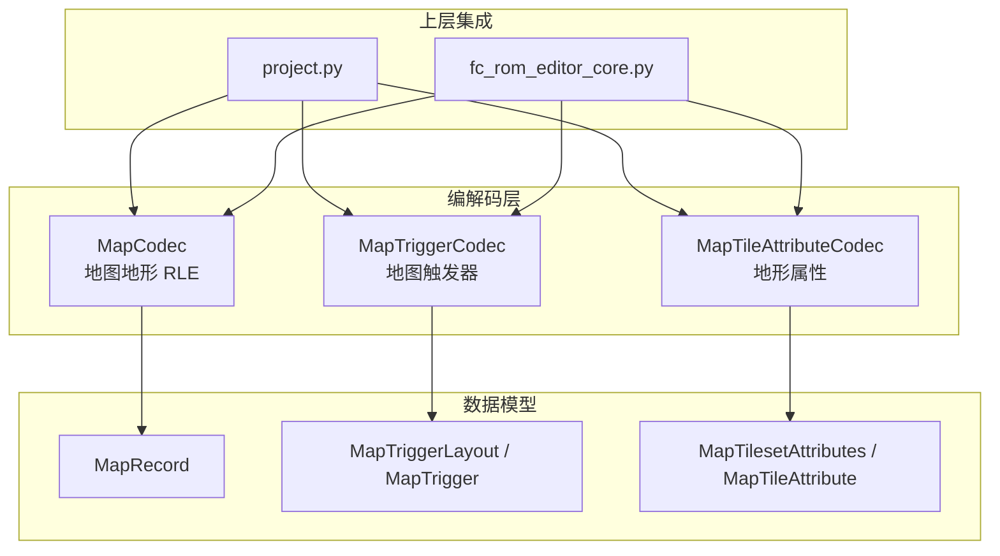
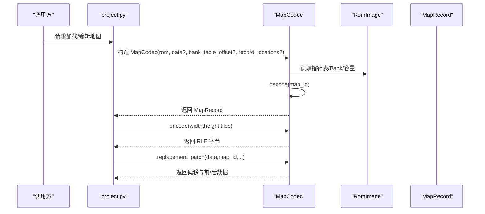
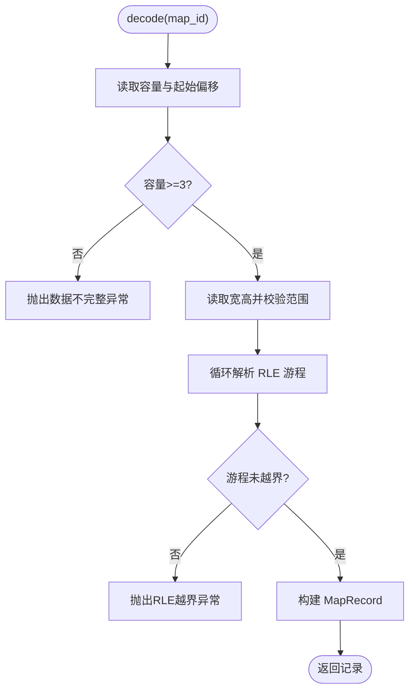
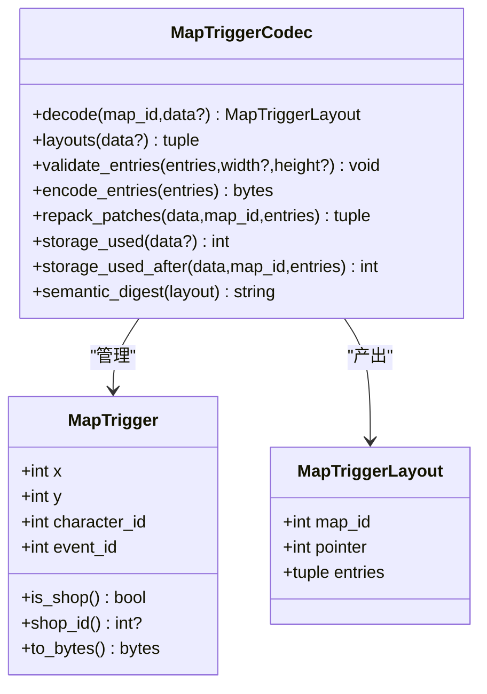
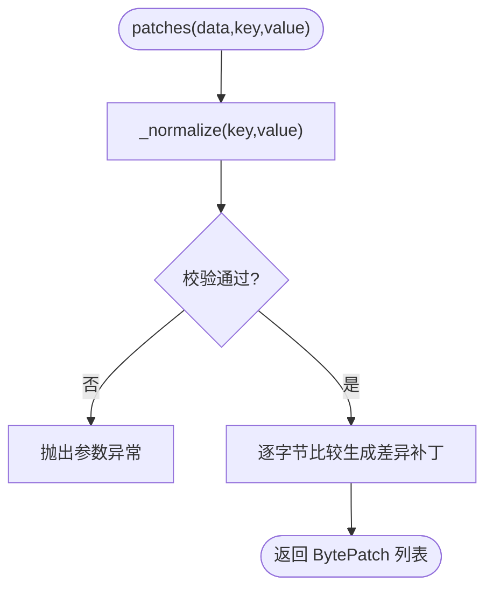
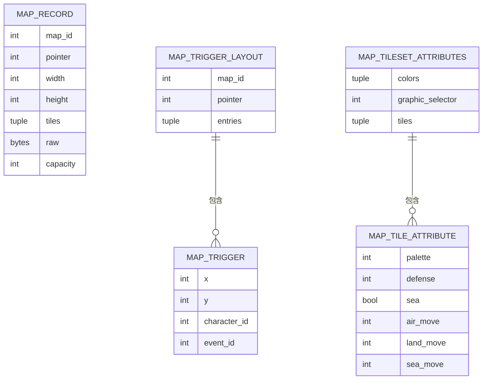
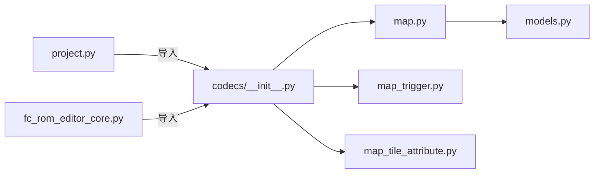

# 地图编解码器 (MapCodec)

<cite>
**本文引用的文件**
- [map.py](file://src/fc_editor/codecs/map.py)
- [__init__.py](file://src/fc_editor/codecs/__init__.py)
- [map_trigger.py](file://src/fc_editor/codecs/map_trigger.py)
- [map_tile_attribute.py](file://src/fc_editor/codecs/map_tile_attribute.py)
- [models.py](file://src/fc_editor/models.py)
- [project.py](file://src/fc_editor/project.py)
- [fc_rom_editor_core.py](file://src/fc_rom_editor_core.py)
</cite>

## 目录
1. [简介](#简介)
2. [项目结构](#项目结构)
3. [核心组件](#核心组件)
4. [架构总览](#架构总览)
5. [详细组件分析](#详细组件分析)
6. [依赖关系分析](#依赖关系分析)
7. [性能与内存优化](#性能与内存优化)
8. [故障排查指南](#故障排查指南)
9. [结论](#结论)
10. [附录：常用操作示例路径](#附录：常用操作示例路径)

## 简介
本文件面向地图编辑与扩展需求，系统化说明 MapCodec 及其相关编解码器的 API、数据模型与工作流程。重点覆盖：
- 地图数据读取与写入（RLE 地形图块）
- 地形属性配置（图库 A–G 的位图属性）
- 地图事件/触发器系统（坐标、限定人物、事件 ID、商店标记）
- 数据结构定义（地图布局、地形类型、可通行区域、特殊地点标记）
- 剧情衔接与事件执行流程
- 性能优化与内存使用建议
- 常见问题的定位与修复思路

## 项目结构
围绕地图编解码的核心模块位于 fc_editor/codecs 下，配合 models 中的数据结构定义，以及上层 project 与 rom 编辑器入口进行集成。

图表来源
- [map.py:16-228](file://src/fc_editor/codecs/map.py#L16-L228)
- [map_trigger.py:13-259](file://src/fc_editor/codecs/map_trigger.py#L13-L259)
- [map_tile_attribute.py:11-143](file://src/fc_editor/codecs/map_tile_attribute.py#L11-L143)
- [models.py:309-342](file://src/fc_editor/models.py#L309-L342)
- [project.py:496-512](file://src/fc_editor/project.py#L496-L512)
- [fc_rom_editor_core.py:547-565](file://src/fc_rom_editor_core.py#L547-L565)

章节来源
- [map.py:16-228](file://src/fc_editor/codecs/map.py#L16-L228)
- [map_trigger.py:13-259](file://src/fc_editor/codecs/map_trigger.py#L13-L259)
- [map_tile_attribute.py:11-143](file://src/fc_editor/codecs/map_tile_attribute.py#L11-L143)
- [models.py:309-342](file://src/fc_editor/models.py#L309-L342)
- [__init__.py:1-47](file://src/fc_editor/codecs/__init__.py#L1-L47)

## 核心组件
- MapCodec：负责地图地形数据的解码与编码（4 位逻辑地形 RLE），提供容量计算、指针解析、替换补丁生成与语义哈希。
- MapTriggerCodec：管理地图触发器（X/Y、限定人物、事件 ID），支持原 ROM 池压缩重排与扩展模式下的统一共享池。
- MapTileAttributeCodec：校验并编辑图库 A–G 的图块属性（调色板、防御补正、海陆空移动补正等）。
- 数据模型：MapRecord、MapTriggerLayout/MapTrigger、MapTilesetAttributes/MapTileAttribute。

章节来源
- [map.py:16-228](file://src/fc_editor/codecs/map.py#L16-L228)
- [map_trigger.py:13-259](file://src/fc_editor/codecs/map_trigger.py#L13-L259)
- [map_tile_attribute.py:11-143](file://src/fc_editor/codecs/map_tile_attribute.py#L11-L143)
- [models.py:309-342](file://src/fc_editor/models.py#L309-L342)

## 架构总览
MapCodec 通过 RomImage 提供的 ROM 数据与 profile 信息，解析地图指针表、Bank 表与容量，将原始字节流解码为 MapRecord；同时支持将新地形数据编码回 RLE，并生成原地替换补丁。MapTriggerCodec 与 MapTileAttributeCodec 分别处理事件触发与地形属性，三者共同构成地图编辑闭环。

图表来源
- [map.py:19-47](file://src/fc_editor/codecs/map.py#L19-L47)
- [map.py:136-173](file://src/fc_editor/codecs/map.py#L136-L173)
- [map.py:175-223](file://src/fc_editor/codecs/map.py#L175-L223)
- [project.py:496-512](file://src/fc_editor/project.py#L496-L512)

## 详细组件分析

### MapCodec：地图地形编解码
- 职责
  - 解析地图指针表与 Bank 表，计算每个地图的数据容量
  - 解码 RLE 地形图为二维逻辑地形序列
  - 编码新的地形图为 RLE
  - 生成原地替换补丁（offset, before, after）
  - 提供语义哈希用于变更检测
- 关键方法
  - __init__(rom, data?, bank_table_offset?, record_locations?)
  - decode(map_id, data?) -> MapRecord
  - encode(width, height, tiles) -> bytes
  - replacement_patch(data, map_id, width, height, tiles) -> (offset, before, after)
  - semantic_digest(record) -> str
  - round_trip(map_id) -> bool
- 数据结构
  - MapRecord：包含 map_id、pointer、width、height、tiles、raw、capacity，并提供 tile_at(x,y)、with_tile(x,y,tile) 访问与修改接口
- 复杂度
  - decode/encode 时间复杂度 O(W×H)，空间复杂度 O(W×H)
- 错误处理
  - 指针越界、容量不足、RLE 游程越界、尺寸非法等均抛出明确异常

图表来源
- [map.py:136-173](file://src/fc_editor/codecs/map.py#L136-L173)

章节来源
- [map.py:16-228](file://src/fc_editor/codecs/map.py#L16-L228)
- [models.py:309-342](file://src/fc_editor/models.py#L309-L342)

### MapTriggerCodec：地图触发器与事件
- 职责
  - 维护关卡级触发器布局（X/Y、character_id、event_id）
  - 支持原 ROM 托管池压缩重排与扩展模式下统一共享池
  - 提供条目校验、编码、存储占用估算与语义哈希
- 关键概念
  - MapTrigger：单条触发器，支持 is_shop/shop_id 快捷判断
  - MapTriggerLayout：某关卡的触发器布局（含 pointer 与 entries）
  - 终止符 0xFF 表示列表结束
- 关键方法
  - decode(map_id, data?) -> MapTriggerLayout
  - layouts(data?) -> tuple[MapTriggerLayout]
  - validate_entries(entries, width?, height?) -> None
  - encode_entries(entries) -> bytes
  - repack_patches(data, map_id, entries) -> tuple[(offset,before,after), ...]
  - storage_used(data?) -> int
  - storage_used_after(data, map_id, entries) -> int
- 约束与校验
  - X/Y 范围、限定人物范围、事件 ID 范围、坐标唯一性、与地图尺寸的边界检查

图表来源
- [map_trigger.py:13-259](file://src/fc_editor/codecs/map_trigger.py#L13-L259)

章节来源
- [map_trigger.py:13-259](file://src/fc_editor/codecs/map_trigger.py#L13-L259)

### MapTileAttributeCodec：地形属性（图库 A–G）
- 职责
  - 校验并编辑图库 A–G 的图块属性记录
  - 固定图形选择器，确保颜色表、移动补正等字段合法
- 关键概念
  - MapTileAttribute：palette、defense、sea、air_move、land_move、sea_move
  - MapTilesetAttributes：colors、graphic_selector、tiles
- 关键方法
  - supports(data) -> bool
  - decode(data, key) -> MapTilesetAttributes
  - patches(data, key, value) -> tuple[BytePatch]
- 约束
  - 颜色表值域、移动补正上限、图形选择器不可变、记录长度与偏移严格匹配

图表来源
- [map_tile_attribute.py:95-143](file://src/fc_editor/codecs/map_tile_attribute.py#L95-L143)

章节来源
- [map_tile_attribute.py:11-143](file://src/fc_editor/codecs/map_tile_attribute.py#L11-L143)

### 数据模型：MapRecord 与关联结构
- MapRecord
  - 字段：map_id、pointer、width、height、tiles、raw、capacity
  - 方法：tile_at(x,y)、with_tile(x,y,tile)
- 关联
  - MapTriggerLayout/MapTrigger：描述地图上的事件点
  - MapTilesetAttributes/MapTileAttribute：描述地形属性

图表来源
- [models.py:309-342](file://src/fc_editor/models.py#L309-L342)
- [map_trigger.py:13-37](file://src/fc_editor/codecs/map_trigger.py#L13-L37)
- [map_tile_attribute.py:11-26](file://src/fc_editor/codecs/map_tile_attribute.py#L11-L26)

章节来源
- [models.py:309-342](file://src/fc_editor/models.py#L309-L342)

## 依赖关系分析
- MapCodec 依赖 RomImage 与常量/错误模型，输出 MapRecord
- MapTriggerCodec 依赖 RomImage profile 中 map_triggers 配置，输出 MapTriggerLayout
- MapTileAttributeCodec 独立于 RomImage，仅对给定数据段进行校验与补丁生成
- 上层 project.py 与 fc_rom_editor_core.py 通过 codecs.__init__ 暴露的统一接口组合使用

图表来源
- [__init__.py:1-47](file://src/fc_editor/codecs/__init__.py#L1-L47)
- [project.py:496-512](file://src/fc_editor/project.py#L496-L512)
- [fc_rom_editor_core.py:547-565](file://src/fc_rom_editor_core.py#L547-L565)

章节来源
- [__init__.py:1-47](file://src/fc_editor/codecs/__init__.py#L1-L47)
- [project.py:496-512](file://src/fc_editor/project.py#L496-L512)
- [fc_rom_editor_core.py:547-565](file://src/fc_rom_editor_core.py#L547-L565)

## 性能与内存优化
- 地图地形
  - 优先使用 RLE 编码减少体积；避免频繁重建大数组，尽量就地修改 tiles 元组副本
  - 批量更新时合并多次 with_tile 调用，最后一次性 encode/replacement_patch
- 触发器
  - 使用 repack_patches 统一重排到托管池，利用重复载荷去重降低总体占用
  - 在扩展模式下，通过 record_locations 指定共享池位置，避免碎片化
- 地形属性
  - patches 仅返回差异字节，适合增量写入；注意保持 graphic_selector 不变
- 通用建议
  - 使用 semantic_digest 快速比对变更，避免全量对比
  - 控制单次处理的地图规模，必要时分块处理超大地图
  - 谨慎处理扩展 Bank 指针范围，避免无效指针导致额外校验开销

## 故障排查指南
- 地图数据不完整或容量不足
  - 现象：decode 抛出“数据块不完整”或“RLE 数据提前结束”
  - 排查：确认 capacity 计算正确、ROM 中该地图区块完整
- 指针越界或 Bank 不合法
  - 现象：指针不在允许窗口或超出当前 ROM 地图存储区
  - 排查：核对 profile 的 map_storage_ranges 与扩展 Bank 表
- 触发器条目非法
  - 现象：坐标/限定人物/事件 ID 越界或重复
  - 排查：使用 validate_entries 预检，结合地图宽高限制
- 地形属性校验失败
  - 现象：颜色表或移动补正超出预期范围
  - 排查：确保只修改允许字段，保持 graphic_selector 不变

章节来源
- [map.py:49-117](file://src/fc_editor/codecs/map.py#L49-L117)
- [map_trigger.py:157-187](file://src/fc_editor/codecs/map_trigger.py#L157-L187)
- [map_tile_attribute.py:58-93](file://src/fc_editor/codecs/map_tile_attribute.py#L58-L93)

## 结论
MapCodec 及其协作组件提供了完整的地图地形与事件编辑能力：从底层 RLE 编解码、容量与指针管理，到触发器布局与地形属性校验，形成稳定可靠的地图数据管线。通过合理的批量更新、去重与补丁机制，可在 FC 平台受限资源下实现高效编辑与最小化写入。

## 附录：常用操作示例路径
以下为典型操作的代码片段路径（不包含具体代码内容），便于快速定位实现：
- 导入地图素材并解码
  - [构造 MapCodec 并解码地图:19-47](file://src/fc_editor/codecs/map.py#L19-L47)
  - [解码得到 MapRecord:136-173](file://src/fc_editor/codecs/map.py#L136-L173)
- 编辑地形属性
  - [设置单个图块地形:336-341](file://src/fc_editor/models.py#L336-L341)
  - [编码为新 RLE 数据:175-196](file://src/fc_editor/codecs/map.py#L175-L196)
  - [生成原地替换补丁:203-223](file://src/fc_editor/codecs/map.py#L203-L223)
- 配置战斗事件/触发器
  - [读取关卡触发器布局:119-151](file://src/fc_editor/codecs/map_trigger.py#L119-L151)
  - [校验并编码触发器条目:157-187](file://src/fc_editor/codecs/map_trigger.py#L157-L187)
  - [统一重排到托管池:189-230](file://src/fc_editor/codecs/map_trigger.py#L189-L230)
- 地形属性（图库 A–G）编辑
  - [校验并生成属性补丁:119-143](file://src/fc_editor/codecs/map_tile_attribute.py#L119-L143)
- 上层集成
  - [project.py 中使用 MapCodec:496-512](file://src/fc_editor/project.py#L496-L512)
  - [fc_rom_editor_core.py 初始化 MapCodec:547-565](file://src/fc_rom_editor_core.py#L547-L565)