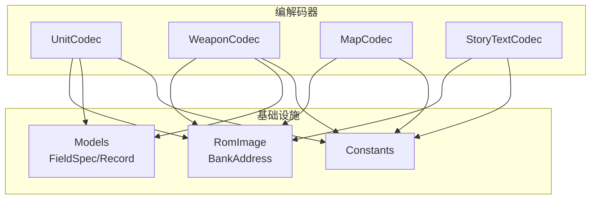
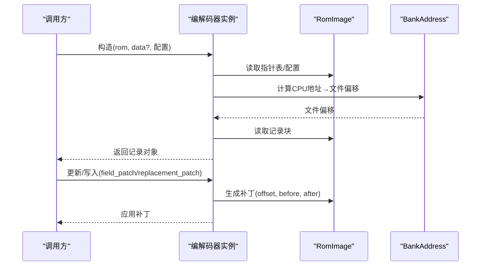
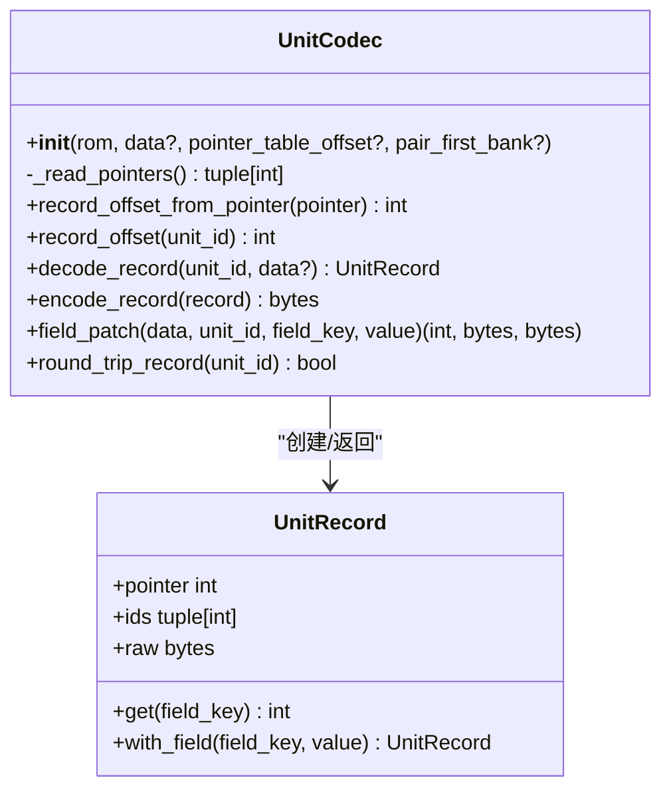
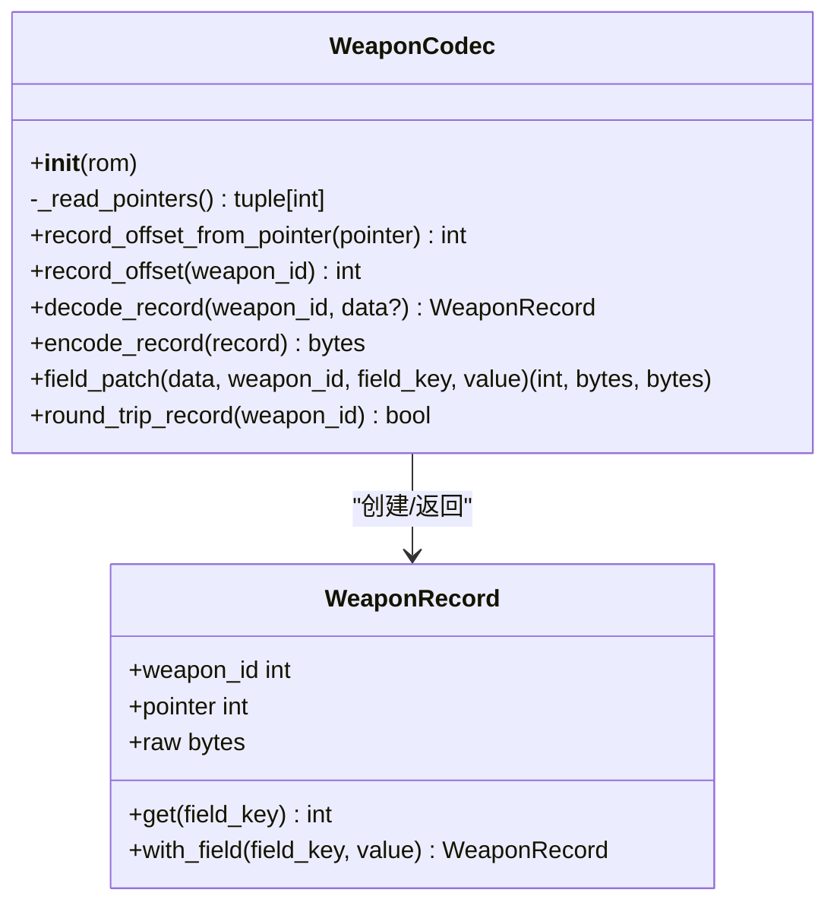
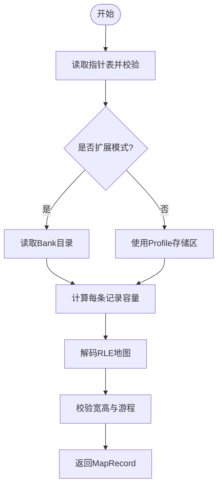
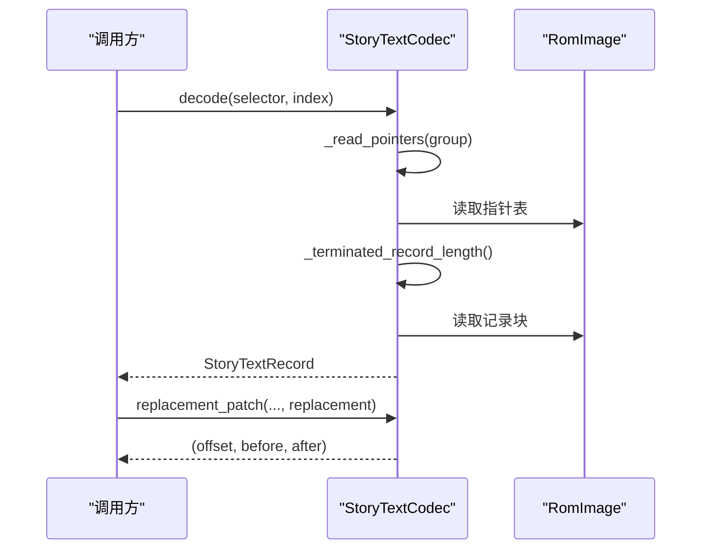
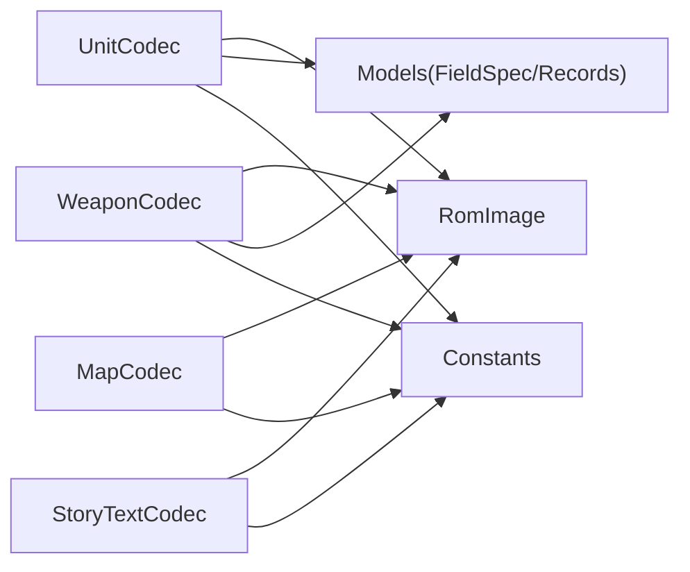

# 数据访问编解码器

<cite>
**本文引用的文件**
- [unit.py](file://src/fc_editor/codecs/unit.py)
- [weapon.py](file://src/fc_editor/codecs/weapon.py)
- [map.py](file://src/fc_editor/codecs/map.py)
- [story_text.py](file://src/fc_editor/codecs/story_text.py)
- [__init__.py](file://src/fc_editor/codecs/__init__.py)
- [models.py](file://src/fc_editor/models.py)
- [rom_image.py](file://src/fc_editor/rom_image.py)
- [constants.py](file://src/fc_editor/constants.py)
- [test_expansion_unit.py](file://tests/test_expansion_unit.py)
</cite>

## 目录
1. [简介](#简介)
2. [项目结构](#项目结构)
3. [核心组件](#核心组件)
4. [架构总览](#架构总览)
5. [详细组件分析](#详细组件分析)
6. [依赖关系分析](#依赖关系分析)
7. [性能考虑](#性能考虑)
8. [故障排查指南](#故障排查指南)
9. [结论](#结论)
10. [附录：扩展与示例](#附录：扩展与示例)

## 简介
本文件为“数据访问编解码器”的权威 API 文档，聚焦以下四类编解码器：
- UnitCodec（机体编解码器）
- WeaponCodec（武器编解码器）
- MapCodec（地图编解码器）
- StoryTextCodec（剧情文本编解码器）

内容覆盖读取、写入、更新操作；配置参数与数据格式规范；指针表管理与 Bank 空间处理；以及扩展性设计与使用示例。所有说明均基于源码实现，确保可追溯与可验证。

## 项目结构
编解码器位于 src/fc_editor/codecs 目录下，通过 __init__.py 统一导出。各编解码器依赖 rom_image 提供的 ROM 抽象与地址转换，依赖 models 中的记录模型与字段定义，依赖 constants 中的常量与布局信息。测试用例位于 tests 目录，用于验证扩展与打包流程。

图表来源
- [unit.py:14-120](file://src/fc_editor/codecs/unit.py#L14-L120)
- [weapon.py:13-90](file://src/fc_editor/codecs/weapon.py#L13-L90)
- [map.py:16-228](file://src/fc_editor/codecs/map.py#L16-L228)
- [story_text.py:17-259](file://src/fc_editor/codecs/story_text.py#L17-L259)
- [rom_image.py:22-125](file://src/fc_editor/rom_image.py#L22-L125)
- [models.py:13-200](file://src/fc_editor/models.py#L13-L200)
- [constants.py:1-69](file://src/fc_editor/constants.py#L1-L69)

章节来源
- [__init__.py:1-47](file://src/fc_editor/codecs/__init__.py#L1-L47)

## 核心组件
- UnitCodec：无损解码 128 条机体指针表与记录，支持按字段更新与往返校验。
- WeaponCodec：只读解码 192 条武器指针表与记录，支持按字段更新与往返校验。
- MapCodec：解码/编码 4-bit 地形 RLE 地图，支持容量受限替换与语义哈希。
- StoryTextCodec：无损视图与等长写入的剧情文本资源，支持分词、定位结束符与替换补丁。

章节来源
- [unit.py:14-120](file://src/fc_editor/codecs/unit.py#L14-L120)
- [weapon.py:13-90](file://src/fc_editor/codecs/weapon.py#L13-L90)
- [map.py:16-228](file://src/fc_editor/codecs/map.py#L16-L228)
- [story_text.py:17-259](file://src/fc_editor/codecs/story_text.py#L17-L259)

## 架构总览
编解码器以 RomImage 作为底层字节源，借助 BankAddress 将 CPU 地址映射到文件偏移。指针表负责索引记录位置，记录大小由常量或 Profile 约束。部分编解码器支持“扩展模式”（如地图 Bank 表、剧情文本组重定向），在保持兼容性的同时提供灵活布局能力。

图表来源
- [rom_image.py:22-125](file://src/fc_editor/rom_image.py#L22-L125)
- [unit.py:17-120](file://src/fc_editor/codecs/unit.py#L17-L120)
- [weapon.py:16-90](file://src/fc_editor/codecs/weapon.py#L16-L90)
- [map.py:19-228](file://src/fc_editor/codecs/map.py#L19-L228)
- [story_text.py:33-259](file://src/fc_editor/codecs/story_text.py#L33-L259)

## 详细组件分析

### UnitCodec（机体编解码器）
- 主要职责
  - 解析 128 条机体指针表并校验起始标记与范围。
  - 将 CPU 指针转换为文件偏移，支持扩展 Bank 对模式（pair_first_bank）。
  - 解码/编码固定长度记录，支持按字段更新与往返一致性检查。
- 关键方法
  - record_offset_from_pointer(pointer): 根据是否启用扩展 Bank 对进行转换。
  - record_offset(unit_id): 校验 ID 范围并返回记录文件偏移。
  - decode_record(unit_id, data?): 读取并构造 UnitRecord。
  - encode_record(record): 原样输出 raw。
  - field_patch(data, unit_id, field_key, value): 返回补丁三元组 (offset, before, after)。
  - round_trip_record(unit_id): 验证编解码一致性。
- 配置参数
  - rom: RomImage 实例。
  - data: 可选的原始字节源（默认使用 rom.data）。
  - pointer_table_offset: 指针表偏移（默认来自 profile）。
  - pair_first_bank: 扩展模式下首 Bank 编号，使指针落在 $8000–$BFFF 范围内。
- 数据格式
  - 指针表：小端 16 位数组，长度为 profile.unit_count。
  - 记录：固定 UNIT_RECORD_SIZE（0x10）字节。
- 指针表与 Bank 管理
  - 非扩展模式：通过 BankAddress 将 PRG Bank + CPU 地址映射到文件偏移。
  - 扩展模式：指针限制在 $8000–$BFFF，直接映射到 pair_first_bank 对应的 16 KiB 窗口。
- 错误处理
  - 指针表不完整、起始标记不正确、指针无效、记录越界等均抛出 RomFormatError。
- 复杂度
  - 初始化 O(N) 遍历指针表；单次读写 O(1) 记录大小。

图表来源
- [unit.py:14-120](file://src/fc_editor/codecs/unit.py#L14-L120)
- [models.py:165-183](file://src/fc_editor/models.py#L165-L183)

章节来源
- [unit.py:14-120](file://src/fc_editor/codecs/unit.py#L14-L120)
- [models.py:13-200](file://src/fc_editor/models.py#L13-L200)
- [constants.py:12-20](file://src/fc_editor/constants.py#L12-L20)

### WeaponCodec（武器编解码器）
- 主要职责
  - 解析 192 条武器指针表并校验起始标记与范围。
  - 解码/编码固定长度记录，支持按字段更新与往返一致性检查。
- 关键方法
  - record_offset_from_pointer(pointer): 通过 BankAddress 转换。
  - record_offset(weapon_id): 校验 ID 范围并返回记录文件偏移。
  - decode_record(weapon_id, data?): 读取并构造 WeaponRecord。
  - encode_record(record): 原样输出 raw。
  - field_patch(data, weapon_id, field_key, value): 返回补丁三元组。
  - round_trip_record(weapon_id): 验证编解码一致性。
- 配置参数
  - rom: RomImage 实例。
- 数据格式
  - 指针表：小端 16 位数组，长度为 profile.weapon_pointer_count。
  - 记录：固定 WEAPON_RECORD_SIZE（0x06）字节。
- 指针表与 Bank 管理
  - 使用 weapon_data_prg_bank 与 window_base 进行地址转换。
- 错误处理
  - 指针表不完整、起始标记不正确、指针无效、记录越界等均抛出 RomFormatError。
- 复杂度
  - 初始化 O(N) 遍历指针表；单次读写 O(1) 记录大小。

图表来源
- [weapon.py:13-90](file://src/fc_editor/codecs/weapon.py#L13-L90)
- [models.py:185-200](file://src/fc_editor/models.py#L185-L200)

章节来源
- [weapon.py:13-90](file://src/fc_editor/codecs/weapon.py#L13-L90)
- [constants.py:17-20](file://src/fc_editor/constants.py#L17-L20)

### MapCodec（地图编解码器）
- 主要职责
  - 解码/编码 4-bit 地形 RLE 地图，支持容量受限替换与语义哈希。
  - 支持两种布局：传统存储区与扩展 Bank 表。
- 关键方法
  - _read_pointers(): 读取指针表并校验起始标记与范围。
  - _read_banks(): 读取扩展 Bank 目录（可选）。
  - _build_capacities(): 计算每条记录的可用容量。
  - pointer_to_file_offset(map_id, pointer): 将 CPU 指针转为文件偏移。
  - record_offset(map_id): 返回记录文件偏移。
  - decode(map_id, data?): 解析 RLE 数据并构造 MapRecord。
  - encode(width, height, tiles): 将图块序列编码为 RLE。
  - replacement_patch(data, map_id, width, height, tiles): 生成等容量替换补丁。
  - semantic_digest(record): 基于宽高与图块的语义哈希。
  - round_trip(map_id): 验证编解码一致性。
- 配置参数
  - rom: RomImage 实例。
  - data: 可选的原始字节源。
  - bank_table_offset: 扩展模式下 Bank 目录偏移（可选）。
  - record_locations: 预构建的位置元组（跳过自动解析）。
- 数据格式
  - 指针表：小端 16 位数组，长度为 profile.map_count。
  - 记录：RLE 编码，首两字节为宽高，后续为游程控制字。
- 指针表与 Bank 管理
  - 传统模式：指针需位于 profile.map_storage_ranges 指定窗口内。
  - 扩展模式：指针必须位于 $A000–$BFFF，并通过 bank_table_offset 读取 Bank 号。
- 错误处理
  - 指针表不完整、起始标记不正确、指针越界、容量无效、RLE 提前结束、游程越界等。
- 复杂度
  - 初始化 O(N) 遍历指针表；解码/编码 O(W×H)。

图表来源
- [map.py:16-228](file://src/fc_editor/codecs/map.py#L16-L228)

章节来源
- [map.py:16-228](file://src/fc_editor/codecs/map.py#L16-L228)
- [constants.py:29-33](file://src/fc_editor/constants.py#L29-L33)

### StoryTextCodec（剧情文本编解码器）
- 主要职责
  - 无损视图与等长写入的剧情文本资源，支持多组选择器与重定向。
  - 分词器识别中文字形码、控制码与结束符，保证边界安全。
- 关键方法
  - __init__(rom, data?, group_bank_overrides?): 初始化组信息与容量。
  - _terminated_record_length(group, pointer): 扫描至 FF 结束符，跳过双字节字形。
  - _read_pointers(group): 读取组指针表并校验起始标记与范围。
  - cpu_to_file_offset(prg_bank, cpu_address): 偶数 Bank $8000 窗口映射。
  - decode(selector, index, data?): 读取并构造 StoryTextRecord。
  - tokenize(raw): 将原始字节流切分为 Token。
  - standalone_terminator_end(raw): 定位首个独立 FF 结束符的末尾偏移。
  - semantic_digest(record): 基于原始字节的语义哈希。
  - replacement_patch(data, selector, index, replacement): 生成等长替换补丁。
  - round_trip(selector, index): 验证编解码一致性。
- 配置参数
  - rom: RomImage 实例。
  - data: 可选的原始字节源。
  - group_bank_overrides: 组级 Bank 重定向映射。
- 数据格式
  - 指针表：每组 count 条小端 16 位指针，起始指针受组规格约束。
  - 记录：以 FF 结尾的字节流，包含单/双字节字形与控制码。
- 指针表与 Bank 管理
  - 仅允许偶数 PRG Bank 的 $8000–$BFFF 窗口；支持组级 Bank 覆盖。
- 错误处理
  - 指针表不完整、起始标记不正确、指针越界、末记录字形不完整、缺少 FF 结束符等。
- 复杂度
  - 初始化 O(N) 遍历指针表；分词与终止符查找 O(L)，L 为记录长度。

图表来源
- [story_text.py:17-259](file://src/fc_editor/codecs/story_text.py#L17-L259)
- [rom_image.py:22-125](file://src/fc_editor/rom_image.py#L22-L125)

章节来源
- [story_text.py:17-259](file://src/fc_editor/codecs/story_text.py#L17-L259)

## 依赖关系分析
- 编解码器与 RomImage
  - 通过 BankAddress 将 CPU 地址映射到文件偏移，确保跨 Bank 访问正确。
- 编解码器与 Models
  - FieldSpec 提供字段级编解码能力；UnitRecord/WeaponRecord 封装记录结构与字段访问。
- 编解码器与 Constants
  - 记录大小、指针表偏移、计数等常量集中管理，便于维护与扩展。
- 扩展与测试
  - 测试用例验证扩展打包与校验流程，确保指针表与记录完整性。

图表来源
- [unit.py:14-120](file://src/fc_editor/codecs/unit.py#L14-L120)
- [weapon.py:13-90](file://src/fc_editor/codecs/weapon.py#L13-L90)
- [map.py:16-228](file://src/fc_editor/codecs/map.py#L16-L228)
- [story_text.py:17-259](file://src/fc_editor/codecs/story_text.py#L17-L259)
- [rom_image.py:22-125](file://src/fc_editor/rom_image.py#L22-L125)
- [models.py:13-200](file://src/fc_editor/models.py#L13-L200)
- [constants.py:1-69](file://src/fc_editor/constants.py#L1-L69)

章节来源
- [test_expansion_unit.py:89-200](file://tests/test_expansion_unit.py#L89-L200)

## 性能考虑
- 指针表解析仅在初始化时执行一次，时间复杂度 O(N)。
- 记录读写为 O(1) 固定大小（机体/武器）或 O(W×H)（地图 RLE）。
- 地图 RLE 编码采用游程压缩，适合重复地形较多的场景。
- 剧情文本分词线性扫描，避免误判双字节字形中的 FF 字节。
- 建议批量操作时复用编解码器实例以减少重复解析开销。

## 故障排查指南
- 常见错误类型
  - RomFormatError：指针表不完整、起始标记不正确、指针越界、记录不完整或超出支持区域。
  - ValueError：非法参数（如宽度/高度、Tile 值、Bank/CPU 地址范围）。
- 排查步骤
  - 确认 ROM 头与 Mapper 匹配（RomImage.validate_layout）。
  - 检查指针表起始标记与范围是否符合 Profile 或扩展模式要求。
  - 对于地图，校验宽高是否在 1–32 之间，RLE 游程是否越界。
  - 对于剧情文本，确认偶数 Bank 窗口与 FF 结束符存在。
- 参考定位
  - 错误消息中包含具体资源 ID 与指针值，便于快速定位问题记录。

章节来源
- [rom_image.py:79-125](file://src/fc_editor/rom_image.py#L79-L125)
- [unit.py:42-66](file://src/fc_editor/codecs/unit.py#L42-L66)
- [weapon.py:20-39](file://src/fc_editor/codecs/weapon.py#L20-L39)
- [map.py:49-117](file://src/fc_editor/codecs/map.py#L49-L117)
- [story_text.py:122-138](file://src/fc_editor/codecs/story_text.py#L122-L138)

## 结论
本套编解码器提供了稳定、可扩展的数据访问能力，覆盖机体、武器、地图与剧情文本四大核心资源。通过统一的指针表管理、Bank 地址转换与严格的格式校验，确保数据一致性与安全性。扩展点清晰，便于新增资源类型与布局模式。

## 附录：扩展与示例

### 如何添加新的编解码器类型
- 步骤
  - 在 src/fc_editor/codecs 下新建模块，定义类与方法（读取指针表、记录偏移、解码/编码、字段更新、往返校验）。
  - 在 __init__.py 中导出新类。
  - 在 constants/profile 中声明相关常量与布局（指针表偏移、记录大小、计数等）。
  - 编写单元测试，覆盖正常路径与异常路径。
- 设计要点
  - 使用 BankAddress 进行地址转换，确保跨 Bank 访问正确。
  - 使用 FieldSpec 描述字段布局，支持掩码与位移。
  - 对指针表进行完整性与范围校验，防止越界与损坏。
  - 提供 round_trip 方法验证编解码一致性。

章节来源
- [__init__.py:1-47](file://src/fc_editor/codecs/__init__.py#L1-L47)
- [constants.py:1-69](file://src/fc_editor/constants.py#L1-L69)
- [models.py:13-200](file://src/fc_editor/models.py#L13-L200)

### 使用示例（代码片段路径）
- 读取与更新机体记录
  - 构造 UnitCodec 并解码记录：[unit.py:17-93](file://src/fc_editor/codecs/unit.py#L17-L93)
  - 按字段更新并生成补丁：[unit.py:100-115](file://src/fc_editor/codecs/unit.py#L100-L115)
  - 往返校验：[unit.py:117-120](file://src/fc_editor/codecs/unit.py#L117-L120)
- 读取与更新武器记录
  - 构造 WeaponCodec 并解码记录：[weapon.py:16-66](file://src/fc_editor/codecs/weapon.py#L16-L66)
  - 按字段更新并生成补丁：[weapon.py:72-85](file://src/fc_editor/codecs/weapon.py#L72-L85)
  - 往返校验：[weapon.py:87-90](file://src/fc_editor/codecs/weapon.py#L87-L90)
- 地图编解码与替换
  - 解码地图记录：[map.py:136-173](file://src/fc_editor/codecs/map.py#L136-L173)
  - 编码地图数据：[map.py:175-196](file://src/fc_editor/codecs/map.py#L175-L196)
  - 生成替换补丁：[map.py:203-223](file://src/fc_editor/codecs/map.py#L203-L223)
  - 往返校验：[map.py:225-228](file://src/fc_editor/codecs/map.py#L225-L228)
- 剧情文本分词与替换
  - 解码文本记录：[story_text.py:156-179](file://src/fc_editor/codecs/story_text.py#L156-L179)
  - 分词与定位结束符：[story_text.py:181-222](file://src/fc_editor/codecs/story_text.py#L181-L222)
  - 生成等长替换补丁：[story_text.py:228-245](file://src/fc_editor/codecs/story_text.py#L228-L245)
  - 往返校验：[story_text.py:247-259](file://src/fc_editor/codecs/story_text.py#L247-L259)

章节来源
- [unit.py:17-120](file://src/fc_editor/codecs/unit.py#L17-L120)
- [weapon.py:16-90](file://src/fc_editor/codecs/weapon.py#L16-L90)
- [map.py:136-228](file://src/fc_editor/codecs/map.py#L136-L228)
- [story_text.py:156-259](file://src/fc_editor/codecs/story_text.py#L156-L259)