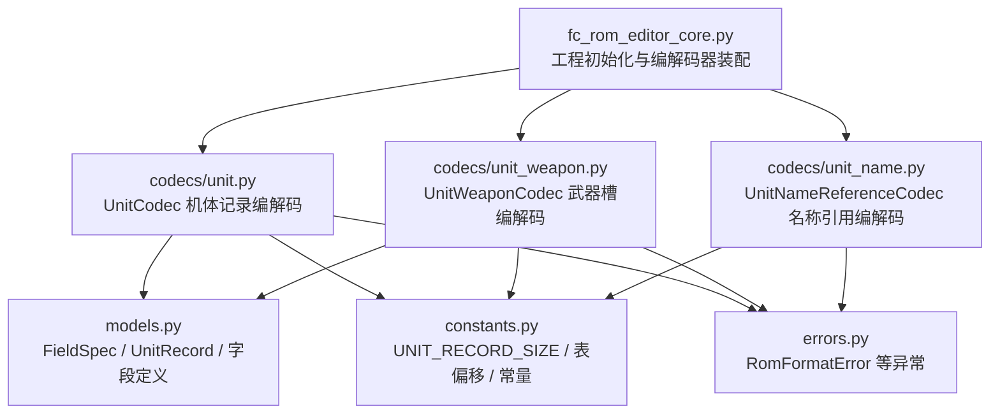
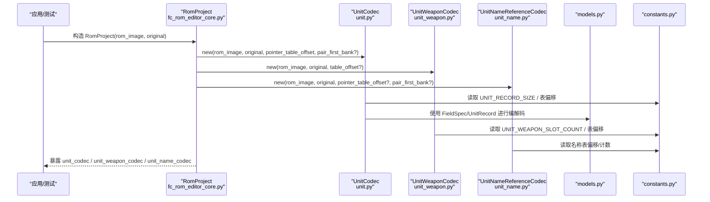
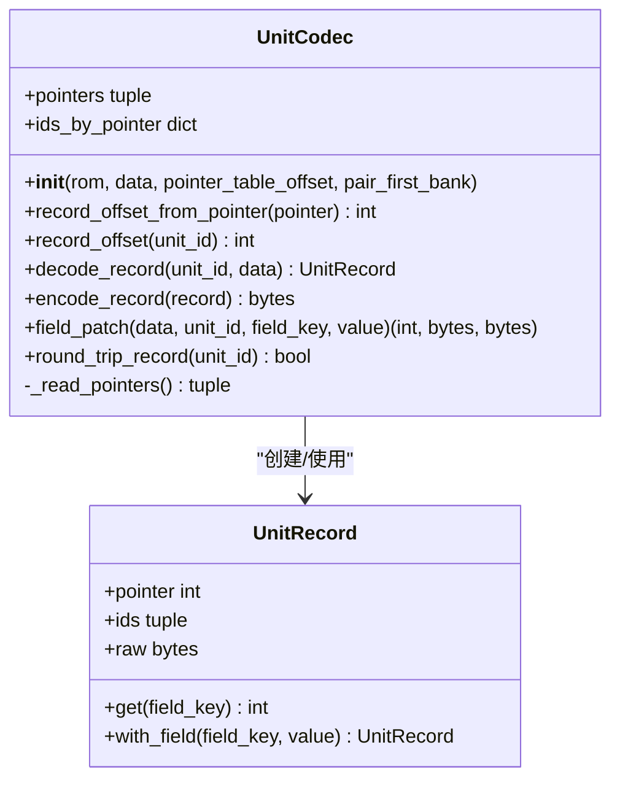
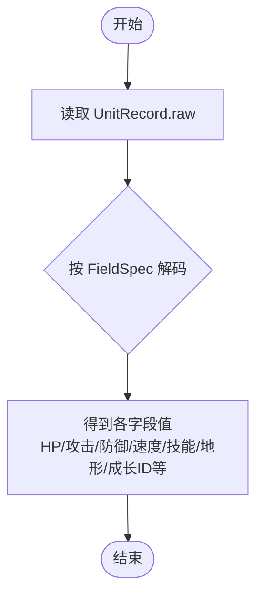
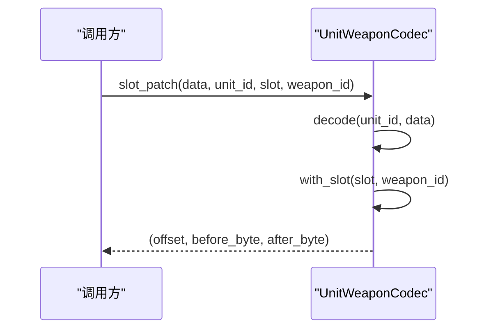
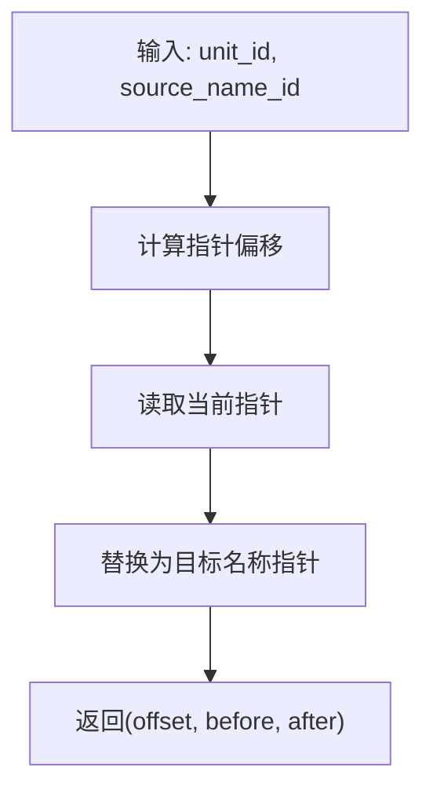
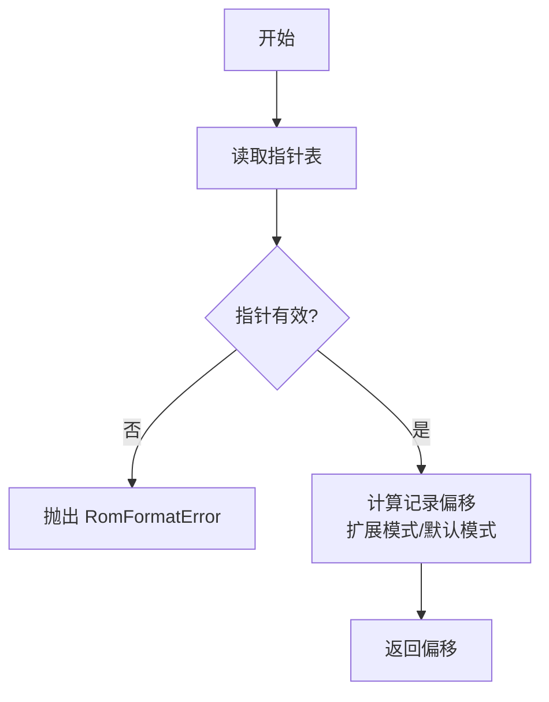
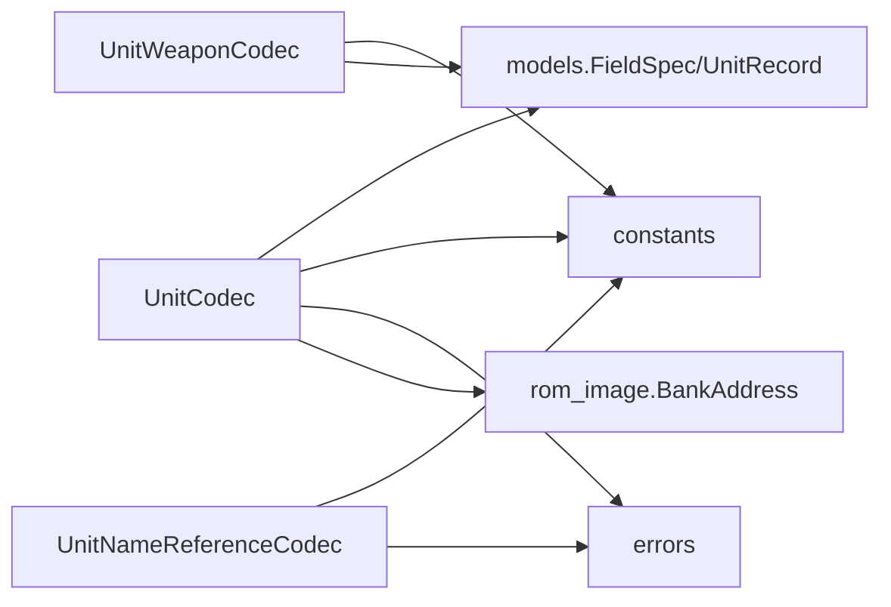

# 机体编解码器 (UnitCodec)

<cite>
**本文引用的文件**
- [unit.py](file://src/fc_editor/codecs/unit.py)
- [unit_weapon.py](file://src/fc_editor/codecs/unit_weapon.py)
- [unit_name.py](file://src/fc_editor/codecs/unit_name.py)
- [models.py](file://src/fc_editor/models.py)
- [constants.py](file://src/fc_editor/constants.py)
- [errors.py](file://src/fc_editor/errors.py)
- [fc_rom_editor_core.py](file://src/fc_rom_editor_core.py)
</cite>

## 目录
1. [简介](#简介)
2. [项目结构](#项目结构)
3. [核心组件](#核心组件)
4. [架构总览](#架构总览)
5. [详细组件分析](#详细组件分析)
6. [依赖关系分析](#依赖关系分析)
7. [性能与内存特性](#性能与内存特性)
8. [故障排查指南](#故障排查指南)
9. [结论](#结论)
10. [附录：使用示例与最佳实践](#附录使用示例与最佳实践)

## 简介
本文件为“机体编解码器”的权威 API 文档，聚焦 UnitCodec 类及其协作组件（UnitWeaponCodec、UnitNameReferenceCodec），面向需要读取/修改/保存 FC 游戏“第二次机器人大战”扩展版中机体数据的开发者。内容涵盖：
- 机体数据结构定义（基础属性、武器配置、外观设置、技能列表等）
- 指针表管理机制（含 Bank 空间分配与窗口映射）
- 公共方法详解（读取、写入、字段级 patch、往返校验）
- 错误处理与验证规则
- 典型工作流示例（加载、修改、保存）

## 项目结构
围绕机体数据的核心代码位于 fc_editor.codecs 包内，配合 models、constants、errors 以及上层工程管理器 fc_rom_editor_core 协同工作。下图给出与本文相关的文件组织关系。

**图表来源**
- [fc_rom_editor_core.py:480-524](file://src/fc_rom_editor_core.py#L480-L524)
- [unit.py:14-120](file://src/fc_editor/codecs/unit.py#L14-L120)
- [unit_weapon.py:11-79](file://src/fc_editor/codecs/unit_weapon.py#L11-L79)
- [unit_name.py:9-90](file://src/fc_editor/codecs/unit_name.py#L9-L90)
- [models.py:13-183](file://src/fc_editor/models.py#L13-L183)
- [constants.py:12-28](file://src/fc_editor/constants.py#L12-L28)
- [errors.py:1-11](file://src/fc_editor/errors.py#L1-L11)

**章节来源**
- [fc_rom_editor_core.py:480-524](file://src/fc_rom_editor_core.py#L480-L524)
- [unit.py:14-120](file://src/fc_editor/codecs/unit.py#L14-L120)
- [unit_weapon.py:11-79](file://src/fc_editor/codecs/unit_weapon.py#L11-L79)
- [unit_name.py:9-90](file://src/fc_editor/codecs/unit_name.py#L9-L90)
- [models.py:13-183](file://src/fc_editor/models.py#L13-L183)
- [constants.py:12-28](file://src/fc_editor/constants.py#L12-L28)
- [errors.py:1-11](file://src/fc_editor/errors.py#L1-L11)

## 核心组件
- UnitCodec：负责读取/写入机体记录、解析指针表、计算记录偏移、字段级 patch、往返一致性校验。
- UnitWeaponCodec：负责每机两个直接武器槽的读写与校验。
- UnitNameReferenceCodec：通过重定向到已有本地化名称实现稳定改名。
- FieldSpec / UnitRecord：统一字段描述与机体记录的封装，提供 get/with_field 安全访问。
- constants：集中定义记录大小、表偏移、Bank 信息等关键常量。
- errors：统一的 ROM 格式异常类型。

**章节来源**
- [unit.py:14-120](file://src/fc_editor/codecs/unit.py#L14-L120)
- [unit_weapon.py:11-79](file://src/fc_editor/codecs/unit_weapon.py#L11-L79)
- [unit_name.py:9-90](file://src/fc_editor/codecs/unit_name.py#L9-L90)
- [models.py:13-183](file://src/fc_editor/models.py#L13-L183)
- [constants.py:12-28](file://src/fc_editor/constants.py#L12-L28)
- [errors.py:1-11](file://src/fc_editor/errors.py#L1-L11)

## 架构总览
下图展示从工程初始化到具体编解码器的调用链，以及数据在 ROM 中的定位方式。

**图表来源**
- [fc_rom_editor_core.py:480-524](file://src/fc_rom_editor_core.py#L480-L524)
- [unit.py:14-120](file://src/fc_editor/codecs/unit.py#L14-L120)
- [unit_weapon.py:11-79](file://src/fc_editor/codecs/unit_weapon.py#L11-L79)
- [unit_name.py:9-90](file://src/fc_editor/codecs/unit_name.py#L9-L90)
- [models.py:13-183](file://src/fc_editor/models.py#L13-L183)
- [constants.py:12-28](file://src/fc_editor/constants.py#L12-L28)

## 详细组件分析

### UnitCodec 类 API 与方法
- 构造
  - __init__(rom, data=None, *, pointer_table_offset=None, pair_first_bank=None)
    - 作用：绑定 ROM 镜像与可选数据源；确定指针表起始位置；读取并校验指针表；构建 ids_by_pointer 映射。
    - 关键点：当提供 pair_first_bank 时，支持“扩展 Bank 对”模式下的指针解析。
- 指针与偏移
  - record_offset_from_pointer(pointer) -> int
    - 将 PRG 地址指针转换为 ROM 文件偏移；支持扩展 Bank 对或默认 PRG Bank + Window Base。
  - record_offset(unit_id) -> int
    - 根据单位 ID 获取其记录在 ROM 中的文件偏移。
- 编解码
  - decode_record(unit_id, data=None) -> UnitRecord
    - 读取指定单位的原始记录字节，构造 UnitRecord。
  - encode_record(record) -> bytes
    - 将 UnitRecord 编码回原始字节序列（用于校验）。
  - field_patch(data, unit_id, field_key, value) -> tuple[int, bytes, bytes]
    - 针对某字段生成补丁：返回目标偏移、修改前字节、修改后字节。
  - round_trip_record(unit_id) -> bool
    - 往返校验：decode 后再 encode 是否与原字节一致。

**图表来源**
- [unit.py:14-120](file://src/fc_editor/codecs/unit.py#L14-L120)
- [models.py:165-183](file://src/fc_editor/models.py#L165-L183)

**章节来源**
- [unit.py:14-120](file://src/fc_editor/codecs/unit.py#L14-L120)
- [models.py:165-183](file://src/fc_editor/models.py#L165-L183)

### 机体数据结构与字段定义
- 记录尺寸：固定长度（由常量定义）。
- 基础属性（关键字段）
  - movement（移动力）、speed（速度）、strength（强度）、defense（防卫）
  - hp（基础 HP，16 位小端）
  - special（特殊技能字节）
  - terrain（地形适应低两位）
  - upgrade（历史兼容键：基础金钱）
  - experience（基础经验）
- 成长曲线（升级累加项）
  - speed_growth、strength_growth、defense_growth、hp_growth
- 候选字段（证据等级区分）
  - candidate_00/01/02/0a/0b 等，部分用途待确认。
- 访问方式
  - UnitRecord.get(field_key) 读取
  - UnitRecord.with_field(field_key, value) 生成新记录副本

**图表来源**
- [models.py:13-162](file://src/fc_editor/models.py#L13-L162)
- [constants.py:12-16](file://src/fc_editor/constants.py#L12-L16)

**章节来源**
- [models.py:13-162](file://src/fc_editor/models.py#L13-L162)
- [constants.py:12-16](file://src/fc_editor/constants.py#L12-L16)

### 武器配置（UnitWeaponCodec）
- 每个单位拥有两个直接武器槽位。
- 主要方法
  - record_offset(unit_id) -> int：计算武器表记录偏移
  - decode(unit_id, data=None) -> UnitWeaponConfig：读取两槽武器 ID
  - encode(config) -> bytes：编码武器配置
  - slot_patch(data, unit_id, slot, weapon_id) -> tuple[int, bytes, bytes]：单槽位补丁
- 校验
  - 初始化时校验表完整性与武器 ID 合法性

**图表来源**
- [unit_weapon.py:30-79](file://src/fc_editor/codecs/unit_weapon.py#L30-L79)

**章节来源**
- [unit_weapon.py:11-79](file://src/fc_editor/codecs/unit_weapon.py#L11-L79)

### 名称引用（UnitNameReferenceCodec）
- 通过重定向到已有本地化名称实现稳定改名，避免破坏资源布局。
- 主要方法
  - pointer_offset(unit_id) -> int
  - pointer(unit_id, data=None) -> int
  - reference_patch(data, unit_id, source_name_id) -> tuple[int, bytes, bytes]
  - source_ids(pointer) -> tuple[int, ...]
- 校验
  - 名称指针表完整性、起始标记、指针范围限制（特定 Bank 窗口）

**图表来源**
- [unit_name.py:58-82](file://src/fc_editor/codecs/unit_name.py#L58-L82)

**章节来源**
- [unit_name.py:9-90](file://src/fc_editor/codecs/unit_name.py#L9-L90)

### 指针表管理与 Bank 空间分配
- 指针表
  - 单位指针表：长度为 unit_count * 2，起始指针必须为 0，后续指针需有效且指向合法记录区域。
- 记录偏移计算
  - 非扩展模式：基于 profile.unit_data_prg_bank 与 window_base 计算文件偏移。
  - 扩展模式（pair_first_bank）：指针需在 0x8000–0xBFFF 范围内，映射到对应 Bank 对的 16 KiB 窗口。
- 名称指针表
  - 名称指针表长度 unit_name_count * 2，起始指针需匹配 profile.unit_name_first_pointer，指针范围限制在 Bank 12/13 的 16 KiB 窗口。

**图表来源**
- [unit.py:42-77](file://src/fc_editor/codecs/unit.py#L42-L77)
- [unit_name.py:30-50](file://src/fc_editor/codecs/unit_name.py#L30-L50)
- [constants.py:12-28](file://src/fc_editor/constants.py#L12-L28)

**章节来源**
- [unit.py:42-77](file://src/fc_editor/codecs/unit.py#L42-L77)
- [unit_name.py:30-50](file://src/fc_editor/codecs/unit_name.py#L30-L50)
- [constants.py:12-28](file://src/fc_editor/constants.py#L12-L28)

## 依赖关系分析
- UnitCodec 依赖
  - models.FieldSpec/UnitRecord：字段解码/编码与记录封装
  - constants：记录大小、表偏移、Bank 信息
  - errors：格式错误异常
  - rom_image.BankAddress：地址转换（在 record_offset_from_pointer 中使用）
- UnitWeaponCodec 依赖
  - constants：武器槽数量、表偏移
  - models.UnitWeaponConfig：武器配置对象
- UnitNameReferenceCodec 依赖
  - constants：名称表偏移与计数
  - errors：格式错误异常

**图表来源**
- [unit.py:1-120](file://src/fc_editor/codecs/unit.py#L1-L120)
- [unit_weapon.py:1-79](file://src/fc_editor/codecs/unit_weapon.py#L1-L79)
- [unit_name.py:1-90](file://src/fc_editor/codecs/unit_name.py#L1-L90)
- [models.py:13-183](file://src/fc_editor/models.py#L13-L183)
- [constants.py:12-28](file://src/fc_editor/constants.py#L12-L28)
- [errors.py:1-11](file://src/fc_editor/errors.py#L1-L11)

**章节来源**
- [unit.py:1-120](file://src/fc_editor/codecs/unit.py#L1-L120)
- [unit_weapon.py:1-79](file://src/fc_editor/codecs/unit_weapon.py#L1-L79)
- [unit_name.py:1-90](file://src/fc_editor/codecs/unit_name.py#L1-L90)
- [models.py:13-183](file://src/fc_editor/models.py#L13-L183)
- [constants.py:12-28](file://src/fc_editor/constants.py#L12-L28)
- [errors.py:1-11](file://src/fc_editor/errors.py#L1-L11)

## 性能与内存特性
- 指针表一次性读取并缓存，避免重复 I/O。
- 记录读取按固定长度切片，时间复杂度 O(1)。
- 字段级 patch 仅修改必要字节，减少写放大。
- 扩展 Bank 模式下，指针到文件偏移的计算包含常数时间算术与边界检查。
- 建议批量操作时使用事务机制（上层工程管理器负责撤销栈与快照），降低中间状态风险。

[本节为通用指导，不直接分析具体文件]

## 故障排查指南
- 常见异常
  - RomFormatError：指针表不完整、起始标记不正确、记录超出支持区域、武器配置不完整、名称指针表不完整等。
  - IndexError：单位 ID 越界。
  - ValueError：未知指针、非法数值范围、非法武器 ID 等。
- 排查步骤
  - 确认 ROM 版本与 profile 配置一致（表偏移、单位数量、Bank 映射）。
  - 检查指针表首项是否为 0，后续指针是否落在允许范围。
  - 对于扩展模式，确保指针位于 0x8000–0xBFFF，且 pair_first_bank 正确。
  - 使用 round_trip_record 验证编解码一致性。
  - 对武器槽与名称引用分别使用各自 codec 的校验逻辑。

**章节来源**
- [unit.py:42-98](file://src/fc_editor/codecs/unit.py#L42-L98)
- [unit_weapon.py:37-79](file://src/fc_editor/codecs/unit_weapon.py#L37-L79)
- [unit_name.py:30-50](file://src/fc_editor/codecs/unit_name.py#L30-L50)
- [errors.py:1-11](file://src/fc_editor/errors.py#L1-L11)

## 结论
UnitCodec 提供了无损、可验证的机体数据编解码能力，结合 UnitWeaponCodec 与 UnitNameReferenceCodec，覆盖了机体属性、武器配置与名称引用的完整编辑流程。通过严格的指针表校验与字段级 patch，能够在保证 ROM 结构完整性的前提下高效完成修改与保存。

[本节为总结性内容，不直接分析具体文件]

## 附录：使用示例与最佳实践
以下示例以“伪代码”形式说明典型工作流，实际实现请参考对应源码路径。

- 加载机体数据
  - 在工程初始化时，RomProject 会创建 base_unit_codec 与 unit_codec，并传入 pointer_table_offset 与 pair_first_bank（若为扩展模式）。
  - 参考路径：[fc_rom_editor_core.py:480-524](file://src/fc_rom_editor_core.py#L480-L524)
- 读取与修改属性
  - 使用 UnitCodec.decode_record 获取 UnitRecord，再通过 UnitRecord.with_field 修改字段，最后用 UnitCodec.field_patch 生成补丁。
  - 参考路径：
    - [unit.py:86-115](file://src/fc_editor/codecs/unit.py#L86-L115)
    - [models.py:165-183](file://src/fc_editor/models.py#L165-L183)
- 修改武器槽
  - 使用 UnitWeaponCodec.slot_patch 对单个槽位进行替换，注意武器 ID 必须在有效范围内。
  - 参考路径：[unit_weapon.py:64-79](file://src/fc_editor/codecs/unit_weapon.py#L64-L79)
- 稳定改名
  - 使用 UnitNameReferenceCodec.reference_patch 将某单位名称重定向到现有本地化名称。
  - 参考路径：[unit_name.py:68-82](file://src/fc_editor/codecs/unit_name.py#L68-L82)
- 保存更改到 ROM
  - 将各 codec 生成的补丁应用到 ROM 镜像，并写出文件。工程管理器负责合并补丁与一致性检查。
  - 参考路径：[fc_rom_editor_core.py:480-524](file://src/fc_rom_editor_core.py#L480-L524)

**章节来源**
- [fc_rom_editor_core.py:480-524](file://src/fc_rom_editor_core.py#L480-L524)
- [unit.py:86-115](file://src/fc_editor/codecs/unit.py#L86-L115)
- [unit_weapon.py:64-79](file://src/fc_editor/codecs/unit_weapon.py#L64-L79)
- [unit_name.py:68-82](file://src/fc_editor/codecs/unit_name.py#L68-L82)
- [models.py:165-183](file://src/fc_editor/models.py#L165-L183)