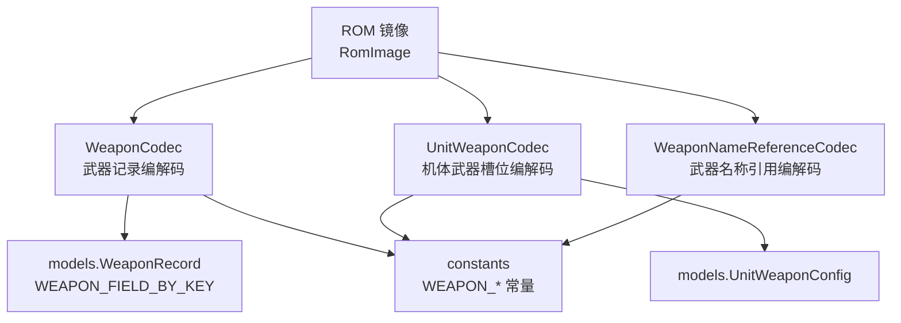
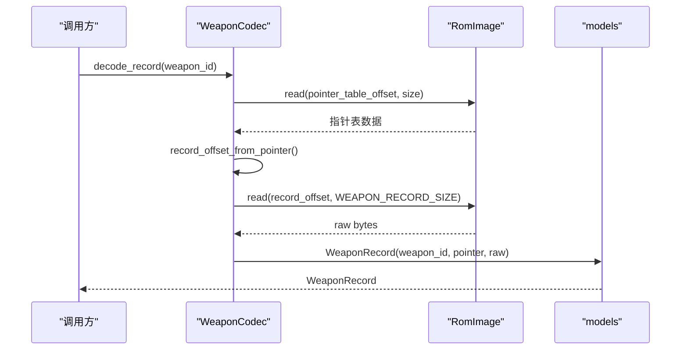
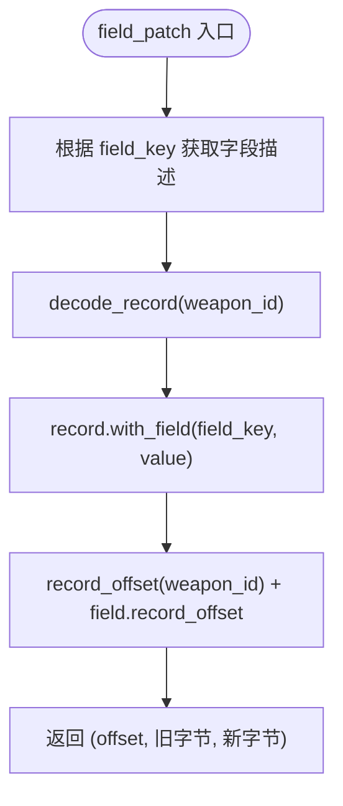
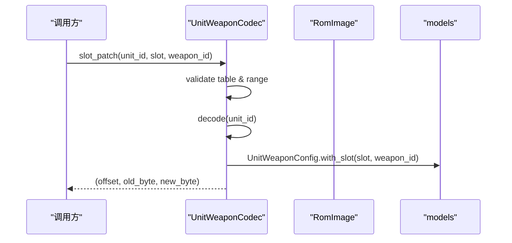
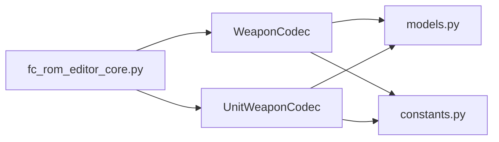

# 武器编解码器 (WeaponCodec)

<cite>
**本文引用的文件**
- [src/fc_editor/codecs/weapon.py](file://src/fc_editor/codecs/weapon.py)
- [src/fc_editor/codecs/unit_weapon.py](file://src/fc_editor/codecs/unit_weapon.py)
- [src/fc_editor/codecs/weapon_name.py](file://src/fc_editor/codecs/weapon_name.py)
- [src/fc_editor/models.py](file://src/fc_editor/models.py)
- [src/fc_editor/constants.py](file://src/fc_editor/constants.py)
- [src/fc_rom_editor_core.py](file://src/fc_rom_editor_core.py)
</cite>

## 目录
1. [简介](#简介)
2. [项目结构](#项目结构)
3. [核心组件](#核心组件)
4. [架构总览](#架构总览)
5. [详细组件分析](#详细组件分析)
6. [依赖关系分析](#依赖关系分析)
7. [性能与平衡性建议](#性能与平衡性建议)
8. [故障排查指南](#故障排查指南)
9. [结论](#结论)
10. [附录：API 参考与示例](#附录api-参考与示例)

## 简介
本文件为“武器编解码器”的权威 API 文档，聚焦 WeaponCodec 类及其在 ROM 数据中的武器记录读写、字段修改、以及武器与机体绑定配置。文档同时覆盖武器名称引用编解码器与机体武器槽位编解码器，帮助你在机体编辑器中正确配置武器绑定，并提供批量更新、平衡性检查与性能优化建议。

## 项目结构
武器相关能力由以下模块协作完成：
- 武器记录编解码：WeaponCodec（读取/写入武器指针表与武器记录）
- 机体武器槽位编解码：UnitWeaponCodec（每个机体两个直接武器 ID 槽位）
- 武器名称引用编解码：WeaponNameReferenceCodec（复用已有本地化名称记录）
- 数据模型与常量：models.py（WeaponRecord、WeaponFieldSpec、UnitWeaponConfig）、constants.py（偏移、大小、计数等）
- 上层集成：fc_rom_editor_core.py（将编解码器装配到 ROM 编辑器核心）

图表来源
- [src/fc_editor/codecs/weapon.py:13-89](file://src/fc_editor/codecs/weapon.py#L13-L89)
- [src/fc_editor/codecs/unit_weapon.py:11-79](file://src/fc_editor/codecs/unit_weapon.py#L11-L79)
- [src/fc_editor/codecs/weapon_name.py:9-120](file://src/fc_editor/codecs/weapon_name.py#L9-L120)
- [src/fc_editor/models.py:185-285](file://src/fc_editor/models.py#L185-L285)
- [src/fc_editor/constants.py:17-23](file://src/fc_editor/constants.py#L17-L23)

章节来源
- [src/fc_editor/codecs/weapon.py:13-89](file://src/fc_editor/codecs/weapon.py#L13-L89)
- [src/fc_editor/codecs/unit_weapon.py:11-79](file://src/fc_editor/codecs/unit_weapon.py#L11-L79)
- [src/fc_editor/codecs/weapon_name.py:9-120](file://src/fc_editor/codecs/weapon_name.py#L9-L120)
- [src/fc_editor/models.py:185-285](file://src/fc_editor/models.py#L185-L285)
- [src/fc_editor/constants.py:17-23](file://src/fc_editor/constants.py#L17-L23)

## 核心组件
- WeaponCodec：负责解析并校验武器指针表，定位武器记录，提供只读解码、字段级 patch、往返一致性校验。
- UnitWeaponCodec：负责解析并校验每机体的两个武器槽位，支持按槽位替换武器 ID。
- WeaponNameReferenceCodec：安全地复用已有武器名称记录，避免越界或破坏布局。
- models：定义 WeaponRecord、WeaponFieldSpec、UnitWeaponConfig 及字段元信息（键名、范围、掩码、位移、偏差等）。
- constants：定义武器/机体/名称表的偏移、容量、记录大小等关键常量。

章节来源
- [src/fc_editor/codecs/weapon.py:13-89](file://src/fc_editor/codecs/weapon.py#L13-L89)
- [src/fc_editor/codecs/unit_weapon.py:11-79](file://src/fc_editor/codecs/unit_weapon.py#L11-L79)
- [src/fc_editor/codecs/weapon_name.py:9-120](file://src/fc_editor/codecs/weapon_name.py#L9-L120)
- [src/fc_editor/models.py:185-285](file://src/fc_editor/models.py#L185-L285)
- [src/fc_editor/constants.py:17-23](file://src/fc_editor/constants.py#L17-L23)

## 架构总览
武器数据在 ROM 中以“指针表 + 记录区”组织：
- 武器指针表：固定长度数组，首项为哨兵，后续每项指向一条武器记录。
- 武器记录：固定大小（6 字节），包含射程、命中、对空/陆/海攻击值等。
- 机体武器槽位：每个机体两条直接武器 ID，位于独立表中。
- 武器名称：通过名称指针表引用已存在的本地化文本记录。

图表来源
- [src/fc_editor/codecs/weapon.py:20-66](file://src/fc_editor/codecs/weapon.py#L20-L66)
- [src/fc_editor/models.py:185-202](file://src/fc_editor/models.py#L185-L202)

## 详细组件分析

### WeaponCodec：武器记录编解码
- 职责
  - 初始化时读取并校验武器指针表，计算每条记录的 ROM 偏移。
  - 提供 decode_record 获取 WeaponRecord；encode_record 用于回写原始字节。
  - field_patch 针对单个字段进行原地 patch，返回偏移、原值与新值。
  - round_trip_record 验证编解码一致性。
- 关键点
  - 指针表首项必须为哨兵，否则抛出格式错误。
  - 记录偏移需落在受支持区域且不超过 ROM 大小。
  - 字段修改基于 FieldSpec 的掩码、位移、偏差处理，保证数值范围合法。

图表来源
- [src/fc_editor/codecs/weapon.py:72-85](file://src/fc_editor/codecs/weapon.py#L72-L85)
- [src/fc_editor/models.py:197-202](file://src/fc_editor/models.py#L197-L202)

章节来源
- [src/fc_editor/codecs/weapon.py:13-89](file://src/fc_editor/codecs/weapon.py#L13-L89)
- [src/fc_editor/models.py:185-202](file://src/fc_editor/models.py#L185-L202)

### UnitWeaponCodec：机体武器槽位编解码
- 职责
  - 校验机体武器配置表是否完整且所有武器 ID 有效。
  - decode 读取某机体的两个武器槽位，返回 UnitWeaponConfig。
  - slot_patch 按槽位替换武器 ID，返回偏移与新旧字节对比。
- 关键点
  - 每个机体固定两个槽位，索引 0/1。
  - 武器 ID 必须在当前 ROM 武器数量范围内。

图表来源
- [src/fc_editor/codecs/unit_weapon.py:30-79](file://src/fc_editor/codecs/unit_weapon.py#L30-L79)
- [src/fc_editor/models.py:288-306](file://src/fc_editor/models.py#L288-L306)

章节来源
- [src/fc_editor/codecs/unit_weapon.py:11-79](file://src/fc_editor/codecs/unit_weapon.py#L11-L79)
- [src/fc_editor/models.py:288-306](file://src/fc_editor/models.py#L288-L306)

### WeaponNameReferenceCodec：武器名称引用编解码
- 职责
  - 校验名称指针表完整性与范围，建立指针到武器 ID 的映射。
  - 提供 pointer、pointer_to_file_offset、record_bytes 读取名称记录。
  - reference_patch 将某武器的名称指针替换为另一武器已有的名称记录，确保不越界。
- 关键点
  - 仅允许引用已存在且处于受保护区域的名称记录。
  - 容量计算基于相邻指针边界，防止覆盖。

章节来源
- [src/fc_editor/codecs/weapon_name.py:9-120](file://src/fc_editor/codecs/weapon_name.py#L9-L120)

### 数据模型与常量
- WeaponRecord：封装武器 ID、指针与原始字节，提供 get/with_field。
- WeaponFieldSpec：定义字段键、标签、偏移、范围、掩码、位移、偏差、证据等级等。
- UnitWeaponConfig：封装机体 ID 与两个武器槽位的武器 ID。
- 常量：武器指针表偏移、武器数量、记录大小、机体武器表偏移与槽位数等。

章节来源
- [src/fc_editor/models.py:185-285](file://src/fc_editor/models.py#L185-L285)
- [src/fc_editor/constants.py:17-23](file://src/fc_editor/constants.py#L17-L23)

## 依赖关系分析
- WeaponCodec 依赖 RomImage、常量、错误类型与模型（WeaponRecord、WEAPON_FIELD_BY_KEY）。
- UnitWeaponCodec 依赖 RomImage、常量与模型（UnitWeaponConfig）。
- WeaponNameReferenceCodec 依赖 RomImage 与错误类型。
- 上层 fc_rom_editor_core.py 将上述编解码器实例化并暴露给编辑器功能。

图表来源
- [src/fc_rom_editor_core.py:32-33](file://src/fc_rom_editor_core.py#L32-L33)
- [src/fc_rom_editor_core.py:511-524](file://src/fc_rom_editor_core.py#L511-L524)
- [src/fc_editor/codecs/weapon.py:1-10](file://src/fc_editor/codecs/weapon.py#L1-L10)
- [src/fc_editor/codecs/unit_weapon.py:1-8](file://src/fc_editor/codecs/unit_weapon.py#L1-L8)

章节来源
- [src/fc_rom_editor_core.py:32-33](file://src/fc_rom_editor_core.py#L32-L33)
- [src/fc_rom_editor_core.py:511-524](file://src/fc_rom_editor_core.py#L511-L524)

## 性能与平衡性建议
- 批量更新策略
  - 使用 field_patch 或 slot_patch 进行最小化写入，减少内存拷贝与校验次数。
  - 对大量武器字段更新，先构建变更列表，再顺序应用，便于事务回滚与审计。
- 校验与容错
  - 每次写入前进行范围校验（字段最小/最大值、武器 ID 范围、槽位合法性）。
  - 使用 round_trip_record 与 round_trip 验证编解码一致性，尽早发现损坏。
- 平衡性检查
  - 命中（hit）与攻击值（power_air/land/sea）应结合射程（max_range）评估强度。
  - 对空/陆/海三态攻击值差异过大可能导致场景不平衡，建议设置合理上限与差值约束。
  - 近程修正代码（候选字段）可能影响命中率曲线，需谨慎调整。
- 性能优化
  - 避免重复读取同一块数据；缓存指针表与记录偏移。
  - 对只读路径优先使用 decode_record，仅在需要修改时使用 with_field/patch。
  - 名称引用复用可减少冗余文本占用，降低 ROM 膨胀风险。

[本节为通用指导，无需特定文件来源]

## 故障排查指南
- 常见错误
  - 武器指针表起始标记不正确：检查指针表首项是否为哨兵。
  - 记录指针无效或超出支持区域：核对 PRG Bank、窗口基址与记录大小。
  - 武器记录不完整：确认读取长度等于 WEAPON_RECORD_SIZE。
  - 机体武器配置不完整或引用无效武器：检查单位武器表长度与武器 ID 范围。
  - 武器名称指针越界：确保名称指针位于已验证数据区内。
- 定位步骤
  - 打印 weapon_id、pointer、record_offset、ROM 大小与表边界。
  - 使用 round_trip 方法快速判断编解码是否可逆。
  - 对字段修改前后输出旧/新字节，比对预期掩码与位移结果。

章节来源
- [src/fc_editor/codecs/weapon.py:20-66](file://src/fc_editor/codecs/weapon.py#L20-L66)
- [src/fc_editor/codecs/unit_weapon.py:37-58](file://src/fc_editor/codecs/unit_weapon.py#L37-L58)
- [src/fc_editor/codecs/weapon_name.py:15-38](file://src/fc_editor/codecs/weapon_name.py#L15-L38)

## 结论
WeaponCodec 提供了对武器记录的无损、只读解码与精确字段级补丁能力，配合 UnitWeaponCodec 与 WeaponNameReferenceCodec，可在 ROM 级别安全地管理武器数据与名称引用。通过严格的范围校验、掩码/位移/偏差处理与往返一致性验证，能够保障武器数据的完整性与平衡性。建议在批量编辑时采用事务化流程，并结合平衡性检查规则，确保修改后的武器体系稳定可用。

[本节为总结性内容，无需特定文件来源]

## 附录：API 参考与示例

### 数据结构与字段定义
- 武器记录（6 字节）
  - 最大射程（低半字节 + 1，掩码 0x0F，偏差 +1）
  - 命中（直接进入战斗命中率计算）
  - 对空攻击 / 对陆攻击 / 对海攻击（分别在不同目标地形/状态下使用）
  - 候选字段：攻击类型标志（高半字节）、近程修正代码（低半字节选择命中修正表）
- 机体武器配置（每机体 2 个槽位）
  - 槽位 0/1：直接武器 ID
- 武器名称引用
  - 通过名称指针表复用已有本地化记录，避免越界与重复

章节来源
- [src/fc_editor/models.py:245-285](file://src/fc_editor/models.py#L245-L285)
- [src/fc_editor/models.py:288-306](file://src/fc_editor/models.py#L288-L306)
- [src/fc_editor/constants.py:17-23](file://src/fc_editor/constants.py#L17-L23)

### 核心 API 与方法
- WeaponCodec
  - decode_record(weapon_id, data=None) -> WeaponRecord
  - encode_record(record) -> bytes
  - field_patch(data, weapon_id, field_key, value) -> (offset, old_byte, new_byte)
  - round_trip_record(weapon_id) -> bool
- UnitWeaponCodec
  - decode(unit_id, data=None) -> UnitWeaponConfig
  - slot_patch(data, unit_id, slot, weapon_id) -> (offset, old_byte, new_byte)
  - encode(config) -> bytes
- WeaponNameReferenceCodec
  - pointer(weapon_id, data=None) -> int
  - pointer_to_file_offset(pointer) -> int
  - record_bytes(weapon_id, data=None) -> bytes
  - reference_patch(data, weapon_id, source_name_id) -> (offset, before, after)

章节来源
- [src/fc_editor/codecs/weapon.py:55-89](file://src/fc_editor/codecs/weapon.py#L55-L89)
- [src/fc_editor/codecs/unit_weapon.py:50-79](file://src/fc_editor/codecs/unit_weapon.py#L50-L79)
- [src/fc_editor/codecs/weapon_name.py:66-119](file://src/fc_editor/codecs/weapon_name.py#L66-L119)

### 使用示例（以路径引用代替具体代码）
- 创建新武器（概念流程）
  - 分配新的武器 ID，确保未与现有武器冲突。
  - 在武器指针表中写入新记录的指针（需满足对齐与范围要求）。
  - 写入 6 字节武器记录（射程、命中、对空/陆/海攻击值等）。
  - 可选：通过 WeaponNameReferenceCodec.reference_patch 关联名称记录。
  - 参考路径：[src/fc_editor/codecs/weapon.py:20-66](file://src/fc_editor/codecs/weapon.py#L20-L66), [src/fc_editor/codecs/weapon_name.py:98-112](file://src/fc_editor/codecs/weapon_name.py#L98-L112)
- 修改武器属性
  - 使用 WeaponCodec.field_patch 对命中、攻击值等字段进行单字节补丁。
  - 参考路径：[src/fc_editor/codecs/weapon.py:72-85](file://src/fc_editor/codecs/weapon.py#L72-L85), [src/fc_editor/models.py:224-242](file://src/fc_editor/models.py#L224-L242)
- 批量更新武器数据
  - 遍历武器 ID 列表，收集 field_patch 或 slot_patch 的偏移与新旧字节。
  - 一次性应用到 ROM 数据，最后用 round_trip_record 验证一致性。
  - 参考路径：[src/fc_editor/codecs/weapon.py:87-89](file://src/fc_editor/codecs/weapon.py#L87-L89), [src/fc_editor/codecs/unit_weapon.py:64-79](file://src/fc_editor/codecs/unit_weapon.py#L64-L79)
- 在机体编辑器中配置武器绑定
  - 使用 UnitWeaponCodec.slot_patch 将武器 ID 写入机体武器槽位 0/1。
  - 校验武器 ID 在当前 ROM 武器数量范围内。
  - 参考路径：[src/fc_editor/codecs/unit_weapon.py:30-79](file://src/fc_editor/codecs/unit_weapon.py#L30-L79)

[本节为操作指引，具体实现细节请参考对应文件路径]