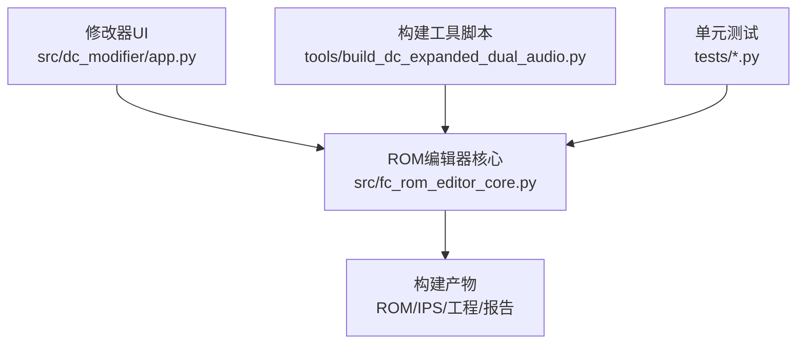
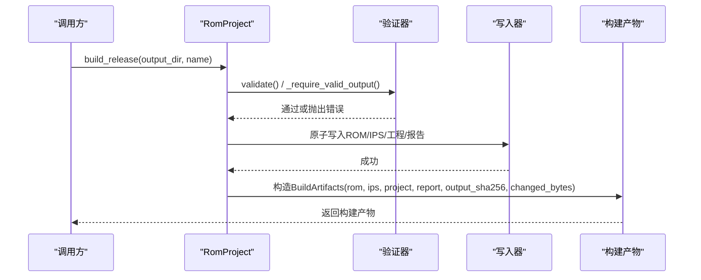
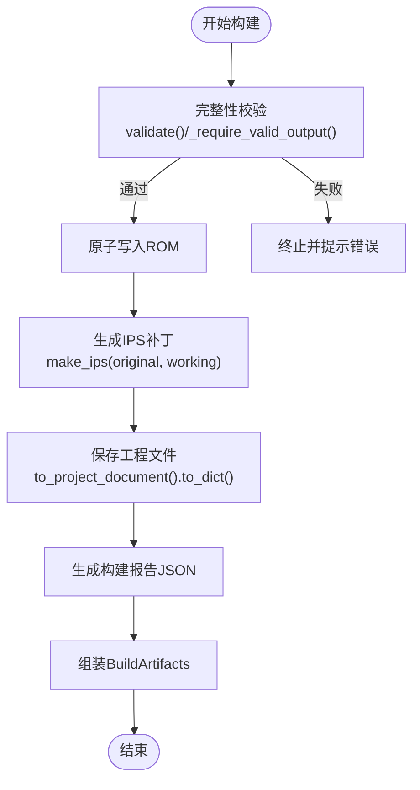
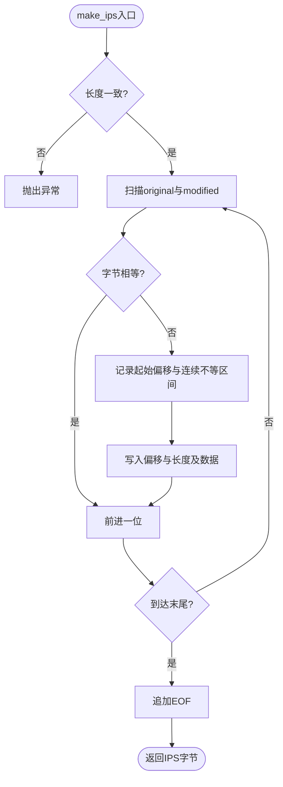
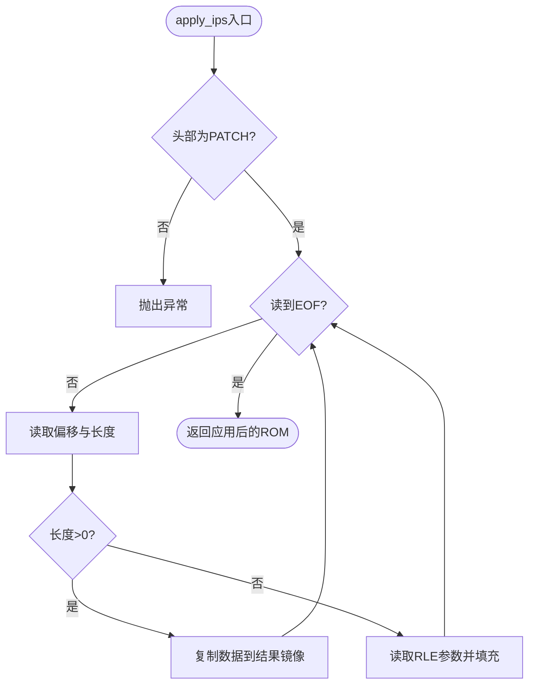
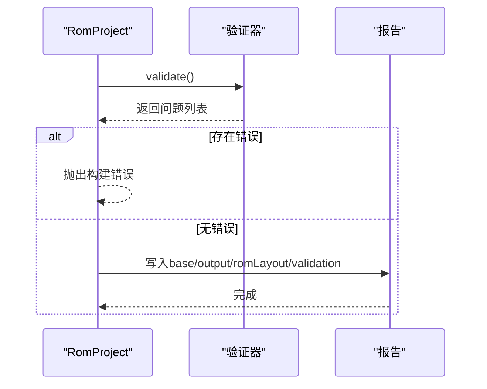
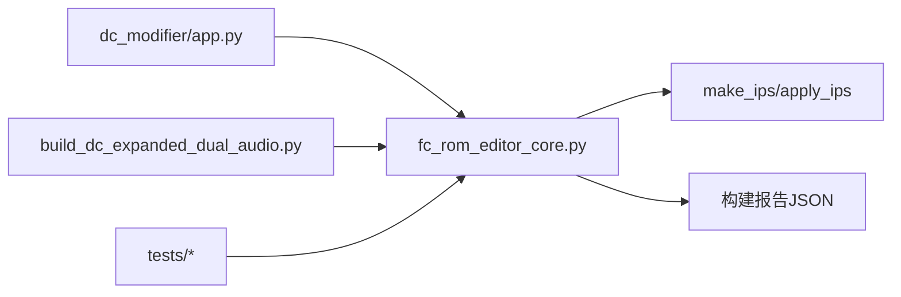

# 构建输出管理

<cite>
**本文引用的文件**
- [fc_rom_editor_core.py](file://src/fc_rom_editor_core.py)
- [app.py](file://src/dc_modifier/app.py)
- [build_dc_expanded_dual_audio.py](file://tools/build_dc_expanded_dual_audio.py)
- [test_dc_modifier.py](file://tests/test_dc_modifier.py)
- [test_expansion_integration.py](file://tests/test_expansion_integration.py)
</cite>

## 目录
1. [简介](#简介)
2. [项目结构](#项目结构)
3. [核心组件](#核心组件)
4. [架构总览](#架构总览)
5. [详细组件分析](#详细组件分析)
6. [依赖关系分析](#依赖关系分析)
7. [性能考虑](#性能考虑)
8. [故障排查指南](#故障排查指南)
9. [结论](#结论)
10. [附录：完整构建示例](#附录完整构建示例)

## 简介
本文件面向“构建输出管理”的API与流程，聚焦以下目标：
- 解释 BuildArtifacts 数据类的各字段含义与用途（rom、ips、project、report、output_sha256、changed_bytes）。
- 说明构建流程：ROM生成、IPS补丁创建、工程文件保存、构建报告生成。
- 记录 make_ips() 与 apply_ips() 的 IPS 格式处理逻辑。
- 阐述构建验证机制：SHA256校验、完整性检查、兼容性验证。
- 提供完整的构建示例，展示如何执行构建流程并处理构建产物。

## 项目结构
围绕构建输出的关键代码集中在 ROM 编辑器核心模块中，UI 层通过应用入口调用构建能力，工具脚本演示了从源码到产物的端到端流程，测试用例覆盖了 IPS 回环与构建产物一致性。

图表来源
- [app.py:965-979](file://src/dc_modifier/app.py#L965-L979)
- [fc_rom_editor_core.py:2815-2960](file://src/fc_rom_editor_core.py#L2815-L2960)

章节来源
- [fc_rom_editor_core.py:2815-2960](file://src/fc_rom_editor_core.py#L2815-L2960)
- [app.py:965-979](file://src/dc_modifier/app.py#L965-L979)
- [build_dc_expanded_dual_audio.py:18-27](file://tools/build_dc_expanded_dual_audio.py#L18-L27)

## 核心组件
- BuildArtifacts：封装一次构建的全部产出路径与元信息。
- RomProject.build_release()：一键构建入口，负责校验、写入ROM/IPS/工程/报告，并返回构建产物对象。
- make_ips()/apply_ips()：实现标准 IPS 补丁生成与应用的算法。
- 原子写入与备份：确保输出安全与可恢复性。

章节来源
- [fc_rom_editor_core.py:133-140](file://src/fc_rom_editor_core.py#L133-L140)
- [fc_rom_editor_core.py:385-433](file://src/fc_rom_editor_core.py#L385-L433)
- [fc_rom_editor_core.py:2815-2960](file://src/fc_rom_editor_core.py#L2815-L2960)

## 架构总览
构建流程由 UI 或工具触发，进入核心模块进行完整性校验后，依次生成 ROM、IPS、工程文件和构建报告，最后以不可变的数据类汇总产物。

图表来源
- [fc_rom_editor_core.py:2645-2658](file://src/fc_rom_editor_core.py#L2645-L2658)
- [fc_rom_editor_core.py:2815-2960](file://src/fc_rom_editor_core.py#L2815-L2960)

## 详细组件分析

### BuildArtifacts 数据类
- rom：生成的 NES ROM 文件路径。
- ips：基于原始ROM与输出ROM生成的 IPS 补丁文件路径。
- project：可复用的工程文件路径（.dcmod），用于后续增量编辑。
- report：构建报告 JSON 路径，包含基础ROM信息、输出信息、变更范围、资源分配与验证结果等。
- output_sha256：输出ROM的 SHA256 哈希值（大写十六进制字符串），用于版本与完整性校验。
- changed_bytes：本次构建相对于基准ROM发生变化的字节总数，便于快速评估改动规模。

章节来源
- [fc_rom_editor_core.py:133-140](file://src/fc_rom_editor_core.py#L133-L140)
- [fc_rom_editor_core.py:2815-2960](file://src/fc_rom_editor_core.py#L2815-L2960)

### 构建流程：ROM生成、IPS补丁、工程保存、报告生成
- ROM生成：将工作内存中的 ROM 镜像原子写入目标 .nes 文件。
- IPS补丁：使用 make_ips() 计算原始ROM与工作ROM的差异，生成 .ips 文件。
- 工程保存：将当前工程的语义化差异（字段替换、指针重定向、资源分配等）序列化到 .dcmod。
- 报告生成：写入 .build-report.json，包含 toolVersion、base、output、changedBytes、changedRanges、romLayout、validation 等字段。

图表来源
- [fc_rom_editor_core.py:2645-2658](file://src/fc_rom_editor_core.py#L2645-L2658)
- [fc_rom_editor_core.py:2815-2960](file://src/fc_rom_editor_core.py#L2815-L2960)

章节来源
- [fc_rom_editor_core.py:2815-2960](file://src/fc_rom_editor_core.py#L2815-L2960)

### IPS 格式处理逻辑：make_ips() 与 apply_ips()
- make_ips(original, modified)
  - 要求 original 与 modified 长度一致。
  - 扫描两个镜像，跳过相等区域，对不相等的连续块记录起始偏移与数据长度，追加至 PATCH 头。
  - 以 EOF 结尾，形成标准 IPS 补丁。
- apply_ips(original, patch)
  - 校验补丁头部为 “PATCH”。
  - 逐条读取记录：若长度为0则解析 RLE（重复次数+填充字节），否则直接复制数据到对应偏移。
  - 遇到 EOF 停止，返回应用后的 ROM 镜像。

图表来源
- [fc_rom_editor_core.py:385-407](file://src/fc_rom_editor_core.py#L385-L407)

图表来源
- [fc_rom_editor_core.py:409-433](file://src/fc_rom_editor_core.py#L409-L433)

章节来源
- [fc_rom_editor_core.py:385-433](file://src/fc_rom_editor_core.py#L385-L433)

### 构建验证机制：SHA256校验、完整性检查、兼容性验证
- SHA256校验：对输出ROM计算 SHA256 并写入报告；测试中可通过 apply_ips(original, ips) 还原得到相同 ROM 以验证一致性。
- 完整性检查：构建前调用 validate()，若存在 severity 为 error 的问题则中止构建，避免生成无效产物。
- 兼容性验证：构建报告包含 base.profile.key、mapper、size 等信息；同时记录受保护区域与自由区域的布局，便于下游工具判断兼容性与风险。

图表来源
- [fc_rom_editor_core.py:2645-2658](file://src/fc_rom_editor_core.py#L2645-L2658)
- [fc_rom_editor_core.py:2870-2941](file://src/fc_rom_editor_core.py#L2870-L2941)

章节来源
- [fc_rom_editor_core.py:2645-2658](file://src/fc_rom_editor_core.py#L2645-L2658)
- [fc_rom_editor_core.py:2870-2941](file://src/fc_rom_editor_core.py#L2870-L2941)
- [test_dc_modifier.py:547-549](file://tests/test_dc_modifier.py#L547-L549)

## 依赖关系分析
- UI 层（app.py）通过调用 RomProject.build_release() 触发构建。
- 工具脚本（build_dc_expanded_dual_audio.py）演示了从汇编到注入再到 IPS 应用的全流程，并复用 apply_ips() 进行验证。
- 测试用例覆盖 IPS 回环与构建产物一致性，确保 make_ips/apply_ips 的正确性。

图表来源
- [app.py:965-979](file://src/dc_modifier/app.py#L965-L979)
- [build_dc_expanded_dual_audio.py:18-27](file://tools/build_dc_expanded_dual_audio.py#L18-L27)
- [fc_rom_editor_core.py:385-433](file://src/fc_rom_editor_core.py#L385-L433)

章节来源
- [app.py:965-979](file://src/dc_modifier/app.py#L965-L979)
- [build_dc_expanded_dual_audio.py:18-27](file://tools/build_dc_expanded_dual_audio.py#L18-L27)
- [fc_rom_editor_core.py:385-433](file://src/fc_rom_editor_core.py#L385-L433)

## 性能考虑
- 变更检测优化：变更行计算按 4096 字节块进行原生比较，仅在块不相等时逐字节扫描，降低大镜像比对开销。
- 原子写入：所有输出采用临时文件 + fsync + replace 的方式，避免部分写入导致的损坏。
- 报告聚合：变更范围合并为连续区间，减少报告体积并提升可读性。

章节来源
- [fc_rom_editor_core.py:2614-2643](file://src/fc_rom_editor_core.py#L2614-L2643)
- [fc_rom_editor_core.py:436-460](file://src/fc_rom_editor_core.py#L436-L460)
- [fc_rom_editor_core.py:2832-2851](file://src/fc_rom_editor_core.py#L2832-L2851)

## 故障排查指南
- 构建名称非法：名称不能为空且不能包含路径分隔符。
- 覆盖保护：禁止覆盖当前载入的基准 ROM。
- 完整性检查失败：构建前会执行 validate()，若存在错误级别问题将中止构建并列出具体模块与消息。
- IPS 头不合法：apply_ips() 要求补丁以 “PATCH” 开头，否则抛出异常。
- 只读参考目录：输出路径不得指向只读参考根目录，防止误写。

章节来源
- [fc_rom_editor_core.py:2815-2827](file://src/fc_rom_editor_core.py#L2815-L2827)
- [fc_rom_editor_core.py:2645-2658](file://src/fc_rom_editor_core.py#L2645-L2658)
- [fc_rom_editor_core.py:409-413](file://src/fc_rom_editor_core.py#L409-L413)
- [fc_rom_editor_core.py:626-636](file://src/fc_rom_editor_core.py#L626-L636)

## 结论
该构建输出管理体系通过严格的完整性校验、安全的原子写入与标准化的 IPS 补丁机制，确保了构建产物的可靠性与可追溯性。BuildArtifacts 集中封装了全部产物与关键元信息，配合构建报告与工程文件，为后续迭代、分发与验证提供了坚实基础。

## 附录：完整构建示例
以下为典型构建与验证步骤（概念性流程，不涉及具体代码片段）：
- 在 UI 中打开工程并修改内容后，点击“一键构建”，指定输出目录与名称。
- 系统执行完整性校验，通过后生成 ROM、IPS、工程文件与构建报告。
- 使用 apply_ips() 将 IPS 应用于原始 ROM，应与构建出的 ROM 完全一致（可用于回归测试）。
- 读取构建报告中的 output_sha256 与 changed_bytes，确认版本与改动规模。
- 如需继续编辑，加载生成的 .dcmod 工程文件进行增量修改。

章节来源
- [app.py:965-979](file://src/dc_modifier/app.py#L965-L979)
- [fc_rom_editor_core.py:2815-2960](file://src/fc_rom_editor_core.py#L2815-L2960)
- [test_dc_modifier.py:547-549](file://tests/test_dc_modifier.py#L547-L549)
- [test_expansion_integration.py:280-303](file://tests/test_expansion_integration.py#L280-L303)
- [build_dc_expanded_dual_audio.py:706-706](file://tools/build_dc_expanded_dual_audio.py#L706-L706)