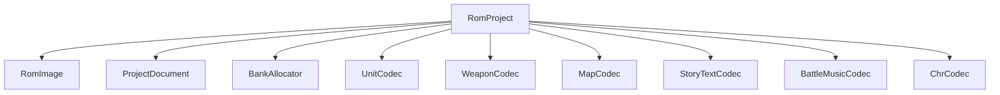
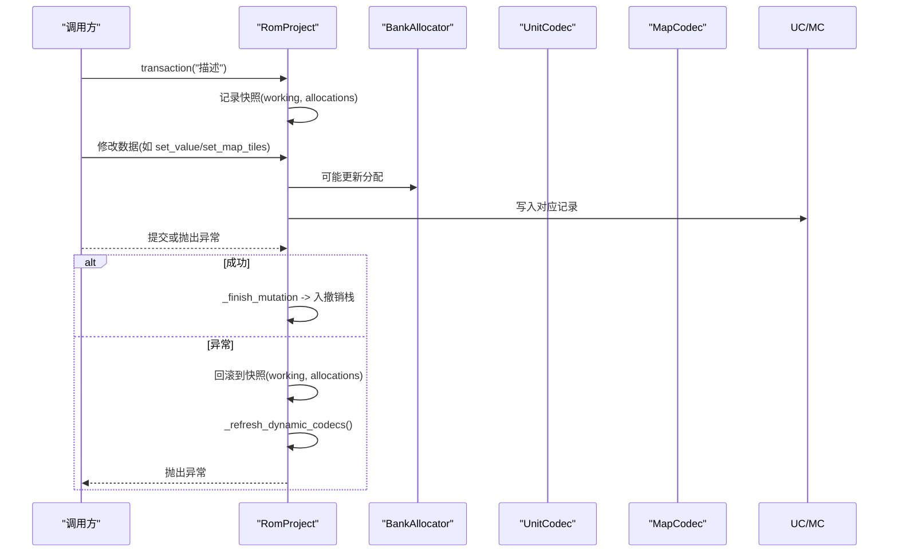
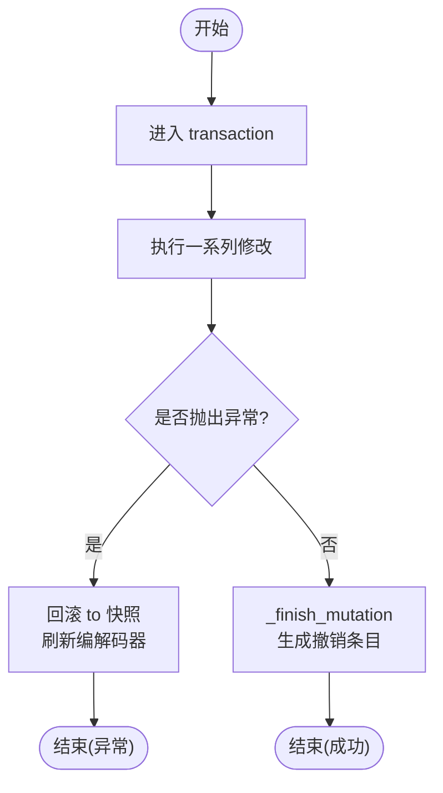
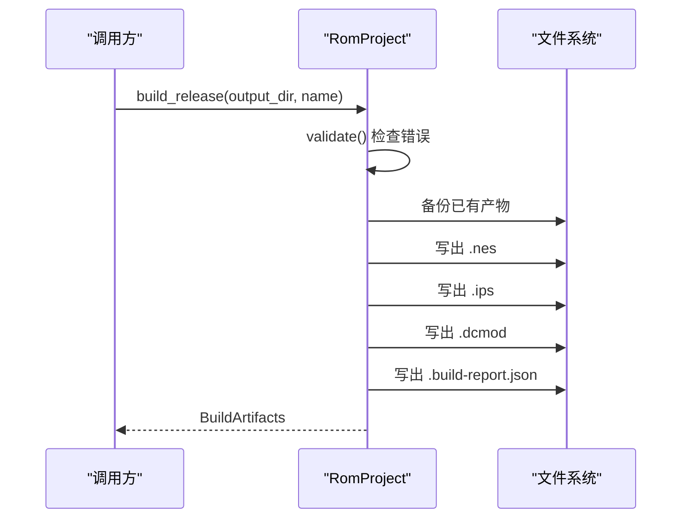
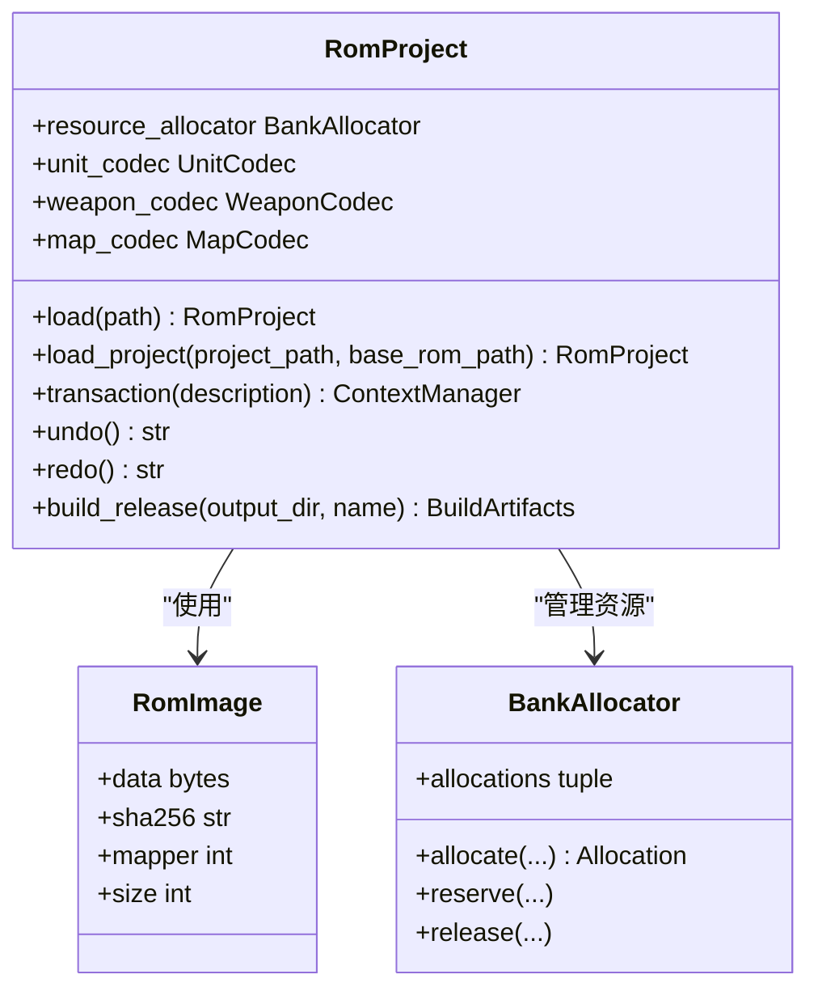

# 核心API

<cite>
**本文引用的文件**
- [src/fc_rom_editor_core.py](file://src/fc_rom_editor_core.py)
- [src/fc_editor/project.py](file://src/fc_editor/project.py)
- [src/fc_editor/rom_image.py](file://src/fc_editor/rom_image.py)
- [src/dc_modifier/rom_data_browser.py](file://src/dc_modifier/rom_data_browser.py)
</cite>

## 目录
1. [简介](#简介)
2. [项目结构](#项目结构)
3. [核心组件](#核心组件)
4. [架构总览](#架构总览)
5. [详细组件分析](#详细组件分析)
6. [依赖关系分析](#依赖关系分析)
7. [性能考量](#性能考量)
8. [故障排查指南](#故障排查指南)
9. [结论](#结论)
10. [附录：RomProject 完整接口参考](#附录romproject-完整接口参考)

## 简介
本文件聚焦 RomProject 类的核心 API，围绕以下能力进行系统化说明：
- 项目加载：load、load_project
- ROM 镜像管理：working/original、资源分配器 resource_allocator
- 事务与撤销重做：transaction、undo、redo
- 数据访问编解码器：unit_codec、weapon_codec、map_codec 等
- 构建输出：build_release（返回 BuildArtifacts）
文档提供方法参数、返回值类型、异常处理与使用示例路径，帮助开发者快速集成与排错。

## 项目结构
RomProject 位于 fc_rom_editor_core.py，负责封装 ROM 工作镜像、扩展容量规划、各类数据编解码器以及构建产物输出。其关键依赖包括：
- RomImage：ROM 校验、元信息、只读读取
- ProjectDocument：工程文件读写与操作重放
- 各 Codec：机体、武器、地图、剧情文本、战斗音乐等
- BankAllocator：资源分配与配额保护

图表来源
- [src/fc_rom_editor_core.py:463-618](file://src/fc_rom_editor_core.py#L463-L618)
- [src/fc_editor/rom_image.py:50-125](file://src/fc_editor/rom_image.py#L50-L125)
- [src/fc_editor/project.py:48-121](file://src/fc_editor/project.py#L48-L121)

章节来源
- [src/fc_rom_editor_core.py:463-618](file://src/fc_rom_editor_core.py#L463-L618)
- [src/fc_editor/rom_image.py:50-125](file://src/fc_editor/rom_image.py#L50-L125)
- [src/fc_editor/project.py:48-121](file://src/fc_editor/project.py#L48-L121)

## 核心组件
- RomProject：ROM 编辑的核心入口，维护 working 镜像、资源分配、动态编解码器绑定、事务与撤销重做、构建产物输出。
- RomImage：不可变 ROM 字节容器，提供校验、Mapper、SHA-256、安全读取。
- ProjectDocument：持久化工程操作，支持材料化（materialize）到 ROM 镜像。
- 编解码器族：UnitCodec、WeaponCodec、MapCodec、StoryTextCodec、BattleMusicCodec、ChrCodec 等，按 ROM Profile 动态启用。
- BankAllocator：为扩展资源分配 PRG Bank，并预留自动分区与保护区域。

章节来源
- [src/fc_rom_editor_core.py:463-618](file://src/fc_rom_editor_core.py#L463-L618)
- [src/fc_editor/rom_image.py:50-125](file://src/fc_editor/rom_image.py#L50-L125)
- [src/fc_editor/project.py:48-121](file://src/fc_editor/project.py#L48-L121)

## 架构总览
RomProject 在构造时根据 ROM 的 ExpansionPlan 决定是否启用扩展模式，并据此切换不同的编解码器实例（base_* 与当前 *）。所有写操作通过 transaction 包裹，最终由 _finish_mutation 生成撤销栈条目；undo/redo 基于 EditPatch 与 Allocation 快照恢复。

图表来源
- [src/fc_rom_editor_core.py:714-785](file://src/fc_rom_editor_core.py#L714-L785)
- [src/fc_rom_editor_core.py:836-933](file://src/fc_rom_editor_core.py#L836-L933)

## 详细组件分析

### 项目加载
- load(path)
  - 作用：从路径读取 ROM 字节并创建 RomProject。
  - 参数：path（str|Path）
  - 返回：RomProject
  - 异常：底层文件读取异常会向上抛出。
  - 示例路径：[src/fc_rom_editor_core.py:638-641](file://src/fc_rom_editor_core.py#L638-L641)

- load_project(project_path, base_rom_path)
  - 作用：加载工程文件并应用到基础 ROM，重建资源分配与动态编解码器，执行完整性检查。
  - 参数：project_path（str|Path），base_rom_path（str|Path）
  - 返回：RomProject
  - 异常：
    - ProjectFormatError：工程格式错误、完整性检查失败、自动分区冲突等。
  - 示例路径：[src/fc_rom_editor_core.py:643-674](file://src/fc_rom_editor_core.py#L643-L674)

章节来源
- [src/fc_rom_editor_core.py:638-674](file://src/fc_rom_editor_core.py#L638-L674)
- [src/fc_editor/project.py:60-121](file://src/fc_editor/project.py#L60-L121)

### ROM 镜像管理与资源分配
- working / original
  - working：可写的 ROM 镜像副本，所有修改在此进行。
  - original：原始基准 ROM 字节，用于差异计算与还原。
  - 示例路径：[src/fc_rom_editor_core.py:463-469](file://src/fc_rom_editor_core.py#L463-L469)

- resource_allocator
  - 作用：管理扩展资源的分配、保留与释放；支持自动分区与保护区域。
  - 关键属性：allocations、used、available、capacity。
  - 示例路径：[src/fc_rom_editor_core.py:612-618](file://src/fc_rom_editor_core.py#L612-L618), [src/fc_rom_editor_core.py:1176-1189](file://src/fc_rom_editor_core.py#L1176-L1189)

- import_expansion_resource(resource_id, label, payload, alignment=0x10, single_bank=None)
  - 作用：导入二进制资源到空闲区，写入 working。
  - 参数：resource_id（str）、label（str）、payload（bytes）、alignment（int）、single_bank（bool|None）
  - 返回：Allocation
  - 异常：ValueError（ID/标签/长度非法、保留前缀冲突等）。
  - 示例路径：[src/fc_rom_editor_core.py:1440-1472](file://src/fc_rom_editor_core.py#L1440-L1472)

- remove_expansion_resource(resource_id)
  - 作用：清空并释放指定资源区域。
  - 参数：resource_id（str）
  - 返回：Allocation
  - 异常：ValueError（内部分区不可删除）。
  - 示例路径：[src/fc_rom_editor_core.py:1474-1484](file://src/fc_rom_editor_core.py#L1474-L1484)

章节来源
- [src/fc_rom_editor_core.py:463-469](file://src/fc_rom_editor_core.py#L463-L469)
- [src/fc_rom_editor_core.py:1176-1189](file://src/fc_rom_editor_core.py#L1176-L1189)
- [src/fc_rom_editor_core.py:1440-1484](file://src/fc_rom_editor_core.py#L1440-L1484)

### 事务处理机制（transaction、undo、redo）
- transaction(description)
  - 作用：开启原子事务，异常时自动回滚 working 与 resource_allocator，并刷新动态编解码器。
  - 参数：description（str）
  - 返回：上下文管理器
  - 异常：内部捕获并在最外层回滚后重新抛出。
  - 示例路径：[src/fc_rom_editor_core.py:714-744](file://src/fc_rom_editor_core.py#L714-L744)

- undo() / redo()
  - 作用：基于 EditHistoryEntry 的 patches 与 Allocation 快照进行状态回退/重做。
  - 返回：操作描述字符串
  - 异常：ValueError（无可用操作）。
  - 示例路径：[src/fc_rom_editor_core.py:761-785](file://src/fc_rom_editor_core.py#L761-L785)

- can_undo / can_redo / undo_description / redo_description
  - 作用：查询撤销/重做可用性及其描述。
  - 示例路径：[src/fc_rom_editor_core.py:745-759](file://src/fc_rom_editor_core.py#L745-L759)

图表来源
- [src/fc_rom_editor_core.py:714-744](file://src/fc_rom_editor_core.py#L714-L744)
- [src/fc_rom_editor_core.py:692-713](file://src/fc_rom_editor_core.py#L692-L713)

章节来源
- [src/fc_rom_editor_core.py:692-785](file://src/fc_rom_editor_core.py#L692-L785)

### 数据访问接口（编解码器）
- 机体编解码器 unit_codec
  - 作用：读取/写入机体记录、名称指针、名称引用、字段级修改。
  - 常用方法：record_bytes、get_value、set_value、reset_record、unit_name_* 系列。
  - 示例路径：[src/fc_rom_editor_core.py:1628-1673](file://src/fc_rom_editor_core.py#L1628-L1673), [src/fc_rom_editor_core.py:2000-2142](file://src/fc_rom_editor_core.py#L2000-L2142)

- 武器编解码器 weapon_codec
  - 作用：读取/写入武器记录、名称指针与引用、字段级修改。
  - 常用方法：weapon_record_bytes、get_weapon_value、set_weapon_value、reset_weapon_record、weapon_name_* 系列。
  - 示例路径：[src/fc_rom_editor_core.py:1675-1714](file://src/fc_rom_editor_core.py#L1675-L1714), [src/fc_rom_editor_core.py:1716-1965](file://src/fc_rom_editor_core.py#L1716-L1965)

- 地图编解码器 map_codec
  - 作用：读取/写入地图地形、部署布局、事件触发器。
  - 常用方法：get_map、set_map_tiles、reset_map、get_scenario_layout、set_scenario_layout、get_map_triggers、set_map_triggers。
  - 示例路径：[src/fc_rom_editor_core.py:2144-2351](file://src/fc_rom_editor_core.py#L2144-L2351)

- 其他编解码器
  - story_text_codec：剧情文本组读取/替换/扩容。
  - battle_music_codec：战斗音乐绑定读取/设置。
  - chr_codec：CHR 图块像素读取/批量写入。
  - 示例路径：[src/fc_rom_editor_core.py:2429-2548](file://src/fc_rom_editor_core.py#L2429-L2548), [src/fc_rom_editor_core.py:2550-2590](file://src/fc_rom_editor_core.py#L2550-L2590), [src/fc_rom_editor_core.py:1506-1564](file://src/fc_rom_editor_core.py#L1506-L1564)

章节来源
- [src/fc_rom_editor_core.py:1506-1564](file://src/fc_rom_editor_core.py#L1506-L1564)
- [src/fc_rom_editor_core.py:1628-1714](file://src/fc_rom_editor_core.py#L1628-L1714)
- [src/fc_rom_editor_core.py:1716-1965](file://src/fc_rom_editor_core.py#L1716-L1965)
- [src/fc_rom_editor_core.py:2144-2351](file://src/fc_rom_editor_core.py#L2144-L2351)
- [src/fc_rom_editor_core.py:2429-2590](file://src/fc_rom_editor_core.py#L2429-L2590)

### 构建输出（build_release）
- build_release(output_dir, name)
  - 作用：一键构建发布产物，包含 NES ROM、IPS 补丁、工程文件与构建报告。
  - 参数：output_dir（str|Path），name（str）
  - 返回：BuildArtifacts（包含 rom、ips、project、report、output_sha256、changed_bytes）
  - 异常：
    - ValueError：名称非法、覆盖当前基准 ROM、完整性检查失败等。
  - 示例路径：[src/fc_rom_editor_core.py:2815-2960](file://src/fc_rom_editor_core.py#L2815-L2960)

图表来源
- [src/fc_rom_editor_core.py:2815-2960](file://src/fc_rom_editor_core.py#L2815-L2960)

章节来源
- [src/fc_rom_editor_core.py:2815-2960](file://src/fc_rom_editor_core.py#L2815-L2960)

## 依赖关系分析
- RomProject 依赖 RomImage 获取 ROM 元信息与只读数据。
- 编解码器根据 ROM Profile 与 ExpansionPlan 动态绑定，确保对扩展模式的兼容。
- BankAllocator 负责资源分配与保护，避免自动分区被覆盖。
- ProjectDocument 用于工程文件的持久化与重放。

图表来源
- [src/fc_rom_editor_core.py:463-618](file://src/fc_rom_editor_core.py#L463-L618)
- [src/fc_editor/rom_image.py:50-125](file://src/fc_editor/rom_image.py#L50-L125)

章节来源
- [src/fc_rom_editor_core.py:463-618](file://src/fc_rom_editor_core.py#L463-L618)
- [src/fc_editor/rom_image.py:50-125](file://src/fc_editor/rom_image.py#L50-L125)

## 性能考量
- 变更检测采用分块比较（4096 字节块）以减少全量扫描开销。
- 事务内最小化快照粒度，仅在事务边界记录完整快照。
- 构建阶段仅收集必要差异行与范围，降低报告生成成本。
- 资源分配尽量单 Bank 放置小资源，减少碎片。

章节来源
- [src/fc_rom_editor_core.py:2614-2643](file://src/fc_rom_editor_core.py#L2614-L2643)
- [src/fc_rom_editor_core.py:2832-2851](file://src/fc_rom_editor_core.py#L2832-L2851)

## 故障排查指南
- 常见异常与定位
  - ProjectFormatError：工程文件格式错误或完整性检查失败。查看 load_project 与 materialize 流程。
  - RomFormatError：ROM 头无效、大小不匹配、Mapper 不一致、缺少已验证表等。
  - ValueError：参数非法（如资源 ID 前缀、名称为空、超出范围等）。
- 调试建议
  - 使用 change_rows/change_ranges 定位差异区域。
  - 使用 change_description 将偏移映射到语义描述（如“机体 X · 名称指针”）。
  - 在 transaction 中包裹高风险操作，便于异常回滚。
- 示例路径
  - 完整性检查与错误聚合：[src/fc_rom_editor_core.py:2645-2658](file://src/fc_rom_editor_core.py#L2645-L2658)
  - 差异行与范围：[src/fc_rom_editor_core.py:2614-2643](file://src/fc_rom_editor_core.py#L2614-L2643)
  - 偏移语义描述：[src/fc_rom_editor_core.py:2660-2784](file://src/fc_rom_editor_core.py#L2660-L2784)

章节来源
- [src/fc_rom_editor_core.py:2614-2784](file://src/fc_rom_editor_core.py#L2614-L2784)
- [src/fc_rom_editor_core.py:2645-2658](file://src/fc_rom_editor_core.py#L2645-L2658)

## 结论
RomProject 提供了完整的 ROM 编辑与构建能力，涵盖项目加载、资源分配、事务与撤销重做、多类数据编解码器访问以及一键构建输出。通过严格的校验与差异追踪，确保修改的可追溯性与安全性。开发者可基于本 API 实现稳定的 ROM 修改流水线。

## 附录：RomProject 完整接口参考
以下为 RomProject 的关键接口摘要（含参数、返回、异常与示例路径）：

- 项目加载
  - load(path)
    - 参数：path（str|Path）
    - 返回：RomProject
    - 异常：IO 异常
    - 示例路径：[src/fc_rom_editor_core.py:638-641](file://src/fc_rom_editor_core.py#L638-L641)
  - load_project(project_path, base_rom_path)
    - 参数：project_path（str|Path），base_rom_path（str|Path）
    - 返回：RomProject
    - 异常：ProjectFormatError
    - 示例路径：[src/fc_rom_editor_core.py:643-674](file://src/fc_rom_editor_core.py#L643-L674)

- 事务与历史
  - transaction(description)
    - 参数：description（str）
    - 返回：ContextManager
    - 异常：内部回滚后抛出
    - 示例路径：[src/fc_rom_editor_core.py:714-744](file://src/fc_rom_editor_core.py#L714-L744)
  - undo() / redo()
    - 返回：str（描述）
    - 异常：ValueError（无可用操作）
    - 示例路径：[src/fc_rom_editor_core.py:761-785](file://src/fc_rom_editor_core.py#L761-L785)

- 资源分配
  - import_expansion_resource(resource_id, label, payload, alignment=0x10, single_bank=None)
    - 返回：Allocation
    - 异常：ValueError
    - 示例路径：[src/fc_rom_editor_core.py:1440-1472](file://src/fc_rom_editor_core.py#L1440-L1472)
  - remove_expansion_resource(resource_id)
    - 返回：Allocation
    - 异常：ValueError
    - 示例路径：[src/fc_rom_editor_core.py:1474-1484](file://src/fc_rom_editor_core.py#L1474-L1484)

- 数据访问（节选）
  - 机体：get_value/set_value/reset_record/unit_name_*
    - 示例路径：[src/fc_rom_editor_core.py:1628-1673](file://src/fc_rom_editor_core.py#L1628-L1673), [src/fc_rom_editor_core.py:2000-2142](file://src/fc_rom_editor_core.py#L2000-L2142)
  - 武器：get_weapon_value/set_weapon_value/reset_weapon_record/weapon_name_*
    - 示例路径：[src/fc_rom_editor_core.py:1675-1714](file://src/fc_rom_editor_core.py#L1675-L1714), [src/fc_rom_editor_core.py:1716-1965](file://src/fc_rom_editor_core.py#L1716-L1965)
  - 地图：get_map/set_map_tiles/reset_map/get_scenario_layout/set_scenario_layout/get_map_triggers/set_map_triggers
    - 示例路径：[src/fc_rom_editor_core.py:2144-2351](file://src/fc_rom_editor_core.py#L2144-L2351)
  - 剧情文本：get_story_text/set_story_text_raw/reset_story_text
    - 示例路径：[src/fc_rom_editor_core.py:2429-2548](file://src/fc_rom_editor_core.py#L2429-L2548)
  - 战斗音乐：get_battle_music_binding/set_battle_music_binding/reset_battle_music_binding
    - 示例路径：[src/fc_rom_editor_core.py:2550-2590](file://src/fc_rom_editor_core.py#L2550-L2590)
  - CHR：chr_tile_pixels/set_chr_tile_pixels/set_chr_range/reset_chr_range
    - 示例路径：[src/fc_rom_editor_core.py:1506-1564](file://src/fc_rom_editor_core.py#L1506-L1564)

- 构建输出
  - build_release(output_dir, name)
    - 返回：BuildArtifacts
    - 异常：ValueError（名称/覆盖/完整性检查失败）
    - 示例路径：[src/fc_rom_editor_core.py:2815-2960](file://src/fc_rom_editor_core.py#L2815-L2960)

- 辅助与诊断
  - change_rows()/change_ranges()/change_description()
    - 示例路径：[src/fc_rom_editor_core.py:2614-2784](file://src/fc_rom_editor_core.py#L2614-L2784)
  - validate()
    - 示例路径：[src/fc_rom_editor_core.py:2645-2658](file://src/fc_rom_editor_core.py#L2645-L2658)

章节来源
- [src/fc_rom_editor_core.py:638-674](file://src/fc_rom_editor_core.py#L638-L674)
- [src/fc_rom_editor_core.py:714-785](file://src/fc_rom_editor_core.py#L714-L785)
- [src/fc_rom_editor_core.py:1440-1484](file://src/fc_rom_editor_core.py#L1440-L1484)
- [src/fc_rom_editor_core.py:1506-1564](file://src/fc_rom_editor_core.py#L1506-L1564)
- [src/fc_rom_editor_core.py:1628-1714](file://src/fc_rom_editor_core.py#L1628-L1714)
- [src/fc_rom_editor_core.py:1716-1965](file://src/fc_rom_editor_core.py#L1716-L1965)
- [src/fc_rom_editor_core.py:2144-2351](file://src/fc_rom_editor_core.py#L2144-L2351)
- [src/fc_rom_editor_core.py:2429-2590](file://src/fc_rom_editor_core.py#L2429-L2590)
- [src/fc_rom_editor_core.py:2614-2784](file://src/fc_rom_editor_core.py#L2614-L2784)
- [src/fc_rom_editor_core.py:2815-2960](file://src/fc_rom_editor_core.py#L2815-L2960)