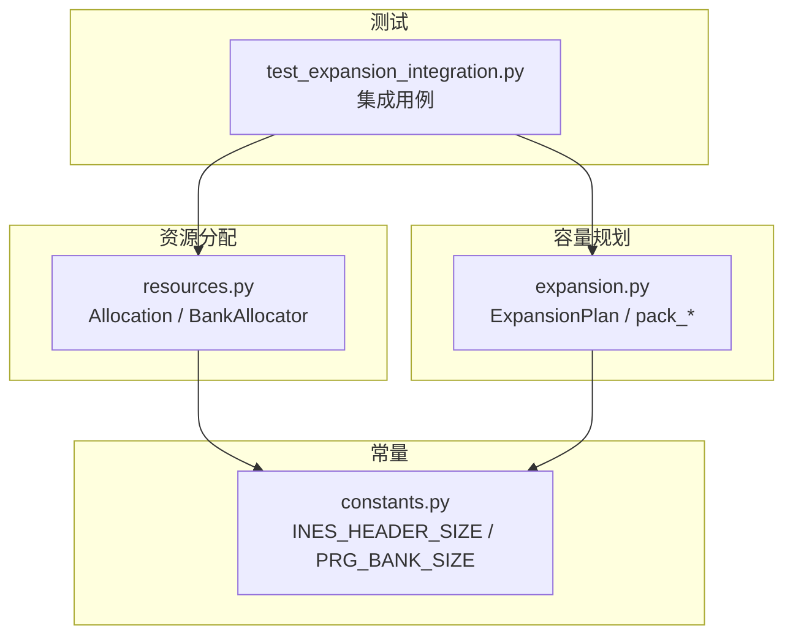
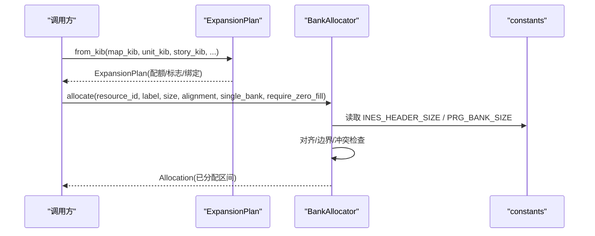
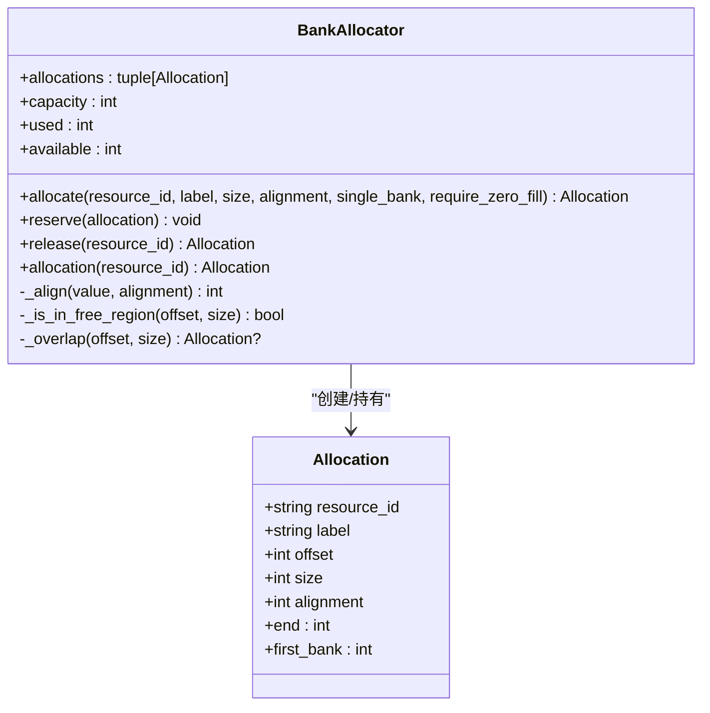
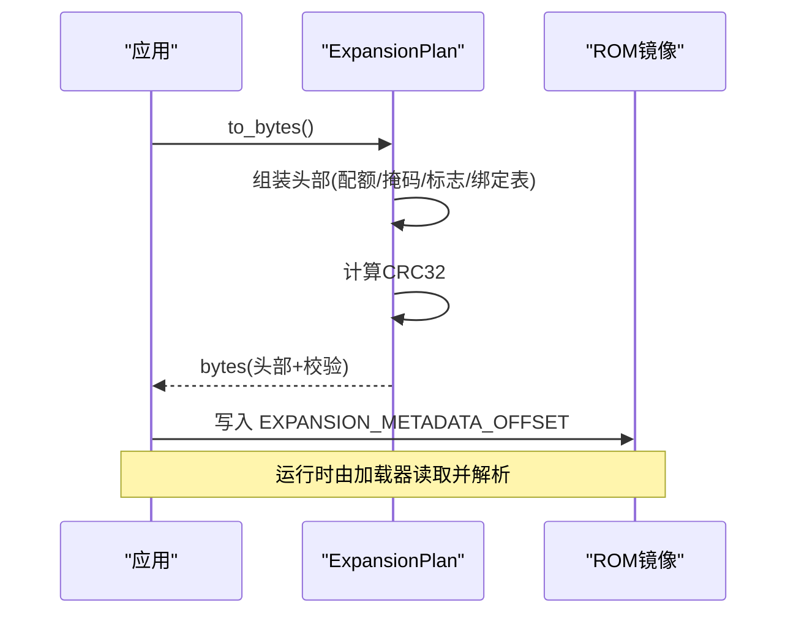
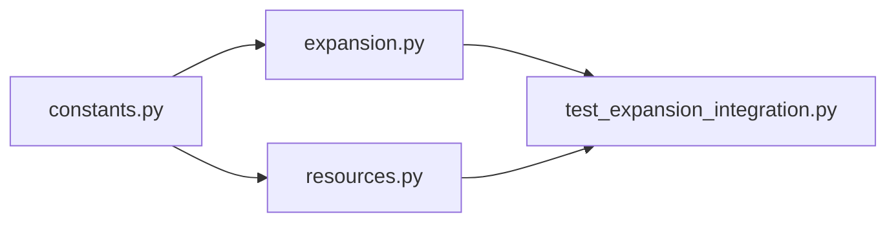

# 资源分配管理

<cite>
**本文引用的文件**
- [resources.py](file://src/fc_editor/resources.py)
- [expansion.py](file://src/fc_editor/expansion.py)
- [constants.py](file://src/fc_editor/constants.py)
- [test_expansion_integration.py](file://tests/test_expansion_integration.py)
</cite>

## 目录
1. [简介](#简介)
2. [项目结构](#项目结构)
3. [核心组件](#核心组件)
4. [架构总览](#架构总览)
5. [详细组件分析](#详细组件分析)
6. [依赖关系分析](#依赖关系分析)
7. [性能考虑](#性能考虑)
8. [故障排查指南](#故障排查指南)
9. [结论](#结论)
10. [附录：使用示例与最佳实践](#附录使用示例与最佳实践)

## 简介
本文件面向资源分配与容量规划，系统性说明以下能力：
- BankAllocator：基于“首适配”的确定性 PRG Bank 分配器，提供 allocations 属性、allocate() 分配、release() 释放等接口。
- ExpansionPlan：对 464 KiB 可管理池进行确定性的非重叠划分，支持 from_bytes()/to_bytes() 序列化、flags 标志位管理、剧情组 bank 绑定策略。
- 冲突检测、内存对齐、Bank 边界检查机制。
- 最佳实践与性能优化建议。
- 实际使用示例（来自测试），展示如何进行资源分配与容量规划。

## 项目结构
与资源分配相关的核心代码位于 fc_editor 包中：
- resources.py：定义 Allocation 数据类与 BankAllocator 分配器。
- expansion.py：定义 ExpansionPlan 容量规划、标志位、序列化/反序列化、以及地图/机体/剧情打包工具。
- constants.py：定义 iNES 头大小、PRG Bank 大小、CPU 地址基址等常量。
- tests/test_expansion_integration.py：端到端集成测试，演示配置扩展容量、校验分配、构建产物等行为。

图表来源
- [resources.py:263-413](file://src/fc_editor/resources.py#L263-L413)
- [expansion.py:84-318](file://src/fc_editor/expansion.py#L84-L318)
- [constants.py:1-69](file://src/fc_editor/constants.py#L1-L69)
- [test_expansion_integration.py:25-73](file://tests/test_expansion_integration.py#L25-L73)

章节来源
- [resources.py:263-413](file://src/fc_editor/resources.py#L263-L413)
- [expansion.py:84-318](file://src/fc_editor/expansion.py#L84-L318)
- [constants.py:1-69](file://src/fc_editor/constants.py#L1-L69)
- [test_expansion_integration.py:25-73](file://tests/test_expansion_integration.py#L25-L73)

## 核心组件
- Allocation：不可变的数据类，描述一个已分配的命名资源及其物理字节范围、对齐要求。
- BankAllocator：基于 RomProfile 声明的“空闲 PRG 区域”，实现确定性首适配分配，支持保留、查询、释放与自动分配。
- ExpansionPlan：将 464 KiB 可管理池划分为地图、机体、剧情三类配额；支持序列化到 ROM 元数据区，并维护 flags 与剧情组 bank 绑定表。

章节来源
- [resources.py:263-413](file://src/fc_editor/resources.py#L263-L413)
- [expansion.py:84-318](file://src/fc_editor/expansion.py#L84-L318)

## 架构总览
下图展示了从容量规划到具体资源分配的协作关系：
- ExpansionPlan 负责宏观配额与序列化。
- BankAllocator 在 Profile 提供的“空闲 PRG 区域”内进行微观分配，保证对齐、不越界、无冲突。
- 两者均依赖 constants 中的 INES_HEADER_SIZE 与 PRG_BANK_SIZE 计算物理偏移。

图表来源
- [expansion.py:130-175](file://src/fc_editor/expansion.py#L130-L175)
- [resources.py:368-412](file://src/fc_editor/resources.py#L368-L412)
- [constants.py:8-10](file://src/fc_editor/constants.py#L8-L10)

## 详细组件分析

### BankAllocator 类
职责
- 在 Profile 声明的空闲 PRG 区域内进行确定性首适配分配。
- 提供 allocations 属性获取当前分配状态（按 offset 排序）。
- 提供 allocate() 自动分配新资源、reserve() 预保留已有 Allocation、release() 释放指定资源。

关键属性与方法
- allocations：返回按起始偏移排序的 Allocation 元组，便于可视化与审计。
- capacity/used/available：统计可用容量、已用容量与剩余容量。
- allocate(resource_id, label, size, *, alignment=1, single_bank=True, require_zero_fill=True)：
  - 参数含义：
    - resource_id：资源唯一标识（小写字母数字及有限符号，长度限制）。
    - label：人类可读名称。
    - size：申请字节数（必须 > 0）。
    - alignment：对齐值（必须是 2 的幂）。
    - single_bank：是否限制为单 Bank 内连续。
    - require_zero_fill：若为真，则跳过已被非零填充的区域。
  - 行为：
    - 遍历 Profile 的空闲 PRG 区域，按对齐调整游标。
    - 若开启 single_bank，确保分配不跨 Bank。
    - 检测与已有 Allocation 的重叠冲突。
    - 可选跳过非零填充区域。
    - 成功时创建 Allocation 并加入内部列表。
- reserve(allocation)：校验并保留一个外部构造的 Allocation（用于工程导入或恢复）。
- release(resource_id)：移除并返回对应 Allocation。
- allocation(resource_id)：查询某个资源的 Allocation。

冲突检测与边界检查
- 重叠检测：通过 _overlap(offset, size) 判断是否与已有分配区间相交。
- 边界检查：_is_in_free_region(offset, size) 确保分配完全落在 Profile 的空闲 PRG 区域内。
- 对齐检查：_align(value, alignment) 向上取整到对齐边界；allocate/reserve 强制起始位置满足对齐。

复杂度与性能
- 冲突检测为 O(n)，n 为当前分配数量。
- 分配过程按区域顺序扫描，遇到冲突或越界即推进游标；整体近似线性于空闲区域数量与分配密度。

异常与错误处理
- 非法 resource_id、空 label、size<=0、alignment 非 2 的幂、未对齐、不在空闲区域、与已有资源重叠、空间不足等都会抛出 ValueError。
- release/allocation 找不到资源时抛出 KeyError。

章节来源
- [resources.py:280-413](file://src/fc_editor/resources.py#L280-L413)

#### BankAllocator 类图

图表来源
- [resources.py:263-413](file://src/fc_editor/resources.py#L263-L413)

### ExpansionPlan 类
职责
- 对 464 KiB 可管理池进行确定性、非重叠的配额划分：地图、机体、剧情。
- 管理 flags 标志位与剧情组 bank 绑定表。
- 提供 to_bytes()/from_bytes() 序列化/反序列化，写入 ROM 元数据区并带 CRC 校验。

关键属性与方法
- map_bank_count/unit_bank_count/story_bank_count：三类配额（以 Bank 为单位）。
- total_bank_count/total_kib/unassigned_kib：总配额、总 KiB、未分配 KiB。
- map_banks/unit_banks/story_banks/unassigned_banks：各类 Bank 列表。
- story_pairs：剧情 Bank 成对映射（每段剧情占 16 KiB，两 Bank）。
- expanded_story_selectors：已启用搬移的剧情选择器集合。
- with_flags(flags)：生成新的计划副本，仅更新 flags。
- with_story_selector(selector)：为指定剧情组分配一对 Bank（如配额允许）。
- story_pair_for(selector)：查询某剧情组的 Bank 对。
- from_kib(map_kib, unit_kib, story_kib, *, story_group_mask=0, flags=0, story_bank_starts=None)：从 KiB 构建计划，自动推导 story_bank_starts。
- to_bytes()：将计划序列化为固定长度的元数据块（含 magic、version、配额、mask、flags、story_bank_starts 与 CRC）。
- from_bytes(data)：从 ROM 元数据区读取并校验，返回 ExpansionPlan 或 None。

标志位管理
- FLAG_MAPS/FLAG_UNITS/FLAG_SCENARIOS/FLAG_MAP_TRIGGERS：指示哪些子系统启用了扩展。
- flags 字段在 __post_init__ 中校验范围 0x00–0xFF。

容量与合法性约束
- 各配额必须在可用 Bank 范围内且总和不超过可用 Bank 总数。
- 机体配额仅支持 48/64/80 KiB（6/8/10 Bank）。
- 剧情配额必须是 16 KiB 的整数倍，且不超过最大验证过的剧情 Bank 上限。
- 剧情组位图与绑定表必须一致，且每个被选中的剧情组需有独立 Bank 对。

序列化细节
- 元数据位于 EXPANSION_METADATA_OFFSET，长度为 EXPANSION_METADATA_SIZE。
- 头部包含 magic、version、配额、mask、flags、保留字段、story_bank_starts 与尾部保留字段。
- 末尾附加 4 字节 CRC32，from_bytes 会严格校验版本与保留字段。

章节来源
- [expansion.py:84-318](file://src/fc_editor/expansion.py#L84-L318)

#### ExpansionPlan 序列化时序图

图表来源
- [expansion.py:277-318](file://src/fc_editor/expansion.py#L277-L318)

### 资源冲突检测、内存对齐与 Bank 边界检查
- 冲突检测：BankAllocator._overlap 基于区间相交判定，避免重复占用。
- 内存对齐：_align 向上取整至 alignment 的倍数；allocate/reserve 强制起始位置满足对齐。
- Bank 边界：当 single_bank=True 时，分配不得跨越 PRG Bank 边界；否则按连续空间分配。
- 区域边界：_is_in_free_region 确保分配完全位于 Profile 的空闲 PRG 区域内。
- 零填充检查：require_zero_fill=True 时跳过已被非零填充的区域，减少运行时初始化开销。

章节来源
- [resources.py:311-412](file://src/fc_editor/resources.py#L311-L412)

## 依赖关系分析
- BankAllocator 依赖 constants 中的 INES_HEADER_SIZE 与 PRG_BANK_SIZE 计算物理偏移。
- ExpansionPlan 同样依赖这些常量，并在元数据中记录配额与标志位。
- 测试用例通过 RomProject 暴露的 configure_expansion/import_expansion_resource 等方法，间接使用上述两类组件。

图表来源
- [constants.py:8-10](file://src/fc_editor/constants.py#L8-L10)
- [resources.py:280-413](file://src/fc_editor/resources.py#L280-L413)
- [expansion.py:84-318](file://src/fc_editor/expansion.py#L84-L318)
- [test_expansion_integration.py:25-73](file://tests/test_expansion_integration.py#L25-L73)

章节来源
- [constants.py:8-10](file://src/fc_editor/constants.py#L8-L10)
- [resources.py:280-413](file://src/fc_editor/resources.py#L280-L413)
- [expansion.py:84-318](file://src/fc_editor/expansion.py#L84-L318)
- [test_expansion_integration.py:25-73](file://tests/test_expansion_integration.py#L25-L73)

## 性能考虑
- 分配算法为“首适配”，冲突检测 O(n)，适合中等规模分配场景。
- 对齐与边界检查均为常数时间操作。
- require_zero_fill=True 会增加一次区域内容扫描，可能影响首次分配速度；若已知目标区域为零填充，可设为 False 以提升性能。
- 批量分配时，尽量按从小到大顺序申请，减少碎片化。
- 对于需要严格单 Bank 的资源，优先设置 single_bank=True，避免跨 Bank 带来的额外对齐与跳转成本。

## 故障排查指南
常见问题与定位要点
- 资源 ID 无效或重复：检查 resource_id 是否符合规则，并确保未重复分配。
- 对齐失败：确认 alignment 为 2 的幂，且起始地址满足对齐要求。
- 超出空闲区域：确认分配范围完全位于 Profile 的空闲 PRG 区域内。
- 与已有资源重叠：检查是否存在与其他 Allocation 的区间相交。
- 空间不足：增大配额或减少需求；必要时调整 single_bank 策略。
- 序列化校验失败：检查 ROM 元数据区是否被正确写入，magic/version/CRC 是否匹配。

章节来源
- [resources.py:334-412](file://src/fc_editor/resources.py#L334-L412)
- [expansion.py:294-318](file://src/fc_editor/expansion.py#L294-L318)

## 结论
BankAllocator 与 ExpansionPlan 共同构成了 FC 扩容 MMC3 项目的资源分配与容量规划核心：前者在 Profile 的空闲 PRG 区域中进行安全、确定性的微观分配；后者在 464 KiB 池上进行宏观配额划分与持久化。二者配合实现了严格的对齐、冲突检测与边界检查，并通过测试覆盖端到端流程，保障编辑与构建过程的稳定性与可重现性。

## 附录：使用示例与最佳实践

### 示例一：配置扩展容量并校验分配
- 通过 RomProject.configure_expansion(map_kib=304, unit_kib=48, story_kib=112) 配置推荐配额。
- 校验 expansion_plan.total_kib 与 unassigned_kib，确保配额填满且无冲突。
- 检查 expansion_allocations 中的分区资源是否互不重叠。

章节来源
- [test_expansion_integration.py:45-73](file://tests/test_expansion_integration.py#L45-L73)

### 示例二：导入自定义资源到未分配 Bank
- 使用 import_expansion_resource("test.unassigned", "测试未分配资源", payload) 将自定义资源分配到未分配的 Bank。
- 验证其 first_bank 属于 plan.unassigned_banks，且不与任何已有分配重叠。
- 在全量配额下尝试分配应失败，体现容量保护。

章节来源
- [test_expansion_integration.py:325-347](file://tests/test_expansion_integration.py#L325-L347)

### 示例三：序列化与反序列化容量表
- 调用 ExpansionPlan.to_bytes() 生成元数据块，写入 ROM 元数据区。
- 使用 ExpansionPlan.from_bytes(data) 读取并校验，确保 magic/version/CRC 有效。
- 通过 flags 控制地图/机体/剧情/触发器的启用状态。

章节来源
- [expansion.py:277-318](file://src/fc_editor/expansion.py#L277-L318)

### 最佳实践
- 始终使用 Alignment 对齐关键数据结构，提升访问效率与兼容性。
- 对需要严格单 Bank 的资源设置 single_bank=True，避免跨 Bank 带来的复杂性。
- 在大规模分配前，先评估 available 容量，避免频繁失败重试。
- 使用 require_zero_fill=False 仅在明确知道目标区域为零填充时，以减少扫描开销。
- 在构建发布前，运行完整性校验，确保所有扩展逻辑与数据一致。