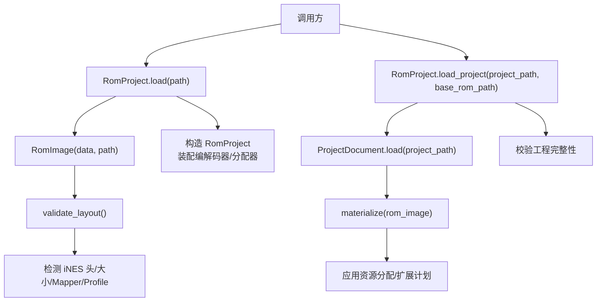
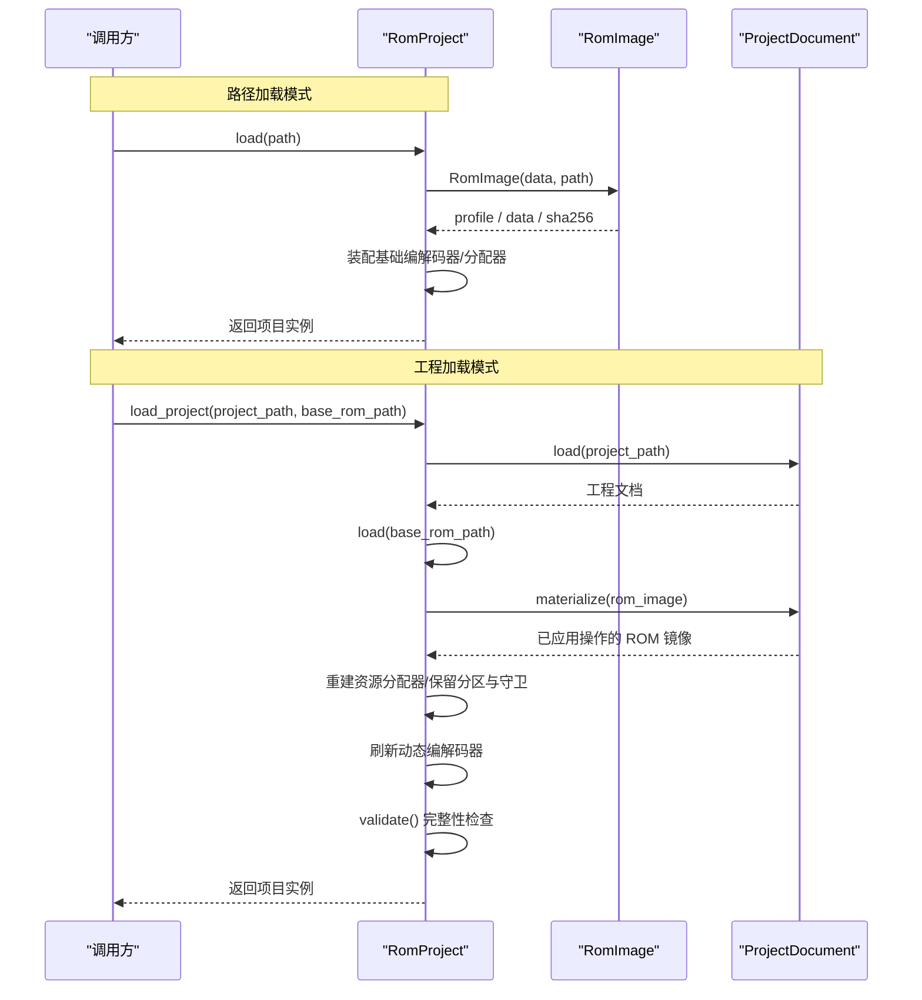
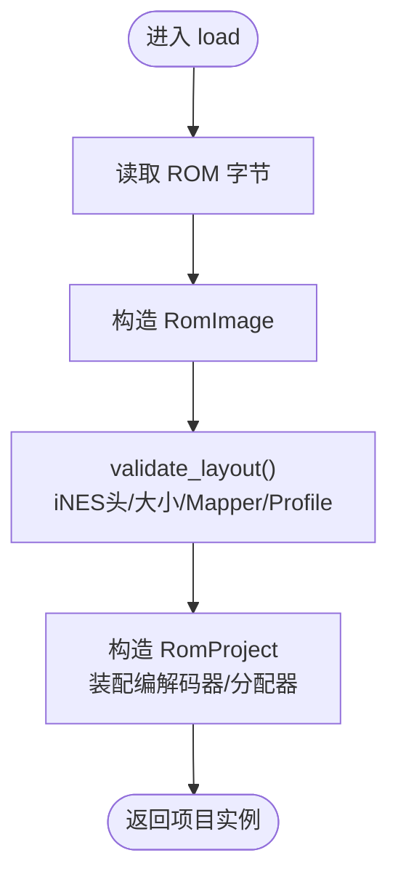
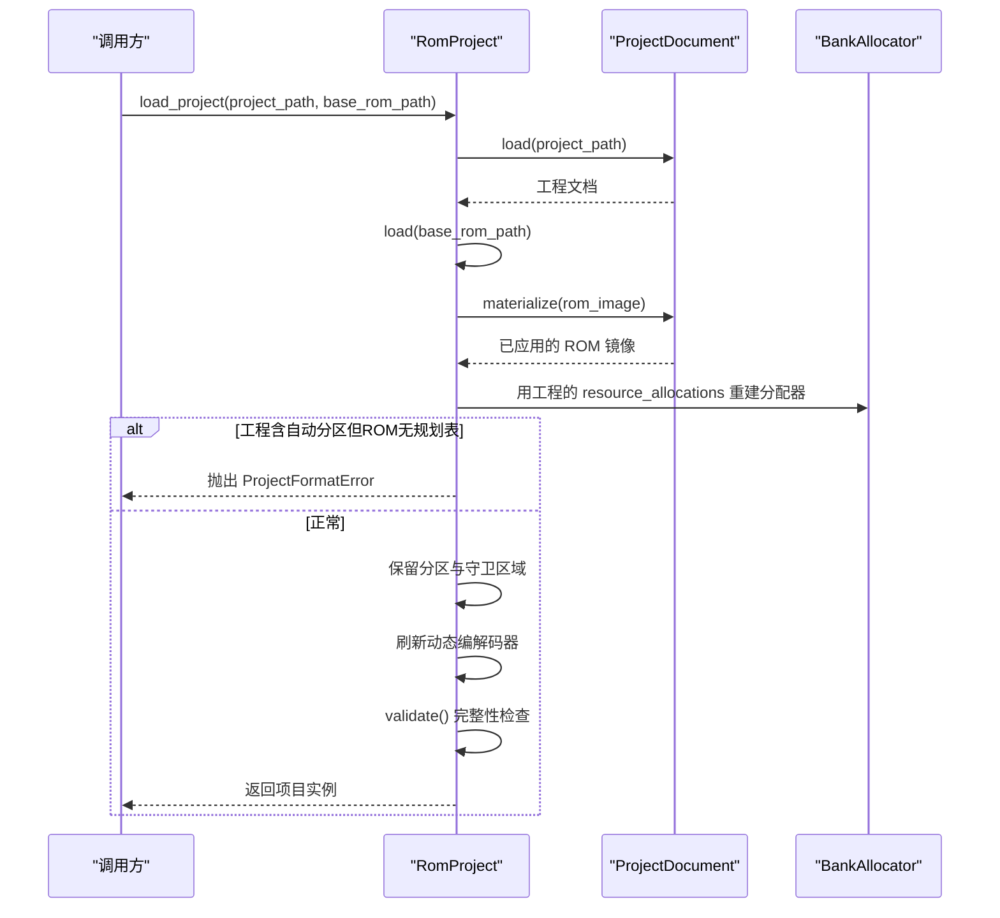
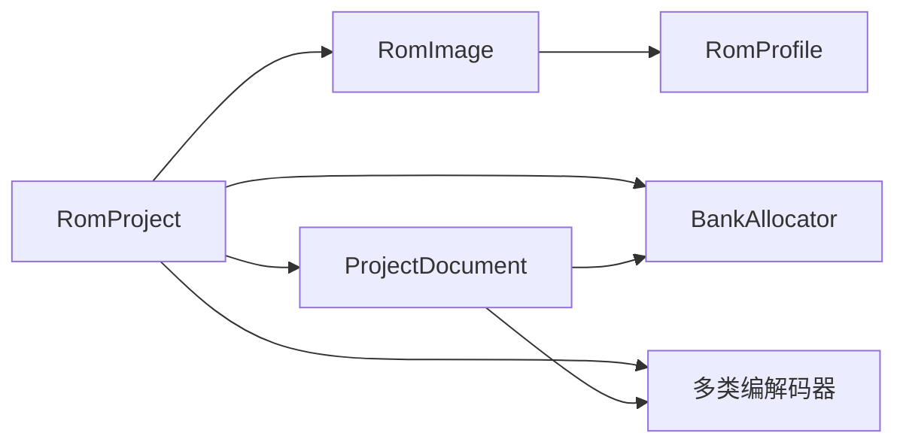

# 项目生命周期管理

<cite>
**本文引用的文件**
- [src/fc_rom_editor_core.py](file://src/fc_rom_editor_core.py)
- [src/fc_editor/rom_image.py](file://src/fc_editor/rom_image.py)
- [src/fc_editor/project.py](file://src/fc_editor/project.py)
- [src/fc_editor/errors.py](file://src/fc_editor/errors.py)
</cite>

## 目录
1. [简介](#简介)
2. [项目结构](#项目结构)
3. [核心组件](#核心组件)
4. [架构总览](#架构总览)
5. [详细组件分析](#详细组件分析)
6. [依赖关系分析](#依赖关系分析)
7. [性能考虑](#性能考虑)
8. [故障排查指南](#故障排查指南)
9. [结论](#结论)
10. [附录：使用示例与最佳实践](#附录使用示例与最佳实践)

## 简介
本文件聚焦于项目生命周期管理，围绕 RomProject 类的核心方法 load() 与 load_project()，系统说明从 ROM 镜像加载项目、从工程文件加载并应用资源分配的全过程。文档涵盖项目初始化、ROM 镜像验证、扩展计划解析、编解码器设置、异常处理机制（ProjectFormatError、RomFormatError），并提供完整的使用示例与错误处理最佳实践，帮助读者安全、可靠地构建和运行修改流程。

## 项目结构
本项目将“ROM 镜像校验”“工程文档解析”“项目实例化与编解码器装配”“资源分配与扩展计划”等职责分层组织：
- RomImage：负责 iNES ROM 的读取、布局校验、Mapper/SHA-256 识别与基准校验。
- ProjectDocument：负责工程文件的读写、版本迁移、操作序列解析与资源分配计算。
- RomProject：封装 ROM 工作镜像、初始/动态编解码器、资源分配器、事务与撤销重做栈，提供 load()/load_project() 入口。
- 错误类型：RomFormatError、ProjectFormatError、ChangeConflictError 用于区分 ROM 格式错误、工程格式错误与并发写入冲突。

图示来源
- [src/fc_rom_editor_core.py:638-674](file://src/fc_rom_editor_core.py#L638-L674)
- [src/fc_editor/rom_image.py:53-105](file://src/fc_editor/rom_image.py#L53-L105)
- [src/fc_editor/project.py:61-121](file://src/fc_editor/project.py#L61-L121)

章节来源
- [src/fc_rom_editor_core.py:463-674](file://src/fc_rom_editor_core.py#L463-L674)
- [src/fc_editor/rom_image.py:53-125](file://src/fc_editor/rom_image.py#L53-L125)
- [src/fc_editor/project.py:48-121](file://src/fc_editor/project.py#L48-L121)

## 核心组件
- RomProject
  - 作用：维护 ROM 的工作镜像、初始与动态编解码器、资源分配器、事务与撤销重做能力；提供 load() 与 load_project() 两个关键入口。
  - 关键点：
    - load()：读取 ROM 字节并构造 RomProject，内部完成 RomImage 校验与编解码器装配。
    - load_project()：加载工程文档，基于工程对 ROM 进行 materialize，重建资源分配器，必要时保留分区与守卫区域，刷新动态编解码器，执行完整性检查。
- RomImage
  - 作用：不可变 ROM 镜像，提供 SHA-256、Mapper、基准校验、范围安全的 read/read_bank。
  - 关键点：validate_layout() 严格校验 iNES 头、声明大小、Mapper 与 Profile 一致性。
- ProjectDocument
  - 作用：工程 JSON 的加载、迁移、保存与操作序列解析；resource_allocations() 计算资源分配；materialize() 将操作应用到 ROM 数据上。
  - 关键点：_validate_base() 确保工程与当前 ROM 基准一致；materialize() 中按序执行各类操作并生成补丁。

章节来源
- [src/fc_rom_editor_core.py:463-674](file://src/fc_rom_editor_core.py#L463-L674)
- [src/fc_editor/rom_image.py:53-125](file://src/fc_editor/rom_image.py#L53-L125)
- [src/fc_editor/project.py:48-121](file://src/fc_editor/project.py#L48-L121)

## 架构总览
下图展示从 ROM 或工程到可编辑项目的完整生命周期：

图示来源
- [src/fc_rom_editor_core.py:638-674](file://src/fc_rom_editor_core.py#L638-L674)
- [src/fc_editor/project.py:61-121](file://src/fc_editor/project.py#L61-L121)
- [src/fc_editor/rom_image.py:53-105](file://src/fc_editor/rom_image.py#L53-L105)

## 详细组件分析

### RomProject.load()：从 ROM 文件路径加载项目
- 输入：ROM 文件路径（支持用户主目录展开）。
- 过程：
  - 解析并读取 ROM 字节。
  - 构造 RomImage，触发 validate_layout() 完成 iNES 头、大小、Mapper、Profile 的一致性校验。
  - 在 RomProject.__init__ 中：
    - 复制 original 与工作镜像 working。
    - 解析初始 ExpansionPlan（若存在），根据标志位配置单位/地图/剧情等编解码器的初始参数。
    - 初始化资源分配器 BankAllocator，并根据初始计划预留分区与直接 reopen 守卫区域。
    - 建立指针映射与动态编解码器刷新。
- 输出：可用的 RomProject 实例。

图示来源
- [src/fc_rom_editor_core.py:638-641](file://src/fc_rom_editor_core.py#L638-L641)
- [src/fc_editor/rom_image.py:53-105](file://src/fc_editor/rom_image.py#L53-L105)
- [src/fc_rom_editor_core.py:463-618](file://src/fc_rom_editor_core.py#L463-L618)

章节来源
- [src/fc_rom_editor_core.py:638-641](file://src/fc_rom_editor_core.py#L638-L641)
- [src/fc_rom_editor_core.py:463-618](file://src/fc_rom_editor_core.py#L463-L618)
- [src/fc_editor/rom_image.py:53-105](file://src/fc_editor/rom_image.py#L53-L105)

### RomProject.load_project()：从工程文件加载并应用资源分配
- 输入：工程文件路径、基础 ROM 路径。
- 过程：
  - 加载工程文档 ProjectDocument。
  - 通过 load(base_rom_path) 获取 RomProject（含 ROM 校验与编解码器装配）。
  - 调用 document.materialize(rom_image) 将工程中的操作序列应用到 ROM 镜像，得到新的 working 镜像。
  - 基于工程的资源分配重建 BankAllocator。
  - 若工程包含自动分区标记但 ROM 无容量规划表，抛出 ProjectFormatError。
  - 若存在初始扩展计划，则保留分区与直接 reopen 守卫区域。
  - 刷新动态编解码器以适配新分配。
  - 执行 validate() 完整性检查，若存在错误则汇总为 ProjectFormatError。
- 输出：已应用工程变更且通过校验的 RomProject 实例。

图示来源
- [src/fc_rom_editor_core.py:644-674](file://src/fc_rom_editor_core.py#L644-L674)
- [src/fc_editor/project.py:408-432](file://src/fc_editor/project.py#L408-L432)
- [src/fc_editor/project.py:434-800](file://src/fc_editor/project.py#L434-L800)

章节来源
- [src/fc_rom_editor_core.py:644-674](file://src/fc_rom_editor_core.py#L644-L674)
- [src/fc_editor/project.py:408-432](file://src/fc_editor/project.py#L408-L432)
- [src/fc_editor/project.py:434-800](file://src/fc_editor/project.py#L434-L800)

### 项目初始化过程与编解码器设置
- 初始化要点：
  - 基于 ExpansionPlan 的标志位（如 FLAG_UNITS、FLAG_MAPS）决定是否需要扩展版编解码器及对应偏移/容量。
  - 为机体、武器、地图、场景布局、剧情文本、战斗音乐、字符名等模块按需装配 Codec。
  - 初始化 BankAllocator 并依据初始计划预留分区与守卫区域。
  - 建立指针映射并刷新动态编解码器。
- 影响：
  - 后续所有读/写操作均通过相应 Codec 与 BankAllocator 协同完成，保证地址与容量约束。

章节来源
- [src/fc_rom_editor_core.py:463-618](file://src/fc_rom_editor_core.py#L463-L618)

### 扩展计划解析与资源分配
- 扩展计划（ExpansionPlan）：
  - 由 ROM 内嵌信息解析而来，指示是否启用单位/地图等资源扩展以及对应的 Bank 分配。
  - 当工程包含自动分区（AUTO_ALLOCATION_PREFIX/PARTITION_ALLOCATION_PREFIX）时，需确保 ROM 具备容量规划表，否则报错。
- 资源分配：
  - BankAllocator 基于 RomProfile 与原始 ROM 数据管理资源占用，工程可通过 resource_allocations() 指定分配。
  - 工程 materialize() 过程中会按序应用各种操作，生成补丁并更新工作镜像。

章节来源
- [src/fc_rom_editor_core.py:463-618](file://src/fc_rom_editor_core.py#L463-L618)
- [src/fc_editor/project.py:408-432](file://src/fc_editor/project.py#L408-L432)
- [src/fc_editor/project.py:434-800](file://src/fc_editor/project.py#L434-L800)

### 异常处理机制
- RomFormatError：
  - 来源：RomImage.validate_layout() 检测到非 iNES、头长度不足、大小不匹配、Mapper 不匹配、读取越界等。
  - 典型场景：加载非法 ROM、基准 ROM 哈希不匹配导致无法安全重放。
- ProjectFormatError：
  - 来源：ProjectDocument 加载/迁移失败、工程与基准 ROM 不一致、工程操作无效、完整性检查失败等。
  - 典型场景：工程文件损坏、资源分配无效、原值不匹配、缺少必要表等。
- ChangeConflictError：
  - 来源：多个编辑器模块尝试不兼容的重叠写入（在本仓库中作为独立错误类型定义）。

章节来源
- [src/fc_editor/rom_image.py:79-125](file://src/fc_editor/rom_image.py#L79-L125)
- [src/fc_editor/project.py:61-121](file://src/fc_editor/project.py#L61-L121)
- [src/fc_editor/project.py:400-432](file://src/fc_editor/project.py#L400-L432)
- [src/fc_editor/project.py:434-800](file://src/fc_editor/project.py#L434-L800)
- [src/fc_editor/errors.py:1-11](file://src/fc_editor/errors.py#L1-L11)

## 依赖关系分析
- RomProject 依赖：
  - RomImage：ROM 镜像与校验。
  - ProjectDocument：工程文档解析与应用。
  - 各 Codec：按 Profile 与扩展计划装配。
  - BankAllocator：资源分配与冲突检测。
- 耦合与内聚：
  - RomImage 高内聚于 ROM 格式与校验。
  - ProjectDocument 高内聚于工程 JSON 与操作序列。
  - RomProject 作为协调者，将上述模块组合成完整的项目生命周期。

图示来源
- [src/fc_rom_editor_core.py:463-674](file://src/fc_rom_editor_core.py#L463-L674)
- [src/fc_editor/project.py:408-800](file://src/fc_editor/project.py#L408-L800)
- [src/fc_editor/rom_image.py:53-105](file://src/fc_editor/rom_image.py#L53-L105)

章节来源
- [src/fc_rom_editor_core.py:463-674](file://src/fc_rom_editor_core.py#L463-L674)
- [src/fc_editor/project.py:408-800](file://src/fc_editor/project.py#L408-L800)
- [src/fc_editor/rom_image.py:53-105](file://src/fc_editor/rom_image.py#L53-L105)

## 性能考虑
- 避免重复读取：RomImage 缓存原始字节，减少 IO。
- 增量补丁：ProjectDocument.materialize() 通过 ChangeSet 累积补丁，降低多次全量拷贝开销。
- 资源分配复用：BankAllocator 在工程加载后一次性重建，后续操作共享同一分配状态。
- 建议：
  - 批量操作尽量包裹在 transaction 中，减少中间状态刷新。
  - 大对象（如地图/剧情）替换前评估容量与对齐要求，避免频繁回滚。

[本节为通用指导，无需特定文件引用]

## 故障排查指南
- 现象：加载 ROM 时报错“不是有效的 iNES ROM”“ROM 大小与 iNES 头不符”“Mapper 不匹配”。
  - 排查：确认 ROM 文件完整、未损坏；核对 Mapper 与 Profile 是否一致。
  - 相关位置：RomImage.validate_layout()。
- 现象：加载工程时报错“工程完整性检查失败”“第 N 条操作原值不匹配”。
  - 排查：确认工程对应的基准 ROM 哈希一致；检查工程中 expectedOldValue/expectedOldDigest 是否与当前 ROM 一致。
  - 相关位置：ProjectDocument.materialize() 与各操作分支。
- 现象：工程含自动分区但提示“ROM 中没有容量规划表”。
  - 排查：确认 ROM 包含扩展计划；或在工程中移除自动分区标记。
  - 相关位置：RomProject.load_project() 中对自动分区的检查。
- 现象：撤销/重做时报错“没有可以撤销的操作”。
  - 排查：确认当前处于事务边界外；或使用 transaction 包裹操作。
  - 相关位置：RomProject.undo()/redo()。

章节来源
- [src/fc_editor/rom_image.py:79-125](file://src/fc_editor/rom_image.py#L79-L125)
- [src/fc_editor/project.py:434-800](file://src/fc_editor/project.py#L434-L800)
- [src/fc_rom_editor_core.py:644-674](file://src/fc_rom_editor_core.py#L644-L674)
- [src/fc_rom_editor_core.py:761-785](file://src/fc_rom_editor_core.py#L761-L785)

## 结论
RomProject 提供了统一的项目生命周期入口：load() 面向裸 ROM 快速构建可编辑项目；load_project() 面向工程驱动的可重放修改流程。通过严格的 ROM 校验、工程完整性检查与资源分配控制，系统在安全性与可追溯性之间取得平衡。结合事务与撤销重做机制，开发者可在复杂修改场景中保持状态一致性与可回退能力。

[本节为总结，无需特定文件引用]

## 附录：使用示例与最佳实践
- 从 ROM 加载项目
  - 步骤：
    - 准备合法 iNES ROM。
    - 调用 RomProject.load(path)。
    - 捕获 RomFormatError 处理非法 ROM。
  - 参考路径：
    - [src/fc_rom_editor_core.py:638-641](file://src/fc_rom_editor_core.py#L638-L641)
    - [src/fc_editor/rom_image.py:79-105](file://src/fc_editor/rom_image.py#L79-L105)
- 从工程加载项目并应用资源分配
  - 步骤：
    - 准备工程文件与匹配的基准 ROM。
    - 调用 RomProject.load_project(project_path, base_rom_path)。
    - 捕获 ProjectFormatError 处理工程错误或基准不匹配。
    - 如需批量修改，使用 transaction(description) 包裹，便于撤销/重做。
  - 参考路径：
    - [src/fc_rom_editor_core.py:644-674](file://src/fc_rom_editor_core.py#L644-L674)
    - [src/fc_editor/project.py:61-121](file://src/fc_editor/project.py#L61-L121)
    - [src/fc_editor/project.py:408-432](file://src/fc_editor/project.py#L408-L432)
    - [src/fc_editor/project.py:434-800](file://src/fc_editor/project.py#L434-L800)
- 错误处理最佳实践
  - 区分并捕获 RomFormatError 与 ProjectFormatError，分别处理 ROM 与工程问题。
  - 在工程加载后优先执行 validate()，尽早发现结构性问题。
  - 对可能失败的批量修改使用 transaction，确保异常时自动回滚。
  - 记录异常上下文（如 ROM 哈希、工程版本、操作序号），便于定位。

章节来源
- [src/fc_rom_editor_core.py:638-674](file://src/fc_rom_editor_core.py#L638-L674)
- [src/fc_editor/rom_image.py:79-125](file://src/fc_editor/rom_image.py#L79-L125)
- [src/fc_editor/project.py:61-121](file://src/fc_editor/project.py#L61-L121)
- [src/fc_editor/project.py:408-432](file://src/fc_editor/project.py#L408-L432)
- [src/fc_editor/project.py:434-800](file://src/fc_editor/project.py#L434-L800)
- [src/fc_editor/errors.py:1-11](file://src/fc_editor/errors.py#L1-L11)