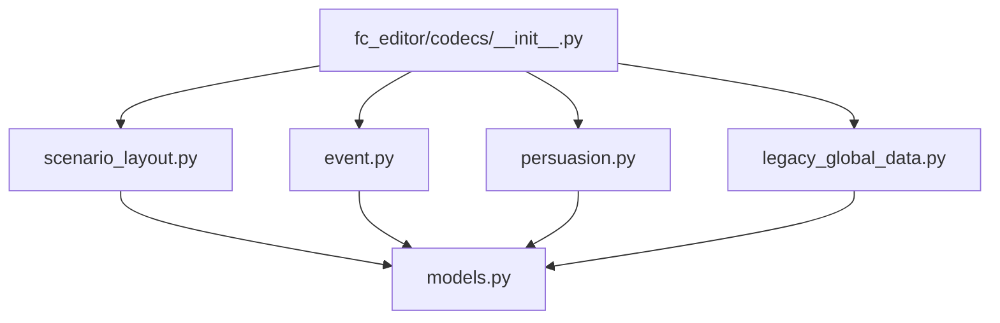
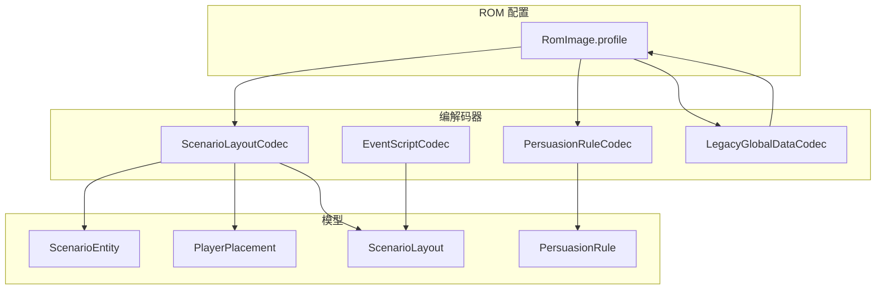
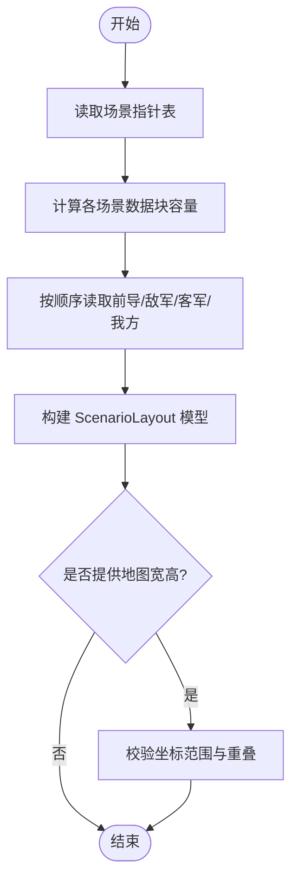
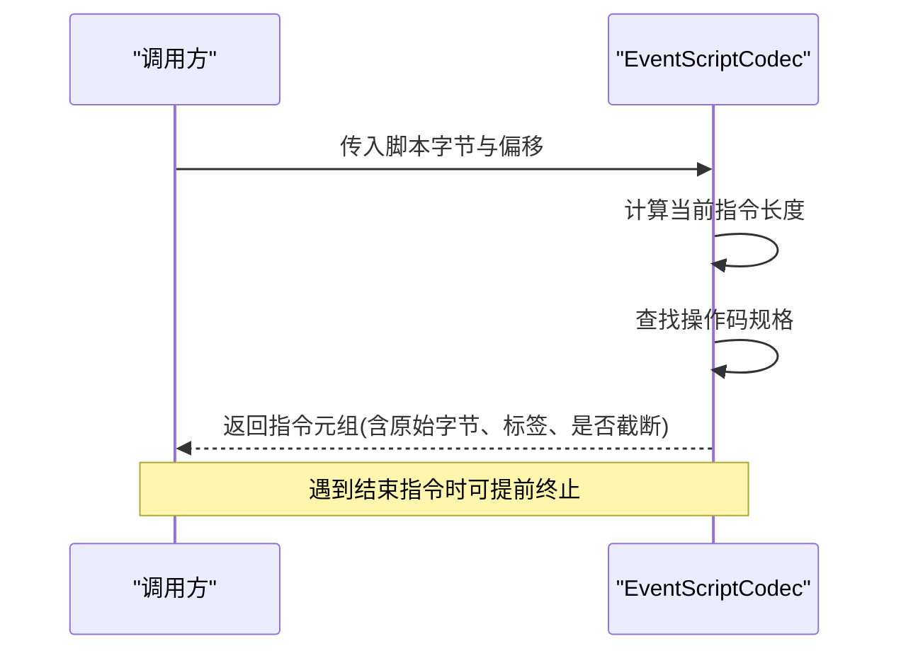
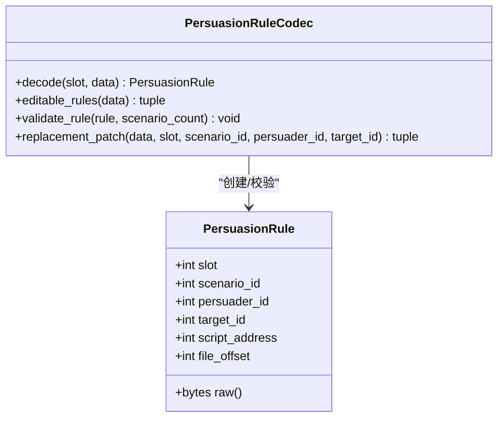
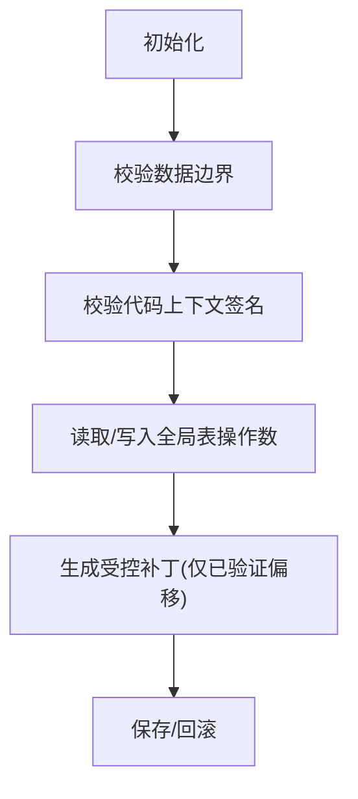
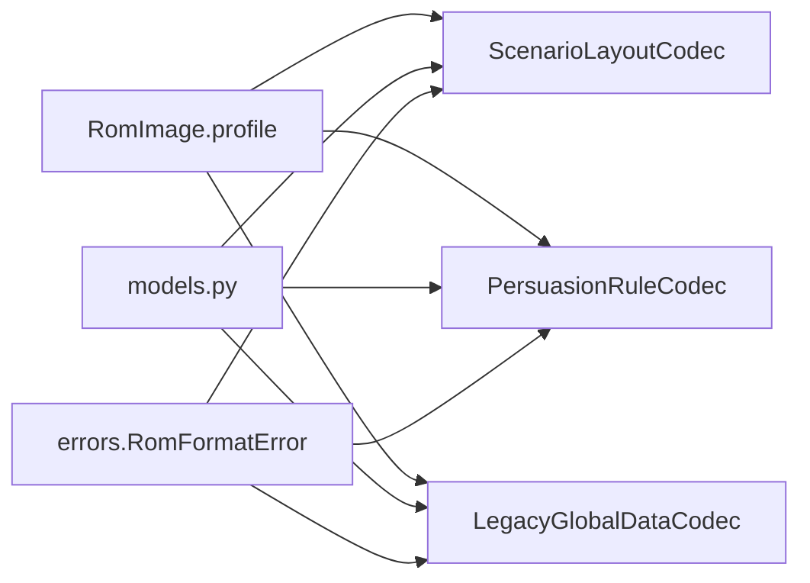

# 剧本系统编解码器

<cite>
**本文引用的文件**
- [scenario_layout.py](file://src/fc_editor/codecs/scenario_layout.py)
- [event.py](file://src/fc_editor/codecs/event.py)
- [persuasion.py](file://src/fc_editor/codecs/persuasion.py)
- [legacy_global_data.py](file://src/fc_editor/codecs/legacy_global_data.py)
- [models.py](file://src/fc_editor/models.py)
- [__init__.py](file://src/fc_editor/codecs/__init__.py)
- [test_legacy_global_data.py](file://tests/test_legacy_global_data.py)
- [test_scenario_feedback.py](file://tests/test_scenario_feedback.py)
</cite>

## 目录
1. [简介](#简介)
2. [项目结构](#项目结构)
3. [核心组件](#核心组件)
4. [架构总览](#架构总览)
5. [详细组件分析](#详细组件分析)
6. [依赖关系分析](#依赖关系分析)
7. [性能考量](#性能考量)
8. [故障排查指南](#故障排查指南)
9. [结论](#结论)
10. [附录：示例与最佳实践](#附录示例与最佳实践)

## 简介
本文件系统化梳理“剧本系统”的编解码能力，覆盖以下关键方面：
- ScenarioLayoutCodec：剧本布局（前导、敌军、客军、我方出击位）的结构、指针表、容量校验与替换补丁。
- EventScriptCodec：事件脚本指令格式、长度计算、解析流程控制。
- PersuasionRuleCodec：说服规则定义、槽位与脚本指针表、判定条件与结果处理机制。
- LegacyGlobalDataCodec：遗留全局数据存储格式、代码上下文签名验证、兼容性处理与回滚策略。
同时提供实际编辑与配置示例路径，帮助读者快速上手。

## 项目结构
围绕剧本系统的编解码集中在 fc_editor/codecs 目录下，并通过 __init__.py 暴露统一入口；模型定义在 models.py；测试用例位于 tests 目录，用于验证行为与边界条件。

**图示来源**
- [__init__.py:5-38](file://src/fc_editor/codecs/__init__.py#L5-L38)
- [scenario_layout.py:1-15](file://src/fc_editor/codecs/scenario_layout.py#L1-L15)
- [event.py:1-15](file://src/fc_editor/codecs/event.py#L1-L15)
- [persuasion.py:1-15](file://src/fc_editor/codecs/persuasion.py#L1-L15)
- [legacy_global_data.py:1-20](file://src/fc_editor/codecs/legacy_global_data.py#L1-L20)
- [models.py:344-382](file://src/fc_editor/models.py#L344-L382)

**章节来源**
- [__init__.py:5-38](file://src/fc_editor/codecs/__init__.py#L5-L38)
- [scenario_layout.py:1-15](file://src/fc_editor/codecs/scenario_layout.py#L1-L15)
- [event.py:1-15](file://src/fc_editor/codecs/event.py#L1-L15)
- [persuasion.py:1-15](file://src/fc_editor/codecs/persuasion.py#L1-L15)
- [legacy_global_data.py:1-20](file://src/fc_editor/codecs/legacy_global_data.py#L1-L20)
- [models.py:344-382](file://src/fc_editor/models.py#L344-L382)

## 核心组件
- ScenarioLayoutCodec：负责读取/写入场景部署数据块，维护指针表、偏移、容量，并提供语义校验与替换补丁生成。
- EventScriptCodec：以固定银行的事件虚拟机指令集为基础，提供指令长度计算与无损解析。
- PersuasionRuleCodec：管理劝降规则表与脚本指针表，支持槽位读写、规则校验与替换补丁。
- LegacyGlobalDataCodec：对已验证的全局表进行只读/只写受控访问，通过代码上下文签名确保兼容性与安全性。

**章节来源**
- [scenario_layout.py:12-251](file://src/fc_editor/codecs/scenario_layout.py#L12-L251)
- [event.py:10-109](file://src/fc_editor/codecs/event.py#L10-L109)
- [persuasion.py:10-125](file://src/fc_editor/codecs/persuasion.py#L10-L125)
- [legacy_global_data.py:17-701](file://src/fc_editor/codecs/legacy_global_data.py#L17-L701)

## 架构总览
下图展示各编解码器与 ROM 配置文件、模型之间的交互关系，以及典型的数据流。

**图示来源**
- [scenario_layout.py:7-15](file://src/fc_editor/codecs/scenario_layout.py#L7-L15)
- [persuasion.py:30-53](file://src/fc_editor/codecs/persuasion.py#L30-L53)
- [legacy_global_data.py:101-118](file://src/fc_editor/codecs/legacy_global_data.py#L101-L118)
- [models.py:344-382](file://src/fc_editor/models.py#L344-L382)

## 详细组件分析

### ScenarioLayoutCodec：剧本布局结构、关卡设计数据、场景切换逻辑
- 数据结构
  - 前导列表：可变长度序列，以结束标记分隔。
  - 敌方部署：固定长度记录，每条包含单位信息。
  - 客军部署：固定长度记录，每条包含单位信息。
  - 我方出击位：固定长度记录，每条包含坐标等位置信息。
- 指针与容量
  - 从 ROM 配置读取指针表起始地址与数量，解析每个场景的 CPU 指针。
  - 根据相邻唯一指针差值计算每个场景数据块的容量，并进行合法性检查。
  - 提供 CPU 指针到文件偏移的转换方法，并校验范围。
- 解码与编码
  - decode：按顺序读取前导、敌军、客军、我方，构造 ScenarioLayout 对象，保留原始字节以便无损往返。
  - encode：将布局序列化回字节流，严格遵循结束标记与固定记录长度。
- 校验与替换
  - validate_layout：限制敌军、客军、我方数量上限，并检查坐标越界与重叠。
  - replacement_patch：生成原地替换补丁，若新数据超过容量则报错。
  - round_trip：验证解码再编码与原数据一致。

**图示来源**
- [scenario_layout.py:79-116](file://src/fc_editor/codecs/scenario_layout.py#L79-L116)
- [scenario_layout.py:146-169](file://src/fc_editor/codecs/scenario_layout.py#L146-L169)
- [scenario_layout.py:187-226](file://src/fc_editor/codecs/scenario_layout.py#L187-L226)

**章节来源**
- [scenario_layout.py:12-251](file://src/fc_editor/codecs/scenario_layout.py#L12-L251)
- [models.py:344-382](file://src/fc_editor/models.py#L344-L382)

### EventScriptCodec：事件脚本格式、执行流程控制、变量管理系统
- 指令规格
  - 指令集以操作码为索引，附带标签、处理器地址、证据级别与长度规则。
  - 支持变长指令（如批量写入、批量切换映射、对象生成等），通过 instruction_length 动态计算长度。
- 解析流程
  - decode：从偏移开始逐条解析指令，遇到结束指令可停止；未知操作码仍作为“延时帧”记录，保证鲁棒性。
  - 指令长度计算考虑了标志位与参数个数，避免截断或越界。
- 执行控制与变量
  - 该编解码器聚焦于结构与长度，不直接实现运行时变量管理；变量与状态由上层事件执行器使用指令语义驱动。
  - 通过结构化解析，上层可安全地遍历、过滤、修改指令，而不破坏脚本完整性。

**图示来源**
- [event.py:28-46](file://src/fc_editor/codecs/event.py#L28-L46)
- [event.py:56-109](file://src/fc_editor/codecs/event.py#L56-L109)

**章节来源**
- [event.py:10-109](file://src/fc_editor/codecs/event.py#L10-L109)

### PersuasionRuleCodec：说服规则定义、判定条件设置、结果处理机制
- 数据结构
  - 每条规则包含槽位、章节ID、劝说者ID、目标ID、脚本地址与文件偏移。
  - 规则表为固定大小记录，并以结束码标识表尾；脚本指针表独立存储，指向具体劝降事件脚本。
- 初始化与校验
  - 构造时读取槽位数量、表尾校验、脚本指针表范围校验，并对可编辑槽位进行规则有效性检查。
  - validate_rule：限制章节ID范围与劝说者/目标ID有效区间。
- 读写与替换
  - decode：从指定槽位读取规则与对应脚本指针。
  - editable_rules：枚举所有可编辑槽位的规则。
  - replacement_patch：生成槽位级替换补丁，仅允许激活具备独立安全脚本的槽位。

**图示来源**
- [persuasion.py:10-22](file://src/fc_editor/codecs/persuasion.py#L10-L22)
- [persuasion.py:24-125](file://src/fc_editor/codecs/persuasion.py#L24-L125)

**章节来源**
- [persuasion.py:10-125](file://src/fc_editor/codecs/persuasion.py#L10-L125)

### LegacyGlobalDataCodec：遗留全局数据存储格式、兼容性处理
- 数据区域
  - 距离命中修正表、累计经验表、道具名称指针表与文本池、道具价格表、初始人物/机体表。
  - 双击公式、伤害公式、命中阈值、道具效果的操作数位置由配置给出，并在初始化时进行代码上下文签名验证。
- 上下文签名与兼容性
  - 通过固定前缀与后缀匹配，确保操作数所在位置的机器码未发生漂移或篡改，从而保障跨版本兼容性。
  - 任何不匹配的上下文都会抛出格式错误，防止误改导致运行期崩溃。
- 读写与回滚
  - 提供只读读取方法与带校验的补丁生成方法，确保仅修改已验证的文件偏移范围。
  - 支持精确复制与还原道具名称存储布局，保留非规范布局细节，便于重置与撤销重做。

**图示来源**
- [legacy_global_data.py:101-118](file://src/fc_editor/codecs/legacy_global_data.py#L101-L118)
- [legacy_global_data.py:183-269](file://src/fc_editor/codecs/legacy_global_data.py#L183-L269)
- [legacy_global_data.py:298-402](file://src/fc_editor/codecs/legacy_global_data.py#L298-L402)
- [legacy_global_data.py:485-552](file://src/fc_editor/codecs/legacy_global_data.py#L485-L552)

**章节来源**
- [legacy_global_data.py:17-701](file://src/fc_editor/codecs/legacy_global_data.py#L17-L701)

## 依赖关系分析
- 模块耦合
  - ScenarioLayoutCodec 依赖 RomImage.profile 获取场景指针表与窗口基址，依赖 models 中的实体与布局模型。
  - PersuasionRuleCodec 依赖 RomImage.profile 的规则配置与章节事件区段，确保脚本指针合法。
  - LegacyGlobalDataCodec 强依赖 RomImage.profile 的全局数据配置，并通过上下文签名锁定可修改范围。
  - EventScriptCodec 无外部 ROM 依赖，专注于指令解析与长度计算。
- 外部依赖
  - 所有编解码器均通过 RomImage 与 profiles 抽象 ROM 布局，降低硬编码风险。
  - 错误类型集中来自 errors.RomFormatError，便于统一捕获与提示。

**图示来源**
- [scenario_layout.py:7-15](file://src/fc_editor/codecs/scenario_layout.py#L7-L15)
- [persuasion.py:30-53](file://src/fc_editor/codecs/persuasion.py#L30-L53)
- [legacy_global_data.py:101-118](file://src/fc_editor/codecs/legacy_global_data.py#L101-L118)
- [models.py:344-382](file://src/fc_editor/models.py#L344-L382)

**章节来源**
- [scenario_layout.py:7-15](file://src/fc_editor/codecs/scenario_layout.py#L7-L15)
- [persuasion.py:30-53](file://src/fc_editor/codecs/persuasion.py#L30-L53)
- [legacy_global_data.py:101-118](file://src/fc_editor/codecs/legacy_global_data.py#L101-L118)
- [models.py:344-382](file://src/fc_editor/models.py#L344-L382)

## 性能考量
- 指针与容量预计算：ScenarioLayoutCodec 在构造阶段一次性解析指针表并计算容量，后续解码/编码均为线性扫描，适合批量处理。
- 指令解析开销：EventScriptCodec 的 instruction_length 为常数时间查表或简单算术，decode 为单次遍历，整体复杂度 O(N)。
- 上下文签名校验：LegacyGlobalDataCodec 在初始化与每次补丁生成时进行固定范围的签名校验，确保安全性但带来少量额外开销；建议仅在必要时机触发。
- 内存占用：所有编解码器尽量使用不可变结构与切片，减少中间拷贝；替换补丁采用最小化字节变更，利于事务与回滚。

[本节为通用指导，无需特定文件引用]

## 故障排查指南
- 场景部署数据不完整或缺失结束标记
  - 现象：解码时报错“缺少 FF 结束标记”或“部署数据块不完整”。
  - 排查：确认场景数据块长度与容量一致，检查前导与各类部署记录的结束标记。
  - 参考路径：[scenario_layout.py:118-144](file://src/fc_editor/codecs/scenario_layout.py#L118-L144), [scenario_layout.py:146-169](file://src/fc_editor/codecs/scenario_layout.py#L146-L169)
- 劝降规则表或脚本指针表越界
  - 现象：初始化时报错“超出ROM”或“缺少 $FF 结束码”。
  - 排查：核对规则表与指针表的偏移与长度，确保表尾结束码存在且指针落在已验证脚本区。
  - 参考路径：[persuasion.py:30-53](file://src/fc_editor/codecs/persuasion.py#L30-L53)
- 全局表上下文签名不匹配
  - 现象：初始化或补丁生成时报错“代码上下文签名不匹配”。
  - 排查：检查双击公式、伤害公式、命中阈值、道具效果的操作数周围机器码是否被意外修改。
  - 参考路径：[legacy_global_data.py:183-269](file://src/fc_editor/codecs/legacy_global_data.py#L183-L269)
- 道具名称指针异常
  - 现象：报错“超出文本池”、“重复指针”、“不是严格递增”、“缺少 $FF 终止符”。
  - 排查：确认指针表严格递增且指针指向文本池内部，每条记录以 $FF 结尾。
  - 参考路径：[legacy_global_data.py:417-455](file://src/fc_editor/codecs/legacy_global_data.py#L417-L455)
- 事件指令粘贴无效
  - 现象：UI 粘贴多条指令或长度非法时被拒绝。
  - 排查：确保粘贴内容为单条指令且长度符合指令规格。
  - 参考路径：[test_scenario_feedback.py:143-165](file://tests/test_scenario_feedback.py#L143-L165)

**章节来源**
- [scenario_layout.py:118-169](file://src/fc_editor/codecs/scenario_layout.py#L118-L169)
- [persuasion.py:30-53](file://src/fc_editor/codecs/persuasion.py#L30-L53)
- [legacy_global_data.py:183-269](file://src/fc_editor/codecs/legacy_global_data.py#L183-L269)
- [legacy_global_data.py:417-455](file://src/fc_editor/codecs/legacy_global_data.py#L417-L455)
- [test_scenario_feedback.py:143-165](file://tests/test_scenario_feedback.py#L143-L165)

## 结论
本编解码体系围绕“安全、可控、可回滚”的原则设计：
- ScenarioLayoutCodec 提供无损的场景布局编解码与严格的布局校验，确保关卡设计数据的完整性。
- EventScriptCodec 以指令规格为核心，提供稳定的解析与长度计算，支撑上层事件执行与编辑。
- PersuasionRuleCodec 通过槽位与脚本指针表管理说服规则，结合规则校验与受限替换，保障剧情分支的安全性。
- LegacyGlobalDataCodec 通过代码上下文签名与受控补丁，确保全局表修改的安全性与跨版本兼容性，并提供精确还原能力。
配合完善的测试用例，这些组件能够在复杂 ROM 环境下稳定工作，并为编辑器与工具链提供可靠基础。

[本节为总结性内容，无需特定文件引用]

## 附录：示例与最佳实践
- 剧本布局编辑示例
  - 读取某场景布局并校验坐标：
    - 参考路径：[scenario_layout.py:146-169](file://src/fc_editor/codecs/scenario_layout.py#L146-L169), [scenario_layout.py:187-226](file://src/fc_editor/codecs/scenario_layout.py#L187-L226)
  - 生成替换补丁并应用：
    - 参考路径：[scenario_layout.py:231-246](file://src/fc_editor/codecs/scenario_layout.py#L231-L246)
- 事件脚本编辑示例
  - 解析指令并定位特定操作码：
    - 参考路径：[event.py:56-109](file://src/fc_editor/codecs/event.py#L56-L109)
  - UI 层粘贴与提交草稿（单元测试）：
    - 参考路径：[test_scenario_feedback.py:111-165](file://tests/test_scenario_feedback.py#L111-L165)
- 说服规则配置示例
  - 枚举可编辑槽位并校验规则：
    - 参考路径：[persuasion.py:79-100](file://src/fc_editor/codecs/persuasion.py#L79-L100)
  - 生成槽位级替换补丁：
    - 参考路径：[persuasion.py:102-125](file://src/fc_editor/codecs/persuasion.py#L102-L125)
- 遗留全局数据调整示例
  - 读取默认值与上下文签名验证：
    - 参考路径：[legacy_global_data.py:101-118](file://src/fc_editor/codecs/legacy_global_data.py#L101-L118), [legacy_global_data.py:183-269](file://src/fc_editor/codecs/legacy_global_data.py#L183-L269)
  - 修改道具名称与价格并验证写入范围：
    - 参考路径：[legacy_global_data.py:485-552](file://src/fc_editor/codecs/legacy_global_data.py#L485-L552), [test_legacy_global_data.py:238-283](file://tests/test_legacy_global_data.py#L238-L283)
  - 全量全局表修改与回滚：
    - 参考路径：[test_legacy_global_data.py:420-461](file://tests/test_legacy_global_data.py#L420-L461), [test_legacy_global_data.py:524-553](file://tests/test_legacy_global_data.py#L524-L553)

**章节来源**
- [scenario_layout.py:146-246](file://src/fc_editor/codecs/scenario_layout.py#L146-L246)
- [event.py:56-109](file://src/fc_editor/codecs/event.py#L56-L109)
- [persuasion.py:79-125](file://src/fc_editor/codecs/persuasion.py#L79-L125)
- [legacy_global_data.py:101-552](file://src/fc_editor/codecs/legacy_global_data.py#L101-L552)
- [test_legacy_global_data.py:238-553](file://tests/test_legacy_global_data.py#L238-L553)
- [test_scenario_feedback.py:111-165](file://tests/test_scenario_feedback.py#L111-L165)