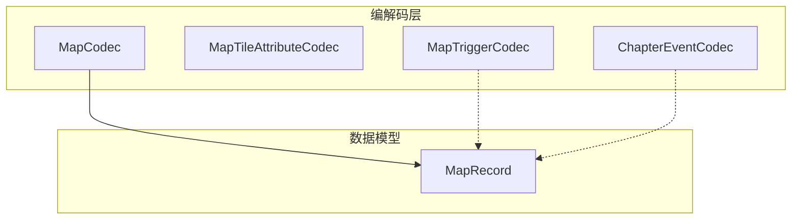
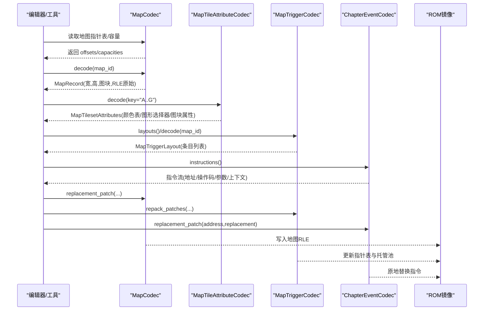
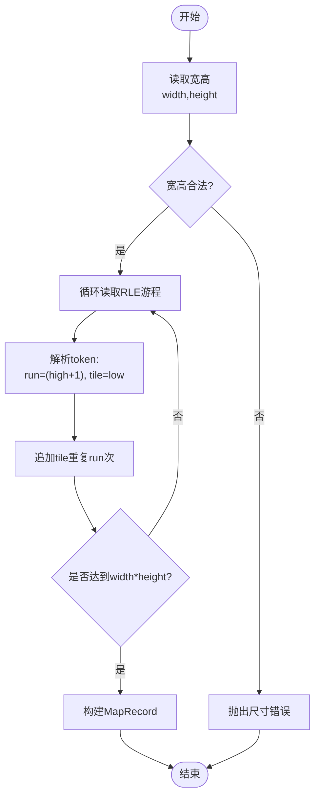
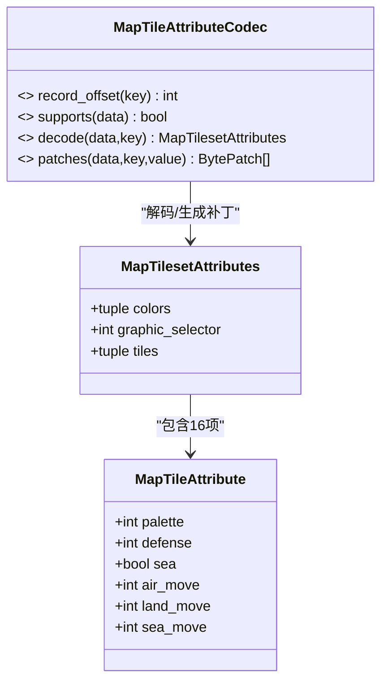
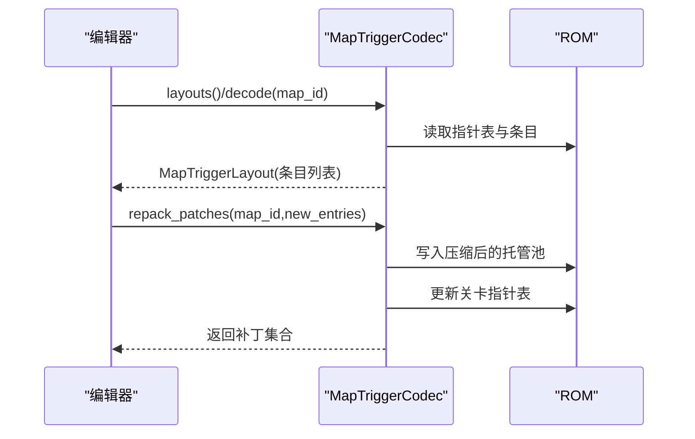
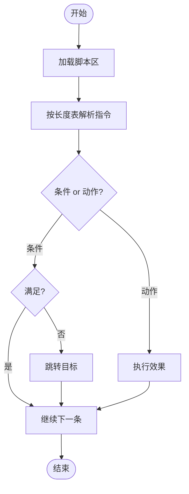
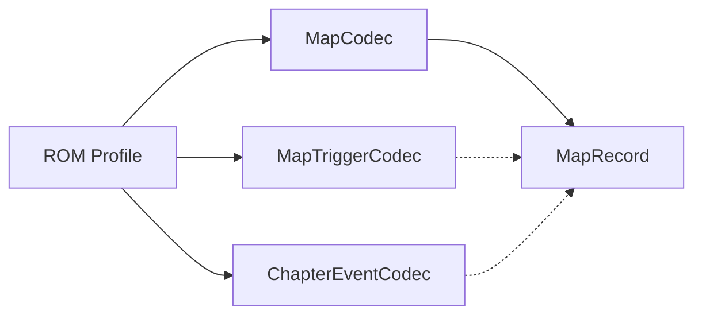

# 地图事件编解码器

<cite>
**本文引用的文件**
- [map.py](file://src/fc_editor/codecs/map.py)
- [map_tile_attribute.py](file://src/fc_editor/codecs/map_tile_attribute.py)
- [map_trigger.py](file://src/fc_editor/codecs/map_trigger.py)
- [chapter_event.py](file://src/fc_editor/codecs/chapter_event.py)
- [models.py](file://src/fc_editor/models.py)
</cite>

## 目录
1. [简介](#简介)
2. [项目结构](#项目结构)
3. [核心组件](#核心组件)
4. [架构总览](#架构总览)
5. [详细组件分析](#详细组件分析)
6. [依赖关系分析](#依赖关系分析)
7. [性能与容量特性](#性能与容量特性)
8. [故障排查指南](#故障排查指南)
9. [结论](#结论)
10. [附录：编辑与配置示例路径](#附录：编辑与配置示例路径)

## 简介
本文件聚焦于“地图与事件”的编解码子系统，覆盖以下能力：
- MapCodec：地图地形数据的 RLE 编码/解码、容量边界校验、指针与 Bank 解析。
- MapTileAttributeCodec：图库 A—G 的图块属性记录（颜色表、防御补正、海陆空移动补正）的解码、规范化与字节级补丁生成。
- MapTriggerCodec：地图触发器（X/Y/限定人物/事件ID）的布局读取、条目校验、共享池重排与指针表更新。
- ChapterEventCodec：章节事件脚本（指令流、条件判断、动作序列、分支跳转）的固定地址解析与原地替换。

目标读者包括 ROM 编辑器开发者、关卡策划与剧情作者，帮助理解数据结构、布局约束与可编辑范围。

## 项目结构
围绕地图与事件的编解码集中在 fc_editor/codecs 目录下，数据模型在 models.py 中提供统一的数据类。关键文件职责如下：
- map.py：MapCodec，负责地图地形 RLE 编解码与容量计算。
- map_tile_attribute.py：MapTileAttributeCodec，负责图块属性记录解码与补丁生成。
- map_trigger.py：MapTriggerCodec，负责地图触发器布局与共享池重排。
- chapter_event.py：ChapterEventCodec，负责章节事件脚本指令解析与原地替换。
- models.py：MapRecord 等通用数据类，承载地图记录、场景实体等。

图表来源
- [map.py:16-228](file://src/fc_editor/codecs/map.py#L16-L228)
- [map_tile_attribute.py:28-143](file://src/fc_editor/codecs/map_tile_attribute.py#L28-L143)
- [map_trigger.py:39-259](file://src/fc_editor/codecs/map_trigger.py#L39-L259)
- [chapter_event.py:183-328](file://src/fc_editor/codecs/chapter_event.py#L183-L328)
- [models.py:309-342](file://src/fc_editor/models.py#L309-L342)

章节来源
- [map.py:16-228](file://src/fc_editor/codecs/map.py#L16-L228)
- [map_tile_attribute.py:28-143](file://src/fc_editor/codecs/map_tile_attribute.py#L28-L143)
- [map_trigger.py:39-259](file://src/fc_editor/codecs/map_trigger.py#L39-L259)
- [chapter_event.py:183-328](file://src/fc_editor/codecs/chapter_event.py#L183-L328)
- [models.py:309-342](file://src/fc_editor/models.py#L309-L342)

## 核心组件
- MapCodec：以 RLE 形式存储 4-bit 逻辑地形编号；支持 decode/encode/replacement_patch/round_trip 等方法；维护 pointers/banks/offsets/capacities。
- MapTileAttributeCodec：针对图库 A—G 的固定偏移记录进行解码与规范化；输出逐字节差异补丁。
- MapTriggerCodec：读取关卡触发器指针表，解析条目并以 FF 终止；支持将多关卡条目压缩到托管池并更新指针表。
- ChapterEventCodec：基于固定地址的事件 VM 指令流，按操作码长度表解析，支持原地替换与上下文定位。

章节来源
- [map.py:16-228](file://src/fc_editor/codecs/map.py#L16-L228)
- [map_tile_attribute.py:28-143](file://src/fc_editor/codecs/map_tile_attribute.py#L28-L143)
- [map_trigger.py:39-259](file://src/fc_editor/codecs/map_trigger.py#L39-L259)
- [chapter_event.py:183-328](file://src/fc_editor/codecs/chapter_event.py#L183-L328)

## 架构总览
下图展示地图与事件编解码器的协作关系与数据流向：

图表来源
- [map.py:119-228](file://src/fc_editor/codecs/map.py#L119-L228)
- [map_tile_attribute.py:58-143](file://src/fc_editor/codecs/map_tile_attribute.py#L58-L143)
- [map_trigger.py:119-259](file://src/fc_editor/codecs/map_trigger.py#L119-L259)
- [chapter_event.py:197-328](file://src/fc_editor/codecs/chapter_event.py#L197-L328)

## 详细组件分析

### MapCodec：地图数据结构与 RLE 编码
- 数据结构
  - 首两字节为宽高（1–32），后续为 RLE 游程：每字节高4位为(长度-1)，低4位为逻辑地形编号（0–15）。
  - 通过指针表与 Bank 信息计算每个地图记录的起始偏移与容量上限。
- 关键点
  - 扩展地图指针必须位于 $A000–$BFFF；原图指针需落在配置的存储窗口内且严格递增。
  - 解码时校验 RLE 游程不越界；编码时限制单次游程最大长度为 16。
  - replacement_patch 保证新编码不超过容量；semantic_digest 用于语义一致性比对。

图表来源
- [map.py:136-196](file://src/fc_editor/codecs/map.py#L136-L196)

章节来源
- [map.py:16-228](file://src/fc_editor/codecs/map.py#L16-L228)
- [models.py:309-342](file://src/fc_editor/models.py#L309-L342)

### MapTileAttributeCodec：地形属性定义、碰撞检测规则、视觉效果配置
- 记录布局（图库 A–G）
  - 固定起始偏移与记录大小；每个图库包含 3 字节颜色表、图形选择器、16 个图块的属性。
  - 图块属性字段：调色板索引（0–3）、防御补正（0–127）、海域标志、空/陆/海移动补正（0–16）。
- 校验与规范化
  - 图形选择器必须匹配预期值；颜色表仅允许特定编码；移动补正不得超限。
  - 规范化后生成逐字节差异补丁，便于无损回写。
- 碰撞与移动
  - 防御补正影响碰撞/伤害计算；海域标志决定水域通行；移动补正影响空/陆/海三态机动。

图表来源
- [map_tile_attribute.py:11-143](file://src/fc_editor/codecs/map_tile_attribute.py#L11-L143)

章节来源
- [map_tile_attribute.py:28-143](file://src/fc_editor/codecs/map_tile_attribute.py#L28-L143)

### MapTriggerCodec：事件触发器格式、条件判断逻辑、执行动作序列
- 触发器条目
  - 每条 4 字节：X、Y、限定人物ID、事件ID；以 0xFF 终止。
  - 事件ID≥0xF0 表示商店类型，shop_id 取低4位。
- 布局与共享池
  - 关卡指针表指向各关卡触发器数据；首次编辑时将全部 32 条布局压缩至托管池尾部，避免破坏原数据。
  - 相同内容去重复用，减少空间占用。
- 条件与动作
  - 坐标与限定人物构成触发条件；事件ID映射到运行时动作（如增援、对话、开关等）。
  - 支持 validate_entries 校验坐标范围、人物ID范围与唯一性。

图表来源
- [map_trigger.py:119-259](file://src/fc_editor/codecs/map_trigger.py#L119-L259)

章节来源
- [map_trigger.py:39-259](file://src/fc_editor/codecs/map_trigger.py#L39-L259)

### ChapterEventCodec：剧情事件脚本格式、变量系统、分支剧情实现
- 指令流
  - 固定地址区域存放事件脚本；按操作码长度表解析，特殊操作码 $43 根据参数动态决定长度。
  - 指令分为条件判定（回合/开关/位置/接触/距离等）与动作（对话/增援/开关/音乐/跳转等）。
- 变量与上下文
  - 通过 contexts_for_address 确定指令所属关卡与阶段；label 来自阶段标签表。
  - 临时变量通过特定指令写入，供后续条件判断使用。
- 分支剧情
  - 无条件跳转与条件跳转指令实现分支；替换时需保持指令长度不变，确保对齐。

图表来源
- [chapter_event.py:11-22](file://src/fc_editor/codecs/chapter_event.py#L11-L22)
- [chapter_event.py:227-288](file://src/fc_editor/codecs/chapter_event.py#L227-L288)

章节来源
- [chapter_event.py:183-328](file://src/fc_editor/codecs/chapter_event.py#L183-L328)

## 依赖关系分析
- MapCodec 依赖 ROM profile 中的地图指针表、存储窗口与 Bank 信息；产出 MapRecord。
- MapTileAttributeCodec 依赖固定偏移与预期图形选择器；输出逐字节补丁。
- MapTriggerCodec 依赖关卡触发器指针表与托管池范围；输出指针表与池的补丁。
- ChapterEventCodec 依赖事件脚本区与指令长度表；输出原地替换补丁。

图表来源
- [map.py:16-118](file://src/fc_editor/codecs/map.py#L16-L118)
- [map_trigger.py:49-118](file://src/fc_editor/codecs/map_trigger.py#L49-L118)
- [chapter_event.py:183-220](file://src/fc_editor/codecs/chapter_event.py#L183-L220)
- [models.py:309-342](file://src/fc_editor/models.py#L309-L342)

章节来源
- [map.py:16-118](file://src/fc_editor/codecs/map.py#L16-L118)
- [map_trigger.py:49-118](file://src/fc_editor/codecs/map_trigger.py#L49-L118)
- [chapter_event.py:183-220](file://src/fc_editor/codecs/chapter_event.py#L183-L220)
- [models.py:309-342](file://src/fc_editor/models.py#L309-L342)

## 性能与容量特性
- 地图 RLE：游程长度上限 16，适合大面积同色地形压缩；编码/解码线性复杂度 O(N)。
- 触发器共享池：相同条目去重复用，降低整体占用；重排过程对 32 条布局一次性打包。
- 事件脚本：固定地址原地替换，避免碎片化；指令长度表保证解析高效。
- 容量校验：所有写入前进行容量检查，防止溢出。

[本节为通用性能讨论，不直接分析具体文件]

## 故障排查指南
- 地图相关
  - 指针越界或不在存储窗口：检查 ROM profile 的 map_storage_ranges 与指针合法性。
  - RLE 提前结束或游程越界：确认宽高与图块数量一致，游程未超过 capacity。
  - 容量不足：replacement_patch 报错时，需扩大目标区域或优化地图布局。
- 图块属性
  - 图形选择器不匹配：仅允许预期值，不可通过属性窗口修改。
  - 颜色表/移动补正非法：确保颜色编码与移动值在允许范围内。
- 触发器
  - 缺少终止符 FF：检查条目末尾是否补齐。
  - 坐标/人物ID越界或重复：使用 validate_entries 预检。
  - 托管池不足：repack_patches 时报错需扩容或精简条目。
- 事件脚本
  - 未知操作码或参数越界：核对指令长度表与参数有效性。
  - 替换长度不一致：replacement_patch 要求新旧指令等长。

章节来源
- [map.py:49-118](file://src/fc_editor/codecs/map.py#L49-L118)
- [map.py:136-228](file://src/fc_editor/codecs/map.py#L136-L228)
- [map_tile_attribute.py:58-143](file://src/fc_editor/codecs/map_tile_attribute.py#L58-L143)
- [map_trigger.py:119-259](file://src/fc_editor/codecs/map_trigger.py#L119-L259)
- [chapter_event.py:227-328](file://src/fc_editor/codecs/chapter_event.py#L227-L328)

## 结论
该编解码子系统以严格的容量与格式校验为基础，提供无损编辑能力：
- 地图地形采用紧凑 RLE 编码，兼顾可读性与空间效率。
- 图块属性记录固定布局，确保运行期行为稳定。
- 触发器通过共享池去重与指针表管理，提升复用率。
- 事件脚本以固定地址指令流组织，支持复杂分支与变量控制。
配合统一的模型与 ROM 配置，可在不同 ROM 变体间保持一致的编辑体验。

[本节为总结性内容，不直接分析具体文件]

## 附录：编辑与配置示例路径
以下为常见编辑任务的代码片段路径（不包含具体代码内容）：
- 读取地图记录并获取宽高与图块数组
  - [map.py:136-173](file://src/fc_editor/codecs/map.py#L136-L173)
  - [models.py:309-342](file://src/fc_editor/models.py#L309-L342)
- 将新地图图块编码并生成替换补丁
  - [map.py:175-223](file://src/fc_editor/codecs/map.py#L175-L223)
- 解码图库 A 的图块属性并生成补丁
  - [map_tile_attribute.py:58-143](file://src/fc_editor/codecs/map_tile_attribute.py#L58-L143)
- 读取某关卡的地图触发器布局
  - [map_trigger.py:119-154](file://src/fc_editor/codecs/map_trigger.py#L119-L154)
- 将多个关卡的触发器压缩到托管池并更新指针表
  - [map_trigger.py:189-230](file://src/fc_editor/codecs/map_trigger.py#L189-L230)
- 解析章节事件脚本指令流
  - [chapter_event.py:262-288](file://src/fc_editor/codecs/chapter_event.py#L262-L288)
- 原地替换某地址的事件指令
  - [chapter_event.py:311-328](file://src/fc_editor/codecs/chapter_event.py#L311-L328)

章节来源
- [map.py:136-223](file://src/fc_editor/codecs/map.py#L136-L223)
- [map_tile_attribute.py:58-143](file://src/fc_editor/codecs/map_tile_attribute.py#L58-L143)
- [map_trigger.py:119-230](file://src/fc_editor/codecs/map_trigger.py#L119-L230)
- [chapter_event.py:262-328](file://src/fc_editor/codecs/chapter_event.py#L262-L328)
- [models.py:309-342](file://src/fc_editor/models.py#L309-L342)