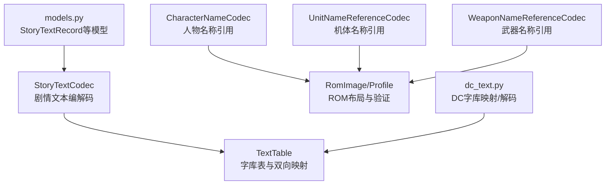
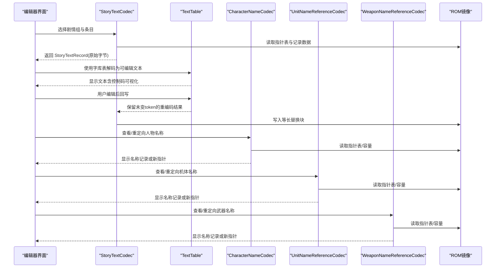
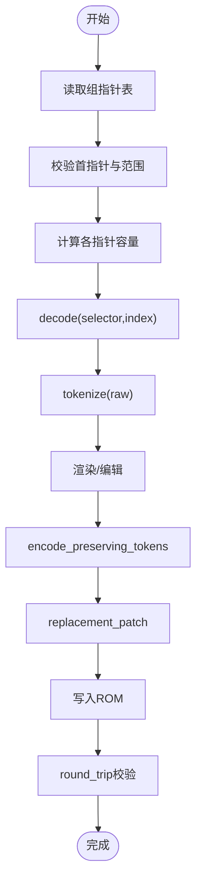
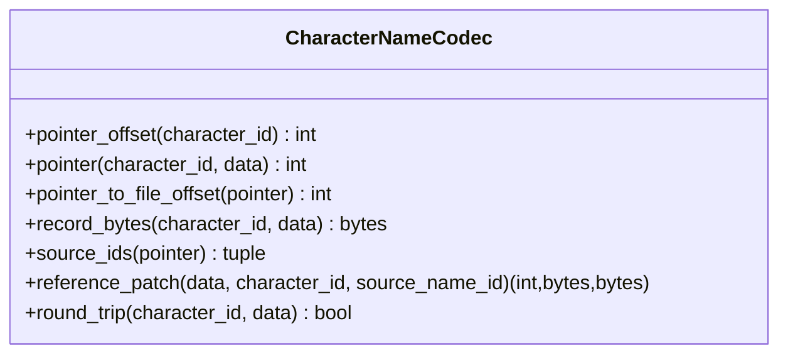
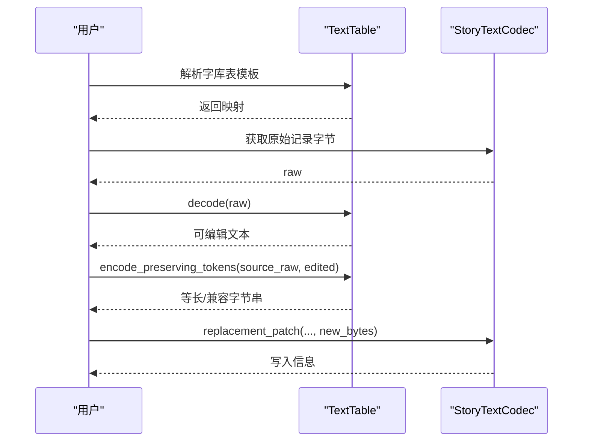
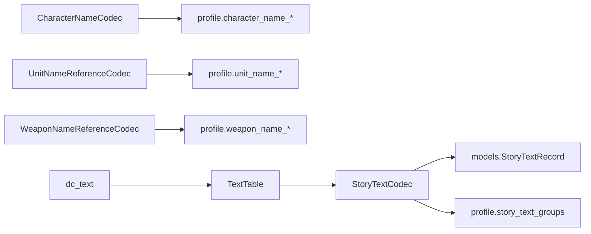

# 文本对话编解码器

<cite>
**本文引用的文件**
- [story_text.py](file://src/fc_editor/codecs/story_text.py)
- [character_name.py](file://src/fc_editor/codecs/character_name.py)
- [unit_name.py](file://src/fc_editor/codecs/unit_name.py)
- [weapon_name.py](file://src/fc_editor/codecs/weapon_name.py)
- [dc_text.py](file://src/fc_editor/dc_text.py)
- [text_table.py](file://src/fc_editor/text_table.py)
- [models.py](file://src/fc_editor/models.py)
</cite>

## 目录
1. [简介](#简介)
2. [项目结构](#项目结构)
3. [核心组件](#核心组件)
4. [架构总览](#架构总览)
5. [详细组件分析](#详细组件分析)
6. [依赖关系分析](#依赖关系分析)
7. [性能与容量特性](#性能与容量特性)
8. [故障排查指南](#故障排查指南)
9. [结论](#结论)
10. [附录：导入导出与对话框编辑示例](#附录导入导出与对话框编辑示例)

## 简介
本文件面向“剧情文本”和“对话/名称引用”的编解码体系，系统性说明以下要点：
- StoryTextCodec 的剧情文本存储格式、字符串编码方式、特殊字符与控制码处理。
- CharacterNameCodec、UnitNameReferenceCodec、WeaponNameReferenceCodec 的名称引用机制、索引表结构与多语言支持。
- 文本格式化标记、换行处理、显示控制指令。
- 文本导入/导出流程与对话框编辑工作流的具体示例（以步骤化形式呈现）。

## 项目结构
围绕文本与对话的核心模块分布在 fc_editor.codecs 与 dc_text、text_table 中：
- story_text.py：剧情文本组指针表、记录容量计算、无损分词与替换写入。
- character_name.py：人物名称表的指针表校验、容量计算与重定向。
- unit_name.py / weapon_name.py：机体/武器名称引用编解码（与人物名称同构）。
- dc_text.py：DC 字库映射、默认文本表、对话文本解码与精简展示。
- text_table.py：通用字库表解析、双向映射、保留原始 token 的重编码。
- models.py：StoryTextRecord 等数据模型定义。

图表来源
- [story_text.py:17-179](file://src/fc_editor/codecs/story_text.py#L17-L179)
- [character_name.py:9-141](file://src/fc_editor/codecs/character_name.py#L9-L141)
- [unit_name.py:8-...](file://src/fc_editor/codecs/unit_name.py#L8-L...)
- [weapon_name.py:8-...](file://src/fc_editor/codecs/weapon_name.py#L8-L...)
- [dc_text.py:372-407](file://src/fc_editor/dc_text.py#L372-L407)
- [text_table.py:10-158](file://src/fc_editor/text_table.py#L10-L158)
- [models.py:165-200](file://src/fc_editor/models.py#L165-L200)

章节来源
- [story_text.py:17-179](file://src/fc_editor/codecs/story_text.py#L17-L179)
- [character_name.py:9-141](file://src/fc_editor/codecs/character_name.py#L9-L141)
- [dc_text.py:372-407](file://src/fc_editor/dc_text.py#L372-L407)
- [text_table.py:10-158](file://src/fc_editor/text_table.py#L10-L158)
- [models.py:165-200](file://src/fc_editor/models.py#L165-L200)

## 核心组件
- 剧情文本编解码（StoryTextCodec）
  - 按组管理指针表，计算每条记录的可用容量，保证零损读写。
  - 提供无损分词器，区分中文字形码、控制码、扩展控制字节、结束符等。
  - 提供独立终止符定位、语义哈希、精确替换补丁生成与往返校验。
- 名称引用编解码（CharacterNameCodec / UnitNameReferenceCodec / WeaponNameReferenceCodec）
  - 读取并校验指针表起始标记与范围，构建“指针→ID集合”的反向映射。
  - 计算每个指针的容量边界，支持安全重定向到已验证的数据区。
  - 提供 round_trip 校验，确保重定向后记录长度与容量一致。
- DC 文本与字库表（dc_text.py / text_table.py）
  - 内置压缩的 DC 字库映射，提供 decode/concise 工具。
  - TextTable 支持从文本模板解析、双向映射、保留原始 token 的重编码。

章节来源
- [story_text.py:17-259](file://src/fc_editor/codecs/story_text.py#L17-L259)
- [character_name.py:9-141](file://src/fc_editor/codecs/character_name.py#L9-L141)
- [dc_text.py:372-407](file://src/fc_editor/dc_text.py#L372-L407)
- [text_table.py:10-158](file://src/fc_editor/text_table.py#L10-L158)

## 架构总览
下图展示了剧情文本与名称引用在 ROM 中的访问路径与数据流：

图表来源
- [story_text.py:156-259](file://src/fc_editor/codecs/story_text.py#L156-L259)
- [character_name.py:65-141](file://src/fc_editor/codecs/character_name.py#L65-L141)
- [unit_name.py:8-...](file://src/fc_editor/codecs/unit_name.py#L8-L...)
- [weapon_name.py:8-...](file://src/fc_editor/codecs/weapon_name.py#L8-L...)
- [text_table.py:61-145](file://src/fc_editor/text_table.py#L61-L145)

## 详细组件分析

### 剧情文本编解码（StoryTextCodec）
- 存储格式
  - 每组包含固定数量的 16 位小端指针表；首指针需匹配预期值。
  - 记录以 FF 结尾；若末记录无显式尾随指针，则通过扫描一个完整记录确定容量。
  - 字形码采用“特定前导字节 + 下一字节”的两字节组合，避免将标点/控制码误判为字形。
- 字符串编码与分词
  - 分词器将原始字节流切分为：两字节中文字形码、单字节字形/参数、控制码、扩展控制字节、文本结束符。
  - standalone_terminator_end 基于同一分词器定位首个独立的 FF 结束符，避免与字形第二字节冲突。
- 容量与写入
  - 根据相邻指针或 last_pointer_writable 策略计算每条记录的容量，确保写入等长替换。
  - replacement_patch 返回文件偏移、原内容与目标内容，便于直接 patch。
- 校验
  - round_trip 对指定条目进行读-写-读比对，确保指针与内容完全一致。

图表来源
- [story_text.py:97-179](file://src/fc_editor/codecs/story_text.py#L97-L179)
- [story_text.py:181-259](file://src/fc_editor/codecs/story_text.py#L181-L259)

章节来源
- [story_text.py:97-259](file://src/fc_editor/codecs/story_text.py#L97-L259)

### 人物名称引用编解码（CharacterNameCodec）
- 指针表与容量
  - 读取验证后的指针表，检查起始标记与指针范围。
  - 构建“指针→ID列表”反向映射，按相邻指针差值计算每条记录的容量。
- 重定向与校验
  - reference_patch 将某 ID 的名称指针指向另一条已验证记录，返回偏移、原值与新值。
  - round_trip 校验重定向后记录长度等于容量。

图表来源
- [character_name.py:9-141](file://src/fc_editor/codecs/character_name.py#L9-L141)

章节来源
- [character_name.py:9-141](file://src/fc_editor/codecs/character_name.py#L9-L141)

### 机体/武器名称引用编解码（UnitNameReferenceCodec / WeaponNameReferenceCodec）
- 与人物名称编解码同构：均维护指针表、容量边界与重定向能力，用于在 ROM 中安全地交换名称记录。
- 多语言支持
  - 通过 profile 配置不同语言组的指针表与数据区，可在不破坏原有布局的前提下切换或扩展语言资源。

章节来源
- [unit_name.py:8-...](file://src/fc_editor/codecs/unit_name.py#L8-L...)
- [weapon_name.py:8-...](file://src/fc_editor/codecs/weapon_name.py#L8-L...)

### 文本表与 DC 文本解码（TextTable / dc_text）
- 字库表
  - 支持从文本模板解析，键为十六进制字节序列，值为显示文本或控制码名称。
  - 提供 encode/decode 与 preserve_tokens 模式，尽量保持未修改 token 的原始字节。
- DC 文本
  - 内置压缩的 DC 字库映射，提供 decode 与 concise 工具函数。
  - 将 F2 视为视觉换行，FF 作为结束符可视化，其余未知单字节统一为“⟦原始字节 XX⟧”。

图表来源
- [text_table.py:10-158](file://src/fc_editor/text_table.py#L10-L158)
- [dc_text.py:372-407](file://src/fc_editor/dc_text.py#L372-L407)
- [story_text.py:156-259](file://src/fc_editor/codecs/story_text.py#L156-L259)

章节来源
- [text_table.py:10-158](file://src/fc_editor/text_table.py#L10-L158)
- [dc_text.py:372-407](file://src/fc_editor/dc_text.py#L372-L407)

## 依赖关系分析
- StoryTextCodec 依赖 RomImage/profile 提供的故事文本组配置，依赖 models.StoryTextRecord 封装记录。
- CharacterNameCodec/UnitNameReferenceCodec/WeaponNameReferenceCodec 依赖 RomImage/profile 的人物/机体/武器名称表配置。
- TextTable 依赖 StoryTextCodec.tokenize 保证分词一致性。
- dc_text 依赖 TextTable 提供默认映射与解码工具。

图表来源
- [story_text.py:17-65](file://src/fc_editor/codecs/story_text.py#L17-L65)
- [character_name.py:12-63](file://src/fc_editor/codecs/character_name.py#L12-L63)
- [text_table.py:6-65](file://src/fc_editor/text_table.py#L6-L65)
- [dc_text.py:372-407](file://src/fc_editor/dc_text.py#L372-L407)

章节来源
- [story_text.py:17-65](file://src/fc_editor/codecs/story_text.py#L17-L65)
- [character_name.py:12-63](file://src/fc_editor/codecs/character_name.py#L12-L63)
- [text_table.py:6-65](file://src/fc_editor/text_table.py#L6-L65)
- [dc_text.py:372-407](file://src/fc_editor/dc_text.py#L372-L407)

## 性能与容量特性
- 零损分词与等长替换
  - 通过 GLYPH_LEADS 识别两字节字形，避免误切分，保证控制码与标点不被破坏。
  - 容量计算基于相邻指针或最后可写区域，确保写入不会溢出。
- 内存与 I/O
  - 指针表一次性读取并按 selector 缓存；记录按需读取，减少不必要的大块 IO。
  - TextTable.encode_preserving_tokens 仅在变更段重编码，尽可能复用原始 token 字节，降低重写开销。
- 可扩展性
  - 通过 group_bank_overrides 可将故事文本组迁移至其他 Bank，同时保持指针表位置与容量计算逻辑不变。

[本节为通用性能讨论，不直接分析具体代码片段]

## 故障排查指南
- 常见错误与定位
  - “指针表不完整/起始指针不正确/越界指针”：检查对应组的 pointer_table、count、expected_first_pointer 与 ROM 布局是否匹配。
  - “末记录字形码不完整/缺少 FF 结束码”：确认记录末尾是否被截断或损坏。
  - “人物名称指针超出已验证数据区/容量无效”：核对 profile 中 character_name_* 范围与当前 ROM 实际数据。
  - “无法把人物名称指向空指针”：重定向目标必须为非空且有效。
- 建议排查步骤
  - 使用 selectors/pointers/ids_by_pointer 确认条目是否存在与共享指针情况。
  - 使用 standalone_terminator_end 定位首个合法结束符，判断记录是否提前截断。
  - 使用 round_trip 验证重定向或替换是否成功。
  - 使用 TextTable.template 生成字库表模板，补齐缺失映射后再尝试编码。

章节来源
- [story_text.py:97-179](file://src/fc_editor/codecs/story_text.py#L97-L179)
- [character_name.py:12-63](file://src/fc_editor/codecs/character_name.py#L12-L63)
- [text_table.py:18-46](file://src/fc_editor/text_table.py#L18-L46)

## 结论
该编解码体系以“指针表 + 容量边界 + 无损分词”为核心，确保剧情文本与名称引用的读写具备强一致性与可逆性。配合 TextTable 的字库映射与 dc_text 的默认映射，可在不破坏 ROM 布局的前提下完成多语言支持与精细化编辑。

[本节为总结性内容，不直接分析具体代码片段]

## 附录：导入导出与对话框编辑示例

### 剧情文本导入/导出流程
- 导出
  - 选择故事组 selector 与 index，调用 decode 获取 StoryTextRecord.raw。
  - 使用 TextTable.decode 将 raw 转为可编辑文本（控制码以可视化形式显示）。
  - 将文本保存为外部文件或表格。
- 导入
  - 准备新的文本与字库表（必要时用 template 补全映射）。
  - 使用 TextTable.encode_preserving_tokens(source_raw, edited_text) 得到兼容字节串。
  - 调用 StoryTextCodec.replacement_patch(...) 获取写入偏移与原/新内容，写入 ROM。
  - 使用 round_trip 校验写入结果。

章节来源
- [story_text.py:156-259](file://src/fc_editor/codecs/story_text.py#L156-L259)
- [text_table.py:61-145](file://src/fc_editor/text_table.py#L61-L145)

### 名称引用重定向（人物/机体/武器）
- 查看
  - 使用 pointer(character_id) 获取当前指针，record_bytes 读取记录内容。
  - 使用 source_ids(pointer) 查看哪些 ID 共享该名称记录。
- 重定向
  - 选择目标 source_name_id，调用 reference_patch(character_id, source_name_id) 获得偏移与新旧指针。
  - 应用补丁后，使用 round_trip 校验记录长度与容量一致。

章节来源
- [character_name.py:65-141](file://src/fc_editor/codecs/character_name.py#L65-L141)
- [unit_name.py:8-...](file://src/fc_editor/codecs/unit_name.py#L8-L...)
- [weapon_name.py:8-...](file://src/fc_editor/codecs/weapon_name.py#L8-L...)

### 对话框编辑要点
- 换行与结束符
  - F2 在对话记录中作为视觉换行；FF 作为记录结束符，编辑时不应删除。
- 控制码与参数
  - 控制码与扩展控制字节会嵌入数值参数，编辑时应保留其原始字节或使用字库表中对应的可视化占位。
- 最小改动原则
  - 优先使用 encode_preserving_tokens，仅重编码变更部分，最大限度保留原始 token 字节，降低风险。

章节来源
- [dc_text.py:372-407](file://src/fc_editor/dc_text.py#L372-L407)
- [text_table.py:95-145](file://src/fc_editor/text_table.py#L95-L145)