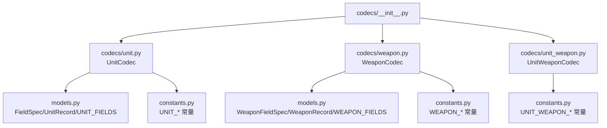
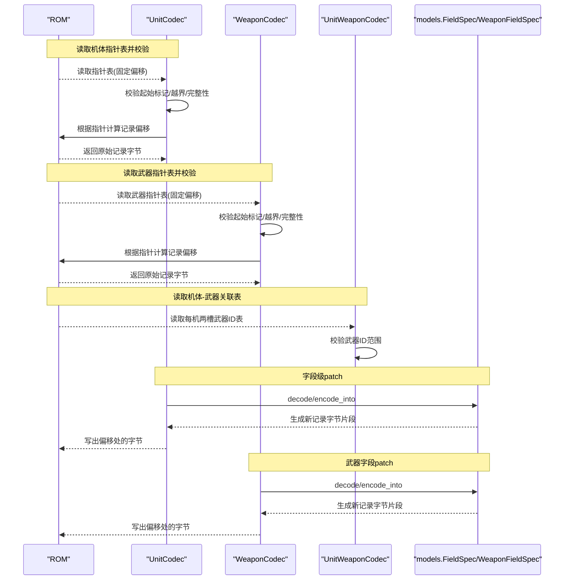
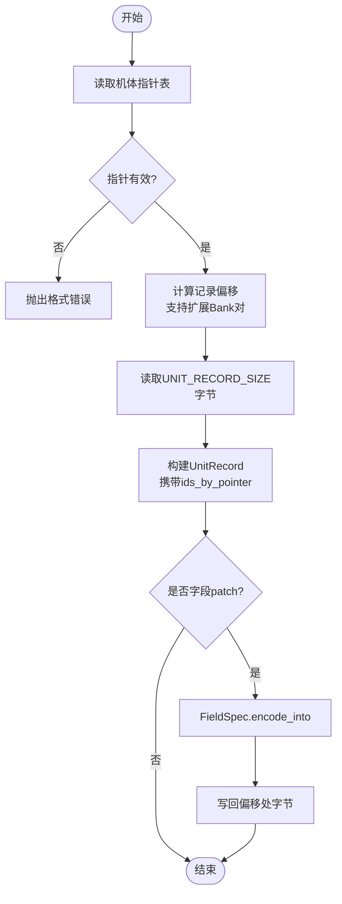
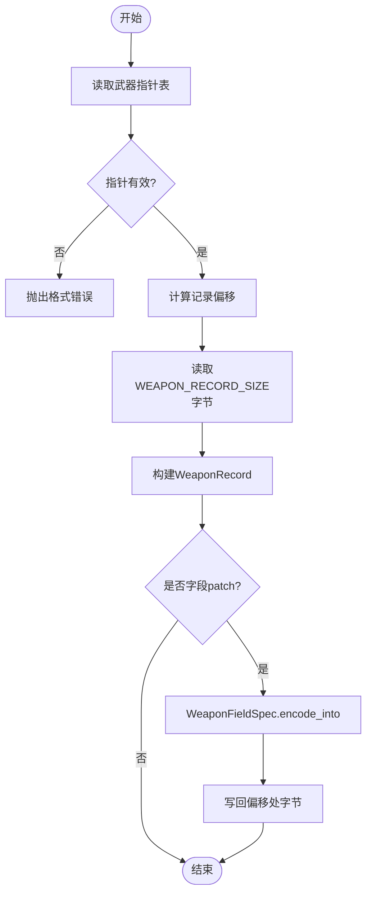
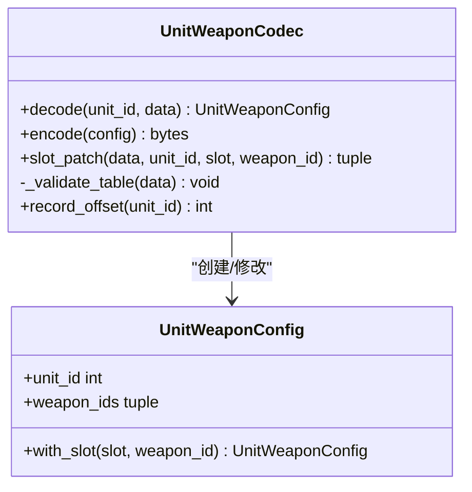
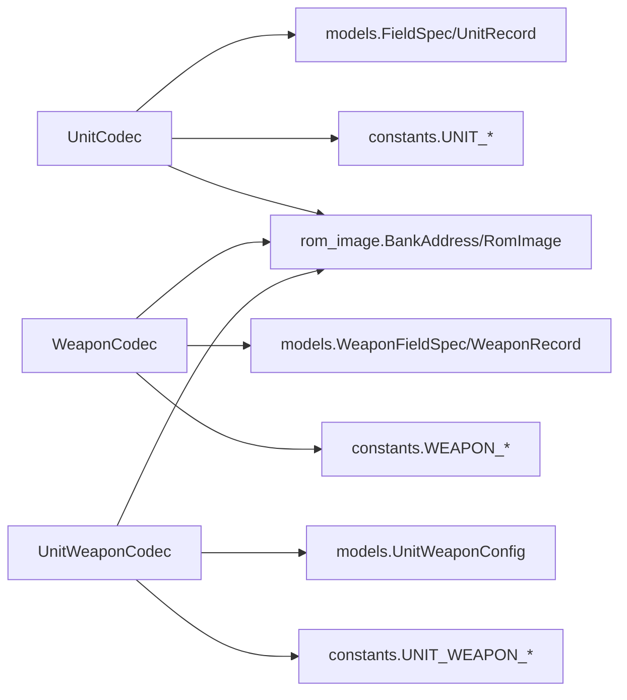

# 机体武器编解码器

<cite>
**本文引用的文件**
- [unit.py](file://src/fc_editor/codecs/unit.py)
- [weapon.py](file://src/fc_editor/codecs/weapon.py)
- [unit_weapon.py](file://src/fc_editor/codecs/unit_weapon.py)
- [models.py](file://src/fc_editor/models.py)
- [constants.py](file://src/fc_editor/constants.py)
- [__init__.py](file://src/fc_editor/codecs/__init__.py)
</cite>

## 目录
1. [简介](#简介)
2. [项目结构](#项目结构)
3. [核心组件](#核心组件)
4. [架构总览](#架构总览)
5. [详细组件分析](#详细组件分析)
6. [依赖关系分析](#依赖关系分析)
7. [性能与一致性](#性能与一致性)
8. [故障排查指南](#故障排查指南)
9. [结论](#结论)
10. [附录：读写示例与修改指南](#附录读写示例与修改指南)

## 简介
本文件系统性说明 FC 游戏“第二次机器人大战”（DC）中机体与武器的编解码机制，覆盖以下要点：
- UnitCodec、WeaponCodec、UnitWeaponCodec 的数据格式定义与字段映射。
- 指针表读取、校验与偏移计算规则，含扩展 Bank 对处理。
- 机体属性（HP、攻击力、防御力等）的编码规则与成长曲线配置。
- 武器伤害相关字段与命中/射程的配置方式。
- 机体与武器的关联存储格式（每机两个武器槽）。
- 提供可操作的读写步骤与修改建议（以路径引用代替具体代码片段）。

## 项目结构
与机体/武器编解码直接相关的模块位于 fc_editor.codecs 包内，并通过 __init__.py 统一导出；数据模型与常量分别集中在 models.py 与 constants.py。

图表来源
- [__init__.py:1-47](file://src/fc_editor/codecs/__init__.py#L1-L47)
- [unit.py:1-120](file://src/fc_editor/codecs/unit.py#L1-L120)
- [weapon.py:1-90](file://src/fc_editor/codecs/weapon.py#L1-L90)
- [unit_weapon.py:1-79](file://src/fc_editor/codecs/unit_weapon.py#L1-L79)
- [models.py:1-200](file://src/fc_editor/models.py#L1-L200)
- [models.py:200-426](file://src/fc_editor/models.py#L200-L426)
- [constants.py:1-69](file://src/fc_editor/constants.py#L1-L69)

章节来源
- [__init__.py:1-47](file://src/fc_editor/codecs/__init__.py#L1-L47)
- [constants.py:1-69](file://src/fc_editor/constants.py#L1-L69)

## 核心组件
- UnitCodec：负责读取并解析 128 条机体记录及其指针表，支持按字段原地 patch 与往返校验。
- WeaponCodec：负责读取并解析 192 条武器记录及其指针表，提供只读解码与字段 patch。
- UnitWeaponCodec：负责读取并解析每条机体的两个武器槽位（直接武器 ID），并进行范围校验与槽位替换。

章节来源
- [unit.py:14-120](file://src/fc_editor/codecs/unit.py#L14-L120)
- [weapon.py:13-90](file://src/fc_editor/codecs/weapon.py#L13-L90)
- [unit_weapon.py:11-79](file://src/fc_editor/codecs/unit_weapon.py#L11-L79)

## 架构总览
下图展示从 ROM 到内存对象再到字段级写入的整体流程，包括指针表解析、记录定位、字段编解码与回写。

图表来源
- [unit.py:42-115](file://src/fc_editor/codecs/unit.py#L42-L115)
- [weapon.py:20-85](file://src/fc_editor/codecs/weapon.py#L20-L85)
- [unit_weapon.py:30-79](file://src/fc_editor/codecs/unit_weapon.py#L30-L79)
- [models.py:13-58](file://src/fc_editor/models.py#L13-L58)
- [models.py:205-242](file://src/fc_editor/models.py#L205-L242)

## 详细组件分析

### UnitCodec：机体记录编解码
- 指针表
  - 位置与大小由 profile.unit_pointer_table_offset 与 unit_count 决定，读取后校验首项为 0，并逐项验证记录偏移不越界且不在指针表自身范围内。
  - 支持 pair_first_bank 模式：当指针落在 0x8000–0xBFFF 区间时，视为扩展 Bank 对中的相对地址，通过公式转换为文件偏移。
- 记录定位
  - record_offset_from_pointer：非扩展模式下使用 BankAddress 将 PRG Bank + 窗口基址映射为文件偏移；扩展模式下使用配对 Bank 计算。
  - record_offset(unit_id)：基于 pointers[unit_id] 得到记录在 ROM 中的绝对偏移。
- 记录编解码
  - decode_record：按 UNIT_RECORD_SIZE 读取 raw 字节，构造 UnitRecord，并附带共享同一指针的多 ID 列表 ids_by_pointer。
  - encode_record：直接返回记录的原始字节，保证无损往返。
  - field_patch：通过 FieldSpec 的 encode_into 将指定字段值写回对应偏移，返回 (offset, before, after)。
- 往返校验
  - round_trip_record：确保 decode→encode 结果与原字节一致。

图表来源
- [unit.py:42-115](file://src/fc_editor/codecs/unit.py#L42-L115)

章节来源
- [unit.py:14-120](file://src/fc_editor/codecs/unit.py#L14-L120)
- [models.py:13-58](file://src/fc_editor/models.py#L13-L58)
- [models.py:165-183](file://src/fc_editor/models.py#L165-L183)
- [constants.py:12-16](file://src/fc_editor/constants.py#L12-L16)

### WeaponCodec：武器记录编解码
- 指针表
  - 位置与数量由 profile.weapon_pointer_table_offset 与 weapon_pointer_count 决定，校验首项为 0，并逐项检查记录偏移合法性。
- 记录定位
  - record_offset_from_pointer：通过武器数据 PRG Bank 与窗口基址计算文件偏移。
  - record_offset(weapon_id)：基于 pointers[weapon_id] 得到记录偏移。
- 记录编解码
  - decode_record：按 WEAPON_RECORD_SIZE 读取 raw 字节，构造 WeaponRecord。
  - encode_record：直接返回原始字节，保证无损往返。
  - field_patch：通过 WeaponFieldSpec 的 encode_into 将指定字段值写回对应偏移，返回 (offset, before, after)。
- 往返校验
  - round_trip_record：确保 decode→encode 结果与原字节一致。

图表来源
- [weapon.py:20-85](file://src/fc_editor/codecs/weapon.py#L20-L85)

章节来源
- [weapon.py:13-90](file://src/fc_editor/codecs/weapon.py#L13-L90)
- [models.py:205-242](file://src/fc_editor/models.py#L205-L242)
- [models.py:185-203](file://src/fc_editor/models.py#L185-L203)
- [constants.py:17-20](file://src/fc_editor/constants.py#L17-L20)

### UnitWeaponCodec：机体-武器关联表
- 表结构与校验
  - 每机占用两个连续字节（UNIT_WEAPON_SLOT_COUNT=2），表起始于 profile.unit_weapon_table_offset。
  - 初始化时对全表进行扫描：检查每个武器 ID 小于 weapon_count，否则抛出格式错误。
- 编解码
  - decode：读取 unit_id 对应的两字节，构造 UnitWeaponConfig(unit_id, (w0, w1))。
  - encode：直接返回两字节武器 ID。
  - slot_patch：替换第 slot 个槽位的武器 ID，返回 (offset, before_byte, after_byte)。

图表来源
- [unit_weapon.py:11-79](file://src/fc_editor/codecs/unit_weapon.py#L11-L79)
- [models.py:288-307](file://src/fc_editor/models.py#L288-L307)

章节来源
- [unit_weapon.py:11-79](file://src/fc_editor/codecs/unit_weapon.py#L11-L79)
- [models.py:288-307](file://src/fc_editor/models.py#L288-L307)
- [constants.py:22-23](file://src/fc_editor/constants.py#L22-L23)

### 数据模型与字段映射

#### 机体字段（UNIT_FIELDS）
- 关键字段与含义（节选）
  - movement/speed/strength/defense：移动力、速度、强度、防卫，均为 1 字节。
  - hp：基础 HP，2 字节小端。
  - terrain：地形适应低两位（0空/1陆/2海/3保留）。
  - special：完整特技字节。
  - experience：击坠经验基值。
  - speed_growth/strength_growth/defense_growth/hp_growth：升级时累加的成长曲线 ID。
- 编码细节
  - FieldSpec.decode/encode_into 负责按 record_offset 与 width 进行小端读写，支持 mask/shift 掩码位操作。
  - 部分字段带 range 校验（minimum/maximum）。

章节来源
- [models.py:13-58](file://src/fc_editor/models.py#L13-L58)
- [models.py:61-108](file://src/fc_editor/models.py#L61-L108)
- [models.py:165-183](file://src/fc_editor/models.py#L165-L183)

#### 武器字段（WEAPON_FIELDS）
- 关键字段与含义（节选）
  - max_range：最大射程，低半字节+1，用于战斗代码距离上限判断。
  - hit：命中率参数，直接进入命中计算。
  - power_air/power_land/power_sea：对空/对陆/对海的攻击值。
- 编码细节
  - WeaponFieldSpec.decode/encode_into 支持 value_bias（如 max_range 的 +1 偏置）与 mask/shift 位域操作。

章节来源
- [models.py:205-242](file://src/fc_editor/models.py#L205-L242)
- [models.py:245-285](file://src/fc_editor/models.py#L245-L285)
- [models.py:185-203](file://src/fc_editor/models.py#L185-L203)

### 指针表与偏移计算
- 机体指针表
  - 起始偏移：profile.unit_pointer_table_offset；长度：unit_count*2。
  - 首项必须为 0；后续每项需能映射到合法记录区域且不落入指针表自身。
  - 支持扩展 Bank 对：当指针在 0x8000–0xBFFF 时，使用 pair_first_bank 计算实际文件偏移。
- 武器指针表
  - 起始偏移：profile.weapon_pointer_table_offset；长度：weapon_pointer_count*2。
  - 首项必须为 0；后续每项需能映射到合法记录区域。
- 机体-武器关联表
  - 起始偏移：profile.unit_weapon_table_offset；每机 2 字节；所有武器 ID 必须小于 weapon_count。

章节来源
- [unit.py:42-77](file://src/fc_editor/codecs/unit.py#L42-L77)
- [weapon.py:20-46](file://src/fc_editor/codecs/weapon.py#L20-L46)
- [unit_weapon.py:30-48](file://src/fc_editor/codecs/unit_weapon.py#L30-L48)
- [constants.py:12-23](file://src/fc_editor/constants.py#L12-L23)

## 依赖关系分析
- UnitCodec 依赖
  - constants：UNIT_RECORD_SIZE、UNIT_POINTER_TABLE_OFFSET、UNIT_DATA_PRG_BANK 等。
  - models：UNIT_FIELD_BY_KEY、UnitRecord、FieldSpec。
  - rom_image：BankAddress、RomImage（用于 PRG Bank 与窗口基址转换）。
- WeaponCodec 依赖
  - constants：WEAPON_RECORD_SIZE、WEAPON_POINTER_TABLE_OFFSET、WEAPON_DATA_PRG_BANK 等。
  - models：WEAPON_FIELD_BY_KEY、WeaponRecord、WeaponFieldSpec。
  - rom_image：BankAddress、RomImage。
- UnitWeaponCodec 依赖
  - constants：UNIT_WEAPON_TABLE_OFFSET、UNIT_WEAPON_SLOT_COUNT。
  - models：UnitWeaponConfig。
  - rom_image：RomImage。

图表来源
- [unit.py:1-120](file://src/fc_editor/codecs/unit.py#L1-L120)
- [weapon.py:1-90](file://src/fc_editor/codecs/weapon.py#L1-L90)
- [unit_weapon.py:1-79](file://src/fc_editor/codecs/unit_weapon.py#L1-L79)
- [models.py:1-200](file://src/fc_editor/models.py#L1-L200)
- [models.py:200-426](file://src/fc_editor/models.py#L200-L426)
- [constants.py:1-69](file://src/fc_editor/constants.py#L1-L69)

章节来源
- [unit.py:1-120](file://src/fc_editor/codecs/unit.py#L1-L120)
- [weapon.py:1-90](file://src/fc_editor/codecs/weapon.py#L1-L90)
- [unit_weapon.py:1-79](file://src/fc_editor/codecs/unit_weapon.py#L1-L79)
- [models.py:1-200](file://src/fc_editor/models.py#L1-L200)
- [models.py:200-426](file://src/fc_editor/models.py#L200-L426)
- [constants.py:1-69](file://src/fc_editor/constants.py#L1-L69)

## 性能与一致性
- 时间复杂度
  - 指针表解析：O(N)，N 为条目数（机体 128、武器 192）。
  - 单记录解码/编码：O(1)，仅涉及固定长度切片与 struct/dataclass 操作。
  - 字段 patch：O(1)，按字段宽度写入。
- 空间复杂度
  - 指针表与记录均以最小必要缓冲加载，避免额外拷贝。
- 一致性保障
  - 指针表首项校验、记录边界校验、武器 ID 范围校验。
  - round_trip_record 确保编解码无损。
  - FieldSpec/WeaponFieldSpec 的 minimum/maximum/value_bias/mask/shift 保证数值语义正确。

## 故障排查指南
- 常见错误与定位
  - “指针表不完整/起始标记不正确”：检查 profile 中的指针表偏移与计数是否正确，或 ROM 是否被破坏。
  - “记录超出支持区域/不完整”：确认指针指向的 PRG Bank 与窗口基址配置正确，且记录长度符合 UNIT_RECORD_SIZE/WEAPON_RECORD_SIZE。
  - “无效武器 ID”：检查 UnitWeaponCodec 的表项是否越界（>= weapon_count）。
  - “未知机体记录指针”：尝试修复指针表或重建 ids_by_pointer。
- 调试建议
  - 使用 round_trip_record 快速验证某条记录是否可逆。
  - 打印 field_patch 返回的 (offset, before, after) 对比修改前后字节。
  - 对于扩展 Bank 对场景，核对 pair_first_bank 设置与指针范围。

章节来源
- [unit.py:42-115](file://src/fc_editor/codecs/unit.py#L42-L115)
- [weapon.py:20-85](file://src/fc_editor/codecs/weapon.py#L20-L85)
- [unit_weapon.py:30-79](file://src/fc_editor/codecs/unit_weapon.py#L30-L79)

## 结论
本编解码体系以“指针表 + 定长记录 + 字段规范”为核心，实现了机体与武器数据的稳定读写与局部修改。通过 FieldSpec/WeaponFieldSpec 的通用编解码能力，配合严格的指针与范围校验，既保证了数据完整性，又提供了灵活的字段级 patch 能力。结合 UnitWeaponCodec 的两槽武器配置，形成了完整的“机体—武器”关联管理方案。

## 附录：读写示例与修改指南

### 读取与修改机体属性（以 HP、速度、防卫为例）
- 读取
  - 使用 UnitCodec.decode_record(unit_id) 获取 UnitRecord。
  - 通过 UnitRecord.get("hp"/"speed"/"defense") 读取当前值。
- 修改
  - 调用 UnitCodec.field_patch(data, unit_id, "hp", new_hp) 获得 (offset, before, after)。
  - 将 after 写回 ROM 的 offset 处。
- 参考路径
  - [unit.py:86-115](file://src/fc_editor/codecs/unit.py#L86-L115)
  - [models.py:61-108](file://src/fc_editor/models.py#L61-L108)
  - [models.py:165-183](file://src/fc_editor/models.py#L165-L183)

### 读取与修改武器配置（射程、命中、攻击值）
- 读取
  - 使用 WeaponCodec.decode_record(weapon_id) 获取 WeaponRecord。
  - 通过 WeaponRecord.get("max_range"/"hit"/"power_land"/...) 读取当前值。
- 修改
  - 调用 WeaponCodec.field_patch(data, weapon_id, "max_range", new_range) 获得 (offset, before, after)。
  - 将 after 写回 ROM 的 offset 处。
- 参考路径
  - [weapon.py:55-85](file://src/fc_editor/codecs/weapon.py#L55-L85)
  - [models.py:245-285](file://src/fc_editor/models.py#L245-L285)
  - [models.py:185-203](file://src/fc_editor/models.py#L185-L203)

### 修改机体武器槽位（每机两槽）
- 读取
  - 使用 UnitWeaponCodec.decode(unit_id) 获取 UnitWeaponConfig，得到 (w0, w1)。
- 修改
  - 调用 UnitWeaponCodec.slot_patch(data, unit_id, slot, new_weapon_id) 获得 (offset, before, after)。
  - 将 after 写回 ROM 的 offset 处。
- 参考路径
  - [unit_weapon.py:50-79](file://src/fc_editor/codecs/unit_weapon.py#L50-L79)
  - [models.py:288-307](file://src/fc_editor/models.py#L288-L307)

### 指针表与偏移计算要点
- 机体指针表
  - 读取偏移：profile.unit_pointer_table_offset；长度：unit_count*2。
  - 首项必须为 0；后续指针需映射到合法记录区。
  - 扩展 Bank 对：指针在 0x8000–0xBFFF 时使用 pair_first_bank 计算文件偏移。
- 武器指针表
  - 读取偏移：profile.weapon_pointer_table_offset；长度：weapon_pointer_count*2。
  - 首项必须为 0；后续指针需映射到合法记录区。
- 参考路径
  - [unit.py:42-77](file://src/fc_editor/codecs/unit.py#L42-L77)
  - [weapon.py:20-46](file://src/fc_editor/codecs/weapon.py#L20-L46)
  - [constants.py:12-23](file://src/fc_editor/constants.py#L12-L23)