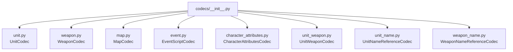
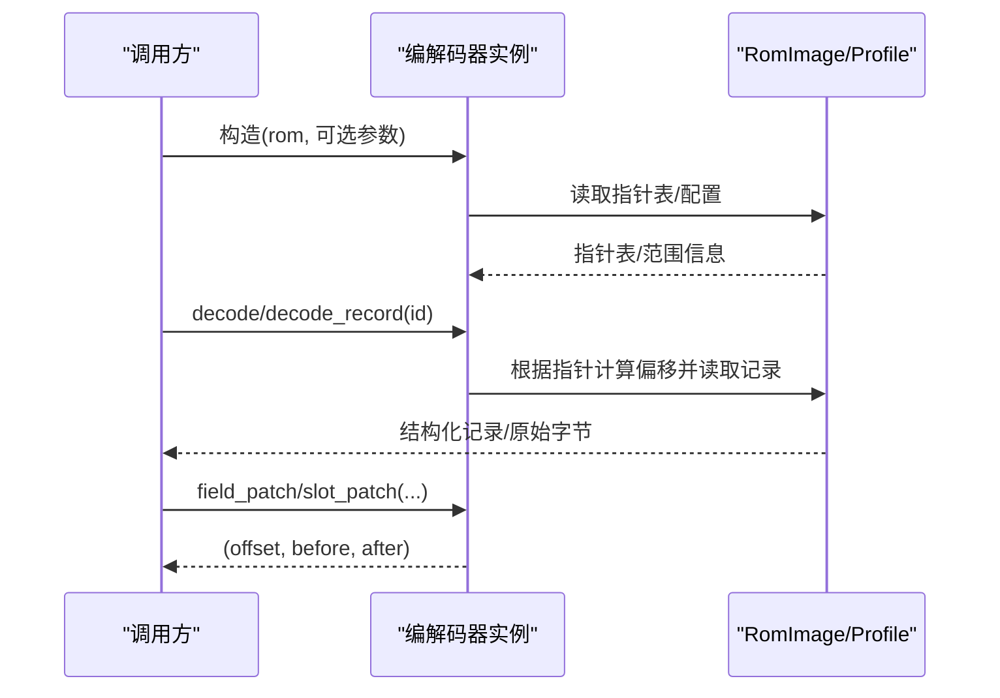
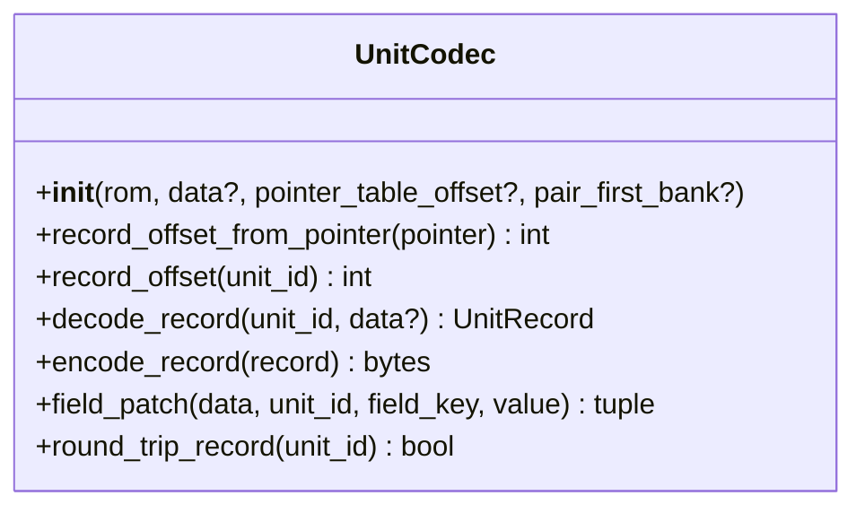
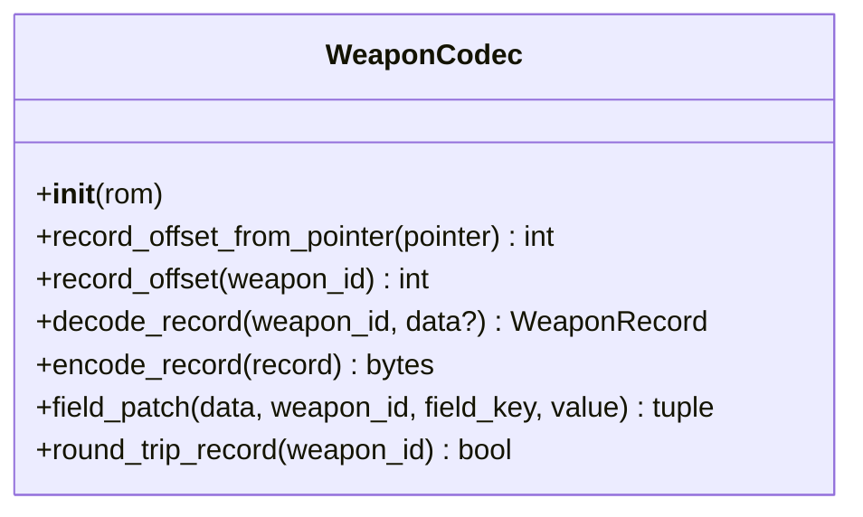
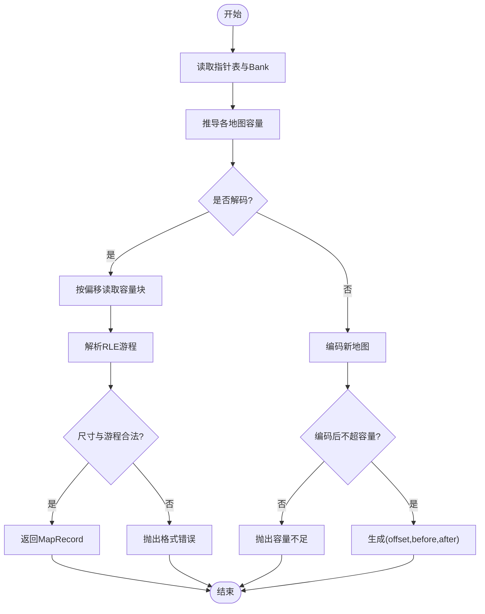
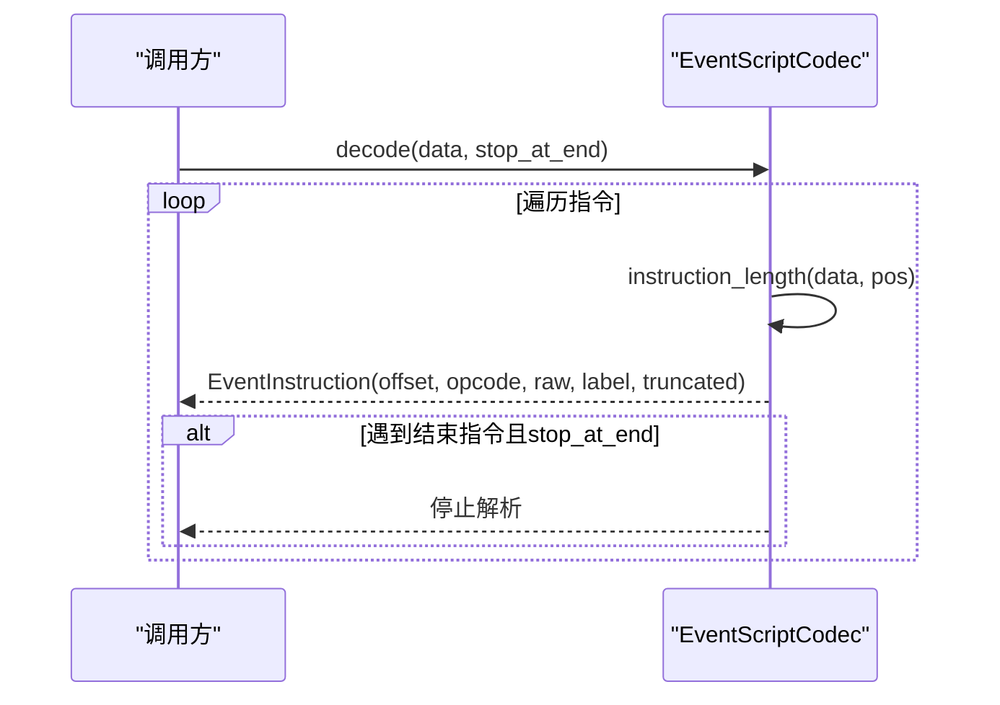
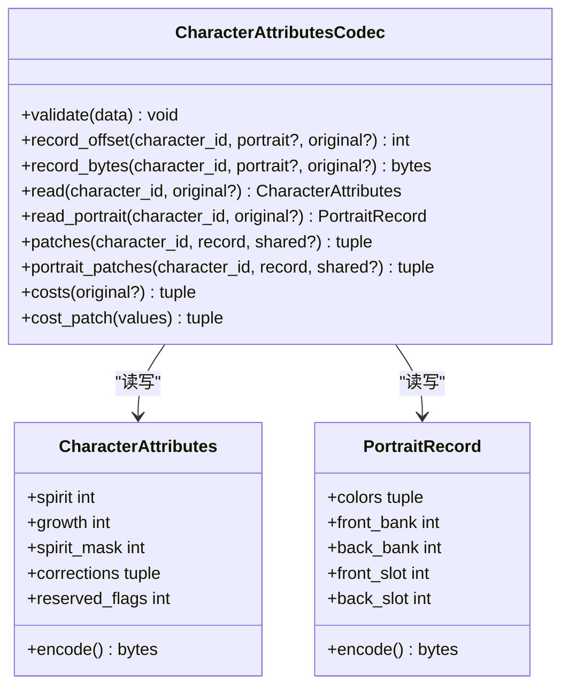
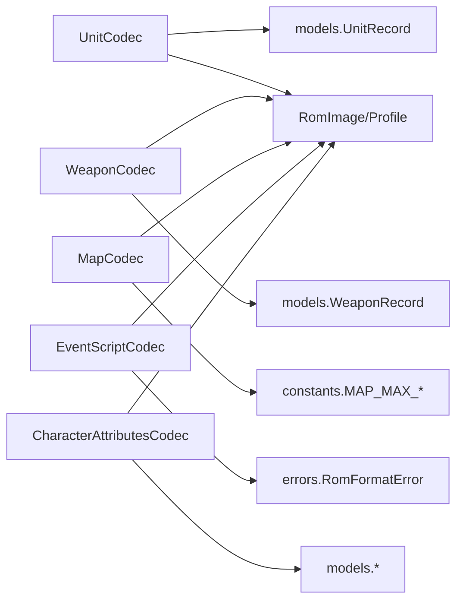

# 编解码器API

<cite>
**本文引用的文件**
- [src/fc_editor/codecs/__init__.py](file://src/fc_editor/codecs/__init__.py)
- [src/fc_editor/codecs/unit.py](file://src/fc_editor/codecs/unit.py)
- [src/fc_editor/codecs/weapon.py](file://src/fc_editor/codecs/weapon.py)
- [src/fc_editor/codecs/map.py](file://src/fc_editor/codecs/map.py)
- [src/fc_editor/codecs/unit_weapon.py](file://src/fc_editor/codecs/unit_weapon.py)
- [src/fc_editor/codecs/unit_name.py](file://src/fc_editor/codecs/unit_name.py)
- [src/fc_editor/codecs/weapon_name.py](file://src/fc_editor/codecs/weapon_name.py)
- [src/fc_editor/codecs/event.py](file://src/fc_editor/codecs/event.py)
- [src/fc_editor/codecs/character_attributes.py](file://src/fc_editor/codecs/character_attributes.py)
</cite>

## 目录
1. [简介](#简介)
2. [项目结构](#项目结构)
3. [核心组件](#核心组件)
4. [架构总览](#架构总览)
5. [详细组件分析](#详细组件分析)
6. [依赖关系分析](#依赖关系分析)
7. [性能考虑](#性能考虑)
8. [故障排查指南](#故障排查指南)
9. [结论](#结论)
10. [附录：自定义编解码器开发指南](#附录：自定义编解码器开发指南)

## 简介
本文件为 FC 游戏修改器的“编解码器 API”完整文档，聚焦于 ROM 中各类数据的读取与写入接口。内容覆盖基类约定、具体实现（UnitCodec、WeaponCodec、MapCodec、EventScriptCodec、CharacterAttributesCodec 等），以及指针表处理、数据格式规范、错误处理机制与扩展方法。同时提供自定义编解码器的开发指南，包括接口要求、数据验证规则、性能优化建议与使用示例路径。

## 项目结构
编解码器模块位于 src/fc_editor/codecs，采用按数据类型划分的模块化组织方式。每个文件对应一类资源或数据结构，并通过 __init__.py 统一导出常用类型与类，便于上层调用。

图表来源
- [src/fc_editor/codecs/__init__.py:1-47](file://src/fc_editor/codecs/__init__.py#L1-L47)

章节来源
- [src/fc_editor/codecs/__init__.py:1-47](file://src/fc_editor/codecs/__init__.py#L1-L47)

## 核心组件
本节概述各编解码器的职责与关键能力：
- UnitCodec：读取/校验机体指针表与固定长度记录，支持字段级补丁。
- WeaponCodec：读取/校验武器指针表与固定长度记录，支持字段级补丁。
- MapCodec：解码/编码 4-bit 地形 RLE 地图，计算容量、生成替换补丁。
- EventScriptCodec：无损解析事件脚本指令序列，支持指令长度推断与终止条件。
- CharacterAttributesCodec：人物属性与头像记录的读写、共享记录去重与池化重排。
- UnitWeaponCodec：每单位两个直接武器槽的编解码与单槽补丁。
- UnitNameReferenceCodec / WeaponNameReferenceCodec：通过重定向到已有本地化名称记录进行安全编辑。

章节来源
- [src/fc_editor/codecs/unit.py:14-120](file://src/fc_editor/codecs/unit.py#L14-L120)
- [src/fc_editor/codecs/weapon.py:13-90](file://src/fc_editor/codecs/weapon.py#L13-L90)
- [src/fc_editor/codecs/map.py:16-228](file://src/fc_editor/codecs/map.py#L16-L228)
- [src/fc_editor/codecs/event.py:49-109](file://src/fc_editor/codecs/event.py#L49-L109)
- [src/fc_editor/codecs/character_attributes.py:78-237](file://src/fc_editor/codecs/character_attributes.py#L78-L237)
- [src/fc_editor/codecs/unit_weapon.py:11-79](file://src/fc_editor/codecs/unit_weapon.py#L11-L79)
- [src/fc_editor/codecs/unit_name.py:9-90](file://src/fc_editor/codecs/unit_name.py#L9-L90)
- [src/fc_editor/codecs/weapon_name.py:9-120](file://src/fc_editor/codecs/weapon_name.py#L9-L120)

## 架构总览
编解码器以 RomImage/Profile 提供的 ROM 视图与配置为依据，完成指针表解析、记录定位、数据解码/编码与补丁生成。多数组件遵循以下模式：
- 初始化时读取并校验指针表/起始标记/范围限制。
- 提供 record_offset/pointer_to_file_offset 将 CPU 指针映射到文件偏移。
- decode/decode_record 返回结构化对象或原始字节块。
- encode/encode_record 执行无损编码。
- field_patch/slot_patch/replacement_patch 生成最小差异补丁元组 (offset, before, after)。
- round_trip_* 用于自测一致性。

图表来源
- [src/fc_editor/codecs/unit.py:17-93](file://src/fc_editor/codecs/unit.py#L17-L93)
- [src/fc_editor/codecs/weapon.py:16-66](file://src/fc_editor/codecs/weapon.py#L16-L66)
- [src/fc_editor/codecs/map.py:19-173](file://src/fc_editor/codecs/map.py#L19-L173)

## 详细组件分析

### UnitCodec（机体编解码器）
- 职责：解析 128 项机体指针表与固定长度记录；支持字段级补丁与往返校验。
- 指针表处理：
  - 读取指针表并校验起始标记与范围。
  - 支持扩展 Bank 对场景下的 pair_first_bank 映射。
- 数据格式：
  - 每条记录长度为常量 UNIT_RECORD_SIZE。
  - 字段键值映射由 models 提供，encode_into 负责写入。
- 关键方法：
  - record_offset_from_pointer(pointer) → 文件偏移
  - record_offset(unit_id) → 文件偏移
  - decode_record(unit_id, data?) → UnitRecord
  - encode_record(record) → bytes
  - field_patch(data, unit_id, field_key, value) → (offset, before, after)
  - round_trip_record(unit_id) → bool
- 错误处理：
  - 指针无效、记录越界、记录不完整均抛出 RomFormatError。
  - 索引越界抛出 IndexError。

图表来源
- [src/fc_editor/codecs/unit.py:14-120](file://src/fc_editor/codecs/unit.py#L14-L120)

章节来源
- [src/fc_editor/codecs/unit.py:14-120](file://src/fc_editor/codecs/unit.py#L14-L120)

### WeaponCodec（武器编解码器）
- 职责：只读解析 192 项武器指针表与固定长度记录；支持字段级补丁。
- 指针表处理：
  - 读取并校验起始标记与范围。
  - 通过 BankAddress 将 CPU 指针转为文件偏移。
- 数据格式：
  - 每条记录长度为常量 WEAPON_RECORD_SIZE。
- 关键方法：
  - record_offset_from_pointer(pointer) → 文件偏移
  - record_offset(weapon_id) → 文件偏移
  - decode_record(weapon_id, data?) → WeaponRecord
  - encode_record(record) → bytes
  - field_patch(data, weapon_id, field_key, value) → (offset, before, after)
  - round_trip_record(weapon_id) → bool
- 错误处理：
  - 指针无效、记录越界、记录不完整抛出 RomFormatError。
  - ID 越界抛出 IndexError。

图表来源
- [src/fc_editor/codecs/weapon.py:13-90](file://src/fc_editor/codecs/weapon.py#L13-L90)

章节来源
- [src/fc_editor/codecs/weapon.py:13-90](file://src/fc_editor/codecs/weapon.py#L13-L90)

### MapCodec（地图编解码器）
- 职责：解码/编码 4-bit 地形 RLE 地图；计算容量；生成替换补丁；语义哈希。
- 指针表与容量：
  - 支持标准存储区与扩展 Bank 表两种模式。
  - 自动推导相邻指针间容量或按 Bank 内排序推导容量。
- 数据格式：
  - 头部 width, height；随后为 RLE 游程编码，游程长度上限 16。
- 关键方法：
  - _read_pointers/_read_banks/_build_capacities
  - pointer_to_file_offset(map_id, pointer) → 文件偏移
  - record_offset(map_id) → 文件偏移
  - decode(map_id, data?) → MapRecord
  - encode(width, height, tiles) → bytes
  - semantic_digest(record) → str
  - replacement_patch(data, map_id, width, height, tiles) → (offset, before, after)
  - round_trip(map_id) → bool
- 错误处理：
  - 指针表不完整、起始标记不正确、指针越界、RLE 游程越界、容量无效等均抛出 RomFormatError。
  - 宽高/图块值非法抛出 ValueError。

图表来源
- [src/fc_editor/codecs/map.py:19-228](file://src/fc_editor/codecs/map.py#L19-L228)

章节来源
- [src/fc_editor/codecs/map.py:16-228](file://src/fc_editor/codecs/map.py#L16-L228)

### EventScriptCodec（事件脚本编解码器）
- 职责：无损解析固定 Bank 的事件 VM 脚本指令序列。
- 指令长度推断：
  - 基于 opcode 表与标志位推断指令长度。
  - 遇到未知 opcode 仍按最小长度推进，避免崩溃。
- 关键方法：
  - instruction_length(data, offset) → int
  - decode(data, stop_at_end=True) → tuple[EventInstruction]
- 错误处理：
  - 偏移越界抛出 IndexError。
  - 截断指令会标记 truncated。

图表来源
- [src/fc_editor/codecs/event.py:49-109](file://src/fc_editor/codecs/event.py#L49-L109)

章节来源
- [src/fc_editor/codecs/event.py:49-109](file://src/fc_editor/codecs/event.py#L49-L109)

### CharacterAttributesCodec（人物属性与头像）
- 职责：当前 DC 表格的人物属性与头像记录读写；支持共享记录去重与池化重排。
- 数据格式：
  - 属性记录包含精神值、成长、掩码、修正字段与保留标志。
  - 头像记录包含颜色、前后图库 bank/slot。
- 关键方法：
  - validate(data) 校验已验证上下文代码片段与入口。
  - record_offset(character_id, portrait?, original?) → 文件偏移
  - record_bytes(character_id, portrait?, original?) → bytes
  - read(character_id, original?) → CharacterAttributes
  - read_portrait(character_id, original?) → PortraitRecord
  - patches(character_id, record, shared?) → BytePatch[]
  - portrait_patches(character_id, record, shared?) → BytePatch[]
  - costs()/cost_patch() 管理精神消耗表。
- 错误处理：
  - 指针超出数据池、记录越界、池容量不足等抛出 RomFormatError/ValueError。
  - 未验证 ROM 格式抛出 RomFormatError。

图表来源
- [src/fc_editor/codecs/character_attributes.py:30-237](file://src/fc_editor/codecs/character_attributes.py#L30-L237)

章节来源
- [src/fc_editor/codecs/character_attributes.py:30-237](file://src/fc_editor/codecs/character_attributes.py#L30-L237)

### UnitWeaponCodec（单位武器槽）
- 职责：每单位两个直接武器槽的编解码与单槽补丁。
- 关键方法：
  - record_offset(unit_id) → 文件偏移
  - decode(unit_id, data?) → UnitWeaponConfig
  - encode(config) → bytes
  - slot_patch(data, unit_id, slot, weapon_id) → (offset, before, after)
- 错误处理：
  - 表越界、引用无效武器、ID 越界抛出 RomFormatError/ValueError/IndexError。

章节来源
- [src/fc_editor/codecs/unit_weapon.py:11-79](file://src/fc_editor/codecs/unit_weapon.py#L11-L79)

### UnitNameReferenceCodec / WeaponNameReferenceCodec（名称重定向）
- 职责：通过重定向到已有本地化名称记录进行安全编辑，避免破坏数据布局。
- 关键方法：
  - pointer_offset/pointer 获取与校验指针。
  - reference_patch(data, id, source_id) → (offset, before, after)
  - source_ids(pointer) 反向查找共享源。
  - WeaponNameReferenceCodec 额外提供 capacity 计算与 round_trip 校验。
- 错误处理：
  - 指针表不完整、起始标记不正确、指针越界抛出 RomFormatError。
  - ID 越界抛出 IndexError/ValueError。

章节来源
- [src/fc_editor/codecs/unit_name.py:9-90](file://src/fc_editor/codecs/unit_name.py#L9-L90)
- [src/fc_editor/codecs/weapon_name.py:9-120](file://src/fc_editor/codecs/weapon_name.py#L9-L120)

## 依赖关系分析
- 外部依赖：
  - RomImage/Profile：提供 ROM 数据与配置（如指针表偏移、计数、存储窗口）。
  - models：定义记录结构与字段映射（如 UnitRecord、WeaponRecord、UNIT_FIELD_BY_KEY 等）。
  - constants：常量（如记录大小、最大地图尺寸等）。
  - errors：统一异常类型（RomFormatError 等）。
- 内部耦合：
  - codecs/__init__.py 集中导出，降低上层导入成本。
  - 各编解码器之间无直接依赖，保持高内聚低耦合。

图表来源
- [src/fc_editor/codecs/unit.py:14-120](file://src/fc_editor/codecs/unit.py#L14-L120)
- [src/fc_editor/codecs/weapon.py:13-90](file://src/fc_editor/codecs/weapon.py#L13-L90)
- [src/fc_editor/codecs/map.py:16-228](file://src/fc_editor/codecs/map.py#L16-L228)
- [src/fc_editor/codecs/event.py:49-109](file://src/fc_editor/codecs/event.py#L49-L109)
- [src/fc_editor/codecs/character_attributes.py:78-237](file://src/fc_editor/codecs/character_attributes.py#L78-L237)

章节来源
- [src/fc_editor/codecs/unit.py:14-120](file://src/fc_editor/codecs/unit.py#L14-L120)
- [src/fc_editor/codecs/weapon.py:13-90](file://src/fc_editor/codecs/weapon.py#L13-L90)
- [src/fc_editor/codecs/map.py:16-228](file://src/fc_editor/codecs/map.py#L16-L228)
- [src/fc_editor/codecs/event.py:49-109](file://src/fc_editor/codecs/event.py#L49-L109)
- [src/fc_editor/codecs/character_attributes.py:78-237](file://src/fc_editor/codecs/character_attributes.py#L78-L237)

## 性能考虑
- 批量操作优先：尽量合并多次 field_patch/slot_patch 为一次应用，减少重复校验与写入。
- 容量预估：在修改地图前先用 encode 估算字节数，避免反复尝试导致失败。
- 共享记录复用：人物属性/头像可通过 shared 选项复用已有记录，减少池重排开销。
- 只读路径：WeaponCodec 为只读设计，适合快速浏览与校验。
- 指令解析：事件脚本解析按指令长度推进，避免回溯，适合大脚本流式处理。

## 故障排查指南
- 常见错误与定位：
  - 指针表不完整/起始标记不正确：检查 Profile 配置与 ROM 版本匹配。
  - 指针越界/记录越界：确认存储窗口与 Bank 映射是否正确。
  - RLE 游程越界/容量不足：检查地图宽高与图块序列合法性。
  - 人物池容量不足：减少修正字段或勾选“同时修改共用记录”。
  - 未验证 ROM 格式：确保 ROM 头/加载代码与已知模板一致。
- 调试建议：
  - 使用 round_trip_* 方法验证编解码一致性。
  - 打印 record_offset/pointer_to_file_offset 结果核对地址转换。
  - 对事件脚本使用 decode 输出指令列表，定位异常指令位置。

章节来源
- [src/fc_editor/codecs/map.py:19-228](file://src/fc_editor/codecs/map.py#L19-L228)
- [src/fc_editor/codecs/character_attributes.py:97-237](file://src/fc_editor/codecs/character_attributes.py#L97-L237)
- [src/fc_editor/codecs/event.py:56-109](file://src/fc_editor/codecs/event.py#L56-L109)

## 结论
本 API 以稳定、可验证的方式暴露 ROM 中关键资源的读写能力，涵盖机体、武器、地图、事件脚本、人物属性与名称重定向等。通过统一的指针表处理、严格的格式校验与最小差异补丁机制，既保证了安全性，也提供了高效的扩展点。建议在新增数据格式时遵循现有模式：先定义记录模型与字段映射，再实现编解码器与校验逻辑，并提供 round_trip 测试用例。

## 附录：自定义编解码器开发指南
- 接口实现要求：
  - 构造函数接收 RomImage/Profile，必要时支持 data 覆盖与可选偏移参数。
  - 实现指针表读取与校验（起始标记、范围限制）。
  - 提供 record_offset/pointer_to_file_offset 将 CPU 指针映射到文件偏移。
  - 实现 decode/decode_record 与 encode/encode_record，保证无损往返。
  - 提供 field_patch/slot_patch/replacement_patch 生成 (offset, before, after) 补丁。
  - 实现 round_trip_* 用于自测。
- 数据验证规则：
  - 严格校验输入范围、长度、对齐与枚举值。
  - 对越界、不完整、非法值抛出明确异常（RomFormatError/ValueError/IndexError）。
- 性能优化建议：
  - 预计算容量与边界，避免重复计算。
  - 对可共享记录进行去重与池化，减少重写范围。
  - 批量应用补丁，减少多次校验与 IO。
- 使用示例路径（不展示代码内容）：
  - 读取并修改地图地形：参考 [src/fc_editor/codecs/map.py:136-196](file://src/fc_editor/codecs/map.py#L136-L196) 的 decode/encode 与 [src/fc_editor/codecs/map.py:203-223](file://src/fc_editor/codecs/map.py#L203-L223) 的 replacement_patch。
  - 修改单位武器槽：参考 [src/fc_editor/codecs/unit_weapon.py:50-79](file://src/fc_editor/codecs/unit_weapon.py#L50-L79) 的 decode/encode/slot_patch。
  - 重定向单位名称：参考 [src/fc_editor/codecs/unit_name.py:68-82](file://src/fc_editor/codecs/unit_name.py#L68-L82) 的 reference_patch。
  - 重定向武器名称：参考 [src/fc_editor/codecs/weapon_name.py:98-112](file://src/fc_editor/codecs/weapon_name.py#L98-L112) 的 reference_patch。
  - 解析事件脚本：参考 [src/fc_editor/codecs/event.py:87-109](file://src/fc_editor/codecs/event.py#L87-L109) 的 decode。
  - 修改人物属性：参考 [src/fc_editor/codecs/character_attributes.py:157-200](file://src/fc_editor/codecs/character_attributes.py#L157-L200) 的 read/patterns 与 [src/fc_editor/codecs/character_attributes.py:202-237](file://src/fc_editor/codecs/character_attributes.py#L202-L237) 的记录重排与补丁生成。