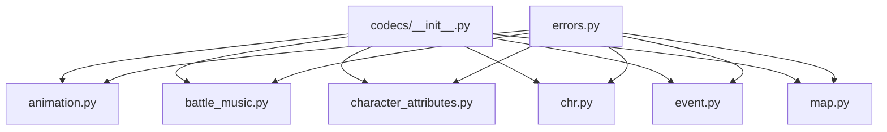
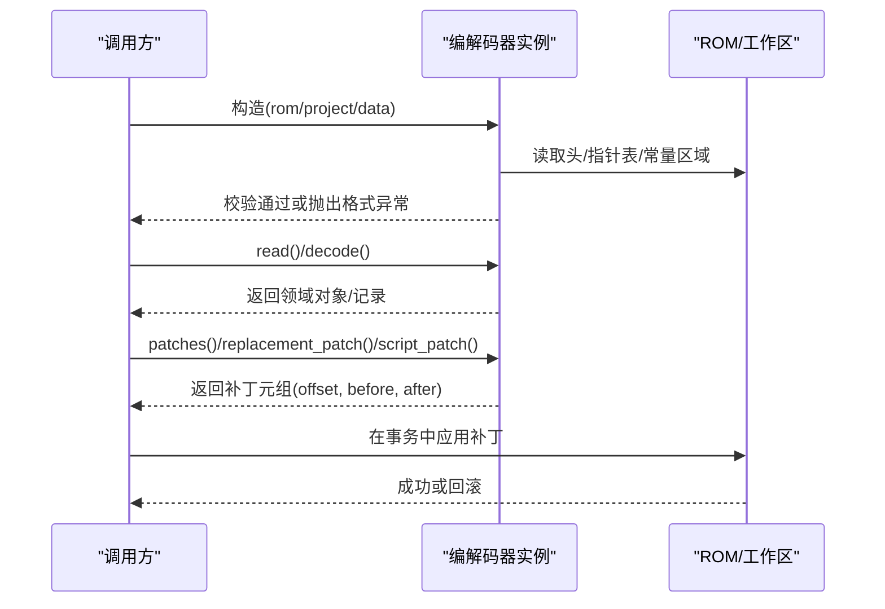
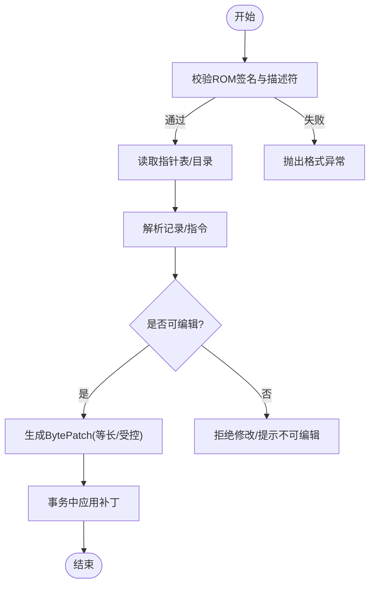
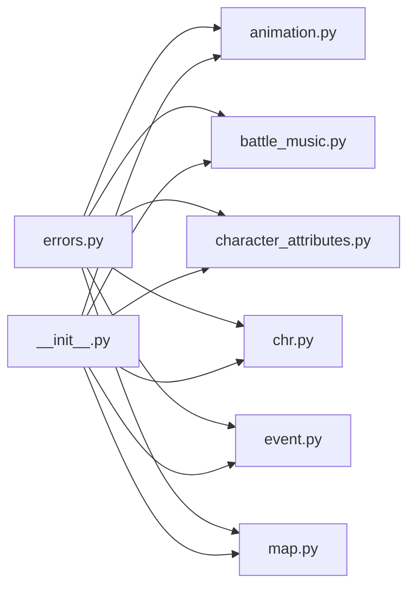

# 编解码器基础接口

<cite>
**本文引用的文件**
- [src/fc_editor/codecs/__init__.py](file://src/fc_editor/codecs/__init__.py)
- [src/fc_editor/codecs/animation.py](file://src/fc_editor/codecs/animation.py)
- [src/fc_editor/codecs/battle_music.py](file://src/fc_editor/codecs/battle_music.py)
- [src/fc_editor/codecs/character_attributes.py](file://src/fc_editor/codecs/character_attributes.py)
- [src/fc_editor/codecs/chr.py](file://src/fc_editor/codecs/chr.py)
- [src/fc_editor/codecs/event.py](file://src/fc_editor/codecs/event.py)
- [src/fc_editor/codecs/map.py](file://src/fc_editor/codecs/map.py)
- [src/fc_editor/errors.py](file://src/fc_editor/errors.py)
</cite>

## 目录
1. [简介](#简介)
2. [项目结构](#项目结构)
3. [核心组件](#核心组件)
4. [架构总览](#架构总览)
5. [详细组件分析](#详细组件分析)
6. [依赖关系分析](#依赖关系分析)
7. [性能考量](#性能考量)
8. [故障排查指南](#故障排查指南)
9. [结论](#结论)
10. [附录：自定义编解码器开发指南](#附录自定义编解码器开发指南)

## 简介
本文件系统化梳理本项目中“编解码器”的基础接口与实现模式，聚焦以下目标：
- 总结 Codec 基类的设计思想与通用约定（读、写、校验、生命周期、错误处理）。
- 说明数据流处理机制（ROM 定位、指针表解析、容量边界检查、等长/有界编辑）。
- 给出配置参数规范与最佳实践。
- 提供创建新编解码器的步骤、必须实现的接口方法、继承与扩展建议、性能优化要点。
- 通过具体代码片段路径展示如何从零构建一个可验证的编解码器类型。

## 项目结构
编解码器模块位于 src/fc_editor/codecs，采用“按资源域划分”的组织方式：每个 .py 文件对应一种 ROM 资源或子系统的编解码逻辑，并通过 __init__.py 统一导出常用类型。

图表来源
- [src/fc_editor/codecs/__init__.py:1-47](file://src/fc_editor/codecs/__init__.py#L1-L47)
- [src/fc_editor/errors.py:1-11](file://src/fc_editor/errors.py#L1-L11)

章节来源
- [src/fc_editor/codecs/__init__.py:1-47](file://src/fc_editor/codecs/__init__.py#L1-L47)

## 核心组件
- 统一的异常体系：RomFormatError、ProjectFormatError、ChangeConflictError，用于表达 ROM 格式不匹配、工程文件异常、并发写入冲突等。
- 各资源域的 Codec：
  - 动画：AnimationCodec，负责动画脚本与规律的只读解析与受控改写。
  - 战斗音乐：BattleMusicCodec，负责攻击/防守主题表的绑定与替换。
  - 人物属性：CharacterAttributesCodec，负责人物属性与头像记录的读取、校验与补丁生成。
  - CHR 图块：ChrCodec，无损编解码 2bpp 图块。
  - 事件脚本：EventScriptCodec，固定 Bank 的事件 VM 指令解析。
  - 地图：MapCodec，4-bit 地形 RLE 地图的解码与容量受限编码。

这些组件共同遵循“先校验、再读取、后生成补丁”的流程，确保对 ROM 的修改在已验证的安全范围内进行。

章节来源
- [src/fc_editor/errors.py:1-11](file://src/fc_editor/errors.py#L1-L11)
- [src/fc_editor/codecs/animation.py:145-328](file://src/fc_editor/codecs/animation.py#L145-L328)
- [src/fc_editor/codecs/battle_music.py:20-100](file://src/fc_editor/codecs/battle_music.py#L20-L100)
- [src/fc_editor/codecs/character_attributes.py:78-237](file://src/fc_editor/codecs/character_attributes.py#L78-L237)
- [src/fc_editor/codecs/chr.py:11-94](file://src/fc_editor/codecs/chr.py#L11-L94)
- [src/fc_editor/codecs/event.py:49-109](file://src/fc_editor/codecs/event.py#L49-L109)
- [src/fc_editor/codecs/map.py:16-228](file://src/fc_editor/codecs/map.py#L16-L228)

## 架构总览
下图展示了典型编解码流程：初始化时进行 ROM 签名/布局校验；读取阶段将原始字节映射为领域模型；写入阶段生成“before/after”补丁并在事务中应用，保证一致性。

图表来源
- [src/fc_editor/codecs/animation.py:145-328](file://src/fc_editor/codecs/animation.py#L145-L328)
- [src/fc_editor/codecs/character_attributes.py:97-237](file://src/fc_editor/codecs/character_attributes.py#L97-L237)
- [src/fc_editor/codecs/map.py:19-228](file://src/fc_editor/codecs/map.py#L19-L228)

## 详细组件分析

### 动画编解码器 AnimationCodec
- 设计要点
  - 构造时校验 NES 头、解释器签名、各资源描述符与目录指针，确保当前 ROM 具备已验证的动画资源。
  - 提供 count/record 读取动画记录，支持别名共享指针。
  - script_patch/rule_patch/call_patch 仅允许在“已验证的可编辑位”上进行等长或受控长度修改，避免破坏控制流。
- 数据流
  - 从指针表解析记录范围，按指令集 decode_script 解析为指令序列，并标记可编辑偏移与取值范围。
  - 生成 BytePatch 前会比对原值，防止并发修改导致覆盖。
- 错误处理
  - 未通过签名校验、越界指针、指令边界变化、超出可编辑范围等均抛出 ValueError/RomFormatError。
- 关键路径参考
  - 构造与校验：[src/fc_editor/codecs/animation.py:145-177](file://src/fc_editor/codecs/animation.py#L145-L177)
  - 记录读取：[src/fc_editor/codecs/animation.py:178-197](file://src/fc_editor/codecs/animation.py#L178-L197)
  - 脚本补丁：[src/fc_editor/codecs/animation.py:199-220](file://src/fc_editor/codecs/animation.py#L199-L220)
  - 规律补丁：[src/fc_editor/codecs/animation.py:222-245](file://src/fc_editor/codecs/animation.py#L222-L245)
  - 调用点补丁：[src/fc_editor/codecs/animation.py:292-317](file://src/fc_editor/codecs/animation.py#L292-L317)

图表来源
- [src/fc_editor/codecs/animation.py:145-328](file://src/fc_editor/codecs/animation.py#L145-L328)

章节来源
- [src/fc_editor/codecs/animation.py:145-328](file://src/fc_editor/codecs/animation.py#L145-L328)

### 战斗音乐编解码器 BattleMusicCodec
- 设计要点
  - 基于 profile 中的 BattleMusicSpec，限定选择器数量与命令集合。
  - decode 读取攻击/防守命令；replacement_patches 生成两个单字节替换补丁。
- 数据流
  - 根据 selector 计算 attacker/defender 表偏移，读取并格式化命令。
- 错误处理
  - 未验证 profile、越界 selector、不支持的命令均抛错。
- 关键路径参考
  - 构造与校验：[src/fc_editor/codecs/battle_music.py:20-33](file://src/fc_editor/codecs/battle_music.py#L20-L33)
  - 解码与替换：[src/fc_editor/codecs/battle_music.py:45-99](file://src/fc_editor/codecs/battle_music.py#L45-L99)

章节来源
- [src/fc_editor/codecs/battle_music.py:20-100](file://src/fc_editor/codecs/battle_music.py#L20-L100)

### 人物属性编解码器 CharacterAttributesCodec
- 设计要点
  - 严格校验 ROM 中人物数据加载代码与入口地址，确保格式一致。
  - 支持读取人物属性与头像记录，生成补丁时优先原地替换，否则重打包到数据池并重建指针表。
  - 提供 costs/cost_patch 与 weapon_extra_* 工具函数。
- 数据流
  - 通过指针表定位记录，依据标志位解析变长修正字段；写入时考虑共享记录与池容量限制。
- 错误处理
  - 指针越界、池容量不足、保留标志非法、代码段不一致等抛出 RomFormatError/ValueError。
- 关键路径参考
  - 构造与校验：[src/fc_editor/codecs/character_attributes.py:97-111](file://src/fc_editor/codecs/character_attributes.py#L97-L111)
  - 偏移与记录读取：[src/fc_editor/codecs/character_attributes.py:112-185](file://src/fc_editor/codecs/character_attributes.py#L112-L185)
  - 补丁生成与重打包：[src/fc_editor/codecs/character_attributes.py:193-237](file://src/fc_editor/codecs/character_attributes.py#L193-L237)

章节来源
- [src/fc_editor/codecs/character_attributes.py:78-237](file://src/fc_editor/codecs/character_attributes.py#L78-L237)

### CHR 图块编解码器 ChrCodec
- 设计要点
  - 无损编解码 2bpp 8x8 图块，支持 tile_bytes/decode_tile/encode_tile/range_bytes。
  - 构造时定位 CHR-ROM 区域并校验大小对齐。
- 数据流
  - 根据 iNES 头计算偏移与大小，逐行提取低/高位平面像素。
- 错误处理
  - 无有效 CHR 区域、非 16 字节倍数、图块不完整等抛出 RomFormatError/ValueError。
- 关键路径参考
  - 构造与定位：[src/fc_editor/codecs/chr.py:11-24](file://src/fc_editor/codecs/chr.py#L11-L24)
  - 图块读写：[src/fc_editor/codecs/chr.py:25-94](file://src/fc_editor/codecs/chr.py#L25-L94)

章节来源
- [src/fc_editor/codecs/chr.py:11-94](file://src/fc_editor/codecs/chr.py#L11-L94)

### 事件脚本编解码器 EventScriptCodec
- 设计要点
  - 固定 Bank 的事件 VM，按操作码表解析指令长度与标签。
  - 提供 instruction_length 与 decode，支持遇到结束指令停止。
- 数据流
  - 顺序扫描数据，按 opcode 查表确定长度，组装指令列表。
- 错误处理
  - 偏移越界、截断指令等抛出 IndexError/结构化异常。
- 关键路径参考
  - 指令长度与解码：[src/fc_editor/codecs/event.py:49-109](file://src/fc_editor/codecs/event.py#L49-L109)

章节来源
- [src/fc_editor/codecs/event.py:49-109](file://src/fc_editor/codecs/event.py#L49-L109)

### 地图编解码器 MapCodec
- 设计要点
  - 4-bit 地形 RLE 编码，支持标准存储区与扩展 Bank 两种模式。
  - decode 解析宽高与游程；encode 压缩为 RLE；replacement_patch 生成容量受限的替换补丁。
- 数据流
  - 读取指针表/Bank 表，计算每条记录的文件偏移与容量；解码时校验尺寸与游程完整性。
- 错误处理
  - 指针表不完整、指针越界、容量无效、RLE 越界等抛出 RomFormatError/ValueError。
- 关键路径参考
  - 构造与指针/Bank 读取：[src/fc_editor/codecs/map.py:19-83](file://src/fc_editor/codecs/map.py#L19-L83)
  - 容量计算与偏移转换：[src/fc_editor/codecs/map.py:85-127](file://src/fc_editor/codecs/map.py#L85-L127)
  - 解码与编码：[src/fc_editor/codecs/map.py:129-196](file://src/fc_editor/codecs/map.py#L129-L196)
  - 替换补丁：[src/fc_editor/codecs/map.py:203-228](file://src/fc_editor/codecs/map.py#L203-L228)

章节来源
- [src/fc_editor/codecs/map.py:16-228](file://src/fc_editor/codecs/map.py#L16-L228)

## 依赖关系分析
- 编解码器普遍依赖 RomImage/profile 提供的 ROM 结构与常量；部分模块直接依赖 errors 中的异常类型。
- 公共导出集中在 codecs/__init__.py，便于上层模块按需导入。

图表来源
- [src/fc_editor/codecs/__init__.py:1-47](file://src/fc_editor/codecs/__init__.py#L1-L47)
- [src/fc_editor/errors.py:1-11](file://src/fc_editor/errors.py#L1-L11)

章节来源
- [src/fc_editor/codecs/__init__.py:1-47](file://src/fc_editor/codecs/__init__.py#L1-L47)
- [src/fc_editor/errors.py:1-11](file://src/fc_editor/errors.py#L1-L11)

## 性能考量
- 优先原地替换：如人物属性补丁在记录长度不变且无共享引用时直接覆盖，避免重打包。
- 容量前置检查：地图与人物属性在编码前校验容量，尽早失败减少无效计算。
- 指令级最小化修改：动画脚本仅允许在“已验证的可编辑位”上改动，降低解析与校验成本。
- 批量读取与缓存：指针表、Bank 表一次性读取，避免重复 I/O。
- 使用紧凑数据结构：dataclass 冻结对象提升可读性与内存效率。

## 故障排查指南
- 常见异常及含义
  - RomFormatError：ROM 布局/签名与预期不符，需确认 ROM 版本或启用相应 profile。
  - ProjectFormatError：工程文件损坏或指向不同基础 ROM。
  - ChangeConflictError：多个编辑器模块尝试重叠写入，需串行化或合并补丁。
- 定位步骤
  - 查看异常堆栈，定位到具体编解码器与校验点。
  - 核对 ROM 头、指针表、常量签名是否与实现一致。
  - 对于动画/事件脚本，检查指令边界与控制流是否被意外改变。
  - 对于地图/人物属性，检查容量与 RLE/标志位是否合法。
- 参考位置
  - 异常定义：[src/fc_editor/errors.py:1-11](file://src/fc_editor/errors.py#L1-L11)
  - 动画校验与补丁：[src/fc_editor/codecs/animation.py:145-328](file://src/fc_editor/codecs/animation.py#L145-L328)
  - 人物属性校验与补丁：[src/fc_editor/codecs/character_attributes.py:97-237](file://src/fc_editor/codecs/character_attributes.py#L97-L237)
  - 地图容量与 RLE 校验：[src/fc_editor/codecs/map.py:85-228](file://src/fc_editor/codecs/map.py#L85-L228)

章节来源
- [src/fc_editor/errors.py:1-11](file://src/fc_editor/errors.py#L1-L11)
- [src/fc_editor/codecs/animation.py:145-328](file://src/fc_editor/codecs/animation.py#L145-L328)
- [src/fc_editor/codecs/character_attributes.py:97-237](file://src/fc_editor/codecs/character_attributes.py#L97-L237)
- [src/fc_editor/codecs/map.py:85-228](file://src/fc_editor/codecs/map.py#L85-L228)

## 结论
本项目中的编解码器以“强校验 + 安全编辑”为核心原则，围绕 ROM 的指针表、常量签名与容量边界，提供稳定的读、写、校验能力。通过统一的异常体系与事务化补丁应用，确保多模块协作时的数据一致性与可回溯性。新增编解码器应遵循相同的模式：构造期校验、读取期建模、写入期生成最小化补丁，并在必要时进行重打包与容量管理。

## 附录：自定义编解码器开发指南
- 必须实现的接口方法（建议）
  - 构造与校验：__init__(rom/project/data)，完成 ROM 签名/布局校验，建立内部索引（指针表、Bank 表、常量偏移）。
  - 读取接口：read()/decode()，将原始字节转换为领域对象（如记录、指令、属性）。
  - 校验接口：validate(data)，对关键代码段、指针表、容量进行二次校验。
  - 写入接口：patches()/replacement_patch()/script_patch()，返回 (offset, before, after) 的补丁元组，确保 before 与实际一致。
  - 可选：round_trip() 自测编解码往返一致性；semantic_digest() 语义哈希用于变更检测。
- 继承与扩展最佳实践
  - 保持对象不可变：使用 dataclass(frozen=True) 表示领域记录，避免副作用。
  - 明确容量边界：所有写入前检查容量，必要时进行重打包并重建指针表。
  - 最小化修改面：仅在“已验证的可编辑位”上改动，禁止触碰控制流与未验证参数。
  - 复用异常：使用 RomFormatError/ValueError 表达格式与参数错误，便于上层统一处理。
- 性能优化建议
  - 预计算与缓存：指针表、Bank 表、指令可编辑掩码等一次性计算并缓存。
  - 就地覆盖优先：当记录长度不变且无共享引用时，直接覆盖以减少内存分配。
  - 批量 I/O：尽量一次读取大块数据，减少多次切片与拷贝。
  - 快速失败：在输入校验阶段尽早抛出异常，避免后续昂贵计算。
- 创建新编解码器的步骤（示例路径）
  - 新建文件：src/fc_editor/codecs/my_resource.py
  - 定义领域模型：使用 dataclass 表示记录/指令。
  - 实现 Codec 类：
    - __init__：校验 ROM 签名与布局，建立索引。
    - validate：校验关键代码段/指针表/容量。
    - read/decode：解析为领域对象。
    - patches/replacement_patch：生成补丁元组。
  - 注册导出：在 src/fc_editor/codecs/__init__.py 中添加 import 与 __all__。
  - 单元测试：编写 round_trip 与边界用例，覆盖容量不足、越界指针、指令截断等场景。
- 参考实现路径
  - 动画编解码器：[src/fc_editor/codecs/animation.py:145-328](file://src/fc_editor/codecs/animation.py#L145-L328)
  - 战斗音乐编解码器：[src/fc_editor/codecs/battle_music.py:20-100](file://src/fc_editor/codecs/battle_music.py#L20-L100)
  - 人物属性编解码器：[src/fc_editor/codecs/character_attributes.py:78-237](file://src/fc_editor/codecs/character_attributes.py#L78-L237)
  - CHR 图块编解码器：[src/fc_editor/codecs/chr.py:11-94](file://src/fc_editor/codecs/chr.py#L11-L94)
  - 事件脚本编解码器：[src/fc_editor/codecs/event.py:49-109](file://src/fc_editor/codecs/event.py#L49-L109)
  - 地图编解码器：[src/fc_editor/codecs/map.py:16-228](file://src/fc_editor/codecs/map.py#L16-L228)
  - 模块导出：[src/fc_editor/codecs/__init__.py:1-47](file://src/fc_editor/codecs/__init__.py#L1-L47)