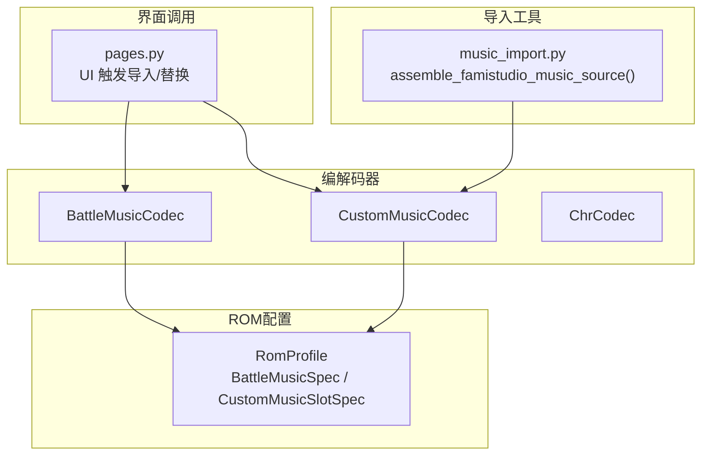
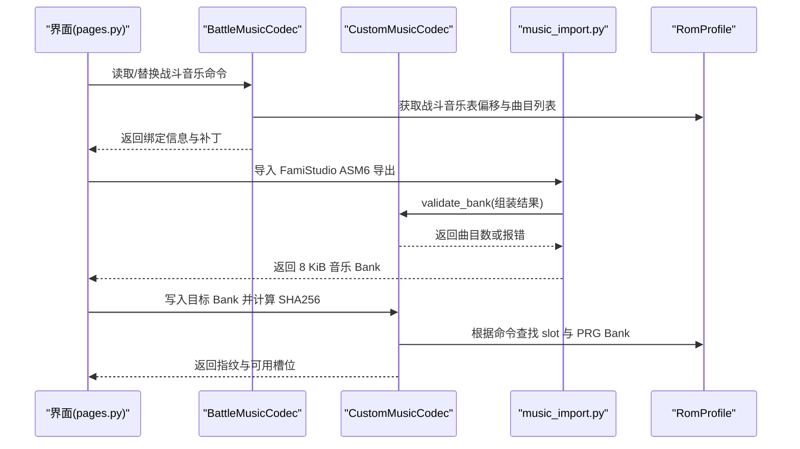
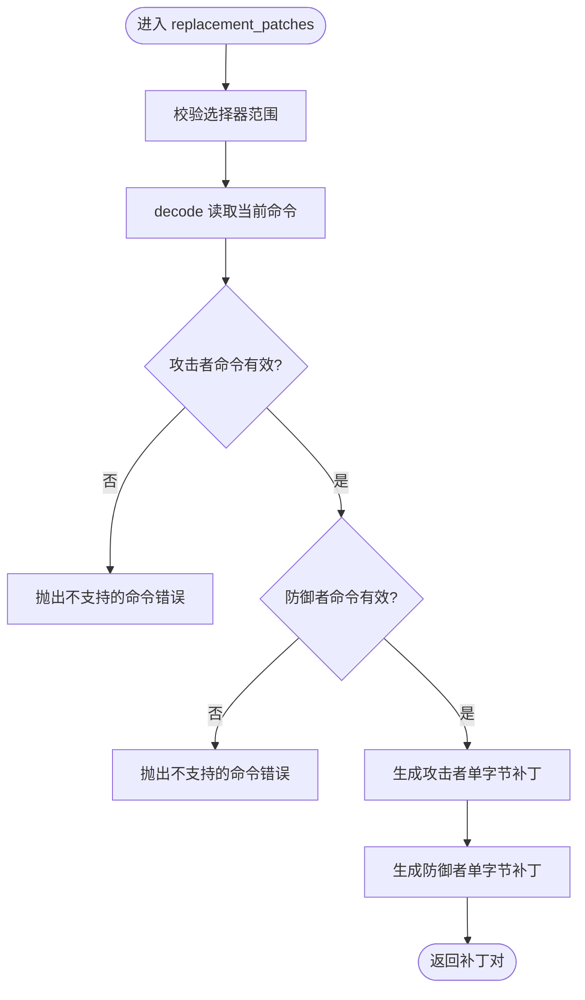
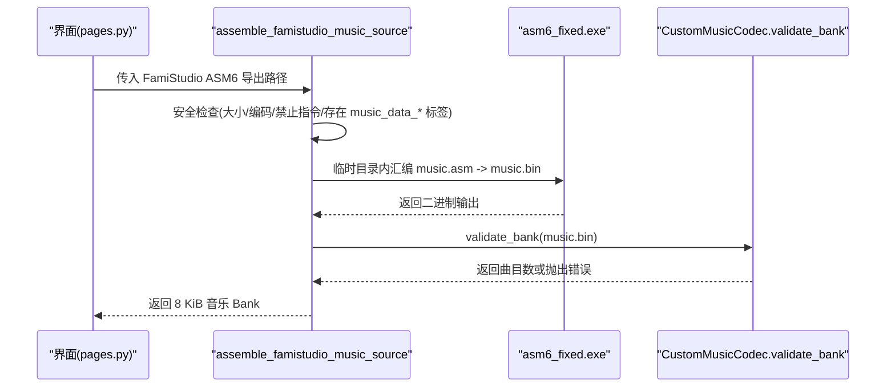
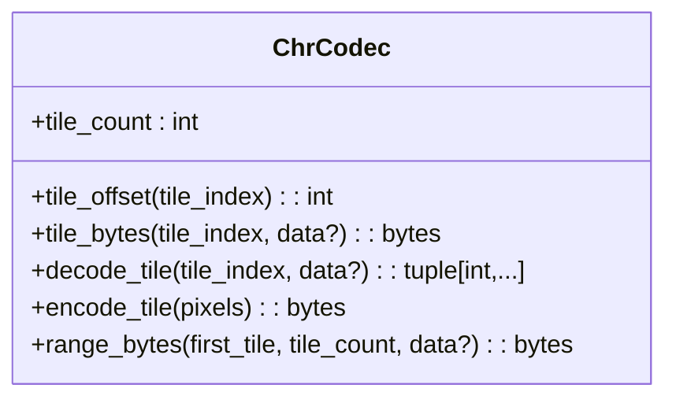
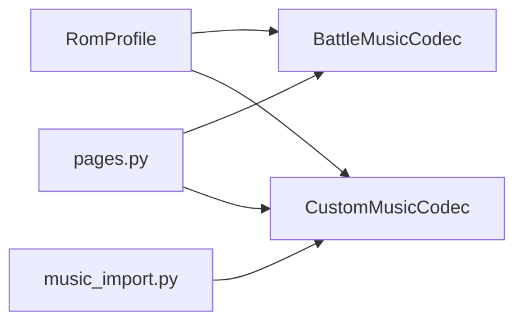

# 音频图形编解码器

<cite>
**本文引用的文件**
- [battle_music.py](file://src/fc_editor/codecs/battle_music.py)
- [custom_music.py](file://src/fc_editor/codecs/custom_music.py)
- [chr.py](file://src/fc_editor/codecs/chr.py)
- [music_import.py](file://src/dc_modifier/music_import.py)
- [profiles.py](file://src/fc_editor/profiles.py)
- [pages.py](file://src/dc_modifier/pages.py)
</cite>

## 目录
1. [简介](#简介)
2. [项目结构](#项目结构)
3. [核心组件](#核心组件)
4. [架构总览](#架构总览)
5. [详细组件分析](#详细组件分析)
6. [依赖关系分析](#依赖关系分析)
7. [性能考虑](#性能考虑)
8. [故障排查指南](#故障排查指南)
9. [结论](#结论)
10. [附录：使用示例与FamiStudio集成](#附录使用示例与famistudio集成)

## 简介
本文件聚焦于本项目中的音频与图形编解码能力，覆盖以下主题：
- BattleMusicCodec：战斗音乐表格式、曲目切换逻辑、命令到曲目的映射。
- CustomMusicCodec：自定义音乐导入流程、FamiStudio ASM6 数据导出到固定大小 Bank 的转换规则、Bank 空间分配与校验。
- ChrCodec：CHR 图块格式、像素数据编码/解码、与调色板索引的关系说明。
- FamiStudio 集成：从 ASM6 自包含导出生成 8 KiB 音乐 Bank 的完整流程与安全约束。

## 项目结构
围绕音频与图形编解码的关键代码位于 fc_editor.codecs 包中，并由 dc_modifier.music_import 提供 FamiStudio 导入工具；RomProfile 定义各 ROM 布局与资源槽位。

图表来源
- [battle_music.py:20-99](file://src/fc_editor/codecs/battle_music.py#L20-L99)
- [custom_music.py:10-65](file://src/fc_editor/codecs/custom_music.py#L10-L65)
- [chr.py:11-93](file://src/fc_editor/codecs/chr.py#L11-L93)
- [music_import.py:31-91](file://src/dc_modifier/music_import.py#L31-L91)
- [profiles.py:439-482](file://src/fc_editor/profiles.py#L439-L482)
- [profiles.py:627-631](file://src/fc_editor/profiles.py#L627-L631)

章节来源
- [battle_music.py:20-99](file://src/fc_editor/codecs/battle_music.py#L20-L99)
- [custom_music.py:10-65](file://src/fc_editor/codecs/custom_music.py#L10-L65)
- [chr.py:11-93](file://src/fc_editor/codecs/chr.py#L11-L93)
- [music_import.py:31-91](file://src/dc_modifier/music_import.py#L31-L91)
- [profiles.py:439-482](file://src/fc_editor/profiles.py#L439-L482)
- [profiles.py:627-631](file://src/fc_editor/profiles.py#L627-L631)

## 核心组件
- BattleMusicCodec：负责读取并安全替换“攻击者/防御者”战斗主题表中的单字节命令，支持选择器范围校验、命令合法性校验、以及将命令格式化为用户可读标签。
- CustomMusicCodec：管理固定大小的 FamiStudio 音乐 Bank（8 KiB），提供 Bank 读取、SHA256 指纹、以及严格的指针与头部校验。
- ChrCodec：无损编解码 iNES CHR-ROM 的 2bpp 8×8 图块，提供图块偏移计算、像素级编解码、范围读取等。
- music_import.assemble_famistudio_music_source：将自包含的 FamiStudio ASM6 数据导出组装为 8 KiB 二进制 Bank，并进行安全限制与二次校验。
- RomProfile：集中声明各 ROM 的战斗音乐表位置、扩展音乐槽位、受保护区域等元信息。

章节来源
- [battle_music.py:20-99](file://src/fc_editor/codecs/battle_music.py#L20-L99)
- [custom_music.py:10-65](file://src/fc_editor/codecs/custom_music.py#L10-L65)
- [chr.py:11-93](file://src/fc_editor/codecs/chr.py#L11-L93)
- [music_import.py:31-91](file://src/dc_modifier/music_import.py#L31-L91)
- [profiles.py:439-482](file://src/fc_editor/profiles.py#L439-L482)
- [profiles.py:627-631](file://src/fc_editor/profiles.py#L627-L631)

## 架构总览
下图展示了从 UI 触发到具体编解码器的调用链，以及 FamiStudio 导入流程如何产出可写入 ROM 的音乐 Bank。

图表来源
- [pages.py:1520-1728](file://src/dc_modifier/pages.py#L1520-L1728)
- [battle_music.py:20-99](file://src/fc_editor/codecs/battle_music.py#L20-L99)
- [custom_music.py:10-65](file://src/fc_editor/codecs/custom_music.py#L10-L65)
- [music_import.py:31-91](file://src/dc_modifier/music_import.py#L31-L91)
- [profiles.py:439-482](file://src/fc_editor/profiles.py#L439-L482)
- [profiles.py:627-631](file://src/fc_editor/profiles.py#L627-L631)

## 详细组件分析

### BattleMusicCodec：战斗音乐格式与曲目切换
- 数据模型
  - BattleMusicBinding：封装选择器、标签、攻击者/防御者命令及其在 ROM 中的偏移。
  - BattleMusicSpec/BattleMusicTrackSpec：由 RomProfile 提供，定义攻击者/防御者表偏移、选择器数量、曲目命令与显示名。
- 关键行为
  - offsets(selector)：根据选择器计算攻击者与防御者表的绝对偏移。
  - decode(selector, data)：读取当前命令并构造绑定对象，进行边界检查。
  - replacement_patches(data, selector, attacker_command, defender_command)：生成两个单字节替换补丁，先校验命令是否被支持。
  - format_command(command)：将命令转为人类可读标签，未收录命令会给出提示。
- 曲目切换逻辑
  - 通过修改攻击者/防御者表中的单字节命令实现切换；命令必须在 profiles 中注册，否则拒绝。
- 音量控制机制
  - 本组件不直接处理音量；音量通常由底层音频引擎或驱动在播放时控制。若需按场景调整音量，应在上层播放器/驱动层实现，而非在此处修改命令。

图表来源
- [battle_music.py:45-92](file://src/fc_editor/codecs/battle_music.py#L45-L92)

章节来源
- [battle_music.py:10-99](file://src/fc_editor/codecs/battle_music.py#L10-L99)
- [profiles.py:439-482](file://src/fc_editor/profiles.py#L439-L482)

### CustomMusicCodec：自定义音乐导入与Bank分配
- 数据模型
  - CustomMusicSlotSpec：每个命令对应一个 PRG Bank 槽位与标签。
  - RomProfile.custom_music_slots：声明可用的 $9D-$9F 槽位及对应 Bank。
- 关键行为
  - bank_offset(slot)：计算 Bank 在 ROM 中的起始地址（INES头 + prg_bank × 8KiB）。
  - bank_bytes(command, data)：读取指定命令对应的 8 KiB 原始数据。
  - validate_bank(payload, slot)：严格校验 8 KiB 长度、FamiStudio 曲目数、头部完整性与所有指针落在 $8000—$9FFF 区间。
  - sha256(command, data)：对 Bank 内容计算 SHA256 指纹，用于去重与一致性检查。
- 空间分配
  - 每个命令对应一个固定 8 KiB PRG Bank；不同命令映射到不同 Bank 号，避免冲突。
- 导入流程
  - 由 music_import.assemble_famistudio_music_source 将自包含 ASM6 导出包装为 .base $8000 的片段，调用 asm6_fixed.exe 汇编成二进制，再经 validate_bank 校验后返回。

图表来源
- [music_import.py:38-91](file://src/dc_modifier/music_import.py#L38-L91)
- [custom_music.py:37-62](file://src/fc_editor/codecs/custom_music.py#L37-L62)

章节来源
- [custom_music.py:10-65](file://src/fc_editor/codecs/custom_music.py#L10-L65)
- [music_import.py:31-91](file://src/dc_modifier/music_import.py#L31-L91)
- [profiles.py:627-631](file://src/fc_editor/profiles.py#L627-L631)

### ChrCodec：CHR图块格式与像素编码
- 图块格式
  - 每个图块 16 字节，表示 8×8 像素的 2bpp 数据。
  - 低平面与高平面各占 8 行，每行 1 字节；像素值 0–3 由两平面组合得到。
- 像素编码/解码
  - decode_tile(tile_index)：逐行读取 low/high 字节，按位掩码展开为 64 个像素索引。
  - encode_tile(pixels)：将 64 个像素索引写回 low/high 字节流。
- 调色板映射
  - 本组件仅处理像素索引（0–3）；实际颜色映射由运行时调色板决定，不在编解码器内硬编码。
- 范围访问
  - range_bytes(first_tile, tile_count)：安全读取连续图块数据，越界则报错。

图表来源
- [chr.py:11-93](file://src/fc_editor/codecs/chr.py#L11-L93)

章节来源
- [chr.py:11-93](file://src/fc_editor/codecs/chr.py#L11-L93)

## 依赖关系分析
- BattleMusicCodec 依赖 RomProfile 提供的 BattleMusicSpec（表偏移、曲目命令与标签）。
- CustomMusicCodec 依赖 RomProfile 提供的 CustomMusicSlotSpec（命令到 PRG Bank 的映射）。
- music_import 依赖 CustomMusicCodec.validate_bank 对汇编产物进行强校验。
- pages.py 作为 UI 入口，协调上述组件完成导入与替换操作。

图表来源
- [profiles.py:439-482](file://src/fc_editor/profiles.py#L439-L482)
- [profiles.py:627-631](file://src/fc_editor/profiles.py#L627-L631)
- [battle_music.py:20-99](file://src/fc_editor/codecs/battle_music.py#L20-L99)
- [custom_music.py:10-65](file://src/fc_editor/codecs/custom_music.py#L10-L65)
- [music_import.py:31-91](file://src/dc_modifier/music_import.py#L31-L91)
- [pages.py:1520-1728](file://src/dc_modifier/pages.py#L1520-L1728)

章节来源
- [profiles.py:439-482](file://src/fc_editor/profiles.py#L439-L482)
- [profiles.py:627-631](file://src/fc_editor/profiles.py#L627-L631)
- [battle_music.py:20-99](file://src/fc_editor/codecs/battle_music.py#L20-L99)
- [custom_music.py:10-65](file://src/fc_editor/codecs/custom_music.py#L10-L65)
- [music_import.py:31-91](file://src/dc_modifier/music_import.py#L31-L91)
- [pages.py:1520-1728](file://src/dc_modifier/pages.py#L1520-L1728)

## 性能考虑
- BattleMusicCodec：每次替换仅涉及单字节读写与少量校验，开销极低。
- CustomMusicCodec：validate_bank 遍历指针表并做范围检查，复杂度与曲目数线性相关；建议批量导入前预检。
- ChrCodec：decode/encode 为 O(N) 像素级操作，N=64；适合小批量图块编辑。
- 导入流程：ASM6 汇编过程可能耗时，已设置超时保护；建议在 UI 中提供进度反馈。

## 故障排查指南
- 战斗音乐命令无效
  - 现象：替换时报“不支持的战斗音乐命令”。
  - 原因：命令未在 RomProfile 的 tracks 中注册。
  - 处理：确认命令属于已收录曲目或更新 profiles。
- 战斗音乐选择器越界
  - 现象：选择器超出允许范围。
  - 原因：selector 不在 spec.selector_count 范围内。
  - 处理：修正选择器索引。
- 自定义音乐 Bank 校验失败
  - 现象：validate_bank 报长度、曲目数、头部不完整或指针越界。
  - 原因：ASM6 导出非自包含、指针未落在 $8000—$9FFF、或导出损坏。
  - 处理：重新导出并确保自包含；检查 asm6 输出。
- FamiStudio 导入失败
  - 现象：找不到 asm6、源文件过大、编码错误、禁止指令、缺少 music_data_* 标签、汇编超时或失败。
  - 处理：确保 tools/vendor/famistudio-4.5.3/Tools/asm6_fixed.exe 存在；限制源文件大小；使用 UTF-8/UTF-8 BOM；移除 include/incbin/base/org 等指令；保证存在 music_data_* 标签；关注 30 秒超时。
- CHR 图块数据不完整
  - 现象：读取图块时报数据不完整。
  - 原因：请求的图块范围超出有效 CHR-ROM。
  - 处理：校验 tile_index 与范围。

章节来源
- [battle_music.py:35-44](file://src/fc_editor/codecs/battle_music.py#L35-L44)
- [custom_music.py:24-62](file://src/fc_editor/codecs/custom_music.py#L24-L62)
- [music_import.py:38-91](file://src/dc_modifier/music_import.py#L38-L91)
- [chr.py:29-40](file://src/fc_editor/codecs/chr.py#L29-L40)

## 结论
- BattleMusicCodec 以最小侵入方式替换战斗主题命令，确保只修改必要字节，并通过 profiles 白名单保障安全性。
- CustomMusicCodec 将 FamiStudio 导出固化为 8 KiB Bank，并以严格的头部与指针校验保证运行时稳定。
- ChrCodec 提供无损的 2bpp 图块编解码，便于图像资源编辑与验证。
- 整体架构清晰、职责分离，便于扩展新的 ROM 布局与资源槽位。

## 附录：使用示例与FamiStudio集成
以下为典型使用步骤（以伪代码形式描述，不包含具体源码内容）：
- 替换战斗音乐命令
  - 通过 BattleMusicCodec.replacement_patches(selector, attacker_command, defender_command) 生成补丁，再应用到 ROM 数据。
  - 参考路径：[battle_music.py:71-92](file://src/fc_editor/codecs/battle_music.py#L71-L92)
- 导入 FamiStudio 音乐 Bank
  - 调用 assemble_famistudio_music_source(path) 将 ASM6 导出组装为 8 KiB 二进制，内部会执行 asm6 并调用 validate_bank。
  - 参考路径：[music_import.py:38-91](file://src/dc_modifier/music_import.py#L38-L91)
- 写入自定义音乐 Bank
  - 使用 CustomMusicCodec.bank_bytes(command) 读取现有 Bank，或用新生成的 payload 覆盖目标 PRG Bank。
  - 通过 CustomMusicCodec.sha256(command) 计算指纹用于去重与审计。
  - 参考路径：[custom_music.py:24-65](file://src/fc_editor/codecs/custom_music.py#L24-L65)
- 编辑 CHR 图块
  - 使用 decode_tile 将图块解析为像素索引序列，编辑后再用 encode_tile 写回。
  - 参考路径：[chr.py:42-78](file://src/fc_editor/codecs/chr.py#L42-L78)
- 界面集成
  - 在 pages.py 中触发导入与替换流程，并展示用户友好的提示信息。
  - 参考路径：[pages.py:1520-1728](file://src/dc_modifier/pages.py#L1520-L1728)