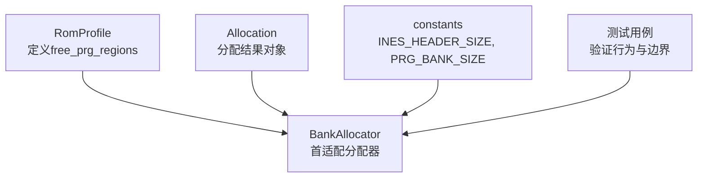
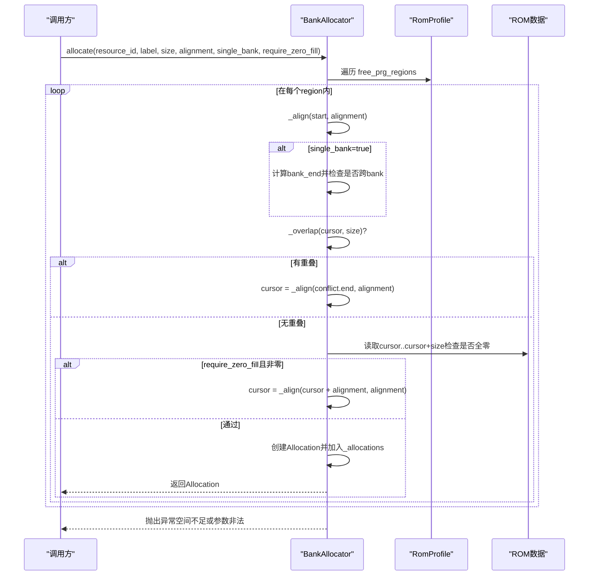
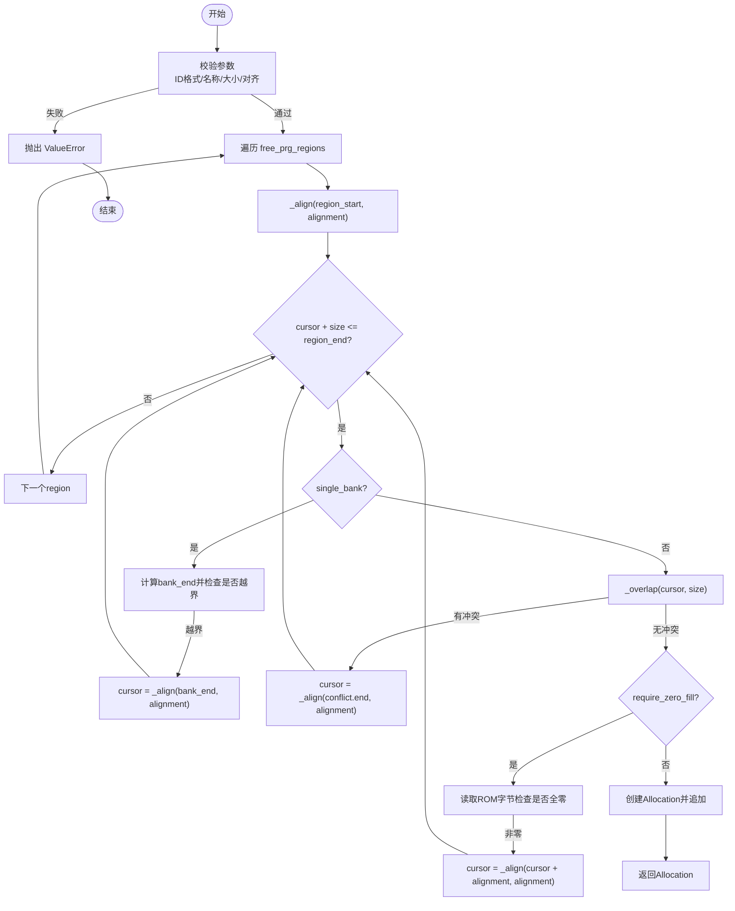
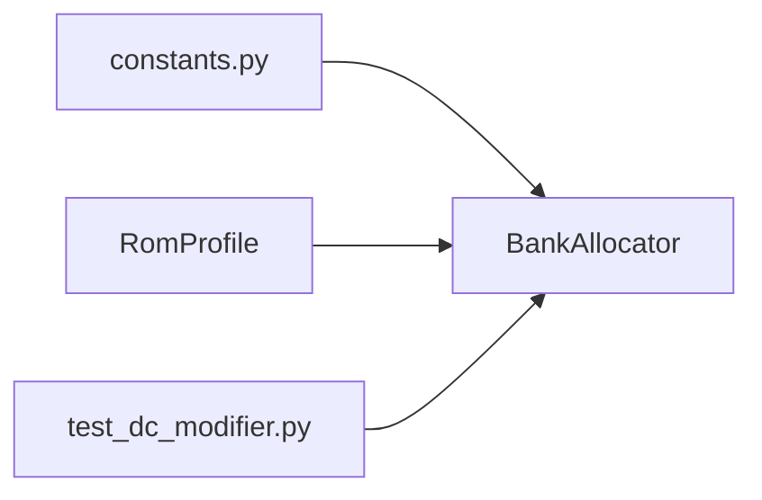

# Bank分配器API

<cite>
**本文引用的文件**
- [resources.py](file://src/fc_editor/resources.py)
- [constants.py](file://src/fc_editor/constants.py)
- [test_dc_modifier.py](file://tests/test_dc_modifier.py)
</cite>

## 目录
1. [简介](#简介)
2. [项目结构](#项目结构)
3. [核心组件](#核心组件)
4. [架构总览](#架构总览)
5. [详细组件分析](#详细组件分析)
6. [依赖关系分析](#依赖关系分析)
7. [性能考量](#性能考量)
8. [故障排查指南](#故障排查指南)
9. [结论](#结论)
10. [附录：使用示例与常见错误处理](#附录使用示例与常见错误处理)

## 简介
本文件面向BankAllocator类的内存分配与管理接口，聚焦于PRG Bank空间的确定性分配策略。文档涵盖以下要点：
- allocate()方法的参数配置、对齐要求、单Bank约束与零填充选项
- reserve()与release()的生命周期管理
- capacity、used、available容量查询属性的使用场景
- 冲突检测机制：_overlap()与_is_in_free_region()的验证逻辑
- 实际资源分配示例与常见错误处理方案

## 项目结构
BankAllocator位于编辑器资源模块中，负责在ROM的“可用PRG区域”内为扩展资源进行首适配（first-fit）分配，并保证不越界、不对齐失败、不重叠等约束。

图表来源
- [resources.py:280-413](file://src/fc_editor/resources.py#L280-L413)
- [constants.py:8-9](file://src/fc_editor/constants.py#L8-L9)
- [test_dc_modifier.py:199-232](file://tests/test_dc_modifier.py#L199-L232)

章节来源
- [resources.py:280-413](file://src/fc_editor/resources.py#L280-L413)
- [constants.py:8-9](file://src/fc_editor/constants.py#L8-L9)

## 核心组件
- Allocation：描述一次分配的标识、标签、起始偏移、大小与对齐值，并提供end与first_bank属性。
- BankAllocator：基于RomProfile声明的free_prg_regions进行首适配分配，提供allocate/reserve/release及capacity/used/available查询。

章节来源
- [resources.py:263-278](file://src/fc_editor/resources.py#L263-L278)
- [resources.py:280-413](file://src/fc_editor/resources.py#L280-L413)

## 架构总览
BankAllocator的工作流如下：
- 初始化时记录RomProfile与ROM数据副本，并可预保留若干Allocation。
- allocate()按对齐扫描每个free_prg_region，优先满足single_bank约束；若require_zero_fill为真，则跳过非零区域。
- reserve()用于外部构造Allocation并进行强校验（ID格式、名称、大小/对齐合法性、落在free区域、无重叠）。
- release()移除指定resource_id的分配，返回被释放的Allocation。
- capacity/used/available提供容量统计，便于上层做容量规划与回退。

图表来源
- [resources.py:368-413](file://src/fc_editor/resources.py#L368-L413)
- [resources.py:311-332](file://src/fc_editor/resources.py#L311-L332)
- [constants.py:8-9](file://src/fc_editor/constants.py#L8-L9)

## 详细组件分析

### Allocation
- 字段：resource_id、label、offset、size、alignment
- 属性：
  - end：返回offset + size
  - first_bank：根据偏移换算到PRG Bank编号（基于常量）
- 用途：作为allocate()/reserve()的输入或返回值，承载分配结果。

章节来源
- [resources.py:263-278](file://src/fc_editor/resources.py#L263-L278)
- [constants.py:8-9](file://src/fc_editor/constants.py#L8-L9)

### BankAllocator
- 初始化：保存profile与rom_data副本，支持传入初始allocations并逐一reserve。
- 容量查询：
  - capacity：所有free_prg_regions.size之和
  - used：当前已分配size之和
  - available：capacity - used
- 对齐：_align(value, alignment)向上取整到alignment的倍数。
- 冲突检测：
  - _is_in_free_region(offset, size)：判断范围完全落在某个free_prg_region内
  - _overlap(offset, size)：判断是否与已有分配区间重叠
- 生命周期：
  - reserve(allocation)：严格校验后加入内部列表
  - release(resource_id)：移除并返回对应Allocation
  - allocation(resource_id)：查询某resource_id对应的Allocation
- 分配策略：
  - 首适配（first-fit）：从region起始按对齐推进，遇到冲突或非零区域则跳过
  - single_bank：默认True，强制分配不能跨越PRG Bank边界
  - require_zero_fill：默认True，仅允许写入全零区域

图表来源
- [resources.py:368-413](file://src/fc_editor/resources.py#L368-L413)
- [resources.py:311-332](file://src/fc_editor/resources.py#L311-L332)
- [constants.py:8-9](file://src/fc_editor/constants.py#L8-L9)

章节来源
- [resources.py:280-413](file://src/fc_editor/resources.py#L280-L413)

## 依赖关系分析
- constants：提供INES_HEADER_SIZE与PRG_BANK_SIZE，用于计算region起止与bank边界。
- RomProfile：提供free_prg_regions集合，决定可分配空间。
- 测试：验证分配器的确定性、边界与冲突拒绝行为。

图表来源
- [constants.py:8-9](file://src/fc_editor/constants.py#L8-L9)
- [resources.py:280-413](file://src/fc_editor/resources.py#L280-L413)
- [test_dc_modifier.py:199-232](file://tests/test_dc_modifier.py#L199-L232)

章节来源
- [constants.py:8-9](file://src/fc_editor/constants.py#L8-L9)
- [resources.py:280-413](file://src/fc_editor/resources.py#L280-L413)
- [test_dc_modifier.py:199-232](file://tests/test_dc_modifier.py#L199-L232)

## 性能考量
- 时间复杂度：
  - allocate()：对每个region进行线性扫描，最坏O(R + N)，其中R为region数量，N为已有分配数（用于_overlap检查）
  - reserve()/release()：近似O(N)
- 空间复杂度：O(N)存储已分配项
- 优化建议：
  - 当N较大时，可对_allocations按offset排序以加速冲突检测（当前已按offset排序输出，但插入未优化）
  - 对require_zero_fill的ROM访问可考虑缓存或批量检查以减少随机读

[本节为通用性能讨论，不直接分析具体代码行]

## 故障排查指南
常见错误与定位方法：
- 参数非法：
  - resource_id格式不符合正则
  - label为空
  - size<=0或alignment<=0或alignment不是2的幂
  - 解决：修正参数后再调用
- 不在可用区域：
  - reserve()会调用_is_in_free_region()校验，若失败抛出ValueError
  - 解决：确保offset与size完全落入free_prg_regions
- 重叠冲突：
  - _overlap()检测到与已有分配重叠，抛出ValueError
  - 解决：调整offset/size或先release旧资源
- 单Bank越界：
  - single_bank=True时，若分配超出当前bank边界，将自动对齐到下一bank起始再尝试
  - 若仍无法容纳，最终抛出“没有足够的单Bank空闲PRG空间”异常
- 非零填充限制：
  - require_zero_fill=True时，若目标区域非全零，将跳过并继续寻找
  - 可通过设置False放宽限制（需确认业务安全）

章节来源
- [resources.py:334-366](file://src/fc_editor/resources.py#L334-L366)
- [resources.py:368-413](file://src/fc_editor/resources.py#L368-L413)

## 结论
BankAllocator提供了确定性的首适配分配策略，结合严格的参数校验、对齐、单Bank约束与可选的零填充检查，确保扩展资源安全地放置在ROM的可用PRG区域。其提供的容量查询与生命周期管理接口，便于上层进行资源编排与回滚。

[本节为总结性内容，不直接分析具体代码行]

## 附录：使用示例与常见错误处理

### 典型用法流程
- 创建分配器：传入RomProfile与ROM数据
- 分配资源：调用allocate()，按需设置alignment、single_bank、require_zero_fill
- 预保留：通过reserve()预先锁定特定范围（常用于固定布局）
- 查询容量：使用capacity/used/available监控剩余空间
- 释放资源：调用release()回收并重新利用空间

章节来源
- [resources.py:280-413](file://src/fc_editor/resources.py#L280-L413)
- [test_dc_modifier.py:199-232](file://tests/test_dc_modifier.py#L199-L232)

### 关键行为说明
- 对齐要求：
  - alignment必须是2的幂；allocate()与reserve()均会校验
  - 分配起始位置必须满足alignment；否则reserve()直接报错
- 单Bank约束：
  - single_bank=True（默认）：分配不得跨越PRG Bank边界
  - 若跨bank，会自动跳到下一bank的对齐起点继续尝试
- 零填充选项：
  - require_zero_fill=True（默认）：仅允许写入全零区域
  - 若区域非零，将跳过并继续搜索

章节来源
- [resources.py:368-413](file://src/fc_editor/resources.py#L368-L413)
- [resources.py:334-354](file://src/fc_editor/resources.py#L334-L354)

### 冲突检测机制
- _is_in_free_region(offset, size)：
  - 遍历free_prg_regions，检查[start, end]是否完全包含[offset, offset+size]
- _overlap(offset, size)：
  - 检查是否与任一已有分配的区间重叠（开区间比较）

章节来源
- [resources.py:315-332](file://src/fc_editor/resources.py#L315-L332)

### 容量查询
- capacity：所有free_prg_regions.size之和
- used：当前所有Allocation.size之和
- available：capacity - used

章节来源
- [resources.py:299-309](file://src/fc_editor/resources.py#L299-L309)

### 示例参考（路径引用）
- 基础分配与容量断言：[test_dc_modifier.py:199-207](file://tests/test_dc_modifier.py#L199-L207)
- 释放后复用区域：[test_dc_modifier.py:208-219](file://tests/test_dc_modifier.py#L208-L219)
- 拒绝保护区与重叠：[test_dc_modifier.py:221-232](file://tests/test_dc_modifier.py#L221-L232)