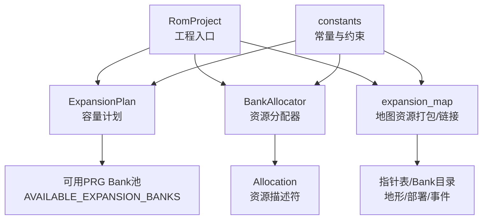
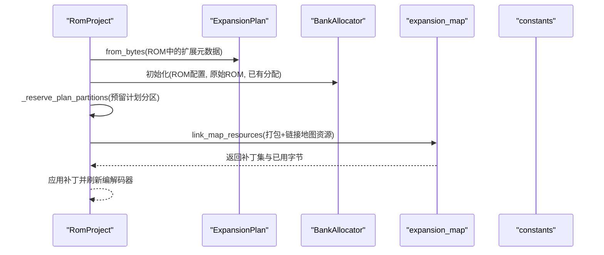
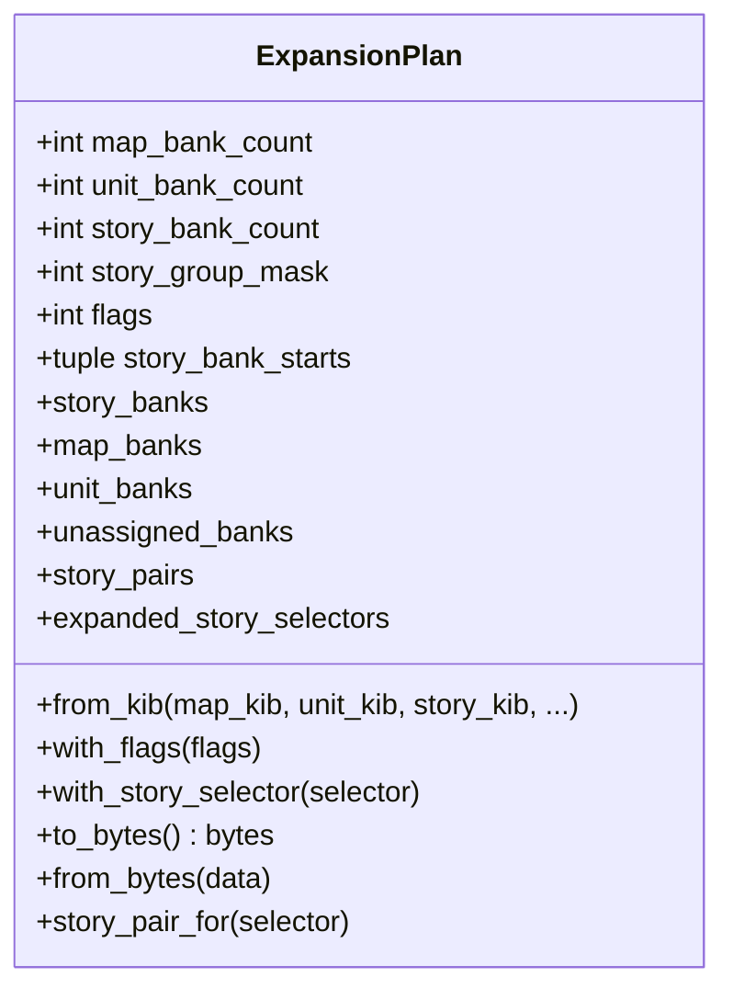
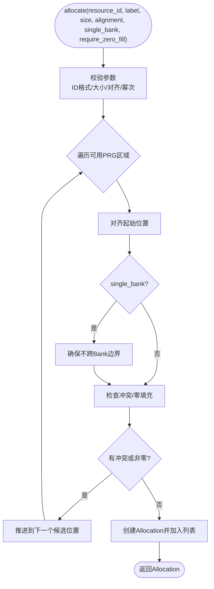
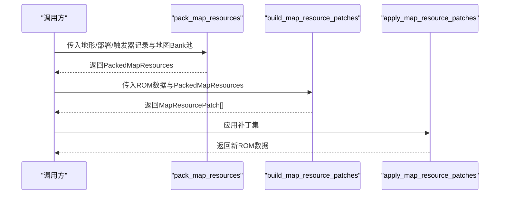
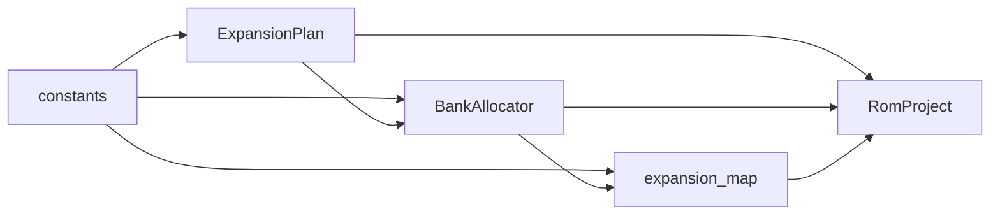

# 容量规划API

<cite>
**本文引用的文件**
- [src/fc_editor/expansion.py](file://src/fc_editor/expansion.py)
- [src/fc_editor/resources.py](file://src/fc_editor/resources.py)
- [src/fc_editor/expansion_map.py](file://src/fc_editor/expansion_map.py)
- [src/fc_rom_editor_core.py](file://src/fc_rom_editor_core.py)
- [src/fc_editor/constants.py](file://src/fc_editor/constants.py)
</cite>

## 目录
1. [简介](#简介)
2. [项目结构](#项目结构)
3. [核心组件](#核心组件)
4. [架构总览](#架构总览)
5. [详细组件分析](#详细组件分析)
6. [依赖关系分析](#依赖关系分析)
7. [性能与容量优化](#性能与容量优化)
8. [故障排查指南](#故障排查指南)
9. [结论](#结论)
10. [附录：容量规划示例](#附录容量规划示例)

## 简介
本文件面向FC扩容MMC3项目的容量规划API，聚焦于ExpansionPlan类的容量规划与管理接口，系统说明分区策略（PRG Bank分区、CHR空间规划、保留区域管理）、资源描述符系统（Allocation对象结构与用途），以及地图资源管理API（地形Bank目录管理、场景布局规划、触发器资源打包与解包）。同时提供容量计算算法（空间利用率分析、碎片化检测、优化建议）和实际容量规划示例与性能调优指南。

## 项目结构
围绕容量规划的核心代码分布在以下模块：
- 容量计划与元数据：ExpansionPlan、可用Bank集合、资源选择器表偏移等定义在扩展模块中。
- 资源分配器：BankAllocator与Allocation用于在ROM的可用PRG区域内进行确定性分配。
- 地图资源打包/链接：地形、部署、触发器的统一打包、指针表与Bank目录写入、Hook补丁生成与应用。
- ROM工程入口：RomProject负责加载ROM、构建初始ExpansionPlan、预留分区、刷新编解码器并协调各子系统。
- 常量与约束：INES头大小、PRG Bank大小、受保护Bank、可分配Bank范围等。

图表来源
- [src/fc_rom_editor_core.py:463-618](file://src/fc_rom_editor_core.py#L463-L618)
- [src/fc_editor/expansion.py:11-35](file://src/fc_editor/expansion.py#L11-L35)
- [src/fc_editor/resources.py:263-413](file://src/fc_editor/resources.py#L263-L413)
- [src/fc_editor/expansion_map.py:174-418](file://src/fc_editor/expansion_map.py#L174-L418)
- [src/fc_editor/constants.py:8-10](file://src/fc_editor/constants.py#L8-L10)

章节来源
- [src/fc_rom_editor_core.py:463-618](file://src/fc_rom_editor_core.py#L463-L618)
- [src/fc_editor/expansion.py:11-35](file://src/fc_editor/expansion.py#L11-L35)
- [src/fc_editor/resources.py:263-413](file://src/fc_editor/resources.py#L263-L413)
- [src/fc_editor/expansion_map.py:174-418](file://src/fc_editor/expansion_map.py#L174-L418)
- [src/fc_editor/constants.py:8-10](file://src/fc_editor/constants.py#L8-L10)

## 核心组件
- ExpansionPlan：定义地图、机体、剧情三类资源的配额与绑定，校验合法性并提供序列化/反序列化能力。
- BankAllocator：在ROM配置声明的“自由PRG区域”内进行确定性首适配分配，支持对齐、单Bank限制、零填充检查等。
- Allocation：资源描述符，记录资源ID、标签、起始偏移、大小与对齐要求，并暴露Bank边界信息。
- 地图资源打包/链接：将地形、部署、触发器三种资源按规则打包到分配的地图Bank池，生成指针表与Bank目录，并产出可应用的补丁集。

章节来源
- [src/fc_editor/expansion.py:84-318](file://src/fc_editor/expansion.py#L84-L318)
- [src/fc_editor/resources.py:263-413](file://src/fc_editor/resources.py#L263-L413)
- [src/fc_editor/expansion_map.py:174-418](file://src/fc_editor/expansion_map.py#L174-L418)

## 架构总览
下图展示从工程加载到容量计划、资源分配、地图资源打包与链接的整体流程。

图表来源
- [src/fc_rom_editor_core.py:463-618](file://src/fc_rom_editor_core.py#L463-L618)
- [src/fc_editor/expansion.py:277-318](file://src/fc_editor/expansion.py#L277-L318)
- [src/fc_editor/expansion_map.py:403-418](file://src/fc_editor/expansion_map.py#L403-L418)
- [src/fc_editor/constants.py:8-10](file://src/fc_editor/constants.py#L8-L10)

## 详细组件分析

### ExpansionPlan：容量计划与分区策略
- 配额维度
  - 地图配额：以8 KiB为单位，占用低区Bank段。
  - 机体配额：仅支持48/64/80 KiB（6/8/10个Bank），位于更低地址段。
  - 剧情配额：以16 KiB为单位（成对Bank），位于高区Bank段，最多14个Bank（7组文本）。
- 可用Bank池：排除音频与固定代码占用的Bank，形成连续可用的PRG Bank序列。
- 剧情绑定：通过story_group_mask与story_bank_starts维护哪些剧情组被搬移到扩展区，以及对应的首Bank对。
- 校验规则：配额越界、总和超过可用池、剧情组位图与绑定不一致、重复绑定等均会抛出异常。
- 序列化：包含魔数、版本、配额、掩码、标志、保留字段与CRC校验。

图表来源
- [src/fc_editor/expansion.py:84-318](file://src/fc_editor/expansion.py#L84-L318)

章节来源
- [src/fc_editor/expansion.py:84-318](file://src/fc_editor/expansion.py#L84-L318)

### BankAllocator与Allocation：资源描述符系统
- Allocation
  - 字段：resource_id、label、offset、size、alignment；提供end、first_bank属性。
  - 用途：唯一标识一块已分配的ROM区域，供上层模块引用与审计。
- BankAllocator
  - 输入：ROM配置（free_prg_regions）、原始ROM数据、已有分配列表。
  - 分配策略：首适配（First-Fit），按区域顺序扫描，考虑对齐、单Bank限制、零填充要求。
  - 冲突检测：与已有分配重叠则拒绝；不在可用区域或对齐不满足则拒绝。
  - 查询：capacity/used/available统计；allocation/release获取与释放指定资源。

图表来源
- [src/fc_editor/resources.py:368-413](file://src/fc_editor/resources.py#L368-L413)

章节来源
- [src/fc_editor/resources.py:263-413](file://src/fc_editor/resources.py#L263-L413)

### 地图资源管理API：地形、场景、触发器
- 资源类型与窗口基址
  - 地形：数据窗口0xA000，独立存储，不允许合并重复。
  - 部署：数据窗口0x8000，允许相同记录去重共享。
  - 触发器：数据窗口0xA000，允许相同记录去重共享。
- 打包流程
  - 校验记录数量、长度、是否超过单Bank容量。
  - 顺序放入分配的地图Bank池，维护指针表与Bank目录。
  - 输出PackedMapResources，含使用的Bank、镜像、指针与目录、已用字节。
- 链接与补丁
  - 验证ROM中调度器/Hook是否为原版或已安装扩展版。
  - 生成并排序补丁，确保无重叠后应用。
  - 支持清空指定Bank后再写入，保证一致性。

图表来源
- [src/fc_editor/expansion_map.py:174-418](file://src/fc_editor/expansion_map.py#L174-L418)

章节来源
- [src/fc_editor/expansion_map.py:174-418](file://src/fc_editor/expansion_map.py#L174-L418)

### RomProject集成：预留分区与动态刷新
- 加载时从ROM读取ExpansionPlan，若存在且启用相应标志，则初始化对应编解码器与布局。
- 预留计划分区：根据ExpansionPlan标记不可再分配的Bank区间，避免后续分配冲突。
- 预留直接重新打开守卫：为某些关键区域设置保护，防止误写。
- 事务与撤销：记录工作缓冲与分配快照，支持回滚与重做。

章节来源
- [src/fc_rom_editor_core.py:463-618](file://src/fc_rom_editor_core.py#L463-L618)

## 依赖关系分析
- ExpansionPlan依赖常量中的可用Bank范围与PRG Bank大小，确保配额合法。
- BankAllocator依赖ROM配置中的free_prg_regions，严格限制分配范围。
- expansion_map依赖ROM中的调度器与Hook原码/补丁，确保兼容性。
- RomProject聚合上述模块，协调生命周期与状态一致性。

图表来源
- [src/fc_editor/expansion.py:11-35](file://src/fc_editor/expansion.py#L11-L35)
- [src/fc_editor/resources.py:280-313](file://src/fc_editor/resources.py#L280-L313)
- [src/fc_editor/expansion_map.py:174-418](file://src/fc_editor/expansion_map.py#L174-L418)
- [src/fc_rom_editor_core.py:463-618](file://src/fc_rom_editor_core.py#L463-L618)

章节来源
- [src/fc_editor/expansion.py:11-35](file://src/fc_editor/expansion.py#L11-L35)
- [src/fc_editor/resources.py:280-313](file://src/fc_editor/resources.py#L280-L313)
- [src/fc_editor/expansion_map.py:174-418](file://src/fc_editor/expansion_map.py#L174-L418)
- [src/fc_rom_editor_core.py:463-618](file://src/fc_rom_editor_core.py#L463-L618)

## 性能与容量优化
- 空间利用率分析
  - 使用ExpansionPlan.total_kib与unassigned_kib评估已用与未分配容量。
  - 使用BankAllocator.used/capacity/available评估分配器层面的利用率。
  - 使用PackedMapResources.used_bytes与capacity评估地图池的实际压缩效果。
- 碎片化检测
  - 利用consecutive_bank_segments将分散的Bank聚合成连续段，识别碎片。
  - 在expand_map中，read_expanded_map_layout会计算每个记录的容量与下一偏移，帮助发现过小或无法容纳新记录的间隙。
- 优化建议
  - 优先将大体积资源（如地形）集中放置，减少跨Bank分割。
  - 对部署与触发器启用去重共享，降低重复内容占用。
  - 调整ExpansionPlan的配额比例，使剧情组尽量填满成对Bank，避免半块浪费。
  - 在BankAllocator中合理设置alignment与single_bank，避免产生难以利用的小碎片。
- 容量计算算法要点
  - 地图打包采用顺序填充，遇到Bank边界自动切换，超限时报错提示所需最小容量。
  - 剧情组绑定需满足story_group_mask与story_bank_starts一致，否则拒绝。
  - 资源分配前校验零填充与冲突，确保ROM稳定性。

章节来源
- [src/fc_editor/expansion.py:71-82](file://src/fc_editor/expansion.py#L71-L82)
- [src/fc_editor/expansion_map.py:425-525](file://src/fc_editor/expansion_map.py#L425-L525)
- [src/fc_editor/resources.py:295-313](file://src/fc_editor/resources.py#L295-L313)

## 故障排查指南
- 常见错误与定位
  - “地图池至少需要X KiB，当前只分配Y KiB”：检查ExpansionPlan.map_bank_count与实际记录总量，必要时增加地图配额。
  - “剧情配额已用完；每个被修改的文本组需要16 KiB”：检查story_bank_count与story_group_mask，确保足够成对Bank。
  - “分配与资源X重叠”：检查已有Allocation列表，确认未重复分配同一resource_id或重叠区域。
  - “地图扩展调度器未安装/不匹配”：确认ROM中对应Hook与补丁一致，必要时先应用基础补丁。
- 调试步骤
  - 打印ExpansionPlan的配额与故事绑定，核对是否符合预期。
  - 打印BankAllocator的capacity/used/available，确认剩余空间。
  - 打印PackedMapResources.used_bytes与capacity，评估压缩率。
  - 使用read_expanded_map_layout解析现有布局，检查指针与Bank目录是否有效。

章节来源
- [src/fc_editor/expansion_map.py:174-418](file://src/fc_editor/expansion_map.py#L174-L418)
- [src/fc_editor/expansion.py:84-318](file://src/fc_editor/expansion.py#L84-L318)
- [src/fc_editor/resources.py:368-413](file://src/fc_editor/resources.py#L368-L413)

## 结论
本容量规划API通过ExpansionPlan实现确定性的PRG Bank分区策略，结合BankAllocator的资源描述符系统与地图资源打包/链接工具，提供了完整的容量管理与优化能力。借助空间利用率分析与碎片化检测，可在保证ROM稳定性的前提下最大化利用可用空间，并为后续扩展提供清晰的边界与约束。

## 附录：容量规划示例
以下为典型容量规划流程与调优实践，不涉及具体代码片段，仅给出操作步骤与参考路径。

- 规划目标
  - 设定地图、机体、剧情三类资源的配额（单位KiB），确保总和不超过可用池。
  - 如需搬移剧情组，设置story_group_mask与story_bank_starts，确保成对Bank绑定。
- 执行步骤
  - 使用ExpansionPlan.from_kib创建计划，并通过to_bytes序列化到ROM元数据区。
  - 初始化BankAllocator，预留计划分区，避免后续分配冲突。
  - 打包地图资源：将地形、部署、触发器记录提交给pack_map_resources，得到PackedMapResources。
  - 生成并应用补丁：调用build_map_resource_patches与apply_map_resource_patches完成链接。
- 调优实践
  - 若地图碎片较多，尝试合并小记录或调整打包顺序。
  - 若剧情组未充分利用，调整story_bank_starts使其填满成对Bank。
  - 若分配失败，检查对齐要求与单Bank限制，适当放宽或拆分资源。

参考路径
- 容量计划创建与校验：[src/fc_editor/expansion.py:130-175](file://src/fc_editor/expansion.py#L130-L175)
- 资源分配与冲突检测：[src/fc_editor/resources.py:368-413](file://src/fc_editor/resources.py#L368-L413)
- 地图资源打包与链接：[src/fc_editor/expansion_map.py:174-418](file://src/fc_editor/expansion_map.py#L174-L418)