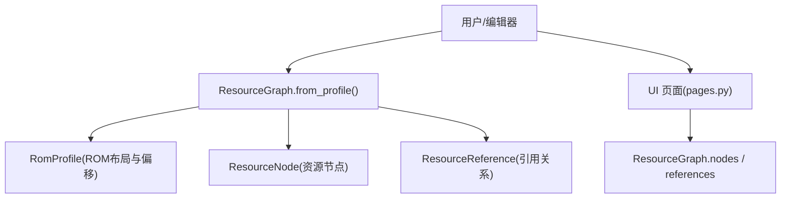
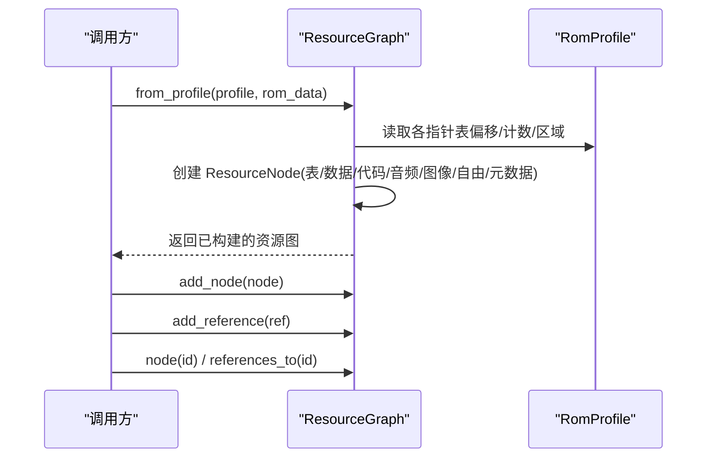
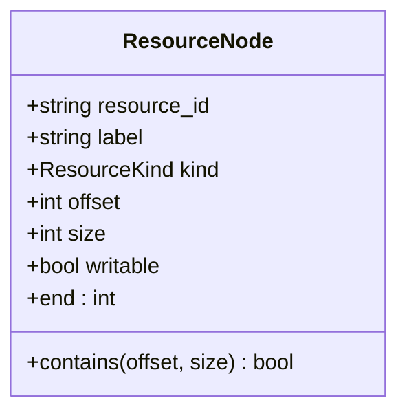
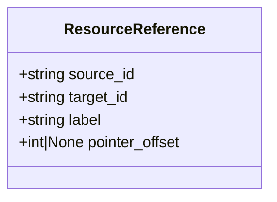
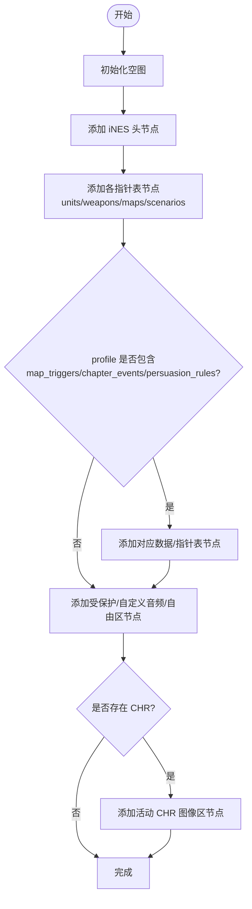
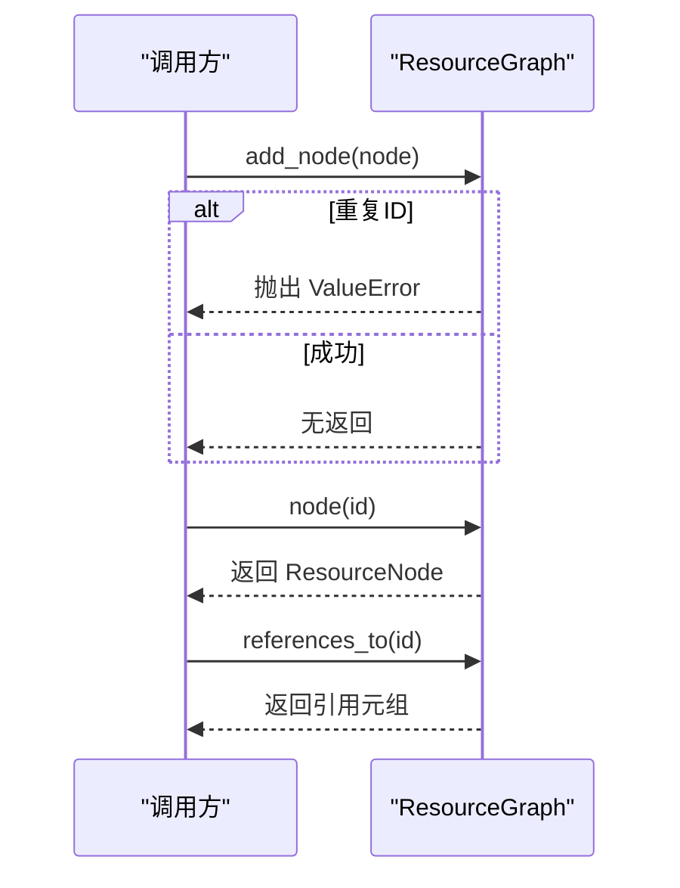
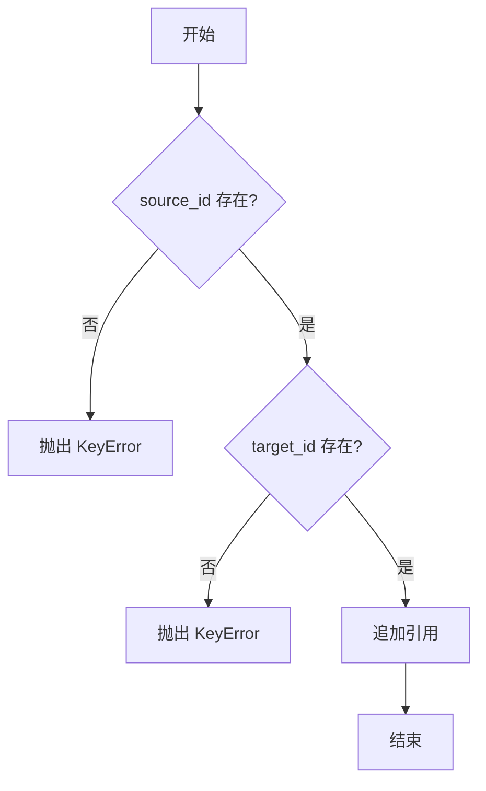
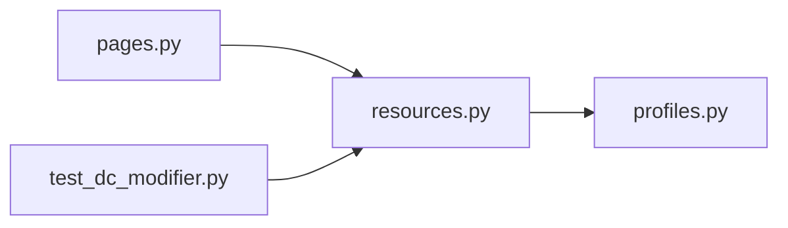

# 资源图API

<cite>
**本文引用的文件**
- [resources.py](file://src/fc_editor/resources.py)
- [profiles.py](file://src/fc_editor/profiles.py)
- [pages.py](file://src/dc_modifier/pages.py)
- [test_dc_modifier.py](file://tests/test_dc_modifier.py)
</cite>

## 目录
1. [简介](#简介)
2. [项目结构](#项目结构)
3. [核心组件](#核心组件)
4. [架构总览](#架构总览)
5. [详细组件分析](#详细组件分析)
6. [依赖关系分析](#依赖关系分析)
7. [性能考虑](#性能考虑)
8. [故障排查指南](#故障排查指南)
9. [结论](#结论)
10. [附录：使用示例与最佳实践](#附录：使用示例与最佳实践)

## 简介
本文件面向“资源图API”，聚焦 ResourceGraph 类的设计与使用模式，系统说明 ResourceNode 数据结构的字段含义、ResourceReference 引用关系的数据结构，以及资源图的构建流程（from_profile() 工厂方法）。同时给出节点管理 API（add_node()、node()、references_to()）和引用关系管理（add_reference()）的调用方式、验证规则、实际构建示例与最佳实践。该API用于在编辑器模块中描述ROM中的命名资源及其相互引用关系，支撑后续的资源导入、分配、校验与导出等能力。

## 项目结构
- 资源图相关核心定义位于 src/fc_editor/resources.py，包含 ResourceNode、ResourceReference、ResourceGraph、BankAllocator 等类型与工具。
- RomProfile 定义于 src/fc_editor/profiles.py，提供 ROM 布局、指针表偏移、可分配区域等元信息，供 ResourceGraph.from_profile() 构建资源图。
- UI 层在 src/dc_modifier/pages.py 中使用 ResourceGraph.from_profile() 展示资源节点与容量信息。
- 测试用例 tests/test_dc_modifier.py 对资源图与分配器进行断言验证。

图表来源
- [resources.py:80-260](file://src/fc_editor/resources.py#L80-L260)
- [profiles.py:1-200](file://src/fc_editor/profiles.py#L1-L200)
- [pages.py:2074-2108](file://src/dc_modifier/pages.py#L2074-L2108)

章节来源
- [resources.py:1-413](file://src/fc_editor/resources.py#L1-L413)
- [profiles.py:1-200](file://src/fc_editor/profiles.py#L1-L200)
- [pages.py:2074-2108](file://src/dc_modifier/pages.py#L2074-L2108)
- [test_dc_modifier.py:176-197](file://tests/test_dc_modifier.py#L176-L197)

## 核心组件
- ResourceNode：表示一个命名的ROM资源及其物理字节范围，具备只读性（frozen dataclass），并提供 end 属性与 contains(offset, size) 判断是否包含某偏移区间。
- ResourceReference：表示两个资源之间的引用关系，包含 source_id、target_id、label 及可选 pointer_offset。
- ResourceGraph：维护资源节点与引用关系的有向图，提供添加节点、添加引用、查询节点、按目标ID反向查找引用等API；并支持从 RomProfile 构建完整资源图。
- BankAllocator：基于 RomProfile 的可分配PRG区域的确定性分配器，用于扩展资源的内存布局规划（与资源图配合使用）。

章节来源
- [resources.py:14-45](file://src/fc_editor/resources.py#L14-L45)
- [resources.py:47-79](file://src/fc_editor/resources.py#L47-L79)
- [resources.py:263-413](file://src/fc_editor/resources.py#L263-L413)

## 架构总览
ResourceGraph 作为ROM资源的抽象视图，由 from_profile(profile, rom_data) 根据配置生成一组固定资源节点（如 iNES 头、各类指针表、事件数据、音频槽位、自由区、活动CHR等）。上层编辑器通过 nodes 与 references 访问资源集合，并通过 add_node/add_reference 扩展自定义资源与引用。

图表来源
- [resources.py:80-260](file://src/fc_editor/resources.py#L80-L260)
- [profiles.py:1-200](file://src/fc_editor/profiles.py#L1-L200)

## 详细组件分析

### ResourceNode 数据结构与语义
- resource_id：唯一标识符，用于在图中定位节点，必须非空且全局唯一。
- label：人类可读的名称，便于UI展示与调试。
- kind：资源种类，限定为 table/data/code/audio/graphics/free/metadata，用于区分用途与权限策略。
- offset：ROM中的起始偏移（字节）。
- size：资源长度（字节），必须大于0。
- writable：是否允许修改，默认False；某些表或池标记为True以允许编辑。
- 辅助能力：end = offset + size；contains(offset, size) 判断是否完全包含指定区间。

图表来源
- [resources.py:14-36](file://src/fc_editor/resources.py#L14-L36)

章节来源
- [resources.py:14-36](file://src/fc_editor/resources.py#L14-L36)

### ResourceReference 引用关系数据结构
- source_id：引用来源资源ID。
- target_id：被引用目标资源ID。
- label：引用关系的可读标签。
- pointer_offset：可选，指向源资源内存储目标地址的指针偏移，便于定位具体指针位置。

图表来源
- [resources.py:39-45](file://src/fc_editor/resources.py#L39-L45)

章节来源
- [resources.py:39-45](file://src/fc_editor/resources.py#L39-L45)

### ResourceGraph 构建流程 with from_profile()
- 输入：RomProfile（ROM布局与偏移）、rom_data（原始ROM字节）。
- 行为：
  - 创建空图。
  - 添加 iNES 文件头节点（metadata）。
  - 依据 profile 添加各类指针表节点（units/weapons/maps/scenarios 等），部分带 writable=True。
  - 若 profile 存在 map_triggers/chapter_events/persuasion_rules，则添加对应数据/指针表节点。
  - 遍历 protected_prg_regions 与 custom_music_slots，添加受保护代码/音频节点。
  - 遍历 free_prg_regions，添加可分配区域节点。
  - 根据 rom_data 计算 PRG/CHR 大小，若有 CHR 则添加活动图像区节点。
- 输出：完整的 ResourceGraph。

图表来源
- [resources.py:80-260](file://src/fc_editor/resources.py#L80-L260)

章节来源
- [resources.py:80-260](file://src/fc_editor/resources.py#L80-L260)
- [profiles.py:1-200](file://src/fc_editor/profiles.py#L1-L200)

### 节点管理API
- add_node(node)
  - 作用：向图中添加资源节点。
  - 验证：若 resource_id 重复，抛出 ValueError。
  - 典型用法：在 from_profile() 内部批量添加；也可在外部按需追加自定义节点。
- node(resource_id)
  - 作用：按ID获取 ResourceNode。
  - 异常：不存在时抛出 KeyError。
- references_to(resource_id)
  - 作用：返回所有以 resource_id 为目标节点的引用列表。
  - 返回值：不可变元组，便于安全遍历。

图表来源
- [resources.py:62-78](file://src/fc_editor/resources.py#L62-L78)

章节来源
- [resources.py:62-78](file://src/fc_editor/resources.py#L62-L78)

### 引用关系管理API
- add_reference(reference)
  - 作用：添加一条从 source_id 到 target_id 的引用。
  - 验证规则：
    - source_id 必须在图中存在，否则抛出 KeyError。
    - target_id 必须在图中存在，否则抛出 KeyError。
  - 成功后将引用追加到内部列表。

图表来源
- [resources.py:67-72](file://src/fc_editor/resources.py#L67-L72)

章节来源
- [resources.py:67-72](file://src/fc_editor/resources.py#L67-L72)

### 与 RomProfile 的关系
- ResourceGraph.from_profile() 依赖 RomProfile 提供的偏移、计数、区域等信息来构造资源节点。
- Profile 还定义了 map_triggers、chapter_events、persuasion_rules、custom_music_slots、free_prg_regions 等结构，影响资源图的内容与可写性。

章节来源
- [profiles.py:1-200](file://src/fc_editor/profiles.py#L1-L200)

## 依赖关系分析
- ResourceGraph 依赖 RomProfile 与常量（INES_HEADER_SIZE、PRG_BANK_SIZE）。
- UI 页面 pages.py 通过 ResourceGraph.from_profile() 获取资源节点并渲染表格。
- 测试用例 test_dc_modifier.py 断言资源图节点偏移、大小与可写性等关键属性。

图表来源
- [resources.py:1-12](file://src/fc_editor/resources.py#L1-L12)
- [pages.py:2074-2108](file://src/dc_modifier/pages.py#L2074-L2108)
- [test_dc_modifier.py:176-197](file://tests/test_dc_modifier.py#L176-L197)

章节来源
- [resources.py:1-12](file://src/fc_editor/resources.py#L1-L12)
- [pages.py:2074-2108](file://src/dc_modifier/pages.py#L2074-L2108)
- [test_dc_modifier.py:176-197](file://tests/test_dc_modifier.py#L176-L197)

## 性能考虑
- ResourceGraph 内部使用字典存储节点，O(1) 查找；references 为列表，references_to() 为 O(n) 扫描，适合小规模引用集。
- from_profile() 会遍历 profile 的多个区域与槽位，整体线性复杂度，通常开销可控。
- 如需频繁查询某目标的入边引用，可在上层缓存结果或建立索引以提升性能。

## 故障排查指南
- 添加节点时报“资源 ID 重复”：检查 resource_id 是否已在图中存在。
- 添加引用时报“引用来源/目标不存在”：确保 source_id/target_id 已通过 add_node() 加入图中。
- 节点查询失败：确认 resource_id 拼写正确且已添加。
- 资源范围无效：ResourceNode 构造时要求 offset >= 0 且 size > 0，检查传入参数。
- 构建资源图后节点不符合预期：核对 RomProfile 的配置是否正确，尤其是各指针表偏移与计数。

章节来源
- [resources.py:25-36](file://src/fc_editor/resources.py#L25-L36)
- [resources.py:62-78](file://src/fc_editor/resources.py#L62-L78)

## 结论
ResourceGraph 提供了ROM资源的统一抽象与可视化视图，结合 RomProfile 能够自动构建稳定的资源拓扑。通过 add_node/add_reference 可扩展自定义资源与引用，配合 node/references_to 实现高效的节点与关系查询。该API为编辑器模块提供了可靠的基础设施，支撑后续的分配、校验与导出流程。

## 附录：使用示例与最佳实践

- 构建资源图
  - 使用 ResourceGraph.from_profile(profile, rom_data) 快速获得完整资源图。
  - 适用于需要一次性了解ROM中所有已知资源与范围的场景。

- 节点管理
  - 使用 add_node() 添加自定义资源节点，确保 resource_id 唯一。
  - 使用 node(id) 获取节点，注意处理 KeyError。
  - 使用 references_to(id) 获取指向某资源的所有引用，适合做依赖分析或冲突检测。

- 引用关系管理
  - 使用 add_reference() 建立 source→target 的引用，确保两端节点均已存在。
  - 可为引用设置 label 与 pointer_offset，便于定位与展示。

- 实际构建示例（步骤）
  - 加载 ROM 与 Profile。
  - 调用 ResourceGraph.from_profile() 得到图。
  - 遍历 graph.nodes 查看资源分布与可写性。
  - 根据需要添加自定义节点与引用，例如将新导入的资源映射到某个 free 区域。
  - 使用 references_to() 检查新资源是否被其他资源引用，避免误删或覆盖。

- 最佳实践
  - 保持 resource_id 稳定且具语义，便于跨模块协作。
  - 对可写资源（writable=True）谨慎操作，避免破坏受保护区域。
  - 在批量添加引用前，先确保所有节点已注册，减少异常分支。
  - 结合 BankAllocator 进行扩展资源分配，确保不越界且不重叠。

章节来源
- [resources.py:80-260](file://src/fc_editor/resources.py#L80-L260)
- [resources.py:62-78](file://src/fc_editor/resources.py#L62-L78)
- [resources.py:67-72](file://src/fc_editor/resources.py#L67-L72)
- [pages.py:2074-2108](file://src/dc_modifier/pages.py#L2074-L2108)
- [test_dc_modifier.py:176-197](file://tests/test_dc_modifier.py#L176-L197)