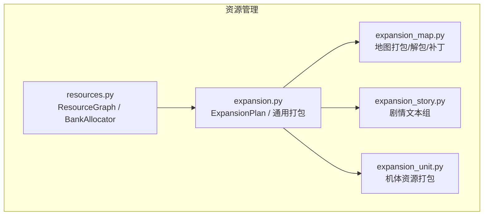
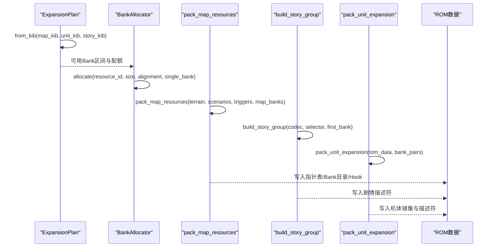
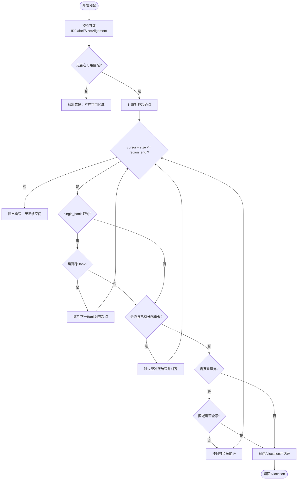
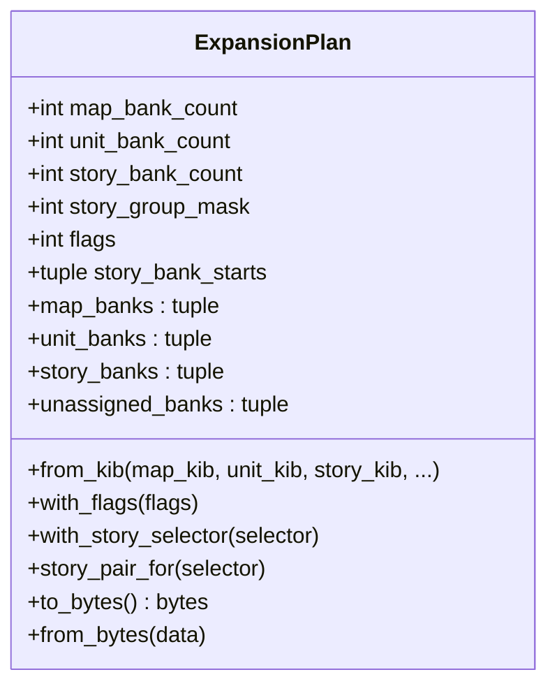
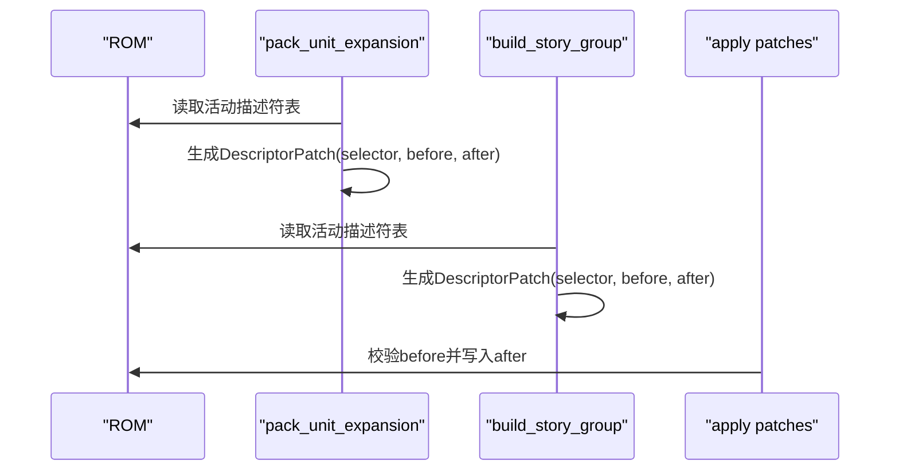
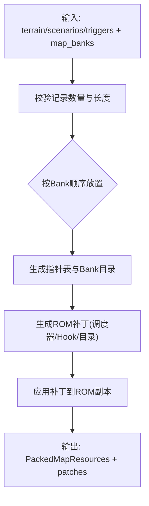
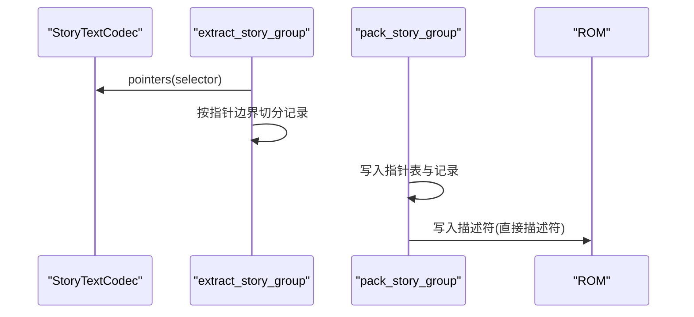
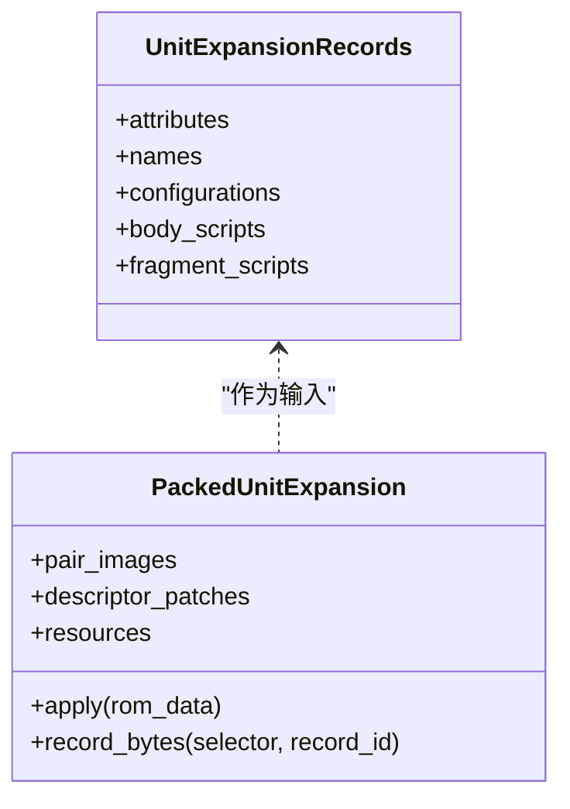
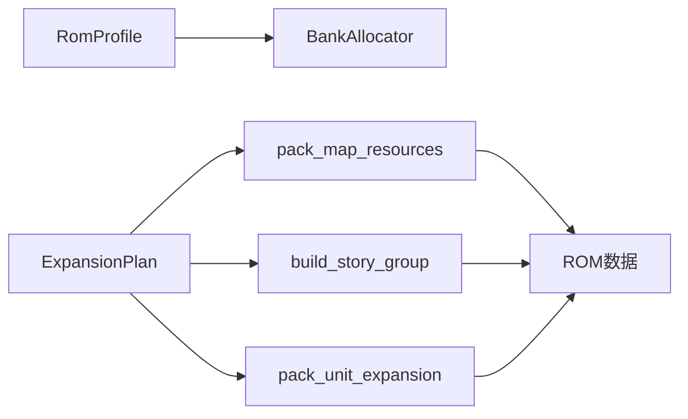

# 资源管理API

<cite>
**本文引用的文件**
- [resources.py](file://src/fc_editor/resources.py)
- [expansion.py](file://src/fc_editor/expansion.py)
- [expansion_map.py](file://src/fc_editor/expansion_map.py)
- [expansion_story.py](file://src/fc_editor/expansion_story.py)
- [expansion_unit.py](file://src/fc_editor/expansion_unit.py)
</cite>

## 目录
1. [简介](#简介)
2. [项目结构](#项目结构)
3. [核心组件](#核心组件)
4. [架构总览](#架构总览)
5. [详细组件分析](#详细组件分析)
6. [依赖关系分析](#依赖关系分析)
7. [性能与优化建议](#性能与优化建议)
8. [故障排查指南](#故障排查指南)
9. [结论](#结论)
10. [附录：使用示例与最佳实践](#附录使用示例与最佳实践)

## 简介
本文件面向“资源管理API”，聚焦以下目标：
- BankAllocator 类的内存分配与管理接口，包括容量、对齐、冲突检测与释放。
- ExpansionPlan 容量规划接口，以及资源描述符管理与分区分配方法。
- 地图资源管理API：地形Bank目录、场景布局、触发器资源的打包与解包。
- 资源优化的最佳实践与性能调优建议。
- 实际资源分配示例与常见问题解决方案。

该API围绕MMC3（Mapper 194）的PRG Bank扩展空间进行设计，将可管理的464 KiB区域划分为地图、机体、剧情等配额，并通过指针表、Bank目录和运行时Hook实现动态装载。

## 项目结构
本项目在 fc_editor 子模块中提供资源管理相关能力：
- resources.py：通用资源图与Bank分配器（BankAllocator）。
- expansion.py：全局容量规划（ExpansionPlan）、通用打包工具、资源选择器常量。
- expansion_map.py：地图资源打包/解包、补丁生成与应用、布局读取。
- expansion_story.py：剧情文本组提取、打包与描述符更新。
- expansion_unit.py：机体资源提取、打包、多Bank对镜像与描述符更新。

**图表来源**
- [resources.py:47-260](file://src/fc_editor/resources.py#L47-L260)
- [expansion.py:84-318](file://src/fc_editor/expansion.py#L84-L318)
- [expansion_map.py:174-418](file://src/fc_editor/expansion_map.py#L174-L418)
- [expansion_story.py:175-297](file://src/fc_editor/expansion_story.py#L175-L297)
- [expansion_unit.py:540-800](file://src/fc_editor/expansion_unit.py#L540-L800)

**章节来源**
- [resources.py:1-413](file://src/fc_editor/resources.py#L1-L413)
- [expansion.py:1-432](file://src/fc_editor/expansion.py#L1-L432)
- [expansion_map.py:1-609](file://src/fc_editor/expansion_map.py#L1-L609)
- [expansion_story.py:1-297](file://src/fc_editor/expansion_story.py#L1-L297)
- [expansion_unit.py:1-800](file://src/fc_editor/expansion_unit.py#L1-L800)

## 核心组件
- ResourceNode / ResourceReference / ResourceGraph：以命名资源与跨资源引用构建ROM资源图，便于编辑器模块定位与校验。
- Allocation / BankAllocator：确定性首次适配分配器，基于配置声明的可用PRG区域进行对齐、冲突检测与零填充检查。
- ExpansionPlan：确定性的464 KiB池划分，支持地图、机体、剧情三类配额及剧情组绑定。
- 地图资源打包/解包：pack_map_resources、build_map_resource_patches、apply_map_resource_patches、read_expanded_map_layout/payloads。
- 剧情文本组：extract_story_group、pack_story_group、build_story_group。
- 机体资源：extract_unit_expansion_records、pack_unit_expansion、资源布局与描述符补丁。

**章节来源**
- [resources.py:14-260](file://src/fc_editor/resources.py#L14-L260)
- [resources.py:263-413](file://src/fc_editor/resources.py#L263-L413)
- [expansion.py:84-318](file://src/fc_editor/expansion.py#L84-L318)
- [expansion_map.py:71-145](file://src/fc_editor/expansion_map.py#L71-L145)
- [expansion_map.py:174-418](file://src/fc_editor/expansion_map.py#L174-L418)
- [expansion_story.py:76-173](file://src/fc_editor/expansion_story.py#L76-L173)
- [expansion_story.py:175-297](file://src/fc_editor/expansion_story.py#L175-L297)
- [expansion_unit.py:68-231](file://src/fc_editor/expansion_unit.py#L68-L231)
- [expansion_unit.py:333-800](file://src/fc_editor/expansion_unit.py#L333-L800)

## 架构总览
下图展示从容量规划到具体资源打包、再到ROM补丁应用的端到端流程。

**图表来源**
- [expansion.py:130-175](file://src/fc_editor/expansion.py#L130-L175)
- [resources.py:368-413](file://src/fc_editor/resources.py#L368-L413)
- [expansion_map.py:174-418](file://src/fc_editor/expansion_map.py#L174-L418)
- [expansion_story.py:272-297](file://src/fc_editor/expansion_story.py#L272-L297)
- [expansion_unit.py:540-800](file://src/fc_editor/expansion_unit.py#L540-L800)

## 详细组件分析

### BankAllocator：容量规划与分配策略
- 容量与已用：capacity 来自 profile.free_prg_regions 的总和；used 为当前已分配大小之和；available = capacity - used。
- 对齐策略：_align(value, alignment) 确保起始位置满足2的幂对齐；allocate 时按 region.start 对齐后扫描。
- 单Bank约束：single_bank=True 时，若分配跨越Bank边界，则跳到下一个Bank的对齐起点继续尝试。
- 冲突检测：_overlap(offset, size) 检测与已有分配的区间重叠；reserve 与 allocate 均会拒绝重叠。
- 零填充检查：require_zero_fill=True 时，若目标区域非全零，则跳过并继续寻找下一个对齐位置。
- 安全校验：resource_id格式、label非空、size>0、alignment为2的幂、offset必须在free region内且满足对齐。

**图表来源**
- [resources.py:368-413](file://src/fc_editor/resources.py#L368-L413)
- [resources.py:311-354](file://src/fc_editor/resources.py#L311-L354)

**章节来源**
- [resources.py:280-413](file://src/fc_editor/resources.py#L280-L413)

### ExpansionPlan：容量规划接口
- 配额校验：map/unit/story 配额必须落在可用Bank集合内，总和不超过464 KiB；unit配额仅支持48/64/80 KiB；story配额必须是16 KiB的倍数且不超过最大验证组数。
- 剧情组绑定：story_group_mask 指示哪些剧情组被搬移；story_bank_starts 指定每个组的起始Bank对；with_story_selector(selector) 自动分配未使用的pair。
- Bank视图：map_banks、unit_banks、story_banks、unassigned_banks 提供不同视角的Bank序列；story_pairs 提供成对的剧情Bank。
- 序列化：to_bytes/from_bytes 用于持久化容量表，含CRC校验。

**图表来源**
- [expansion.py:84-318](file://src/fc_editor/expansion.py#L84-L318)

**章节来源**
- [expansion.py:84-318](file://src/fc_editor/expansion.py#L84-L318)

### 资源描述符管理
- 资源选择器：UNIT_RESOURCE_SELECTOR、SCENARIO_RESOURCE_SELECTOR、STORY_SELECTORS 等定义运行时资源入口。
- 描述符表：位于固定Bank $7F 的偏移处，通过 selector*2 索引获取两字节描述符。
- 更新机制：各模块生成 DescriptorPatch，应用时校验原始值并替换为新描述符，指向新的Bank对或目录索引。

**图表来源**
- [expansion_unit.py:96-107](file://src/fc_editor/expansion_unit.py#L96-L107)
- [expansion_unit.py:493-510](file://src/fc_editor/expansion_unit.py#L493-L510)
- [expansion_story.py:28-31](file://src/fc_editor/expansion_story.py#L28-L31)

**章节来源**
- [expansion_unit.py:96-107](file://src/fc_editor/expansion_unit.py#L96-L107)
- [expansion_unit.py:493-510](file://src/fc_editor/expansion_unit.py#L493-L510)
- [expansion_story.py:28-31](file://src/fc_editor/expansion_story.py#L28-L31)

### 地图资源管理API
- 打包：pack_map_resources 将地形、部署、事件三种资源放入共享池，按Bank顺序连续放置，禁止记录跨Bank；相同部署/事件记录去重共享存储。
- 补丁：build_map_resource_patches 校验ROM原代码/空洞，生成指针表、Bank目录与Hook补丁；apply_map_resource_patches 原子应用。
- 布局读取：read_expanded_map_layout 读取三组指针表与Bank目录，推导每条记录的容量与文件偏移；read_expanded_map_payloads 提取原始负载。

**图表来源**
- [expansion_map.py:174-252](file://src/fc_editor/expansion_map.py#L174-L252)
- [expansion_map.py:272-418](file://src/fc_editor/expansion_map.py#L272-L418)

**章节来源**
- [expansion_map.py:174-418](file://src/fc_editor/expansion_map.py#L174-L418)

### 剧情资源管理API
- 提取：extract_story_group 根据StoryTextCodec的指针缓存，按selector分组并保留别名关系。
- 打包：pack_story_group 将逻辑记录压缩进独立16 KiB pair，重建指针表；build_story_group 支持替换特定索引的记录。
- 描述符：descriptor 为直接描述符（$F0 + first_bank），写入活动描述符表以指向新pair。

**图表来源**
- [expansion_story.py:175-229](file://src/fc_editor/expansion_story.py#L175-L229)
- [expansion_story.py:232-269](file://src/fc_editor/expansion_story.py#L232-L269)
- [expansion_story.py:272-297](file://src/fc_editor/expansion_story.py#L272-L297)

**章节来源**
- [expansion_story.py:175-297](file://src/fc_editor/expansion_story.py#L175-L297)

### 机体资源管理API
- 提取：extract_unit_expansion_records 从源Bank对读取属性、名称、战斗外观、主体/碎片脚本五类记录，并进行范围与终止符校验。
- 打包：pack_unit_expansion 将资源重新分配到指定的Bank对镜像中，生成资源布局与描述符补丁；支持名称外置到独立pair。
- 应用：PackedUnitExpansion.apply 将镜像写入目标Bank对，并校验/更新活动描述符表。

**图表来源**
- [expansion_unit.py:130-173](file://src/fc_editor/expansion_unit.py#L130-L173)
- [expansion_unit.py:333-385](file://src/fc_editor/expansion_unit.py#L333-L385)
- [expansion_unit.py:540-800](file://src/fc_editor/expansion_unit.py#L540-L800)

**章节来源**
- [expansion_unit.py:130-800](file://src/fc_editor/expansion_unit.py#L130-L800)

## 依赖关系分析
- BankAllocator 依赖 RomProfile 提供的 free_prg_regions 与保护区域信息，确保分配不越界。
- ExpansionPlan 依赖 AVAILABLE_EXPANSION_BANKS 与 STORY_SELECTORS，保证配额合法与剧情组绑定一致。
- 地图/剧情/机体打包模块依赖各自的选择器与描述符表偏移，生成并应用补丁。
- 地图模块还依赖ROM中的调度器与Hook代码片段，确保补丁前状态一致。

**图表来源**
- [resources.py:80-260](file://src/fc_editor/resources.py#L80-L260)
- [expansion.py:11-35](file://src/fc_editor/expansion.py#L11-L35)
- [expansion_map.py:174-418](file://src/fc_editor/expansion_map.py#L174-L418)
- [expansion_story.py:175-297](file://src/fc_editor/expansion_story.py#L175-L297)
- [expansion_unit.py:540-800](file://src/fc_editor/expansion_unit.py#L540-L800)

**章节来源**
- [resources.py:80-260](file://src/fc_editor/resources.py#L80-L260)
- [expansion.py:11-35](file://src/fc_editor/expansion.py#L11-L35)
- [expansion_map.py:174-418](file://src/fc_editor/expansion_map.py#L174-L418)
- [expansion_story.py:175-297](file://src/fc_editor/expansion_story.py#L175-L297)
- [expansion_unit.py:540-800](file://src/fc_editor/expansion_unit.py#L540-L800)

## 性能与优化建议
- 对齐与单Bank限制：优先使用较大的对齐值减少碎片；开启 single_bank 避免跨Bank跳转带来的额外开销。
- 零填充检查：require_zero_fill 可避免重复写入，但会增加扫描成本；在批量打包时可关闭并在后续统一清零。
- 去重共享：地图部署与事件记录默认去重，显著降低重复数据的占用；建议在编辑阶段尽量复用相同内容。
- 资源分组：将频繁访问的资源放在相邻Bank，减少切换次数；剧情组尽量集中分配以减少描述符分散。
- 批量应用补丁：合并所有补丁并按偏移排序后一次性应用，减少多次读写与校验开销。

[本节为通用指导，不直接分析具体文件]

## 故障排查指南
- 资源ID无效或重复：检查 resource_id 是否符合正则格式且不重复；确认 label 非空。
- 对齐失败：确保 alignment 为2的幂，且 offset % alignment == 0。
- 超出可用区域：确认分配范围完全落在 free_prg_regions 内；单Bank模式下不得跨Bank边界。
- 冲突重叠：检查是否存在与其他分配的重叠区间；必要时调整顺序或扩大配额。
- 地图补丁失败：确认ROM中的调度器/Hook与原版本一致；若已被其他修改覆盖，需先恢复或重新打补丁。
- 剧情/机体描述符不一致：活动描述符表的原始值必须匹配；否则无法安全替换。

**章节来源**
- [resources.py:334-354](file://src/fc_editor/resources.py#L334-L354)
- [resources.py:368-413](file://src/fc_editor/resources.py#L368-L413)
- [expansion_map.py:272-418](file://src/fc_editor/expansion_map.py#L272-L418)
- [expansion_unit.py:215-231](file://src/fc_editor/expansion_unit.py#L215-L231)

## 结论
本资源管理API通过明确的配额规划、严格的对齐与冲突检测、以及稳健的补丁机制，实现了在MMC3扩展空间上的高效资源组织与动态加载。借助 BankAllocator、ExpansionPlan 与各资源模块的协同，可在有限ROM空间内最大化容纳地图、机体与剧情内容，同时保持运行时的稳定性与可维护性。

[本节为总结，不直接分析具体文件]

## 附录：使用示例与最佳实践
- 容量规划示例：
  - 使用 ExpansionPlan.from_kib(map_kib=16, unit_kib=64, story_kib=32) 规划16 KiB地图、64 KiB机体、32 KiB剧情。
  - 通过 with_story_selector(selector) 逐步启用剧情组，确保 story_bank_starts 与 mask 一致。
- 资源分配示例：
  - 使用 BankAllocator.allocate("auto.my_code", "我的代码", size=2048, alignment=256, single_bank=True) 分配对齐且单Bank的代码区。
  - 使用 reserve 预占关键区域，避免后续分配冲突。
- 地图打包示例：
  - 准备 terrain/scenarios/triggers 记录，调用 pack_map_resources 得到 PackedMapResources。
  - 调用 build_map_resource_patches 生成补丁，再用 apply_map_resource_patches 应用到ROM副本。
- 剧情打包示例：
  - 使用 extract_story_group 提取某selector的记录，必要时替换部分索引，再调用 pack_story_group 打包到新pair。
  - 将生成的描述符写入活动描述符表。
- 机体打包示例：
  - 使用 extract_unit_expansion_records 读取源记录，调用 pack_unit_expansion 分配到指定bank pairs。
  - 应用 PackedUnitExpansion.apply 将镜像与描述符写入ROM。

**章节来源**
- [expansion.py:130-175](file://src/fc_editor/expansion.py#L130-L175)
- [resources.py:368-413](file://src/fc_editor/resources.py#L368-L413)
- [expansion_map.py:174-418](file://src/fc_editor/expansion_map.py#L174-L418)
- [expansion_story.py:175-297](file://src/fc_editor/expansion_story.py#L175-L297)
- [expansion_unit.py:333-800](file://src/fc_editor/expansion_unit.py#L333-L800)