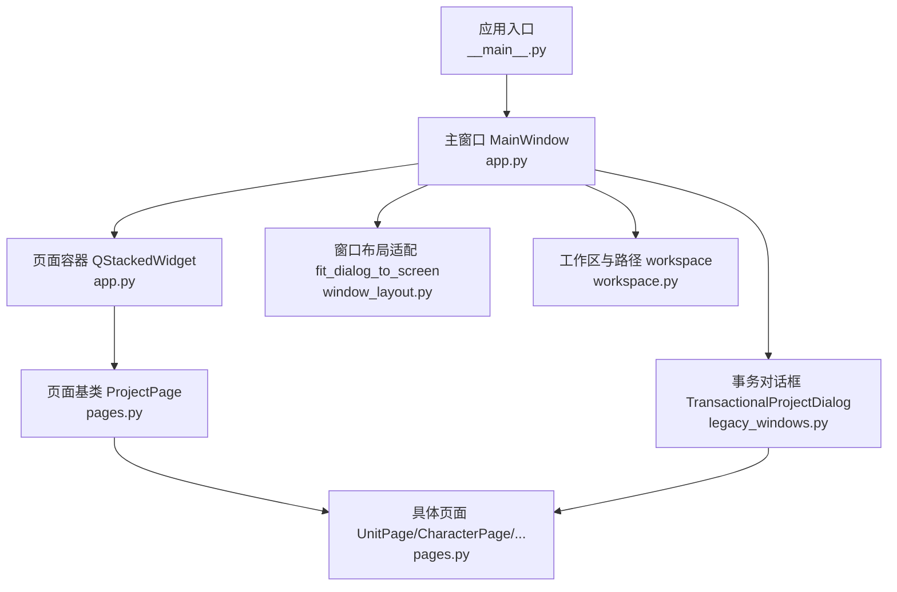
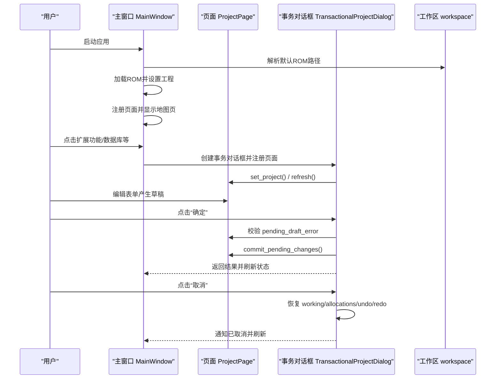
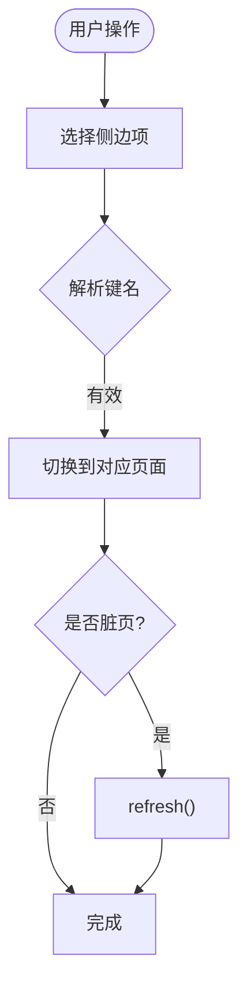
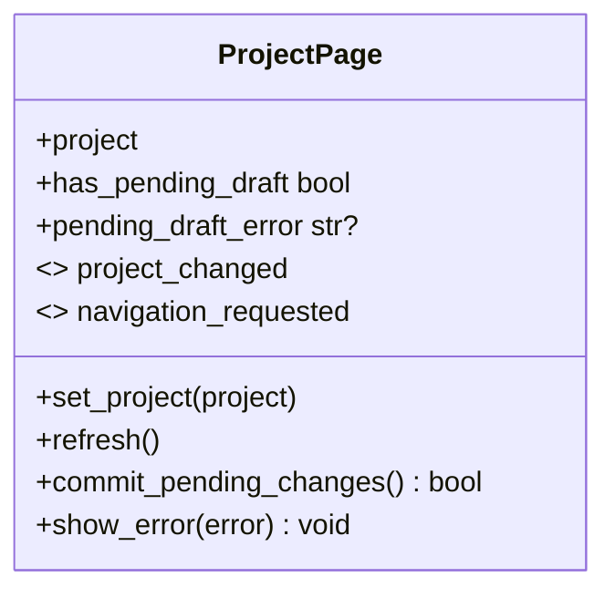
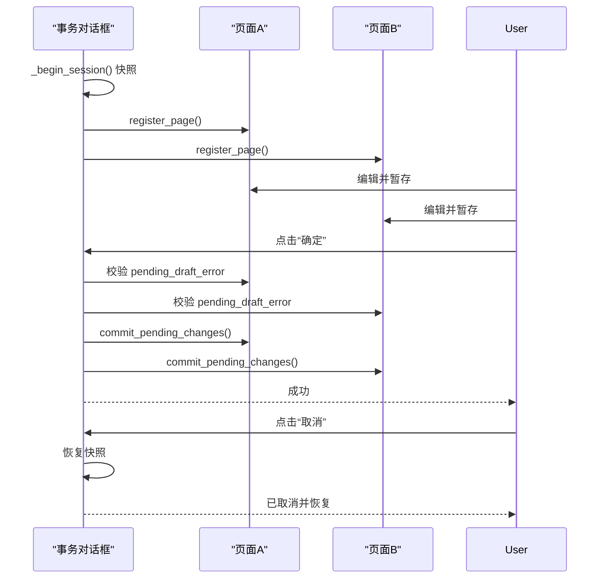
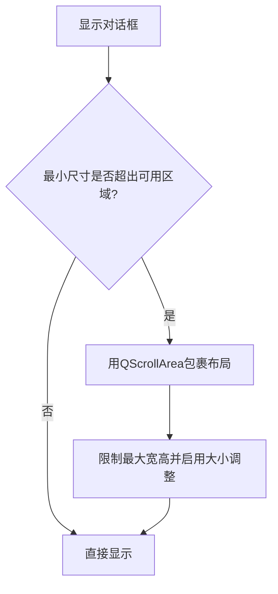
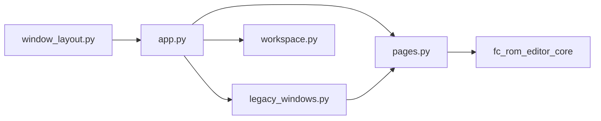

# GUI开发指南

<cite>
**本文引用的文件**
- [app.py](file://src/dc_modifier/app.py)
- [pages.py](file://src/dc_modifier/pages.py)
- [legacy_windows.py](file://src/dc_modifier/legacy_windows.py)
- [window_layout.py](file://src/dc_modifier/window_layout.py)
- [workspace.py](file://src/dc_modifier/workspace.py)
- [__main__.py](file://src/dc_modifier/__main__.py)
- [test_dc_modifier_ui.py](file://tests/test_dc_modifier_ui.py)
</cite>

## 目录
1. [简介](#简介)
2. [项目结构](#项目结构)
3. [核心组件](#核心组件)
4. [架构总览](#架构总览)
5. [详细组件分析](#详细组件分析)
6. [依赖关系分析](#依赖关系分析)
7. [性能与体验优化](#性能与体验优化)
8. [故障排查指南](#故障排查指南)
9. [结论](#结论)
10. [附录：开发示例与最佳实践](#附录开发示例与最佳实践)

## 简介
本指南面向DC修改器的GUI开发，聚焦PySide6在窗口布局、页面切换、事件处理、对话框管理、样式定制与响应式适配等方面的实践。文档基于仓库中现有实现，提炼可复用的模式与规范，帮助开发者快速创建自定义编辑器页面、实现数据绑定与用户交互、构建模态对话框与验证流程，并保证良好的用户体验与可测试性。

## 项目结构
DC修改器采用“主窗口 + 页面 + 事务对话框”的分层组织方式：
- 应用入口与主窗口：负责菜单、工具栏、状态栏、页面注册与导航。
- 页面基类与具体页面：封装业务编辑逻辑、表单状态、草稿提交与错误提示。
- 事务对话框：为每个编辑会话提供“整体确认/取消”的撤销语义。
- 工作区与路径：统一ROM与导出路径策略，避免误写参考目录。
- 窗口布局适配：在小屏或高DPI下自动包裹滚动区域，保障旧版表单可用。

**图示来源**
- [__main__.py:1-6](file://src/dc_modifier/__main__.py#L1-L6)
- [app.py:276-365](file://src/dc_modifier/app.py#L276-L365)
- [pages.py:103-152](file://src/dc_modifier/pages.py#L103-L152)
- [legacy_windows.py:71-114](file://src/dc_modifier/legacy_windows.py#L71-L114)
- [window_layout.py:5-25](file://src/dc_modifier/window_layout.py#L5-L25)
- [workspace.py:7-43](file://src/dc_modifier/workspace.py#L7-L43)

**章节来源**
- [__main__.py:1-6](file://src/dc_modifier/__main__.py#L1-L6)
- [app.py:276-365](file://src/dc_modifier/app.py#L276-L365)
- [pages.py:103-152](file://src/dc_modifier/pages.py#L103-L152)
- [legacy_windows.py:71-114](file://src/dc_modifier/legacy_windows.py#L71-L114)
- [window_layout.py:5-25](file://src/dc_modifier/window_layout.py#L5-L25)
- [workspace.py:7-43](file://src/dc_modifier/workspace.py#L7-L43)

## 核心组件
- 主窗口（MainWindow）
  - 职责：菜单/动作、页面注册与导航、状态栏信息、拖放支持、未保存变更检测、扩展功能入口。
  - 关键机制：QListWidget侧边导航 + QStackedWidget页面容器；通过键名映射到页签索引进行切换。
- 页面基类（ProjectPage）
  - 职责：统一的“草稿-提交”生命周期、错误提示、刷新接口、导航信号。
  - 关键机制：has_pending_draft/pending_draft_error/commit_pending_changes；子页面通过apply_button暴露草稿提交入口。
- 事务对话框（TransactionalProjectDialog）
  - 职责：将多个页面纳入同一编辑会话，支持“确定”时批量提交、“取消”时完整回滚ROM与分配器状态。
  - 关键机制：会话快照（working字节、资源分配、撤销/重做栈），冲突检查（同记录多草稿）。
- 窗口布局适配（fit_dialog_to_screen）
  - 职责：对固定尺寸或最小尺寸过大的旧表单自动包裹滚动区域，限制最大宽高并启用大小调整手柄。
- 工作区与路径（workspace）
  - 职责：定位工程根目录、默认ROM、导出目录；禁止写入references只读目录。

**章节来源**
- [app.py:276-365](file://src/dc_modifier/app.py#L276-L365)
- [pages.py:103-152](file://src/dc_modifier/pages.py#L103-L152)
- [legacy_windows.py:71-114](file://src/dc_modifier/legacy_windows.py#L71-L114)
- [window_layout.py:5-25](file://src/dc_modifier/window_layout.py#L5-L25)
- [workspace.py:7-43](file://src/dc_modifier/workspace.py#L7-L43)

## 架构总览
下图展示从启动到打开ROM、进入页面、发起编辑会话、提交/取消的完整流程。

**图示来源**
- [app.py:276-365](file://src/dc_modifier/app.py#L276-L365)
- [app.py:494-505](file://src/dc_modifier/app.py#L494-L505)
- [legacy_windows.py:71-114](file://src/dc_modifier/legacy_windows.py#L71-L114)
- [legacy_windows.py:177-259](file://src/dc_modifier/legacy_windows.py#L177-L259)
- [workspace.py:7-43](file://src/dc_modifier/workspace.py#L7-L43)

## 详细组件分析

### 主窗口与页面导航
- 页面注册与切换
  - 通过_add_page将页面加入列表与QStackedWidget，并建立键名到索引的映射。
  - show_page根据键名切换当前页，并在必要时刷新脏页。
- 侧边导航联动
  - QListWidget选择变化触发_show_page_by_index，反向更新workspace当前页。
- 状态栏与信息
  - 坐标、模块名称、修改字节数等状态标签用于反馈。

**图示来源**
- [app.py:342-385](file://src/dc_modifier/app.py#L342-L385)

**章节来源**
- [app.py:342-385](file://src/dc_modifier/app.py#L342-L385)

### 页面基类与草稿机制
- 草稿生命周期
  - has_pending_draft：通过是否存在启用的apply_button判断。
  - pending_draft_error：子类可覆盖以提供无法提交的错误原因。
  - commit_pending_changes：调用apply_button执行提交，若仍为草稿则刷新UI。
- 错误提示
  - show_error统一使用QMessageBox.critical弹出错误。
- 导航信号
  - navigation_requested用于请求跳转到其他页面（如概览页快捷入口）。

**图示来源**
- [pages.py:103-152](file://src/dc_modifier/pages.py#L103-L152)

**章节来源**
- [pages.py:103-152](file://src/dc_modifier/pages.py#L103-L152)

### 事务对话框与会话一致性
- 会话快照
  - 显示时记录working字节、资源分配、撤销/重做栈。
- 提交流程
  - 遍历所有页面的pending状态，先校验错误再依次提交。
- 取消流程
  - 恢复working、BankAllocator、撤销/重做栈，并通知上层。
- 冲突检测
  - 针对共享资源（如章节事件指令）阻止多页同时持有相同资源的草稿。

**图示来源**
- [legacy_windows.py:71-114](file://src/dc_modifier/legacy_windows.py#L71-L114)
- [legacy_windows.py:177-259](file://src/dc_modifier/legacy_windows.py#L177-L259)
- [legacy_windows.py:202-223](file://src/dc_modifier/legacy_windows.py#L202-L223)

**章节来源**
- [legacy_windows.py:71-114](file://src/dc_modifier/legacy_windows.py#L71-L114)
- [legacy_windows.py:177-259](file://src/dc_modifier/legacy_windows.py#L177-L259)
- [legacy_windows.py:202-223](file://src/dc_modifier/legacy_windows.py#L202-L223)

### 窗口布局适配与响应式
- 小屏/高DPI适配
  - 当对话框最小尺寸超过屏幕可用区域或固定尺寸过大时，自动用QScrollArea包裹内容，限制最大宽高并启用大小调整手柄。
- 主窗口自适应
  - 主窗口保持合理的最小尺寸，并通过状态栏与页面内控件提供足够信息密度。

**图示来源**
- [window_layout.py:5-25](file://src/dc_modifier/window_layout.py#L5-L25)

**章节来源**
- [window_layout.py:5-25](file://src/dc_modifier/window_layout.py#L5-L25)

### 样式定制与主题
- 全局样式表
  - 通过QSS定义背景、边框、按钮渐变、选中色、表格头样式等，提升可读性与一致性。
- 数值微调器箭头增强
  - 自定义QProxyStyle绘制更粗的上下箭头，提高可点性与对比度。
- 主题切换建议
  - 将颜色变量集中到样式表，运行时可通过QApplication.setStyleSheet动态替换以实现明/暗主题。
- 响应式设计考虑
  - 结合窗口尺寸变化与页面内部布局（如网格列拉伸、分组框折叠）实现不同屏幕下的良好呈现。

**章节来源**
- [app.py:66-127](file://src/dc_modifier/app.py#L66-L127)
- [app.py:128-233](file://src/dc_modifier/app.py#L128-L233)

### 数据绑定与用户交互
- 搜索与过滤
  - SearchableRecordPage提供文本搜索、上一条/下一条、结果计数、右键复制/粘贴/还原等操作。
- 表单字段与原始记录
  - 高层字段（如属性值）与底层原始记录（如16字节hex）并存，便于精确控制与可视化编辑。
- 事件驱动
  - 字段valueChanged/textChanged等信号连接至_update_pending_state，实时计算草稿状态并启用/禁用提交按钮。
- 跨页同步
  - 通过transaction_sync_group与pending_draft_key/pending_draft_keys标识草稿资源，避免多页冲突。

**章节来源**
- [pages.py:243-511](file://src/dc_modifier/pages.py#L243-L511)
- [pages.py:514-800](file://src/dc_modifier/pages.py#L514-L800)
- [legacy_windows.py:262-318](file://src/dc_modifier/legacy_windows.py#L262-L318)

### 对话框开发模式
- 模态对话框设计
  - 使用TransactionalProjectDialog作为通用外壳，确保“确定/取消”的原子性。
- 用户输入验证
  - 在页面层通过pending_draft_error提供错误文案；在对话框层统一拦截并提示。
- 错误提示处理
  - 使用QMessageBox.warning/critical进行警告与致命错误提示；状态栏用于轻量提示。

**章节来源**
- [legacy_windows.py:71-114](file://src/dc_modifier/legacy_windows.py#L71-L114)
- [legacy_windows.py:202-223](file://src/dc_modifier/legacy_windows.py#L202-L223)
- [pages.py:150-152](file://src/dc_modifier/pages.py#L150-L152)

### 工作区与输出安全
- 默认ROM与导出路径
  - 自动定位工程根目录与默认ROM；导出默认到output/exports。
- 只读保护
  - 禁止写入references目录，防止误覆盖参考数据。

**章节来源**
- [workspace.py:7-43](file://src/dc_modifier/workspace.py#L7-L43)

## 依赖关系分析
- 模块耦合
  - app.py依赖pages.py中的页面类型与workspace路径策略；通过legacy_windows.py提供事务化编辑能力。
  - pages.py依赖fc_rom_editor_core提供的RomProject与编解码能力。
  - window_layout.py仅依赖Qt Widgets，无业务耦合。
- 外部依赖
  - PySide6作为唯一GUI框架依赖；可选依赖用于打包与工具链。

**图示来源**
- [app.py:33-58](file://src/dc_modifier/app.py#L33-L58)
- [pages.py:38-45](file://src/dc_modifier/pages.py#L38-L45)
- [legacy_windows.py:43-60](file://src/dc_modifier/legacy_windows.py#L43-L60)
- [window_layout.py:1-2](file://src/dc_modifier/window_layout.py#L1-L2)
- [workspace.py:1-6](file://src/dc_modifier/workspace.py#L1-L6)

**章节来源**
- [app.py:33-58](file://src/dc_modifier/app.py#L33-L58)
- [pages.py:38-45](file://src/dc_modifier/pages.py#L38-L45)
- [legacy_windows.py:43-60](file://src/dc_modifier/legacy_windows.py#L43-L60)
- [window_layout.py:1-2](file://src/dc_modifier/window_layout.py#L1-L2)
- [workspace.py:1-6](file://src/dc_modifier/workspace.py#L1-L6)

## 性能与体验优化
- 列表与表格渲染
  - 使用setUpdatesEnabled(False)批量更新后恢复，减少闪烁与重绘开销。
- 草稿状态即时反馈
  - 通过信号连接实时更新pending状态，避免用户误以为已提交。
- 小屏适配
  - 自动滚动包裹避免控件不可见；启用大小调整手柄提升灵活性。
- 样式与可访问性
  - 高对比箭头、清晰的焦点边框、合理的行高与间距，提升易用性。

[本节为通用指导，不直接分析具体文件]

## 故障排查指南
- 无法提交草稿
  - 检查页面是否设置了pending_draft_error；确认apply_button是否启用。
- 多页冲突
  - 若出现“同一ROM记录同时存在于多个编辑页的未提交草稿中”，需先保留其中一份并还原另一份。
- 输出被拒绝
  - 若尝试写入references目录会抛出异常；请改为output或其他非只读路径。
- 对话框在小屏不可用
  - 确认是否触发了fit_dialog_to_screen；必要时手动调整对话框最小尺寸。

**章节来源**
- [legacy_windows.py:131-160](file://src/dc_modifier/legacy_windows.py#L131-L160)
- [legacy_windows.py:202-223](file://src/dc_modifier/legacy_windows.py#L202-L223)
- [workspace.py:37-43](file://src/dc_modifier/workspace.py#L37-L43)
- [window_layout.py:5-25](file://src/dc_modifier/window_layout.py#L5-L25)

## 结论
DC修改器的GUI以“主窗口+页面+事务对话框”为核心，配合统一的草稿机制、冲突检测与样式系统，提供了稳定且可扩展的编辑体验。遵循本文档的模式与规范，可以快速实现新的编辑器页面与对话框，并确保一致的用户体验与健壮的错误处理。

[本节为总结，不直接分析具体文件]

## 附录：开发示例与最佳实践

### 从零开始：创建一个简单表单页面
- 步骤
  - 继承ProjectPage，实现refresh与load_record。
  - 使用QFormLayout/QGridLayout组织控件，连接valueChanged/textChanged信号到_update_pending_state。
  - 暴露apply_button，并在其槽函数中执行提交逻辑，必要时调用show_error。
  - 在MainWindow._build_pages中注册页面，或通过扩展对话框注册。
- 关键点
  - 使用page_title生成标题与副标题以保持视觉一致。
  - 通过navigation_requested.emit(page_key)实现快捷跳转。

**章节来源**
- [pages.py:103-152](file://src/dc_modifier/pages.py#L103-L152)
- [pages.py:154-241](file://src/dc_modifier/pages.py#L154-L241)
- [app.py:352-365](file://src/dc_modifier/app.py#L352-L365)

### 复杂编辑器：机体编辑页面
- 特点
  - 左侧记录列表 + 右侧详情面板，支持搜索、复制/粘贴、导出/导入数据包。
  - 高层字段与原始记录并存，支持精确编辑与可视化预览。
  - 通过preferred_record_id智能选择初始记录。
- 交互流程
  - 选择记录 -> 加载字段 -> 编辑 -> 暂存 -> 批量提交或取消。

**章节来源**
- [pages.py:514-800](file://src/dc_modifier/pages.py#L514-L800)
- [legacy_windows.py:320-493](file://src/dc_modifier/legacy_windows.py#L320-L493)

### 对话框：模态编辑会话
- 使用TransactionalProjectDialog包装任意页面集合，确保“确定/取消”的原子性。
- 在register_page中注入页面，并处理project_changed与navigation_requested信号。
- 利用冲突检查避免多页同时编辑同一资源。

**章节来源**
- [legacy_windows.py:71-114](file://src/dc_modifier/legacy_windows.py#L71-L114)
- [legacy_windows.py:177-259](file://src/dc_modifier/legacy_windows.py#L177-L259)
- [legacy_windows.py:202-223](file://src/dc_modifier/legacy_windows.py#L202-L223)

### 样式与主题：QSS与自定义样式
- 将常用样式集中在STYLE_SHEET中，通过QApplication.setStyleSheet应用。
- 使用VisibleArrowStyle增强数值控件的可访问性。
- 主题切换：维护多套样式表字符串，运行时切换即可。

**章节来源**
- [app.py:66-127](file://src/dc_modifier/app.py#L66-L127)
- [app.py:128-233](file://src/dc_modifier/app.py#L128-L233)

### UI测试与验收
- 使用offscreen平台运行Qt测试，避免图形界面依赖。
- 断言主窗口菜单、快捷键、默认导出路径、样式绘制等行为。
- 模拟草稿状态与提交流程，验证事务对话框的回滚行为。

**章节来源**
- [test_dc_modifier_ui.py:52-121](file://tests/test_dc_modifier_ui.py#L52-L121)
- [test_dc_modifier_ui.py:159-200](file://tests/test_dc_modifier_ui.py#L159-L200)