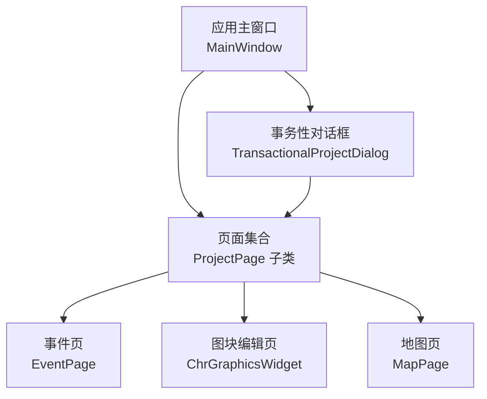
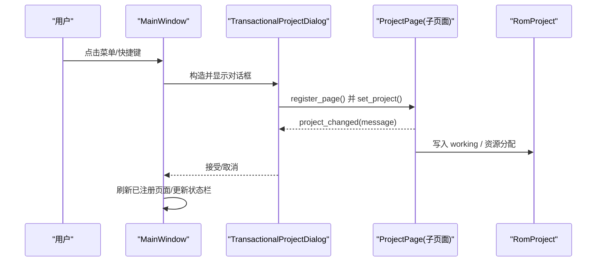
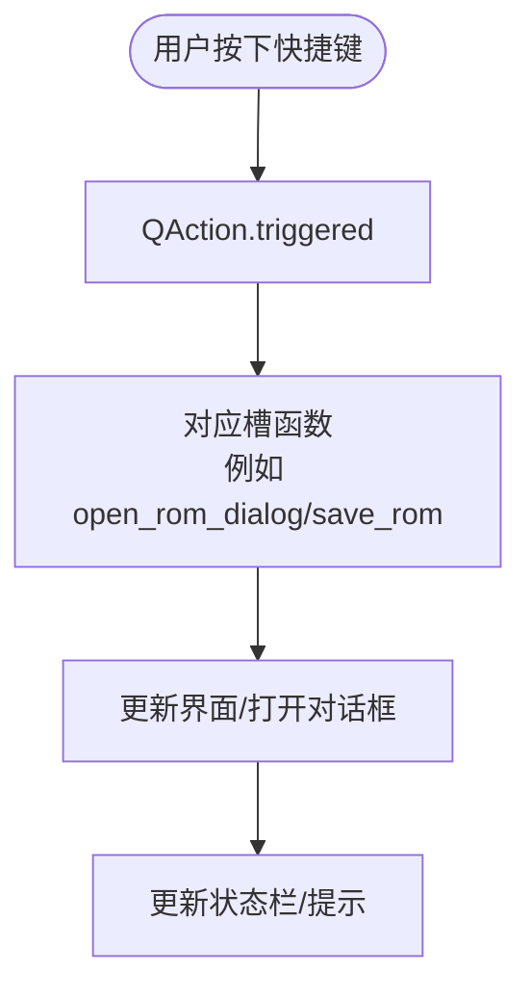
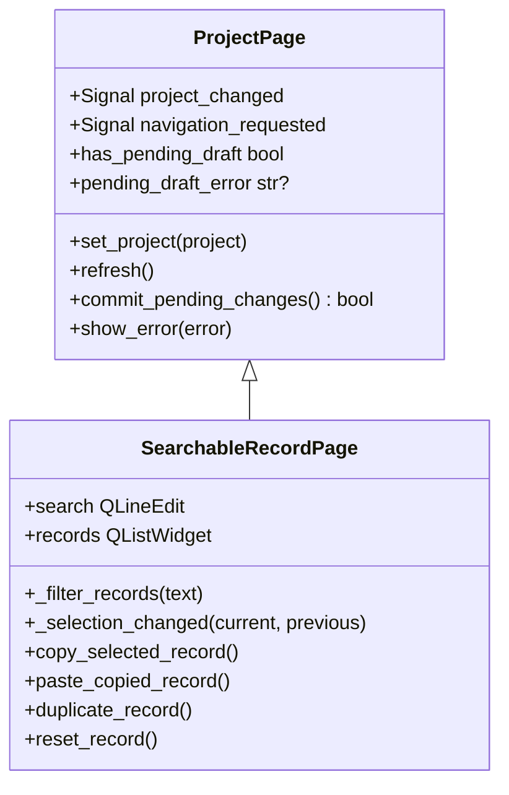
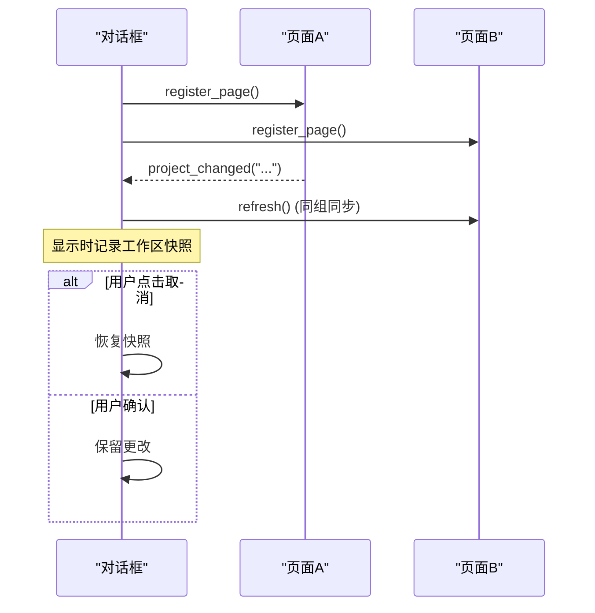
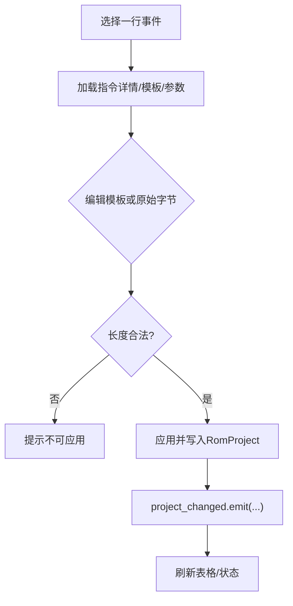
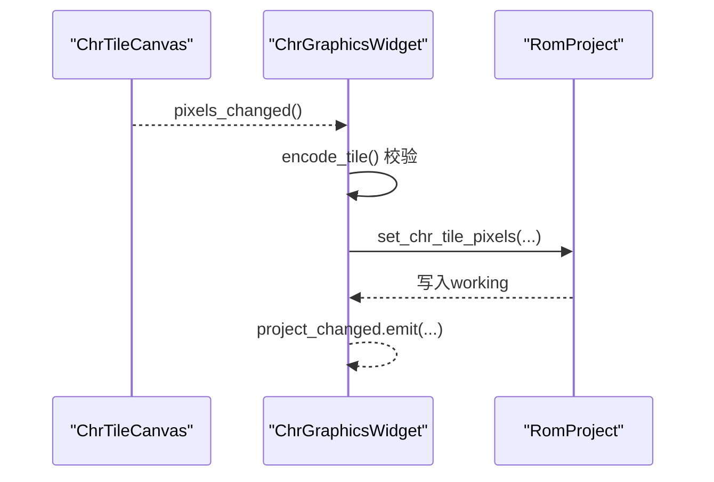
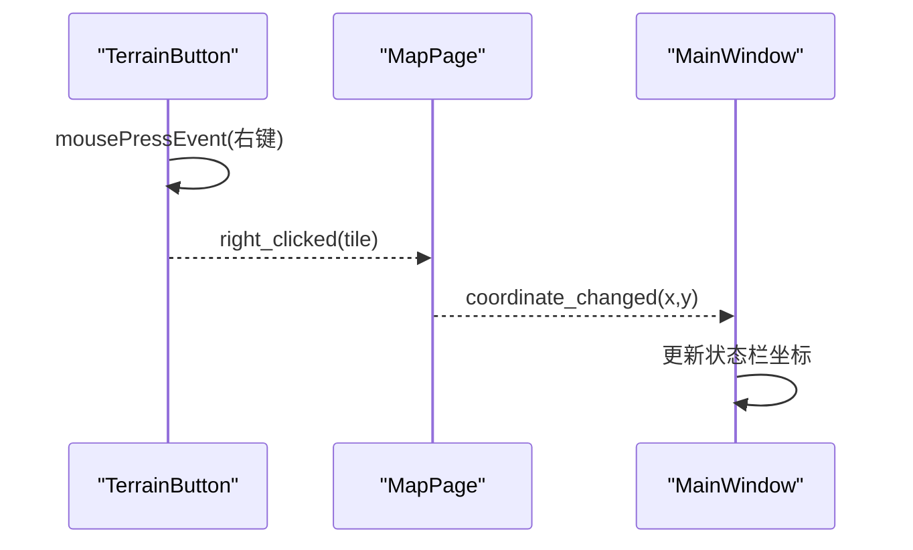
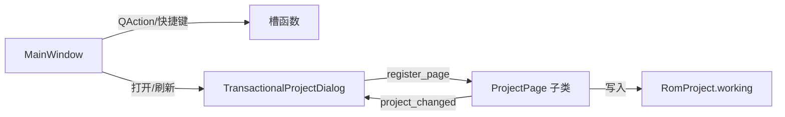

# 事件处理

<cite>
**本文引用的文件**
- [app.py](file://src/dc_modifier/app.py)
- [pages.py](file://src/dc_modifier/pages.py)
- [event_page.py](file://src/dc_modifier/event_page.py)
- [chr_widget.py](file://src/dc_modifier/chr_widget.py)
- [map_page.py](file://src/dc_modifier/map_page.py)
- [legacy_windows.py](file://src/dc_modifier/legacy_windows.py)
</cite>

## 目录
1. [简介](#简介)
2. [项目结构](#项目结构)
3. [核心组件](#核心组件)
4. [架构总览](#架构总览)
5. [详细组件分析](#详细组件分析)
6. [依赖关系分析](#依赖关系分析)
7. [性能考虑](#性能考虑)
8. [故障排查指南](#故障排查指南)
9. [结论](#结论)
10. [附录：示例与最佳实践](#附录示例与最佳实践)

## 简介
本指南面向DC修改器（PySide6）的事件处理，系统梳理信号槽机制、用户交互事件捕获与传播、复杂交互场景（拖拽、快捷键、上下文菜单），并给出性能优化、内存管理与错误处理的实践建议。文档以仓库中实际代码为依据，覆盖从简单按钮点击到多步骤编辑流程的完整事件链路。

## 项目结构
DC修改器的UI与事件处理主要分布在以下模块：
- 应用主窗口与菜单/动作：负责全局快捷键、菜单触发、窗口级状态更新与对话框生命周期管理
- 页面基类与通用记录页：提供统一的“草稿-提交”模型、导航请求、错误提示等
- 具体功能页：如战场事件编辑、CHR图块编辑、地图绘制等，各自实现细粒度鼠标/键盘/焦点事件
- 事务性对话框：将多个页面的编辑会话封装为一次可撤销/可恢复的事务

**图表来源**
- [app.py:276-488](file://src/dc_modifier/app.py#L276-L488)
- [pages.py:103-152](file://src/dc_modifier/pages.py#L103-L152)
- [event_page.py:66-227](file://src/dc_modifier/event_page.py#L66-L227)
- [chr_widget.py:162-274](file://src/dc_modifier/chr_widget.py#L162-L274)
- [map_page.py:88-104](file://src/dc_modifier/map_page.py#L88-L104)
- [legacy_windows.py:71-192](file://src/dc_modifier/legacy_windows.py#L71-L192)

**章节来源**
- [app.py:276-488](file://src/dc_modifier/app.py#L276-L488)
- [pages.py:103-152](file://src/dc_modifier/pages.py#L103-L152)
- [legacy_windows.py:71-192](file://src/dc_modifier/legacy_windows.py#L71-L192)

## 核心组件
- 应用主窗口 MainWindow：集中定义 QAction 与快捷键，统一通过 _action 创建并连接槽；维护页面栈、状态栏、拖放支持；打开工具对话框并刷新页面
- 页面基类 ProjectPage：定义 project_changed、navigation_requested 信号；提供 has_pending_draft、pending_draft_error、commit_pending_changes、show_error 的统一接口
- 事务性对话框 TransactionalProjectDialog：在 showEvent 时快照工作区与历史栈，Cancel 或关闭时恢复；聚合多个 ProjectPage 的变更通知与冲突检测
- 具体页面：
  - EventPage：表格+编辑器组合，模板参数与原始字节双通道编辑，严格保持指令长度
  - ChrGraphicsWidget：像素画布与缩略图浏览，批量导入导出，草稿校验
  - MapPage：地形按钮自定义右键事件、坐标状态同步等

**章节来源**
- [app.py:387-488](file://src/dc_modifier/app.py#L387-L488)
- [pages.py:103-152](file://src/dc_modifier/pages.py#L103-L152)
- [legacy_windows.py:71-192](file://src/dc_modifier/legacy_windows.py#L71-L192)
- [event_page.py:66-227](file://src/dc_modifier/event_page.py#L66-L227)
- [chr_widget.py:162-274](file://src/dc_modifier/chr_widget.py#L162-L274)
- [map_page.py:88-104](file://src/dc_modifier/map_page.py#L88-L104)

## 架构总览
下图展示从用户输入到数据持久化的事件流：菜单/快捷键触发 → 主窗口槽函数 → 打开事务对话框 → 页面内部信号槽 → 写入 RomProject.working → 刷新UI与状态栏。

**图表来源**
- [app.py:494-540](file://src/dc_modifier/app.py#L494-L540)
- [legacy_windows.py:102-192](file://src/dc_modifier/legacy_windows.py#L102-L192)
- [pages.py:103-152](file://src/dc_modifier/pages.py#L103-L152)

## 详细组件分析

### 应用主窗口与动作系统（MainWindow）
- 信号与槽
  - closed 信号用于 LauncherWindow 与 MainWindow 的生命周期联动
  - 所有菜单项通过 _action(text, slot, shortcut) 创建并连接 triggered 槽
- 快捷键绑定
  - 文件操作：Ctrl+O/Ctrl+S/Ctrl+X
  - 数据工具：Ctrl+D/W/M/Z/J/F/L/T
  - 工程操作：Ctrl+Shift+O/S、Ctrl+Alt+S、Ctrl+B、F7
  - 撤销/重做：Ctrl+Alt+Z/Y（避免与“文字转换”冲突）
- 拖放支持
  - 启用 setAcceptDrops(True)，后续可在重写 dragEnterEvent/dropEvent 中处理
- 状态栏与坐标同步
  - 地图页坐标变化通过 coordinate_changed 信号更新状态栏

**图表来源**
- [app.py:387-488](file://src/dc_modifier/app.py#L387-L488)
- [app.py:276-341](file://src/dc_modifier/app.py#L276-L341)

**章节来源**
- [app.py:276-488](file://src/dc_modifier/app.py#L276-L488)

### 页面基类与通用记录页（ProjectPage / SearchableRecordPage）
- 统一信号
  - project_changed(str)：页面内发生有效修改后发出，供父窗口或事务对话框刷新
  - navigation_requested(str)：请求跳转到指定页面键
- 草稿模型
  - has_pending_draft：是否存在未提交的表单改动
  - pending_draft_error：若存在不可提交的错误原因
  - commit_pending_changes()：尝试提交当前草稿，必要时自动调用 apply_button
- 错误提示
  - show_error(Exception)：统一弹出错误消息框
- 记录页增强
  - 搜索过滤、上下条切换、右键上下文菜单（复制/粘贴/复制到其他ID/还原/导出）
  - 列表项选择变化时，若有未提交草稿则先提交再切换

**图表来源**
- [pages.py:103-152](file://src/dc_modifier/pages.py#L103-L152)
- [pages.py:243-509](file://src/dc_modifier/pages.py#L243-L509)

**章节来源**
- [pages.py:103-152](file://src/dc_modifier/pages.py#L103-L152)
- [pages.py:243-509](file://src/dc_modifier/pages.py#L243-L509)

### 事务性对话框（TransactionalProjectDialog）
- 会话快照
  - showEvent 时记录 RomProject.working、资源分配、撤销/重做栈
  - Cancel 或关闭窗口时恢复快照，保证“整窗撤销”语义
- 多页面协作
  - register_page() 将页面加入会话，转发其 project_changed 与 navigation_requested
  - 冲突检测：同一ROM记录同时存在于多个页面的未提交草稿时拒绝提交
- 同步刷新
  - 当某页面发出 project_changed，按 transaction_sync_group 同步刷新其他相关页面

**图表来源**
- [legacy_windows.py:71-192](file://src/dc_modifier/legacy_windows.py#L71-L192)
- [legacy_windows.py:116-176](file://src/dc_modifier/legacy_windows.py#L116-L176)

**章节来源**
- [legacy_windows.py:71-192](file://src/dc_modifier/legacy_windows.py#L71-L192)

### 战场事件编辑页（EventPage）
- 用户交互
  - 筛选控件：章节、阶段、类型、搜索框，任一变化触发 _filters_changed
  - 表格选择变化：_selection_changed，若有未提交草稿会先提交再切换
  - 模板参数与原始字节双通道编辑，状态栏实时提示是否可应用
- 事件传播
  - 应用模板/原始字节后，调用 project.set_chapter_event_instruction(...) 写入 RomProject.working
  - 发出 project_changed("已更新章节事件 ...") 通知上层刷新
- 安全边界
  - 严格保持原指令长度，否则提示错误并禁止应用
  - 支持复制/粘贴等长指令，粘贴前校验长度与合法性

**图表来源**
- [event_page.py:66-227](file://src/dc_modifier/event_page.py#L66-L227)
- [event_page.py:426-501](file://src/dc_modifier/event_page.py#L426-L501)
- [event_page.py:655-701](file://src/dc_modifier/event_page.py#L655-L701)

**章节来源**
- [event_page.py:66-227](file://src/dc_modifier/event_page.py#L66-L227)
- [event_page.py:426-501](file://src/dc_modifier/event_page.py#L426-L501)
- [event_page.py:655-701](file://src/dc_modifier/event_page.py#L655-L701)

### CHR图块编辑页（ChrGraphicsWidget）
- 用户交互
  - 左侧缩略图网格：单击选中图块，发出 tile_selected 信号
  - 右侧像素画布：左键绘制、右键吸取颜色，pixels_changed 信号通知预览更新
  - 批量导入/导出：范围CHR数据读写，导入前强制提交当前草稿
- 事件传播
  - 应用图块：project.set_chr_tile_pixels(...) 写入工作区，发出 project_changed
  - 导出PNG/CHR：路径校验与输出保护，异常统一 show_error
- 草稿校验
  - pending_draft_error 基于 chr_codec.encode_tile 验证像素合法性
  - range_bytes_with_pending_draft 在导出/导入时叠加可见草稿

**图表来源**
- [chr_widget.py:33-90](file://src/dc_modifier/chr_widget.py#L33-L90)
- [chr_widget.py:162-274](file://src/dc_modifier/chr_widget.py#L162-L274)
- [chr_widget.py:436-458](file://src/dc_modifier/chr_widget.py#L436-L458)

**章节来源**
- [chr_widget.py:33-90](file://src/dc_modifier/chr_widget.py#L33-L90)
- [chr_widget.py:162-274](file://src/dc_modifier/chr_widget.py#L162-L274)
- [chr_widget.py:436-458](file://src/dc_modifier/chr_widget.py#L436-L458)

### 地图页与自定义控件（MapPage）
- 自定义右键事件
  - TerrainButton 重写 mousePressEvent，拦截右键并发射 right_clicked 信号，避免默认行为
- 坐标同步
  - 地图页 canvas.coordinate_changed 信号被 MainWindow 订阅，实时更新状态栏坐标
- 图标渲染
  - 使用项目提供的CHR数据渲染单位图标，确保调色板顺序正确

**图表来源**
- [map_page.py:88-104](file://src/dc_modifier/map_page.py#L88-L104)
- [app.py:328-332](file://src/dc_modifier/app.py#L328-L332)

**章节来源**
- [map_page.py:88-104](file://src/dc_modifier/map_page.py#L88-L104)
- [app.py:328-332](file://src/dc_modifier/app.py#L328-L332)

## 依赖关系分析
- 松耦合的信号槽
  - 页面仅通过 project_changed 与 navigation_requested 与父级通信，不直接持有父引用
  - 主窗口通过 _action 集中管理 QAction 与快捷键，降低分散绑定的复杂度
- 事务化隔离
  - 事务对话框统一管理会话快照，避免多页面并发草稿导致的冲突
- 外部依赖
  - RomProject 作为唯一数据源，页面只写 working，读原始值通过 codec 解码

**图表来源**
- [app.py:387-488](file://src/dc_modifier/app.py#L387-L488)
- [legacy_windows.py:102-192](file://src/dc_modifier/legacy_windows.py#L102-L192)
- [pages.py:103-152](file://src/dc_modifier/pages.py#L103-L152)

**章节来源**
- [app.py:387-488](file://src/dc_modifier/app.py#L387-L488)
- [legacy_windows.py:102-192](file://src/dc_modifier/legacy_windows.py#L102-L192)
- [pages.py:103-152](file://src/dc_modifier/pages.py#L103-L152)

## 性能考虑
- 批量更新与信号屏蔽
  - 表格填充时使用 blockSignals(True)/False 与 setUpdatesEnabled(False/True) 减少重绘与信号风暴
  - 筛选控件变化时临时阻塞信号，避免重复刷新
- 局部重绘
  - 像素画布仅重绘受影响区域，提升绘制效率
- 延迟加载与分页
  - 图块浏览器按页加载，避免一次性渲染大量图块
- 最小化对象创建
  - 复用控件与布局，避免频繁新建/销毁

[本节为通用指导，无需特定文件来源]

## 故障排查指南
- 常见错误定位
  - 事件指令长度不符：EventPage 会在状态栏提示新指令需要多少字节，必须与原槽一致
  - CHR图块非法：ChrGraphicsWidget 在 encode_tile 失败时显示“无效图块”，需修正像素索引
  - 多页面草稿冲突：事务对话框检测到同一记录的多处未提交草稿时会拒绝提交并提示
- 调试建议
  - 利用 project_changed 消息定位是哪个页面触发了刷新
  - 检查 QSpinBox/QLineEdit 的 valueChanged/textChanged 是否误连导致循环刷新
  - 对自定义控件（如 TerrainButton）确认是否调用了 event.accept() 阻止默认行为

**章节来源**
- [event_page.py:566-636](file://src/dc_modifier/event_page.py#L566-L636)
- [chr_widget.py:307-327](file://src/dc_modifier/chr_widget.py#L307-L327)
- [legacy_windows.py:131-160](file://src/dc_modifier/legacy_windows.py#L131-L160)
- [map_page.py:98-103](file://src/dc_modifier/map_page.py#L98-L103)

## 结论
DC修改器采用清晰的信号槽分层：主窗口负责全局动作与生命周期，页面聚焦业务交互与数据写入，事务对话框保障会话一致性。通过严格的草稿模型与长度校验，既保证了易用性又避免了破坏性修改。遵循本文的最佳实践，可进一步提升交互流畅度与稳定性。

## 附录：示例与最佳实践

### 简单按钮点击
- 使用 _action(text, slot, shortcut) 创建 QAction 并连接槽，便于统一管理与快捷键绑定
- 槽函数内完成必要校验与反馈，必要时打开对话框并刷新页面

**章节来源**
- [app.py:387-488](file://src/dc_modifier/app.py#L387-L488)

### 复杂多步骤操作流程
- 以事务对话框包裹多个页面，确保“整窗撤销”语义
- 页面间通过 project_changed 与 navigation_requested 协作，避免紧耦合
- 每个页面实现 has_pending_draft/pending_draft_error/commit_pending_changes，保证切换/关闭时的数据一致性

**章节来源**
- [legacy_windows.py:71-192](file://src/dc_modifier/legacy_windows.py#L71-L192)
- [pages.py:103-152](file://src/dc_modifier/pages.py#L103-L152)

### 拖拽操作
- 在主窗口启用 setAcceptDrops(True)，后续可在 dragEnterEvent/dropEvent 中解析拖入文件并触发相应流程（如打开ROM/导入资源）

**章节来源**
- [app.py:294-341](file://src/dc_modifier/app.py#L294-L341)

### 快捷键绑定
- 为常用操作设置标准快捷键，注意避免冲突（如 Ctrl+Z 已用于“文字转换”，撤销重做改用 Ctrl+Alt+Z/Y）

**章节来源**
- [app.py:400-428](file://src/dc_modifier/app.py#L400-L428)

### 上下文菜单
- 记录页支持右键菜单：复制/粘贴/复制到其他ID/还原/导出，结合 current_item 与 selected 判断可用性

**章节来源**
- [pages.py:285-316](file://src/dc_modifier/pages.py#L285-L316)

### 异步处理
- 对于耗时操作（如批量导入/导出、构建），建议在后台线程执行并通过信号回调更新UI，避免阻塞事件循环
- 当前仓库多为同步操作，如需扩展可参考现有 project_changed 模式进行结果回传

[本节为通用指导，无需特定文件来源]

### 内存管理
- 及时释放不再使用的临时对象，避免大图像长时间驻留内存
- 使用 writable_output_path/default_export_path 规范输出路径，避免误写受保护目录

**章节来源**
- [chr_widget.py:511-548](file://src/dc_modifier/chr_widget.py#L511-L548)
- [event_page.py:250-282](file://src/dc_modifier/event_page.py#L250-L282)

### 错误处理
- 统一通过 show_error 弹出错误信息，保持用户体验一致
- 对用户输入进行前置校验（如十六进制格式、长度限制），尽早失败并提示

**章节来源**
- [pages.py:150-152](file://src/dc_modifier/pages.py#L150-L152)
- [event_page.py:667-677](file://src/dc_modifier/event_page.py#L667-L677)