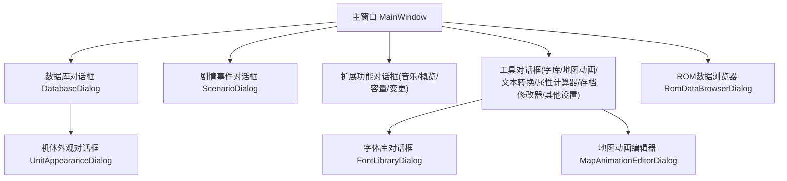
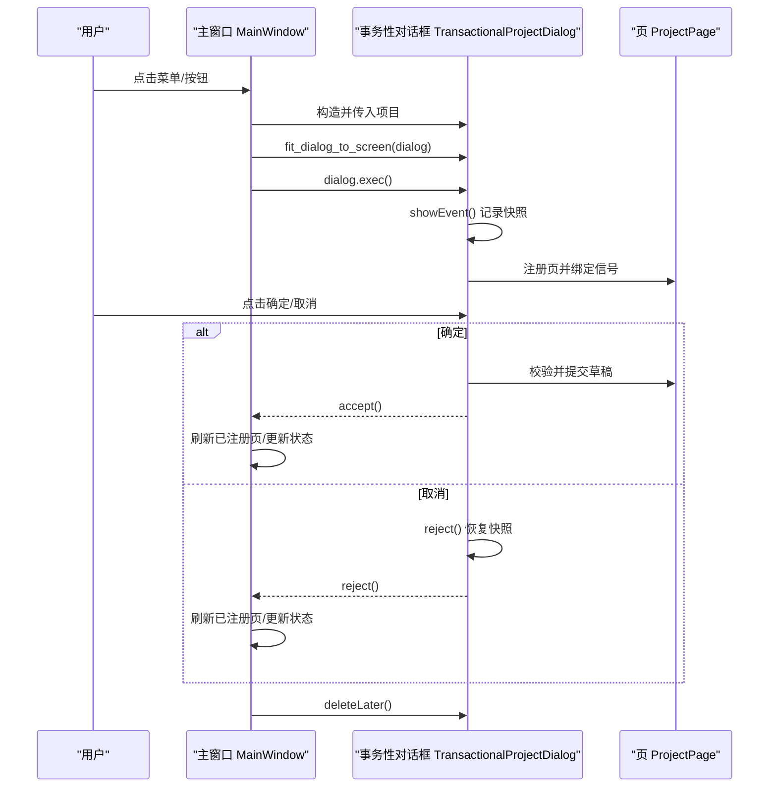
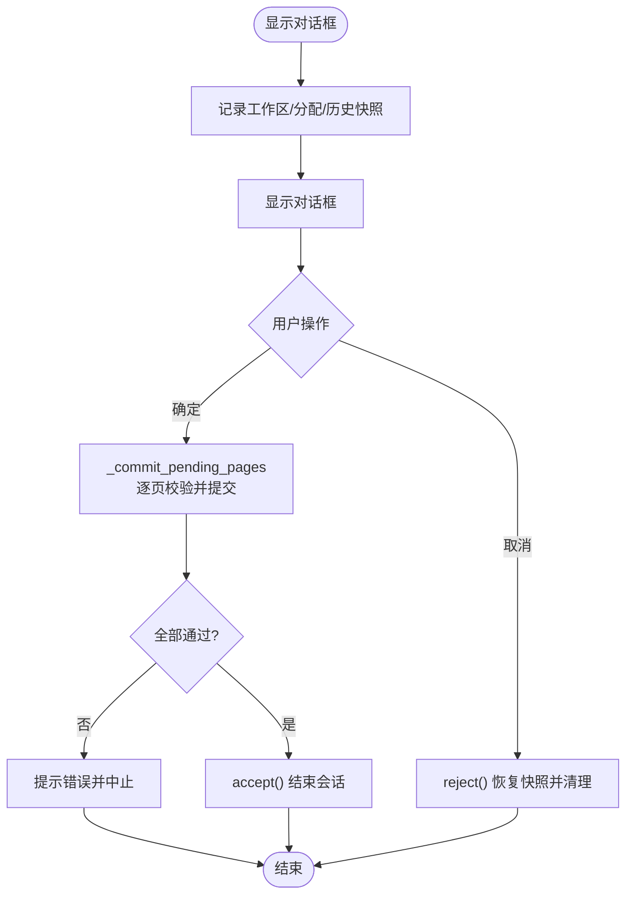
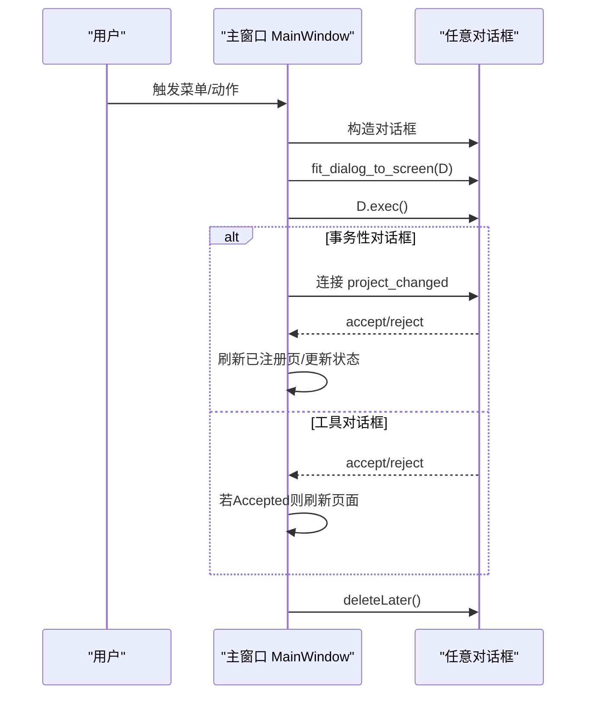
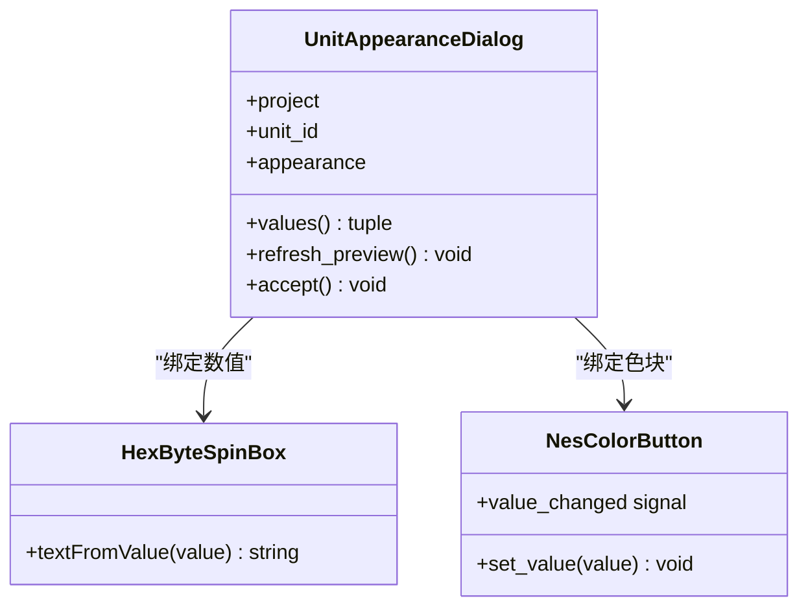
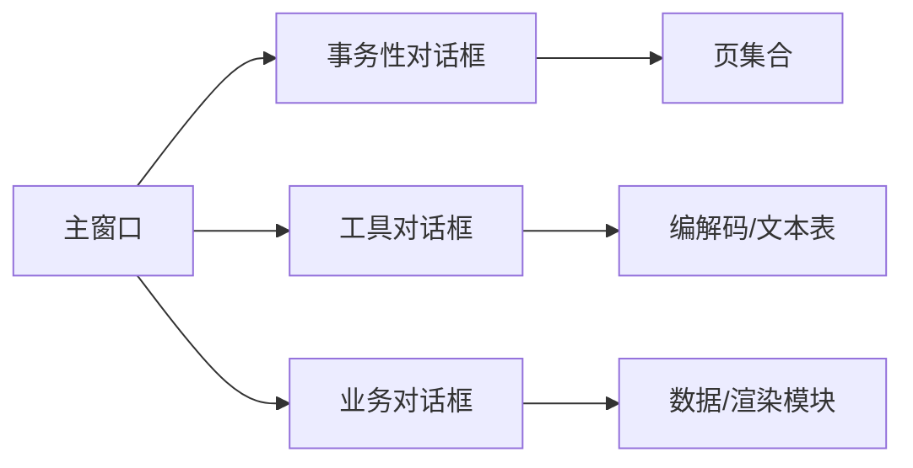

# 对话框设计

<cite>
**本文引用的文件**
- [app.py](file://src/dc_modifier/app.py)
- [legacy_windows.py](file://src/dc_modifier/legacy_windows.py)
- [unit_appearance_dialog.py](file://src/dc_modifier/unit_appearance_dialog.py)
- [legacy_tools.py](file://src/dc_modifier/legacy_tools.py)
- [map_page.py](file://src/dc_modifier/map_page.py)
- [rom_data_browser.py](file://src/dc_modifier/rom_data_browser.py)
- [animation_editor.py](file://src/dc_modifier/animation_editor.py)
</cite>

## 目录
1. [简介](#简介)
2. [项目结构](#项目结构)
3. [核心组件](#核心组件)
4. [架构总览](#架构总览)
5. [详细组件分析](#详细组件分析)
6. [依赖关系分析](#依赖关系分析)
7. [性能考虑](#性能考虑)
8. [故障排查指南](#故障排查指南)
9. [结论](#结论)
10. [附录](#附录)

## 简介
本指南面向DC修改器的对话框设计与实现，聚焦以下目标：
- 明确模态与非模态对话框的使用场景与生命周期管理（初始化、显示、关闭、资源清理）。
- 规范用户输入验证机制（实时验证、提交时验证、错误提示展示）。
- 定义对话框与主窗口的数据交换模式（参数传递、结果返回、状态同步）。
- 提供常见对话框类型的实现范式（确认、输入、选择、进度等）。
- 给出样式定制与用户体验优化建议。

本指南基于仓库中现有对话框实现进行归纳与提炼，确保所有实践均可在代码中找到对应依据。

## 项目结构
DC修改器采用“主窗口 + 多类对话框”的架构：
- 主窗口负责工程加载、菜单组织、全局状态与页面导航。
- 各类对话框以独立 QDialog 形式存在，通过统一入口方法被主窗口调用并执行 exec()。
- 复杂编辑任务封装为“事务性对话框”，支持会话级快照与回滚。

图表来源
- [app.py:276-650](file://src/dc_modifier/app.py#L276-L650)
- [legacy_windows.py:71-260](file://src/dc_modifier/legacy_windows.py#L71-L260)
- [unit_appearance_dialog.py:47-250](file://src/dc_modifier/unit_appearance_dialog.py#L47-L250)
- [legacy_tools.py:109-200](file://src/dc_modifier/legacy_tools.py#L109-L200)
- [rom_data_browser.py:492-520](file://src/dc_modifier/rom_data_browser.py#L492-L520)
- [animation_editor.py:213-240](file://src/dc_modifier/animation_editor.py#L213-L240)

章节来源
- [app.py:276-650](file://src/dc_modifier/app.py#L276-L650)
- [legacy_windows.py:71-260](file://src/dc_modifier/legacy_windows.py#L71-L260)

## 核心组件
- 事务性项目对话框：提供会话级快照、提交前校验、取消时完整回滚（包括工作区内存、资源分配、撤销/重做栈）。
- 通用工具对话框：字库编辑、地图动画、文本转换、属性计算、存档修改、其他设置等，统一由主窗口以工具对话框方式启动。
- 业务对话框：机体外观编辑、ROM数据浏览等，承载具体业务交互与预览。
- 地图相关对话框：调色板与图块属性编辑，服务于地图编辑流程。

章节来源
- [legacy_windows.py:71-260](file://src/dc_modifier/legacy_windows.py#L71-L260)
- [legacy_tools.py:109-200](file://src/dc_modifier/legacy_tools.py#L109-L200)
- [unit_appearance_dialog.py:47-250](file://src/dc_modifier/unit_appearance_dialog.py#L47-L250)
- [rom_data_browser.py:492-520](file://src/dc_modifier/rom_data_browser.py#L492-L520)
- [map_page.py:237-340](file://src/dc_modifier/map_page.py#L237-L340)
- [animation_editor.py:213-240](file://src/dc_modifier/animation_editor.py#L213-L240)

## 架构总览
对话框由主窗口集中调度，遵循统一的“构造 → 适配屏幕 → 执行exec → 刷新页面 → 释放”的流程。事务性对话框在打开时记录快照，接受时提交草稿，拒绝时恢复快照并通知主窗口。

图表来源
- [app.py:494-505](file://src/dc_modifier/app.py#L494-L505)
- [legacy_windows.py:177-259](file://src/dc_modifier/legacy_windows.py#L177-L259)

章节来源
- [app.py:494-505](file://src/dc_modifier/app.py#L494-L505)
- [legacy_windows.py:177-259](file://src/dc_modifier/legacy_windows.py#L177-L259)

## 详细组件分析

### 事务性项目对话框（TransactionalProjectDialog）
职责
- 作为复杂编辑会话的容器，统一管理多个页的暂存与提交。
- 在显示时记录工作区、资源分配、撤销/重做栈快照。
- 提交前逐页校验草稿，失败则阻止提交并提示。
- 取消时恢复快照，清空各页暂存，刷新界面。

关键流程
- 会话开始：showEvent 触发 _begin_session 记录快照。
- 提交：_commit_pending_pages 收集待提交页，逐项校验与提交。
- 取消：reject 恢复 working、allocator、undo/redo 栈，并刷新页。

图表来源
- [legacy_windows.py:177-259](file://src/dc_modifier/legacy_windows.py#L177-L259)

章节来源
- [legacy_windows.py:71-260](file://src/dc_modifier/legacy_windows.py#L71-L260)

### 主窗口对话框调度（MainWindow）
职责
- 提供统一的对话框运行入口，负责对话框尺寸适配、信号连接、结果处理与资源释放。
- 对不同类型对话框采用不同策略：
  - 事务性对话框：使用 _run_project_dialog，自动连接 project_changed 信号并在结束后刷新页面。
  - 工具对话框：使用 _run_tool_dialog，仅在 Accepted 时刷新页面。

典型调用
- 打开数据库、剧情事件、字库、地图动画、文本转换、属性计算器、存档修改器、其他设置等。

图表来源
- [app.py:494-540](file://src/dc_modifier/app.py#L494-L540)
- [app.py:541-581](file://src/dc_modifier/app.py#L541-L581)

章节来源
- [app.py:494-581](file://src/dc_modifier/app.py#L494-L581)

### 机体外观对话框（UnitAppearanceDialog）
职责
- 编辑机体的配色与图库，提供实时预览（主体/碎片原始图库、战斗合成效果）。
- 将用户输入转换为 ROM 写入所需的字节序列，并在事务中安全保存。

生命周期
- 初始化：读取当前外观记录，构建颜色控件与十六进制数值控件，建立双向绑定；构建预览标签与脚本只读视图。
- 显示：根据控件值即时刷新预览。
- 接受：校验并发出外观补丁，进入事务写入；标记是否发生更改。
- 取消：不写入任何内容，直接退出。

图表来源
- [unit_appearance_dialog.py:42-250](file://src/dc_modifier/unit_appearance_dialog.py#L42-L250)

章节来源
- [unit_appearance_dialog.py:42-250](file://src/dc_modifier/unit_appearance_dialog.py#L42-L250)

### 字库编辑对话框（FontLibraryDialog）
职责
- 浏览与编辑固定字形槽位，提供原字形与替换字形对比预览。
- 受限于数据结构验证状态，部分写入能力受限，但保留基础编辑路径。

关键点
- 使用表格网格展示16x16字形矩阵。
- 提供页面选择、替换字符输入、写入/清空等操作。
- 通过只读字段展示编码、地址、字符信息。

章节来源
- [legacy_tools.py:109-200](file://src/dc_modifier/legacy_tools.py#L109-L200)

### 地图调色板与图块属性对话框
职责
- 调色板对话框用于地图调色板编辑。
- 图块属性对话框用于编辑图块的属性配置。

章节来源
- [map_page.py:237-340](file://src/dc_modifier/map_page.py#L237-L340)

### ROM数据浏览器对话框
职责
- 提供ROM数据的浏览与定位能力，便于调试与核对。

章节来源
- [rom_data_browser.py:492-520](file://src/dc_modifier/rom_data_browser.py#L492-L520)

### 地图动画编辑器对话框
职责
- 提供地图动画编辑能力，作为工具对话框由主窗口启动。

章节来源
- [animation_editor.py:213-240](file://src/dc_modifier/animation_editor.py#L213-L240)

## 依赖关系分析
- 主窗口依赖各类对话框的构造与执行，并通过统一入口管理生命周期。
- 事务性对话框依赖页对象接口，要求页暴露暂存、提交、冲突检测等能力。
- 业务对话框依赖底层数据读写与渲染模块（如外观读取、CHR渲染），保证预览与写入一致性。
- 工具对话框依赖文本表、编解码器等公共能力。

图表来源
- [app.py:494-650](file://src/dc_modifier/app.py#L494-L650)
- [legacy_windows.py:71-260](file://src/dc_modifier/legacy_windows.py#L71-L260)
- [unit_appearance_dialog.py:12-20](file://src/dc_modifier/unit_appearance_dialog.py#L12-L20)
- [legacy_tools.py:35-43](file://src/dc_modifier/legacy_tools.py#L35-L43)

章节来源
- [app.py:494-650](file://src/dc_modifier/app.py#L494-L650)
- [legacy_windows.py:71-260](file://src/dc_modifier/legacy_windows.py#L71-L260)

## 性能考虑
- 预览渲染：在外观对话框中，预览更新应避免阻塞UI线程；必要时限制刷新频率或使用快速变换模式。
- 大列表/表格：字库与地图相关对话框应合理设置列宽与默认尺寸，减少重绘开销。
- 事务性回滚：快照体积较大时，注意内存占用；仅在需要时启用完整会话快照。
- 异步任务：对于耗时操作（如批量导入/导出），应在后台线程执行并反馈进度。

[本节为通用指导，无需特定文件引用]

## 故障排查指南
常见问题与定位要点
- 提交失败：检查页的 pending_draft_error 与冲突检测逻辑，确认是否存在同一资源的未提交草稿冲突。
- 取消未生效：确认 reject 路径是否恢复 working、allocator 与 undo/redo 栈，并刷新页。
- 预览异常：检查外观数据读取与渲染函数返回值，确认索引范围与银行数量。
- 对话框未释放：确保 exec 后调用 deleteLater，避免内存泄漏。

章节来源
- [legacy_windows.py:202-259](file://src/dc_modifier/legacy_windows.py#L202-L259)
- [unit_appearance_dialog.py:237-250](file://src/dc_modifier/unit_appearance_dialog.py#L237-L250)
- [app.py:494-505](file://src/dc_modifier/app.py#L494-L505)

## 结论
DC修改器的对话框体系以“主窗口统一调度 + 事务性会话管理”为核心，结合丰富的业务与工具对话框，形成了稳定、可回滚、易扩展的交互框架。通过规范的输入验证、清晰的资源生命周期管理与一致的样式风格，既保证了专业性，也提升了用户体验。

[本节为总结，无需特定文件引用]

## 附录

### 模态与非模态对话框使用建议
- 模态对话框：适用于需要立即决策或完成的任务（如数据库编辑、剧情事件编辑、字库编辑）。
- 非模态对话框：适用于辅助查看或长时任务（如进度提示、日志面板），需确保不会阻塞主流程。

章节来源
- [app.py:494-540](file://src/dc_modifier/app.py#L494-L540)
- [legacy_tools.py:109-200](file://src/dc_modifier/legacy_tools.py#L109-L200)

### 用户输入验证机制
- 实时验证：在控件值变化时即时校验（如颜色索引范围、图库编号范围），并提供视觉反馈。
- 提交时验证：在 accept 前汇总校验所有字段，失败则阻止提交并提示。
- 错误提示：使用标准消息框或页内状态栏提示，保持上下文一致。

章节来源
- [unit_appearance_dialog.py:22-39](file://src/dc_modifier/unit_appearance_dialog.py#L22-L39)
- [unit_appearance_dialog.py:237-250](file://src/dc_modifier/unit_appearance_dialog.py#L237-L250)
- [legacy_windows.py:202-223](file://src/dc_modifier/legacy_windows.py#L202-L223)

### 对话框与主窗口数据交换
- 参数传递：通过构造函数注入 RomProject 与父窗口，确保访问工程与UI上下文。
- 结果返回：通过 exec 返回值判断接受/拒绝，主窗口据此决定是否刷新页面。
- 状态同步：通过 project_changed 信号通知主窗口更新状态栏与窗口标题。

章节来源
- [app.py:494-505](file://src/dc_modifier/app.py#L494-L505)
- [legacy_windows.py:82-114](file://src/dc_modifier/legacy_windows.py#L82-L114)

### 常见对话框类型实现示例
- 确认对话框：使用 QMessageBox 进行二次确认（如覆盖文件、放弃未保存）。
- 输入对话框：使用 QInputDialog.getItem 进行单项选择输入。
- 选择对话框：使用 QFileDialog 进行文件/目录选择。
- 进度对话框：对于耗时任务，建议使用 QProgressDialog 或在状态栏显示进度。

章节来源
- [app.py:654-729](file://src/dc_modifier/app.py#L654-L729)

### 样式定制与用户体验优化
- 统一样式表：通过全局样式表控制背景、边框、焦点态与禁用态，提升一致性。
- 高对比箭头：自定义样式增强数值控件的可操作性。
- 布局自适应：根据窗口宽度动态调整数据分组布局，提升小屏可读性。

章节来源
- [app.py:66-233](file://src/dc_modifier/app.py#L66-L233)
- [legacy_windows.py:458-493](file://src/dc_modifier/legacy_windows.py#L458-L493)