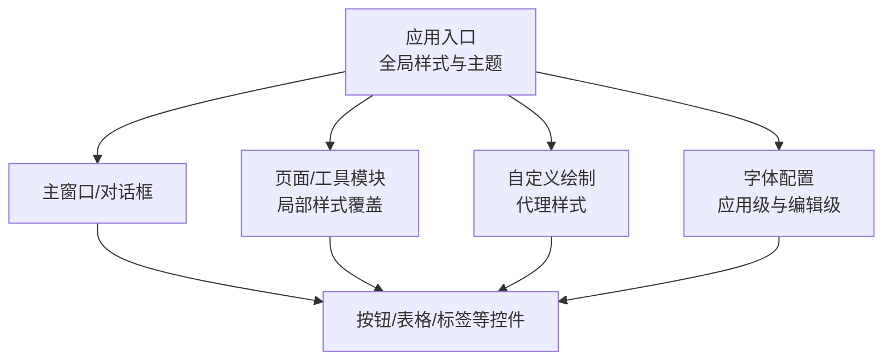
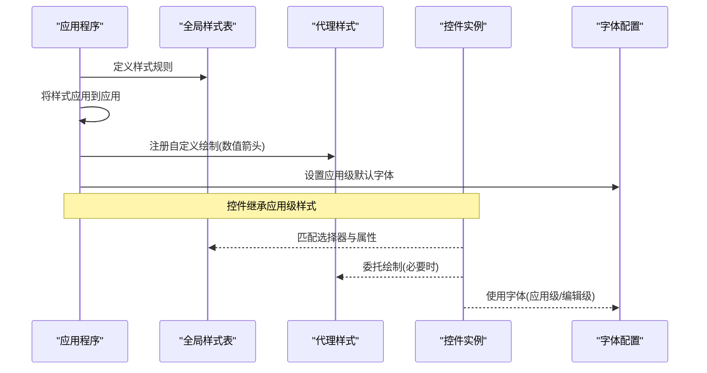
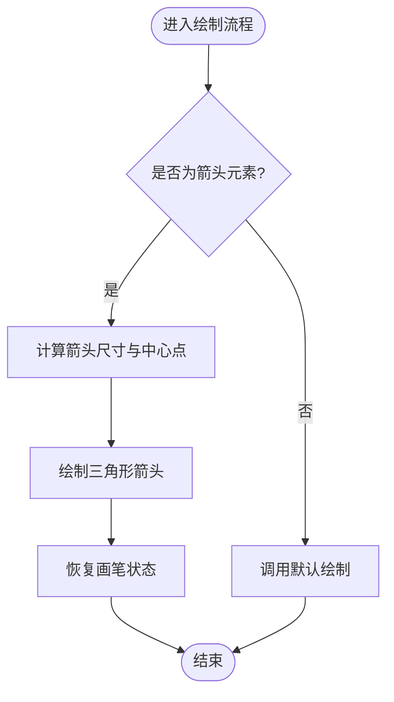
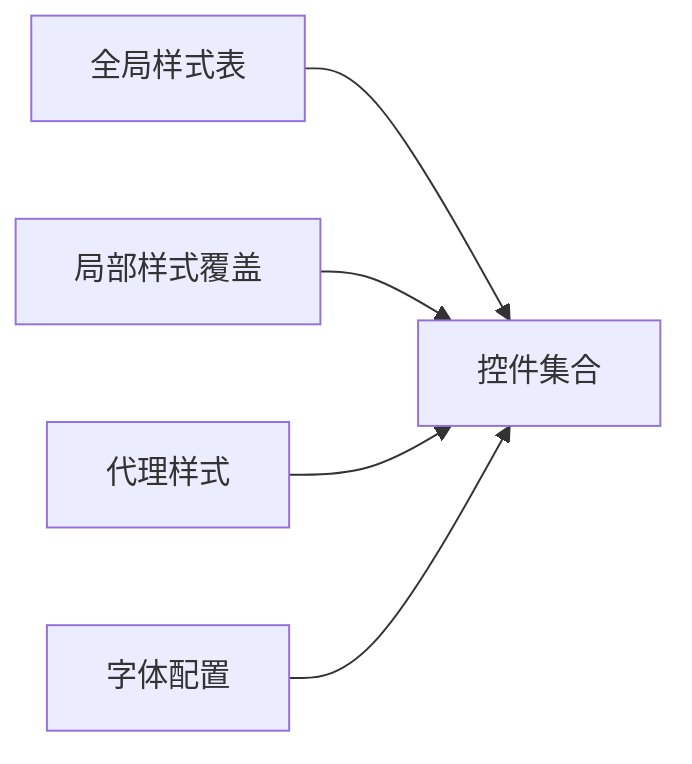

# 样式定制

<cite>
**本文引用的文件**
- [app.py](file://src/dc_modifier/app.py)
- [font_edit.py](file://src/dc_modifier/font_edit.py)
- [legacy_tools.py](file://src/dc_modifier/legacy_tools.py)
- [map_page.py](file://src/dc_modifier/map_page.py)
</cite>

## 目录
1. [简介](#简介)
2. [项目结构](#项目结构)
3. [核心组件](#核心组件)
4. [架构总览](#架构总览)
5. [详细组件分析](#详细组件分析)
6. [依赖关系分析](#依赖关系分析)
7. [性能考虑](#性能考虑)
8. [故障排查指南](#故障排查指南)
9. [结论](#结论)
10. [附录](#附录)

## 简介
本文件面向DC修改器的样式定制，系统性说明Qt样式表（QSS）的使用方式、主题切换机制、响应式适配策略、常用控件的样式定制方法，以及样式文件的组织与复用。文档基于仓库中现有实现进行梳理，帮助读者在不侵入业务逻辑的前提下，完成可维护、可扩展的界面外观管理。

## 项目结构
当前样式相关代码集中在应用入口与若干页面/工具模块中：
- 全局样式定义与应用：在应用入口文件中集中定义并一次性应用到整个应用程序。
- 自定义绘制：通过代理样式对特定控件（如数值输入框箭头）进行高对比度重绘。
- 局部样式覆盖：部分页面或工具使用 setStyleSheet 对个别控件进行细粒度样式设置。
- 字体配置：应用级默认字体与编辑类字体的独立配置。

图表来源
- [app.py:128-233](file://src/dc_modifier/app.py#L128-L233)
- [app.py:1161-1162](file://src/dc_modifier/app.py#L1161-L1162)
- [app.py:66-126](file://src/dc_modifier/app.py#L66-L126)
- [font_edit.py:65-67](file://src/dc_modifier/font_edit.py#L65-L67)
- [font_edit.py:155-159](file://src/dc_modifier/font_edit.py#L155-L159)

章节来源
- [app.py:66-126](file://src/dc_modifier/app.py#L66-L126)
- [app.py:128-233](file://src/dc_modifier/app.py#L128-L233)
- [app.py:1161-1162](file://src/dc_modifier/app.py#L1161-L1162)
- [font_edit.py:65-67](file://src/dc_modifier/font_edit.py#L65-L67)
- [font_edit.py:155-159](file://src/dc_modifier/font_edit.py#L155-L159)

## 核心组件
- 全局样式表：集中定义基础控件外观、颜色、边框、圆角、渐变、焦点态、禁用态等，并通过应用级样式注入到整个UI树。
- 代理样式：针对数值输入框的上下箭头进行高对比度绘制，提升可读性。
- 局部样式覆盖：在特定页面或工具中对状态提示、预览区域等进行精细化样式调整。
- 字体管理：应用级默认字体统一；编辑类字体采用固定像素策略，避免抗锯齿导致的显示不一致。

章节来源
- [app.py:128-233](file://src/dc_modifier/app.py#L128-L233)
- [app.py:66-126](file://src/dc_modifier/app.py#L66-L126)
- [font_edit.py:65-67](file://src/dc_modifier/font_edit.py#L65-L67)
- [font_edit.py:155-159](file://src/dc_modifier/font_edit.py#L155-L159)

## 架构总览
下图展示了样式从“全局样式表”到“控件渲染”的调用链，以及局部样式覆盖与字体配置的交互关系。

图表来源
- [app.py:128-233](file://src/dc_modifier/app.py#L128-L233)
- [app.py:1161-1162](file://src/dc_modifier/app.py#L1161-L1162)
- [app.py:66-126](file://src/dc_modifier/app.py#L66-L126)
- [font_edit.py:65-67](file://src/dc_modifier/font_edit.py#L65-L67)

## 详细组件分析

### 全局样式表与选择器语法
- 作用域与继承：为顶层容器（主窗口、对话框、通用控件）设置背景与前景色，子控件自动继承未覆盖的属性。
- 选择器类型：
  - 类型选择器：如 QTabBar::tab、QHeaderView::section，用于统一控件族外观。
  - ID选择器：如 QLabel#sectionTitle、QPushButton#primaryButton，用于精准定位命名控件。
  - 伪状态：如 :hover、:pressed、:disabled、:focus，用于交互反馈。
  - 属性选择器：如 QLabel#editState[pending="true"]，根据运行时属性动态改变外观。
- 常用属性：background、border、border-radius、padding、margin、color、font-size、font-weight、selection-background-color 等。
- 渐变与边框：按钮使用线性渐变背景，配合边框与圆角形成统一的视觉风格。

章节来源
- [app.py:128-233](file://src/dc_modifier/app.py#L128-L233)

### 主题切换机制（动态样式加载与颜色方案管理）
- 动态样式加载：通过应用级样式注入，可在运行时替换样式字符串以切换主题。建议将不同主题的样式表按主题名组织，并在需要时调用应用级样式设置接口进行切换。
- 颜色方案管理：将常用颜色抽取为变量（例如主题色、强调色、中性色），在样式表中引用这些变量，便于一键换肤。
- 字体配置：应用级默认字体统一设置，确保整体一致性；编辑类字体采用固定像素策略，避免在不同系统下出现渲染差异。

章节来源
- [app.py:1161-1162](file://src/dc_modifier/app.py#L1161-L1162)
- [font_edit.py:65-67](file://src/dc_modifier/font_edit.py#L65-L67)
- [font_edit.py:155-159](file://src/dc_modifier/font_edit.py#L155-L159)

### 响应式设计考虑
- 屏幕尺寸适配：通过布局管理器（如垂直/水平布局、堆叠布局）与最小尺寸限制，使界面在不同分辨率下保持可用。
- 控件布局调整：利用 padding、margin、min-width/min-height 控制控件间距与大小，保证在小屏设备上仍可操作。
- 字体大小缩放：结合应用级字体与局部字体设置，针对不同场景（如标题、正文、状态提示）设定合适的字号与粗细。

章节来源
- [app.py:281-290](file://src/dc_modifier/app.py#L281-L290)
- [app.py:128-233](file://src/dc_modifier/app.py#L128-L233)
- [font_edit.py:65-67](file://src/dc_modifier/font_edit.py#L65-L67)

### 自定义控件样式
- 按钮：
  - 基础按钮：统一背景渐变、边框、圆角与内边距，提供 hover/pressed/disabled 状态。
  - 主按钮：通过ID选择器突出重要性（加粗）。
  - 地形按钮：固定宽高与选中态边框高亮，便于地图编辑场景快速识别。
- 表格：
  - 表头：统一背景、边框与文字粗细，提升可读性。
  - 列表与文本编辑：统一背景、边框、焦点态与选区颜色，保持一致的交互体验。
- 标签：
  - 分区标题、提示文本、徽章、空状态等通过ID选择器与伪状态组合，实现丰富的信息层级与状态表达。

章节来源
- [app.py:128-233](file://src/dc_modifier/app.py#L128-L233)

### 复杂逻辑组件（代理样式绘制流程）
数值输入框的上下箭头通过代理样式进行高对比度绘制，流程如下：

图表来源
- [app.py:66-126](file://src/dc_modifier/app.py#L66-L126)

章节来源
- [app.py:66-126](file://src/dc_modifier/app.py#L66-L126)

### 局部样式覆盖与状态提示
- 状态提示：在工具与页面中使用 setStyleSheet 对状态标签进行颜色与字号调整，区分成功、警告、错误等状态。
- 预览区域：为预览控件设置背景与边框，增强内容可见性。

章节来源
- [legacy_tools.py:170-171](file://src/dc_modifier/legacy_tools.py#L170-L171)
- [legacy_tools.py:209-209](file://src/dc_modifier/legacy_tools.py#L209-L209)
- [legacy_tools.py:344-353](file://src/dc_modifier/legacy_tools.py#L344-L353)
- [legacy_tools.py:687-687](file://src/dc_modifier/legacy_tools.py#L687-L687)
- [legacy_tools.py:728-728](file://src/dc_modifier/legacy_tools.py#L728-L728)
- [legacy_tools.py:769-769](file://src/dc_modifier/legacy_tools.py#L769-L769)
- [legacy_tools.py:865-865](file://src/dc_modifier/legacy_tools.py#L865-L865)
- [map_page.py:292-292](file://src/dc_modifier/map_page.py#L292-L292)
- [map_page.py:1099-1099](file://src/dc_modifier/map_page.py#L1099-L1099)

## 依赖关系分析
- 样式与控件：全局样式表作用于所有控件，局部样式覆盖仅影响目标控件及其子树。
- 字体与渲染：应用级字体影响全局文本渲染；编辑类字体采用固定像素策略，避免跨平台渲染差异。
- 代理样式与控件：代理样式拦截特定控件的绘制事件，按需重写视觉效果。

图表来源
- [app.py:128-233](file://src/dc_modifier/app.py#L128-L233)
- [app.py:66-126](file://src/dc_modifier/app.py#L66-L126)
- [font_edit.py:65-67](file://src/dc_modifier/font_edit.py#L65-L67)

章节来源
- [app.py:128-233](file://src/dc_modifier/app.py#L128-L233)
- [app.py:66-126](file://src/dc_modifier/app.py#L66-L126)
- [font_edit.py:65-67](file://src/dc_modifier/font_edit.py#L65-L67)

## 性能考虑
- 减少重复样式：尽量使用类型选择器与ID选择器，避免为每个控件单独设置样式。
- 控制伪状态复杂度：合理使用 :hover/:pressed/:disabled/:focus，避免过多状态导致样式解析开销。
- 字体策略：编辑类字体关闭抗锯齿，提高一致性与渲染效率。
- 局部覆盖范围：局部样式覆盖应限定在必要范围内，避免大范围重绘。

[本节为通用指导，不直接分析具体文件]

## 故障排查指南
- 样式未生效：检查是否已应用全局样式；确认选择器是否正确匹配控件类型或ID；确认是否有局部样式覆盖导致冲突。
- 状态提示异常：核对状态标签的样式设置路径与属性值；确认运行时属性（如 pending 标志）是否正确更新。
- 字体显示问题：确认应用级字体设置；编辑类字体是否启用固定像素策略；在不同系统上验证渲染效果。

章节来源
- [app.py:128-233](file://src/dc_modifier/app.py#L128-L233)
- [legacy_tools.py:209-209](file://src/dc_modifier/legacy_tools.py#L209-L209)
- [legacy_tools.py:344-353](file://src/dc_modifier/legacy_tools.py#L344-L353)
- [font_edit.py:65-67](file://src/dc_modifier/font_edit.py#L65-L67)
- [font_edit.py:155-159](file://src/dc_modifier/font_edit.py#L155-L159)

## 结论
通过将全局样式集中管理、局部样式精准覆盖、代理样式定制绘制、字体策略统一管理，DC修改器实现了可维护、可扩展且高性能的样式体系。在此基础上，可通过主题变量与动态样式加载实现灵活的主题切换，并结合响应式布局与字体策略适配多屏幕环境。

[本节为总结，不直接分析具体文件]

## 附录
- 样式文件组织建议：
  - 模块化：按功能模块拆分样式片段（如按钮、表格、标签），在主样式中引入。
  - 变量定义：将颜色、字号、圆角等抽取为变量，便于主题切换。
  - 复用机制：通过ID选择器与公共样式块复用样式，减少重复。
- 兼容性考虑：
  - 不同平台下的字体渲染差异，建议使用固定像素策略与明确的字体回退。
  - 伪状态与子控件选择器在不同Qt版本中的支持情况需测试验证。

[本节为通用指导，不直接分析具体文件]