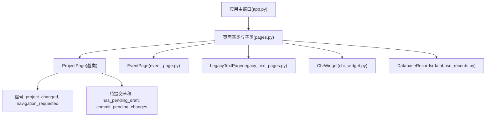
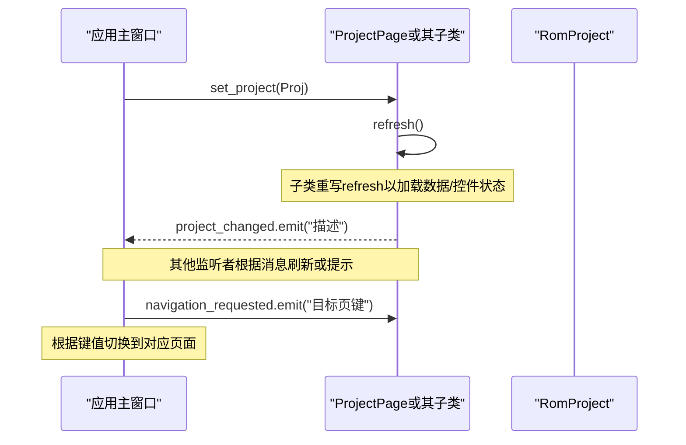
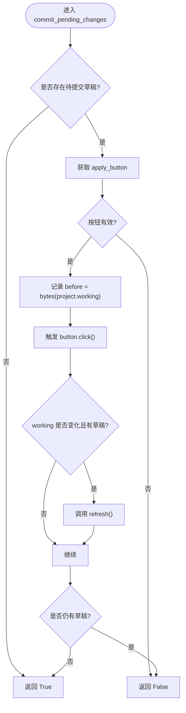
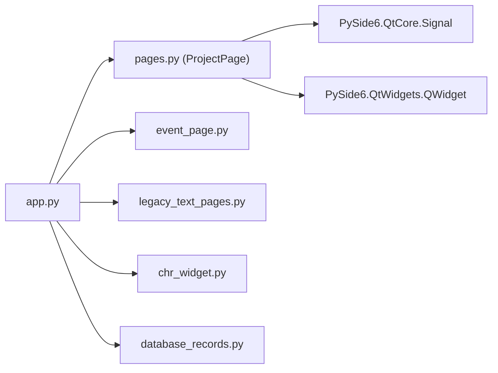

# ProjectPage基类

<cite>
**本文引用的文件**
- [pages.py](file://src/dc_modifier/pages.py)
- [app.py](file://src/dc_modifier/app.py)
- [event_page.py](file://src/dc_modifier/event_page.py)
- [legacy_text_pages.py](file://src/dc_modifier/legacy_text_pages.py)
- [chr_widget.py](file://src/dc_modifier/chr_widget.py)
- [database_records.py](file://src/dc_modifier/database_records.py)
</cite>

## 目录
1. [简介](#简介)
2. [项目结构](#项目结构)
3. [核心组件](#核心组件)
4. [架构总览](#架构总览)
5. [详细组件分析](#详细组件分析)
6. [依赖关系分析](#依赖关系分析)
7. [性能考虑](#性能考虑)
8. [故障排查指南](#故障排查指南)
9. [结论](#结论)
10. [附录：继承与实现示例](#附录：继承与实现示例)

## 简介
本技术文档围绕 ProjectPage 基类展开，系统阐述其作为所有页面基类的设计模式与职责边界。重点覆盖：
- 项目生命周期管理：通过 set_project 安全切换 RomProject 并刷新界面。
- 信号机制：project_changed、navigation_requested 的用途与使用方式。
- 事务处理集成：commit_pending_changes 如何与窗口级确认/取消流程协作。
- pending 状态管理：has_pending_draft、pending_draft_error、commit_pending_changes 的实现逻辑与错误处理策略。
- 最佳实践：资源清理、事件绑定、内存管理与可维护性建议。

## 项目结构
ProjectPage 位于 dc_modifier.pages 模块中，是所有编辑页面的统一基类。应用主窗口 app.py 负责创建页面实例、连接信号、触发刷新与导航。各具体页面（如 EventPage、LegacyTextPage、ChrWidget、DatabaseRecords）继承 ProjectPage 或其中间基类，实现各自的 refresh、提交与校验逻辑。

图表来源
- [pages.py:103-151](file://src/dc_modifier/pages.py#L103-L151)
- [app.py:344-345](file://src/dc_modifier/app.py#L344-L345)
- [event_page.py:66-227](file://src/dc_modifier/event_page.py#L66-L227)
- [legacy_text_pages.py:20-73](file://src/dc_modifier/legacy_text_pages.py#L20-L73)
- [chr_widget.py:108-115](file://src/dc_modifier/chr_widget.py#L108-L115)
- [database_records.py:219-262](file://src/dc_modifier/database_records.py#L219-L262)

章节来源
- [pages.py:103-151](file://src/dc_modifier/pages.py#L103-L151)
- [app.py:344-345](file://src/dc_modifier/app.py#L344-L345)

## 核心组件
- ProjectPage：提供统一的页面生命周期、信号与草稿管理机制。
- 信号：
  - project_changed：用于通知其他组件当前页面数据已变更，典型由子页面在修改后发出。
  - navigation_requested：用于请求切换到指定页面（如“扩展容量规划”、“地图与部署”等）。
- 项目切换：set_project(project) 设置项目并调用 refresh() 更新界面。
- 草稿与提交：
  - has_pending_draft：判断是否存在未应用的表单改动（默认基于 apply_button 的可启用状态）。
  - pending_draft_error：返回无法提交的错误原因（供上层提示）。
  - commit_pending_changes：尝试提交当前草稿；若成功且工作区发生变化，会再次刷新界面。
- 错误展示：show_error(error) 统一以对话框显示错误信息。

章节来源
- [pages.py:103-151](file://src/dc_modifier/pages.py#L103-L151)

## 架构总览
ProjectPage 作为基类，定义了页面与 RomProject 的绑定方式、界面刷新契约以及草稿提交流程。应用层通过连接 project_changed 与 navigation_requested 信号，实现跨页面联动与导航。

图表来源
- [pages.py:103-151](file://src/dc_modifier/pages.py#L103-L151)
- [app.py:344-345](file://src/dc_modifier/app.py#L344-L345)

## 详细组件分析

### ProjectPage 基类设计
- 生命周期
  - __init__：初始化 project 为 None。
  - set_project：赋值 project 并立即调用 refresh()，确保界面与项目一致。
  - refresh：空实现，由子类重写以加载数据、填充控件、恢复选择等。
- 草稿与提交
  - has_pending_draft：默认检查是否存在名为 apply_button 的 QPushButton 且处于可用状态。
  - pending_draft_error：默认返回 None，子类可重写以提供更详细的错误说明。
  - commit_pending_changes：若存在草稿则模拟点击 apply_button 进行提交；如果项目工作区发生变化且仍有草稿，则再次刷新；最终返回是否已无草稿。
- 错误处理
  - show_error：统一弹出错误对话框。

图表来源
- [pages.py:118-148](file://src/dc_modifier/pages.py#L118-L148)

章节来源
- [pages.py:103-151](file://src/dc_modifier/pages.py#L103-L151)

### 信号机制与使用
- project_changed
  - 由子页面在数据变更后发出，携带简要描述字符串。
  - 应用层可连接该信号以刷新其他视图或提示用户。
- navigation_requested
  - 由页面内部动作（如概览页快捷入口）发出，携带目标页面键。
  - 应用层根据键值执行页面切换。

章节来源
- [pages.py:103-105](file://src/dc_modifier/pages.py#L103-L105)
- [app.py:344-345](file://src/dc_modifier/app.py#L344-L345)
- [event_page.py:66-227](file://src/dc_modifier/event_page.py#L66-L227)
- [legacy_text_pages.py:20-73](file://src/dc_modifier/legacy_text_pages.py#L20-L73)
- [chr_widget.py:108-115](file://src/dc_modifier/chr_widget.py#L108-L115)
- [database_records.py:219-262](file://src/dc_modifier/database_records.py#L219-L262)

### 项目切换与界面刷新
- set_project(project)
  - 将 project 设置为传入值（可为 None），随后调用 refresh()。
  - 子类应保证 refresh() 对 project=None 的安全处理（清空列表、禁用控件、重置状态）。
- 刷新时机
  - 初始加载、项目切换、提交成功后（若 working 发生变化）都会触发刷新。
  - 应用层在收到 project_changed 时也可主动刷新相关页面。

章节来源
- [pages.py:111-116](file://src/dc_modifier/pages.py#L111-L116)
- [app.py:370-371](file://src/dc_modifier/app.py#L370-L371)
- [app.py:1041-1053](file://src/dc_modifier/app.py#L1041-L1053)

### pending 状态管理机制
- has_pending_draft
  - 默认基于 apply_button 的存在与可用性判断。
  - 子类可通过重写该属性自定义判断逻辑（例如 LegacyTextPage 基于 _drafts 字典）。
- pending_draft_error
  - 默认返回 None。
  - 子类可重写以在执行提交前进行预校验（如冲突检测、范围校验），并返回错误文本。
- commit_pending_changes
  - 若无草稿直接返回 True。
  - 若有草稿且存在有效的 apply_button，则触发提交；若 working 变化且仍有草稿，则刷新界面。
  - 返回是否已无草稿（即提交是否彻底完成）。

章节来源
- [pages.py:118-148](file://src/dc_modifier/pages.py#L118-L148)
- [legacy_text_pages.py:159-202](file://src/dc_modifier/legacy_text_pages.py#L159-L202)

### 错误处理策略
- 统一错误展示：show_error(error) 使用 QMessageBox.critical 显示错误。
- 预校验错误：通过 pending_draft_error 提前暴露问题，避免无效提交。
- 提交失败：当 commit_pending_changes 返回 False 时，上层应阻止关闭或导航，并提示用户修正。

章节来源
- [pages.py:150-151](file://src/dc_modifier/pages.py#L150-L151)
- [legacy_text_pages.py:190-202](file://src/dc_modifier/legacy_text_pages.py#L190-L202)

### 事务处理集成
- 窗口级 OK/Cancel 流程通常先调用每个页面的 commit_pending_changes。
- 若任一页面存在无法提交的草稿，则阻止关闭；全部提交成功后再执行保存或构建。
- 对于复杂场景（如文本共用冲突），可在 pending_draft_error 中进行事务级冲突检查。

章节来源
- [app.py:904-904](file://src/dc_modifier/app.py#L904-L904)
- [legacy_text_pages.py:173-202](file://src/dc_modifier/legacy_text_pages.py#L173-L202)

## 依赖关系分析
- ProjectPage 依赖 PySide6 的 Signal 与 QWidget。
- 应用层 app.py 导入 ProjectPage 及其子类，负责：
  - 连接 project_changed 与 navigation_requested 信号。
  - 在合适时机调用页面 refresh()。
  - 在关闭窗口前调用 commit_pending_changes。
- 各页面子类依赖 RomProject 的工作区 working 与原始 original，进行编解码与校验。

图表来源
- [app.py:35-50](file://src/dc_modifier/app.py#L35-L50)
- [pages.py:103-151](file://src/dc_modifier/pages.py#L103-L151)

章节来源
- [app.py:35-50](file://src/dc_modifier/app.py#L35-L50)
- [pages.py:103-151](file://src/dc_modifier/pages.py#L103-L151)

## 性能考虑
- 刷新优化：在 populate_records 等批量更新场景中，使用 blockSignals 与 updatesEnabled 控制信号与重绘，减少不必要的 UI 刷新。
- 草稿最小化：仅在必要时标记 has_pending_draft，避免频繁提交导致的 working 拷贝与刷新开销。
- 大对象缓存：对大型列表或复杂计算结果进行缓存，并在项目切换或数据变更时失效。
- 异步操作：耗时任务（如编解码、导出）应在后台线程执行，完成后通过信号回调刷新 UI。

[本节为通用指导，不直接分析具体文件]

## 故障排查指南
- 症状：关闭窗口时无法退出，提示仍有未应用更改。
  - 排查：检查页面是否存在 apply_button 且 enabled；查看 pending_draft_error 是否返回错误信息。
  - 参考：[pages.py:118-148](file://src/dc_modifier/pages.py#L118-L148)
- 症状：切换记录时报错“仍有无法应用的改动”。
  - 排查：在记录切换前会尝试 commit_pending_changes；若失败，需修正草稿后再切换。
  - 参考：[pages.py:468-508](file://src/dc_modifier/pages.py#L468-L508)
- 症状：文本编辑出现冲突提示。
  - 排查：检查 pending_draft_error 中的事务冲突检查器返回值；确保同一文字只保留一份草稿。
  - 参考：[legacy_text_pages.py:173-202](file://src/dc_modifier/legacy_text_pages.py#L173-L202)
- 症状：项目切换后界面未刷新。
  - 排查：确认子类是否正确重写 refresh()；检查 set_project 是否被覆盖但未调用 super().set_project。
  - 参考：[pages.py:111-116](file://src/dc_modifier/pages.py#L111-L116)

章节来源
- [pages.py:118-148](file://src/dc_modifier/pages.py#L118-L148)
- [pages.py:468-508](file://src/dc_modifier/pages.py#L468-L508)
- [legacy_text_pages.py:173-202](file://src/dc_modifier/legacy_text_pages.py#L173-L202)

## 结论
ProjectPage 提供了统一的页面基类能力，包括项目绑定、信号通信、草稿管理与错误展示。通过合理实现 refresh、has_pending_draft、pending_draft_error 与 commit_pending_changes，各页面可以安全地参与窗口级事务流程，并与应用层协同完成导航与刷新。遵循本文的最佳实践，可有效提升代码可维护性与用户体验。

[本节为总结，不直接分析具体文件]

## 附录：继承与实现示例
以下为正确实现 refresh 与错误处理的要点与路径指引（不包含具体代码内容）：

- 基本继承模板
  - 定义类继承 ProjectPage。
  - 在 __init__ 中构建 UI 并绑定事件。
  - 重写 refresh：根据 self.project 是否为 None 分别处理空态与数据态。
  - 如需自定义草稿判定，重写 has_pending_draft 与 pending_draft_error。
  - 在提交逻辑中捕获异常并通过 show_error 展示。

- 参考实现路径
  - 事件页面：[event_page.py:66-227](file://src/dc_modifier/event_page.py#L66-L227)
  - 文本页面：[legacy_text_pages.py:20-73](file://src/dc_modifier/legacy_text_pages.py#L20-L73)
  - CHR 控件：[chr_widget.py:108-115](file://src/dc_modifier/chr_widget.py#L108-L115)
  - 数据库记录：[database_records.py:219-262](file://src/dc_modifier/database_records.py#L219-L262)

- 关键注意事项
  - 资源清理：在 refresh 中清空列表、释放临时对象，避免内存泄漏。
  - 事件绑定：使用 blockSignals 与 updatesEnabled 控制批量更新时的信号与重绘。
  - 内存管理：避免在 refresh 中创建大量临时对象；必要时延迟加载。
  - 错误处理：优先通过 pending_draft_error 进行预校验，减少运行时异常。

[本节为概念性指导，不直接分析具体文件]