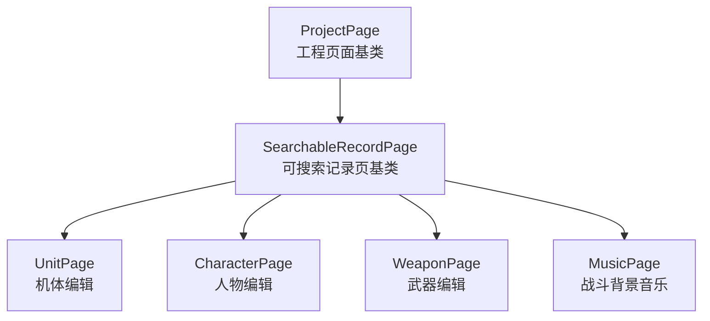
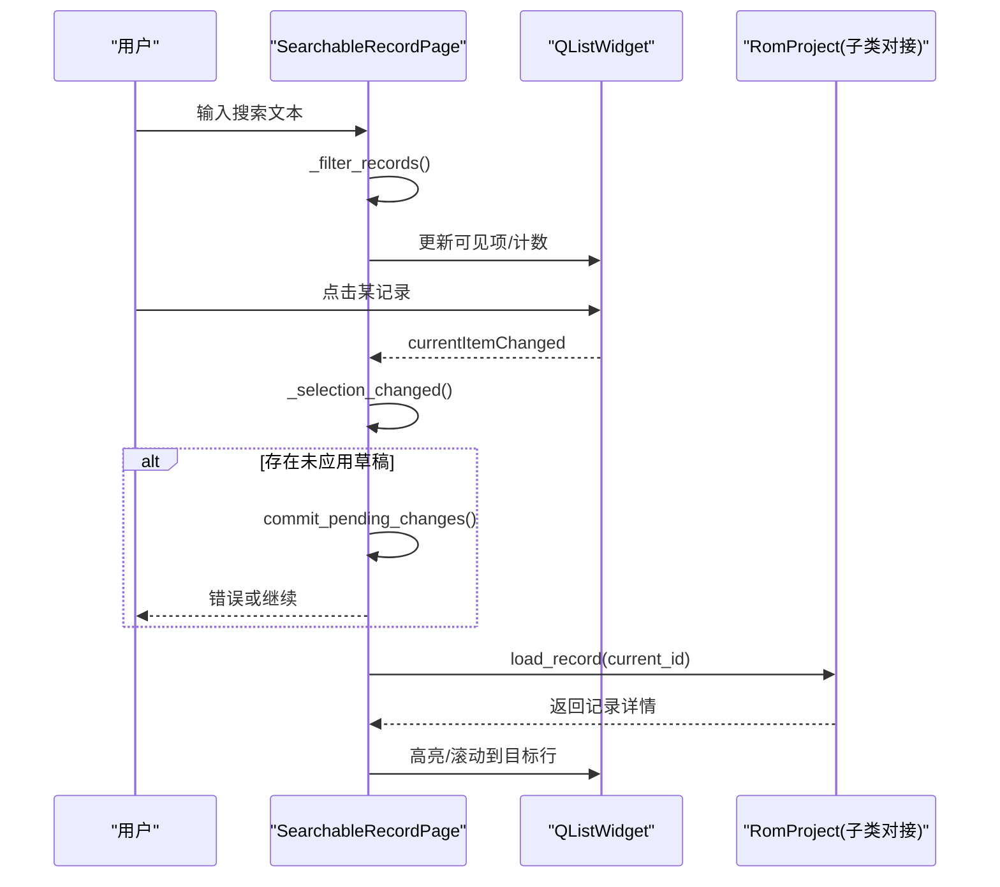
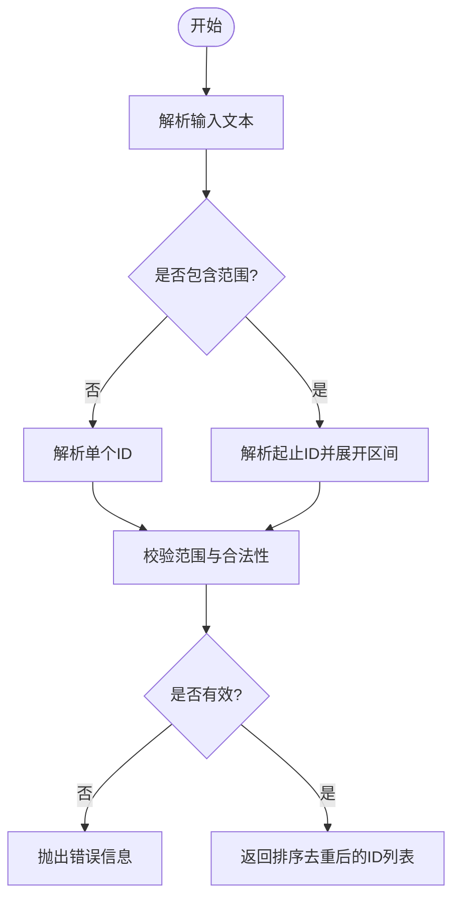
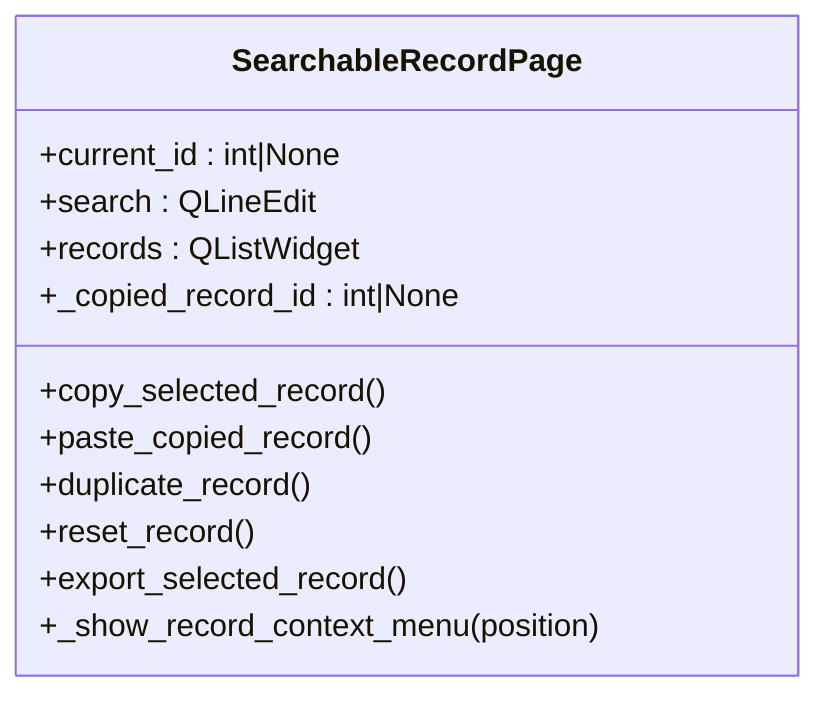
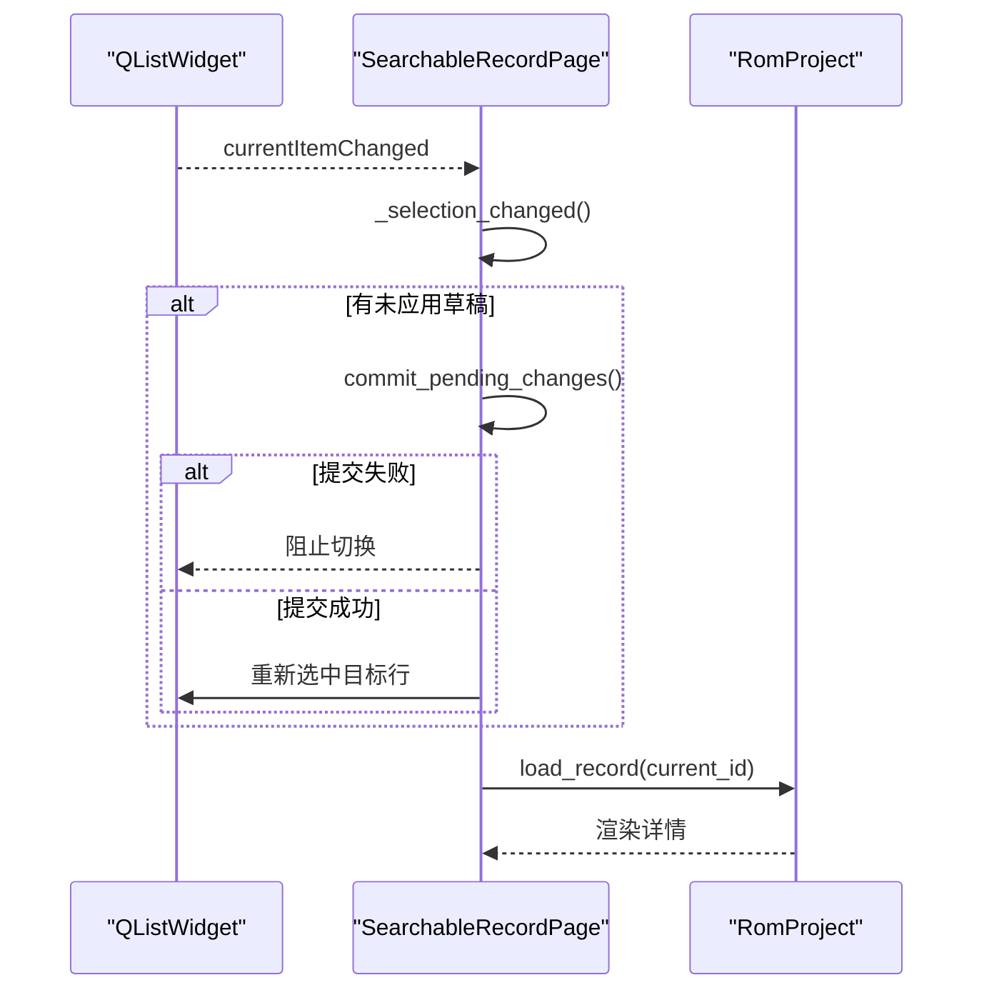
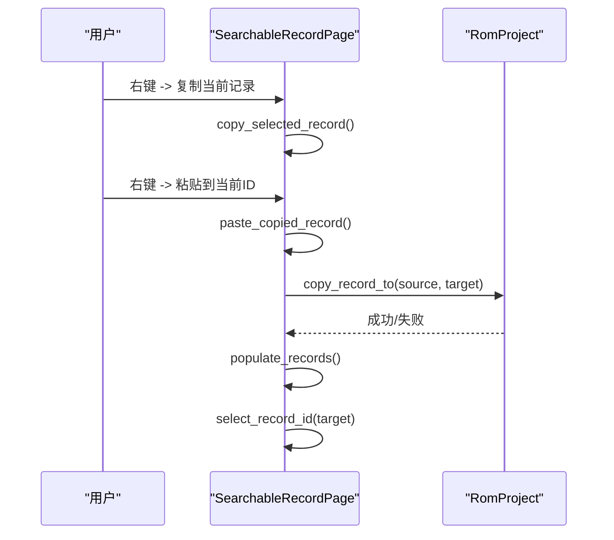
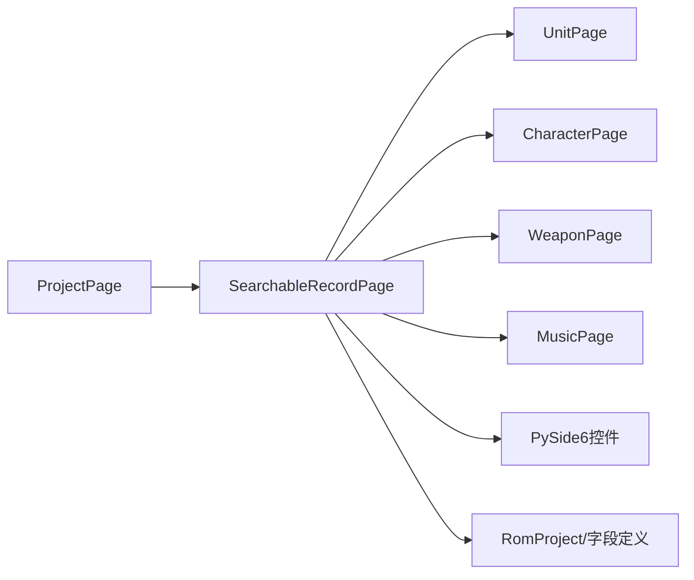

# SearchableRecordPage搜索记录页

<cite>
**本文引用的文件**
- [pages.py](file://src/dc_modifier/pages.py)
</cite>

## 目录
1. [简介](#简介)
2. [项目结构](#项目结构)
3. [核心组件](#核心组件)
4. [架构总览](#架构总览)
5. [详细组件分析](#详细组件分析)
6. [依赖关系分析](#依赖关系分析)
7. [性能考虑](#性能考虑)
8. [故障排查指南](#故障排查指南)
9. [结论](#结论)
10. [附录：子类化示例与必需方法](#附录子类化示例与必需方法)

## 简介
SearchableRecordPage 是 DC 修改器中用于“可搜索的记录编辑”的通用页面基类。它提供统一的搜索框、结果计数、上一条/下一条导航、QListWidget 列表展示、右键上下文菜单（复制/粘贴/复制到其他ID/还原/导出）以及选择变更时的加载流程。具体业务页面（如机体、人物、武器、音乐等）通过继承该基类并实现 record_ids、record_text、load_record 等方法，即可快速获得完整的搜索与记录管理能力。

## 项目结构
- 本功能位于 src/dc_modifier/pages.py，围绕 SearchableRecordPage 及其子类（UnitPage、CharacterPage、WeaponPage、MusicPage）组织。
- 关键能力集中在基类中，子类仅关注各自的数据域与 UI 细节。

图表来源
- [pages.py:103-152](file://src/dc_modifier/pages.py#L103-L152)
- [pages.py:242-512](file://src/dc_modifier/pages.py#L242-L512)
- [pages.py:514-880](file://src/dc_modifier/pages.py#L514-L880)
- [pages.py:882-1214](file://src/dc_modifier/pages.py#L882-L1214)
- [pages.py:1216-1513](file://src/dc_modifier/pages.py#L1216-L1513)
- [pages.py:1515-1878](file://src/dc_modifier/pages.py#L1515-L1878)

章节来源
- [pages.py:103-152](file://src/dc_modifier/pages.py#L103-L152)
- [pages.py:242-512](file://src/dc_modifier/pages.py#L242-L512)

## 核心组件
- 搜索与过滤
  - QLineEdit 搜索框支持名称、十进制、十六进制 ID 实时过滤；支持范围表达式解析（见 parse_id_expression）。
  - 结果计数实时更新，控制上一条/下一条按钮可用性。
- 列表与选择
  - QListWidget 显示记录项，使用 UserRole 存储真实 ID。
  - _selection_changed 负责在切换时加载记录，并在有未应用草稿时自动提交或阻止切换。
- 导航
  - _select_relative(direction) 在可见项之间循环跳转。
- 批量操作
  - copy_selected_record / paste_copied_record / duplicate_record / reset_record / export_selected_record 等接口由基类提供骨架，子类按需实现。
- 数据绑定
  - populate_records 负责刷新列表、保持当前选择、调用 load_record。
  - record_ids、record_text、load_record 由子类实现以适配不同资源类型。

章节来源
- [pages.py:66-100](file://src/dc_modifier/pages.py#L66-L100)
- [pages.py:242-512](file://src/dc_modifier/pages.py#L242-L512)
- [pages.py:514-880](file://src/dc_modifier/pages.py#L514-L880)
- [pages.py:882-1214](file://src/dc_modifier/pages.py#L882-L1214)
- [pages.py:1216-1513](file://src/dc_modifier/pages.py#L1216-L1513)
- [pages.py:1515-1878](file://src/dc_modifier/pages.py#L1515-L1878)

## 架构总览
SearchableRecordPage 将“界面交互”和“数据加载”解耦：
- 界面层：搜索框、列表、按钮、上下文菜单。
- 逻辑层：过滤、选择、导航、批量操作。
- 数据层：通过子类实现的 record_ids/load_record 等与 RomProject 交互。

图表来源
- [pages.py:242-512](file://src/dc_modifier/pages.py#L242-L512)
- [pages.py:514-880](file://src/dc_modifier/pages.py#L514-L880)

## 详细组件分析

### 搜索与 ID 范围解析
- 搜索框 textChanged 触发 _filter_records，按名称、十进制、十六进制匹配隐藏/显示项，并更新计数与导航按钮状态。
- parse_id_expression 支持如下格式：
  - 单个 ID：十进制或十六进制（$xx 或 0xXX）
  - 范围：start-end（支持多种分隔符）
  - 组合：逗号/空格/中文标点分隔
  - 校验：范围倒置、越界检查、空输入提示

图表来源
- [pages.py:66-100](file://src/dc_modifier/pages.py#L66-L100)

章节来源
- [pages.py:66-100](file://src/dc_modifier/pages.py#L66-L100)
- [pages.py:242-512](file://src/dc_modifier/pages.py#L242-L512)

### 记录列表与上下文菜单
- 列表使用 QListWidget，设置交替行色与统一行高以提升可读性。
- 右键菜单支持：
  - 复制当前记录
  - 粘贴到当前ID（需已复制且非同一ID）
  - 复制到其他ID…
  - 还原当前记录
  - 导出当前记录（若子类启用）
- 菜单行为委托给 copy_selected_record、paste_copied_record、duplicate_record、reset_record、export_selected_record。

图表来源
- [pages.py:242-383](file://src/dc_modifier/pages.py#L242-L383)

章节来源
- [pages.py:242-383](file://src/dc_modifier/pages.py#L242-L383)

### 选择机制与当前记录跟踪
- select_record_id(id)：定位并滚动到指定 ID 的行。
- _select_relative(direction)：在可见项间循环移动选择。
- _selection_changed(current, previous)：
  - 若有未应用草稿，先尝试提交；失败则阻止切换。
  - 成功提交后恢复目标行选择。
  - 最终更新 current_id 并调用 load_record。

图表来源
- [pages.py:343-512](file://src/dc_modifier/pages.py#L343-L512)

章节来源
- [pages.py:343-512](file://src/dc_modifier/pages.py#L343-L512)

### 批量操作：复制、粘贴、重复、还原
- 复制/粘贴
  - copy_selected_record：缓存当前记录的 source_id。
  - paste_copied_record：执行 copy_record_to(source, target)，成功后刷新列表并选中目标。
- 复制到其他ID
  - duplicate_record：子类实现选择目标对话框，再调用 copy_record_to。
- 还原
  - reset_record：子类实现回滚到基准值（可能包括属性、名称、武器槽、音乐绑定等）。

图表来源
- [pages.py:317-355](file://src/dc_modifier/pages.py#L317-L355)
- [pages.py:514-880](file://src/dc_modifier/pages.py#L514-L880)
- [pages.py:882-1214](file://src/dc_modifier/pages.py#L882-L1214)
- [pages.py:1216-1513](file://src/dc_modifier/pages.py#L1216-L1513)

章节来源
- [pages.py:317-355](file://src/dc_modifier/pages.py#L317-L355)
- [pages.py:514-880](file://src/dc_modifier/pages.py#L514-L880)
- [pages.py:882-1214](file://src/dc_modifier/pages.py#L882-L1214)
- [pages.py:1216-1513](file://src/dc_modifier/pages.py#L1216-L1513)

### 子类化要点与示例
- 必须实现的方法
  - record_ids()：返回当前资源的有效 ID 范围。
  - record_text(record_id)：返回列表项显示文本（通常包含 ID 与显示名）。
  - load_record(record_id|None)：根据 ID 填充右侧详情表单。
- 可选扩展
  - preferred_record_id()：初始选择推荐行。
  - supports_record_export()/record_export_label()/export_selected_record()：启用导出。
  - confirm_shared_name_edit(kind, ids)：共享名称编辑前二次确认。
- 典型子类
  - UnitPage：机体属性、名称引用、武器槽、原始记录写入、复制/还原。
  - CharacterPage：人物名称引用、直接名称、战斗音乐绑定。
  - WeaponPage：武器属性、名称引用、原始记录只读。
  - MusicPage：战斗音乐选择器绑定、批量应用到多个选择器、自定义曲槽导入/导出。

章节来源
- [pages.py:514-880](file://src/dc_modifier/pages.py#L514-L880)
- [pages.py:882-1214](file://src/dc_modifier/pages.py#L882-L1214)
- [pages.py:1216-1513](file://src/dc_modifier/pages.py#L1216-L1513)
- [pages.py:1515-1878](file://src/dc_modifier/pages.py#L1515-L1878)

## 依赖关系分析
- 外部依赖
  - PySide6 Qt 控件：QLineEdit、QListWidget、QMenu、QMessageBox、QInputDialog 等。
  - 项目模型：RomProject、UNIT_FIELDS、WEAPON_FIELDS、compact_ids 等。
- 内部依赖
  - ProjectPage：工程生命周期与待提交草稿管理。
  - 各业务子类：实现各自 record_ids/load_record 等。

图表来源
- [pages.py:103-152](file://src/dc_modifier/pages.py#L103-L152)
- [pages.py:242-512](file://src/dc_modifier/pages.py#L242-L512)
- [pages.py:514-880](file://src/dc_modifier/pages.py#L514-L880)
- [pages.py:882-1214](file://src/dc_modifier/pages.py#L882-L1214)
- [pages.py:1216-1513](file://src/dc_modifier/pages.py#L1216-L1513)
- [pages.py:1515-1878](file://src/dc_modifier/pages.py#L1515-L1878)

章节来源
- [pages.py:103-152](file://src/dc_modifier/pages.py#L103-L152)
- [pages.py:242-512](file://src/dc_modifier/pages.py#L242-L512)

## 性能考虑
- 列表渲染优化
  - 使用 setUniformItemSizes(True) 减少布局计算开销。
  - 批量更新时 blockSignals + updatesEnabled(False) 避免频繁信号与重绘。
- 搜索性能
  - 当前为全量遍历隐藏/显示，适合中小规模数据。
  - 大数据建议：
    - 引入搜索缓存：对 record_text 的结果建立索引，避免重复格式化。
    - 延迟加载：仅在需要时构建完整列表，或使用虚拟滚动（Qt 的 QListView/QAbstractListModel 配合模型）。
- 选择与导航
  - _select_relative 在可见项间线性查找，数据量大时可考虑维护可见项索引表。
- 事务与刷新
  - 批量写入使用 project.transaction 包裹，减少中间态闪烁与多次刷新。
- 导出与IO
  - 导出大对象时使用异步或进度条反馈，避免阻塞主线程。

[本节为通用指导，不直接分析具体代码]

## 故障排查指南
- 无法切换记录
  - 检查是否有未应用的表单改动；查看 has_pending_draft/pending_draft_error。
  - 确认 commit_pending_changes 是否成功；失败会阻止切换并提示错误。
- 搜索无结果
  - 检查 search 文本是否为空或非法；确认 record_text 返回值是否包含期望关键字。
  - 检查 record_ids 是否正确返回范围。
- 复制/粘贴无效
  - 确保已执行 copy_selected_record；目标ID不能与源ID相同。
  - 检查 copy_record_to 子类实现是否返回 True。
- 还原失败
  - 检查 reset_record 子类实现是否捕获异常并正确调用 project.reset_*。
- 导出失败
  - 检查 supports_record_export 与 export_selected_record 的实现路径与权限。

章节来源
- [pages.py:118-152](file://src/dc_modifier/pages.py#L118-L152)
- [pages.py:317-383](file://src/dc_modifier/pages.py#L317-L383)
- [pages.py:468-512](file://src/dc_modifier/pages.py#L468-L512)
- [pages.py:514-880](file://src/dc_modifier/pages.py#L514-L880)
- [pages.py:882-1214](file://src/dc_modifier/pages.py#L882-L1214)
- [pages.py:1216-1513](file://src/dc_modifier/pages.py#L1216-L1513)
- [pages.py:1515-1878](file://src/dc_modifier/pages.py#L1515-L1878)

## 结论
SearchableRecordPage 提供了稳定、可扩展的“可搜索记录编辑”框架，将通用交互与业务细节解耦。通过实现 record_ids、record_text、load_record 等钩子，子类可以快速获得搜索、列表、导航、批量操作与导出能力。建议在大数据场景下结合搜索缓存与虚拟滚动进一步优化性能，并确保所有写操作使用事务包裹以保证一致性。

## 附录：子类化示例与必需方法
- 必需方法
  - record_ids()：返回 range，例如单位 ID 从 1 到 unit_count。
  - record_text(record_id)：返回显示文本，如 “$XX 名称”。
  - load_record(record_id|None)：根据 ID 填充详情表单；None 时清空。
- 可选方法
  - preferred_record_id()：初始推荐行。
  - supports_record_export()/record_export_label()/export_selected_record()：启用导出。
  - confirm_shared_name_edit(kind, ids)：共享名称编辑确认。
- 参考实现位置
  - 机体：record_ids、record_text、load_record、duplicate_record、copy_record_to、reset_record。
  - 人物：record_ids、record_text、load_record、duplicate_record、copy_record_to、reset_record。
  - 武器：record_ids、record_text、load_record、duplicate_record、copy_record_to、reset_record。
  - 音乐：record_ids、record_text、load_record、apply_to_many、reset_record。

章节来源
- [pages.py:514-880](file://src/dc_modifier/pages.py#L514-L880)
- [pages.py:882-1214](file://src/dc_modifier/pages.py#L882-L1214)
- [pages.py:1216-1513](file://src/dc_modifier/pages.py#L1216-L1513)
- [pages.py:1515-1878](file://src/dc_modifier/pages.py#L1515-L1878)