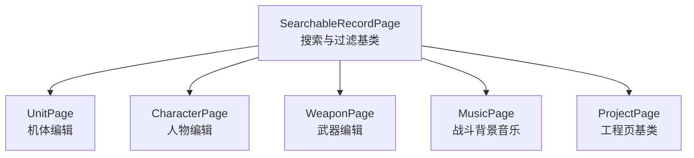
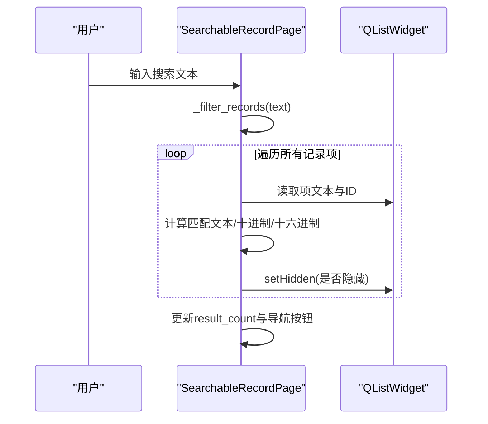
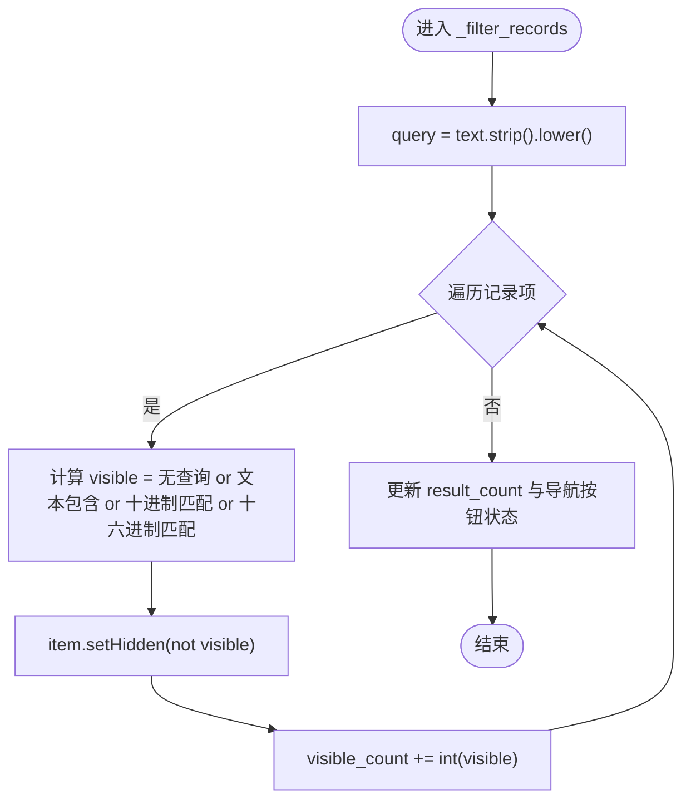
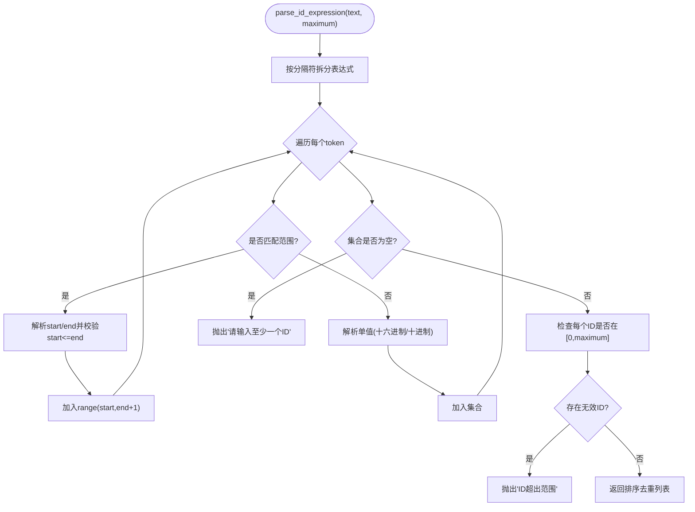
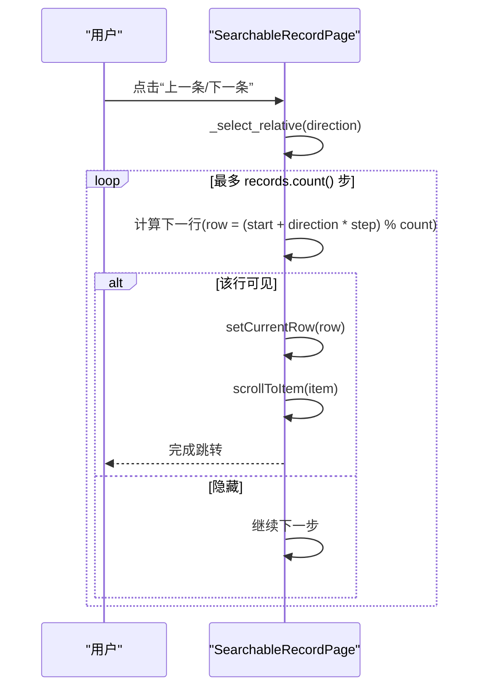
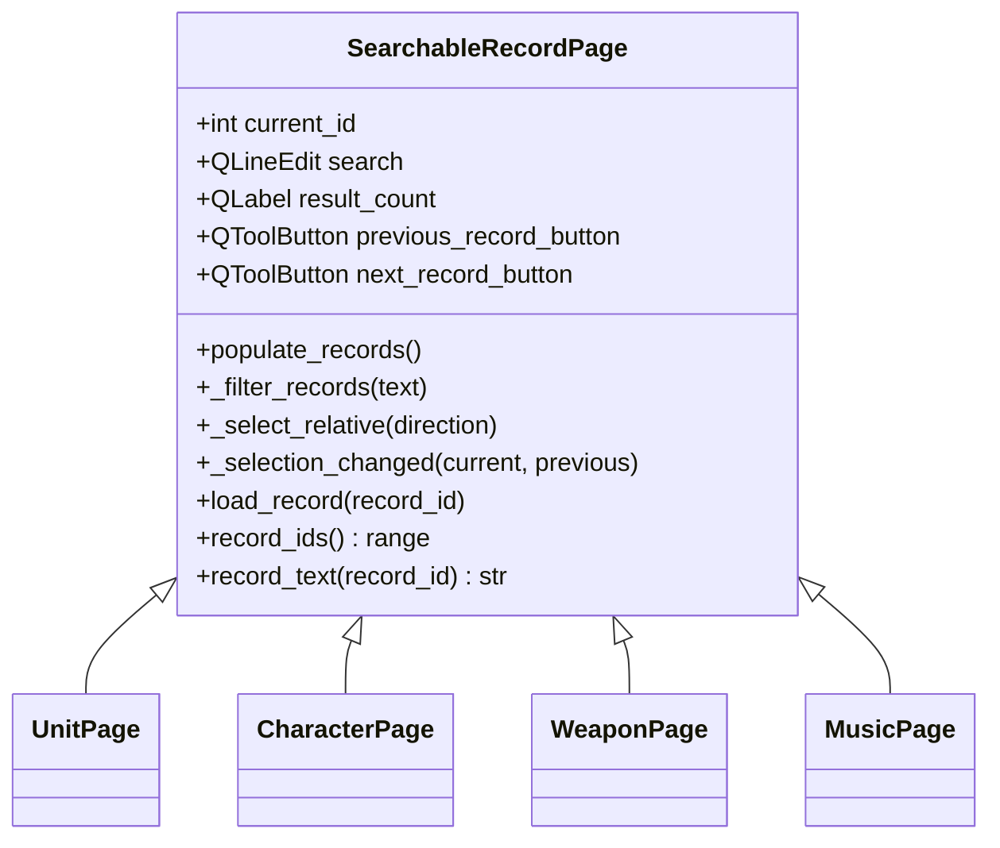
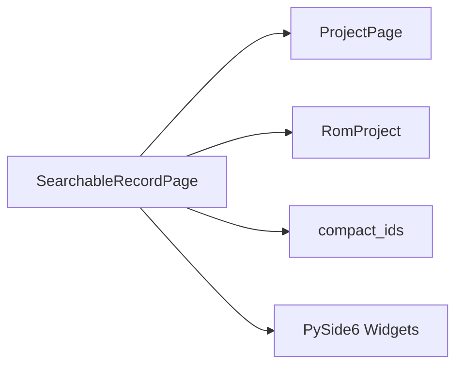

# 搜索与过滤

<cite>
**本文引用的文件**
- [pages.py](file://src/dc_modifier/pages.py)
</cite>

## 目录
1. [简介](#简介)
2. [项目结构](#项目结构)
3. [核心组件](#核心组件)
4. [架构总览](#架构总览)
5. [详细组件分析](#详细组件分析)
6. [依赖关系分析](#依赖关系分析)
7. [性能考量](#性能考量)
8. [故障排查指南](#故障排查指南)
9. [结论](#结论)
10. [附录：扩展自定义搜索逻辑](#附录：扩展自定义搜索逻辑)

## 简介
本章节详细说明 SearchableRecordPage 的搜索与过滤能力，重点解释 _search_filter_records 的工作原理（文本匹配、大小写不敏感、ID格式解析）、parse_id_expression 的 ID 表达式解析（支持十六进制、十进制、范围表示法），并说明搜索结果计数显示与可见记录导航按钮的状态管理。最后提供扩展指南，帮助在子类中实现多字段搜索、模糊匹配、正则表达式等高级功能。

## 项目结构
SearchableRecordPage 位于页面模块中，作为可搜索记录页的基类，被多个具体业务页面继承使用（如机体、人物、武器、音乐等）。其核心职责包括：
- 提供统一的搜索输入框与结果计数展示
- 维护“上一条/下一条”可见记录导航
- 基于查询条件对记录列表进行过滤
- 管理当前选中记录的切换与加载

图表来源
- [pages.py:243-511](file://src/dc_modifier/pages.py#L243-L511)
- [pages.py:514-879](file://src/dc_modifier/pages.py#L514-L879)
- [pages.py:882-1213](file://src/dc_modifier/pages.py#L882-L1213)
- [pages.py:1216-1512](file://src/dc_modifier/pages.py#L1216-L1512)
- [pages.py:1515-1877](file://src/dc_modifier/pages.py#L1515-L1877)

章节来源
- [pages.py:243-511](file://src/dc_modifier/pages.py#L243-L511)

## 核心组件
- SearchableRecordPage：提供通用搜索、过滤、导航与结果计数能力
- parse_id_expression：解析用户输入的 ID 表达式，支持多种进制与范围语法
- 子类页面（UnitPage、CharacterPage、WeaponPage、MusicPage）：定义 record_ids、record_text、load_record 等以适配各自业务数据

章节来源
- [pages.py:66-100](file://src/dc_modifier/pages.py#L66-L100)
- [pages.py:243-511](file://src/dc_modifier/pages.py#L243-L511)
- [pages.py:514-879](file://src/dc_modifier/pages.py#L514-L879)
- [pages.py:882-1213](file://src/dc_modifier/pages.py#L882-L1213)
- [pages.py:1216-1512](file://src/dc_modifier/pages.py#L1216-L1512)
- [pages.py:1515-1877](file://src/dc_modifier/pages.py#L1515-L1877)

## 架构总览
SearchableRecordPage 通过 QListWidget 展示记录项，每个项携带一个整数 ID（UserRole）。搜索时，将用户输入转为小写，并与每项的显示文本、十进制字符串、两位十六进制字符串进行包含匹配；同时更新可见计数与导航按钮状态。

图表来源
- [pages.py:243-511](file://src/dc_modifier/pages.py#L243-L511)

## 详细组件分析

### _search_filter_records 工作原理
- 输入处理：去除首尾空白并统一为小写
- 匹配策略：
  - 若查询为空，则全部可见
  - 否则逐项判断：
    - 项显示文本的小写形式是否包含查询
    - 或项 ID 的十进制字符串是否等于查询
    - 或项 ID 的两位十六进制字符串是否等于查询
- 结果统计：统计可见项数量，更新 result_count 标签
- 导航控制：当可见项大于 1 时启用“上一条/下一条”按钮，否则禁用

图表来源
- [pages.py:439-453](file://src/dc_modifier/pages.py#L439-L453)

章节来源
- [pages.py:439-453](file://src/dc_modifier/pages.py#L439-L453)

### parse_id_expression 的 ID 表达式解析
- 支持的输入格式：
  - 十六进制前缀 $xx（例如 $00）
  - 十六进制前缀 0xXX（例如 0x20）
  - 十进制数字（例如 16）
  - 范围表示法：start-end，支持分隔符 -、—、~、～（例如 $00-$05）
  - 多值组合：逗号、中文逗号、顿号、空格分隔（例如 $00-$05, 16, 0x20）
- 解析流程：
  - 按分隔符拆分表达式
  - 对每个 token 尝试识别范围或单值
  - 范围需满足 start <= end，否则报错
  - 校验每个 ID 是否在 [0, maximum] 范围内
  - 返回排序去重后的 ID 列表
- 错误处理：
  - 空 token、范围倒置、超出范围等均抛出 ValueError

图表来源
- [pages.py:66-100](file://src/dc_modifier/pages.py#L66-L100)

章节来源
- [pages.py:66-100](file://src/dc_modifier/pages.py#L66-L100)

### 搜索结果计数显示与可见记录导航
- 结果计数：每次过滤后更新 result_count 标签，显示“X 条”
- 导航按钮：
  - previous_record_button：跳转到上一个可见记录
  - next_record_button：跳转到下一个可见记录
  - 仅当可见记录数大于 1 时启用
- 相对选择算法：从当前行开始，按方向步进，跳过隐藏项，循环查找直到找到可见项

图表来源
- [pages.py:455-466](file://src/dc_modifier/pages.py#L455-L466)

章节来源
- [pages.py:439-466](file://src/dc_modifier/pages.py#L439-L466)

### 数据模型与交互时序
- 记录项数据结构：QListWidgetItem，UserRole 存储整数 ID
- 文本显示：由子类 record_text(record_id) 决定（默认显示两位十六进制 ID）
- 选择变更：_selection_changed 负责提交待办草稿并加载目标记录

图表来源
- [pages.py:243-511](file://src/dc_modifier/pages.py#L243-L511)
- [pages.py:514-879](file://src/dc_modifier/pages.py#L514-L879)
- [pages.py:882-1213](file://src/dc_modifier/pages.py#L882-L1213)
- [pages.py:1216-1512](file://src/dc_modifier/pages.py#L1216-L1512)
- [pages.py:1515-1877](file://src/dc_modifier/pages.py#L1515-L1877)

章节来源
- [pages.py:243-511](file://src/dc_modifier/pages.py#L243-L511)

## 依赖关系分析
- 外部依赖：PySide6 UI 组件（QLineEdit、QListWidget、QToolButton、QLabel 等）
- 内部依赖：
  - ProjectPage：工程页基类，提供事务与错误提示
  - RomProject：工程对象，用于获取记录 ID 范围与数据
  - compact_ids：辅助函数，用于格式化共享 ID 列表
- 耦合度：
  - SearchableRecordPage 与子类解耦良好，通过抽象方法 record_ids、record_text、load_record 扩展
  - 过滤逻辑集中在 _filter_records，便于替换或增强

图表来源
- [pages.py:103-151](file://src/dc_modifier/pages.py#L103-L151)
- [pages.py:243-511](file://src/dc_modifier/pages.py#L243-L511)

章节来源
- [pages.py:103-151](file://src/dc_modifier/pages.py#L103-L151)
- [pages.py:243-511](file://src/dc_modifier/pages.py#L243-L511)

## 性能考量
- 时间复杂度：
  - 过滤：O(N)，N 为记录总数
  - 相对选择：最坏 O(N)，但通常很快命中
- 优化建议：
  - 大数据量时可考虑缓存查询结果或使用更高效的索引结构
  - 避免在高频事件中执行昂贵操作（如网络请求）
  - 合理使用 blockSignals 与 updatesEnabled 减少 UI 刷新开销（已实现）

## 故障排查指南
- 常见问题：
  - 搜索无结果：检查 record_text 输出是否包含期望字段；确认 query 非空且匹配逻辑正确
  - 导航按钮不可用：确认可见记录数 > 1
  - ID 表达式解析失败：检查分隔符、范围顺序与数值范围
- 定位方法：
  - 打印 query 与各字段的小写形式，验证匹配条件
  - 捕获 parse_id_expression 抛出的 ValueError，查看具体原因

章节来源
- [pages.py:66-100](file://src/dc_modifier/pages.py#L66-L100)
- [pages.py:439-466](file://src/dc_modifier/pages.py#L439-L466)

## 结论
SearchableRecordPage 提供了简洁而强大的搜索与过滤能力，支持大小写不敏感的文本匹配与 ID 精确匹配，并通过 parse_id_expression 支持灵活的 ID 表达式输入。结合结果计数与可见记录导航，提升了用户体验。通过子类化可扩展至多字段搜索、模糊匹配与正则表达式等高级场景。

## 附录：扩展自定义搜索逻辑
目标：在不破坏现有行为的前提下，增强搜索能力以满足复杂需求。

- 多字段搜索
  - 思路：在 _filter_records 中增加对额外字段的匹配（如名称、描述、类型）
  - 步骤：
    - 在 populate_records 时为每个 item 附加更多数据（例如使用 UserRole 或自定义属性）
    - 在 _filter_records 中读取这些字段并参与匹配
  - 示例路径参考：[populate_records:396-438](file://src/dc_modifier/pages.py#L396-L438)、[_filter_records:439-453](file://src/dc_modifier/pages.py#L439-L453)

- 模糊匹配
  - 思路：引入编辑距离或分词匹配，提升容错率
  - 步骤：
    - 将查询拆分为关键词列表
    - 对每个记录项的字段进行分词与相似度计算
    - 设置阈值决定是否可见
  - 注意：保持响应速度，必要时限制最大比较次数

- 正则表达式支持
  - 思路：允许用户使用正则表达式进行高级匹配
  - 步骤：
    - 检测查询是否以特定前缀开头（如 /.../）
    - 编译正则并应用于字段匹配
    - 捕获异常并提示用户修正
  - 安全建议：限制正则复杂度，避免灾难回溯

- 优先级与排序
  - 思路：根据匹配程度对结果排序，提高相关性
  - 步骤：
    - 为每个记录计算分数（如完全匹配得分高）
    - 在过滤后对可见项重新排序或仅显示 Top-K
  - 注意：保持用户预期，提供重置选项

- 增量过滤与防抖
  - 思路：减少频繁输入导致的重复计算
  - 步骤：
    - 使用定时器延迟触发过滤
    - 缓存上次查询结果，仅在变化时重新计算
  - 注意：确保 UI 响应及时，避免卡顿

- 测试与验证
  - 单元测试：覆盖边界情况（空查询、非法 ID、范围倒置）
  - 集成测试：模拟用户输入与交互，验证结果计数与导航状态
  - 回归测试：确保新增功能不影响现有行为

章节来源
- [pages.py:396-453](file://src/dc_modifier/pages.py#L396-L453)
- [pages.py:66-100](file://src/dc_modifier/pages.py#L66-L100)