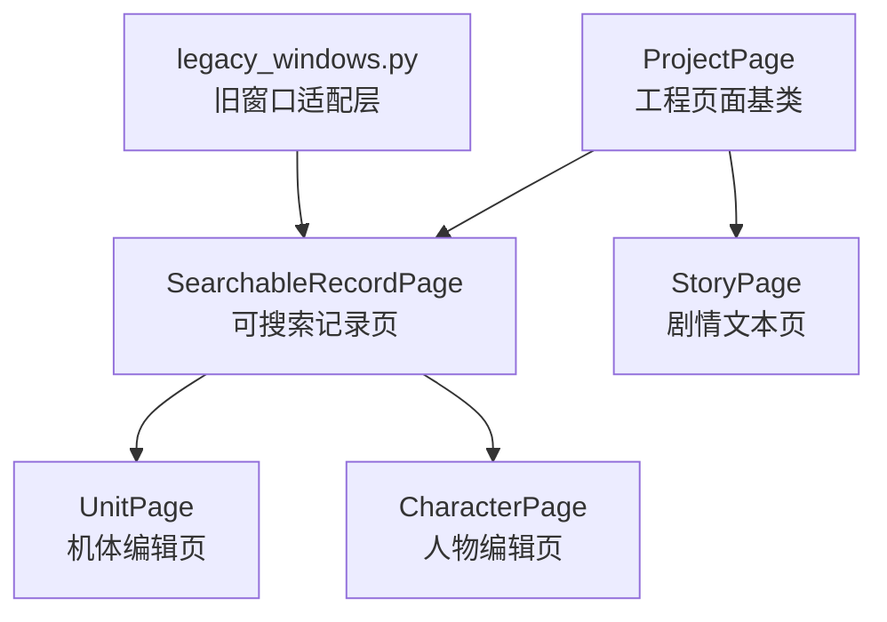
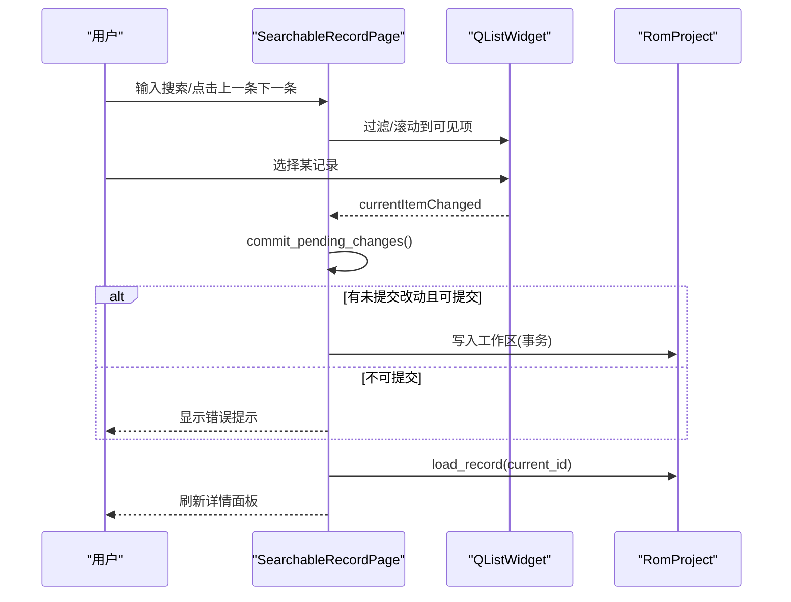
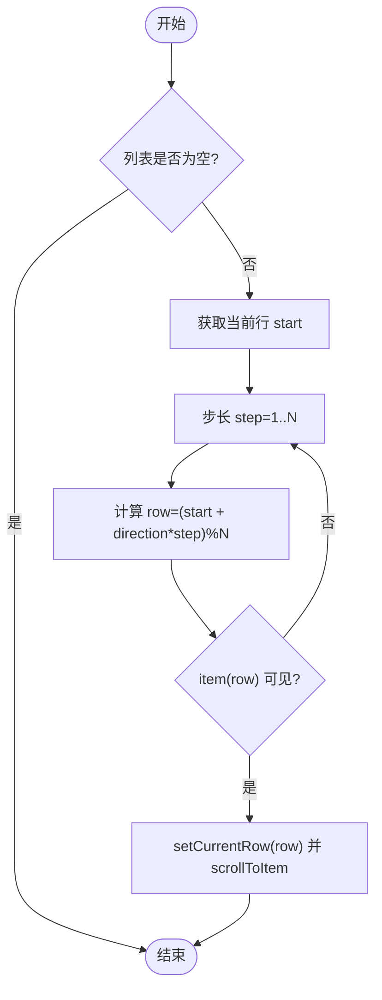
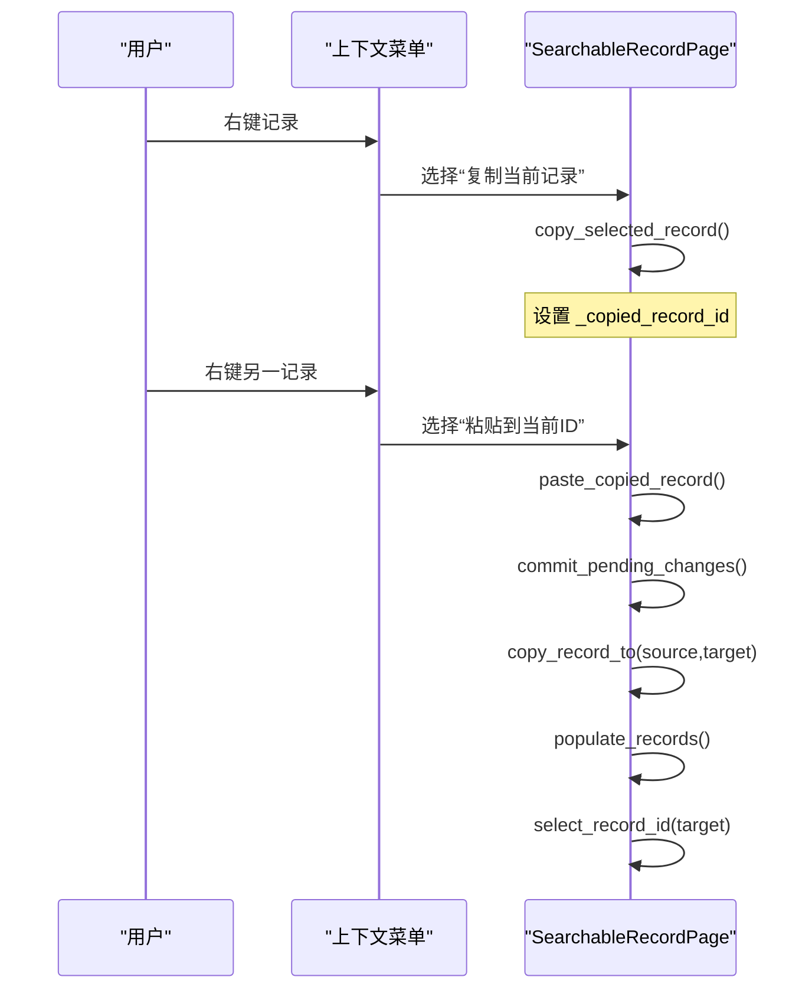
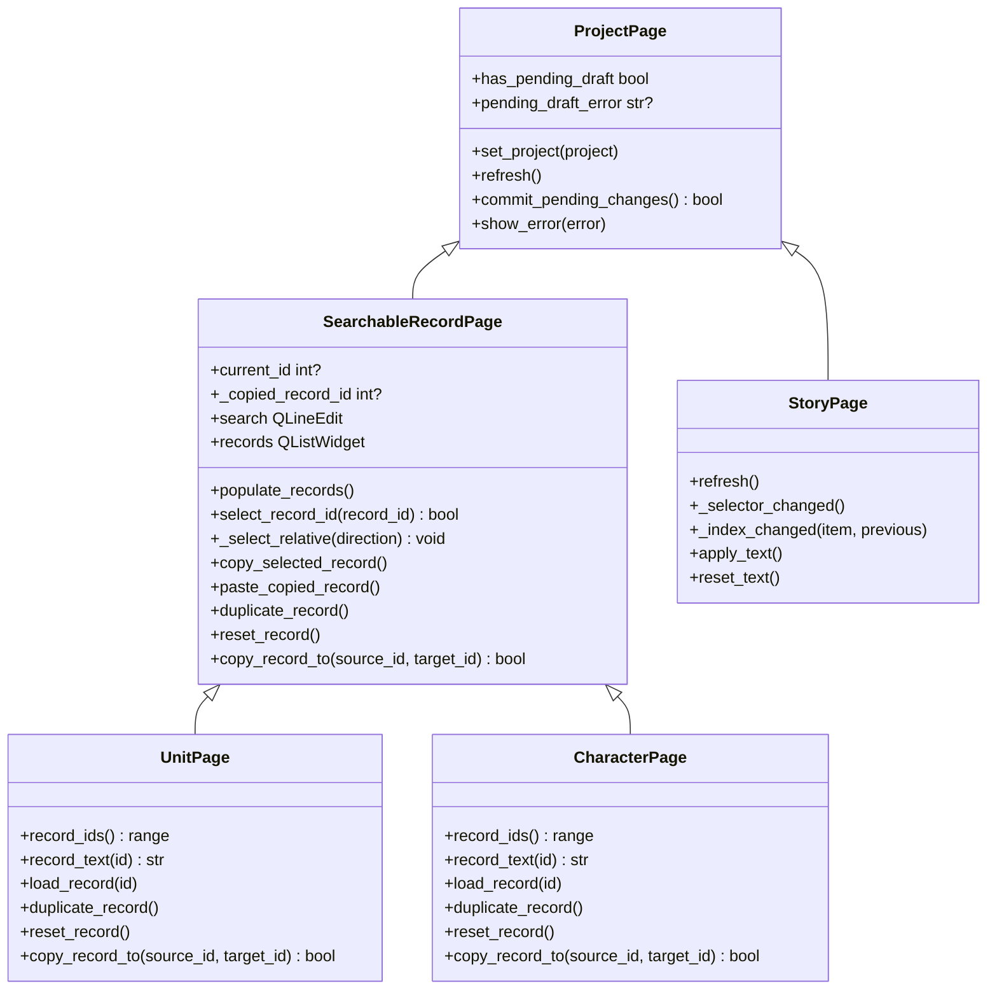

# 记录管理

<cite>
**本文引用的文件**
- [pages.py](file://src/dc_modifier/pages.py)
- [story_page.py](file://src/dc_modifier/story_page.py)
- [legacy_windows.py](file://src/dc_modifier/legacy_windows.py)
</cite>

## 目录
1. [简介](#简介)
2. [项目结构](#项目结构)
3. [核心组件](#核心组件)
4. [架构总览](#架构总览)
5. [详细组件分析](#详细组件分析)
6. [依赖关系分析](#依赖关系分析)
7. [性能考量](#性能考量)
8. [故障排查指南](#故障排查指南)
9. [结论](#结论)

## 简介
本文件聚焦“记录管理”的核心实现，围绕以下目标展开：
- 解释 populate_records 的数据绑定机制：记录列表构建、更新优化、选择状态保持。
- 说明记录选择系统：select_record_id 定位、_select_relative 相邻导航、键盘快捷键支持。
- 说明记录上下文菜单：复制、粘贴、重复、重置等操作。
- 详述记录复制粘贴机制：_copy_selected_record（实际为 copy_selected_record）、paste_copied_record 的实现逻辑与剪贴板状态管理。
- 提供记录验证与错误处理的完整示例路径。

## 项目结构
记录管理主要位于 dc_modifier 模块的页面类中，采用“可搜索记录页”作为通用基类，具体业务页面（如机体、人物等）继承并扩展其能力；剧情文本编辑使用独立的 StoryPage，但同样具备选择与导航能力。

图表来源
- [pages.py:103-152](file://src/dc_modifier/pages.py#L103-L152)
- [pages.py:243-511](file://src/dc_modifier/pages.py#L243-L511)
- [story_page.py:35-171](file://src/dc_modifier/story_page.py#L35-L171)
- [legacy_windows.py:1020-1030](file://src/dc_modifier/legacy_windows.py#L1020-L1030)

章节来源
- [pages.py:103-152](file://src/dc_modifier/pages.py#L103-L152)
- [pages.py:243-511](file://src/dc_modifier/pages.py#L243-L511)
- [story_page.py:35-171](file://src/dc_modifier/story_page.py#L35-L171)
- [legacy_windows.py:1020-1030](file://src/dc_modifier/legacy_windows.py#L1020-L1030)

## 核心组件
- SearchableRecordPage：提供通用的记录列表、搜索过滤、上下文菜单、复制/粘贴/重复/还原、选择与导航等能力。
- UnitPage / CharacterPage：继承 SearchableRecordPage，实现各自 record_ids、record_text、load_record、apply/duplicate/reset 等业务逻辑。
- StoryPage：独立实现文本组选择、索引列表、原始Token与Unicode双向编辑、验证与提交。
- legacy_windows.py：旧版窗口适配，转发 _select_relative 到控制器。

章节来源
- [pages.py:243-511](file://src/dc_modifier/pages.py#L243-L511)
- [pages.py:514-879](file://src/dc_modifier/pages.py#L514-L879)
- [pages.py:882-1200](file://src/dc_modifier/pages.py#L882-L1200)
- [story_page.py:35-171](file://src/dc_modifier/story_page.py#L35-L171)
- [legacy_windows.py:1020-1030](file://src/dc_modifier/legacy_windows.py#L1020-L1030)

## 架构总览
记录管理的整体流程如下：
- 数据源：RomProject 提供各类型记录的 ID 范围、显示名、字段值、名称引用、武器槽等。
- UI 层：SearchableRecordPage 维护 QListWidget 记录列表、搜索框、结果计数、上一条/下一条按钮。
- 交互：用户通过列表选择、搜索过滤、右键菜单或键盘导航切换当前记录。
- 变更：表单修改后进入“待提交”状态；切换记录时自动尝试提交；应用/复制/重复/还原均通过 project.transaction 包裹事务。
- 反馈：提示条显示是否有未提交的改动、长度校验、容量预估等。

图表来源
- [pages.py:439-511](file://src/dc_modifier/pages.py#L439-L511)
- [pages.py:396-438](file://src/dc_modifier/pages.py#L396-L438)

## 详细组件分析

### 记录列表构建与更新优化：populate_records
- 目的：将 RomProject 提供的记录 ID 范围映射为 QListWidget 条目，并在不丢失选择的前提下高效更新。
- 关键机制：
  - 保存 previous 选择，blockSignals 与 updatesEnabled 关闭信号与重绘，避免中间态触发事件。
  - 对比 existing_ids 与新的 record_ids：
    - 若完全一致：仅更新 item 文本（例如显示名变化），减少重建开销。
    - 否则清空并重建条目，同时设置 UserRole 存储 record_id。
  - 调用 _filter_records 应用搜索过滤，恢复可见项。
  - 优先恢复 previous 选择；若无则使用 preferred_record_id。
  - 最后统一触发一次 _selection_changed，确保详情加载与状态同步。
- 复杂度：
  - 重建场景 O(N) 创建条目；增量更新场景 O(1) 文本替换。
  - 过滤 O(N) 遍历可见性。
- 选择状态保持：通过保存 previous 并在重建后查找对应行恢复选中。

章节来源
- [pages.py:396-438](file://src/dc_modifier/pages.py#L396-L438)
- [pages.py:439-453](file://src/dc_modifier/pages.py#L439-L453)

### 记录选择与导航：select_record_id 与 _select_relative
- select_record_id(record_id)：
  - 在 records 列表中查找匹配 record_id 的行，设置当前行并滚动到可视区域，返回是否成功。
- _select_relative(direction)：
  - 在可见项中按方向步进，循环查找下一个可见行，设置当前行并滚动。
  - 用于“上一条/下一条”按钮以及可能的键盘导航。
- 键盘快捷键支持：
  - 界面提示“Alt+↓”用于下一条可见记录；实际快捷键绑定由上层窗口负责，此处提供 _select_relative 供调用。
  - 旧窗口适配层 legacy_windows.py 将 _select_relative 转发给控制器，便于统一处理。

图表来源
- [pages.py:455-466](file://src/dc_modifier/pages.py#L455-L466)
- [legacy_windows.py:1028-1029](file://src/dc_modifier/legacy_windows.py#L1028-L1029)

章节来源
- [pages.py:343-350](file://src/dc_modifier/pages.py#L343-L350)
- [pages.py:455-466](file://src/dc_modifier/pages.py#L455-L466)
- [legacy_windows.py:1028-1029](file://src/dc_modifier/legacy_windows.py#L1028-L1029)

### 记录上下文菜单：复制、粘贴、重复、重置
- 触发：records.customContextMenuRequested -> _show_record_context_menu。
- 菜单项：
  - 复制当前记录：copy_selected_record
  - 粘贴到当前ID：paste_copied_record（仅在存在剪贴板记录且非同一ID时启用）
  - 复制到其他ID…：duplicate_record
  - 还原当前记录：reset_record
  - 导出当前记录（可选）：export_selected_record
- 行为：
  - 复制：保存 _copied_record_id = current_id，并更新 tooltip 提示。
  - 粘贴：commit_pending_changes -> copy_record_to(source, target) -> populate_records -> select_record_id(target)。
  - 重复：子类实现，弹出目标ID选择器，再调用 copy_record_to。
  - 还原：子类实现，回滚到基准ROM状态。

图表来源
- [pages.py:285-341](file://src/dc_modifier/pages.py#L285-L341)

章节来源
- [pages.py:285-341](file://src/dc_modifier/pages.py#L285-L341)

### 记录复制粘贴机制：copy_selected_record 与 paste_copied_record
- 剪贴板状态：
  - 成员变量 _copied_record_id 表示当前复制的来源ID；当切换项目时会被清空，避免跨工程误用。
- copy_selected_record：
  - 条件：project 与 current_id 有效；先提交待办更改。
  - 设置 _copied_record_id 并更新 tooltip 提示。
- paste_copied_record：
  - 条件：project/current_id/_copied_record_id 有效且不为同一ID；提交待办更改。
  - 调用 copy_record_to(source, target)，成功后刷新列表并选中目标ID。
- 子类覆盖：
  - UnitPage.copy_record_to：复制16字节属性、名称引用、武器槽，必要时弹窗确认共享影响。
  - CharacterPage.copy_record_to：复制名称引用与战斗音乐绑定。

章节来源
- [pages.py:317-341](file://src/dc_modifier/pages.py#L317-L341)
- [pages.py:780-819](file://src/dc_modifier/pages.py#L780-L819)
- [pages.py:1172-1198](file://src/dc_modifier/pages.py#L1172-L1198)

### 记录验证与错误处理
- 待提交检查：
  - has_pending_draft：根据 apply_button 是否可用判断是否存在未提交表单。
  - pending_draft_error：子类返回无法提交的原因（如长度不符、冲突等）。
  - commit_pending_changes：尝试提交；若失败则阻止切换或操作。
- 选择切换保护：
  - _selection_changed 在切换前尝试提交；若失败，恢复原选择并显示错误。
- 故事文本页的特殊验证：
  - 无扩展规划时，必须保持等长；有扩展规划时进行容量预估与自动重排。
  - Unicode 与原始 Token 不能同时存在未提交草稿；需明确保留其一。
  - 字库表缺失或非法十六进制输入会给出明确错误提示。
- 错误展示：
  - show_error：统一以 QMessageBox.critical 弹出错误信息。

章节来源
- [pages.py:118-152](file://src/dc_modifier/pages.py#L118-L152)
- [pages.py:468-509](file://src/dc_modifier/pages.py#L468-L509)
- [story_page.py:339-406](file://src/dc_modifier/story_page.py#L339-L406)
- [story_page.py:517-580](file://src/dc_modifier/story_page.py#L517-L580)
- [story_page.py:581-646](file://src/dc_modifier/story_page.py#L581-L646)

### 记录重复与还原
- 重复（duplicate_record）：
  - 弹出目标ID选择器，调用 copy_record_to。
  - UnitPage 会复制数值、名称引用与武器配置；CharacterPage 复制名称引用与音乐绑定。
- 还原（reset_record）：
  - 调用 project.reset_record 及相关重置接口，回滚到基准ROM状态。
  - 通过事务包裹，保证一致性。

章节来源
- [pages.py:759-819](file://src/dc_modifier/pages.py#L759-L819)
- [pages.py:868-879](file://src/dc_modifier/pages.py#L868-L879)
- [pages.py:1151-1198](file://src/dc_modifier/pages.py#L1151-L1198)

## 依赖关系分析
- SearchableRecordPage 依赖 RomProject 提供：
  - record_ids：记录ID范围
  - record_text：记录显示文本
  - load_record：加载详情
  - set_value / get_value：字段读写
  - unit_name_reference_options / character_name_source_ids：名称引用与共享关系
  - transaction：事务封装
- StoryPage 依赖 TextTable 进行码表解析与编码，并通过 project.story_text_codec 进行分词与容量预估。
- legacy_windows.py 作为旧窗口适配层，转发 _select_relative 到控制器，保持行为一致。

图表来源
- [pages.py:103-152](file://src/dc_modifier/pages.py#L103-L152)
- [pages.py:243-511](file://src/dc_modifier/pages.py#L243-L511)
- [pages.py:514-879](file://src/dc_modifier/pages.py#L514-L879)
- [pages.py:882-1200](file://src/dc_modifier/pages.py#L882-L1200)
- [story_page.py:35-171](file://src/dc_modifier/story_page.py#L35-L171)

章节来源
- [pages.py:103-152](file://src/dc_modifier/pages.py#L103-L152)
- [pages.py:243-511](file://src/dc_modifier/pages.py#L243-L511)
- [pages.py:514-879](file://src/dc_modifier/pages.py#L514-L879)
- [pages.py:882-1200](file://src/dc_modifier/pages.py#L882-L1200)
- [story_page.py:35-171](file://src/dc_modifier/story_page.py#L35-L171)

## 性能考量
- 列表更新优化：
  - 使用 blockSignals 与 updatesEnabled 批量更新，避免频繁重绘与信号风暴。
  - 当记录ID集合未变化时，仅更新文本，降低重建成本。
- 过滤与导航：
  - 过滤 O(N) 遍历；导航在可见项内步进，最坏 O(N)。
- 事务与验证：
  - 所有写操作通过 project.transaction 包裹，保证原子性与可回滚。
  - 验证前置（如长度、容量）可减少无效写入。

[本节为通用指导，无需特定文件来源]

## 故障排查指南
- 无法切换记录：
  - 检查 has_pending_draft 与 pending_draft_error；修正表单后再切换。
  - 查看 _selection_changed 中的提交失败分支，确认错误提示。
- 粘贴不可用：
  - 确认 _copied_record_id 已设置且与目标不同；检查上下文菜单启用逻辑。
- 故事文本无法应用：
  - 确认是否同时修改了 Unicode 与原始 Token；需明确保留其一。
  - 无扩展规划时需保持等长；有扩展规划时检查容量预估与自动重排。
- 字库表问题：
  - 载入 .tbl 失败或为空会导致解码异常；重新载入或检查格式。
- 错误提示：
  - 统一通过 show_error 弹出；关注 QMessageBox 内容定位问题。

章节来源
- [pages.py:468-509](file://src/dc_modifier/pages.py#L468-L509)
- [pages.py:317-341](file://src/dc_modifier/pages.py#L317-L341)
- [story_page.py:339-406](file://src/dc_modifier/story_page.py#L339-L406)
- [story_page.py:517-580](file://src/dc_modifier/story_page.py#L517-L580)
- [story_page.py:698-717](file://src/dc_modifier/story_page.py#L698-L717)

## 结论
记录管理系统以 SearchableRecordPage 为核心，提供了高效的列表构建与更新、稳定的选择与导航、完善的上下文菜单操作、健壮的复制粘贴机制以及严格的验证与错误处理。StoryPage 在此基础上实现了更复杂的文本双向编辑与容量管理。通过事务化写入与前置校验，系统在易用性与安全性之间取得良好平衡。

[本节为总结，无需特定文件来源]