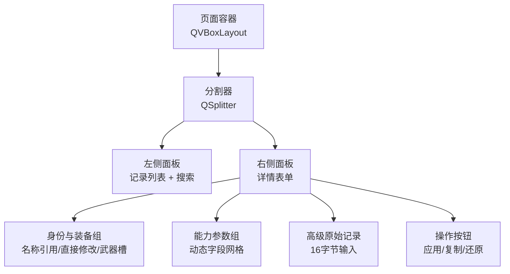
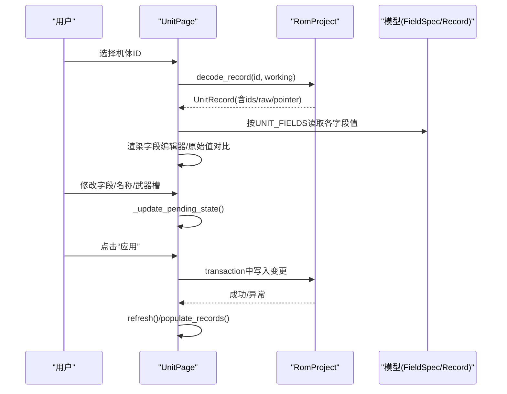
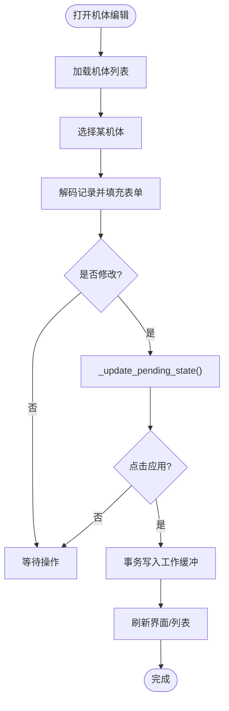
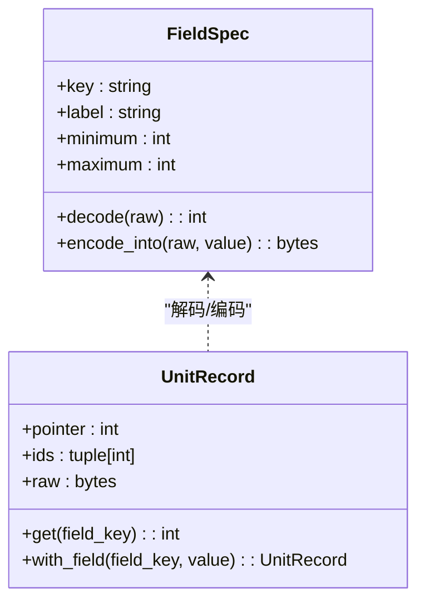
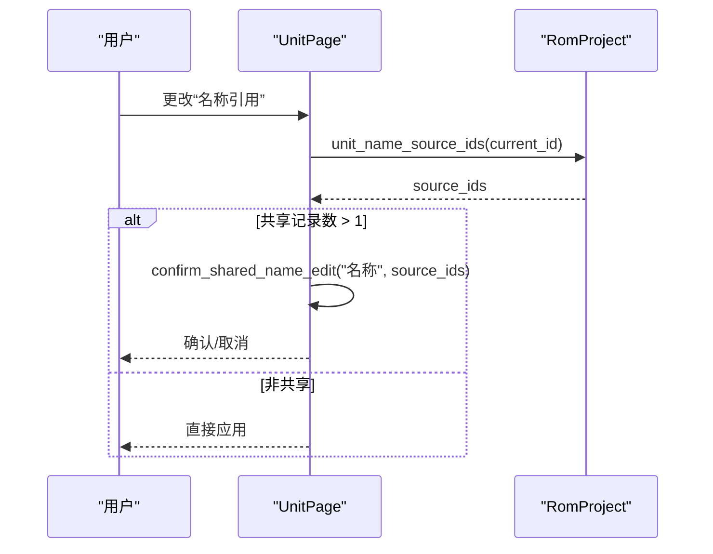
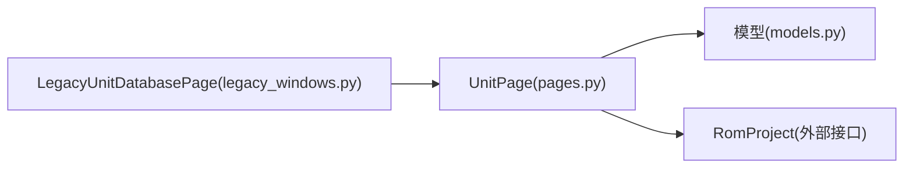

# UnitPage具体实现

<cite>
**本文引用的文件**
- [pages.py](file://src/dc_modifier/pages.py)
- [models.py](file://src/fc_editor/models.py)
- [legacy_windows.py](file://src/dc_modifier/legacy_windows.py)
</cite>

## 目录
1. [简介](#简介)
2. [项目结构](#项目结构)
3. [核心组件](#核心组件)
4. [架构总览](#架构总览)
5. [详细组件分析](#详细组件分析)
6. [依赖关系分析](#依赖关系分析)
7. [性能考虑](#性能考虑)
8. [故障排查指南](#故障排查指南)
9. [结论](#结论)
10. [附录：开发示例与最佳实践](#附录：开发示例与最佳实践)

## 简介
本文件为“机体编辑页面（UnitPage）”的完整实现文档，聚焦以下目标：
- UI布局设计：左右分栏、表单布局、滚动区域与状态提示。
- 数据绑定机制：字段编辑器、名称引用、武器槽与原始记录。
- 用户交互处理：搜索过滤、选择切换、复制/粘贴/批量复制、导出数据包。
- 字段编辑器：UNIT_FIELDS动态生成、数值验证、原始值对比显示。
- 武器槽配置：下拉列表动态填充、多武器支持、有效性检查。
- 名称引用机制：共享名称处理、名称指针管理、修改确认对话框。
- 高级功能：原始记录编辑、数据包导出、批量复制等。
- 扩展方式：从基类继承并实现特定业务逻辑的开发示例。
- 性能优化与用户体验改进的最佳实践。

## 项目结构
UnitPage位于dc_modifier模块的页面体系中，作为SearchableRecordPage的具体实现之一，负责机体数据的浏览、编辑与应用。其UI由左侧记录列表+右侧详情面板组成，详情面板包含身份与装备、能力参数、高级原始记录编辑区以及操作按钮。

图表来源
- [pages.py:514-622](file://src/dc_modifier/pages.py#L514-L622)

章节来源
- [pages.py:514-622](file://src/dc_modifier/pages.py#L514-L622)

## 核心组件
- SearchableRecordPage：提供通用记录页能力（搜索、上下条导航、右键菜单、复制/粘贴/重置/导出等）。
- UnitPage：在SearchableRecordPage基础上实现机体编辑的具体UI与业务逻辑。
- FieldSpec/WeaponFieldSpec：定义字段元数据（键名、标签、范围、掩码、位移、说明等），用于动态生成编辑器与校验。
- UnitRecord/WeaponRecord：封装原始记录的读写接口，保证记录长度与ID合法性。
- UnitWeaponConfig：约束机体武器配置（两槽位、ID范围）。

章节来源
- [pages.py:243-512](file://src/dc_modifier/pages.py#L243-L512)
- [pages.py:514-800](file://src/dc_modifier/pages.py#L514-L800)
- [models.py:13-58](file://src/fc_editor/models.py#L13-L58)
- [models.py:165-183](file://src/fc_editor/models.py#L165-L183)
- [models.py:185-203](file://src/fc_editor/models.py#L185-L203)
- [models.py:288-307](file://src/fc_editor/models.py#L288-L307)

## 架构总览
UnitPage通过RomProject提供的编解码与查询接口，将ROM中的机体数据映射到Qt控件，并在用户提交时写回工作缓冲区。名称引用与武器槽分别通过project的专用方法获取选项与当前值，确保与ROM结构一致。

图表来源
- [pages.py:690-730](file://src/dc_modifier/pages.py#L690-L730)
- [pages.py:732-757](file://src/dc_modifier/pages.py#L732-L757)
- [pages.py:780-800](file://src/dc_modifier/pages.py#L780-L800)

## 详细组件分析

### 1) UI布局与交互
- 左右分栏：左侧为记录列表与搜索框；右侧为详情面板，使用滚动区域承载表单。
- 表单布局：
  - 身份与装备：名称引用下拉框、直接修改名称文本框、两个武器槽下拉框。
  - 能力参数：基于UNIT_FIELDS动态生成的网格布局，三列分别为“字段名/当前编辑值/基准ROM”。
  - 高级原始记录：16字节十六进制输入与写入按钮。
  - 操作按钮：应用当前表单、复制到其他ID、还原此机体。
- 状态提示：pending_state实时反映是否有未应用的改动，颜色区分待提交与已同步状态。

图表来源
- [pages.py:514-622](file://src/dc_modifier/pages.py#L514-L622)
- [pages.py:690-757](file://src/dc_modifier/pages.py#L690-L757)

章节来源
- [pages.py:514-622](file://src/dc_modifier/pages.py#L514-L622)
- [pages.py:690-757](file://src/dc_modifier/pages.py#L690-L757)

### 2) 数据绑定机制
- 字段绑定：遍历UNIT_FIELDS，为每个字段创建QSpinBox，设置最小/最大值与工具提示，并将valueChanged连接到状态更新。
- 原始值对比：每次加载记录时，从project获取original值，以不同样式显示差异。
- 名称绑定：名称引用下拉框根据project.unit_name_reference_options()填充；直接修改名称文本框与显示名称双向联动。
- 武器槽绑定：若project.supports_unit_weapons为真，则填充武器下拉列表（含“无武器”项），否则禁用并提示。

章节来源
- [pages.py:572-588](file://src/dc_modifier/pages.py#L572-L588)
- [pages.py:662-688](file://src/dc_modifier/pages.py#L662-L688)
- [pages.py:697-729](file://src/dc_modifier/pages.py#L697-L729)

### 3) 用户交互处理
- 搜索过滤：支持名称、十进制或十六进制ID模糊匹配，实时更新可见数量。
- 记录切换：切换记录前会尝试提交未保存的草稿，避免丢失编辑。
- 右键菜单：复制当前记录、粘贴到当前ID、复制到其他ID、还原当前记录、导出当前记录（若支持）。
- 批量复制：duplicate_record弹出目标ID选择，确认后调用copy_record_to执行复制。

章节来源
- [pages.py:243-512](file://src/dc_modifier/pages.py#L243-L512)
- [pages.py:759-800](file://src/dc_modifier/pages.py#L759-L800)

### 4) 机体字段编辑器（UNIT_FIELDS）
- 动态生成：依据UNIT_FIELDS元数据构建字段行，包括标签、编辑器、原始值展示。
- 数值验证：FieldSpec.minimum/maximum限制输入范围；encode_into会在写入时再次校验。
- 原始值对比：加载时比较当前值与original值，用不同颜色高亮差异。

图表来源
- [models.py:13-58](file://src/fc_editor/models.py#L13-L58)
- [models.py:165-183](file://src/fc_editor/models.py#L165-L183)

章节来源
- [models.py:61-108](file://src/fc_editor/models.py#L61-L108)
- [pages.py:572-588](file://src/dc_modifier/pages.py#L572-L588)
- [pages.py:707-718](file://src/dc_modifier/pages.py#L707-L718)

### 5) 武器槽配置系统
- 动态填充：refresh中根据project.supports_unit_weapons决定是否启用武器槽；若启用，先添加“$00 · 无武器”，再遍历weapon_count添加武器项。
- 多武器支持：两个武器槽独立维护，load_record时按project.get_unit_weapons(record_id)设置当前值。
- 有效性检查：武器ID范围由底层模型与project约束；当不支持武器时，UI禁用并给出提示。

章节来源
- [pages.py:662-688](file://src/dc_modifier/pages.py#L662-L688)
- [pages.py:724-729](file://src/dc_modifier/pages.py#L724-L729)
- [models.py:288-307](file://src/fc_editor/models.py#L288-L307)

### 6) 名称引用机制
- 共享名称处理：名称引用下拉框显示来源ID、指针与共享ID集合；修改时会触发共享确认。
- 名称指针管理：load_record时计算并显示名称指针与名称共享ID；name_reference与name_text联动。
- 修改确认对话框：confirm_shared_name_edit在修改共享名称时弹出确认，防止误改多个记录。

图表来源
- [pages.py:662-672](file://src/dc_modifier/pages.py#L662-L672)
- [pages.py:697-723](file://src/dc_modifier/pages.py#L697-L723)
- [pages.py:357-368](file://src/dc_modifier/pages.py#L357-L368)

章节来源
- [pages.py:357-368](file://src/dc_modifier/pages.py#L357-L368)
- [pages.py:662-672](file://src/dc_modifier/pages.py#L662-L672)
- [pages.py:697-723](file://src/dc_modifier/pages.py#L697-L723)

### 7) 高级功能
- 原始记录编辑：raw_record显示16字节十六进制，点击写入后调用apply_raw_record（由子类或上层事务控制）。
- 数据包导出：export_selected_record调用unit_packages.package_from_project生成.dcunit并保存到可写路径。
- 批量复制：duplicate_record选择目标ID后执行copy_record_to，必要时对共享记录进行二次确认。

章节来源
- [pages.py:608-616](file://src/dc_modifier/pages.py#L608-L616)
- [pages.py:628-656](file://src/dc_modifier/pages.py#L628-L656)
- [pages.py:759-800](file://src/dc_modifier/pages.py#L759-L800)

### 8) 兼容层与参考编辑器
_legacy_unit_controller继承UnitPage，调整记录标题与默认选中策略，并通过LegacyUnitDatabasePage包装，提供与参考编辑器一致的视觉布局与行为。

章节来源
- [legacy_windows.py:320-347](file://src/dc_modifier/legacy_windows.py#L320-L347)
- [legacy_windows.py:350-509](file://src/dc_modifier/legacy_windows.py#L350-L509)

## 依赖关系分析
- UnitPage依赖fc_editor.models中的UNIT_FIELDS、WEAPON_FIELDS与相关记录类型，用于字段元数据与记录编解码。
- UnitPage通过RomProject暴露的接口访问单位计数、武器计数、名称引用选项、武器配置、显示名称等。
- legacy_windows中的LegacyUnitDatabasePage依赖UnitPage，复用其核心逻辑并以旧版UI风格呈现。

图表来源
- [pages.py:514-800](file://src/dc_modifier/pages.py#L514-L800)
- [models.py:61-108](file://src/fc_editor/models.py#L61-L108)
- [legacy_windows.py:320-509](file://src/dc_modifier/legacy_windows.py#L320-L509)

章节来源
- [pages.py:514-800](file://src/dc_modifier/pages.py#L514-L800)
- [models.py:61-108](file://src/fc_editor/models.py#L61-L108)
- [legacy_windows.py:320-509](file://src/dc_modifier/legacy_windows.py#L320-L509)

## 性能考虑
- 列表刷新优化：populate_records中使用blockSignals与updatesEnabled(false)减少信号与重绘开销，完成后恢复。
- 搜索过滤：仅隐藏/显示已有项，避免重建列表；结果计数实时更新。
- 表单状态更新：_update_pending_state仅在必要控件变化时触发，降低频繁重绘。
- 建议：
  - 大数据量场景下，延迟加载详情内容或分页显示。
  - 对复杂计算（如名称共享判断）进行缓存。
  - 避免在高频事件中进行I/O操作，必要时异步化。

[本节为通用指导，不直接分析具体文件]

## 故障排查指南
- 无法应用表单：检查pending_state提示与字段范围；确认所有必填字段有效且未违反共享规则。
- 名称修改影响多个记录：使用confirm_shared_name_edit确认后再修改，避免误改共享名称。
- 武器槽不可用：确认project.supports_unit_weapons为真；否则需先完善武器关系表。
- 导出失败：检查工作输出路径是否可写；捕获异常并提示用户。

章节来源
- [pages.py:732-757](file://src/dc_modifier/pages.py#L732-L757)
- [pages.py:357-368](file://src/dc_modifier/pages.py#L357-L368)
- [pages.py:628-656](file://src/dc_modifier/pages.py#L628-L656)

## 结论
UnitPage通过统一的字段元数据驱动UI生成与校验，结合RomProject的数据访问接口，实现了稳定可靠的机体编辑体验。其设计兼顾了易用性与可扩展性，支持名称共享、武器槽配置、原始记录编辑与数据包导出等高级功能。通过合理的性能优化与交互细节，能够在大规模数据场景下保持流畅。

[本节为总结，不直接分析具体文件]

## 附录：开发示例与最佳实践

### 从基类继承并实现特定业务逻辑
- 步骤：
  1) 继承SearchableRecordPage或UnitPage，重写record_ids、record_text、load_record等方法以适配新数据类型。
  2) 在__init__中构建UI布局，复用现有控件（如fields、name_reference、weapon_slots）。
  3) 通过RomProject接口获取数据与选项，确保与ROM结构一致。
  4) 实现copy_record_to、reset_record、supports_record_export等扩展点以满足业务需求。
- 示例要点：
  - 自定义字段集：参照UNIT_FIELDS定义FieldSpec，并在load_record中动态生成编辑器。
  - 名称与关联：若存在共享名称或指针，复用confirm_shared_name_edit与名称引用下拉框。
  - 武器/装备槽：若支持多槽位，遵循UnitWeaponConfig约束，并在refresh中动态填充。

章节来源
- [pages.py:243-512](file://src/dc_modifier/pages.py#L243-L512)
- [pages.py:514-800](file://src/dc_modifier/pages.py#L514-L800)
- [models.py:13-58](file://src/fc_editor/models.py#L13-L58)
- [models.py:288-307](file://src/fc_editor/models.py#L288-L307)

### 性能与用户体验最佳实践
- 使用块信号与关闭更新减少重绘：在批量更新列表或表单时使用blockSignals与setUpdatesEnabled(false)。
- 渐进式反馈：通过pending_state与颜色提示告知用户当前状态。
- 安全确认：对可能影响多条记录的修改（如共享名称）提供明确确认对话框。
- 错误处理：统一show_error提示，避免静默失败。
- 可访问性：为控件添加tooltip与占位符，提升易用性。

[本节为通用指导，不直接分析具体文件]