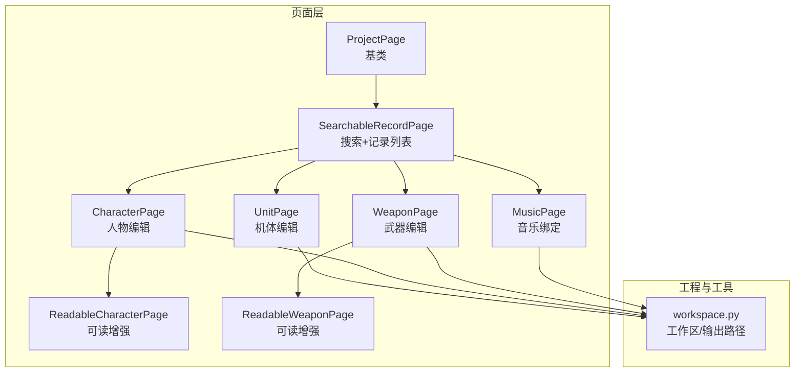
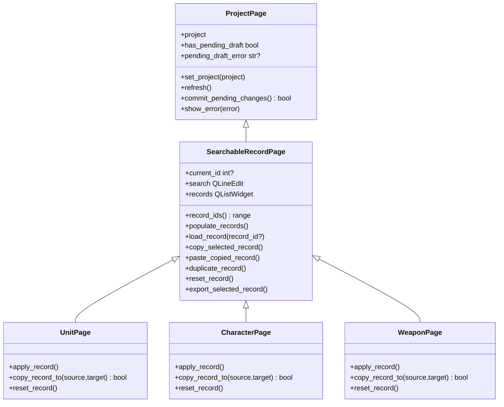
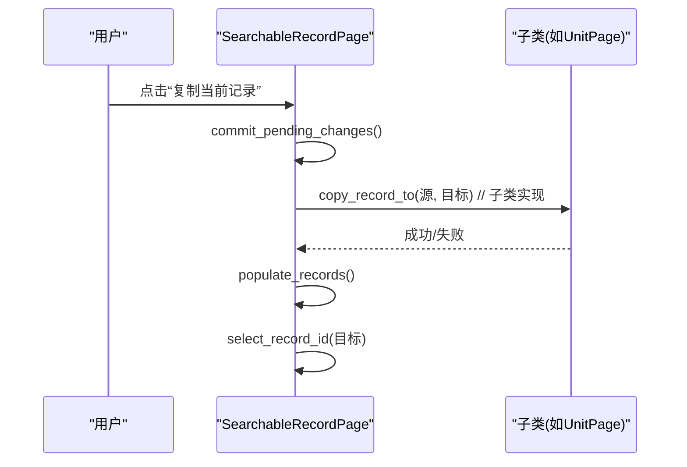
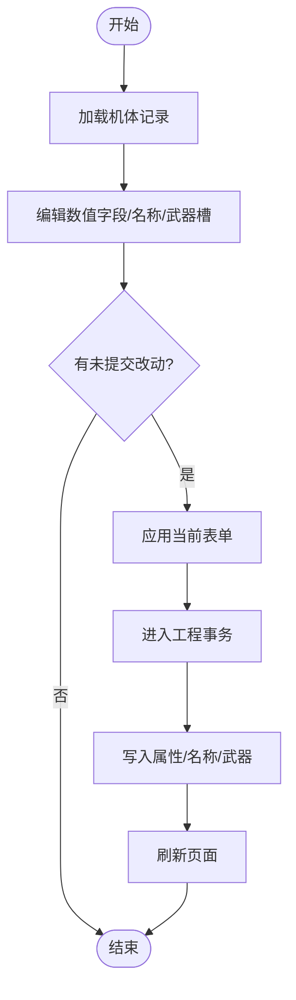
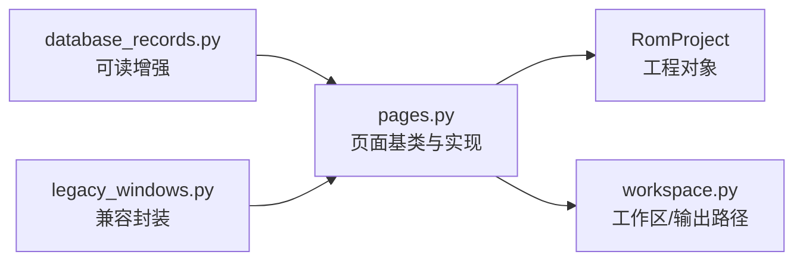

# 页面开发

<cite>
**本文引用的文件**
- [pages.py](file://src/dc_modifier/pages.py)
- [database_records.py](file://src/dc_modifier/database_records.py)
- [legacy_windows.py](file://src/dc_modifier/legacy_windows.py)
- [workspace.py](file://src/dc_modifier/workspace.py)
</cite>

## 目录
1. [简介](#简介)
2. [项目结构](#项目结构)
3. [核心组件](#核心组件)
4. [架构总览](#架构总览)
5. [详细组件分析](#详细组件分析)
6. [依赖关系分析](#依赖关系分析)
7. [性能考虑](#性能考虑)
8. [故障排查指南](#故障排查指南)
9. [结论](#结论)
10. [附录：页面开发示例与最佳实践](#附录页面开发示例与最佳实践)

## 简介
本文件面向DC修改器的页面开发者，系统性说明基于ProjectPage基类的页面设计模式、SearchableRecordPage的搜索与记录管理能力，以及具体页面（UnitPage、CharacterPage、WeaponPage等）如何继承并实现业务逻辑。文档覆盖项目生命周期管理、数据绑定机制、事务处理集成、状态管理、用户交互与错误处理的最佳实践，并提供从简单表单到复杂编辑器的完整开发指引。

## 项目结构
DC修改器页面体系位于src/dc_modifier目录下，核心页面基类与具体页面集中在pages.py；可阅读增强版页面在database_records.py；兼容旧版UI的封装在legacy_windows.py；工作区与输出路径策略在workspace.py。

图表来源
- [pages.py:102-512](file://src/dc_modifier/pages.py#L102-L512)
- [pages.py:514-1600](file://src/dc_modifier/pages.py#L514-L1600)
- [database_records.py:105-536](file://src/dc_modifier/database_records.py#L105-L536)
- [workspace.py:7-43](file://src/dc_modifier/workspace.py#L7-L43)

章节来源
- [pages.py:102-512](file://src/dc_modifier/pages.py#L102-L512)
- [pages.py:514-1600](file://src/dc_modifier/pages.py#L514-L1600)
- [database_records.py:105-536](file://src/dc_modifier/database_records.py#L105-L536)
- [workspace.py:7-43](file://src/dc_modifier/workspace.py#L7-L43)

## 核心组件
- ProjectPage：所有页面的根基类，负责工程对象注入、待提交草稿检测、统一错误提示、刷新钩子。
- SearchableRecordPage：提供“搜索框 + 记录列表 + 上下文菜单”的通用能力，支持复制/粘贴/复制到其他ID/还原/导出等批量操作，内置过滤、选择导航、切换前自动提交草稿。
- UnitPage / CharacterPage / WeaponPage / MusicPage：基于SearchableRecordPage的具体领域页面，分别承载机体、人物、武器、音乐的编辑流程。
- ReadableCharacterPage / ReadableWeaponPage：对基础页面进行“可读增强”，展示指针、共享ID、原始字节、使用统计等诊断信息，便于高级用户定位问题。

章节来源
- [pages.py:102-512](file://src/dc_modifier/pages.py#L102-L512)
- [pages.py:514-1600](file://src/dc_modifier/pages.py#L514-L1600)
- [database_records.py:105-536](file://src/dc_modifier/database_records.py#L105-L536)

## 架构总览
页面采用分层与组合模式：
- 基类抽象出“工程生命周期 + 草稿提交 + 错误提示”的公共行为。
- 搜索型页面将“列表浏览 + 搜索过滤 + 上下文操作”标准化，子类只需关注“当前记录加载/保存/复制/还原”的业务细节。
- 具体页面通过QSplitter左右分栏：左侧为记录列表与搜索，右侧为详情表单与操作按钮。
- 事务处理通过工程对象的事务上下文包装，保证一次操作的原子性与可回滚性。

图表来源
- [pages.py:102-512](file://src/dc_modifier/pages.py#L102-L512)
- [pages.py:514-1600](file://src/dc_modifier/pages.py#L514-L1600)

## 详细组件分析

### ProjectPage：项目生命周期与草稿机制
- 生命周期
  - set_project：注入RomProject并触发refresh，使页面重新渲染。
  - refresh：空实现，供子类重载以更新UI。
- 草稿与提交
  - has_pending_draft：通过是否存在启用的“应用”按钮判断是否有未提交的表单改动。
  - commit_pending_changes：调用页面对象的apply_button.click()完成提交；若工程工作缓冲发生变化且仍有草稿，则再次刷新。
  - pending_draft_error：允许子类返回阻止提交的错误原因。
- 错误处理
  - show_error：统一弹出错误对话框。

章节来源
- [pages.py:102-152](file://src/dc_modifier/pages.py#L102-L152)

### SearchableRecordPage：搜索与记录管理
- 搜索与过滤
  - 支持按名称、十进制或十六进制ID模糊匹配，实时显示可见条数。
  - 上一条/下一条按钮可在可见项中循环导航。
- 记录列表
  - populate_records：根据record_ids()重建列表，保持选中项或优先选择preferred_record_id()。
  - _selection_changed：切换记录时，若存在未提交草稿，先尝试提交再切换；失败则阻止切换并提示。
- 复制/粘贴/复制到其他ID/还原/导出
  - copy_selected_record：复制当前记录的已验证数据（由子类实现语义）。
  - paste_copied_record：将复制的数据写入当前ID。
  - duplicate_record/reset_record/export_selected_record：默认空实现，由子类扩展。
- 共享名称确认
  - confirm_shared_name_edit：当多个记录共用同一名称槽时，改名需二次确认。

图表来源
- [pages.py:243-512](file://src/dc_modifier/pages.py#L243-L512)
- [pages.py:514-880](file://src/dc_modifier/pages.py#L514-L880)

章节来源
- [pages.py:243-512](file://src/dc_modifier/pages.py#L243-L512)

### UnitPage：机体编辑
- 功能要点
  - 字段编辑：基于UNIT_FIELDS动态生成数值输入框，并显示基准ROM原值用于对比。
  - 名称引用与直接修改：支持切换名称引用或在原槽内直接修改名称；共享名称时会二次确认。
  - 武器槽：若ROM支持，提供两格武器下拉选择。
  - 原始记录：提供16字节原始记录的查看与写入入口（高级）。
  - 导出：支持导出为.dcunit数据包。
- 事务与提交
  - apply_record：在事务中批量写入属性、名称引用/文本、武器槽。
  - copy_record_to：复制16字节属性、名称引用与武器槽；若目标为共享记录，会提示影响范围。
  - reset_record：在事务中还原属性、名称与武器槽。

图表来源
- [pages.py:514-880](file://src/dc_modifier/pages.py#L514-L880)

章节来源
- [pages.py:514-880](file://src/dc_modifier/pages.py#L514-L880)

### CharacterPage：人物编辑
- 功能要点
  - 名称引用与直接修改：与UnitPage类似，但针对人物名称表。
  - 战斗音乐绑定：可为该人物设置我方/敌方战斗曲（若ROM支持）。
  - 原始Token显示：只读显示名称Token，便于核对。
- 事务与提交
  - apply_record：在事务中写入名称引用/文本与音乐绑定。
  - copy_record_to：复制名称引用与音乐绑定。
  - reset_record：还原名称与音乐绑定。

章节来源
- [pages.py:882-1214](file://src/dc_modifier/pages.py#L882-L1214)

### WeaponPage：武器编辑
- 功能要点
  - 战斗参数：基于WEAPON_FIELDS动态生成数值输入框，并显示基准ROM原值。
  - 名称引用与直接修改：支持切换名称引用或直接修改名称。
  - 原始记录：显示6字节原始记录。
- 事务与提交
  - apply_record：在事务中写入武器属性、名称引用/文本。
  - copy_record_to：复制武器属性与名称引用；若目标为共享记录，会提示影响范围。
  - reset_record：还原武器属性与名称。

章节来源
- [pages.py:1216-1513](file://src/dc_modifier/pages.py#L1216-L1513)

### ReadableCharacterPage / ReadableWeaponPage：可读增强
- 目的：在不改变原有编辑逻辑的前提下，增加“技术详情”折叠面板，展示指针、共享ID、原始字节、使用统计等信息，帮助高级用户快速定位问题。
- 关键行为
  - 重构详情页布局，插入“技术详情”区域。
  - 武器页额外展示“使用该武器的机体”列表，双击可跳转到对应机体。
  - 人物页支持导出正面/背面头像位图。

章节来源
- [database_records.py:105-536](file://src/dc_modifier/database_records.py#L105-L536)

### 兼容旧版UI的封装
- LegacyUnitDatabasePage：将UnitPage作为控制器嵌入，暴露与原参考编辑器一致的控件别名，保持历史兼容性。
- _LegacyUnitController：复用UnitPage逻辑，仅调整记录标题与首选记录策略。

章节来源
- [legacy_windows.py:300-499](file://src/dc_modifier/legacy_windows.py#L300-L499)

## 依赖关系分析
- 页面与工程
  - 所有页面通过ProjectPage.set_project注入RomProject，并在refresh/load_record中读取工程数据。
  - 具体页面通过工程的编解码接口读写单位/人物/武器/音乐数据。
- 页面内部耦合
  - SearchableRecordPage提供通用列表与交互，具体页面专注领域逻辑，降低重复代码。
  - 可读增强页面通过查找并重组已有控件，避免破坏原有页面结构。
- 外部依赖
  - workspace.py提供工作区根路径与输出路径校验，确保导出文件不会误写至只读参考目录。

图表来源
- [pages.py:102-1600](file://src/dc_modifier/pages.py#L102-L1600)
- [database_records.py:105-536](file://src/dc_modifier/database_records.py#L105-L536)
- [legacy_windows.py:300-499](file://src/dc_modifier/legacy_windows.py#L300-L499)
- [workspace.py:7-43](file://src/dc_modifier/workspace.py#L7-L43)

章节来源
- [pages.py:102-1600](file://src/dc_modifier/pages.py#L102-L1600)
- [database_records.py:105-536](file://src/dc_modifier/database_records.py#L105-L536)
- [legacy_windows.py:300-499](file://src/dc_modifier/legacy_windows.py#L300-L499)
- [workspace.py:7-43](file://src/dc_modifier/workspace.py#L7-L43)

## 性能考虑
- 列表刷新优化
  - SearchableRecordPage在重建列表时临时关闭信号与更新，减少重绘次数，提升大数据量下的响应速度。
- 选择性更新
  - 当现有ID集合与目标一致时，仅更新文本而非重建条目，避免不必要的控件销毁与创建。
- 滚动与选择
  - 使用uniform item sizes与alternating row colors提升渲染效率；切换记录时滚动到可视区域。
- 事务粒度
  - 将相关写入合并到单次事务中，减少中间状态与UI闪烁。

[本节为通用指导，不直接分析具体文件]

## 故障排查指南
- 无法切换记录
  - 现象：切换记录时报错或无效。
  - 可能原因：当前记录存在未提交草稿且提交失败。
  - 处理：检查pending_draft_error，修正表单后重试。
- 共享名称误改
  - 现象：修改名称影响了其他记录。
  - 处理：使用confirm_shared_name_edit二次确认；必要时先复制记录再修改。
- 导出路径非法
  - 现象：导出时报错。
  - 处理：避免输出到references/目录；使用writable_output_path获取安全路径。
- 事务冲突
  - 现象：应用模板或原始记录时报错。
  - 处理：检查是否存在并发修改或冲突；等待会话稳定后再试。

章节来源
- [pages.py:102-152](file://src/dc_modifier/pages.py#L102-L152)
- [pages.py:243-512](file://src/dc_modifier/pages.py#L243-L512)
- [workspace.py:29-43](file://src/dc_modifier/workspace.py#L29-L43)
- [legacy_windows.py:300-318](file://src/dc_modifier/legacy_windows.py#L300-L318)

## 结论
DC修改器的页面体系以ProjectPage与SearchableRecordPage为核心，提供了稳定的生命周期管理、统一的搜索与记录操作、以及可扩展的事务化提交机制。具体页面只需聚焦领域逻辑，即可快速构建高质量编辑器。可读增强页面进一步提升了调试与排障效率。遵循本文的最佳实践，可以高效地新增或改造页面，同时保证一致性、可维护性与用户体验。

[本节为总结，不直接分析具体文件]

## 附录：页面开发示例与最佳实践

### 从零开始：新建一个可搜索的记录页面
- 步骤
  1. 继承SearchableRecordPage。
  2. 实现record_ids()：返回当前工程支持的记录ID范围。
  3. 实现record_text(record_id)：定义列表项显示文本。
  4. 实现load_record(record_id?)：加载记录到表单，并初始化“基准ROM”对照显示。
  5. 实现_update_pending_state()：根据表单变化启用/禁用“应用”按钮，并更新状态提示。
  6. 实现apply_record()：在事务中写入变更，并触发project_changed通知。
  7. 可选：实现copy_record_to/duplicate_record/reset_record/export_selected_record。
- 建议
  - 使用QSplitter左右布局，左侧放records与search_panel，右侧放详情表单与按钮。
  - 对共享名称/共享记录的操作，务必使用confirm_shared_name_edit或同类确认机制。
  - 所有写入操作包裹在project.transaction中，保证原子性与可回滚。

章节来源
- [pages.py:243-512](file://src/dc_modifier/pages.py#L243-L512)
- [pages.py:514-880](file://src/dc_modifier/pages.py#L514-L880)
- [pages.py:882-1214](file://src/dc_modifier/pages.py#L882-L1214)
- [pages.py:1216-1513](file://src/dc_modifier/pages.py#L1216-L1513)

### 复杂编辑器：带“技术详情”的可读增强页面
- 适用场景：需要向高级用户展示指针、共享ID、原始字节、使用统计等诊断信息。
- 做法
  - 复用基础页面（如CharacterPage/WeaponPage），在其详情页插入“技术详情”折叠面板。
  - 将只读字段（如名称Token、原始记录）移入该面板，避免干扰主编辑流程。
  - 对于武器页，增加“使用该武器的机体”列表，支持双击跳转。
- 注意事项
  - 不要破坏原有控件的父子关系与信号连接。
  - 在加载过程中屏蔽无关信号，避免重复计算。

章节来源
- [database_records.py:105-536](file://src/dc_modifier/database_records.py#L105-L536)

### 状态管理与用户交互最佳实践
- 状态同步
  - 任何表单字段变化都应触发_update_pending_state，及时反映“有待提交”的状态。
  - 使用original_values显示基准ROM值，帮助用户识别差异。
- 交互反馈
  - 使用pending_state标签明确告知用户当前状态（如“● 尚未应用：名称引用、音乐”）。
  - 列表项右键菜单提供常用操作（复制/粘贴/复制到其他ID/还原/导出），提升效率。
- 错误处理
  - 统一通过show_error弹窗提示；对共享名称/共享记录的操作，先确认再执行。
  - 导出路径校验，防止误写只读目录。

章节来源
- [pages.py:102-152](file://src/dc_modifier/pages.py#L102-L152)
- [pages.py:243-512](file://src/dc_modifier/pages.py#L243-L512)
- [workspace.py:29-43](file://src/dc_modifier/workspace.py#L29-L43)

### 事务处理集成要点
- 将一组相关的写入操作放入同一个事务块，确保要么全部成功，要么全部回滚。
- 在apply_record/copy_record_to/reset_record等方法中使用事务。
- 提交成功后，刷新页面并emit project_changed，通知上层更新视图。

章节来源
- [pages.py:514-880](file://src/dc_modifier/pages.py#L514-L880)
- [pages.py:882-1214](file://src/dc_modifier/pages.py#L882-L1214)
- [pages.py:1216-1513](file://src/dc_modifier/pages.py#L1216-L1513)