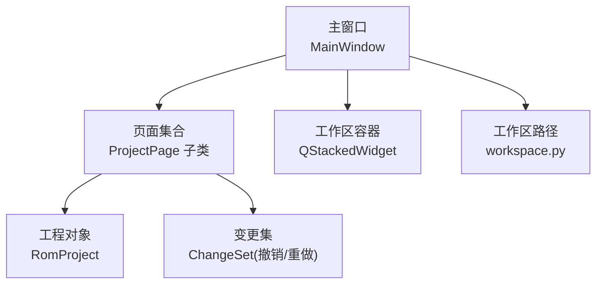
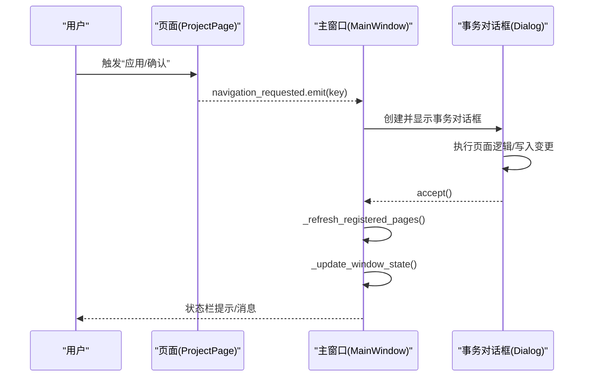
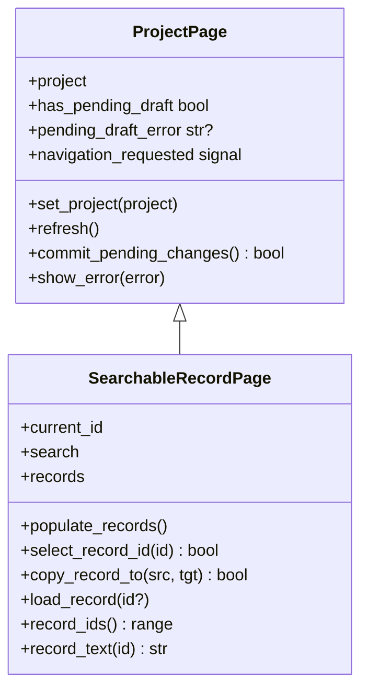
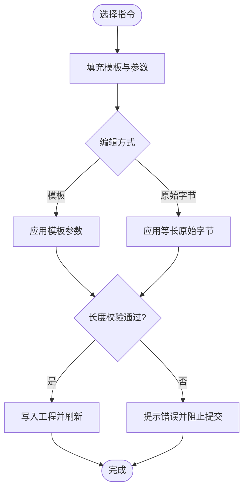
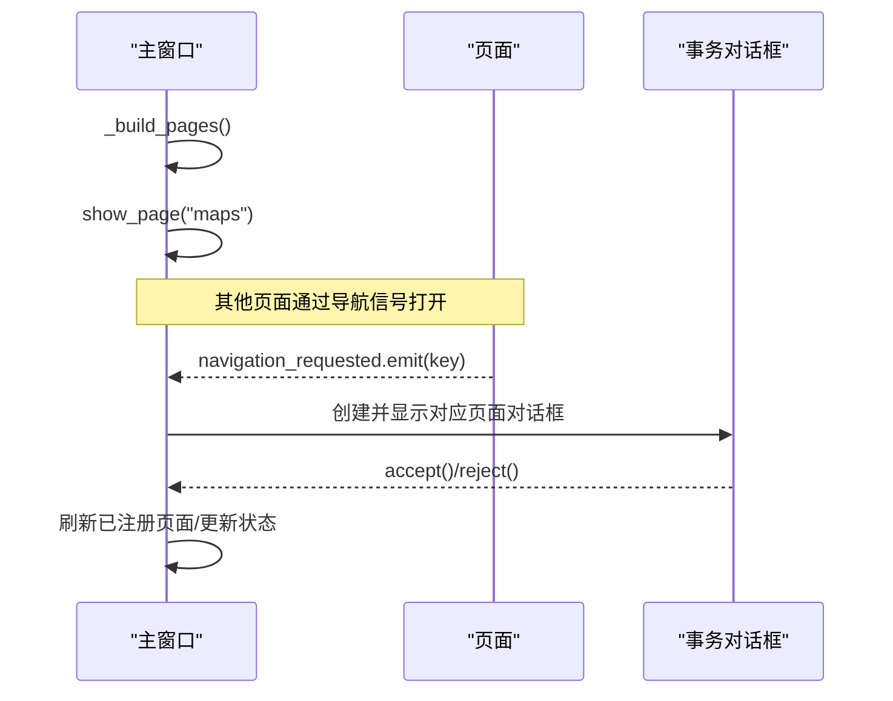
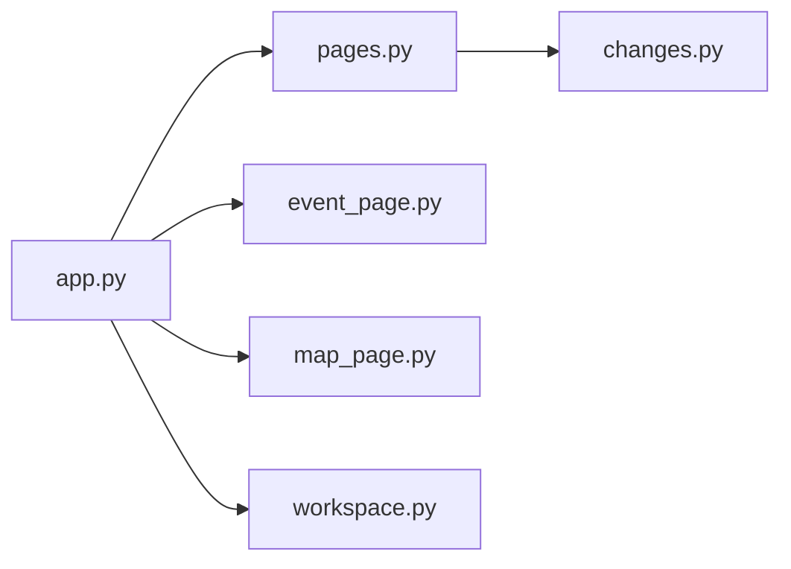

# 页面开发模式

<cite>
**本文引用的文件**
- [pages.py](file://src/dc_modifier/pages.py)
- [app.py](file://src/dc_modifier/app.py)
- [workspace.py](file://src/dc_modifier/workspace.py)
- [event_page.py](file://src/dc_modifier/event_page.py)
- [map_page.py](file://src/dc_modifier/map_page.py)
- [changes.py](file://src/fc_editor/changes.py)
</cite>

## 目录
1. [简介](#简介)
2. [项目结构](#项目结构)
3. [核心组件](#核心组件)
4. [架构总览](#架构总览)
5. [详细组件分析](#详细组件分析)
6. [依赖关系分析](#依赖关系分析)
7. [性能与资源管理](#性能与资源管理)
8. [故障排查指南](#故障排查指南)
9. [结论](#结论)
10. [附录：新建页面类型指南](#附录新建页面类型指南)

## 简介
本文件面向DC修改器中的页面开发，总结一套可复用的标准模式，覆盖页面生命周期、数据同步、错误处理、页面间通信、状态管理与撤销重做、资源清理、以及常见问题的解决方案。文档同时给出“如何创建新页面”的实操指引，包括简单表单页、复杂编辑器页和数据可视化页等典型场景。

## 项目结构
DC修改器的页面体系以统一的基类为核心，通过主窗口进行注册、导航和事务管理；具体页面按功能拆分到独立模块，遵循一致的接口约定，便于扩展与维护。

图表来源
- [app.py:276-365](file://src/dc_modifier/app.py#L276-L365)
- [pages.py:103-152](file://src/dc_modifier/pages.py#L103-L152)
- [workspace.py:7-43](file://src/dc_modifier/workspace.py#L7-L43)
- [changes.py:32-121](file://src/fc_editor/changes.py#L32-L121)

章节来源
- [app.py:276-365](file://src/dc_modifier/app.py#L276-L365)
- [workspace.py:7-43](file://src/dc_modifier/workspace.py#L7-L43)

## 核心组件
- 页面基类与通用能力
  - ProjectPage：提供项目注入、刷新、待提交草稿检测、统一错误展示、导航信号等。
  - SearchableRecordPage：提供记录列表、搜索过滤、复制/粘贴/还原/导出等通用交互。
- 主窗口与导航
  - MainWindow：注册页面、构建菜单/动作、打开工具对话框、统一事务包装、未保存变更提示、撤销/重做入口。
- 变更与撤销重做
  - ChangeSet：基于不可变基准ROM的有序补丁操作，支持冲突检测、撤销、重做、差异计算。
- 工作区与输出路径
  - workspace：定位根目录、默认ROM、只读保护（references）、默认导出路径。

章节来源
- [pages.py:103-152](file://src/dc_modifier/pages.py#L103-L152)
- [pages.py:243-511](file://src/dc_modifier/pages.py#L243-L511)
- [app.py:276-365](file://src/dc_modifier/app.py#L276-L365)
- [changes.py:32-121](file://src/fc_editor/changes.py#L32-L121)
- [workspace.py:7-43](file://src/dc_modifier/workspace.py#L7-L43)

## 架构总览
页面通过信号槽与主窗口协作：页面发出导航请求，主窗口决定打开内嵌页面或工具对话框；所有编辑在事务对话框中完成，确认后刷新已注册页面并更新窗口状态。

图表来源
- [app.py:583-652](file://src/dc_modifier/app.py#L583-L652)
- [app.py:494-509](file://src/dc_modifier/app.py#L494-L509)
- [pages.py:103-152](file://src/dc_modifier/pages.py#L103-L152)

## 详细组件分析

### 页面基类与记录型页面
- ProjectPage
  - 生命周期：set_project → refresh；commit_pending_changes 用于在切换/关闭前强制提交草稿。
  - 待提交检测：has_pending_draft 基于是否存在可用的“应用”按钮；pending_draft_error 返回无法提交的说明。
  - 错误处理：show_error 统一弹出错误框。
- SearchableRecordPage
  - 记录列表：records 列表控件，支持上下文菜单（复制/粘贴/复制到其他ID/还原/导出）。
  - 选择与加载：_selection_changed 在切换时先尝试提交旧记录的草稿，再加载新记录。
  - 搜索与导航：search 文本变化触发过滤；previous/next 按钮在可见项间跳转。
  - 扩展点：record_ids、load_record、copy_record_to、supports_record_export 等由子类实现。

图表来源
- [pages.py:103-152](file://src/dc_modifier/pages.py#L103-L152)
- [pages.py:243-511](file://src/dc_modifier/pages.py#L243-L511)

章节来源
- [pages.py:103-152](file://src/dc_modifier/pages.py#L103-L152)
- [pages.py:243-511](file://src/dc_modifier/pages.py#L243-L511)

### 事件编辑器页面（复杂编辑器）
- 设计要点
  - 模板参数与原始字节双通道编辑：模板保证语义正确，原始字节保证无损。
  - 等长约束：始终维持原指令长度，避免移动脚本指针。
  - 过滤器：章节、阶段、类型、关键词组合筛选。
  - 草稿与冲突：切换/筛选前自动提交草稿；若存在非法输入则阻止提交。
- 关键流程
  - 选择指令 → 填充模板/参数 → 编辑 → 应用模板/原始字节 → 刷新表格。

图表来源
- [event_page.py:238-249](file://src/dc_modifier/event_page.py#L238-L249)
- [event_page.py:566-653](file://src/dc_modifier/event_page.py#L566-L653)
- [event_page.py:655-700](file://src/dc_modifier/event_page.py#L655-L700)

章节来源
- [event_page.py:66-228](file://src/dc_modifier/event_page.py#L66-L228)
- [event_page.py:324-454](file://src/dc_modifier/event_page.py#L324-L454)
- [event_page.py:456-700](file://src/dc_modifier/event_page.py#L456-L700)

### 地图页面（数据可视化）
- 特点
  - 自定义渲染：地形颜色、单位图标、调色板映射。
  - 交互：坐标变化通知主窗口状态栏；画布事件驱动编辑。
  - 与页面基类集成：作为内嵌页面参与统一生命周期与事务管理。
- 与主窗口的协作
  - 坐标变化信号 → 状态栏X/Y坐标更新。
  - 草稿状态变化 → 窗口标题/保存提示更新。

章节来源
- [map_page.py:1-200](file://src/dc_modifier/map_page.py#L1-L200)
- [app.py:328-332](file://src/dc_modifier/app.py#L328-L332)

### 主窗口与页面注册
- 页面注册与导航
  - _build_pages 集中注册页面键与实例，建立索引与工作区映射。
  - show_page/_show_page_by_index 负责切换当前页面并更新侧边导航。
- 扩展功能对话框
  - _create_extension_dialog 将特定页面放入事务对话框，支持“确定/取消”与导航回跳。
- 全局状态
  - has_unsaved_changes 综合工程工作区、资源分配、地图草稿判断是否保存。
  - _confirm_discard 在未保存时提示放弃。

图表来源
- [app.py:342-365](file://src/dc_modifier/app.py#L342-L365)
- [app.py:583-652](file://src/dc_modifier/app.py#L583-L652)
- [app.py:731-754](file://src/dc_modifier/app.py#L731-L754)

章节来源
- [app.py:342-365](file://src/dc_modifier/app.py#L342-L365)
- [app.py:583-652](file://src/dc_modifier/app.py#L583-L652)
- [app.py:731-754](file://src/dc_modifier/app.py#L731-L754)

## 依赖关系分析
- 页面层依赖
  - pages.py 定义基类与通用页面；event_page.py、map_page.py 等实现具体业务。
  - app.py 聚合页面、菜单、动作与对话框，承担编排职责。
- 数据与持久化
  - changes.py 提供撤销/重做与冲突检测，被上层事务机制使用。
  - workspace.py 提供路径与只读保护，防止误写参考目录。
- 外部库
  - PySide6 提供UI框架；fc_rom_editor_core 提供工程与ROM访问。

图表来源
- [app.py:35-50](file://src/dc_modifier/app.py#L35-L50)
- [pages.py:103-152](file://src/dc_modifier/pages.py#L103-L152)
- [changes.py:32-121](file://src/fc_editor/changes.py#L32-L121)
- [workspace.py:7-43](file://src/dc_modifier/workspace.py#L7-L43)

章节来源
- [app.py:35-50](file://src/dc_modifier/app.py#L35-L50)
- [pages.py:103-152](file://src/dc_modifier/pages.py#L103-L152)
- [changes.py:32-121](file://src/fc_editor/changes.py#L32-L121)
- [workspace.py:7-43](file://src/dc_modifier/workspace.py#L7-L43)

## 性能与资源管理
- 列表与表格优化
  - 批量更新：设置 updatesEnabled(False)/True 包裹大量条目写入，减少重绘。
  - 信号屏蔽：blockSignals(True)/False 避免频繁回调导致卡顿。
- 内存与对象
  - 页面销毁：对话框 exec 结束后调用 deleteLater 释放资源。
  - 只读保护：writable_output_path 拒绝写入 references 目录，避免误改参考数据。
- 渲染与图像
  - 地图图标按需渲染，避免全量绘制；调色板与像素映射缓存于常量。

章节来源
- [pages.py:396-434](file://src/dc_modifier/pages.py#L396-L434)
- [event_page.py:426-454](file://src/dc_modifier/event_page.py#L426-L454)
- [app.py:494-509](file://src/dc_modifier/app.py#L494-L509)
- [workspace.py:37-43](file://src/dc_modifier/workspace.py#L37-L43)
- [map_page.py:106-156](file://src/dc_modifier/map_page.py#L106-L156)

## 故障排查指南
- 常见问题
  - 切换记录/筛选时报错：通常因当前有未提交的草稿或输入非法。检查 pending_draft_error 并修正后再试。
  - 原始字节长度不符：事件编辑器要求等长替换，确保粘贴/输入的字节数与原指令一致。
  - 写入冲突：ChangeSet 检测到重叠或预期值不匹配会抛出冲突错误，需调整写入范围或预期值。
  - 输出路径非法：writable_output_path 禁止写入 references 目录，请改用 output/exports 或其他可写路径。
- 调试技巧
  - 利用 status 消息与 pending banner 快速定位问题。
  - 在事件编辑器中开启“高级”面板查看原始字节与地址，辅助定位异常。
  - 使用“完整检查”（F7）验证工程一致性。

章节来源
- [event_page.py:566-653](file://src/dc_modifier/event_page.py#L566-L653)
- [changes.py:62-108](file://src/fc_editor/changes.py#L62-L108)
- [workspace.py:37-43](file://src/dc_modifier/workspace.py#L37-L43)
- [app.py:427-428](file://src/dc_modifier/app.py#L427-L428)

## 结论
DC修改器的页面体系以统一基类与主窗口编排为核心，结合事务对话框与变更集，实现了稳定的生命周期管理、可靠的数据同步与完善的撤销重做能力。通过严格的等长约束、只读保护与冲突检测，保障了ROM数据的完整性与安全性。遵循本文的模式与检查清单，可高效扩展新的页面类型并保持整体一致性。

## 附录：新建页面类型指南

### 新建页面的最小实现步骤
- 继承 ProjectPage 或 SearchableRecordPage
  - 实现 set_project/refresh 以响应工程变化。
  - 如需记录列表，实现 record_ids/load_record/copy_record_to 等扩展点。
- 绑定用户交互
  - 为输入控件绑定 valueChanged/textChanged 等信号，调用 _update_pending_state 或等效方法更新待提交状态。
  - 提供“应用”按钮，并在 commit_pending_changes 中写入工程。
- 错误处理
  - 使用 show_error 统一提示；必要时设置 pending_draft_error 阻止提交。
- 与主窗口集成
  - 在 app._build_pages 中注册页面键与实例。
  - 如需要导航到其他页面，使用 navigation_requested 信号。

章节来源
- [pages.py:103-152](file://src/dc_modifier/pages.py#L103-L152)
- [pages.py:243-511](file://src/dc_modifier/pages.py#L243-L511)
- [app.py:342-365](file://src/dc_modifier/app.py#L342-L365)

### 简单表单页面（例如数值配置）
- 使用 QFormLayout/QSpinBox/QLineEdit 构建表单。
- 每个字段变更时比较与工程当前值，启用/禁用“应用”按钮。
- 提交时调用 project.set_* 写入，并刷新界面。

章节来源
- [pages.py:567-588](file://src/dc_modifier/pages.py#L567-L588)
- [pages.py:732-757](file://src/dc_modifier/pages.py#L732-L757)

### 复杂编辑器页面（例如事件/剧情）
- 采用模板+原始字节双通道编辑，保证语义与无损。
- 严格等长约束，任何替换必须保持原长度。
- 提供过滤器与搜索，提升大数据量下的可用性。
- 切换/筛选前自动提交草稿，避免状态不一致。

章节来源
- [event_page.py:238-249](file://src/dc_modifier/event_page.py#L238-L249)
- [event_page.py:566-653](file://src/dc_modifier/event_page.py#L566-L653)

### 数据可视化页面（例如地图）
- 自定义渲染：按需绘制图块/图标，使用调色板映射。
- 交互反馈：坐标变化、选中状态变化及时更新状态栏与草稿标记。
- 性能优化：批量更新、信号屏蔽、延迟渲染。

章节来源
- [map_page.py:106-156](file://src/dc_modifier/map_page.py#L106-L156)
- [app.py:328-332](file://src/dc_modifier/app.py#L328-L332)

### 页面开发检查清单
- 必需方法
  - 实现 set_project/refresh；如有表单，实现待提交检测与提交逻辑。
  - 对可能失败的操作提供 show_error 与 pending_draft_error。
- 用户交互
  - 输入控件变更应即时更新待提交状态；提供明确的“应用/还原”按钮。
  - 列表/表格支持搜索、复制/粘贴、上下文菜单。
- 错误边界
  - 所有写入前进行合法性校验（范围、长度、冲突）。
  - 使用事务对话框封装编辑，确保可撤销。
- 资源管理
  - 批量更新时屏蔽信号与暂停重绘；对话框关闭后释放资源。
  - 输出路径使用 writable_output_path 保护参考目录。

章节来源
- [pages.py:103-152](file://src/dc_modifier/pages.py#L103-L152)
- [pages.py:243-511](file://src/dc_modifier/pages.py#L243-L511)
- [event_page.py:566-653](file://src/dc_modifier/event_page.py#L566-L653)
- [changes.py:62-108](file://src/fc_editor/changes.py#L62-L108)
- [workspace.py:37-43](file://src/dc_modifier/workspace.py#L37-L43)