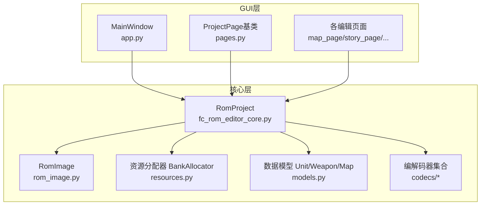
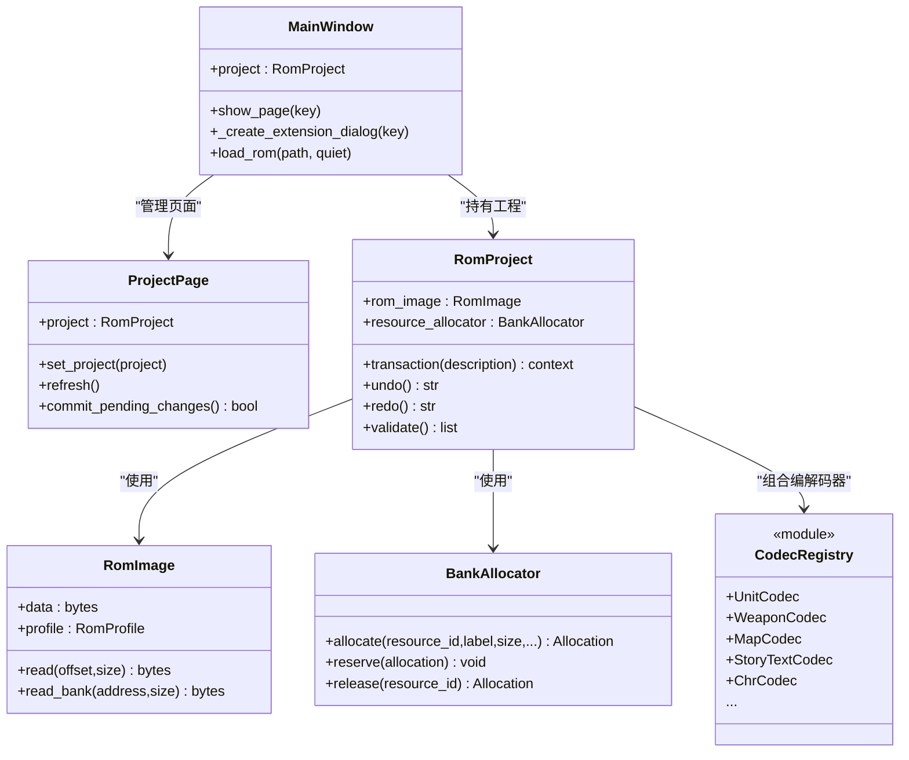
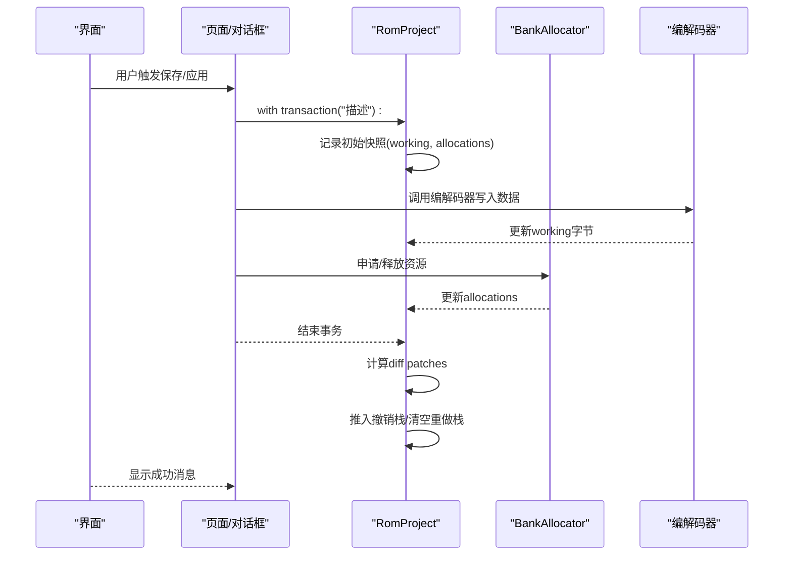
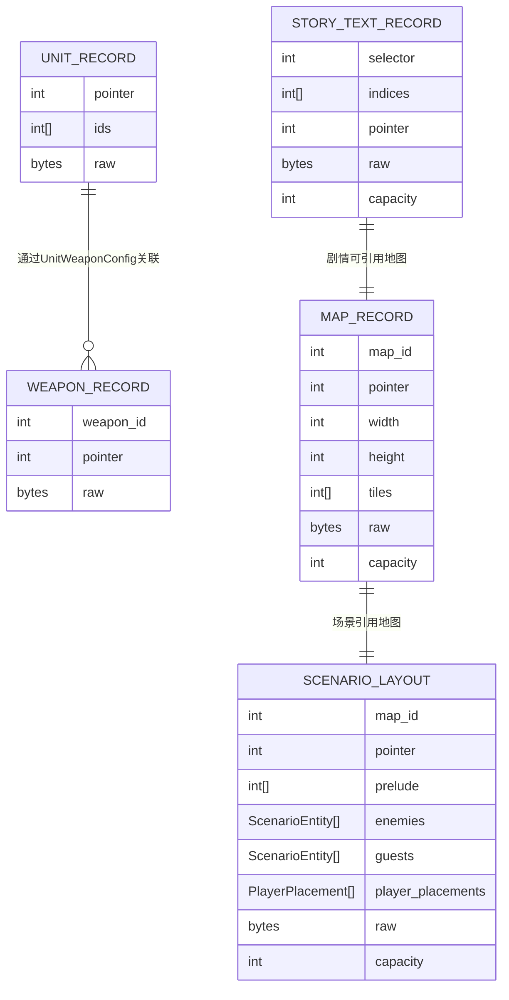
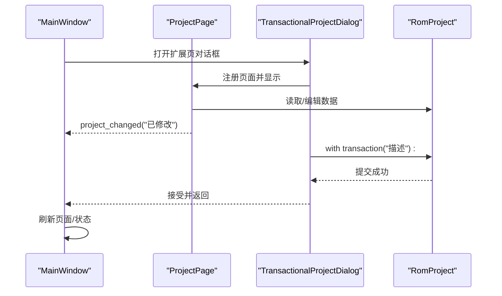
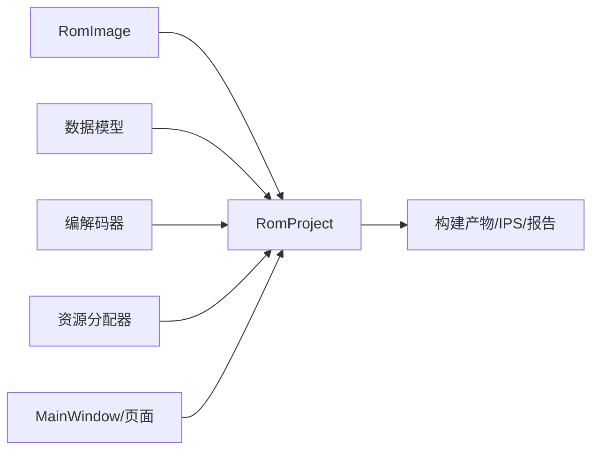
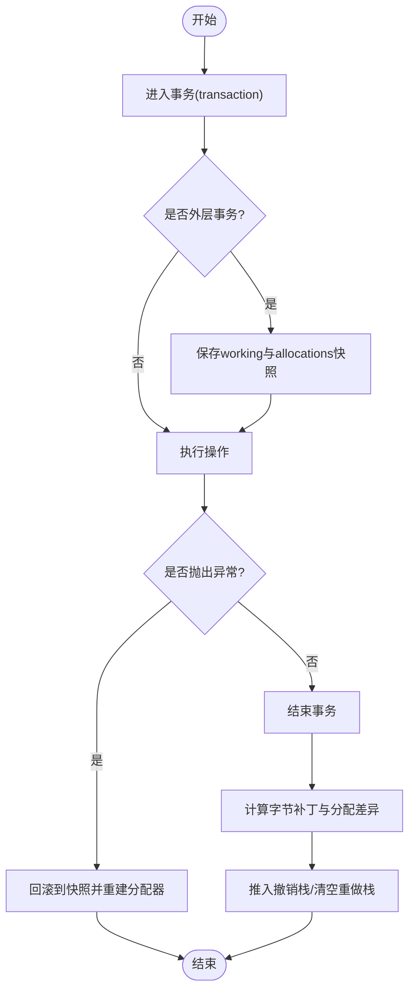

# 开发者指南

<cite>
**本文引用的文件**
- [fc_rom_editor_core.py](file://src/fc_rom_editor_core.py)
- [rom_image.py](file://src/fc_editor/rom_image.py)
- [models.py](file://src/fc_editor/models.py)
- [resources.py](file://src/fc_editor/resources.py)
- [app.py](file://src/dc_modifier/app.py)
- [pages.py](file://src/dc_modifier/pages.py)
- [__init__.py（编解码器导出）](file://src/fc_editor/codecs/__init__.py)
</cite>

## 目录
1. [简介](#简介)
2. [项目结构](#项目结构)
3. [核心组件](#核心组件)
4. [架构总览](#架构总览)
5. [详细组件分析](#详细组件分析)
6. [依赖关系分析](#依赖关系分析)
7. [性能考虑](#性能考虑)
8. [故障排查指南](#故障排查指南)
9. [结论](#结论)
10. [附录](#附录)

## 简介
本指南面向DC修改器的开发者，系统阐述其分层架构、MVC组织与模块化原则，深入解析RomProject、RomImage、编解码器系统与资源分配器等核心组件，说明数据模型（UnitRecord、WeaponRecord、MapRecord等）及实体关系，详述事务处理机制（撤销/重做、快照管理、并发控制），并提供GUI开发指南（页面、对话框、事件）、测试策略（单元/集成/GUI）与扩展开发指南（新增编解码器、页面类型与功能模块）。

## 项目结构
项目采用“核心库 + GUI应用”的分层组织：
- 核心库位于 src/fc_editor 与 src/fc_rom_editor_core.py，负责ROM镜像、数据模型、编解码、资源分配、工程构建与校验。
- GUI应用位于 src/dc_modifier，基于PySide6实现主窗口、页面与对话框，封装用户交互与事务提交。
- 工具与脚本位于 tools，用于构建、审计与验证。
- 参考与文档位于 references 与 docs。

**图表来源**
- [app.py:276-364](file://src/dc_modifier/app.py#L276-L364)
- [pages.py:103-149](file://src/dc_modifier/pages.py#L103-L149)
- [fc_rom_editor_core.py:463-618](file://src/fc_rom_editor_core.py#L463-L618)
- [rom_image.py:50-125](file://src/fc_editor/rom_image.py#L50-L125)
- [resources.py:280-413](file://src/fc_editor/resources.py#L280-L413)
- [models.py:165-426](file://src/fc_editor/models.py#L165-L426)

**章节来源**
- [app.py:276-364](file://src/dc_modifier/app.py#L276-L364)
- [pages.py:103-149](file://src/dc_modifier/pages.py#L103-L149)
- [fc_rom_editor_core.py:463-618](file://src/fc_rom_editor_core.py#L463-L618)
- [rom_image.py:50-125](file://src/fc_editor/rom_image.py#L50-L125)
- [resources.py:280-413](file://src/fc_editor/resources.py#L280-L413)
- [models.py:165-426](file://src/fc_editor/models.py#L165-L426)

## 核心组件
- RomImage：不可变ROM字节容器，提供iNES头校验、Mapper检测、地址到文件偏移转换与安全读取。
- RomProject：工程级入口，组合RomImage、各类编解码器、资源分配器，提供事务化编辑、撤销/重做、构建产物输出。
- 编解码器系统：按资源域划分（机体、武器、地图、剧情文本、音乐、CHR等），统一读写ROM特定区域。
- 资源分配器：在配置声明的可用PRG区进行确定性分配，支持对齐、单Bank约束、零填充检查与冲突检测。
- 数据模型：以不可变记录对象表达ROM中的实体（UnitRecord、WeaponRecord、MapRecord等），提供字段级编解码与替换方法。

**章节来源**
- [rom_image.py:50-125](file://src/fc_editor/rom_image.py#L50-L125)
- [fc_rom_editor_core.py:463-618](file://src/fc_rom_editor_core.py#L463-L618)
- [__init__.py（编解码器导出）:1-47](file://src/fc_editor/codecs/__init__.py#L1-L47)
- [resources.py:280-413](file://src/fc_editor/resources.py#L280-L413)
- [models.py:165-426](file://src/fc_editor/models.py#L165-L426)

## 架构总览
整体采用分层架构与MVC模式：
- 表现层（View）：PySide6主窗口与各页面，负责展示与用户输入。
- 控制器（Controller）：MainWindow与TransactionalProjectDialog协调页面与工程操作，封装事务边界。
- 模型（Model）：RomProject及其内部组件（RomImage、编解码器、资源分配器、数据模型）承载状态与业务逻辑。

**图表来源**
- [app.py:276-364](file://src/dc_modifier/app.py#L276-L364)
- [pages.py:103-149](file://src/dc_modifier/pages.py#L103-L149)
- [fc_rom_editor_core.py:463-618](file://src/fc_rom_editor_core.py#L463-L618)
- [rom_image.py:50-125](file://src/fc_editor/rom_image.py#L50-L125)
- [resources.py:280-413](file://src/fc_editor/resources.py#L280-L413)
- [__init__.py（编解码器导出）:1-47](file://src/fc_editor/codecs/__init__.py#L1-L47)

## 详细组件分析

### RomProject：工程与事务中枢
- 职责：加载ROM、初始化编解码器、维护工作副本与原始副本、执行事务化编辑、生成IPS/ROM/报告。
- 事务机制：通过上下文管理器 transaction 包裹一组修改；外层首次进入时创建快照（working字节与资源分配快照），异常时回滚；成功退出后计算差异并推入撤销栈，清空重做栈。
- 撤销/重做：EditHistoryEntry记录描述、字节补丁与分配变化；undo/redo通过应用before/after补丁恢复或重放。
- 构建产物：BuildArtifacts包含ROM、IPS、工程、报告路径与变更统计。

**图表来源**
- [fc_rom_editor_core.py:692-785](file://src/fc_rom_editor_core.py#L692-L785)

**章节来源**
- [fc_rom_editor_core.py:112-141](file://src/fc_rom_editor_core.py#L112-L141)
- [fc_rom_editor_core.py:463-618](file://src/fc_rom_editor_core.py#L463-L618)
- [fc_rom_editor_core.py:692-785](file://src/fc_rom_editor_core.py#L692-L785)

### RomImage：ROM镜像与地址映射
- 职责：校验iNES头、检测Mapper、计算SHA-256、安全读取PRG/CHR区域。
- 关键能力：BankAddress将CPU地址映射到文件偏移；read/read_bank确保不越界且不跨Bank。

**章节来源**
- [rom_image.py:16-125](file://src/fc_editor/rom_image.py#L16-L125)

### 编解码器系统：按资源域解耦
- 组织方式：每个资源域一个Codec类（如UnitCodec、WeaponCodec、MapCodec、StoryTextCodec、ChrCodec等），由RomProject按需实例化。
- 扩展点：新增资源域只需实现Codec并在RomProject中注册，同时可在ResourceGraph中声明节点以便容量规划与保护。

**章节来源**
- [__init__.py（编解码器导出）:1-47](file://src/fc_editor/codecs/__init__.py#L1-L47)
- [fc_rom_editor_core.py:15-36](file://src/fc_rom_editor_core.py#L15-L36)

### 资源分配器：确定性PRG空间管理
- 职责：在配置声明的free PRG区域中进行首适配分配，支持对齐、单Bank限制、零填充检查与冲突检测。
- 关键API：allocate/reserve/release/allocation；capacity/used/available属性便于容量监控。
- 安全性：严格校验资源ID格式、标签非空、大小与对齐合法、范围在可用区内且不与已有分配重叠。

**章节来源**
- [resources.py:280-413](file://src/fc_editor/resources.py#L280-L413)

### 数据模型：不可变记录与字段规范
- FieldSpec/WeaponFieldSpec：定义字段偏移、宽度、取值范围、掩码/位移、显示缩放与选择集，提供decode/encode_into。
- 记录对象：UnitRecord、WeaponRecord、MapRecord、ScenarioLayout、StoryTextRecord等均为不可变数据类，提供with_field/tile_at等方法进行安全更新。
- 实体关系：
  - UnitRecord 关联 WeaponRecord（通过UnitWeaponConfig与UnitWeaponCodec）。
  - MapRecord 与 ScenarioLayout 共同描述地图与部署。
  - StoryTextRecord 存储剧情文本索引与指针。

**图表来源**
- [models.py:165-426](file://src/fc_editor/models.py#L165-L426)

**章节来源**
- [models.py:13-163](file://src/fc_editor/models.py#L13-L163)
- [models.py:165-426](file://src/fc_editor/models.py#L165-L426)

### GUI开发指南：页面、对话框与事件
- 主窗口：MainWindow负责菜单、动作、页面注册与状态栏；通过_add_page注册页面，show_page切换。
- 页面基类：ProjectPage提供project_changed信号、pending草稿状态、commit_pending_changes统一提交。
- 对话框：TransactionalProjectDialog封装事务边界，页面在其中编辑，确认后刷新并提示。
- 事件流：页面发出project_changed通知主窗口更新状态；导航请求navigation_requested用于跳转扩展页。

**图表来源**
- [app.py:276-364](file://src/dc_modifier/app.py#L276-L364)
- [pages.py:103-149](file://src/dc_modifier/pages.py#L103-L149)
- [fc_rom_editor_core.py:714-744](file://src/fc_rom_editor_core.py#L714-L744)

**章节来源**
- [app.py:276-364](file://src/dc_modifier/app.py#L276-L364)
- [pages.py:103-149](file://src/dc_modifier/pages.py#L103-L149)

## 依赖关系分析
- 低耦合：编解码器仅依赖RomImage与常量/模型；RomProject聚合编解码器与资源分配器，避免循环依赖。
- 明确接口：ResourceGraph从RomProfile构建资源节点，供上层页面与构建流程使用。
- 外部依赖：PySide6用于GUI；标准库用于哈希、JSON、临时文件原子写入等。

**图表来源**
- [fc_rom_editor_core.py:463-618](file://src/fc_rom_editor_core.py#L463-L618)
- [resources.py:80-260](file://src/fc_editor/resources.py#L80-L260)
- [rom_image.py:50-125](file://src/fc_editor/rom_image.py#L50-L125)

**章节来源**
- [fc_rom_editor_core.py:463-618](file://src/fc_rom_editor_core.py#L463-L618)
- [resources.py:80-260](file://src/fc_editor/resources.py#L80-L260)
- [rom_image.py:50-125](file://src/fc_editor/rom_image.py#L50-L125)

## 性能考虑
- 事务粒度：尽量将相关修改放入同一事务，减少快照与diff开销。
- 资源分配：优先使用单Bank分配以减少碎片；必要时使用连续分配并确保对齐。
- 编解码器：批量读取/写入时复用缓冲；避免频繁小写。
- GUI：页面刷新仅在必要时触发；长耗时任务放在后台线程并回调更新。

[本节为通用指导，不直接分析具体文件]

## 故障排查指南
- ROM校验失败：检查iNES头、Mapper与基准SHA-256是否匹配。
- 分配冲突：确认资源ID唯一、范围在free PRG区、未与其他分配重叠。
- 事务异常：查看transaction内异常堆栈；确认未跨事务提交；必要时回滚并重试。
- IPS生成失败：确保原始与修改ROM大小一致。

**章节来源**
- [rom_image.py:79-113](file://src/fc_editor/rom_image.py#L79-L113)
- [resources.py:334-413](file://src/fc_editor/resources.py#L334-L413)
- [fc_rom_editor_core.py:386-433](file://src/fc_rom_editor_core.py#L386-L433)
- [fc_rom_editor_core.py:714-744](file://src/fc_rom_editor_core.py#L714-L744)

## 结论
DC修改器通过清晰的分层与MVC组织，将ROM解析、数据建模、编解码与资源分配解耦，配合事务化编辑与撤销/重做，提供了安全、可扩展的工程化修改体验。遵循本指南可实现稳定的页面开发、可靠的测试覆盖与平滑的功能扩展。

## 附录

### 事务流程图（撤销/重做）

**图表来源**
- [fc_rom_editor_core.py:714-744](file://src/fc_rom_editor_core.py#L714-L744)
- [fc_rom_editor_core.py:692-712](file://src/fc_rom_editor_core.py#L692-L712)

### 扩展开发指南
- 新增编解码器：
  - 在 codecs 下实现Codec类，提供读/写ROM特定区域的方法。
  - 在 fc_rom_editor_core.py 导入并注入到RomProject实例化流程。
  - 如需参与容量规划，在 ResourceGraph.from_profile 中添加节点。
- 新增页面类型：
  - 继承 ProjectPage，实现 set_project/refresh/commit_pending_changes。
  - 在 MainWindow._build_pages 中注册页面，或在 _create_extension_dialog 中注册扩展页。
- 新增功能模块：
  - 通过 TransactionalProjectDialog 包装事务，确保错误回滚与撤销/重做一致性。
  - 使用 BankAllocator.allocate 申请空间，遵守对齐与单Bank约束。

**章节来源**
- [fc_rom_editor_core.py:15-36](file://src/fc_rom_editor_core.py#L15-L36)
- [resources.py:80-260](file://src/fc_editor/resources.py#L80-L260)
- [app.py:583-614](file://src/dc_modifier/app.py#L583-L614)
- [pages.py:103-149](file://src/dc_modifier/pages.py#L103-L149)

### 测试策略
- 单元测试：
  - 针对 FieldSpec/WeaponFieldSpec 的 encode/decode 边界值与掩码位移。
  - 针对 BankAllocator 的对齐、冲突、零填充检查与容量耗尽场景。
  - 针对 RomImage 的越界读取与跨Bank读取防护。
- 集成测试：
  - 端到端事务流程：打开工程→多步修改→撤销/重做→构建ROM/IPS→校验SHA与差异。
  - 编解码器链路：读取→修改→写回→再读取一致性。
- GUI测试：
  - 页面生命周期：创建→设置工程→刷新→提交草稿→关闭。
  - 对话框事务：打开扩展页→修改→取消/确定→状态同步。
  - 快捷键与菜单：打开/保存工程、撤销/重做、构建等动作可用性。

[本节为通用指导，不直接分析具体文件]