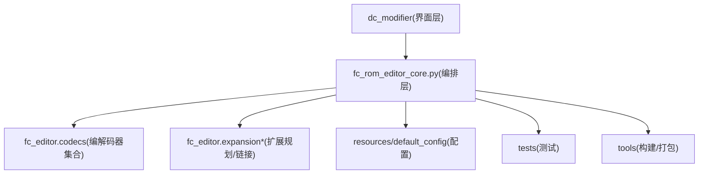
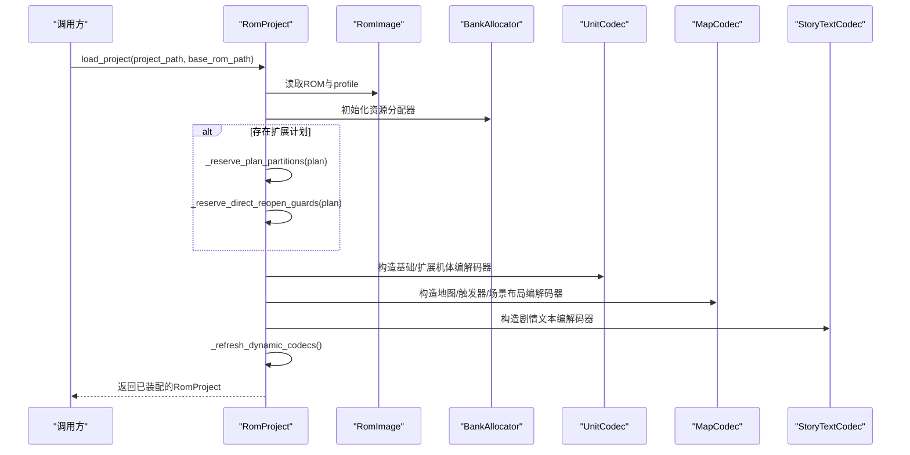
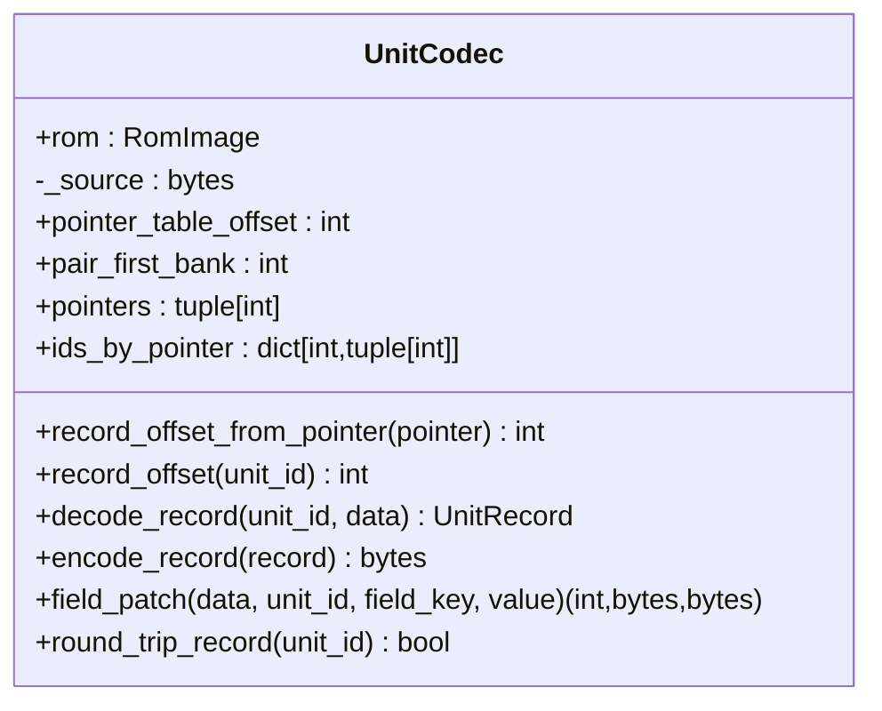
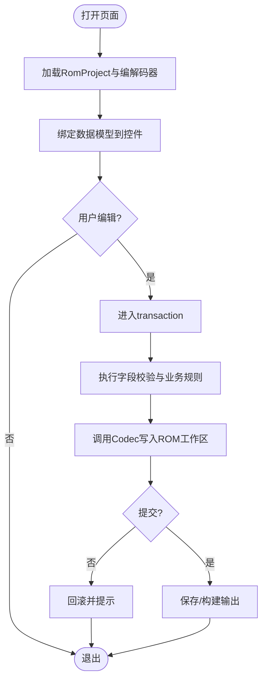
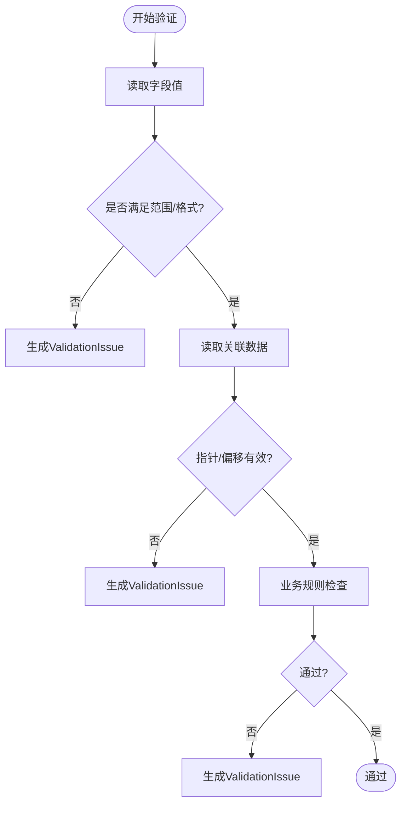
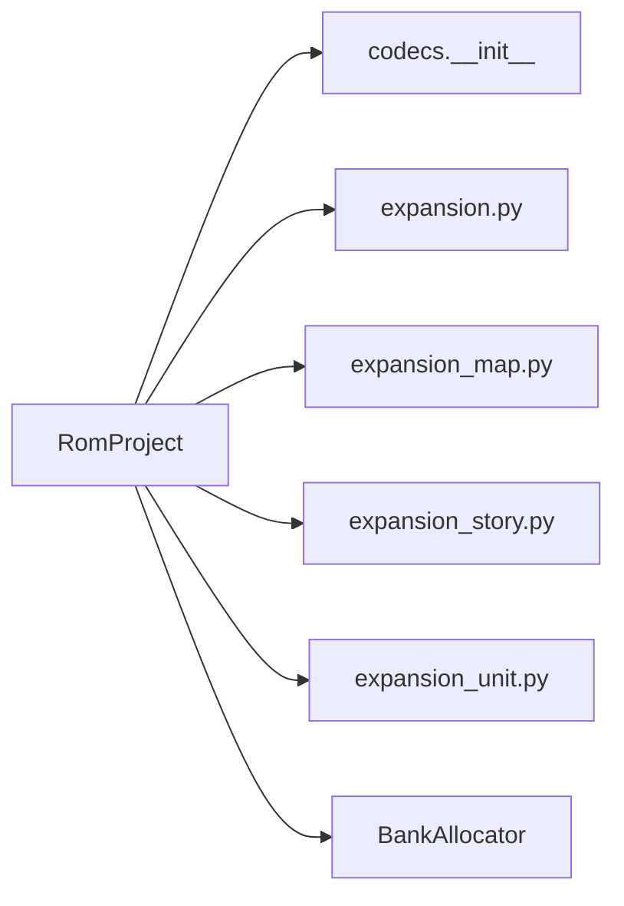

# 扩展开发指南

<cite>
**本文引用的文件**
- [src/fc_rom_editor_core.py](file://src/fc_rom_editor_core.py)
- [src/fc_editor/codecs/__init__.py](file://src/fc_editor/codecs/__init__.py)
- [src/fc_editor/codecs/unit.py](file://src/fc_editor/codecs/unit.py)
- [src/fc_editor/expansion.py](file://src/fc_editor/expansion.py)
- [src/fc_editor/expansion_map.py](file://src/fc_editor/expansion_map.py)
- [src/fc_editor/expansion_story.py](file://src/fc_editor/expansion_story.py)
- [src/fc_editor/expansion_unit.py](file://src/fc_editor/expansion_unit.py)
- [AGENTS.md](file://AGENTS.md)
</cite>

## 目录
1. [简介](#简介)
2. [项目结构](#项目结构)
3. [核心组件](#核心组件)
4. [架构总览](#架构总览)
5. [详细组件分析](#详细组件分析)
6. [依赖关系分析](#依赖关系分析)
7. [性能考虑](#性能考虑)
8. [故障排查指南](#故障排查指南)
9. [结论](#结论)
10. [附录](#附录)

## 简介
本指南面向希望为“DC修改器”进行扩展开发的工程师，目标是系统化说明如何：
- 添加新的编解码器（Codec），包括接口约定、数据格式定义与注册方式
- 扩展页面类型与编辑器界面，完成自定义编辑器页面、数据模型绑定与UI设计
- 扩展验证规则，实现业务规则、数据完整性检查与错误处理
- 扩展配置文件，新增属性、默认值与兼容性策略
- 提供从简单字段到复杂编辑器的完整示例路径
- 给出打包、分发与版本管理建议

本指南基于当前仓库中的核心模块与现有扩展机制进行说明，确保每一步都有可追溯的实现依据。

## 项目结构
仓库采用分层组织：
- src/dc_modifier：图形界面与交互入口
- src/fc_editor：可复用的ROM编辑核心，包含编解码器、资源分配、扩展规划等
- src/fc_rom_editor_core.py：会话/构建编排与工程加载的核心类
- tools：构建、打包、文档与工具脚本
- tests：自动化测试
- references：只读参考素材
- output：生成产物

图表来源
- [src/fc_rom_editor_core.py:463-618](file://src/fc_rom_editor_core.py#L463-L618)
- [src/fc_editor/codecs/__init__.py:1-47](file://src/fc_editor/codecs/__init__.py#L1-L47)
- [src/fc_editor/expansion.py](file://src/fc_editor/expansion.py)
- [src/fc_editor/expansion_map.py](file://src/fc_editor/expansion_map.py)
- [src/fc_editor/expansion_story.py](file://src/fc_editor/expansion_story.py)
- [src/fc_editor/expansion_unit.py](file://src/fc_editor/expansion_unit.py)

章节来源
- [AGENTS.md:9-20](file://AGENTS.md#L9-L20)
- [src/fc_rom_editor_core.py:463-618](file://src/fc_rom_editor_core.py#L463-L618)

## 核心组件
- RomProject：工程加载、工作区内存、撤销/重做、动态编解码器刷新、资源分配器初始化与预留
- Codec体系：按数据类型划分的编解码器，如UnitCodec、MapCodec、StoryTextCodec等
- 扩展规划：ExpansionPlan及map/story/unit相关扩展逻辑，负责容量规划、分区预留、指针表与布局读写
- 资源分配：BankAllocator，统一PRG Bank分配与冲突检测
- 配置与常量：profile、常量、错误类型、校验服务

章节来源
- [src/fc_rom_editor_core.py:463-618](file://src/fc_rom_editor_core.py#L463-L618)
- [src/fc_editor/codecs/__init__.py:1-47](file://src/fc_editor/codecs/__init__.py#L1-L47)
- [src/fc_editor/expansion.py](file://src/fc_editor/expansion.py)
- [src/fc_editor/expansion_map.py](file://src/fc_editor/expansion_map.py)
- [src/fc_editor/expansion_story.py](file://src/fc_editor/expansion_story.py)
- [src/fc_editor/expansion_unit.py](file://src/fc_editor/expansion_unit.py)

## 架构总览
下图展示了RomProject在启动时如何装配各编解码器与扩展能力，以及后续编辑流程中撤销/重做与资源分配的协作。

图表来源
- [src/fc_rom_editor_core.py:643-674](file://src/fc_rom_editor_core.py#L643-L674)
- [src/fc_rom_editor_core.py:463-618](file://src/fc_rom_editor_core.py#L463-L618)

## 详细组件分析

### 编解码器扩展：以UnitCodec为例
UnitCodec实现了无损解码/编码机体指针表与记录，支持扩展模式下的配对Bank偏移计算，并提供字段级patch能力。

图表来源
- [src/fc_editor/codecs/unit.py:14-120](file://src/fc_editor/codecs/unit.py#L14-L120)

章节来源
- [src/fc_editor/codecs/unit.py:14-120](file://src/fc_editor/codecs/unit.py#L14-L120)

#### 新增编解码器的步骤
- 定义数据模型与字段规范（宽度、偏移、取值范围）
- 实现Codec类，遵循已有Codec风格：
  - 构造函数接收RomImage与可选数据源
  - 暴露read/decode/encode方法
  - 提供字段级patch或批量写入能力
  - 对越界、不完整数据进行校验并抛出明确错误
- 在codec包__init__.py中导出新Codec
- 在RomProject装配阶段按需实例化，并根据ROM profile或扩展计划启用

章节来源
- [src/fc_editor/codecs/__init__.py:1-47](file://src/fc_editor/codecs/__init__.py#L1-L47)
- [src/fc_rom_editor_core.py:463-618](file://src/fc_rom_editor_core.py#L463-L618)

### 页面类型扩展：自定义编辑器页面
- 页面入口位于dc_modifier层，通过RomProject提供的编解码器访问ROM数据
- 数据模型绑定：使用RomProject的编解码器将ROM字节映射为领域对象，并在UI中双向绑定
- UI设计：遵循现有页面风格，保持输入控件与字段约束一致
- 事务与撤销：使用RomProject.transaction包裹用户操作，保证一致性

[此图为概念流程图，不直接映射具体源码文件]

### 验证规则扩展：业务规则与完整性检查
- 在Codec或RomProject中集中实现字段级与跨字段校验
- 使用统一的ValidationIssue表达错误信息，便于UI展示
- 对ROM布局变更进行断言（如指针合法性、记录长度、Bank边界）

[此图为概念流程图，不直接映射具体源码文件]

### 配置文件扩展：新属性、默认值与兼容性
- 在profile或配置文件中新增字段，设置合理默认值
- 在RomProject装配时根据profile决定功能开关与地址偏移
- 对旧版ROM进行兼容判断，避免破坏性变更

章节来源
- [src/fc_rom_editor_core.py:463-618](file://src/fc_rom_editor_core.py#L463-L618)

### 扩展点与注册机制
- 编解码器注册：通过包级__init__.py集中导出，供上层按需导入
- 扩展计划：ExpansionPlan描述ROM中的扩展标志、分区与选择器，RomProject据此预留空间与构造特定Codec
- 地图/故事/单位扩展：分别由expansion_map、expansion_story、expansion_unit提供布局读写与打包逻辑

章节来源
- [src/fc_editor/codecs/__init__.py:1-47](file://src/fc_editor/codecs/__init__.py#L1-L47)
- [src/fc_rom_editor_core.py:463-618](file://src/fc_rom_editor_core.py#L463-L618)
- [src/fc_editor/expansion.py](file://src/fc_editor/expansion.py)
- [src/fc_editor/expansion_map.py](file://src/fc_editor/expansion_map.py)
- [src/fc_editor/expansion_story.py](file://src/fc_editor/expansion_story.py)
- [src/fc_editor/expansion_unit.py](file://src/fc_editor/expansion_unit.py)

## 依赖关系分析
RomProject依赖多个子模块，形成清晰的层次：
- 编排层：RomProject协调加载、装配、事务与输出
- 编解码层：codecs.*提供具体数据类型的读写
- 扩展层：expansion*提供ROM布局与容量规划
- 资源层：BankAllocator统一管理PRG Bank分配

图表来源
- [src/fc_rom_editor_core.py:463-618](file://src/fc_rom_editor_core.py#L463-L618)
- [src/fc_editor/codecs/__init__.py:1-47](file://src/fc_editor/codecs/__init__.py#L1-L47)

章节来源
- [src/fc_rom_editor_core.py:463-618](file://src/fc_rom_editor_core.py#L463-L618)
- [src/fc_editor/codecs/__init__.py:1-47](file://src/fc_editor/codecs/__init__.py#L1-L47)

## 性能考虑
- 批量写入：尽量合并多次字段修改为一次Codec写入，减少中间状态
- 懒加载：仅在需要时构造特定Codec，避免不必要的解析
- 事务粒度：合理划分transaction范围，平衡一致性与性能
- 校验缓存：对频繁读取的指针表或布局进行缓存，避免重复解析

[本节为通用指导，不直接分析具体文件]

## 故障排查指南
- 指针/偏移无效：检查指针表起始标记、记录长度与Bank边界
- 工程完整性失败：查看load_project时的validate结果，定位错误消息
- 只读输出保护：确认输出路径不在只读参考目录内
- 撤销/重做异常：检查transaction嵌套与快照大小一致性

章节来源
- [src/fc_rom_editor_core.py:643-674](file://src/fc_rom_editor_core.py#L643-L674)
- [src/fc_rom_editor_core.py:676-785](file://src/fc_rom_editor_core.py#L676-L785)

## 结论
通过统一的RomProject装配机制与可扩展的Codec体系，DC修改器能够以最小改动接入新数据类型与新页面。配合扩展规划与资源分配器，可在保证ROM布局安全的前提下灵活扩展功能。建议在每次扩展时同步更新文档与测试，确保行为稳定与可维护。

## 附录

### 从零开始添加一个新编解码器的清单
- 定义数据模型与字段规范
- 实现Codec类（读/写/校验/字段patch）
- 在codecs包中导出
- 在RomProject装配阶段按需启用
- 编写单元测试覆盖正常与异常路径
- 更新用户文档与截图

### 页面扩展与数据绑定的最佳实践
- 使用RomProject.transaction包裹所有用户编辑
- 在UI层只做展示与输入限制，业务校验下沉到Codec/RomProject
- 对不可逆操作提供二次确认与撤销路径

### 配置扩展与兼容性策略
- 新增配置项必须提供默认值
- 对旧ROM进行特征检测，必要时降级或提示
- 在RomProject装配时根据profile决定行为分支

### 打包、分发与版本管理建议
- 使用仓库提供的构建脚本生成应用与ROM产物
- 产物输出至output目录，避免污染references
- 发布前运行全量测试与模拟器冒烟脚本
- 记录变更影响面（Bank、指针、哈希）与验证命令

章节来源
- [AGENTS.md:26-39](file://AGENTS.md#L26-L39)
- [AGENTS.md:47-55](file://AGENTS.md#L47-L55)