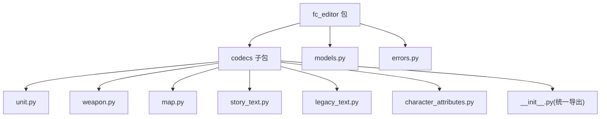
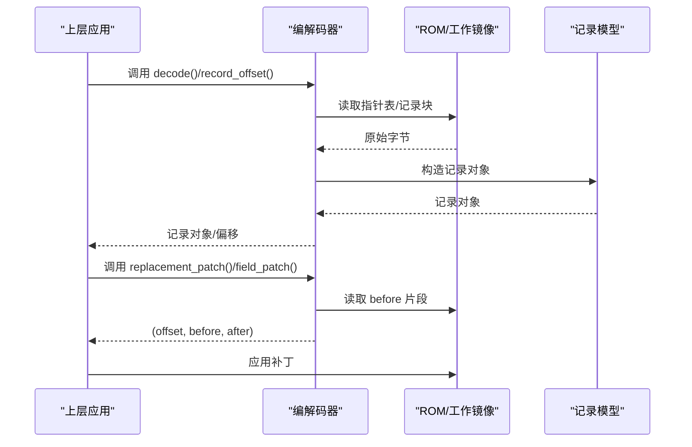
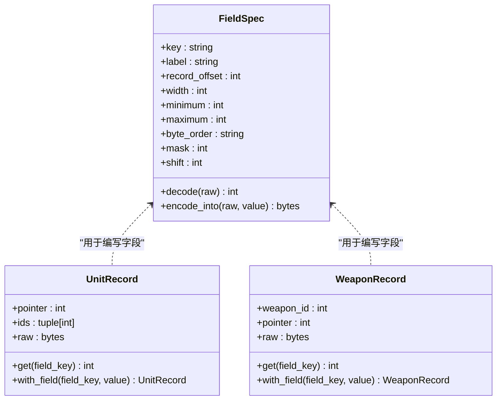
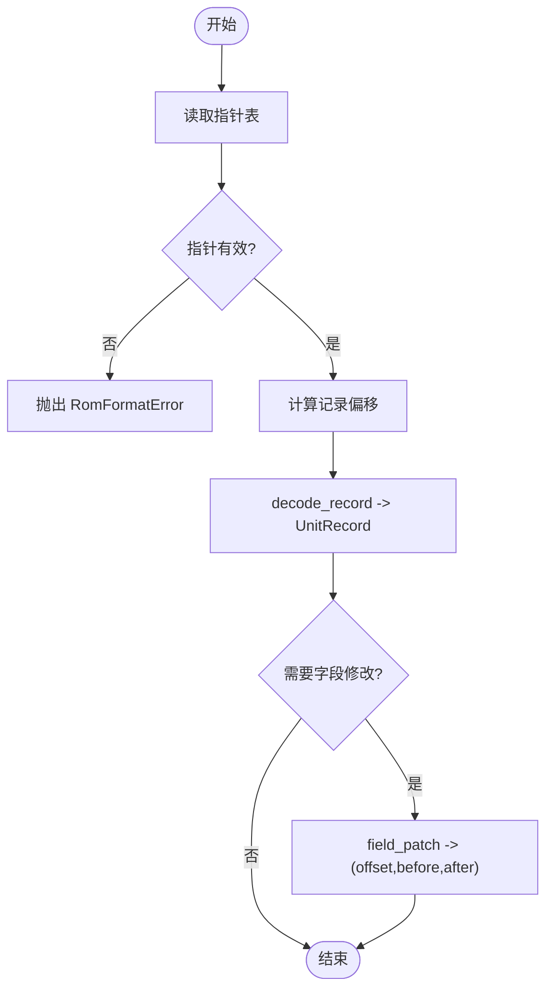
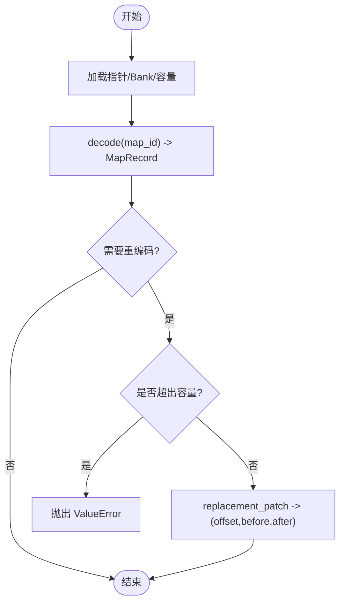
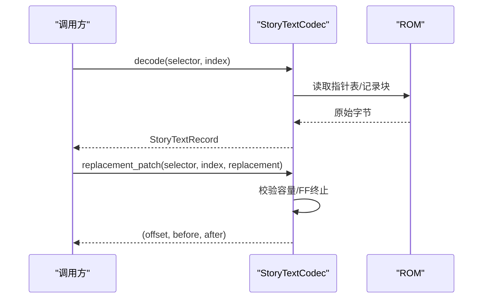
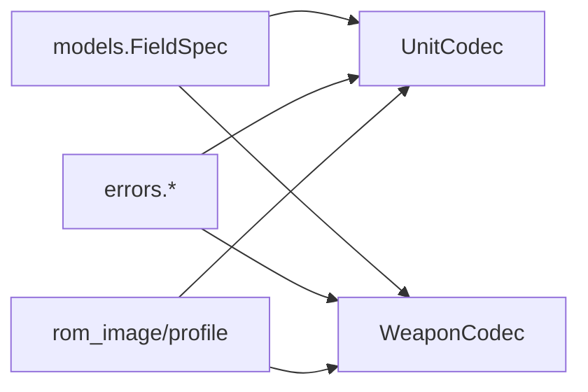

# 编解码器扩展

<cite>
**本文引用的文件**
- [src/fc_editor/codecs/__init__.py](file://src/fc_editor/codecs/__init__.py)
- [src/fc_editor/codecs/unit.py](file://src/fc_editor/codecs/unit.py)
- [src/fc_editor/codecs/weapon.py](file://src/fc_editor/codecs/weapon.py)
- [src/fc_editor/codecs/map.py](file://src/fc_editor/codecs/map.py)
- [src/fc_editor/codecs/story_text.py](file://src/fc_editor/codecs/story_text.py)
- [src/fc_editor/codecs/legacy_text.py](file://src/fc_editor/codecs/legacy_text.py)
- [src/fc_editor/codecs/character_attributes.py](file://src/fc_editor/codecs/character_attributes.py)
- [src/fc_editor/models.py](file://src/fc_editor/models.py)
- [src/fc_editor/errors.py](file://src/fc_editor/errors.py)
</cite>

## 目录
1. [简介](#简介)
2. [项目结构](#项目结构)
3. [核心组件](#核心组件)
4. [架构总览](#架构总览)
5. [详细组件分析](#详细组件分析)
6. [依赖关系分析](#依赖关系分析)
7. [性能考虑](#性能考虑)
8. [故障排查指南](#故障排查指南)
9. [结论](#结论)
10. [附录：开发示例与最佳实践](#附录开发示例与最佳实践)

## 简介
本指南面向需要在 DC 修改器中扩展“编解码器”的开发者，目标是帮助你在不破坏 ROM 布局的前提下，安全地读写、校验并替换游戏数据。文档围绕以下主题展开：
- Codec 接口的设计模式与实现方法（序列化/反序列化）
- 如何创建新的编解码器类、继承基类并实现必要方法
- 数据格式定义规范（字段类型、长度限制、编码规则）
- 编解码器的注册机制与在系统中的集成方式
- 完整开发示例（从简单文本到复杂二进制结构）
- 错误处理、版本兼容性与性能优化等最佳实践

## 项目结构
DC 修改器的编解码能力集中在 src/fc_editor/codecs 目录下，每个模块负责一种资源类型的编解码；公共模型、常量、错误类型位于 fc_editor 根包中。顶层 __init__.py 将各编解码器统一导出，便于上层 UI/工具按需导入。

图表来源
- [src/fc_editor/codecs/__init__.py:1-47](file://src/fc_editor/codecs/__init__.py#L1-L47)
- [src/fc_editor/codecs/unit.py:1-120](file://src/fc_editor/codecs/unit.py#L1-L120)
- [src/fc_editor/codecs/weapon.py:1-90](file://src/fc_editor/codecs/weapon.py#L1-L90)
- [src/fc_editor/codecs/map.py:1-228](file://src/fc_editor/codecs/map.py#L1-L228)
- [src/fc_editor/codecs/story_text.py:1-259](file://src/fc_editor/codecs/story_text.py#L1-L259)
- [src/fc_editor/codecs/legacy_text.py:1-190](file://src/fc_editor/codecs/legacy_text.py#L1-L190)
- [src/fc_editor/codecs/character_attributes.py:1-263](file://src/fc_editor/codecs/character_attributes.py#L1-L263)
- [src/fc_editor/models.py:1-200](file://src/fc_editor/models.py#L1-L200)
- [src/fc_editor/errors.py:1-11](file://src/fc_editor/errors.py#L1-L11)

章节来源
- [src/fc_editor/codecs/__init__.py:1-47](file://src/fc_editor/codecs/__init__.py#L1-L47)

## 核心组件
- 编解码器基元
  - 指针表读取与校验：所有基于指针表的编解码器都先解析 CPU 指针表，再计算文件偏移，确保记录落在受支持区域。
  - 记录对象：以不可变 dataclass 表示记录（如 UnitRecord、WeaponRecord、MapRecord、StoryTextRecord），提供只读视图与精确大小写入。
  - 字段规格：FieldSpec 集中描述字段位置、宽度、范围、掩码、位移、显示比例等，统一编解码逻辑。
- 错误体系
  - RomFormatError：ROM 布局不符合预期时抛出。
  - ProjectFormatError：工程文件格式错误或目标 ROM 不一致。
  - ChangeConflictError：多个编辑器模块尝试重叠写入冲突。
- 统一导出
  - codecs/__init__.py 汇总导出常用编解码器，供上层模块直接引用。

章节来源
- [src/fc_editor/models.py:13-58](file://src/fc_editor/models.py#L13-L58)
- [src/fc_editor/models.py:165-200](file://src/fc_editor/models.py#L165-L200)
- [src/fc_editor/errors.py:1-11](file://src/fc_editor/errors.py#L1-L11)
- [src/fc_editor/codecs/__init__.py:1-47](file://src/fc_editor/codecs/__init__.py#L1-L47)

## 架构总览
下图展示典型编解码流程：从 ROM 或工作镜像中读取原始字节，解析为记录对象；编辑后生成补丁（before/after），由上层应用应用到工作镜像。

图表来源
- [src/fc_editor/codecs/unit.py:17-120](file://src/fc_editor/codecs/unit.py#L17-L120)
- [src/fc_editor/codecs/weapon.py:13-90](file://src/fc_editor/codecs/weapon.py#L13-L90)
- [src/fc_editor/codecs/map.py:16-228](file://src/fc_editor/codecs/map.py#L16-L228)
- [src/fc_editor/codecs/story_text.py:17-259](file://src/fc_editor/codecs/story_text.py#L17-L259)
- [src/fc_editor/codecs/legacy_text.py:60-190](file://src/fc_editor/codecs/legacy_text.py#L60-L190)

## 详细组件分析

### 通用编解码模式与字段规格
- 字段规格 FieldSpec
  - 描述字段在记录中的偏移、宽度、取值范围、掩码与位移、显示缩放等。
  - 提供 decode/encode_into 两个核心方法，保证编解码一致性与边界检查。
- 记录模型
  - UnitRecord/WeaponRecord 等以 raw bytes 为核心，提供 get/with_field 等便捷方法，保持不可变与可组合性。

图表来源
- [src/fc_editor/models.py:13-58](file://src/fc_editor/models.py#L13-L58)
- [src/fc_editor/models.py:165-200](file://src/fc_editor/models.py#L165-L200)

章节来源
- [src/fc_editor/models.py:13-58](file://src/fc_editor/models.py#L13-L58)
- [src/fc_editor/models.py:165-200](file://src/fc_editor/models.py#L165-L200)

### 机体编解码器 UnitCodec
- 职责
  - 读取 128 条机体指针表，校验起始标记与指针有效性，计算记录文件偏移。
  - 提供 decode_record/encode_record/field_patch/round_trip_record 等方法。
- 关键点
  - 支持通过 pair_first_bank 映射扩展 Bank 对。
  - 使用 FieldSpec 进行字段级 patch，避免全量重写。

图表来源
- [src/fc_editor/codecs/unit.py:17-120](file://src/fc_editor/codecs/unit.py#L17-L120)

章节来源
- [src/fc_editor/codecs/unit.py:17-120](file://src/fc_editor/codecs/unit.py#L17-L120)

### 武器编解码器 WeaponCodec
- 职责
  - 读取 192 条武器指针表，校验与偏移计算。
  - 提供 decode_record/encode_record/field_patch/round_trip_record。
- 关键点
  - 纯只读解码，字段级 patch 通过 FieldSpec 完成。

章节来源
- [src/fc_editor/codecs/weapon.py:13-90](file://src/fc_editor/codecs/weapon.py#L13-L90)

### 地图编解码器 MapCodec（4位地形 RLE）
- 职责
  - 读取地图指针表与 Bank 目录，计算容量与偏移。
  - decode 将 RLE 压缩数据还原为图块序列；encode 将图块序列编码为 RLE。
  - replacement_patch 在容量限制内生成精确替换补丁。
- 关键点
  - 严格校验宽高、RLE 游程越界、容量不足等。
  - 支持扩展地图（Bank 表）与原地图两种存储模式。

图表来源
- [src/fc_editor/codecs/map.py:16-228](file://src/fc_editor/codecs/map.py#L16-L228)

章节来源
- [src/fc_editor/codecs/map.py:16-228](file://src/fc_editor/codecs/map.py#L16-L228)

### 剧情文本编解码器 StoryTextCodec
- 职责
  - 按组读取指针表，计算每条记录的容量与边界。
  - tokenize 将原始字节流切分为字形/控制/结束符等 token。
  - replacement_patch 要求替换体与原始容量严格相等，保证零拷贝改写。
- 关键点
  - 字形前导集 GLYPH_LEADS 决定双字节字形边界，避免误判 FF 为结束符。
  - standalone_terminator_end 用于定位首个独立 FF 的位置。

图表来源
- [src/fc_editor/codecs/story_text.py:17-259](file://src/fc_editor/codecs/story_text.py#L17-L259)

章节来源
- [src/fc_editor/codecs/story_text.py:17-259](file://src/fc_editor/codecs/story_text.py#L17-L259)

### 旧版文本编解码器 LegacyTextCodec
- 职责
  - 维护多组文字指针表与池边界，支持随机对话（F8）间接寻址。
  - 不重组池，仅在原记录范围内替换，保留控制码与参数。
  - protected_tokens 提取受保护 token，确保不被篡改。
- 关键点
  - 严格校验指针范围、结束码、token 完整性。
  - replacement_patch 强制保留末尾结束码与控制码集合。

章节来源
- [src/fc_editor/codecs/legacy_text.py:60-190](file://src/fc_editor/codecs/legacy_text.py#L60-L190)

### 人物属性与头像编解码器 CharacterAttributesCodec
- 职责
  - 校验 ROM 上下文代码与入口，确保当前 ROM 已验证。
  - 读取/写入人物属性与头像记录，支持共享记录去重与池重打包。
  - 提供 costs/cost_patch 等专用能力。
- 关键点
  - 严格校验指针池范围、记录长度、标志位。
  - 当记录共享或池空间不足时，给出明确提示与修复建议。

章节来源
- [src/fc_editor/codecs/character_attributes.py:78-237](file://src/fc_editor/codecs/character_attributes.py#L78-L237)

## 依赖关系分析
- 编解码器依赖
  - models.FieldSpec：统一的字段编解码契约。
  - errors.*：统一的异常类型，便于上层捕获与提示。
  - rom_image/profile：不同 ROM 变体的地址、窗口、容量配置。
- 耦合与内聚
  - 每个编解码器聚焦单一资源类型，内聚度高。
  - 通过 FieldSpec 降低重复逻辑，提升一致性。
- 外部依赖
  - 依赖 ROM profile 提供的指针表、存储区、窗口基址等元信息。

图表来源
- [src/fc_editor/models.py:13-58](file://src/fc_editor/models.py#L13-L58)
- [src/fc_editor/codecs/unit.py:1-120](file://src/fc_editor/codecs/unit.py#L1-L120)
- [src/fc_editor/codecs/weapon.py:1-90](file://src/fc_editor/codecs/weapon.py#L1-L90)
- [src/fc_editor/errors.py:1-11](file://src/fc_editor/errors.py#L1-L11)

章节来源
- [src/fc_editor/models.py:13-58](file://src/fc_editor/models.py#L13-L58)
- [src/fc_editor/codecs/unit.py:1-120](file://src/fc_editor/codecs/unit.py#L1-L120)
- [src/fc_editor/codecs/weapon.py:1-90](file://src/fc_editor/codecs/weapon.py#L1-L90)
- [src/fc_editor/errors.py:1-11](file://src/fc_editor/errors.py#L1-L11)

## 性能考虑
- 最小化内存复制：尽量基于原始字节切片与原地替换，避免多余拷贝。
- 增量补丁：优先使用 field_patch/replacement_patch 返回的三元组，减少写入范围。
- 容量预检：在 encode 阶段尽早校验宽高、游程、容量，失败快速返回。
- 复用记录：对于共享记录，优先原地覆盖，必要时才触发池重打包。
- 哈希摘要：对关键资源（如图块、文本）计算语义摘要，便于缓存与变更检测。

[本节为通用指导，无需特定文件来源]

## 故障排查指南
- 常见错误类型
  - RomFormatError：ROM 布局不符、指针越界、记录不完整、容量无效等。
  - ProjectFormatError：工程文件格式错误或目标 ROM 不一致。
  - ChangeConflictError：多个模块重叠写入冲突。
- 排查步骤
  - 确认 ROM 版本与 profile 匹配。
  - 检查指针表起始标记与范围。
  - 校验记录容量与编码结果是否越界。
  - 查看 replacement_patch/field_patch 返回的 before/after，定位差异。
  - 对文本类资源，确认控制码与结束码未被破坏。

章节来源
- [src/fc_editor/errors.py:1-11](file://src/fc_editor/errors.py#L1-L11)
- [src/fc_editor/codecs/map.py:136-173](file://src/fc_editor/codecs/map.py#L136-L173)
- [src/fc_editor/codecs/story_text.py:156-179](file://src/fc_editor/codecs/story_text.py#L156-L179)
- [src/fc_editor/codecs/legacy_text.py:126-141](file://src/fc_editor/codecs/legacy_text.py#L126-L141)

## 结论
DC 修改器的编解码器采用“指针表 + 记录对象 + 字段规格 + 精确补丁”的统一模式，既保证了数据完整性与兼容性，又提供了高效的增量修改能力。遵循本文档的规范与最佳实践，你可以安全地扩展新的编解码器，覆盖更多资源类型。

[本节为总结性内容，无需特定文件来源]

## 附录：开发示例与最佳实践

### 设计模式与接口约定
- 编解码器应提供：
  - 读取：decode/record_offset/pointers 等
  - 写入：replacement_patch/field_patch 等
  - 校验：validate/round_trip 等
- 记录对象应为不可变 dataclass，包含 pointer/raw/ids 等元信息。
- 字段规格使用 FieldSpec 统一管理，避免散落硬编码。

章节来源
- [src/fc_editor/models.py:13-58](file://src/fc_editor/models.py#L13-L58)
- [src/fc_editor/codecs/unit.py:86-120](file://src/fc_editor/codecs/unit.py#L86-L120)
- [src/fc_editor/codecs/weapon.py:55-90](file://src/fc_editor/codecs/weapon.py#L55-L90)
- [src/fc_editor/codecs/map.py:136-228](file://src/fc_editor/codecs/map.py#L136-L228)
- [src/fc_editor/codecs/story_text.py:156-259](file://src/fc_editor/codecs/story_text.py#L156-L259)
- [src/fc_editor/codecs/legacy_text.py:143-190](file://src/fc_editor/codecs/legacy_text.py#L143-L190)

### 数据格式定义规范
- 字段类型与长度
  - 使用 FieldSpec 的 width/byte_order/mask/shift 描述位域与字节序。
  - 严格设置 minimum/maximum，防止非法值进入 ROM。
- 编码规则
  - 文本：遵循字形前导集与结束码约定，保留控制码与参数。
  - 地图：4 位地形 RLE，游程上限与宽高限制需严格校验。
  - 指针：必须位于受支持的窗口/池中，且满足递增/唯一性等约束。

章节来源
- [src/fc_editor/models.py:13-58](file://src/fc_editor/models.py#L13-L58)
- [src/fc_editor/codecs/story_text.py:25-31](file://src/fc_editor/codecs/story_text.py#L25-L31)
- [src/fc_editor/codecs/map.py:175-196](file://src/fc_editor/codecs/map.py#L175-L196)
- [src/fc_editor/codecs/legacy_text.py:126-141](file://src/fc_editor/codecs/legacy_text.py#L126-L141)

### 编解码器的注册机制
- 在 codecs/__init__.py 中统一导出新编解码器类名，以便上层模块通过包级导入获取。
- 若编解码器依赖 ROM profile，应在初始化时校验 profile.key 或相关元信息，确保版本兼容。

章节来源
- [src/fc_editor/codecs/__init__.py:1-47](file://src/fc_editor/codecs/__init__.py#L1-L47)
- [src/fc_editor/codecs/character_attributes.py:97-101](file://src/fc_editor/codecs/character_attributes.py#L97-L101)

### 完整开发示例（从简单到复杂）
- 示例一：简单文本（沿用 StoryTextCodec/LegacyTextCodec 模式）
  - 定义组与指针表、计算容量、tokenize、replacement_patch 保持容量不变。
  - 参考路径：[story_text.py:156-259](file://src/fc_editor/codecs/story_text.py#L156-L259)、[legacy_text.py:143-190](file://src/fc_editor/codecs/legacy_text.py#L143-L190)
- 示例二：固定长度记录（参照 UnitCodec/WeaponCodec）
  - 读取指针表、校验范围、decode_record/encode_record/field_patch。
  - 参考路径：[unit.py:17-120](file://src/fc_editor/codecs/unit.py#L17-L120)、[weapon.py:13-90](file://src/fc_editor/codecs/weapon.py#L13-L90)
- 示例三：可变长度与压缩（参照 MapCodec）
  - 计算容量、decode/encode 压缩格式、replacement_patch 容量校验。
  - 参考路径：[map.py:16-228](file://src/fc_editor/codecs/map.py#L16-L228)
- 示例四：带池与共享记录（参照 CharacterAttributesCodec）
  - 校验上下文、读取/写入记录、共享去重、池重打包与容量告警。
  - 参考路径：[character_attributes.py:78-237](file://src/fc_editor/codecs/character_attributes.py#L78-L237)

### 错误处理与版本兼容性
- 错误分类
  - 输入校验：字段范围、宽高、容量、token 完整性。
  - 布局校验：指针表起始标记、窗口范围、池边界。
  - 运行时冲突：ChangeConflictError 提示重叠写入。
- 版本兼容
  - 初始化时校验 profile.key 或关键代码段，拒绝未验证 ROM。
  - 对未知/候选字段标注证据级别，避免误改。

章节来源
- [src/fc_editor/errors.py:1-11](file://src/fc_editor/errors.py#L1-L11)
- [src/fc_editor/codecs/character_attributes.py:97-109](file://src/fc_editor/codecs/character_attributes.py#L97-L109)
- [src/fc_editor/models.py:13-28](file://src/fc_editor/models.py#L13-L28)

### 性能优化建议
- 使用 FieldSpec 的 encode_into 进行原位写，避免整记录复制。
- 对大资源（地图、文本）优先计算语义摘要，减少重复处理。
- 仅在必要时触发池重打包，优先原地覆盖共享记录。
- 批量操作时合并相邻补丁，减少写入次数。

[本节为通用指导，无需特定文件来源]