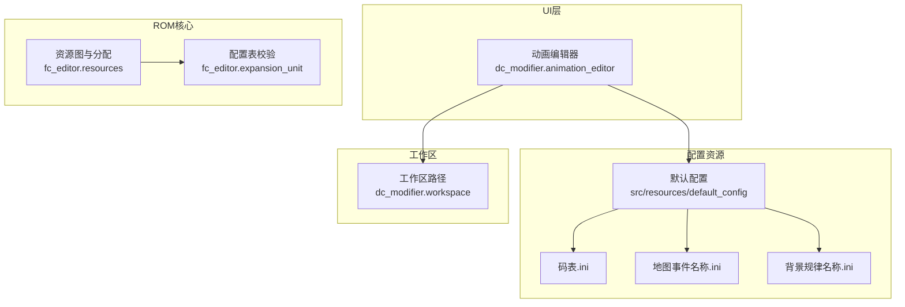
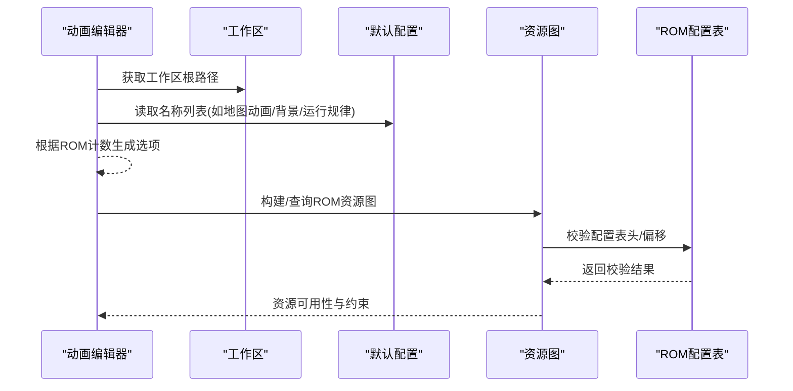
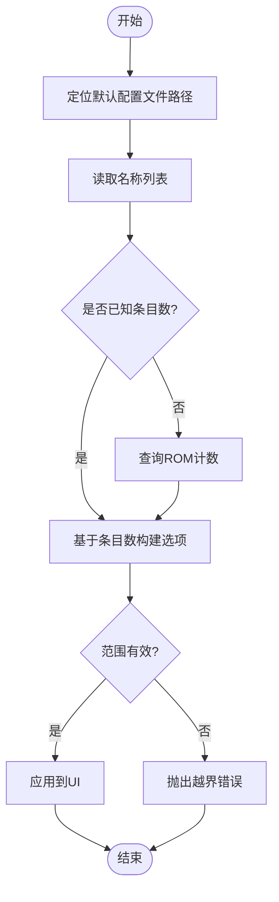
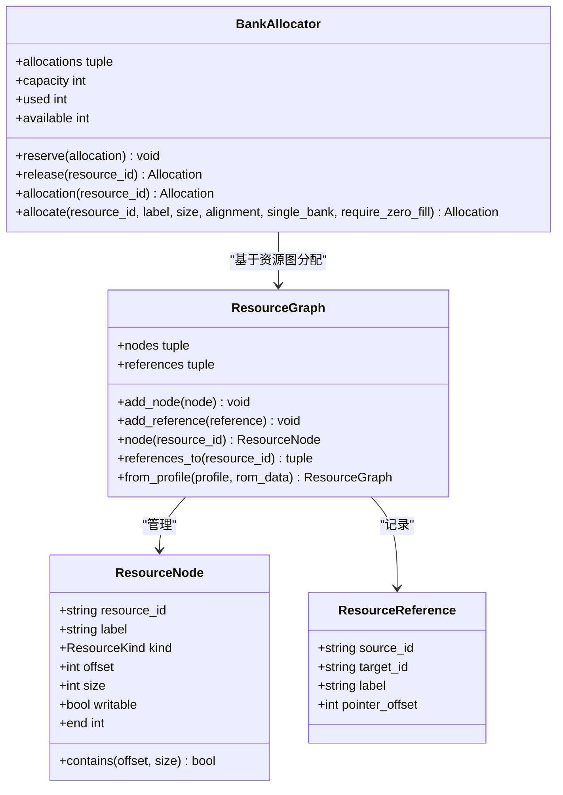
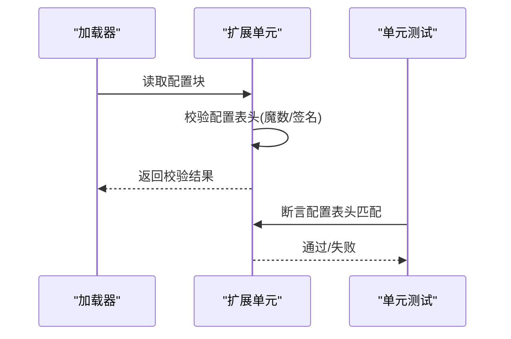
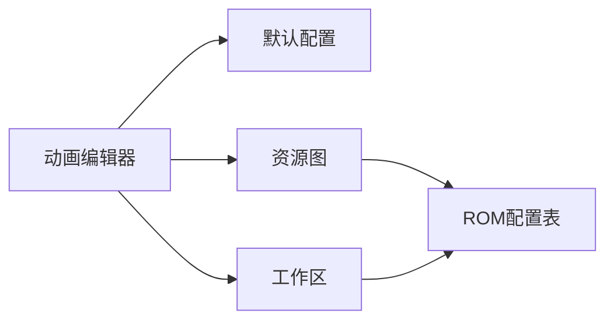

# 配置文件扩展

<cite>
**本文引用的文件**
- [src/resources/default_config/码表.ini](file://src/resources/default_config/码表.ini)
- [src/resources/default_config/地图事件名称.ini](file://src/resources/default_config/地图事件名称.ini)
- [src/resources/default_config/背景规律名称.ini](file://src/resources/default_config/背景规律名称.ini)
- [src/dc_modifier/animation_editor.py](file://src/dc_modifier/animation_editor.py)
- [src/dc_modifier/workspace.py](file://src/dc_modifier/workspace.py)
- [src/fc_editor/resources.py](file://src/fc_editor/resources.py)
- [src/fc_editor/expansion_unit.py](file://src/fc_editor/expansion_unit.py)
- [tests/test_expansion_unit.py](file://tests/test_expansion_unit.py)
</cite>

## 目录
1. [简介](#简介)
2. [项目结构](#项目结构)
3. [核心组件](#核心组件)
4. [架构总览](#架构总览)
5. [详细组件分析](#详细组件分析)
6. [依赖关系分析](#依赖关系分析)
7. [性能考虑](#性能考虑)
8. [故障排查指南](#故障排查指南)
9. [结论](#结论)
10. [附录](#附录)

## 简介
本指南面向DC修改器的配置文件扩展开发，聚焦INI配置文件的结构与组织方式、键值对与分组管理、新增配置项的完整流程（数据类型、默认值、验证规则）、加载与解析机制（环境变量替换、路径处理、依赖关系）、版本兼容与迁移策略，以及高级功能（配置验证、错误处理、热重载）的实践方法。文档以仓库中现有资源为基准，提供从简单参数到复杂结构化数据的扩展示例，并给出可操作的流程图与时序图，帮助开发者快速上手。

## 项目结构
DC修改器将“默认配置”集中放置在资源目录下，UI层通过相对路径或工作区根路径定位这些文件；ROM侧的资源分配与校验由核心模块统一管理。关键位置如下：
- 默认配置目录：src/resources/default_config
- UI读取配置入口：dc_modifier.animation_editor
- 工作区与路径解析：dc_modifier.workspace
- ROM资源图与分配：fc_editor.resources
- ROM配置表校验：fc_editor.expansion_unit 与 tests/test_expansion_unit

图表来源
- [src/dc_modifier/animation_editor.py:16-312](file://src/dc_modifier/animation_editor.py#L16-L312)
- [src/dc_modifier/workspace.py:7-26](file://src/dc_modifier/workspace.py#L7-L26)
- [src/fc_editor/resources.py:47-260](file://src/fc_editor/resources.py#L47-L260)
- [src/fc_editor/expansion_unit.py:643-643](file://src/fc_editor/expansion_unit.py#L643-L643)

章节来源
- [src/dc_modifier/animation_editor.py:16-312](file://src/dc_modifier/animation_editor.py#L16-L312)
- [src/dc_modifier/workspace.py:7-26](file://src/dc_modifier/workspace.py#L7-L26)
- [src/fc_editor/resources.py:47-260](file://src/fc_editor/resources.py#L47-L260)

## 核心组件
- 默认配置资源
  - 码表.ini：以“源地址=目标地址=字符”形式映射字库编码，用于文本显示。
  - 地图事件名称.ini、背景规律名称.ini：按行索引对应游戏内条目名称，便于编辑与导出。
- 配置加载与使用
  - animation_editor：通过工具函数读取默认配置中的名称列表，结合ROM数据计数动态生成下拉选项。
- 工作区与路径
  - workspace：确定工作区根目录与ROM路径，确保配置与ROM在同一工程上下文中被正确引用。
- ROM资源与校验
  - resources：构建ROM资源图，声明各资源节点与引用关系，支持PRG区域分配与冲突检测。
  - expansion_unit：校验ROM中的配置表头，保证数据结构一致性与兼容性。

章节来源
- [src/resources/default_config/码表.ini:1-800](file://src/resources/default_config/码表.ini#L1-L800)
- [src/resources/default_config/地图事件名称.ini:1-257](file://src/resources/default_config/地图事件名称.ini#L1-L257)
- [src/resources/default_config/背景规律名称.ini:1-257](file://src/resources/default_config/背景规律名称.ini#L1-L257)
- [src/dc_modifier/animation_editor.py:16-312](file://src/dc_modifier/animation_editor.py#L16-L312)
- [src/dc_modifier/workspace.py:7-26](file://src/dc_modifier/workspace.py#L7-L26)
- [src/fc_editor/resources.py:47-260](file://src/fc_editor/resources.py#L47-L260)
- [src/fc_editor/expansion_unit.py:643-643](file://src/fc_editor/expansion_unit.py#L643-L643)
- [tests/test_expansion_unit.py:256-256](file://tests/test_expansion_unit.py#L256-L256)

## 架构总览
下图展示了从UI到配置资源、再到ROM资源图的调用链路与职责分工。UI层负责读取与展示，工作区负责路径解析，ROM核心负责资源管理与一致性校验。

图表来源
- [src/dc_modifier/animation_editor.py:16-312](file://src/dc_modifier/animation_editor.py#L16-L312)
- [src/dc_modifier/workspace.py:7-26](file://src/dc_modifier/workspace.py#L7-L26)
- [src/fc_editor/resources.py:47-260](file://src/fc_editor/resources.py#L47-L260)
- [src/fc_editor/expansion_unit.py:643-643](file://src/fc_editor/expansion_unit.py#L643-L643)

## 详细组件分析

### 组件A：默认配置资源（INI）
- 文件格式与语义
  - 码表.ini：每行包含三段信息，分别表示源地址、目标地址与字符映射，用于字库重映射。
  - 地图事件名称.ini、背景规律名称.ini：每行对应一个条目名称，空行表示未定义或占位。
- 组织方式
  - 按主题分文件存放于默认配置目录，便于独立维护与增量更新。
- 扩展建议
  - 新增配置项时，优先采用“单文件+固定行序”的轻量格式；若需结构化，可在同一INI中使用分组键值对。

章节来源
- [src/resources/default_config/码表.ini:1-800](file://src/resources/default_config/码表.ini#L1-L800)
- [src/resources/default_config/地图事件名称.ini:1-257](file://src/resources/default_config/地图事件名称.ini#L1-L257)
- [src/resources/default_config/背景规律名称.ini:1-257](file://src/resources/default_config/背景规律名称.ini#L1-L257)

### 组件B：配置加载与解析（UI层）
- 加载流程
  - 通过工具函数定位默认配置文件路径，读取名称列表并结合ROM数据计数动态生成界面选项。
  - 针对不同类型的配置（背景、运行规律、图片等），使用不同的文件名与索引偏移。
- 路径处理
  - 使用工作区根路径拼接资源路径，确保在打包与开发环境均能正确定位。
- 依赖关系
  - 依赖ROM数据以确定条目数量，避免越界访问。

图表来源
- [src/dc_modifier/animation_editor.py:16-312](file://src/dc_modifier/animation_editor.py#L16-L312)
- [src/dc_modifier/workspace.py:7-26](file://src/dc_modifier/workspace.py#L7-L26)

章节来源
- [src/dc_modifier/animation_editor.py:16-312](file://src/dc_modifier/animation_editor.py#L16-L312)
- [src/dc_modifier/workspace.py:7-26](file://src/dc_modifier/workspace.py#L7-L26)

### 组件C：ROM资源图与分配
- 资源图
  - 将ROM划分为多个命名资源节点（表、数据、代码、音频、图像、空闲区域、元数据），并记录跨资源引用。
  - 支持从ROM配置文件中构建资源图，自动识别指针表、托管池、保护区域等。
- 分配器
  - 提供确定性的一号适配分配器，检查对齐、重叠、零填充要求，并在可用PRG区域内进行分配。
- 用途
  - 为配置扩展提供稳定的ROM布局基础，确保新增资源不会破坏既有结构。

图表来源
- [src/fc_editor/resources.py:14-79](file://src/fc_editor/resources.py#L14-L79)
- [src/fc_editor/resources.py:47-260](file://src/fc_editor/resources.py#L47-L260)
- [src/fc_editor/resources.py:280-413](file://src/fc_editor/resources.py#L280-L413)

章节来源
- [src/fc_editor/resources.py:47-260](file://src/fc_editor/resources.py#L47-L260)
- [src/fc_editor/resources.py:280-413](file://src/fc_editor/resources.py#L280-L413)

### 组件D：ROM配置表校验
- 校验点
  - 检查ROM中配置表的魔数/签名，确保数据结构与预期一致。
  - 测试用例覆盖不同偏移位置的校验逻辑，保障向后兼容。
- 作用
  - 在加载或写入前进行强校验，防止因ROM版本差异导致的数据损坏。

图表来源
- [src/fc_editor/expansion_unit.py:643-643](file://src/fc_editor/expansion_unit.py#L643-L643)
- [tests/test_expansion_unit.py:256-256](file://tests/test_expansion_unit.py#L256-L256)

章节来源
- [src/fc_editor/expansion_unit.py:643-643](file://src/fc_editor/expansion_unit.py#L643-L643)
- [tests/test_expansion_unit.py:256-256](file://tests/test_expansion_unit.py#L256-L256)

## 依赖关系分析
- 耦合度
  - UI层与默认配置之间通过路径与文件名约定耦合，降低了对具体实现的依赖。
  - 资源图与分配器对ROM布局有强依赖，但通过Profile抽象屏蔽了差异。
- 外部依赖
  - 工作区路径解析依赖打包环境与当前工作目录，确保在不同部署模式下均可找到ROM与资源。
- 循环依赖
  - 当前模块划分清晰，未发现循环导入；资源图与分配器仅单向依赖Profile与ROM数据。

图表来源
- [src/dc_modifier/animation_editor.py:16-312](file://src/dc_modifier/animation_editor.py#L16-L312)
- [src/dc_modifier/workspace.py:7-26](file://src/dc_modifier/workspace.py#L7-L26)
- [src/fc_editor/resources.py:47-260](file://src/fc_editor/resources.py#L47-L260)

章节来源
- [src/dc_modifier/animation_editor.py:16-312](file://src/dc_modifier/animation_editor.py#L16-L312)
- [src/dc_modifier/workspace.py:7-26](file://src/dc_modifier/workspace.py#L7-L26)
- [src/fc_editor/resources.py:47-260](file://src/fc_editor/resources.py#L47-L260)

## 性能考虑
- 配置加载
  - 名称列表读取为顺序I/O，建议在UI初始化时缓存，避免重复读取。
- 资源分配
  - 分配器采用线性扫描与对齐计算，时间复杂度与空闲区域数量成正比；可通过预排序与索引优化提升大规模场景下的性能。
- 校验开销
  - 配置表头校验为常数时间操作，适合在关键路径前置执行，尽早失败。

[本节为通用指导，不直接分析具体文件]

## 故障排查指南
- 常见问题
  - 配置项越界：当ROM条目数小于配置行数时，应截断或提示用户修正配置。
  - 路径解析失败：检查工作区根路径是否正确，确认ROM与默认配置位于预期目录。
  - 资源冲突：分配器检测到重叠时会抛出异常，需调整资源ID或大小。
  - 配置表头不匹配：ROM版本不一致导致校验失败，需升级或回退至兼容版本。
- 定位步骤
  - 在工作区根目录确认ROM与默认配置存在。
  - 在UI层打印配置文件名与条目数，核对与ROM计数一致。
  - 在资源图构建阶段输出节点与引用，检查指针表与托管池范围。
  - 在配置表校验处捕获异常并记录ROM偏移与期望值。

章节来源
- [src/dc_modifier/workspace.py:7-26](file://src/dc_modifier/workspace.py#L7-L26)
- [src/fc_editor/resources.py:334-413](file://src/fc_editor/resources.py#L334-L413)
- [src/fc_editor/expansion_unit.py:643-643](file://src/fc_editor/expansion_unit.py#L643-L643)

## 结论
DC修改器的配置文件扩展以“默认配置+资源图+分配器+校验”为核心，形成从UI到ROM的稳定链路。遵循本指南的结构化组织、类型与验证规范、路径与环境处理、版本兼容策略，可以安全地扩展配置能力，并借助资源图与分配器保证ROM布局的一致性与可维护性。

[本节为总结性内容，不直接分析具体文件]

## 附录

### 添加新配置项的步骤清单
- 定义INI结构
  - 选择单行条目或分组键值对；为每个条目提供唯一标识与默认值。
- 设置默认值与验证
  - 在UI加载时校验范围与类型；对数值型字段设定最小/最大值。
- 集成到UI
  - 在动画编辑器或其他页面中读取新配置，并根据ROM计数生成选项。
- 资源与ROM侧准备
  - 如需新增ROM资源，先在资源图中声明节点，再使用分配器进行分配。
  - 在扩展单元中添加配置表头校验，确保兼容性。
- 测试与回归
  - 编写单元测试覆盖边界条件与异常路径；验证在不同ROM版本下的一致性。

[本节为操作指引，不直接分析具体文件]

### 环境变量替换与路径处理
- 环境变量替换
  - 在加载配置前，可对路径与键值进行环境变量展开，便于多环境部署。
- 路径处理
  - 使用工作区根路径拼接资源路径，避免硬编码绝对路径；在打包环境下确保相对路径有效。
- 依赖关系管理
  - 通过资源图显式声明依赖，避免隐式耦合；在分配阶段检查冲突与对齐。

[本节为通用指导，不直接分析具体文件]

### 版本兼容性与迁移策略
- 兼容性
  - 在配置表头中保留版本标识；加载时根据版本进行分支处理。
- 迁移
  - 提供迁移脚本，将旧版配置转换为新版结构；在转换过程中进行完整性校验。
- 回滚
  - 保留旧版配置备份；在迁移失败时自动回滚至上一版本。

[本节为通用指导，不直接分析具体文件]

### 高级功能：配置验证、错误处理、热重载
- 配置验证
  - 在加载阶段执行强校验，包括类型、范围、依赖关系；失败时提供明确错误信息。
- 错误处理
  - 统一异常封装，区分IO错误、校验错误、ROM冲突；在UI层友好提示。
- 热重载
  - 监听配置文件变更，增量更新UI与内存模型；在切换配置时进行一致性检查，必要时重启相关服务。

[本节为通用指导，不直接分析具体文件]