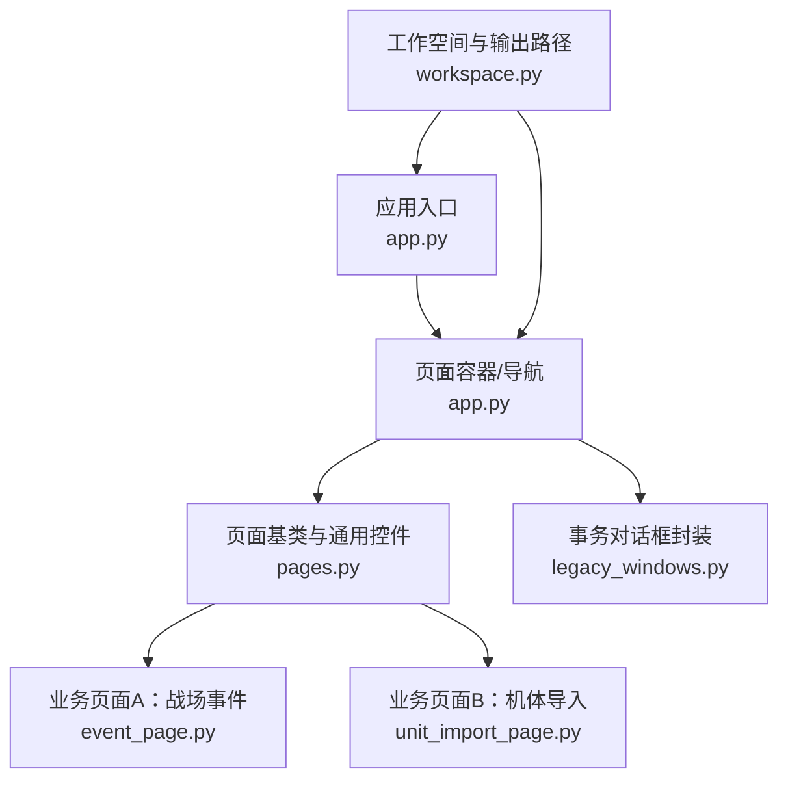
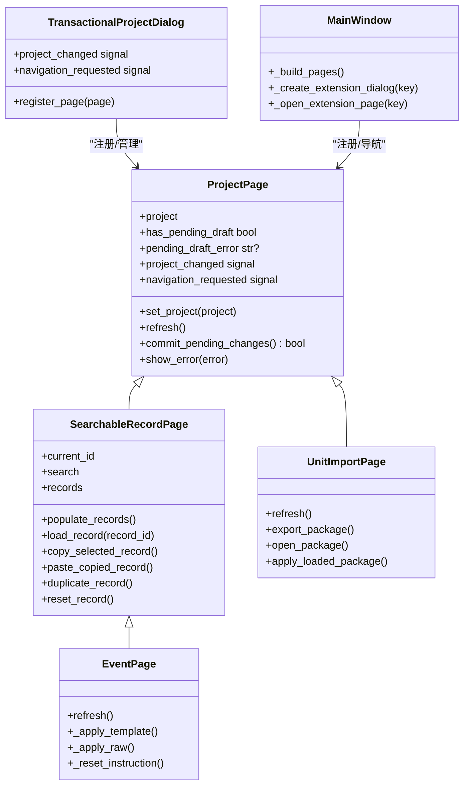
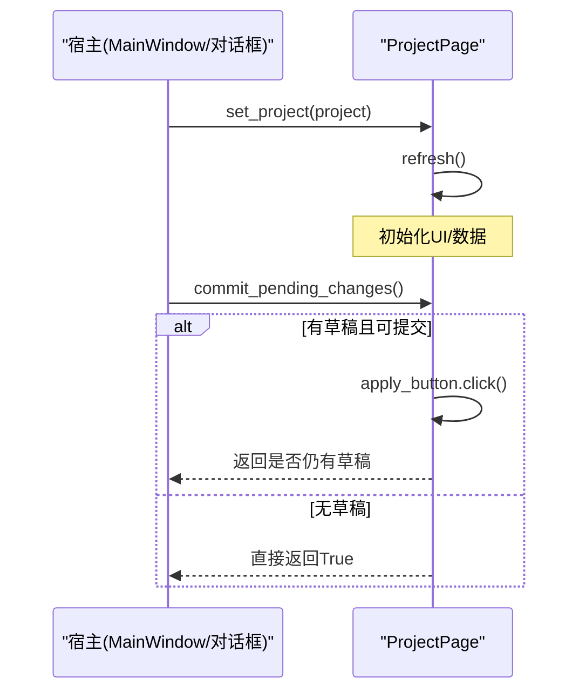
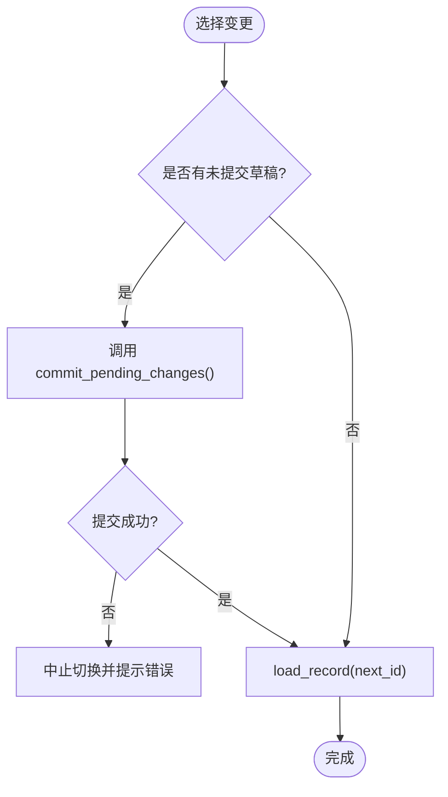
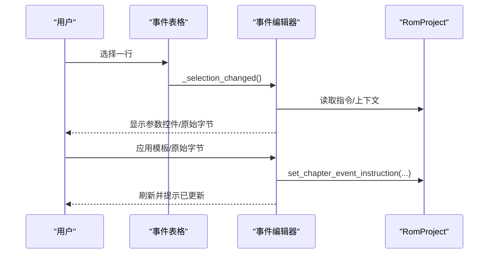
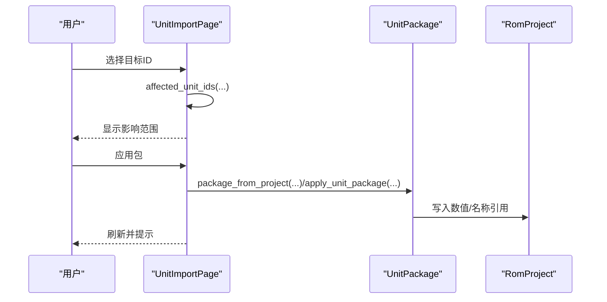
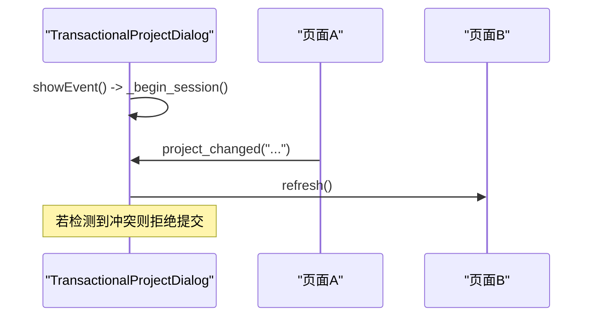
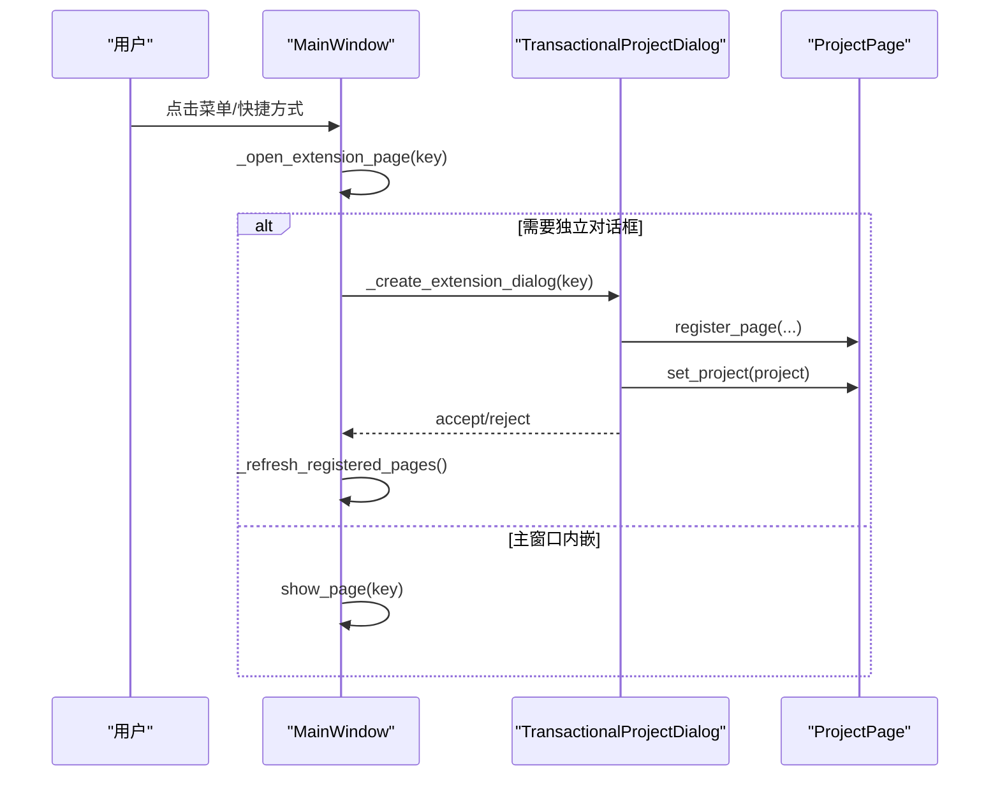
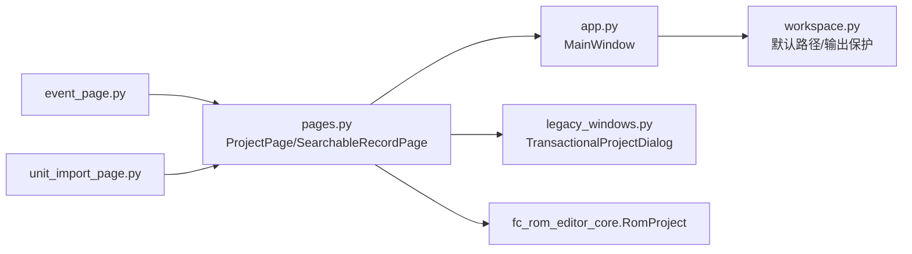

# 页面扩展开发

<cite>
**本文引用的文件**
- [pages.py](file://src/dc_modifier/pages.py)
- [app.py](file://src/dc_modifier/app.py)
- [workspace.py](file://src/dc_modifier/workspace.py)
- [event_page.py](file://src/dc_modifier/event_page.py)
- [unit_import_page.py](file://src/dc_modifier/unit_import_page.py)
- [legacy_windows.py](file://src/dc_modifier/legacy_windows.py)
</cite>

## 目录
1. [简介](#简介)
2. [项目结构](#项目结构)
3. [核心组件](#核心组件)
4. [架构总览](#架构总览)
5. [详细组件分析](#详细组件分析)
6. [依赖关系分析](#依赖关系分析)
7. [性能考虑](#性能考虑)
8. [故障排查指南](#故障排查指南)
9. [结论](#结论)
10. [附录：页面开发示例与最佳实践](#附录页面开发示例与最佳实践)

## 简介
本指南面向为DC修改器开发“页面扩展”的工程师，目标是系统化说明页面基类设计、继承机制、生命周期管理、事件处理、数据绑定与状态管理，并给出从简单展示到复杂多步骤编辑的完整开发路径。同时覆盖页面间通信、数据共享、响应式布局、国际化提示和无障碍访问等高级特性。

## 项目结构
DC修改器的页面体系以统一的基类为核心，通过注册机制挂载到主窗口或事务对话框中；工作区与资源路径由工作空间模块提供；具体业务页面（如战场事件、机体导入）继承基类实现UI与交互逻辑。

图表来源
- [app.py:276-364](file://src/dc_modifier/app.py#L276-L364)
- [pages.py:103-152](file://src/dc_modifier/pages.py#L103-L152)
- [event_page.py:66-228](file://src/dc_modifier/event_page.py#L66-L228)
- [unit_import_page.py:30-128](file://src/dc_modifier/unit_import_page.py#L30-L128)
- [legacy_windows.py:71-114](file://src/dc_modifier/legacy_windows.py#L71-L114)
- [workspace.py:7-43](file://src/dc_modifier/workspace.py#L7-L43)

章节来源
- [app.py:276-364](file://src/dc_modifier/app.py#L276-L364)
- [pages.py:103-152](file://src/dc_modifier/pages.py#L103-L152)
- [workspace.py:7-43](file://src/dc_modifier/workspace.py#L7-L43)

## 核心组件
- 页面基类 ProjectPage：定义项目注入、刷新、草稿提交、错误提示、导航信号等统一能力。
- 可搜索记录页 SearchableRecordPage：提供列表+搜索+上下文菜单+复制/粘贴/还原等通用记录编辑流程。
- 业务页面：EventPage、UnitImportPage 等基于基类实现具体业务。
- 事务对话框 TransactionalProjectDialog：将多个页面纳入同一会话，支持撤销/重做与冲突检测。
- 应用主窗口 MainWindow：注册页面、构建菜单、打开工具对话框、维护未保存变更状态。
- 工作空间 workspace：默认ROM路径、导出路径保护、只读参考目录防护。

章节来源
- [pages.py:103-152](file://src/dc_modifier/pages.py#L103-L152)
- [pages.py:243-511](file://src/dc_modifier/pages.py#L243-L511)
- [event_page.py:66-228](file://src/dc_modifier/event_page.py#L66-L228)
- [unit_import_page.py:30-128](file://src/dc_modifier/unit_import_page.py#L30-L128)
- [legacy_windows.py:71-114](file://src/dc_modifier/legacy_windows.py#L71-L114)
- [app.py:276-364](file://src/dc_modifier/app.py#L276-L364)
- [workspace.py:7-43](file://src/dc_modifier/workspace.py#L7-L43)

## 架构总览
页面扩展遵循“基类抽象 + 业务页面实现 + 事务对话框封装 + 主窗口注册”的分层架构。页面通过信号与主窗口/对话框通信，所有写操作均作用于 RomProject.working 缓冲区，并由事务对话框在取消时回滚。

图表来源
- [pages.py:103-152](file://src/dc_modifier/pages.py#L103-L152)
- [pages.py:243-511](file://src/dc_modifier/pages.py#L243-L511)
- [event_page.py:66-228](file://src/dc_modifier/event_page.py#L66-L228)
- [unit_import_page.py:30-128](file://src/dc_modifier/unit_import_page.py#L30-L128)
- [legacy_windows.py:71-114](file://src/dc_modifier/legacy_windows.py#L71-L114)
- [app.py:276-364](file://src/dc_modifier/app.py#L276-L364)

## 详细组件分析

### 页面基类与生命周期
- 生命周期
  - set_project：注入工程对象并触发一次刷新。
  - refresh：子类重写以重建UI、填充数据。
  - commit_pending_changes：在切换记录或关闭前尝试提交草稿。
  - has_pending_draft / pending_draft_error：用于禁用/启用“应用”按钮和阻止非法提交。
- 事件
  - project_changed：通知宿主刷新其他关联页面。
  - navigation_requested：请求跳转到指定页面键。
- 错误处理
  - show_error：统一弹出错误消息框。

图表来源
- [pages.py:103-152](file://src/dc_modifier/pages.py#L103-L152)

章节来源
- [pages.py:103-152](file://src/dc_modifier/pages.py#L103-L152)

### 可搜索记录页模式
- 提供统一的搜索栏、上一条/下一条导航、结果计数、右键菜单（复制/粘贴/复制到其他ID/还原/导出）。
- 选择变化时自动加载记录，并在切换前强制提交草稿，避免丢失编辑。
- 子类需实现 record_ids、record_text、load_record 等钩子。

图表来源
- [pages.py:468-511](file://src/dc_modifier/pages.py#L468-L511)

章节来源
- [pages.py:243-511](file://src/dc_modifier/pages.py#L243-L511)

### 战场事件页面（EventPage）
- UI：左侧表格列出指令地址、上下文、动作、参数、原始字节；右侧编辑器提供模板参数、终端控制、原始字节输入与复制/粘贴。
- 过滤：按章节、阶段、类型、关键字筛选，结果实时计数。
- 数据流：选择行→解析指令→渲染参数控件→用户编辑→应用模板/原始字节→写入RomProject→发出 project_changed。
- 安全边界：保持原指令长度，防止破坏脚本结构。

图表来源
- [event_page.py:66-228](file://src/dc_modifier/event_page.py#L66-L228)
- [event_page.py:426-501](file://src/dc_modifier/event_page.py#L426-L501)
- [event_page.py:655-701](file://src/dc_modifier/event_page.py#L655-L701)

章节来源
- [event_page.py:66-228](file://src/dc_modifier/event_page.py#L66-L228)
- [event_page.py:426-501](file://src/dc_modifier/event_page.py#L426-L501)
- [event_page.py:655-701](file://src/dc_modifier/event_page.py#L655-L701)

### 机体导入页面（UnitImportPage）
- 功能：选择来源机体/载入 .dcunit 包/预览影响范围/应用到目标ID；附带CHR图像编辑标签页。
- 数据流：选择目标→计算受影响ID→显示警告→应用包→刷新。
- 与图形编辑协作：委托 CHR 页面的草稿提交。

图表来源
- [unit_import_page.py:30-128](file://src/dc_modifier/unit_import_page.py#L30-L128)
- [unit_import_page.py:185-200](file://src/dc_modifier/unit_import_page.py#L185-L200)

章节来源
- [unit_import_page.py:30-128](file://src/dc_modifier/unit_import_page.py#L30-L128)
- [unit_import_page.py:185-200](file://src/dc_modifier/unit_import_page.py#L185-L200)

### 事务对话框与会话一致性
- 作用：将多个页面放入同一会话，记录 working 快照、分配器状态与撤销栈；取消时恢复。
- 冲突检测：若两个页面同时持有相同资源的未提交草稿，拒绝提交并提示。
- 同步：某页面发出 project_changed 后，同组其他页面刷新以保持视图一致。

图表来源
- [legacy_windows.py:71-114](file://src/dc_modifier/legacy_windows.py#L71-L114)
- [legacy_windows.py:116-160](file://src/dc_modifier/legacy_windows.py#L116-L160)
- [legacy_windows.py:177-200](file://src/dc_modifier/legacy_windows.py#L177-L200)

章节来源
- [legacy_windows.py:71-114](file://src/dc_modifier/legacy_windows.py#L71-L114)
- [legacy_windows.py:116-160](file://src/dc_modifier/legacy_windows.py#L116-L160)
- [legacy_windows.py:177-200](file://src/dc_modifier/legacy_windows.py#L177-L200)

### 主窗口与页面注册
- 注册页面：_build_pages 将各页面加入导航与工作区。
- 打开扩展页：_create_extension_dialog 创建事务对话框并注册页面；_open_extension_page 根据键路由到不同对话框或主窗口内嵌页面。
- 未保存变更：has_unsaved_changes 综合 ROM 缓冲、分配器与地图草稿判断。

图表来源
- [app.py:352-364](file://src/dc_modifier/app.py#L352-L364)
- [app.py:583-652](file://src/dc_modifier/app.py#L583-L652)
- [app.py:731-742](file://src/dc_modifier/app.py#L731-L742)

章节来源
- [app.py:352-364](file://src/dc_modifier/app.py#L352-L364)
- [app.py:583-652](file://src/dc_modifier/app.py#L583-L652)
- [app.py:731-742](file://src/dc_modifier/app.py#L731-L742)

## 依赖关系分析
- 页面与宿主：页面通过 signals 与 MainWindow/TransactionalProjectDialog 解耦通信。
- 页面与数据：所有写操作通过 RomProject API 进行，保证跨页面一致性。
- 路径与输出：workspace 提供默认输出路径与只读保护，避免误写参考目录。

图表来源
- [pages.py:103-152](file://src/dc_modifier/pages.py#L103-L152)
- [app.py:276-364](file://src/dc_modifier/app.py#L276-L364)
- [legacy_windows.py:71-114](file://src/dc_modifier/legacy_windows.py#L71-L114)
- [workspace.py:7-43](file://src/dc_modifier/workspace.py#L7-L43)

章节来源
- [pages.py:103-152](file://src/dc_modifier/pages.py#L103-L152)
- [app.py:276-364](file://src/dc_modifier/app.py#L276-L364)
- [legacy_windows.py:71-114](file://src/dc_modifier/legacy_windows.py#L71-L114)
- [workspace.py:7-43](file://src/dc_modifier/workspace.py#L7-L43)

## 性能考虑
- 列表批量更新：SearchableRecordPage 在 populate_records 中阻塞信号与更新，减少闪烁与事件风暴。
- 条件刷新：仅在必要时刷新相关页面，避免全量重建。
- 输入校验前置：EventPage 对原始字节长度与合法性进行即时校验，降低无效提交成本。
- 建议
  - 大量数据渲染时使用延迟/分页策略。
  - 将耗时计算移至后台线程并通过信号回调更新UI。
  - 复用控件实例，避免频繁创建销毁。

## 故障排查指南
- 无法切换记录/筛选
  - 现象：切换时报错“当前记录仍有无法应用的改动”。
  - 原因：存在未提交草稿或草稿校验失败。
  - 处理：先应用或还原当前草稿，再切换。
  - 参考位置
    - [pages.py:468-511](file://src/dc_modifier/pages.py#L468-L511)
    - [event_page.py:370-395](file://src/dc_modifier/event_page.py#L370-L395)
- 原始字节长度不匹配
  - 现象：EventPage 提示新指令需要不同字节数。
  - 原因：粘贴或模板生成的指令与原槽长度不一致。
  - 处理：调整输入确保等长。
  - 参考位置
    - [event_page.py:617-636](file://src/dc_modifier/event_page.py#L617-L636)
- 事务冲突
  - 现象：同一资源在多页存在未提交草稿导致拒绝提交。
  - 处理：保留一份草稿并还原另一份。
  - 参考位置
    - [legacy_windows.py:131-160](file://src/dc_modifier/legacy_windows.py#L131-L160)
- 输出路径被拒绝
  - 现象：写入 references/ 目录报错。
  - 原因：只读参考目录保护。
  - 处理：使用 output/exports 或其他非 references 路径。
  - 参考位置
    - [workspace.py:37-43](file://src/dc_modifier/workspace.py#L37-L43)

章节来源
- [pages.py:468-511](file://src/dc_modifier/pages.py#L468-L511)
- [event_page.py:370-395](file://src/dc_modifier/event_page.py#L370-L395)
- [event_page.py:617-636](file://src/dc_modifier/event_page.py#L617-L636)
- [legacy_windows.py:131-160](file://src/dc_modifier/legacy_windows.py#L131-L160)
- [workspace.py:37-43](file://src/dc_modifier/workspace.py#L37-L43)

## 结论
DC修改器的页面扩展体系以清晰的基类抽象、统一的事务封装和稳健的错误处理为基础，使开发者可以专注于业务逻辑与UI体验。通过信号驱动的数据绑定、严格的草稿管理与冲突检测，以及工作空间的输出保护，能够在保证数据安全的前提下高效扩展新功能。

## 附录：页面开发示例与最佳实践

### 从零开始创建一个自定义页面
- 步骤
  1) 继承 ProjectPage，实现 __init__ 构建UI、绑定事件。
  2) 实现 refresh：根据 project 填充控件。
  3) 实现草稿提交：在 commit_pending_changes 中调用底层写入并刷新。
  4) 暴露 project_changed/navigaton_requested 信号用于联动。
  5) 在 app.py 的 _build_pages 或 _create_extension_dialog 中注册。
- 参考路径
  - [pages.py:103-152](file://src/dc_modifier/pages.py#L103-L152)
  - [app.py:352-364](file://src/dc_modifier/app.py#L352-L364)
  - [app.py:583-652](file://src/dc_modifier/app.py#L583-L652)

### 数据模型绑定与双向同步
- 单向绑定：控件值变化 → 更新内部草稿 → 标记 has_pending_draft。
- 提交同步：commit_pending_changes 将草稿写入 RomProject.working → 触发 project_changed → 其他页面刷新。
- 参考路径
  - [pages.py:103-152](file://src/dc_modifier/pages.py#L103-L152)
  - [event_page.py:655-701](file://src/dc_modifier/event_page.py#L655-L701)

### 页面间通信与数据共享
- 通过 project_changed 信号广播变更，宿主负责刷新相关页面。
- 通过 navigation_requested 信号请求跳转至指定页面键。
- 参考路径
  - [pages.py:103-106](file://src/dc_modifier/pages.py#L103-L106)
  - [legacy_windows.py:116-129](file://src/dc_modifier/legacy_windows.py#L116-L129)
  - [app.py:342-347](file://src/dc_modifier/app.py#L342-L347)

### 多步骤编辑流程示例（以事件编辑为例）
- 步骤
  1) 选择指令行，加载上下文与参数。
  2) 选择模板或手动编辑原始字节。
  3) 应用模板/原始字节，写入RomProject。
  4) 刷新表格与状态提示。
- 参考路径
  - [event_page.py:426-501](file://src/dc_modifier/event_page.py#L426-L501)
  - [event_page.py:655-701](file://src/dc_modifier/event_page.py#L655-L701)

### 响应式设计
- 使用 QSplitter 分割左右面板，适应不同窗口尺寸。
- 使用 QScrollArea 承载复杂表单，避免溢出。
- 参考路径
  - [event_page.py:112-215](file://src/dc_modifier/event_page.py#L112-L215)
  - [pages.py:525-622](file://src/dc_modifier/pages.py#L525-L622)

### 国际化与无障碍
- 文本全部使用中文硬编码，便于本地化迁移。
- 使用语义化对象名（如 pageTitle、pageSubtitle、hintText）配合样式表，提升可读性与主题适配。
- 为关键控件设置 tooltip 与快捷键，增强可访问性。
- 参考路径
  - [app.py:128-233](file://src/dc_modifier/app.py#L128-L233)
  - [pages.py:48-63](file://src/dc_modifier/pages.py#L48-L63)

### 常见陷阱与规避
- 忘记在切换前提交草稿：会导致数据丢失或状态不一致。
- 忽略原始字节长度约束：可能导致脚本损坏。
- 向只读目录输出：会被 workspace 拦截。
- 参考路径
  - [pages.py:468-511](file://src/dc_modifier/pages.py#L468-L511)
  - [event_page.py:617-636](file://src/dc_modifier/event_page.py#L617-L636)
  - [workspace.py:37-43](file://src/dc_modifier/workspace.py#L37-L43)